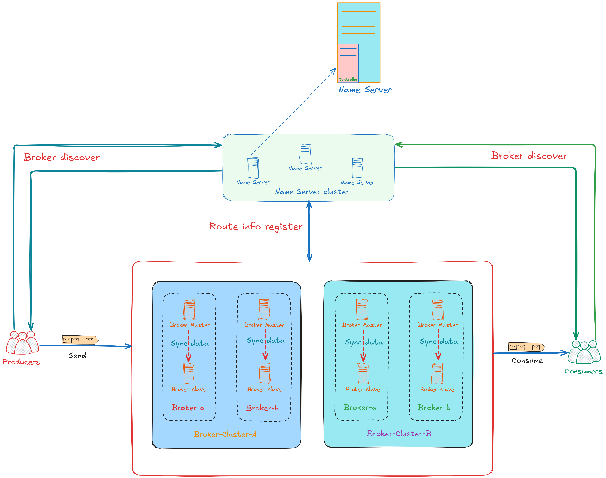

<p align="center">
    
</p>

<div align="center">

[](https://github.com/mxsm/rocketmq-rust/commits/main)
[](https://crates.io/crates/rocketmq-rust)
[](https://docs.rs/rocketmq-rust)
[](https://github.com/mxsm/rocketmq-rust/actions)
[![CodeCov][codecov-image]][codecov-url] [](https://github.com/mxsm/rocketmq-rust/graphs/contributors) [](#license)
<br/>


[](https://deepwiki.com/mxsm/rocketmq-rust)

</div>

<div align="center">
  <a href="https://trendshift.io/repositories/12176" target="_blank"></a>
  <a href="https://trendshift.io/developers/3818" target="_blank"></a>
</div>

# RocketMQ-Rust

🚀 一个高性能、可靠且功能丰富的 [Apache RocketMQ](https://github.com/apache/rocketmq) **非官方 Rust 实现**，旨在将企业级消息中间件引入 Rust 生态系统。

<div align="center">

[](#-概述)
[](#-快速开始)
[](#-文档)
[](#-组件--crate)
<br/>
[](#️-路线图)
[](#-贡献)
[](#社区--支持)

</div>

---

## ✨ 概述

**RocketMQ-Rust** 是 Apache RocketMQ 的完整 Rust 重新实现，利用 Rust 在内存安全、零成本抽象和无畏并发方面的独特优势。该项目旨在为 Rust 开发者提供一个生产就绪的分布式消息队列系统，在保持与 RocketMQ 协议完全兼容的同时，提供卓越的性能。

### 🎯 为什么选择 RocketMQ-Rust？

- **🦀 内存安全**：基于 Rust 的所有权模型，在编译时消除空指针解引用、缓冲区溢出和数据竞争等整类错误
- **⚡ 高性能**：零成本抽象和高效的异步运行时，以最小的资源开销提供卓越的吞吐量
- **🔒 线程安全**：无畏并发支持安全并行处理，没有竞争条件的风险
- **🌐 跨平台**：在 Linux、Windows 和 macOS 上提供一流支持，每个平台都有原生性能
- **🔌 生态系统集成**：与 Rust 丰富的生态系统无缝集成，包括 Tokio、Serde 和其他现代库
- **📦 生产就绪**：经过实战验证的架构，具有全面的错误处理和可观察性

## 🏗️ 架构

<p align="center">
  
</p>

RocketMQ-Rust 实现了分布式架构，包含以下核心组件：

- **Name Server**：轻量级服务发现和路由协调
- **Broker**：消息存储和传递引擎，支持主题、队列和消费者组
- **Producer Client**：高性能消息发布，支持多种发送模式
- **Consumer Client**：灵活的消息消费，支持推送和拉取模式
- **Store**：高效的本地存储引擎，针对顺序写入进行了优化
- **Controller**（开发中）：高级高可用性和故障转移能力

## 📚 文档

- **📖 官方文档**：[rocketmqrust.com](https://rocketmqrust.com) - 综合指南、API 参考和最佳实践
- **🤖 AI 驱动文档**：[DeepWiki](https://deepwiki.com/mxsm/rocketmq-rust) - 带有智能搜索的交互式文档
- **📝 API 文档**：[docs.rs/rocketmq-rust](https://docs.rs/rocketmq-rust) - 完整的 API 文档
- **📋 示例**：[rocketmq-client/examples](https://github.com/mxsm/rocketmq-rust/tree/main/rocketmq-client/examples) - 可运行的代码示例

## 🚀 快速开始

### 前置要求

- Rust 工具链 1.85.0 或更高版本（stable 或 nightly）
- 对消息队列概念的基本了解

### 安装

将客户端 SDK 添加到您的 `Cargo.toml`：

```toml
[dependencies]
rocketmq-client-rust = "0.9.0"
```

或者针对特定组件：

```toml
[dependencies]
# 客户端 SDK（Producer 和 Consumer）
rocketmq-client-rust = "0.9.0"

# 核心工具和数据结构
rocketmq-common = "0.9.0"

# 低级运行时抽象
rocketmq-rust = "0.9.0"
```

### 启动 Name Server

```bash
# 使用默认配置启动（监听 0.0.0.0:9876）
cargo run --bin rocketmq-namesrv-rust

# 或者指定自定义主机和端口
cargo run --bin rocketmq-namesrv-rust -- --ip 127.0.0.1 --port 9876

# 查看所有选项
cargo run --bin rocketmq-namesrv-rust -- --help
```

### 启动 Broker

```bash
# 设置 ROCKETMQ_HOME 环境变量（必需）
export ROCKETMQ_HOME=/path/to/rocketmq  # Linux/macOS
set ROCKETMQ_HOME=D:\rocketmq           # Windows

# 使用默认配置启动 broker
cargo run --bin rocketmq-broker-rust

# 使用自定义 name server 地址启动
cargo run --bin rocketmq-broker-rust -- -n "127.0.0.1:9876"

# 使用自定义配置文件启动
cargo run --bin rocketmq-broker-rust -- -c ./conf/broker.toml

# 查看所有选项
cargo run --bin rocketmq-broker-rust -- --help
```

### 发送第一条消息

```rust
use rocketmq_client_rust::producer::default_mq_producer::DefaultMQProducer;
use rocketmq_client_rust::producer::mq_producer::MQProducer;
use rocketmq_client_rust::Result;
use rocketmq_common::common::message::message_single::Message;

#[tokio::main]
async fn main() -> Result<()> {
    // 创建生产者实例
    let mut producer = DefaultMQProducer::builder()
        .producer_group("example_producer_group")
        .name_server_addr("127.0.0.1:9876")
        .build();

    // 启动生产者
    producer.start().await?;

    // 创建并发送消息
    let message = Message::builder()
        .topic("TestTopic")
        .body("Hello RocketMQ from Rust!".as_bytes().to_vec())
        .build();

    let send_result = producer.send(message).await?;
    println!("消息已发送: {:?}", send_result);

    // 关闭生产者
    producer.shutdown().await;
    Ok(())
}
```

更多示例包括批量发送、事务和消费者模式，请查看：
- [发送单条消息](https://github.com/mxsm/rocketmq-rust/blob/main/rocketmq-client/README.md#send-a-single-message)
- [批量发送消息](https://github.com/mxsm/rocketmq-rust/blob/main/rocketmq-client/README.md#send-batch-messages)
- [RPC 消息](https://github.com/mxsm/rocketmq-rust/blob/main/rocketmq-client/README.md#send-rpc-messages)
- [所有示例](https://github.com/mxsm/rocketmq-rust/tree/main/rocketmq-client/examples)

## 📦 组件 & Crate

RocketMQ-Rust 组织为具有以下 crate 的单体仓库：

| Crate                                        | 描述                                | 状态            |
|----------------------------------------------|-------------------------------------|-----------------|
| [rocketmq](./rocketmq)                       | 核心库和主入口点                    | ✅ 生产环境      |
| [rocketmq-namesrv](./rocketmq-namesrv)       | 服务发现的 Name server              | ✅ 生产环境      |
| [rocketmq-broker](./rocketmq-broker)         | 消息代理和存储引擎                  | ✅ 生产环境      |
| [rocketmq-client](./rocketmq-client)         | Producer 和 Consumer SDK            | ✅ 生产环境      |
| [rocketmq-store](./rocketmq-store)           | 本地存储实现                        | ✅ 生产环境      |
| [rocketmq-remoting](./rocketmq-remoting)     | 网络通信层                          | ✅ 生产环境      |
| [rocketmq-common](./rocketmq-common)         | 通用工具和数据结构                  | ✅ 生产环境      |
| [rocketmq-runtime](./rocketmq-runtime)       | 异步运行时抽象                      | ✅ 生产环境      |
| [rocketmq-filter](./rocketmq-filter)         | 消息过滤引擎                        | ✅ 生产环境      |
| [rocketmq-auth](./rocketmq-auth)             | 认证和授权                          | ✅ 生产环境      |
| [rocketmq-error](./rocketmq-error)           | 错误类型和处理                      | ✅ 生产环境      |
| [rocketmq-macros](./rocketmq-macros)         | 过程宏和派生宏                      | ✅ 生产环境      |
| [rocketmq-controller](./rocketmq-controller) | 高可用控制器                        | 🚧 开发中       |
| [rocketmq-proxy](./rocketmq-proxy)           | 协议代理层                          | 🚧 开发中       |
| [rocketmq-example](./rocketmq-example)       | 示例应用程序和演示                  | ✅ 生产环境      |
| [rocketmq-tools](./rocketmq-tools)           | 命令行工具和实用程序                | 🚧 开发中       |
| ├─ [rocketmq-admin](./rocketmq-tools/rocketmq-admin) | 集群管理的管理工具         | 🚧 开发中       |
| │  ├─ [rocketmq-admin-core](./rocketmq-tools/rocketmq-admin/rocketmq-admin-core) | 核心管理功能 | 🚧 开发中 |
| │  └─ [rocketmq-admin-tui](./rocketmq-tools/rocketmq-admin/rocketmq-admin-tui) | 管理操作的终端 UI | 🚧 开发中 |
| └─ [rocketmq-store-inspect](./rocketmq-tools/rocketmq-store-inspect) | 存储检查工具 | ✅ 生产环境 |
| [rocketmq-dashboard](./rocketmq-dashboard)   | 管理仪表板和 UI                     | 🚧 开发中       |
| ├─ [rocketmq-dashboard-common](./rocketmq-dashboard/rocketmq-dashboard-common) | 共享仪表板组件 | 🚧 开发中 |
| ├─ [rocketmq-dashboard-gpui](./rocketmq-dashboard/rocketmq-dashboard-gpui) | 基于 GPUI 的桌面仪表板 | 🚧 开发中 |
| └─ [rocketmq-dashboard-tauri](./rocketmq-dashboard/rocketmq-dashboard-tauri) | 基于 Tauri 的跨平台仪表板 | 🚧 开发中 |

## 🗺️ 路线图

我们的开发遵循 RocketMQ 架构，重点关注：

- [x] **核心消息**：主题管理、消息存储和基本发布/订阅
- [x] **客户端 SDK**：支持异步的 Producer 和 Consumer API
- [x] **Name Server**：服务发现和路由
- [x] **Broker**：消息持久化和传递保证
- [ ] **消息过滤**：基于标签和 SQL92 的过滤
- [ ] **事务**：分布式事务消息支持
- [ ] **控制器模式**：基于 Raft 共识的增强高可用性
- [ ] **分层存储**：云原生分层存储实现
- [ ] **代理**：多协议网关支持
- [ ] **可观察性**：指标、跟踪和监控集成

详细的进度和计划功能，请参阅我们的[路线图](resources/rocektmq-rust-roadmap.excalidraw)。

## 💡 特性与亮点

### 性能

- **高吞吐量**：针对每秒数百万条消息进行了优化
- **低延迟**：通过异步 I/O 实现亚毫秒级消息发布
- **内存高效**：智能内存管理，尽可能实现零拷贝
- **并发处理**：充分利用多核处理器

### 可靠性

- **数据持久性**：可配置的消息持久化，支持 fsync 控制
- **消息顺序**：消息队列内的 FIFO 顺序保证
- **故障恢复**：自动故障转移和恢复机制
- **幂等性**：内置去重支持

### 开发者体验

- **直观的 API**：符合人体工程学的 Rust API，采用构建器模式
- **类型安全**：强类型防止运行时错误
- **丰富的示例**：常见用例的综合示例
- **活跃开发**：定期更新和社区支持

## 🧪 开发

### 从源代码构建

```bash
# 克隆仓库
git clone https://github.com/mxsm/rocketmq-rust.git
cd rocketmq-rust

# 构建所有组件
cargo build --release

# 运行测试
cargo test

# 运行特定组件
cargo run --bin rocketmq-namesrv-rust
cargo run --bin rocketmq-broker-rust
```

### 运行测试

```bash
# 运行所有测试
cargo test --workspace

# 运行特定 crate 的测试
cargo test -p rocketmq-client

# 带日志运行测试
RUST_LOG=debug cargo test
```

### 代码质量

```bash
# 格式化代码
cargo fmt

# 运行 clippy
cargo clippy --all-targets --all-features

# 检查文档
cargo doc --no-deps --open
```

## 🤝 贡献

我们欢迎社区贡献！无论是修复错误、添加功能、改进文档还是分享想法，您的输入都很有价值。

### 如何贡献

1. **Fork** 仓库
2. **创建** 功能分支（`git checkout -b feature/amazing-feature`）
3. **提交** 您的更改（`git commit -m 'Add amazing feature'`）
4. **推送** 到分支（`git push origin feature/amazing-feature`）
5. **打开** Pull Request

### 贡献指南

- 遵循 Rust 最佳实践和惯用模式
- 为新功能添加测试
- 根据需要更新文档
- 在提交 PR 之前确保 CI 通过
- 使用有意义的提交消息

详细指南，请阅读我们的[贡献指南](https://rocketmqrust.com/docs/contribute-guide/)。

### 开发资源


## ❓ 常见问题

<details>
<summary><b>RocketMQ-Rust 是否生产就绪？</b></summary>

是的，核心组件（NameServer、Broker、客户端 SDK）已生产就绪并积极维护。Controller 和 Proxy 模块仍在开发中。
</details>

<details>
<summary><b>是否与 Apache RocketMQ 兼容？</b></summary>

是的，RocketMQ-Rust 实现了 RocketMQ 协议，可以与 Apache RocketMQ Java 客户端和服务器互操作。
</details>

<details>
<summary><b>最低支持的 Rust 版本（MSRV）是什么？</b></summary>

最低支持的 Rust 版本是 1.85.0（stable 或 nightly）。
</details>

<details>
<summary><b>性能与 Java RocketMQ 相比如何？</b></summary>

RocketMQ-Rust 利用 Rust 的零成本抽象和高效的异步运行时，以较低的内存占用提供相当或更好的性能。基准测试可在各个组件文档中找到。
</details>

<details>
<summary><b>可以与现有的 RocketMQ 部署一起使用吗？</b></summary>

可以，您可以将 RocketMQ-Rust 组件与 Java RocketMQ 一起部署。例如，您可以在 Java broker 上使用 Rust 客户端，反之亦然。
</details>

<details>
<summary><b>如何从 Java RocketMQ 迁移到 RocketMQ-Rust？</b></summary>

迁移可以增量完成：
1. 首先在现有 Java broker 上使用 Rust 客户端 SDK
2. 逐步用 Rust 实现替换 broker
3. 迁移期间两种实现可以共存

有关详细步骤，请参阅我们的[迁移指南](https://rocketmqrust.com)。
</details>

## 👥 社区 & 支持

- **💬 讨论**：[GitHub Discussions](https://github.com/mxsm/rocketmq-rust/discussions) - 提问和分享想法
- **🐛 问题**：[GitHub Issues](https://github.com/mxsm/rocketmq-rust/issues) - 报告错误或请求功能
- **📧 联系**：联系 [mxsm@apache.org](mailto:mxsm@apache.org)

### 贡献者

感谢所有贡献者！🙏

<a href="https://github.com/mxsm/rocketmq-rust/graphs/contributors">
  
</a>

### Star 历史

[](https://star-history.com/#mxsm/rocketmq-rust&Date)

## 📄 许可证

RocketMQ-Rust 采用双重许可证：

- **Apache License 2.0** ([LICENSE-APACHE](LICENSE-APACHE) 或 http://www.apache.org/licenses/LICENSE-2.0)
- **MIT License** ([LICENSE-MIT](LICENSE-MIT) 或 http://opensource.org/licenses/MIT)

您可以选择任一许可证进行使用。

## 🙏 致谢

- **Apache RocketMQ 社区** 提供原始 Java 实现和设计
- **Rust 社区** 提供优秀的工具和库
- **所有贡献者** 帮助改进这个项目

---

<p align="center">
  <sub>由 RocketMQ-Rust 社区用 ❤️ 构建</sub>
</p>

[codecov-image]: https://codecov.io/gh/mxsm/rocketmq-rust/branch/main/graph/badge.svg
[codecov-url]: https://codecov.io/gh/mxsm/rocketmq-rust
