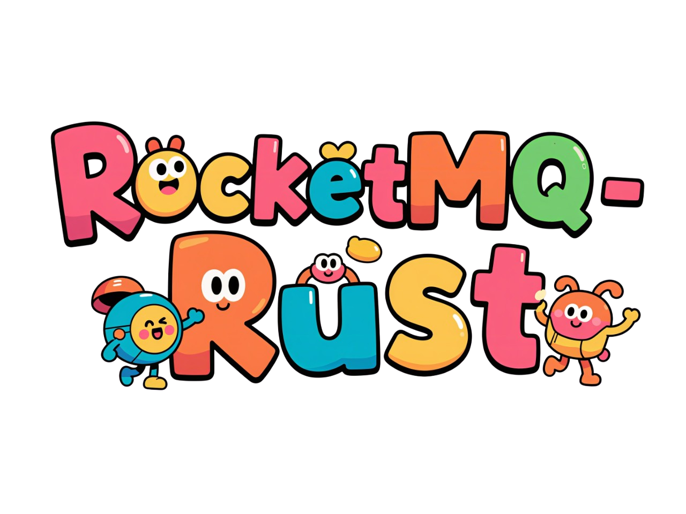
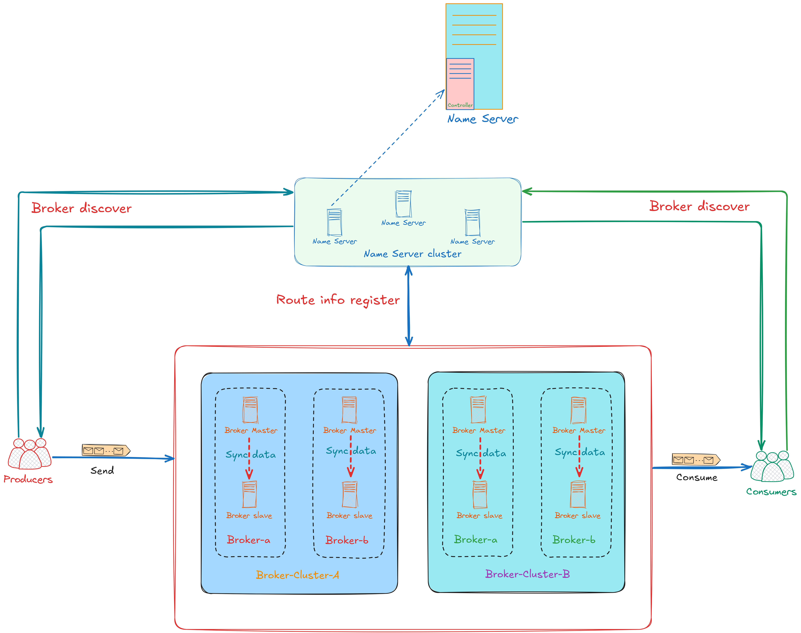

<p align="center">
    
</p>

<div align="center">
    
[](https://github.com/mxsm/rocketmq-rust/commits/main)
[](https://crates.io/crates/rocketmq-rust)
[](https://docs.rs/rocketmq-rust)
[](https://github.com/mxsm/rocketmq-rust/actions)
[![CodeCov][codecov-image]][codecov-url] [](https://github.com/mxsm/rocketmq-rust/graphs/contributors) [](#license) 
<br/>


[](https://deepwiki.com/mxsm/rocketmq-rust)

</div>

<div align="center">
  <a href="https://trendshift.io/repositories/12176" target="_blank"></a>
  <a href="https://trendshift.io/developers/3818" target="_blank"></a>
</div>

# RocketMQ-Rust

🚀 A high-performance, reliable, and feature-rich **unofficial Rust implementation** of [Apache RocketMQ](https://github.com/apache/rocketmq), designed to bring enterprise-grade message middleware to the Rust ecosystem.

<div align="center">
    
[](#-overview)
[](#-quick-start)
[](#-documentation)
[](#-components--crates)
<br/>
[](#️-roadmap)
[](#-contributing)
[](#-community--support)

</div>

---

## ✨ Overview

**RocketMQ-Rust** is a complete reimplementation of Apache RocketMQ in Rust, leveraging Rust's unique advantages in memory safety, zero-cost abstractions, and fearless concurrency. This project aims to provide Rust developers with a production-ready distributed message queue system that delivers exceptional performance while maintaining full compatibility with the RocketMQ protocol.

### 🎯 Why RocketMQ-Rust?

- **🦀 Memory Safety**: Built on Rust's ownership model, eliminating entire classes of bugs like null pointer dereferences, buffer overflows, and data races at compile time
- **⚡ High Performance**: Zero-cost abstractions and efficient async runtime deliver exceptional throughput with minimal resource overhead
- **🔒 Thread Safety**: Fearless concurrency enables safe parallel processing without the risk of race conditions
- **🌐 Cross-Platform**: First-class support for Linux, Windows, and macOS with native performance on each platform
- **🔌 Ecosystem Integration**: Seamlessly integrates with the rich Rust ecosystem including Tokio, Serde, and other modern libraries
- **📦 Production Ready**: Battle-tested architecture with comprehensive error handling and observability

## 🏗️ Architecture

<p align="center">
  
</p>

RocketMQ-Rust implements a distributed architecture with the following core components:

- **Name Server**: Lightweight service discovery and routing coordination
- **Broker**: Message storage and delivery engine with support for topics, queues, and consumer groups  
- **Producer Client**: High-performance message publishing with various sending modes
- **Consumer Client**: Flexible message consumption with push and pull models
- **Store**: Efficient local storage engine optimized for sequential writes
- **Controller** (In Development): Advanced high availability and failover capabilities

## 📚 Documentation

- **📖 Official Documentation**: [rocketmqrust.com](https://rocketmqrust.com) - Comprehensive guides, API references, and best practices
- **🤖 AI-Powered Docs**: [DeepWiki](https://deepwiki.com/mxsm/rocketmq-rust) - Interactive documentation with intelligent search
- **📝 API Docs**: [docs.rs/rocketmq-rust](https://docs.rs/rocketmq-rust) - Complete API documentation
- **📋 Examples**: [rocketmq-client/examples](https://github.com/mxsm/rocketmq-rust/tree/main/rocketmq-client/examples) - Ready-to-run code samples

## 🚀 Quick Start

### Prerequisites

- Rust toolchain 1.85.0 or later (stable or nightly)
- Basic familiarity with message queue concepts

### Installation

Add the client SDK to your `Cargo.toml`:

```toml
[dependencies]
rocketmq-client-rust = "0.8.0"
```

Or for specific components:

```toml
[dependencies]
# Client SDK (Producer & Consumer)
rocketmq-client-rust = "0.8.0"

# Core utilities and data structures
rocketmq-common = "0.8.0"

# Low-level runtime abstractions
rocketmq-rust = "0.8.0"
```

### Start Name Server

```bash
# Start with default configuration (listening on 0.0.0.0:9876)
cargo run --bin rocketmq-namesrv-rust

# Or specify custom host and port
cargo run --bin rocketmq-namesrv-rust -- --ip 127.0.0.1 --port 9876

# View all options
cargo run --bin rocketmq-namesrv-rust -- --help
```

### Start Broker

```bash
# Set ROCKETMQ_HOME environment variable (required)
export ROCKETMQ_HOME=/path/to/rocketmq  # Linux/macOS
set ROCKETMQ_HOME=D:\rocketmq           # Windows

# Start broker with default configuration
cargo run --bin rocketmq-broker-rust

# Start with custom name server address
cargo run --bin rocketmq-broker-rust -- -n "127.0.0.1:9876"

# Start with custom configuration file
cargo run --bin rocketmq-broker-rust -- -c ./conf/broker.toml

# View all options
cargo run --bin rocketmq-broker-rust -- --help
```

### Send Your First Message

```rust
use rocketmq_client_rust::producer::default_mq_producer::DefaultMQProducer;
use rocketmq_client_rust::producer::mq_producer::MQProducer;
use rocketmq_client_rust::Result;
use rocketmq_common::common::message::message_single::Message;

#[tokio::main]
async fn main() -> Result<()> {
    // Create producer instance
    let mut producer = DefaultMQProducer::builder()
        .producer_group("example_producer_group")
        .name_server_addr("127.0.0.1:9876")
        .build();
    
    // Start producer
    producer.start().await?;
    
    // Create and send message
    let message = Message::builder()
        .topic("TestTopic")
        .body("Hello RocketMQ from Rust!".as_bytes().to_vec())
        .build();
    
    let send_result = producer.send(message).await?;
    println!("Message sent: {:?}", send_result);
    
    // Shutdown producer
    producer.shutdown().await;
    Ok(())
}
```

For more examples including batch sending, transactions, and consumer patterns, check out:
- [Send single messages](https://github.com/mxsm/rocketmq-rust/blob/main/rocketmq-client/README.md#send-a-single-message)
- [Send batch messages](https://github.com/mxsm/rocketmq-rust/blob/main/rocketmq-client/README.md#send-batch-messages)
- [RPC messaging](https://github.com/mxsm/rocketmq-rust/blob/main/rocketmq-client/README.md#send-rpc-messages)
- [All examples](https://github.com/mxsm/rocketmq-rust/tree/main/rocketmq-client/examples)

## 📦 Components & Crates

RocketMQ-Rust is organized as a monorepo with the following crates:

| Crate | Description | Status |
|-------|-------------|--------|
| [rocketmq-namesrv](./rocketmq-namesrv) | Name server for service discovery | ✅ Production |
| [rocketmq-broker](./rocketmq-broker) | Message broker and storage engine | ✅ Production |
| [rocketmq-client](./rocketmq-client) | Producer and consumer SDK | ✅ Production |
| [rocketmq-store](./rocketmq-store) | Local storage implementation | ✅ Production |
| [rocketmq-remoting](./rocketmq-remoting) | Network communication layer | ✅ Production |
| [rocketmq-common](./rocketmq-common) | Common utilities and data structures | ✅ Production |
| [rocketmq-runtime](./rocketmq-runtime) | Async runtime abstractions | ✅ Production |
| [rocketmq-filter](./rocketmq-filter) | Message filtering engine | ✅ Production |
| [rocketmq-auth](./rocketmq-auth) | Authentication and authorization | ✅ Production |
| [rocketmq-controller](./rocketmq-controller) | High availability controller | 🚧 In Development |
| [rocketmq-proxy](./rocketmq-proxy) | Protocol proxy layer | 🚧 In Development |
| [rocketmq-cli](./rocketmq-cli) | Command-line tools | ✅ Production |
| [rocketmq-tui](./rocketmq-tui) | Terminal UI for management | 🚧 In Development |

## 🗺️ Roadmap

Our development follows the RocketMQ architecture with focus on:

- [x] **Core Messaging**: Topic management, message storage, and basic publish/subscribe
- [x] **Client SDK**: Producer and consumer APIs with async support
- [x] **Name Server**: Service discovery and routing
- [x] **Broker**: Message persistence and delivery guarantees
- [ ] **Message Filtering**: Tag-based and SQL92 filtering
- [ ] **Transactions**: Distributed transaction message support
- [ ] **Controller Mode**: Enhanced high availability with Raft consensus
- [ ] **Tiered Storage**: Cloud-native tiered storage implementation  
- [ ] **Proxy**: Multi-protocol gateway support
- [ ] **Observability**: Metrics, tracing, and monitoring integration

For detailed progress and planned features, see our [roadmap diagram](resources/rocektmq-rust-roadmap.excalidraw).

## 💡 Features & Highlights

### Performance

- **High Throughput**: Optimized for millions of messages per second
- **Low Latency**: Sub-millisecond message publishing with async I/O
- **Memory Efficient**: Smart memory management with zero-copy where possible
- **Concurrent Processing**: Fully leverages multi-core processors

### Reliability

- **Data Durability**: Configurable message persistence with fsync control
- **Message Ordering**: FIFO ordering guarantees within message queues
- **Failure Recovery**: Automatic failover and recovery mechanisms
- **Idempotency**: Built-in deduplication support

### Developer Experience

- **Intuitive API**: Ergonomic Rust APIs with builder patterns
- **Type Safety**: Strong typing prevents runtime errors
- **Rich Examples**: Comprehensive examples for common use cases
- **Active Development**: Regular updates and community support

## 🧪 Development

### Building from Source

```bash
# Clone the repository
git clone https://github.com/mxsm/rocketmq-rust.git
cd rocketmq-rust

# Build all components
cargo build --release

# Run tests
cargo test

# Run specific component
cargo run --bin rocketmq-namesrv-rust
cargo run --bin rocketmq-broker-rust
```

### Running Tests

```bash
# Run all tests
cargo test --workspace

# Run tests for specific crate
cargo test -p rocketmq-client

# Run with logging
RUST_LOG=debug cargo test
```

### Code Quality

```bash
# Format code
cargo fmt

# Run clippy
cargo clippy --all-targets --all-features

# Check documentation
cargo doc --no-deps --open
```

## 🤝 Contributing

We welcome contributions from the community! Whether you're fixing bugs, adding features, improving documentation, or sharing ideas, your input is valuable.

### How to Contribute

1. **Fork** the repository
2. **Create** a feature branch (`git checkout -b feature/amazing-feature`)
3. **Commit** your changes (`git commit -m 'Add amazing feature'`)
4. **Push** to the branch (`git push origin feature/amazing-feature`)
5. **Open** a Pull Request

### Contribution Guidelines

- Follow Rust best practices and idiomatic patterns
- Add tests for new functionality
- Update documentation as needed
- Ensure CI passes before submitting PR
- Use meaningful commit messages

For detailed guidelines, please read our [Contribution Guide](https://rocketmqrust.com/docs/contribute-guide/).

### Development Resources


## ❓ FAQ

<details>
<summary><b>Is RocketMQ-Rust production-ready?</b></summary>

Yes, core components (NameServer, Broker, Client SDK) are production-ready and actively maintained. Controller and Proxy modules are still in development.
</details>

<details>
<summary><b>Is it compatible with Apache RocketMQ?</b></summary>

Yes, RocketMQ-Rust implements the RocketMQ protocol and can interoperate with Apache RocketMQ Java clients and servers.
</details>

<details>
<summary><b>What's the minimum supported Rust version (MSRV)?</b></summary>

The minimum supported Rust version is 1.85.0 (stable or nightly).
</details>

<details>
<summary><b>How does performance compare to Java RocketMQ?</b></summary>

RocketMQ-Rust leverages Rust's zero-cost abstractions and efficient async runtime to deliver comparable or better performance with lower memory footprint. Benchmarks are available in individual component documentation.
</details>

<details>
<summary><b>Can I use it with existing RocketMQ deployments?</b></summary>

Yes, you can deploy RocketMQ-Rust components alongside Java RocketMQ. For example, you can use Rust clients with Java brokers, or vice versa.
</details>

<details>
<summary><b>How can I migrate from Java RocketMQ to RocketMQ-Rust?</b></summary>

Migration can be done incrementally:
1. Start by using Rust client SDK with existing Java brokers
2. Gradually replace brokers with Rust implementation
3. Both implementations can coexist during migration

Refer to our [migration guide](https://rocketmqrust.com) for detailed steps.
</details>

## 👥 Community & Support

- **💬 Discussions**: [GitHub Discussions](https://github.com/mxsm/rocketmq-rust/discussions) - Ask questions and share ideas
- **🐛 Issues**: [GitHub Issues](https://github.com/mxsm/rocketmq-rust/issues) - Report bugs or request features
- **📧 Contact**: Reach out to [mxsm@apache.org](mailto:mxsm@apache.org)

### Contributors

Thanks to all our contributors! 🙏

<a href="https://github.com/mxsm/rocketmq-rust/graphs/contributors">
  
</a>

### Star History

[](https://star-history.com/#mxsm/rocketmq-rust&Date)

## 📄 License

RocketMQ-Rust is dual-licensed under:

- **Apache License 2.0** ([LICENSE-APACHE](LICENSE-APACHE) or http://www.apache.org/licenses/LICENSE-2.0)
- **MIT License** ([LICENSE-MIT](LICENSE-MIT) or http://opensource.org/licenses/MIT)

You may choose either license for your use.

## 🙏 Acknowledgments

- **Apache RocketMQ Community** for the original Java implementation and design
- **Rust Community** for excellent tooling and libraries
- **All Contributors** who have helped make this project better

---

<p align="center">
  <sub>Built with ❤️ by the RocketMQ-Rust community</sub>
</p>

[codecov-image]: https://codecov.io/gh/mxsm/rocketmq-rust/branch/main/graph/badge.svg
[codecov-url]: https://codecov.io/gh/mxsm/rocketmq-rust

