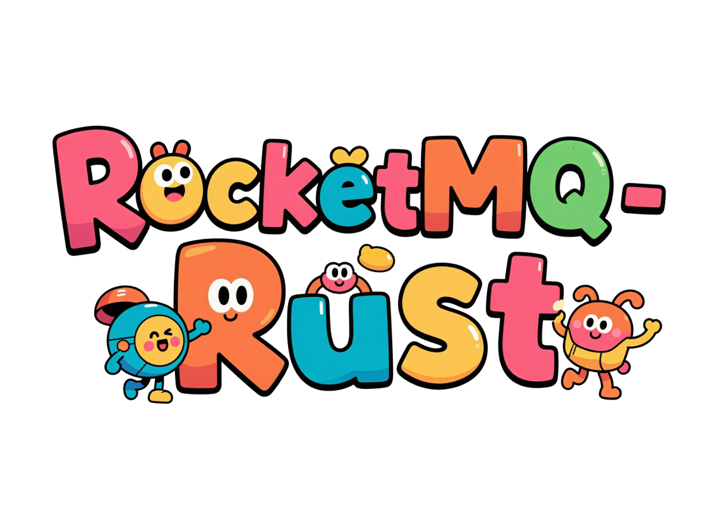

<p align="center">
    
    
</p>

<div align="center">

[](https://github.com/mxsm/rocketmq-rust/commits/main)
[](https://crates.io/crates/rocketmq-client-rust)
[](https://docs.rs/rocketmq-client-rust)
[](https://hub.docker.com/u/mxsm)
[](https://github.com/mxsm/rocketmq-rust/actions/workflows/rocketmq-rust-ci.yaml)
[](https://github.com/mxsm/rocketmq-rust/actions/workflows/deploy.yml)
[](https://github.com/mxsm/rocketmq-rust/actions/workflows/website-check.yml)
[![CodeCov][codecov-image]][codecov-url] [](https://github.com/mxsm/rocketmq-rust/graphs/contributors) [](#-license)
<br/>


[](https://deepwiki.com/mxsm/rocketmq-rust)

</div>

<div align="center">
  <a href="https://trendshift.io/repositories/12176" target="_blank"></a>
  <a href="https://trendshift.io/developers/3818" target="_blank"></a>
</div>

# RocketMQ-Rust

[English](README.md) | [简体中文](README-zh_cn.md)

🚀 A high-performance, reliable, and feature-rich **unofficial Rust implementation** of [Apache RocketMQ](https://github.com/apache/rocketmq), designed to bring enterprise-grade message middleware to the Rust ecosystem.

<div align="center">

[](#-overview)
[](#-quick-start)
[](#-documentation)
[](#-components--crates)
<br/>
[](#-deployment)
[](#-contributing)
[](#-faq)
[](#-community--support)

</div>

---

## ✨ Overview

**RocketMQ-Rust** reimplements Apache RocketMQ in Rust: the NameServer, Broker, Controller and Proxy services, an async client SDK, and the tooling to operate them. It keeps RocketMQ's model of topics, queues, consumer groups and NameServer routing, speaks the RocketMQ remoting protocol, and serves the gRPC `MessagingService` through its Proxy, while relying on Rust's ownership model for memory safety and on Tokio for asynchronous I/O.

> **Status:** `1.0.0` is the current stable release. All 28 workspace crates are published on [crates.io](https://crates.io/crates/rocketmq-client-rust), and 13 container images are published on [Docker Hub](https://hub.docker.com/u/mxsm) and [GHCR](https://github.com/mxsm?tab=packages&repo_name=rocketmq-rust). RocketMQ-Rust is an independent community distribution, not an official Apache Software Foundation release.

### 🎯 Why RocketMQ-Rust?

- **🦀 Memory Safety**: Rust's ownership model removes whole classes of bugs such as use-after-free and data races at compile time, with no garbage-collection pauses
- **⚡ Async by Design**: Services and clients run on Tokio with explicit runtime ownership, bounded queues and admission control, and graceful shutdown that reports what it stopped
- **🔁 RocketMQ Compatible**: Implements the remoting wire protocol and the gRPC `MessagingService`, and converts existing Java Broker `.properties` files; Apache RocketMQ 5.5.0 is the comparison baseline
- **💾 Pluggable Storage**: Local CommitLog and ConsumeQueue files by default, with optional RocksDB and tiered storage backends
- **🔒 Secure and Observable**: ACL authentication and authorization, TLS transport, and OpenTelemetry metrics, traces and logs with OTLP and Prometheus exporters
- **🛠️ Operations Included**: Admin CLI and terminal UI, web and desktop dashboards, container images, Helm charts and Kubernetes manifests
- **🤖 AI-Ready Operations**: A read-only MCP server for diagnostics, a separately controlled MCP server for supervised changes, and an AI SRE platform
- **🌐 Cross-Platform**: Built and tested in CI on Linux, Windows and macOS

## 🏗️ Architecture

<p align="center">
  
</p>

RocketMQ-Rust is built from the components below. A minimal cluster needs only a NameServer, a Broker and a client; the rest is optional.

- **NameServer**: Broker registration, liveness tracking and topic route lookup
- **Broker**: Request processing, topic and consumer-group metadata, message storage and delivery
- **Store**: The storage engine inside the Broker, with CommitLog, ConsumeQueue and index files plus optional RocksDB and tiered backends
- **Client SDK**: Producers and push, lite pull and POP consumers for Rust applications
- **Proxy**: gRPC and optional remoting ingress, in front of a cluster or with an embedded Broker
- **Controller**: OpenRaft-based master election and replica coordination for controller-mode high availability
- **Operations tooling**: Admin CLI and TUI, dashboards and MCP servers, all off the message path

The [architecture overview](https://rocketmqrust.com/docs/architecture/overview) covers the message lifecycle, storage and high-availability design.

## 📚 Documentation

- **📖 Official Documentation**: [rocketmqrust.com](https://rocketmqrust.com) - Getting started, architecture, configuration, deployment and operations guides, in English and Chinese
- **📝 API Docs**: [docs.rs/rocketmq-client-rust](https://docs.rs/rocketmq-client-rust) - API reference for the client SDK
- **📋 Examples**: [rocketmq-example](./rocketmq-example) and [rocketmq-client/examples](./rocketmq-client/examples) - Ready-to-run producer and consumer samples
- **🧭 Design Documents**: [rocketmq-doc](./rocketmq-doc) - Architecture decision records, protocol notes and migration guides
- **📦 Releases**: [GitHub Releases](https://github.com/mxsm/rocketmq-rust/releases) and [CHANGELOG.md](CHANGELOG.md) - Release notes and change history
- **🤖 AI-Powered Docs**: [DeepWiki](https://deepwiki.com/mxsm/rocketmq-rust) - Interactive documentation with intelligent search

## 🚀 Quick Start

Run a single-node cluster from source and exchange messages. Every listener binds to `127.0.0.1`, and the Broker keeps its data in the git-ignored `.rocketmq/` directory.

### Prerequisites

- Git and a Rust toolchain installed through [rustup](https://rustup.rs); the repository pins Rust 1.95.0 in `rust-toolchain.toml`
- A C/C++ build toolchain for native dependencies: MSVC Build Tools on Windows, Xcode Command Line Tools on macOS, or GCC/Clang on Linux
- Free TCP ports `9876`, `10909`, `10911` and `10912`, and about 1.5 GB of disk space for the Broker's preallocated store files

```bash
git clone https://github.com/mxsm/rocketmq-rust.git
cd rocketmq-rust
```

Run every command below from the repository root, with each service in its own terminal. The first build takes several minutes.

### 1. Start the NameServer

```bash
cargo run -p rocketmq-namesrv --bin rocketmq-namesrv-rust -- --rocketmqHome .rocketmq --bindAddress 127.0.0.1
```

The NameServer listens on `127.0.0.1:9876`. It needs a home directory: pass `--rocketmqHome` or set `ROCKETMQ_HOME`, otherwise it exits during startup.

### 2. Start the Broker

Create the `.rocketmq` directory and save this configuration as `.rocketmq/broker.toml`:

```toml
[broker]
namesrvAddr = "127.0.0.1:9876"
brokerIp1 = "127.0.0.1"
storePathRootDir = "./.rocketmq/broker"

[broker.brokerServerConfig]
bindAddress = "127.0.0.1"

[store]
storePathRootDir = "./.rocketmq/store"
haListenAddress = "127.0.0.1"
```

```bash
cargo run -p rocketmq-broker --bin rocketmq-broker-rust -- -c .rocketmq/broker.toml
```

Wait for the `started successfully` log line. The Broker registers with the NameServer and listens on `127.0.0.1:10911`. Without a configuration file it binds to all interfaces, advertises an auto-detected address and stores its data under `~/store`.

### 3. Send and Receive Messages

```bash
cargo run -p rocketmq-client-rust --example simple-producer
```

The producer sends ten messages to `TopicTest`, which the Broker creates on first use, and exits. Then start the consumer:

```bash
cargo run -p rocketmq-client-rust --example consumer
```

The consumer prints the ten messages and keeps waiting for more. Press `Ctrl+C` to stop it.

### 4. Stop and Clean Up

Press `Ctrl+C` in the Broker terminal, let its shutdown finish, then stop the NameServer the same way. Delete `.rocketmq/` to discard the data.

> This walkthrough runs without authentication or TLS, which is why every listener stays on loopback. Read the [deployment security guide](https://rocketmqrust.com/docs/deployment/security) before exposing a service to a network.

### Use the Client SDK in Your Application

Add the client and the three crates it is used with:

```toml
[dependencies]
rocketmq-client-rust = "1.0.0"
rocketmq-model = "1.0.0"
rocketmq-runtime = "1.0.0"
rocketmq-observability = "1.0.0"
```

The application owns the runtime and hands it to every client. A minimal producer:

```rust
use rocketmq_client_rust::{ClientRuntime, ClientRuntimeConfig, DefaultMQProducer};
use rocketmq_model::common::message::message_single::Message;
use rocketmq_observability::TelemetryRuntimeGuard;
use rocketmq_runtime::RuntimeOwner;

fn main() -> Result<(), Box<dyn std::error::Error>> {
    // The application owns the runtime; the client never creates a hidden one.
    let owner = RuntimeOwner::new()?;
    let telemetry = TelemetryRuntimeGuard::noop();
    let client_runtime = ClientRuntime::try_new(
        owner.root_context().component("example-client"),
        ClientRuntimeConfig::default(),
        telemetry.handle(),
    )?;

    let (sent, client_report) = owner.block_on(async {
        let mut producer = DefaultMQProducer::builder(client_runtime.clone())
            .producer_group("example_producer_group")
            .name_server_addr("127.0.0.1:9876")
            .build();
        let sent = async {
            producer.start().await?;
            let message = Message::builder()
                .topic("TopicTest")
                .body_slice(b"Hello RocketMQ")
                .build()?;
            producer.send_with_timeout(message, 3000).await
        }
        .await;
        // Shut down in order: producer, shared client runtime, then the owner.
        producer.shutdown().await;
        (sent, client_runtime.shutdown().await)
    });
    let runtime_report = owner.shutdown_runtime_blocking()?;

    println!("send result: {:?}", sent?);
    if !client_report.is_healthy() || !runtime_report.is_healthy() {
        return Err("client shutdown did not complete cleanly".into());
    }
    Ok(())
}
```

Consumers follow the same ownership pattern. Continue with:

- [Client guide](./rocketmq-client) - Push and lite pull consumer examples, Cargo features and TLS
- [First-message tutorial](https://rocketmqrust.com/docs/getting-started/quick-start) - The same path with an explicitly created topic and consumer group
- [rocketmq-example](./rocketmq-example) - Ordered, delayed, transactional, batch and request/reply messaging
- [Rust API migration guide](https://rocketmqrust.com/docs/migration/rust-api) - Source changes when upgrading from 0.x

## 📦 Components & Crates

The root Cargo workspace contains 28 crates, all published on crates.io at the workspace version. Directory and package names match, except that the `rocketmq-client` directory holds the `rocketmq-client-rust` package. Dashboards, AI operations products, examples and the website are standalone projects with their own manifests.

### Core Runtime Services

| Crate | Responsibility |
|-------|----------------|
| [rocketmq-namesrv](./rocketmq-namesrv) | NameServer for Broker registration, liveness tracking, topic routing and KV configuration. Binary: `rocketmq-namesrv-rust`. |
| [rocketmq-broker](./rocketmq-broker) | Broker for request processing, topic and consumer-group metadata, message storage, delivery and HA integration. Binary: `rocketmq-broker-rust`. |
| [rocketmq-controller](./rocketmq-controller) | Controller for OpenRaft consensus, master election and replica metadata. Binary: `rocketmq-controller-rust`. |
| [rocketmq-proxy](./rocketmq-proxy) | Proxy runtime exposing the gRPC `MessagingService` and an optional remoting ingress. Binary: `rocketmq-proxy-rust`. |
| [rocketmq-proxy-core](./rocketmq-proxy-core) | Backend-neutral proxy contracts, protobuf bindings and ingress/session state. |
| [rocketmq-proxy-cluster](./rocketmq-proxy-cluster) | Cluster-mode proxy adapter that reaches NameServers and Brokers through the client SDK. |
| [rocketmq-proxy-local](./rocketmq-proxy-local) | Local-mode proxy adapter backed by an embedded Broker. |

### Client, Protocol, and Shared Libraries

| Crate | Responsibility |
|-------|----------------|
| [rocketmq-client](./rocketmq-client) | Async client SDK with producers, transaction producers, push and lite pull consumers, and optional admin APIs. |
| [rocketmq-protocol](./rocketmq-protocol) | RocketMQ wire contracts: request and response codes, remoting command frames, typed headers and bodies. |
| [rocketmq-transport](./rocketmq-transport) | Bounded TCP/TLS transport with connection admission, dispatch and request deadlines. |
| [rocketmq-model](./rocketmq-model) | Runtime-neutral domain types for messages, queues, topics and results. |
| [rocketmq-auth](./rocketmq-auth) | Authentication and ACL authorization: access-key signatures, ACL files, users and policies. |
| [rocketmq-security-api](./rocketmq-security-api) | Shared security contracts for principals, request policies, secret providers and bootstrap checks. |
| [rocketmq-filter](./rocketmq-filter) | Tag and SQL92 message filtering, expression evaluation and Bloom filter utilities. |

### Storage, Runtime, and Observability

| Crate | Responsibility |
|-------|----------------|
| [rocketmq-store](./rocketmq-store) | Broker-facing storage layer for CommitLog, ConsumeQueue, index, timer messages, POP checkpoints and HA replication. |
| [rocketmq-store-api](./rocketmq-store-api) | Backend-neutral storage contracts for append, read, lifecycle, replication, checkpoint and health capabilities. |
| [rocketmq-store-local](./rocketmq-store-local) | Local-file primitives: mapped files, flush, recovery, consume queues and indexes. |
| [rocketmq-store-rocksdb](./rocketmq-store-rocksdb) | Optional RocksDB-backed derived state for consume queues, indexes, timers and transactions. |
| [rocketmq-tieredstore](./rocketmq-tieredstore) | Optional tiered storage that dispatches older messages to a secondary storage layer and fetches them back. |
| [rocketmq-runtime](./rocketmq-runtime) | Runtime substrate on Tokio: runtime ownership, tracked tasks, scheduling, bounded blocking execution and shutdown reports. |
| [rocketmq-error](./rocketmq-error) | Shared error kernel with typed causes, stable descriptors and redaction-safe views. |
| [rocketmq-macros](./rocketmq-macros) | Procedural macros for protocol types and request headers. |
| [rocketmq-observability](./rocketmq-observability) | Logging, metrics and tracing with optional OpenTelemetry, OTLP and Prometheus exporters. |

### Operations Tooling

| Crate | Responsibility |
|-------|----------------|
| [rocketmq-admin-cli](./rocketmq-tools/rocketmq-admin/rocketmq-admin-cli) | Command-line administration with a Java `mqadmin`-compatible command surface. |
| [rocketmq-admin-tui](./rocketmq-tools/rocketmq-admin/rocketmq-admin-tui) | Interactive terminal UI for the same administration commands. |
| [rocketmq-admin-core](./rocketmq-tools/rocketmq-admin/rocketmq-admin-core) | Presentation-independent admin services shared by the CLI, TUI, dashboards and MCP. |
| [rocketmq-store-inspect](./rocketmq-tools/rocketmq-store-inspect) | Offline CommitLog inspection, downgrade preflight and multipath consolidation. Binary: `rocketmq-cli-rust`. |
| [rocketmq-dashboard-common](./rocketmq-dashboard/rocketmq-dashboard-common) | Shared dashboard models and services. |

<p align="center">
  
</p>

### Standalone Projects

These projects live in this repository but outside the root workspace. Build each one from its own directory.

| Project | Responsibility |
|---------|----------------|
| [rocketmq-example](./rocketmq-example) | Client examples covering send modes, ordered, delayed and transactional messages, request/reply, and push, lite pull and POP consumers. |
| [rocketmq-dashboard-web](./rocketmq-dashboard/rocketmq-dashboard-web) | Web dashboard with a Rust backend and a React frontend. |
| [rocketmq-dashboard-gpui](./rocketmq-dashboard/rocketmq-dashboard-gpui) | Native desktop dashboard built with GPUI. |
| [rocketmq-dashboard-tauri](./rocketmq-dashboard/rocketmq-dashboard-tauri) | Cross-platform desktop dashboard built with Tauri and React. |
| [rocketmq-mcp](./rocketmq-ai/rocketmq-mcp) | Read-only Model Context Protocol server for cluster diagnostics. |
| [rocketmq-mcp-control](./rocketmq-ai/rocketmq-mcp-control) | Isolated, deny-by-default MCP server for supervised cluster changes. |
| [rocketmq-sre](./rocketmq-ai/rocketmq-sre) | AI SRE platform for evidence collection, diagnostics, planning and controlled automation. |
| [rocketmq-website](./rocketmq-website) | Docusaurus source of [rocketmqrust.com](https://rocketmqrust.com). |
| [fuzz](./fuzz) | `cargo-fuzz` targets for protocol, configuration, controller snapshot and store recovery inputs. |

## 💡 Capabilities

| Area | What it provides |
|------|------------------|
| Messaging services | NameServer, Broker, Controller and Proxy with TOML configuration, health probes and graceful shutdown. The Broker also loads Java `.properties` files. |
| Message types | Normal, ordered, delayed and timer, transactional, batch and request/reply messages, plus message recall. |
| Producing | Synchronous, callback and one-way sends, batching and custom queue selection. |
| Consuming | Push consumers with concurrent or orderly listeners, lite pull and POP consumption, clustering and broadcasting, tag and SQL92 filtering. |
| Protocol | RocketMQ remoting commands, headers and serialization, and the gRPC `MessagingService` through the Proxy. |
| Storage | Local CommitLog, ConsumeQueue and index files by default, with optional RocksDB and tiered storage. |
| High availability | Master/replica replication with synchronous or asynchronous acknowledgement, and controller-mode failover built on OpenRaft. |
| Security | Access-key authentication, ACL authorization, TLS transport and security bootstrap profiles. |
| Observability | Structured logging, OpenTelemetry metrics, traces and logs, OTLP and Prometheus exporters. |
| Operations | Admin CLI and TUI, offline store inspection, web and desktop dashboards, MCP servers and AI SRE. |

Availability depends on Cargo features, runtime configuration and the selected storage backend or topology. The [capability matrix](https://rocketmqrust.com/docs/overview/capability-matrix) lists the conditions for each capability.

## 🚢 Deployment

| Option | What you get | Start here |
|--------|--------------|------------|
| From source | Service binaries built with Cargo on Linux, Windows or macOS. | [Installation](https://rocketmqrust.com/docs/getting-started/installation) |
| Container images | 13 `linux/amd64` images per release, with Cosign signatures and CycloneDX SBOM attestations on Docker Hub. | [Containers](https://rocketmqrust.com/docs/deployment/containers) |
| Kubernetes | Helm charts and Kustomize manifests under [distribution](./distribution). | [Kubernetes](https://rocketmqrust.com/docs/deployment/kubernetes) |
| High availability | Master/replica or controller-managed Broker groups. | [High availability](https://rocketmqrust.com/docs/deployment/high-availability) |

Release images use the same component names in both registries:

```text
docker.io/mxsm/rocketmq-rust-<component>:<version>
ghcr.io/mxsm/rocketmq-rust/<component>:<version>
```

The components are `namesrv`, `broker`, `controller`, `proxy`, `mcp`, `dashboard-web-backend`, `dashboard-web-frontend`, `sre-control-plane`, `sre-connector`, `sre-executor`, `sre-execution-agent`, `sre-probe` and `sre-ui`. Images ship without deployment configuration: a core service reads `/etc/rocketmq/<component>.toml` and keeps its data under `/var/lib/rocketmq`, so mount both. See the [release and image guide](rocketmq-doc/en/releasing.md) for details.

## 🧪 Build & Validation

Cargo selects packages by name, so use `rocketmq-client-rust` for the `rocketmq-client` directory.

| Task | Command |
|------|---------|
| Check one crate | `cargo check -p rocketmq-broker` |
| Test one crate | `cargo test -p rocketmq-client-rust` |
| Run a single test | `cargo test -p rocketmq-namesrv <test_name>` |
| Check formatting of one crate | `cargo fmt -p rocketmq-broker -- --check` |
| Lint one crate | `cargo clippy -p rocketmq-broker --no-deps -- -D warnings` |
| Build the workspace | `cargo build --workspace` |
| Test the workspace | `cargo test --workspace` |
| Build local API documentation | `cargo doc --workspace --no-deps` |

A full workspace build also compiles RocksDB and the Proxy's protobuf bindings, so it additionally needs Clang (libclang) and `protoc`, either on `PATH` or through the `PROTOC` environment variable. Standalone projects under `rocketmq-example/`, `rocketmq-dashboard/`, `rocketmq-ai/`, `rocketmq-website/` and `fuzz/` are built and validated from their own directories.

## 🤝 Contributing

We welcome contributions from the community! Whether you're fixing bugs, adding features, improving documentation, or sharing ideas, your input is valuable.

### How to Contribute

1. **Pick** an [open issue](https://github.com/mxsm/rocketmq-rust/issues) or create one from the [issue templates](https://github.com/mxsm/rocketmq-rust/issues/new/choose); issues labeled [good first issue](https://github.com/mxsm/rocketmq-rust/issues?q=is%3Aissue+is%3Aopen+label%3A%22good+first+issue%22) are scoped for newcomers
2. **Fork** the repository and create a branch from `main`
3. **Change** one thing at a time, add or update tests, and run the [checks](#-build--validation) for the crates you touched
4. **Record** user-visible changes under **Unreleased** in [CHANGELOG.md](CHANGELOG.md)
5. **Open** a Pull Request against `main` that links the issue, with a title such as `[ISSUE #1234]📝Clarify consumer offset completion`

### Contribution Guidelines

- Follow Rust best practices and the engineering rules in [AGENTS.md](AGENTS.md), which apply to people and AI coding agents alike
- Add tests for new functionality
- Update documentation as needed
- Keep pull requests focused and leave unrelated code untouched
- Follow the [Code of Conduct](CODE_OF_CONDUCT.md)

For detailed guidelines, please read [CONTRIBUTING.md](CONTRIBUTING.md) and our [Contribution Guide](https://rocketmqrust.com/docs/contributing/overview).

### Repository Activity


## ❓ FAQ

<details>
<summary><b>Is RocketMQ-Rust production-ready?</b></summary>

`1.0.0` is the first stable release. The services ship with health probes, graceful shutdown, security profiles and observability, but production readiness also depends on your workload, topology and failure model. Validate the message paths you rely on and work through the [production checklist](https://rocketmqrust.com/docs/deployment/production-checklist) before going live.
</details>

<details>
<summary><b>Is it compatible with Apache RocketMQ?</b></summary>

RocketMQ-Rust implements the RocketMQ remoting protocol and, through the Proxy, the gRPC `MessagingService`, with Apache RocketMQ 5.5.0 as the comparison baseline. Compatibility is defined per surface, not as a blanket guarantee: the Controller runs its own OpenRaft protocol and cannot join a Java Controller quorum, DLedger is not supported, and a Java Broker's data directory is not a drop-in store. See the [protocol and compatibility reference](https://rocketmqrust.com/docs/reference/protocol-compatibility).
</details>

<details>
<summary><b>What's the minimum supported Rust version (MSRV)?</b></summary>

Rust 1.95.0. Every workspace manifest declares it as `rust-version`, and `rust-toolchain.toml` pins the same stable version for builds.
</details>

<details>
<summary><b>How does performance compare to Java RocketMQ?</b></summary>

No head-to-head figures are published, because throughput depends on hardware, storage, message size, and flush and replication policy. The Criterion benchmarks in the crates (`cargo bench -p <package>`) track regressions in individual components. For sizing, measure your own workload and read [capacity and performance](https://rocketmqrust.com/docs/operations/capacity-performance).
</details>

<details>
<summary><b>Can I use it with existing RocketMQ deployments?</b></summary>

Yes, at the client boundary. A Rust application can use `rocketmq-client-rust` against existing NameServers and Brokers over the remoting protocol, and gRPC clients can connect through the Proxy. Verify the operations you depend on against your exact server version, ACL and TLS settings. Rust and Java services do not share Controller quorums or data directories.
</details>

<details>
<summary><b>How can I migrate from Java RocketMQ to RocketMQ-Rust?</b></summary>

Choose the migration boundary first, because each one is a different operation:

1. Move applications to the Rust client SDK while keeping the existing cluster
2. Run a separate Rust cluster and shift traffic to it step by step
3. Replay or bridge historical data explicitly instead of reusing a Java data directory

The Broker can load an existing Java `broker.properties` file and report how each setting was converted. Refer to the [migration guide](https://rocketmqrust.com/docs/migration/java-to-rust) for detailed steps.
</details>

## 👥 Community & Support

- **💬 Discussions**: [GitHub Discussions](https://github.com/mxsm/rocketmq-rust/discussions) - Ask questions and share ideas
- **🐛 Issues**: [GitHub Issues](https://github.com/mxsm/rocketmq-rust/issues) - Report bugs or request features
- **📧 Contact**: Reach out to [mxsm@apache.org](mailto:mxsm@apache.org)

### Contributors

Thanks to all our contributors! 🙏

<a href="https://github.com/mxsm/rocketmq-rust/graphs/contributors">
  
</a>

## 📄 License

RocketMQ-Rust is licensed under the **Apache License 2.0**.

See [LICENSE-APACHE](LICENSE-APACHE) and [NOTICE](NOTICE), or http://www.apache.org/licenses/LICENSE-2.0.

## 🙏 Acknowledgments

- **Apache RocketMQ Community** for the original Java implementation and design
- **Rust Community** for excellent tooling and libraries
- **All Contributors** who have helped make this project better

---

<p align="center">
  <sub>Built with ❤️ by the RocketMQ-Rust community</sub>
</p>

[codecov-image]: https://codecov.io/gh/mxsm/rocketmq-rust/branch/main/graph/badge.svg

[codecov-url]: https://codecov.io/gh/mxsm/rocketmq-rust
