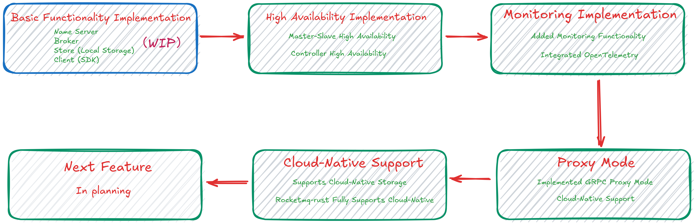

# rocketmq-rust

 [](https://crates.io/crates/rocketmq-rust) [](https://docs.rs/rocketmq-rust) [](https://github.com/mxsm/rocketmq-rust/actions) [![CodeCov][codecov-image]][codecov-url]    

Welcome to [Apache Rocketmq](https://github.com/apache/rocketmq) Rust implementation (Unofficial ). **RocketMQ-Rust** is
a reimplementation of the Apache RocketMQ message middleware in the Rust language. This project aims to provide Rust
developers with a high-performance and reliable message queue service, making full use of the features of the Rust
language.


### RocketMQ-Rust Features

- **Rust Language Advantages:** Leveraging the benefits of Rust, such as memory safety, zero-cost abstractions, and high
  concurrency performance, RocketMQ-Rust offers an efficient and reliable message middleware.
- **Asynchronous and Non-blocking Design:** RocketMQ-Rust takes full advantage of Rust's asynchronous programming
  capabilities, adopting a non-blocking design that supports high-concurrency message processing.
- **Ecosystem Integration:** As part of the Rust ecosystem, RocketMQ-Rust integrates well with other libraries and
  frameworks within the Rust ecosystem, providing flexible integration options for developers.
- **Cross-platform Support:** RocketMQ-Rust supports multiple platforms, including Linux, Windows, macOS, making it
  convenient for use in different environments.

## Roadmap



## Getting Started

### Requirements

1. rust toolchain MSRV is 1.75.(stable,nightly)

### Run name server

**Run the following command to see usage：**

- **windows platform**

  ```cmd
  cargo run --bin rocketmq-namesrv-rust -- --help
  
  RocketMQ Name server(Rust)
  
  Usage: rocketmq-namesrv-rust.exe [OPTIONS]
  
  Options:
    -p, --port <PORT>  rocketmq name server port [default: 9876]
    -i, --ip <IP>      rocketmq name server ip [default: 127.0.0.1]
    -h, --help         Print help
    -V, --version      Print version
  ```

- **Linux platform**

  ```shell
  $ cargo run --bin rocketmq-namesrv-rust -- --help
  
  RocketMQ Name server(Rust)
  
  Usage: rocketmq-namesrv-rust [OPTIONS]
  
  Options:
    -p, --port <PORT>  rocketmq name server port [default: 9876]
    -i, --ip <IP>      rocketmq name server ip [default: 127.0.0.1]
    -h, --help         Print help
    -V, --version      Print version
  ```

Run the following command to start the name server

```shell
cargo run --bin rocketmq-namesrv-rust
```

### Run Borker

**Run the following command to see usage：**

- **windows platform**

  ```shell
  cargo run --bin rocketmq-broker-rust -- --help
  
  RocketMQ Broker Server(Rust)
  
  Usage: rocketmq-broker-rust.exe [OPTIONS]
  
  Options:
    -c, --config-file <FILE>      Broker config properties file
    -m, --print-important-config  Print important config item
    -n, --namesrv-addr <IP>       Name server address list, eg: '192.168.0.1:9876;192.168.0.2:9876' [default: 127.0.0.1:9876]
    -p, --print-config-item       Print all config item
    -h, --help                    Print help
    -V, --version                 Print version
  ```


- **Linux platform**

  ```shell
  $ cargo run --bin rocketmq-broker-rust -- --help
  
  RocketMQ Broker Server(Rust)
  
  Usage: rocketmq-broker-rust [OPTIONS]
  
  Options:
    -c, --config-file <FILE>      Broker config properties file
    -m, --print-important-config  Print important config item
    -n, --namesrv-addr <IP>       Name server address list, eg: '192.168.0.1:9876;192.168.0.2:9876' [default: 127.0.0.1:9876]
    -p, --print-config-item       Print all config item
    -h, --help                    Print help
    -V, --version                 Print version
  ```

Run the following command to start the name server

```shell
cargo run --bin rocketmq-broker-rust
```

## Client how to send message

First, start the RocketMQ NameServer and Broker services.

- [**Send a single message**](https://github.com/mxsm/rocketmq-rust/blob/main/rocketmq-client/README.md#Send-a-single-message)

- [**Send batch messages**](https://github.com/mxsm/rocketmq-rust/blob/main/rocketmq-client/README.md#Send-batch-messages)

- [**Send RPC messages**](https://github.com/mxsm/rocketmq-rust/blob/main/rocketmq-client/README.md#Send-RPC-messages)

[**For more examples, you can check here**](https://github.com/mxsm/rocketmq-rust/tree/main/rocketmq-client/examples)

## Modules

The existing RocketMQ has the following functional modules:

- [**Name Server**](https://github.com/mxsm/rocketmq-rust/tree/main/rocketmq-namesrv)
- [**Broker**](https://github.com/mxsm/rocketmq-rust/tree/main/rocketmq-broker)
- [**Store (Local Storage)**](https://github.com/mxsm/rocketmq-rust/tree/main/rocketmq-store)
- **Controller (High Availability)**
- [**Client (SDK)**](https://github.com/mxsm/rocketmq-rust/tree/main/rocketmq-client)
- **Proxy**
- **Tiered Store (Tiered Storage Module)**

The specific functions of each module can be referred to in
the [official RocketMQ documentation](https://github.com/apache/rocketmq/tree/develop/docs). The Rust implementation
will be carried out sequentially in the following order.

## Contributing

Contributions to code, issue reporting, and suggestions are welcome. The development of RocketMQ-Rust relies on the
support of developers. Let's collaborate to advance Rust in the message middleware domain.


<a href="https://github.com/mxsm/rocketmq-rust/graphs/contributors">
  
</a>

[](https://api.star-history.com/svg?repos=mxsm/rocketmq-rust&type=Date)

## License

RocketMQ-Rust is licensed under the [Apache License 2.0](https://github.com/mxsm/rocketmq-rust/blob/main/LICENSE-APACHE)
and [MIT license](https://github.com/mxsm/rocketmq-rust/blob/main/LICENSE-MIT)


[codecov-image]: https://codecov.io/gh/mxsm/rocketmq-rust/branch/main/graph/badge.svg

[codecov-url]: https://codecov.io/gh/mxsm/rocketmq-rust

