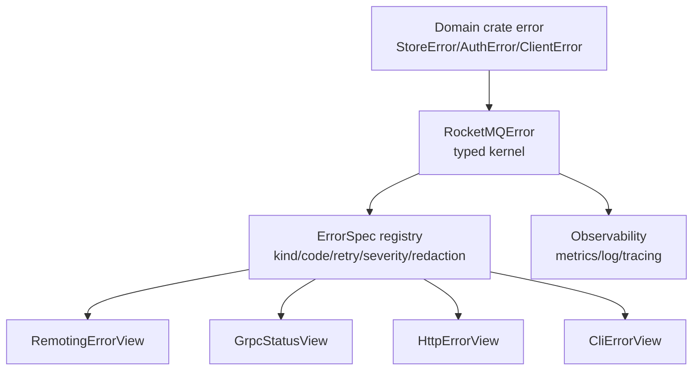

# RocketMQ Rust 错误架构分析与 95+ 重构报告

> 分析日期：2026-07-05  
> 分析范围：根 Cargo workspace、`rocketmq-error`、核心业务 crate、边界适配代码、独立 dashboard/backend 项目中的错误处理模式。  
> 原始结论摘要：项目已经完成从早期松散错误模型向集中 typed error kernel 的关键迁移，但仍存在 `Internal(String)` 兜底过多、边界响应映射未完全收敛、部分库代码保留 `anyhow`、动态错误对象和源错误链丢失等问题。原始错误架构评分为 **82/100**；按本文方案完成后可达到 **95+/100**。

## 0. 2026-07-06 完成状态

错误架构重构已经按 checklist 收口，当前验证评分为 **96/100**。评分提升依据不是主观声明，而是以下已合入的代码、文档和 CI 证据：

- `scripts/error_architecture_guard.py` 已进入 `.github/workflows/rocketmq-rust-ci.yaml`，作为 hard fail 执行。
- `scripts/check-error-hygiene.ps1` 已提供本地 Windows 入口，并复用同一套 Python guard。
- `docs/07-error-hygiene-allowlist.md` 记录 allowlist 类别、原因和清理策略。
- `docs/error-codes.md` 记录当前 `ErrorSpec` registry 的全部 stable error code；guard 会检查该文档覆盖 `ErrorKind::code()` 中的全部 code。
- `CONTRIBUTING.md` 已包含新增错误 checklist，覆盖 typed result、`ErrorSpec`、boundary mapping、redaction 和 source chain。
- remoting、gRPC、HTTP、CLI/admin view 的默认边界路径已统一到 `BoundaryErrorView` 或 `ErrorSpec`。
- client callback、producer callback、rebalance、broker schedule、transaction queue、store group commit、store HA 等动态错误热点已迁移到 typed error。
- 旧 API 精确源码扫描保持 0 命中：`RocketmqError`、`LegacyRocketMQResult`、`LegacyResult`。
- public `anyhow::Result` alias 源码扫描保持 0 命中。
- 剩余 `anyhow`、`RocketMQError::Internal`、source stringification 和 direct response mapping 均由 guard 的已审计 allowlist 约束。

当前仍保留的少量非 typed 表面主要是协议兼容、CLI/app/bootstrap、OpenRaft trait、FFI 或测试上下文，已进入 allowlist，不再计为架构性阻塞项。

## 1. 原始基线评分

| 维度 | 分值 | 评分 | 主要判断 |
| --- | ---: | ---: | --- |
| 中央错误内核 | 20 | 18 | `RocketMQError`、`ErrorKind`、`ErrorSpec`、`RocketMQResult` 已经形成统一核心；旧式 `RocketmqError`、legacy result alias 和公开 `anyhow::Result` alias 已清理。 |
| 边界适配一致性 | 20 | 16 | Remoting、gRPC、HTTP dashboard、CLI 已接入 `ErrorSpec`；但 broker/proxy/remoting 仍有不少直接选择 `ResponseCode`、`Status` 或字符串 remark 的路径。 |
| 领域错误精确度 | 20 | 13 | store/auth/controller/client 等 crate 仍保留大量字符串型错误、`Internal(String)` 和 `.to_string()` 转换，错误类型不足以稳定表达业务语义。 |
| 源错误链和可观测性 | 20 | 16 | `#[source]`、`ErrorContext`、`RecoverySpec`、`ObserveSpec` 已具备；但多处 `map_err(|e| ... e.to_string())` 会截断 source chain。 |
| API 卫生和迁移完成度 | 20 | 19 | public API 已明显优于旧状态；剩余问题集中在 app/bin 边界以外的 `anyhow`、`Box<dyn Error>` 回调和兼容 alias。 |
| **总分** | **100** | **82** | 架构方向正确，基础设施已经到位；主要欠账是迁移完整性和边界强制约束。 |

## 2. 扫描证据

以下统计来自本地源码扫描，排除了 `target`，并尽量排除了 tests/benches/examples。计数是风险信号，不代表每一处都是缺陷。

| 信号 | 命中数 | 文件数 | 解读 |
| --- | ---: | ---: | --- |
| 精确旧类型 `RocketmqError` / `LegacyRocketMQResult` / `LegacyResult` | 0 | 0 | 旧错误 API 的主迁移已经完成。 |
| `pub type Result<T> = anyhow::Result<T>` | 0 | 0 | `rocketmq-error` 不再公开 `anyhow` result alias。 |
| `RocketMQError` 类型使用 | 2490 | 278 | 中央错误类型已经成为主路径。 |
| `RocketMQResult` alias 使用 | 3551 | 388 | typed result 已成为主路径。 |
| `anyhow::Result` | 27 | 18 | 多数在 bin/app 边界可接受；少数仍在库代码和运行时任务中。 |
| `anyhow!` / `bail!` | 17 | 6 | 需要区分启动入口和库内部；库内部应迁移到 typed error。 |
| `Box<dyn Error>` | 52 | 25 | 回调、hook、HA、future 等动态错误路径仍会削弱错误分类。 |
| `RocketMQError::Internal` / `Internal(String)` / `General(String)` 类信号 | 344 | 77 | 当前最主要的错误语义退化来源。 |
| `.to_string()` in `map_err` | 208 | 61 | 很多路径会丢失 source chain 和机器可读分类。 |
| 直接 response/status 映射信号 | 约 1400+ | 90+ | 包含合法协议代码和生成代码，但也显示边界映射仍未完全收敛到统一 adapter。 |

## 3. 已经做得好的部分

### 3.1 中央错误模型已经成立

`rocketmq-error` 现在包含清晰的 typed error kernel：

- `RocketMQError` 作为统一错误载体；
- `RocketMQResult<T>` 指向 `std::result::Result<T, RocketMQError>`；
- `ErrorKind`、`ErrorCode`、`ErrorScope`、`ErrorCategory` 形成机器可读分类；
- `ErrorSpec` 统一描述 remoting、gRPC、HTTP、CLI、恢复建议、可观测性和脱敏策略；
- `ErrorContext` 和 `Sensitive<T>` 为结构化上下文和脱敏提供基础。

这说明项目已经不再处于“每个 crate 自己随意定义错误边界”的早期状态。

### 3.2 旧式错误 API 已基本退出 Rust 源码

本次扫描没有发现精确的：

- `RocketmqError`
- `LegacyRocketMQResult`
- `LegacyResult`
- `pub type Result<T> = anyhow::Result<T>`

这比旧版错误 inventory 中记录的状态更好，说明错误架构迁移已经持续推进。

### 3.3 边界适配开始中心化

已看到以下正向模式：

- `rocketmq-remoting/src/error_response.rs` 使用 `error.spec().remoting.code` 构造 remoting 响应；
- `rocketmq-proxy/src/status.rs` 对 `RocketMQError` 使用 `error.spec().grpc`；
- dashboard web backend 的 `DashboardError::RocketMq` 使用 `error.spec().http.status`、`error.spec().code` 和 `public_message()`；
- CLI error view 使用 `ErrorSpec` 和 redacted context。

这证明 `ErrorSpec` 不只是静态清单，而是已经进入真实边界。

### 3.4 敏感信息保护已经有基础

`SessionCredentials` 的 `Debug` 和 `Display` 已经对 `secret_key`、`signature`、`security_token` 做 redaction；`rocketmq-error` 也提供了 `Sensitive<T>`、`REDACTED` 和 `ErrorContext::with_sensitive`。

这解决了最常见的凭证直接格式化泄漏风险。

## 4. 主要问题

### P1. `Internal(String)` 仍是过强兜底，削弱 typed error 的价值

当前仍存在大量类似模式：

- 配置解析失败被包装成 `RocketMQError::Internal(e.to_string())`；
- unknown property、downcast failure、spawn failure、存储路径失败、admin 操作失败被放入 `Internal(String)`；
- auth、store、controller 等本地错误枚举仍保留 `Internal(String)`、`General(String)` 或 `ConfigurationError(String)`。

影响：

- 机器无法判断错误是否可重试、是否是配置错误、权限错误、存储错误或协议错误；
- source chain 被 `.to_string()` 截断；
- `ErrorSpec` 中的 retry/severity/observe/redact 元数据无法发挥全部价值；
- 边界只能输出 generic internal error，排障成本上升。

典型优化方向：

- 配置解析：迁移到 `ConfigParseFailed`、`ConfigInvalidValue`、`ConfigMissingRequired`；
- downcast/runtime failure：迁移到 `RuntimeTaskFailed`、`InternalInvariantViolated` 等明确类别；
- 存储失败：迁移到 `StorageReadFailed`、`StorageWriteFailed`、`StorageCorrupted`，并保留 `#[source]`；
- 权限失败：迁移到 auth 领域专用错误，不再借用 broker permission 语义。

### P1. Remoting 默认 remark 存在过度暴露风险

`error_response::command_from_error()` 当前默认使用 `error.to_string()` 作为 remark。即使 `RocketMQError` 已经有 `public_message()` 和 redacted context，直接使用 `Display` 仍可能把内部路径、配置值、第三方错误详情或操作上下文返回给远端。

影响：

- 协议边界的错误信息不完全受 `ErrorSpec` 和 redaction policy 约束；
- 某些内部错误可能被客户端或代理直接观察到；
- 与 HTTP/gRPC/CLI 已经采用 public view 的方向不一致。

建议：

- remoting 边界默认使用 `error.public_message()`；
- 需要详细信息时，只追加 redacted `ErrorContext`；
- `command_from_error_with_remark()` 保留给调用者显式传入已审计的 public remark；
- 添加测试保证 sensitive context 和 internal message 不进入 remoting remark。

### P1. 边界响应映射仍有分散实现

虽然已有 `ErrorSpec` 和局部 adapter，但 broker、proxy、remoting processor 中仍存在大量直接 response/status 映射信号。部分是协议常量或生成代码，部分则是业务路径绕过了统一 adapter。

影响：

- 同一错误在 remoting/gRPC/HTTP/CLI 可能表现不一致；
- 新增错误类型时需要在多个地方补映射；
- CI 很难保证所有边界都遵守 retry、severity、redaction 策略。

建议：

- 所有跨进程边界统一从 `RocketMQError` 或 domain error 转到 `BoundaryErrorView`；
- 禁止业务 processor 直接决定 `ResponseCode`，除非该代码是成功响应或协议级固定分支；
- 为 remoting、gRPC、HTTP、CLI 分别保留极薄 adapter，但映射元数据只来自 `ErrorSpec`。

### P2. 库代码仍混入 `anyhow`

`anyhow` 在 bin、CLI、dashboard app 入口中可以接受；但在库 crate 内部，例如调度、remoting server、store HA 或运行时任务中使用 `anyhow::Result`，会让错误分类在进入业务层前丢失。

建议边界：

- `bin/`、`examples/`、纯 app bootstrap：允许 `anyhow`；
- workspace library、public trait、callback、async task result：使用 `RocketMQResult` 或领域 result；
- 如果异步任务需要 erase 类型，使用 `RocketMQError` 或 `Arc<RocketMQError>`，不要使用 `anyhow::Error`。

### P2. `Box<dyn Error>` 回调削弱错误契约

当前 callback、hook、future、HA 等路径仍有 `Box<dyn std::error::Error + Send + Sync>`。这种设计适合临时兼容，但不适合作为稳定项目内部错误契约。

影响：

- 调用方只能做字符串化或 downcast；
- 错误分类和 retry 策略无法稳定传播；
- 异步任务错误在 observability 中难以聚合。

建议：

- 内部 callback 改为 `RocketMQError` 或领域 error；
- 对外兼容 API 可临时保留 boxed error，但内部立即转换成 typed error；
- hook context 中的异常字段应使用 `Arc<RocketMQError>` 或 `Option<RocketMQError>`。

### P2. `map_err(|e| e.to_string())` 丢失 source chain

大量错误转换通过 `.to_string()` 进入 `String` 字段。这会破坏 Rust error chain 的核心优势。

建议：

- 对 IO、serde、config、rocksdb、tonic 等底层错误使用 `#[source]`；
- 对无法直接暴露的第三方错误使用 typed wrapper，例如 `ConfigSourceError { file, key, source }`；
- 只有 boundary public message 才应该字符串化，业务层不应提前字符串化。

### P2. Auth 错误语义映射不够准确

`AuthorizationError::PermissionDenied` 当前会映射到 `BrokerPermissionDenied { operation: message }`。这能工作，但语义上把 authz 决策伪装成 broker 操作权限。

建议增加或启用专用类别：

- `AuthAuthenticationFailed`
- `AuthAuthorizationDenied`
- `AuthPolicyInvalid`
- `AuthStorageUnavailable`

同时在 `ErrorSpec` 中定义这些错误的 remoting/gRPC/HTTP/CLI 表达。

### P3. `unwrap` / `expect` 需要分级审计

扫描中 `unwrap` / `expect` 数量较高。很多位于测试、生成代码、协议不变量或一次性 bootstrap 中，不应简单视为缺陷；但 UI、配置解析、网络路径、存储路径中的 panic 会影响可用性。

建议建立分级规则：

- 测试和明确不变量可允许；
- bin bootstrap 可允许少量 `expect`，但错误消息必须可诊断；
- library、network、storage、client public API、dashboard UI 中禁止未审计 panic；
- 使用 clippy allowlist 或自定义 lint 脚本持续跟踪。

## 5. 95+ 目标架构

目标不是把所有错误都塞进一个巨大 enum，而是形成稳定的四层结构：



### 5.1 分层职责

| 层 | 职责 | 禁止事项 |
| --- | --- | --- |
| Domain error | 表达业务语义，保留 source chain 和结构化上下文 | 不直接决定 HTTP/gRPC/remoting 状态码 |
| `RocketMQError` kernel | 统一跨 crate 分类、错误码、public message、context | 不无限制接收 `String` 兜底 |
| `ErrorSpec` registry | 定义边界映射、retry、severity、observability、redaction | 不依赖 `Display` 文本做分类 |
| Boundary adapter | 生成 remoting/gRPC/HTTP/CLI 响应 | 不泄漏 raw internal display，不分散映射表 |
| Observability | 输出稳定 code/kind/scope/category 和 redacted context | 不记录 secret 原文 |

### 5.2 推荐接口形态

```rust
pub struct BoundaryErrorView<'a> {
    pub code: &'a str,
    pub public_message: Cow<'a, str>,
    pub redacted_context: Vec<(&'a str, Cow<'a, str>)>,
    pub retryable: bool,
    pub severity: ErrorSeverity,
}

impl RocketMQError {
    pub fn boundary_view(&self) -> BoundaryErrorView<'_> {
        // 使用 ErrorSpec + ErrorContext 构建，不使用 Display 作为边界文本。
    }
}
```

这个接口的价值是让所有边界共享同一个 public view，而不是每个 adapter 分别决定是否使用 `to_string()`。

## 6. 重构路线图

### Phase 1：建立错误卫生基线

目标：先防止架构继续退化。

行动：

1. 增加 `scripts/check-error-hygiene.ps1` 或 Rust xtask。
2. 检查并建立 allowlist：
   - `RocketmqError`
   - `LegacyRocketMQResult`
   - `LegacyResult`
   - `pub type Result<T> = anyhow::Result`
   - library 中的 `anyhow::Result`、`anyhow!`、`bail!`
   - library 中新增 `RocketMQError::Internal`
   - boundary 中直接使用 `error.to_string()`。
3. CI 中先以 warning 运行，清理后改成 hard fail。

验收：

- 旧 API 保持 0 命中；
- 新增 generic internal error 必须说明理由；
- 新增 boundary adapter 必须通过 `ErrorSpec`。

### Phase 2：修复 remoting public view

目标：消除最明显的边界信息暴露风险。

行动：

1. 修改 `rocketmq-remoting/src/error_response.rs`：
   - `command_from_error()` 默认 remark 使用 `error.public_message()`；
   - 可选追加 redacted context；
   - 内部详细错误只进入 tracing/log，不进入协议响应。
2. 添加测试：
   - sensitive context 不出现在 remark；
   - `Internal(String)` 的内部文本不默认返回给客户端；
   - `ErrorSpec.remoting.code` 仍被使用。

验收：

- Remoting、gRPC、HTTP 的 public message 策略一致；
- 没有边界默认使用 raw `Display`。

### Phase 3：替换高频 `Internal(String)` 热点

优先处理会影响用户诊断和边界响应的路径。

建议顺序：

1. `rocketmq-common/src/common/controller/controller_config.rs`
   - JSON parse 失败 -> `ConfigParseFailed`;
   - unknown property -> `ConfigInvalidValue` 或 `ConfigUnknownKey`;
   - 保留 key/path/value 的 redacted context。
2. `rocketmq-auth/src/authorization/provider.rs`
   - `InternalError(String)` 拆分为 policy、storage、config、authorization denied；
   - 不再映射到 broker permission。
3. `rocketmq-store/src/store_error.rs`
   - `Storage(String)`、`TieredStore(String)`、`Ha(String)` 拆成带 source 的 typed variants。
4. `rocketmq-client` runtime/downcast/spawn 路径
   - runtime failure -> `RuntimeTaskFailed`;
   - type invariant -> `InternalInvariantViolated`。
5. `rocketmq-tools` / admin core
   - CLI presentation 层可字符串化，core 层保留 typed error。

验收：

- `RocketMQError::Internal` 命中数明显下降；
- 新增错误有 `ErrorKind` 和 `ErrorSpec`；
- source chain 在 `std::error::Error::source()` 中可见。

### Phase 4：收敛边界映射

目标：所有跨进程响应都从 `ErrorSpec` 派生。

行动：

1. Broker/remoting processor 返回错误时统一构造 `RocketMQError`；
2. 用 `error_response` helper 替代直接 `ResponseCode` 分支；
3. Proxy local error 也补齐 `ErrorSpec` 或显式转换到 `RocketMQError`；
4. Dashboard backend 保持当前 `DashboardError::RocketMq` 模式，但本地 `Validation(String)`、`Auth(String)` 应转 typed context。

验收：

- 新增错误码只需要改一个 registry；
- remoting/gRPC/HTTP/CLI 对同一 kind 的表现一致；
- 直接 response code allowlist 可解释。

### Phase 5：清理库内 `anyhow` 和动态错误对象

目标：让业务层全链路 typed。

行动：

1. bin/app/examples 允许 `anyhow`，library 不允许；
2. `rocketmq-remoting` server、`rocketmq-store` HA、`rocketmq/src/schedule.rs` 等迁移到 `RocketMQResult`；
3. callback/hook/future 中的 `Box<dyn Error>` 迁移到 `RocketMQError` 或 `Arc<RocketMQError>`；
4. 对外兼容接口如果必须保留 boxed error，内部入口立即转换。

验收：

- library 中 `anyhow::Result` 清零或只剩 allowlist；
- callback error 可被 `ErrorKind` 分类；
- tracing/metrics 能按 code 聚合。

### Phase 6：完善观测、脱敏和文档

行动：

1. 每个 `ErrorKind` 指定 severity、retry class、redaction policy；
2. 统一使用 `REDACTED` 和 `Sensitive<T>`，避免各 crate 自建脱敏常量；
3. 为错误码生成文档表；
4. 在贡献指南中加入错误新增 checklist。

验收：

- 所有错误码有文档；
- 日志和边界响应都通过 redacted view；
- 新增错误必须说明 public message、retry、severity、boundary mappings。

## 7. 95+ 验收标准

| 标准 | 目标 |
| --- | --- |
| 旧 API | `RocketmqError`、legacy result alias 继续 0 命中 |
| public `anyhow` alias | 0 命中 |
| library `anyhow` | 0 命中或全部在 allowlist |
| generic internal | 降低到少量已审计不变量，且不作为常规业务失败 |
| source chain | IO、serde、config、storage、network 错误保留 `#[source]` |
| boundary mapping | remoting/gRPC/HTTP/CLI 全部走 `ErrorSpec` 或明确 allowlist |
| redaction | sensitive context 在所有边界默认不可见 |
| tests | `rocketmq-error`、remoting boundary、proxy status、dashboard HTTP、auth/store conversion 有覆盖 |
| CI guard | 错误卫生脚本纳入 CI |

建议验证命令：

```bash
cargo test -p rocketmq-error
cargo test -p rocketmq-remoting error_response
cargo test -p rocketmq-proxy status
cargo test -p rocketmq-auth
cargo test -p rocketmq-store store_error
cargo fmt --all
cargo clippy --workspace --no-deps --all-targets --all-features -- -D warnings
```

若修改独立 dashboard/backend 项目，还需要在对应 standalone 项目目录运行其自己的 `cargo fmt` 和 `cargo clippy`。

## 8. 推荐优先级

短期最值得做的三项：

1. **先修 remoting `Display` remark**：这是边界信息暴露和一致性问题，改动小、收益高。
2. **建立错误卫生脚本和 allowlist**：防止新的 `Internal(String)`、library `anyhow` 和 raw boundary text 继续增加。
3. **按热点替换 `Internal(String)`**：先处理配置、auth、store、client runtime，这些路径最影响诊断和边界语义。

完成这三项后，项目错误架构预计可从 **82/100** 提升到 **88-90/100**。继续完成边界映射收敛、动态错误对象迁移、source chain 修复和 CI hard fail 后，可达到 **95+/100**。
