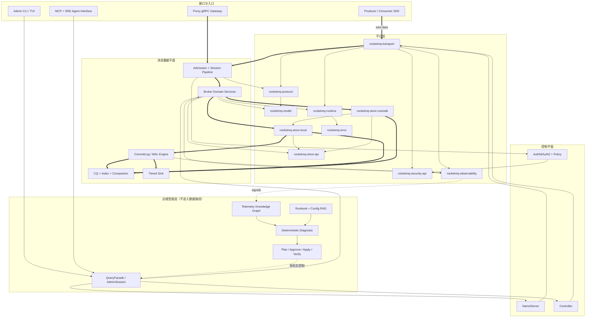
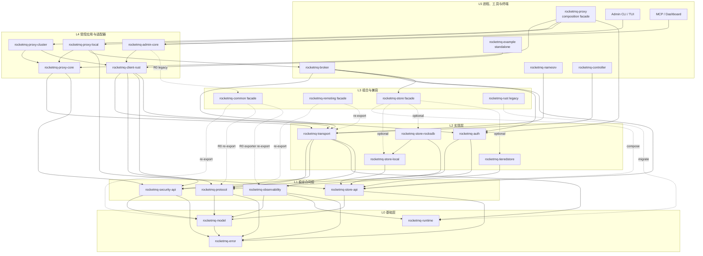
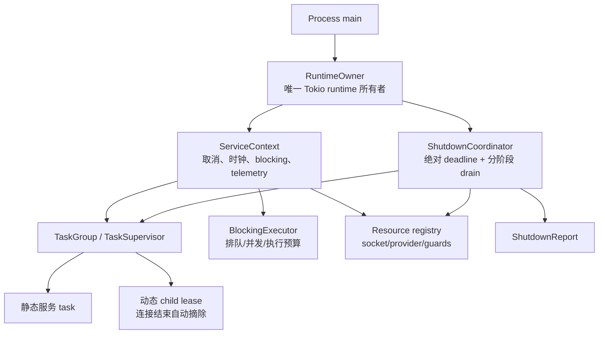
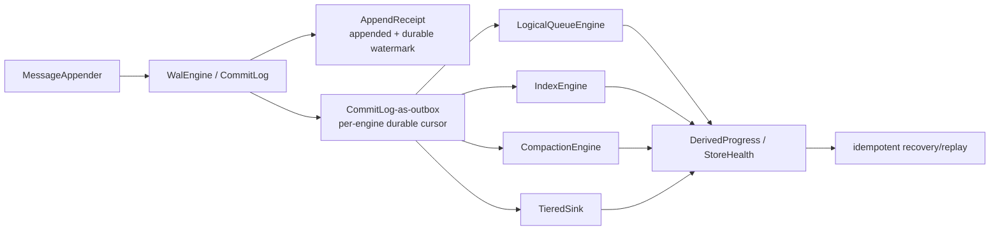
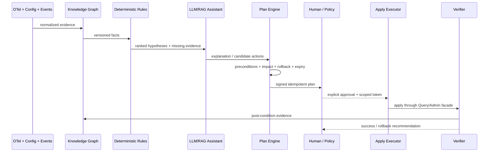

# RocketMQ Rust 下一代架构重构设计方案

<!-- architecture-refactor-scope: phases=1-3; execution=R01-R18,R20,R22-R25; follow-up=R19,R21,R26-R31 -->

> 当前实施范围：本轮架构重构覆盖 Phase 1～3 的 R01～R18、R20、R22～R25；R19 固定目标硬件性能验收、
> R21 Docker/Kind/K3d 动态证据与 Phase 4 AI Native（R26～R31）保留为独立后续提案，不计入本轮进度、
> 剩余任务数或完成 Gate。
> 设计目标：在不牺牲协议、存储格式与运维兼容性的前提下，把架构成熟度提升到可验证的 **96/100** 目标态
> 设计基线：架构审计提交 `f545d638`；本次 crate/源码迁移表已按 `main` 的 `6d152248` 重新复核，2026-07-11
> 推荐策略：边界优先的渐进式 strangler migration，而非大爆炸重写
> 评分性质：目标设计分；只有完成对应验收门槛后，才能转化为代码现状分

## 0. 决策摘要

本方案选择 **“先消除高风险隐式契约，再在现有目录内建立窄边界，最后逐模块替换实现”**。核心决策是：

1. 立即冻结新的 `ArcMut` 和巨型公开 API 增长；以类型安全原语替换共享可变别名。
2. 保留 CommitLog 作为唯一权威 WAL，把 CQ、Index、RocksDB、Tiered 和 Compaction 统一为带 durable watermark 的可重建派生引擎。
3. 复用现有 `RuntimeOwner`、`ServiceContext`、`TaskGroup`、`BlockingExecutor`，演进为进程唯一 owner、可摘除动态 task tree 和绝对 shutdown deadline；不创建第二套 runtime 框架。
4. 在当前仓库根目录新增 10 个同级边界 crate：`rocketmq-model`、`rocketmq-protocol`、`rocketmq-transport`、`rocketmq-security-api`、`rocketmq-store-api`、`rocketmq-store-local`、`rocketmq-store-rocksdb`，以及 `rocketmq-proxy-core`、`rocketmq-proxy-cluster`、`rocketmq-proxy-local`；当前 22 个 workspace package 演进为 32 个，现有 `common/remoting/store/proxy` 保留兼容或组合职责。
5. 完整 `rocketmq-client-rust` 的**直接依赖和源码导入**只允许出现在真正拥有 client lifecycle 的 runtime adapter：workspace 内为 `rocketmq-admin-core/client_adapter` 与 `rocketmq-proxy-cluster`，standalone 仅保留 `rocketmq-example`。Broker、NameServer、proxy-core/local 的依赖闭包完全清零；MCP/Dashboard 只能经 admin-core 间接到达，禁止直接边或绕过 facade。
6. 用 capability trait 与 request/options struct 收敛 `MessageStore`、`MQAdminExt`、`MQProducer`，热路径使用泛型/enum，冷边界才使用 `Arc<dyn Trait>`。
7. MCP/AI 永远不进入消息数据平面；以 QueryFacade、AdminSession、RequestContext、Plan/Apply 和版本化 Evidence/Rules 构造可审计的 SRE 控制环。
8. “百万连接”不是文档承诺，而是独立硬件 profile 下的 mostly-idle cluster benchmark 里程碑；所有绝对性能目标都必须附测试配置和资源预算。

目标不是把仓库改成看起来更现代的目录树，而是使以下问题能被机器回答：谁拥有任务、何时 durable、内存上限是多少、API 如何兼容、失败如何恢复、AI 可以做什么和不能做什么。

## 1. 重构目标与非目标

### 1.1 目标

- Rust soundness：不存在安全的 `&T → &mut T` 逃逸；unsafe contract 可由 wrapper 自身建立并由 Miri/Loom/测试证明。
- 有界生命周期：所有生产 task、thread、connection、pending request 都有 owner、budget、deadline 和完成报告。
- 耐久性闭环：同步确认只在 durable watermark 达标后返回；所有派生视图可从 WAL 幂等恢复。
- 清晰依赖方向：`rocketmq-model`、`rocketmq-protocol`、`rocketmq-security-api`、`rocketmq-store-api` 是无 service 实现的低层 crate；`rocketmq-transport` 不依赖业务 service；server 不再为 DTO 依赖完整 client。
- 模式可裁剪：Proxy cluster 构建只引入 client adapter，local 构建只引入 Broker/store capability；两种模式通过物理 crate 和 feature closure 隔离。
- 可演进 API：公共配置、trait 和 wire/storage schema 都有 canonical 路径、版本策略与兼容测试。
- 可量化性能：按 allocation、bytes、I/O amplification、p99、RSS、shutdown latency 建立基线，而不是只比较 QPS。
- 云原生：每个服务独立镜像、非 root、只读文件系统、真实 readiness/liveness、优雅终止、资源预算和拓扑约束。
- AI Native：基于 telemetry + config + runbook 的可解释诊断、RAG 与人机协同 SRE；危险操作默认不可用且必须可审计、可回滚。

### 1.2 非目标

- 不在一次 PR 中重写 Broker、Store 或 Client。
- 不改变 RocketMQ wire code、header 语义、Serde 字段和持久化格式，除非有明确 format version、双读/双写和迁移计划。
- 不为了“插件化”使用不稳定 Rust dylib ABI；热数据平面不加载第三方动态代码。
- 不全面使用 lock-free、actor、`dyn Trait` 或 `Cow`。原语选择必须匹配所有权和实测争用。
- 不把 LLM 放入生产/消费/刷盘确认路径，也不让模型直接生成并执行任意管理命令。

## 2. 方案比较

| 方案 | 描述 | 优点 | 主要风险 | 决策 |
|---|---|---|---|---|
| A. 基础七拆（+7，29 package） | 新增 model/protocol/transport/security-api/store-api/store-local/store-rocksdb；Proxy 仍是单 crate | 基础合同、网络与存储后端边界完整，迁移面较小 | Proxy cluster/local 仍同时编译 client 与 Broker/Store，无法由 Cargo 证明模式隔离 | 可作中间里程碑 |
| B. 均衡十拆（+10，32 package） | 在 A 上物理新增 proxy-core/proxy-cluster/proxy-local；现有 proxy 只做组合/兼容 | 同时解决基础边界与当前最明确的 client runtime 污染；local-only 构建可硬性排除 client | 过渡期存在 facade/re-export，Proxy feature 语义需版本化迁移 | **采用** |
| C. 激进拆分（+12～15） | 再增加 client-api、admin-api/admin-client、broker-core、config、extension-api 等 crate | 边界最细、理论并行度最高 | `client-api` 容易重新混入 DTO/wire/admin 合同；当前只有一个 client 实现，额外发布单元与跨 crate API 成本大于收益 | 拒绝 |

推荐方案 B 不是整体搬入统一 `crates/` 目录，也不是一次性移动源码。10 个新 crate 直接作为当前根 workspace 的同级成员，按“先建无行为的窄合同 → 迁移一个垂直切片 → 旧 crate re-export/组合 → 迁移内部消费者”的顺序落地。现有服务入口、`docker/` 与 `distribution/` 均保持实际路径；只有被依赖闭包或 feature 模式证明需要硬隔离的边界才新增 crate。

选择 10 而不是凭感觉细拆：当前 `rocketmq-common/src` 有 171 个 Rust 文件/36,237 行且被 16 个 workspace package 直接依赖；`rocketmq-remoting/src` 有 311 个文件/57,215 行、11 个直接依赖者，其中 protocol+code 已自然形成 257 个文件/42,247 行的无 socket 切面；`rocketmq-store/src` 有 159 个文件/67,159 行，旧 `MessageStore` 有 126 个方法，单个 LocalFileMessageStore 8,906 行，RocksDB 目录与 adapter 约 6,649 行。与此同时，`rocketmq-client/src` 有 181 个文件/87,713 行，被 5 个 workspace package 与 3 个 standalone 项目直接依赖；Proxy 的真实 client runtime 使用集中在 cluster/remoting adapter，core/local 只是结果 DTO 泄漏，却因当前单 crate 结构始终编译 client、Broker 与 Store。前三个新增 Proxy crate 因而是可由依赖图证明的部署模式边界；相反，Broker/NameServer 的 client 泄漏可通过 model/protocol/transport 与 owner adapter 消除，无需再造 `client-api`。

## 3. 目标非功能要求与验收门槛

| 类别 | 目标 | 验证方式 |
|---|---|---|
| Soundness | 禁止安全共享引用产生可变引用；新增 unsafe 均有局部 `SAFETY` contract | compile guard、Miri、Loom、Clippy `-D warnings` |
| Toolchain | 默认 workspace 可由 stable Rust 构建；nightly/V2 实验仅在非默认显式 feature 中存在 | stable default CI + 单独 experimental feature CI |
| Task 生命周期 | 100k 次 connect/disconnect 后动态 child 数回到活跃基线 | deterministic integration test + heap/task metrics |
| Pending 请求 | 10k 次永不响应/超时后 pending map 为 0，无迟到响应错配 | virtual time + race test |
| Shutdown | 挂起 processor/IO/telemetry 时仍在配置的绝对 deadline 内结束并报告未完成项 | fault injection；`leaked_tasks=0` 为正常目标 |
| Backpressure | 所有外部输入同时受 count、bytes、per-session、global budget 限制；无无界生产 channel | static guard + overload test |
| Durability | SyncFlush ack 的消息在 crash recovery 后 100% 可见；失败不得推进 watermark | flush error injection + kill/restart test |
| 派生恢复 | CQ/Index/Tiered/Compaction 按 WAL offset 幂等追赶，无 hole/重复可见 | golden log replay + watermark assertions |
| Wire/Storage 兼容 | request code/header/Serde/20B CQ/Index 等现有格式保持兼容 | versioned golden corpus + differential tests |
| 性能回归 | 默认主干在固定 profile 下吞吐不低于基线 95%，p99/RSS 不恶化超过约定预算 | Criterion + end-to-end benchmark gate |
| 可观测性 | 关键路径 metrics 有 schema、unit、owner、cardinality budget；collector 故障不阻断数据平面 | semantic guard + collector outage test |
| 安全 | secure profile fail closed；secret 不以明文 Debug/日志落盘；MCP HTTP 符合 2025-11-25 authorization | config/security tests + threat model review |
| 云原生 | SIGTERM/readiness/drain 与 deadline 一致，滚动升级不丢已确认消息 | kind/k3d chaos upgrade test |

“支持百万级连接”的工程定义为：先把单连接内存降为按需 buffer、消除 O(累计连接) 状态并完成单节点阶梯压测；再在声明 CPU/内存/内核参数/帧率/TLS 比例的 cluster profile 上验证 1,000,000 mostly-idle connections。它不是当前硬编码 1,000 连接上限的直接调参任务。

## 4. 目标整体架构



实线粗箭头是消息/存储数据流，普通实线是调用或依赖，虚线是 telemetry/control 流。AI 层只有经过 QueryFacade 和授权 Plan/Apply 才能触达控制面，不能直接访问 WAL、socket 或进程内可变状态。

## 5. Workspace 目标边界

### 5.1 基于当前仓库的实际落位

后续重构沿用当前根布局，不引入统一的 `crates/`、`foundation/`、`services/`、`compatibility/` 或 `deploy/` 容器目录。当前 22 个 workspace package 保持原路径；新增 10 个同级 crate 后目标为 32 个 package。下图中的“新增”才是后续需要创建的物理目录，其余均是现在已经存在的目录：

| 组织方式 | 收益 | 代价 | 结论 |
|---|---|---|---|
| 全部搬到 `crates/{foundation,platform,services}` | 文件浏览时分组直观 | 改动 22 个 manifest 路径、standalone path dependency、AGENTS/CI/脚本与发布自动化；目录层次本身不能阻止非法依赖 | 拒绝 |
| 每个领域建立嵌套 workspace | 可分开执行部分命令 | 破坏根 `Cargo.toml` 作为唯一成员真相源，跨 workspace 版本/feature/lockfile 治理更复杂 | 拒绝 |
| **根目录同级 package + 逻辑分层表** | 保持当前路径与验证路由；Cargo metadata/CI 真正执行边界；新增 crate 名即表达 owner | 根目录 package 数增加到 32，需要文档与生成图帮助浏览 | **采用** |

因此，“基础层/实现层/服务层”是依赖规则，不是准备新建的容器目录；下面的路径才是目标物理目录。`rocketmq-tools/` 与 `rocketmq-dashboard/` 继续保留当前已存在的嵌套边界，避免无收益的全仓移动。

```text
rocketmq-rust/
├── Cargo.toml
├── rocketmq/                         # rocketmq-rust 遗留并发/调度兼容层
├── rocketmq-error/
├── rocketmq-runtime/
├── rocketmq-model/                   # 新增：无 Tokio 的共享值对象
├── rocketmq-protocol/                # 新增：wire schema/code/header/body
├── rocketmq-security-api/            # 新增：中立认证授权合同
├── rocketmq-store-api/               # 新增：窄存储 capability
├── rocketmq-common/                  # 现有：收窄后兼容 facade/通用工具
├── rocketmq-transport/               # 新增：TCP/TLS/codec/session/client/server
├── rocketmq-remoting/                # 现有：protocol + transport 兼容 facade
├── rocketmq-auth/                    # 现有：security-api 的实现
├── rocketmq-observability/
├── rocketmq-macros/
├── rocketmq-filter/
├── rocketmq-store-local/             # 新增：CommitLog/CQ/Index/HA 本地实现
├── rocketmq-store-rocksdb/           # 新增：RocksDB CQ/Index 实现
├── rocketmq-store/                   # 现有：backend 组合与兼容 facade
├── rocketmq-tieredstore/
├── rocketmq-client/
├── rocketmq-controller/
├── rocketmq-namesrv/
├── rocketmq-broker/
├── rocketmq-proxy-core/              # 新增：中立 plan/port/status 与 ingress
├── rocketmq-proxy-cluster/           # 新增：唯一允许依赖完整 client 的 Proxy adapter
├── rocketmq-proxy-local/             # 新增：嵌入 Broker/store 的 local adapter，禁止 client
├── rocketmq-proxy/                   # 现有：binary、composition 与兼容 re-export
├── rocketmq-tools/
│   ├── rocketmq-admin/
│   │   ├── rocketmq-admin-core/
│   │   ├── rocketmq-admin-cli/
│   │   └── rocketmq-admin-tui/
│   ├── rocketmq-mcp/
│   └── rocketmq-store-inspect/
├── rocketmq-dashboard/
│   ├── rocketmq-dashboard-common/    # 根 workspace member
│   ├── rocketmq-dashboard-gpui/      # standalone Cargo project
│   ├── rocketmq-dashboard-tauri/     # standalone Node/Vite/Tauri frontend
│   │   └── src-tauri/                # standalone Rust backend
│   └── rocketmq-dashboard-web/       # Web Dashboard container
│       ├── backend/                  # standalone Rust backend
│       └── frontend/                 # standalone React/TypeScript/Vite frontend
├── rocketmq-example/                 # standalone Cargo project
├── rocketmq-website/                 # standalone Docusaurus site
├── docker/                            # 保留现有镜像入口
├── distribution/                     # 保留配置与后续部署资产
├── rocketmq-doc/
├── docs/
└── scripts/
```

#### 5.1.1 完整 32-package 组织清单

这张表覆盖根 workspace 的全部目标 package，不只列新增项。每一组是逻辑依赖层；“保留”不等于不改源码，而是物理 crate 路径不迁移。

| 逻辑组 | 目标 package（实际路径） | 数量 | 组织动作 |
|---|---|---:|---|
| 基础合同与编译期能力 | `rocketmq-error/`、`rocketmq-runtime/`、`rocketmq-model/`（新）、`rocketmq-protocol/`（新）、`rocketmq-security-api/`（新）、`rocketmq-store-api/`（新）、`rocketmq-macros/` | 7 | error/runtime/macros 保留并收窄；新增四个无 service owner 的稳定合同 crate |
| 平台与共享实现 | `rocketmq-transport/`（新）、`rocketmq-auth/`、`rocketmq-observability/`、`rocketmq-filter/` | 4 | transport 从 remoting 提取；auth 实现 security-api；observability 解除 common/facade；filter 收敛到 model/protocol 输入，不承载 Broker owner 状态 |
| 存储实现与组合 | `rocketmq-store-local/`（新）、`rocketmq-store-rocksdb/`（新）、`rocketmq-tieredstore/`、`rocketmq-store/` | 4 | Local/Rocks 物理隔离；tiered 只接 store-api；现有 store 长期作为 backend composition + compatibility facade |
| 兼容排空层 | `rocketmq-common/`、`rocketmq-remoting/`、`rocketmq/`（package `rocketmq-rust`） | 3 | 保留旧 public path/re-export；禁止新 owner 代码进入；按 ledger 清空 common shared-kernel、remoting 实现与 ArcMut legacy |
| SDK 与控制面 | `rocketmq-client/`（package `rocketmq-client-rust`）、`rocketmq-tools/rocketmq-admin/rocketmq-admin-core/` | 2 | Client 保持唯一 SDK/runtime；admin-core 拥有管理合同，client 仅为其私有远程 adapter |
| 核心服务 | `rocketmq-broker/`、`rocketmq-namesrv/`、`rocketmq-controller/` | 3 | 路径保留；直接依赖 owner capability；Broker/NameServer 完整 client 清零 |
| Proxy 运行模式 | `rocketmq-proxy-core/`（新）、`rocketmq-proxy-cluster/`（新）、`rocketmq-proxy-local/`（新）、`rocketmq-proxy/` | 4 | 三个新物理边界隔离 core/cluster/local；现有 proxy 只做 binary/composition/compatibility |
| 工具与 UI 共享 | `rocketmq-tools/rocketmq-admin/rocketmq-admin-cli/`、`rocketmq-tools/rocketmq-admin/rocketmq-admin-tui/`、`rocketmq-tools/rocketmq-mcp/`、`rocketmq-tools/rocketmq-store-inspect/`、`rocketmq-dashboard/rocketmq-dashboard-common/` | 5 | 路径保留；统一经 admin/store 公共能力访问，不直接依赖 server 私有实现或完整 client |
| **合计** | **现有 22 + 新增 10** | **32** | **根 workspace 仍以根 `Cargo.toml` 为唯一成员真相源** |

Standalone Cargo 项目不计入 32：`rocketmq-example/` 保持合法 SDK 终端消费者；Tauri/Web/GPUI 后端按各自 `AGENTS.md` 验证，但 Dashboard 管理路径必须经 admin-core；它们不能因为目录位于仓库内就被误加进根 workspace。

新增范围严格限定为 3 个基础合同 crate、1 个 transport crate、3 个存储合同/实现 crate 和 3 个已有明确部署语义的 Proxy adapter crate，共 10 个：

- `rocketmq-model`、`rocketmq-protocol`、`rocketmq-security-api` 只承载稳定值对象、wire schema 或窄安全合同，不拥有 socket、runtime、后台任务、存储引擎或 service 实现。
- `rocketmq-transport` 拥有 TCP/TLS/codec/session/admission/client/server；`rocketmq-auth` 实现 `rocketmq-security-api`，二者都不能反向被低层合同 crate 依赖。
- `rocketmq-store-api` 只承载窄存储 capability；`rocketmq-store-local` 拥有唯一 CommitLog/WAL 和本地派生索引；`rocketmq-store-rocksdb` 复用 Local CommitLog，只替换 RocksDB CQ/Index 路径。现有 `rocketmq-tieredstore` 直接依赖 store-api，但不计入新增 10 个。
- `rocketmq-proxy-core` 只拥有中立的请求计划、服务 port、status/error 与 ingress adapter；`rocketmq-proxy-cluster` 实现远程集群 port 并独占完整 client 依赖；`rocketmq-proxy-local` 实现嵌入式 Broker/store port 且禁止 client。现有 `rocketmq-proxy` 只选择 adapter、装配生命周期并兼容旧 public path。
- 现有 `rocketmq-common`、`rocketmq-remoting`、`rocketmq-store` 不删除：它们在兼容期 re-export 新 canonical API，并承担 feature/后端组合；`rocketmq/` 单独作为遗留并发/调度兼容层排空。workspace 内部调用方必须逐步改为直接依赖 owner crate。
- 不新增全局 `rocketmq-config`、`broker-core`、`client-api` 或 `extension-api`。Send/Query 和状态枚举可原样迁入 model；带 `ArcMut<MessageExt>` 的现有 `PullResult` 留在 client，由新的 owned `PullOutcome` 承接跨 crate 合同。Trace 只把中立 wire record/codec 归 protocol，现有依赖 `AccessChannel`/`LocalTransactionState` 的 encoder/context 保留 client adapter。管理合同归 admin-core；`TopicPublishInfo` 等含 client 状态的类型继续归 client。Broker/NameServer/Controller 配置迁回各自 owner，其他服务巨型文件继续在现有 crate 内拆子目录。
- 云原生资产继续使用 `docker/`；新增 Helm/Kustomize 落在 `distribution/helm/`、`distribution/kubernetes/`，不新建 `deploy/`。

### 5.2 实际 crate 与子目录拆分

物理拆分分为两类：上述 10 个边界 crate 是新的根目录；Broker/Client/Admin 等仍在现有 crate 内拆巨型文件。Proxy 是例外：cluster/local 具有不同的生命周期和依赖闭包，因此必须物理拆为三个新 crate，不能只建逻辑目录。以下均是目标物理路径，沿用仓库主流的 `foo.rs + foo/` 形式，不新增 `mod.rs`。

```text
rocketmq-model/src/                            # 新增 crate
├── lib.rs                                     # canonical re-export
├── message.rs + message/                      # Message、MessageExt、属性与 ID
├── queue.rs + queue/                          # MessageQueue、assignment、offset 与 allocation
│   └── allocation.rs + allocation/            # 无 runtime 状态的队列分配算法
├── topic.rs + topic/                          # topic 名称与属性值对象
│   └── attribute.rs + attribute/              # 通用 attribute grammar 与 TopicAttributes
├── consumer.rs + consumer/                    # ConsumeFromWhere 等消费合同值
├── lite.rs + lite/                            # LiteSubscription DTO/action
├── filter.rs + filter/                        # ExpressionType 等纯值
│   └── topic_filter_type.rs                   # TopicFilterType
├── query.rs                                   # BoundaryType 等跨 protocol/store 查询值
├── identity.rs + identity/                    # broker/client/group 等稳定 ID
└── result.rs + result/                        # 跨服务中立结果
    ├── send.rs
    ├── pull.rs                              # PullStatus + owned PullOutcome；不搬 ArcMut PullResult
    └── query.rs

rocketmq-protocol/src/                         # 新增 crate
├── lib.rs
├── command.rs + command/                      # RemotingCommand 与 schema validation
├── code.rs + code/                            # request/response code
├── constants.rs                               # 仅 wire 稳定常量
├── flag.rs                                    # MessageSysFlag 等 wire bit flag
├── hash.rs                                    # Java-compatible wire hash
├── key.rs                                     # retry/POP wire key grammar
├── header.rs + header/                        # request/response header
├── body.rs + body/                            # versioned wire body
│   └── message_codec.rs                       # 完整消息二进制 decode；无 I/O/runtime
├── route.rs + route/                          # route/heartbeat DTO 与纯 projection
│   └── projection.rs
├── subscription.rs + subscription/            # subscription DTO 与 wire schema
├── static_topic.rs + static_topic/            # DTO 与纯 mapping；无 clock/file I/O
├── version.rs                                # RocketMqVersion
├── trace.rs + trace/                          # 不含 client 状态的 trace wire schema
│   ├── record.rs
│   ├── codec.rs
│   └── constants.rs
├── admin.rs + admin/                          # admin wire DTO
│   └── stats.rs                               # 远程 admin stats key
└── rpc.rs + rpc/                              # codec-neutral RPC request/response

rocketmq-security-api/src/                     # 新增 crate
├── lib.rs
├── context.rs                                 # RequestContext；不持有 RemotingCommand
├── request_view.rs                            # 借用式、脱敏的协议无关视图
├── peer.rs
├── principal.rs
├── resource.rs
├── action.rs
├── decision.rs
├── policy.rs                                  # RequestPolicy contract
└── outbound_signer.rs                         # 协议无关签名合同

rocketmq-store-api/src/                        # 新增 crate
├── lib.rs
├── append.rs                                  # MessageAppender/AppendReceipt
├── read.rs                                    # MessageReader/OffsetIndex
├── lifecycle.rs                              # load/start/shutdown/destroy
├── health.rs                                  # writable/lag/watermark
├── replication.rs
├── admin.rs                                   # 冷管理能力
├── dispatch.rs                                # 中立 DerivedRecord/dispatcher contract
├── progress.rs                                # DerivedProgress/Durability
└── error.rs                                   # StoreError 与稳定错误分类

rocketmq-transport/src/                        # 新增 crate
├── lib.rs
├── codec.rs + codec/
├── config.rs + config/                        # client/server/TLS transport config
├── buffer.rs                                  # adaptive encode buffer
├── local.rs                                   # 本地 request harness
├── net.rs + net/
│   ├── channel.rs
│   ├── admission.rs
│   ├── budget.rs                              # count + byte budget
│   ├── session.rs
│   └── pipeline.rs
├── client.rs + client/
│   ├── async_client.rs
│   ├── blocking_client.rs
│   ├── connection_pool.rs
│   └── pending_request.rs                     # RAII request guard
├── rpc.rs + rpc/                              # 有状态 RPC client/metadata/response
├── processor.rs + processor/                  # request processor/runtime adapters
├── server.rs + server/
│   ├── connection_task.rs
│   └── shutdown.rs
├── error.rs
├── error_response.rs
└── tls.rs

rocketmq-store-local/src/                      # 新增 crate
├── lib.rs
├── config.rs + config/
├── base.rs + base/                          # MappedFile/local-store 实现类型
├── commit_log.rs + commit_log/
│   ├── append.rs
│   ├── load.rs
│   ├── recovery.rs
│   ├── flush.rs + flush/
│   │   └── group_commit.rs
│   ├── mapped_file.rs + mapped_file/
│   └── dispatch.rs
├── consume_queue.rs + consume_queue/
├── queue.rs + queue/
├── index.rs + index/
├── kv.rs + kv/                                # compaction store/dispatch
├── ha.rs + ha/
├── message_store.rs + message_store/
│   ├── local_file_message_store.rs
│   ├── lifecycle.rs
│   ├── query.rs
│   ├── reput.rs
│   └── cleanup.rs
├── message_encoder.rs + message_encoder/
├── recovery.rs
├── timer.rs + timer/
├── pop.rs + pop/
├── services.rs + services/
│   └── cold_data_check.rs
├── transfer.rs + transfer/
├── runtime.rs
├── stats.rs + stats/
├── state.rs + state/                          # running flags/store state
├── platform.rs
├── hook.rs + hook/                            # 迁移期 local hook；中立合同再上移 API
├── filter.rs                                  # 迁移期 adapter
└── utils.rs + utils/

rocketmq-store-rocksdb/src/                    # 新增 crate
├── lib.rs
├── config.rs
├── rocksdb.rs + rocksdb/                      # CQ/Index/maintenance/runtime/snapshot/store
└── message_store.rs                           # 组合 store-local 的 CommitLog

rocketmq-store/src/                            # 现有兼容/组合 crate
├── lib.rs                                     # 旧 public path re-export
├── config.rs + config/                        # 旧 Serde envelope + versioned conversion
├── generic_message_store.rs                   # backend enum/composition
├── compatibility.rs                           # 旧 MessageStore forwarding adapter
└── tieredstore.rs                             # Tiered decorator/compatibility

rocketmq-broker/src/
├── broker_runtime.rs                         # 保留 facade
├── broker_runtime/                           # 新增
│   ├── bootstrap.rs                          # 启动阶段与依赖校验
│   ├── composition.rs                        # 组件装配
│   ├── registration.rs                       # Broker 注册/注销
│   ├── processor_registry.rs                 # processor 构建与注册
│   ├── shutdown.rs                           # drain/deadline/report
│   └── config_assembly.rs                    # 分区配置装配
├── out_api/
│   ├── send.rs
│   ├── pull.rs
│   └── result.rs                             # Broker-owned transport adapter result
└── topic/route.rs                            # BrokerPublishRoute

rocketmq-namesrv/src/processor/
├── cluster_test_request_processor.rs         # 保留 processor facade
└── cluster_test_request_processor/
    └── route_lookup.rs                       # protocol + transport adapter

rocketmq-client/src/                          # 现有完整 SDK/runtime；不新增 client-api crate
├── compatibility.rs                         # Send/Query/status 旧路径 re-export；PullResult 保留 adapter
├── implementation/
│   ├── mq_client_api_impl.rs                 # 保留 runtime facade
│   └── mq_client_api_impl/                   # 新增
│       ├── producer_rpc.rs
│       ├── consumer_rpc.rs
│       ├── admin_rpc.rs
│       ├── routing.rs
│       └── connection_lifecycle.rs
├── admin/
│   ├── default_mq_admin_ext_impl.rs          # 保留 compatibility facade
│   └── default_mq_admin_ext_impl/            # 新增 capability 实现子目录
│       ├── topic.rs
│       ├── broker.rs
│       ├── consumer.rs
│       ├── security.rs
│       ├── query.rs
│       └── lifecycle.rs
└── producer/consumer/...                     # SDK 构造、状态机、retry、callback 仍归 client

rocketmq-proxy-core/                          # 新增 crate；禁止 client/broker/store facade
├── Cargo.toml
├── build.rs                                  # 从现有 proxy 移入，唯一生成 gRPC proto
├── proto/                                    # 从现有 proxy 移入
└── src/
    ├── lib.rs
    ├── proto.rs                              # generated v2 contract re-export
    ├── auth.rs + auth/                       # 中立 ingress 安全 adapter
    │   ├── principal.rs
    │   ├── grpc_request.rs
    │   └── policy_port.rs                    # 只依赖 security-api
    ├── session.rs + session/
    ├── context.rs
    ├── config.rs                              # ingress/session/budget 配置
    ├── error.rs
    ├── status.rs                             # 使用 rocketmq-model 中立结果
    ├── plan.rs + plan/
    │   ├── send.rs
    │   ├── pull.rs
    │   ├── pop.rs
    │   ├── ack.rs
    │   └── route.rs
    ├── port.rs + port/
    │   ├── message.rs
    │   ├── consumer.rs
    │   ├── route.rs
    │   └── transaction.rs
    ├── service.rs + service/                    # 中立 default/static service 与 manager contract
    ├── remoting.rs                             # Remoting ingress/dispatcher；不含 client runtime
    ├── processor.rs + processor/
    └── grpc.rs + grpc/                       # Tonic ingress；只调用 port
        ├── adapter.rs
        ├── middleware.rs
        ├── server.rs
        └── service.rs

rocketmq-proxy-cluster/src/                   # 新增 crate；远程集群 adapter
├── lib.rs
├── config.rs                                 # namesrv/client/retry/outbound auth
├── service.rs                                # Cluster*Service/ClusterServiceManager
├── client_runtime.rs                         # MQClientInstance/Manager lifecycle owner
├── producer.rs                               # DefaultMQProducer adapter
├── consumer.rs                               # pull/pop/ack callback adapter
├── route.rs
├── signing.rs                                # 消费注入的 security-api OutboundSigner
├── auth_metadata.rs                          # wire DTO → security-api 中立类型
└── remoting.rs                               # resolve remote broker/address

rocketmq-proxy-local/src/                     # 新增 crate；嵌入式 adapter，禁止 client
├── lib.rs
├── config.rs                                 # embedded Broker/store 选项
├── service.rs                                # LocalServiceManager
├── broker_runtime.rs
├── message.rs
├── consumer.rs
├── route.rs
└── transaction.rs

rocketmq-proxy/src/                           # 现有 crate；composition + compatibility
├── lib.rs                                    # 旧 public path 精确 re-export
├── bootstrap.rs                              # 选择 cluster/local adapter
├── config.rs                                 # 旧 ProxyConfig envelope + 分区转换
├── auth_runtime.rs                           # 组合 rocketmq-auth provider 并注入 core policy
├── observability.rs
└── bin/rocketmq-proxy-rust.rs

rocketmq-tools/rocketmq-admin/rocketmq-admin-core/src/
├── admin/
│   ├── default_mq_admin_ext.rs                # R0 deprecated facade；保旧 client/common 签名一个 major
│   └── api/                                   # 复用现有 admin-owned compatibility DTO
│       ├── broker_operator_result.rs
│       ├── message_track.rs
│       └── track_type.rs
├── core/                                     # 保留现有领域路径；改用 admin-owned port/DTO
│   ├── admin.rs
│   ├── clock.rs                              # 注入式 epoch/clock port；替代 common TimeUtils
│   ├── auth.rs
│   ├── broker.rs + broker/
│   ├── cluster.rs
│   ├── connection.rs
│   ├── consumer.rs
│   ├── container.rs
│   ├── controller.rs
│   ├── export_data.rs
│   ├── ha.rs
│   ├── lite.rs
│   ├── message.rs
│   ├── namesrv.rs + namesrv/
│   ├── offset.rs
│   ├── producer.rs                           # 含普通/事务测试发送 facade
│   ├── queue.rs
│   ├── static_topic.rs + static_topic/
│   │   └── planner.rs
│   ├── stats.rs
│   └── topic.rs + topic/
├── client_adapter.rs                         # 唯一允许导入完整 client 的模块入口
└── client_adapter/
    ├── lifecycle.rs
    ├── auth.rs
    ├── broker.rs
    ├── cluster.rs
    ├── connection.rs
    ├── consumer.rs
    ├── container.rs
    ├── controller.rs
    ├── export_data.rs
    ├── ha.rs
    ├── lite.rs
    ├── message.rs
    ├── namesrv.rs
    ├── offset.rs
    ├── producer.rs
    ├── queue.rs
    ├── static_topic.rs
    ├── stats.rs
    └── topic.rs

rocketmq-tools/rocketmq-admin/rocketmq-admin-cli/src/commands/topic/
└── static_topic_file.rs                       # static-topic 临时文件 I/O

rocketmq-broker/src/
├── config.rs                                 # 新 canonical BrokerConfig facade
└── config/                                   # 新增分区配置
    ├── identity.rs
    ├── network.rs
    ├── storage.rs
    ├── security.rs
    ├── observability.rs
    └── controller.rs

rocketmq-remoting/src/                       # 现有兼容 crate
├── lib.rs + prelude.rs                       # 根级 re-export
├── code.rs + code/                           # 旧 request/response code 路径
├── protocol.rs + protocol/                   # 旧 wire schema 深路径
├── base.rs + base/                           # 旧 task/future 路径
├── clients.rs + clients/                     # 旧 client 路径
├── codec.rs + codec/                         # 旧 codec 路径
├── common.rs + common/                       # heartbeat/helper 兼容路径
├── rpc.rs + rpc/                             # 旧 RPC 值对象与 client 路径
├── net.rs + net/
├── remoting.rs
├── remoting_server.rs + remoting_server/
├── request_processor.rs + request_processor/
├── runtime.rs + runtime/
├── connection.rs + connection_v2.rs
├── tls.rs
├── error_helpers.rs + error_response.rs
├── local.rs
└── smart_encode_buffer.rs                     # 上述均只保 alias/兼容 adapter

rocketmq-runtime/src/
├── schedule.rs
├── task.rs
├── shutdown.rs
├── signal.rs
├── task_group.rs                             # 保留 public facade
└── task_group/                               # 新增
    ├── child_registry.rs                     # 动态 child lease/pruning
    ├── lifecycle.rs                          # 状态转换与 panic policy
    ├── shutdown.rs                           # 绝对 deadline
    └── metrics.rs                            # active/history/outcome

rocketmq-auth/src/
├── runtime.rs                                # 保留 AuthRuntime facade
├── secret.rs                                 # 新增 SecretProvider facade
└── secret/                                   # 新增
    ├── provider.rs
    ├── local_file.rs                         # permission + envelope
    ├── bootstrap.rs                          # 一次性管理员身份引导
    └── rotation.rs                           # credential/certificate 轮换

rocketmq-tieredstore/src/
├── dispatcher.rs + dispatcher/
│   ├── tiered_dispatcher.rs                  # 现有 facade/主体
│   ├── cursor.rs                             # 新增连续 cursor
│   ├── retry_ledger.rs                       # 新增有界持久 retry metadata
│   └── worker.rs                             # 新增按 queue 隔离 worker
├── fetcher.rs + fetcher/
│   └── read_ahead_cache.rs                   # 新增 block cache/read coalescing
└── file.rs + file/
    └── index_generation.rs                   # 新增原子 generation 切换

rocketmq-tools/rocketmq-mcp/src/
├── adapter.rs + adapter/
│   ├── admin_session.rs                      # 现有：P2 workflow-scoped lifecycle
│   └── query_facade.rs                       # 现有：P2/P3 共享查询与 singleflight
├── infrastructure.rs + infrastructure/
│   └── cache.rs                              # 现有：P3 有界 TTL cache
├── service.rs + service/
│   ├── diagnosis_service.rs                  # 现有：P4 diagnosis orchestration
│   ├── diagnosis_collector.rs                # 现有：P4 replayable EvidenceSnapshot
│   ├── diagnosis_rules.rs                    # 现有：P4 server-owned deterministic rules
│   ├── knowledge_graph.rs                    # Phase 4 新增
│   └── retrieval.rs                          # Phase 4 受控 RAG
├── tools.rs + tools/                         # 保留 typed Catalog
├── resources.rs + resources/                 # 现有 live query + 5 templates
└── apply.rs + apply/                         # Phase 4 未来独立 feature
    ├── policy.rs                             # RBAC/approval/precondition
    ├── executor.rs                           # 只接结构化 action
    ├── verifier.rs                           # post-condition
    └── rollback.rs

distribution/
├── config/                                   # 现有
├── helm/                                     # 新增
└── kubernetes/                               # 新增 Kustomize/raw manifests
```

拆分顺序避免把机械移动和行为修复塞进同一提交：

| 阶段 | 先创建的子模块 | 迁移原则 |
|---|---|---|
| Phase 1 | 创建 model/security-api/store-api 三个叶子 crate，清理并创建 protocol；先移动 SendResult/QueryResult/SendStatus/PullStatus，新建 owned PullOutcome 并保留 client PullResult adapter；删除 MCP 的冗余 client 边；解除 observability → common；runtime `task_group/{child_registry,shutdown}`；存储 flush 修复 | 只有字段身份不变的类型才原样迁移并由旧路径精确 re-export；会改变所有权的类型使用新 DTO + 双向 adapter，不伪称保持类型身份 |
| Phase 2A | 提取 transport、store-local、store-rocksdb；把 common/remoting/store 改为 facade；Broker/NameServer 完整 client 依赖清零 | 一次只迁一个 request code 或一个 backend slice；先迁 workspace 内部消费者，再废弃旧路径 |
| Phase 2B | 创建 proxy-core/proxy-cluster/proxy-local 并迁移 port/adapter；Admin client import 收口到 `client_adapter/`；Dashboard 迁到 admin facade；Broker/NameServer/Store/Client 巨型文件子目录 | 先建立物理 crate 与 compile guard，再移动行为；现有 proxy 保 public path 与默认运行模式，feature 改动单独版本化 |
| Phase 3 | auth secret/bootstrap/rotation；Tiered cursor/retry/cache/index generation；distribution Helm/Kubernetes | secure profile dry-run、shadow/read-compare、持久格式 version、可回滚 generation |
| Phase 4 | MCP KG/RAG/multi-domain rules/future Apply 子模块 | 建立在当前已落地的 P2/P3 查询基础和 P4 consumer-lag Evidence/Rules 上，AI 与数据面物理隔离 |

第二批大文件也按同一 `foo.rs + foo/` 方式拆分；服务文件留在原 crate，CommitLog 按目标 owner 迁入 store-local：

| 当前文件 | 目标子目录 | 主要拆分职责 |
|---|---|---|
| `rocketmq-namesrv/src/bootstrap.rs` | `rocketmq-namesrv/src/bootstrap/` | composition、remoting setup、registration、scheduled services、shutdown |
| `rocketmq-client/src/admin/default_mq_admin_ext_impl.rs` | `rocketmq-client/src/admin/default_mq_admin_ext_impl/` | 仅保 client compatibility 实现；新的管理合同与 UI/MCP facade 归 admin-core |
| `rocketmq-client/src/producer/producer_impl/default_mq_producer_impl.rs` | 同目录下 `default_mq_producer_impl/` | lifecycle、send、retry、request、transaction、trace |
| `rocketmq-client/src/consumer/consumer_impl/default_lite_pull_consumer_impl.rs` | 同目录下 `default_lite_pull_consumer_impl/` | lifecycle、assignment、pull、seek、offset、rebalance adapter |
| `rocketmq-store/src/log_file/commit_log.rs` | `rocketmq-store-local/src/commit_log.rs` + `commit_log/` | append、recovery、flush/HA coordination、mapped-file roll、dispatch notification |
| `rocketmq-proxy/src/processor.rs`、`rocketmq-proxy/src/status.rs`、`rocketmq-proxy/src/grpc.rs`、`rocketmq-proxy/src/grpc/`、`rocketmq-proxy/src/service.rs`、`rocketmq-proxy/src/remoting.rs` | `rocketmq-proxy-core/src/` | 中立 plan/port/status/ingress；`service.rs` 只提取 port/default/static 符号，`remoting.rs` 只提取 ingress/dispatcher，先把 client `SendResult`/`PullResult` 替换为 model `SendResult`/`PullOutcome` |
| `rocketmq-proxy/src/cluster.rs`、`rocketmq-proxy/src/service.rs`、`rocketmq-proxy/src/remoting.rs` | `rocketmq-proxy-cluster/src/` | 只迁 cluster 符号切片：MQClientInstance/Manager、Cluster*Service/Manager、producer、pull/pop/ack 与远端路由；完整 client 仅在此 crate |
| `rocketmq-proxy/src/local.rs`、`rocketmq-proxy/src/service.rs` | `rocketmq-proxy-local/src/` | 只迁 local 符号切片：Broker/store capability adapter 与 `LocalServiceManager`；依赖闭包必须不含 client |

目录拆分的完成条件不是“文件变多”：facade 只保留稳定类型、构造和委托；子模块依赖保持单向；约 500 行作为继续审查信号，避免新模块再次超过约 800 行；原 public path、wire/storage schema 和行为测试必须保持；机械移动与行为变更分别提交。

### 5.3 目标 crate 职责、允许依赖与禁边

| 目标 crate/实际路径 | 主要职责 | 允许的内部直接依赖 | 明确禁止 |
|---|---|---|---|
| `rocketmq-model/`（新增） | message/topic/queue/identity/result 稳定值对象与无状态 queue allocation 算法 | error；以及 Serde、Bytes、CheetahString 等外部值类型库 | common、rocketmq-rust、Tokio、runtime、transport、auth、store、service；client cache/callback/handle |
| `rocketmq-protocol/`（新增） | request/response code、command、header/body、route/heartbeat/admin/trace wire DTO、纯 projection 与校验 | model、error、macros | common、rocketmq-rust、socket、Tokio、transport、client/server、auth/store 实现；有状态 route cache |
| `rocketmq-security-api/`（新增） | RequestContext、PeerInfo、SecurityRequestView、principal/resource/action/decision、RequestPolicy/OutboundSigner | model、error | protocol/RemotingCommand、Channel、transport、auth provider、Broker/Store |
| `rocketmq-store-api/`（新增） | append/read/offset/lifecycle/health/durability/replication/admin 窄 capability | model、error、Bytes | Tokio、runtime、remoting、observability、MappedFile、RocksDB/Tiered 类型 |
| `rocketmq-transport/`（新增） | TCP/TLS、codec、session、admission、request correlation、client/server | protocol、security-api、runtime、error、observability | Broker/Store/Client 高层实现、auth provider |
| `rocketmq-auth/`（现有） | credential、provider、authentication/authorization policy 实现 | security-api、protocol、model、runtime、error、observability | 被 transport 反向依赖；持有 Broker/Store 实现 |
| `rocketmq-store-local/`（新增） | 唯一 CommitLog、MappedFile、CQ、Index、HA、Timer、POP、本地 recovery | store-api、model、runtime、error、observability | rocksdb、tieredstore、store facade、broker、remoting |
| `rocketmq-store-rocksdb/`（新增） | RocksDB CQ/Index/maintenance 与 RocksDBMessageStore adapter | store-api、store-local、model、runtime、error、observability、native rocksdb | store facade、tieredstore、broker；自建第二套 CommitLog |
| `rocketmq-tieredstore/`（现有） | Tiered segment/provider/cursor/cache/recovery | store-api、model、runtime、error、observability | local、rocks、store facade；反向操纵 LocalFileMessageStore |
| `rocketmq-common/`（现有 facade） | 旧 model/security/protocol/observability 值对象路径 re-export 与尚未归属 owner 的通用工具 | model、security-api、runtime、error；R0 兼容期直连 protocol，并在清除反向边后直连 observability | 新低层 crate 依赖 common；形成 common↔observability 环；继续容纳 owner-specific config/service；compat 边无删除版本或跨 major 常驻 |
| `rocketmq-remoting/`（现有 facade） | 旧 protocol/transport public path re-export | protocol、transport | 新实现、auth 实现、Broker/Store |
| `rocketmq-store/`（现有 composition/facade） | backend factory/enum、Tiered decorator、legacy config/trait adapter、旧路径 re-export | store-api、可选 local/rocks/tiered | CommitLog/CQ/Index 算法回流；被底层 backend 反向依赖 |
| `rocketmq-runtime/`、`rocketmq-error/` | 生命周期与错误基础原语 | 无业务 crate；只允许必要外部库 | model/protocol/transport/service/facade |
| `rocketmq-observability/` | telemetry schema/export lifecycle | model、runtime、error | common/facade、业务 service 私有类型、message body、secret |
| Broker/NameServer/Controller | domain processor 与 composition root | 直接依赖所需 model/protocol/transport/security/store capability；Broker 仅 bootstrap/composition 可见 store facade | 完整 client 或 client-api；processor/domain 依赖 store facade；只为 DTO/路由查询引入 SDK runtime |
| `rocketmq-proxy-core/`（新增） | 中立 plan/port/status/error 与 gRPC/remoting ingress | model、protocol、security-api、transport、runtime、error、observability | client、Broker、store/facade、rocketmq-rust、auth provider 实现；任何 backend adapter |
| `rocketmq-proxy-cluster/`（新增） | 远程 cluster port、注入式 outbound signing 与 client lifecycle | proxy-core、client、security-api、model、protocol、transport、runtime、error | auth provider 实现、Broker、store/local backend；把 client 实现类型暴露到 core port |
| `rocketmq-proxy-local/`（新增） | 嵌入式 Broker/store port 实现 | proxy-core、Broker 的窄 facade、store-api、model、runtime、error | client 及其任何 re-export；远程 cluster lifecycle |
| `rocketmq-proxy/`（现有 composition/facade） | binary、config、auth provider 装配、adapter 选择、旧 public path re-export | proxy-core、按 feature 可选 cluster/local、auth、runtime、observability | 新增业务算法；让 core/local 经 facade 反向依赖 cluster/client |
| `rocketmq-client/`（包名 `rocketmq-client-rust`） | SDK 构造、routing、retry、producer/consumer/admin runtime 与兼容 re-export | model、protocol、transport、security-api、auth、runtime、error、observability | Broker/Store 实现；承载 server/admin/UI owner-specific 合同；绕过 security-api 扩散 auth provider 私有类型 |
| `rocketmq-admin-core/` | admin-owned capability/request/result 与远程 client adapter | model、protocol、security-api；仅 `client_adapter/` 允许完整 client；R0 的 `legacy-common-compat` 可选边只供旧 facade | 新 `core/` 暴露 client/common 类型；R0 仅允许旧 deprecated facade 在 feature 下保留全部旧签名一个 major，下一 major 删除 common 兼容边 |
| `rocketmq-tools/rocketmq-mcp/` | 已落地 QueryFacade/AdminSession/live Resource/cache；未来 SRE 控制面 | admin-core、security-api、observability，以及 runtime 的 owned lifecycle/BlockingExecutor | 直接 client、数据面私有实现、直接 WAL/socket、绕过授权；未纳入 ServiceContext 的后台任务或裸阻塞 I/O |
| Dashboard backends | UI/BFF 与 admin DTO 映射 | admin-core、dashboard-common、error | 完整 client、MQAdminExt、UI 自建 producer/runtime |
| `rocketmq/`（包名 `rocketmq-rust`） | 遗留 ArcMut/锁/队列/调度/task/shutdown 兼容层 | 迁移期只依赖 runtime/error | 作为 umbrella 或新 core；让任何新 crate 依赖 ArcMut |

### 5.4 目标依赖 DAG

箭头表示“调用方/实现依赖被调用方/合同”。Facade 的虚线只表示兼容 re-export，不允许低层 crate 反向依赖 facade；`common → protocol/observability` 与 `admin-core → common` 是 R0 兼容边，必须进入带删除版本的 ledger。



CI 从 `cargo metadata` 生成目标图并执行四类断言：目标图无环；10 个新 crate 不依赖其禁用的 facade/legacy 层；新增 workspace 内部代码不再引入这些边；完整 client 的**直接 manifest/source** 依赖满足精确 allowlist，同时对关键模式检查完整传递闭包。禁止边包括 `protocol → transport`、`security-api → protocol/auth/transport`、`store-api → backend`、`local → rocks/tiered/facade`、`rocks/tiered → facade`、`proxy-core/local → client` 和任何基础层 → service。现存 service → facade/legacy 边进入带 owner、数量和移除版本的 burn-down ledger，只能减少。

该图是目标态而不是对当前依赖的粉饰。当前 `rocketmq-observability` 仍直接依赖 `rocketmq-common`：message/queue/property 迁到 model，exporter config 归 observability；broker/controller 专用 metric manager 和 TopicValidator/mix_all adapter 上移各 service owner，`RocketMqVersion` 的消费随 broker manager 上移并由 Broker 直连 protocol。完成这些迁移并证明 `cargo tree -p rocketmq-observability` 不含 common/remoting/rocketmq-rust 后，transport/store-local/store-rocksdb 才能把 observability 作为低层可选依赖，否则会经传递依赖重新引入 facade。

#### 5.4.1 Client 依赖反转与 Proxy 物理拆分

完整 client 当前有 8 个直接项目消费者。目标 allowlist 只有 3 个：根 workspace 的 `rocketmq-proxy-cluster` 与 `rocketmq-admin-core`，以及 standalone `rocketmq-example`；其中 admin-core 又必须把所有 client import 收口到 `src/client_adapter/`。其余边不是“改成依赖 client-api”，而是回到真实 owner：

| 当前边 | 目标边 | 物理动作 | 验收 |
|---|---|---|---|
| Broker → client | Broker → model/protocol/transport/store-api | 移走中立结果、分配算法与 route projection；Broker 建 owner-local out-api result/`BrokerPublishRoute` | Broker manifest/source/dependency closure 均无 client/client-api |
| NameServer → client admin | NameServer → protocol + transport | 注入 `ClusterTestRouteLookup`，默认 adapter 只发 route request；由 ServiceContext 拥有并有 3 秒 deadline | cluster-test 行为等价，shutdown 可等待，无 MQClientManager/admin registry |
| Proxy core/local → client | proxy-core → contracts；proxy-local → Broker/store-api | 新增两个物理 crate；所有 port 使用 model/proxy-core-owned DTO | `cargo tree -p rocketmq-proxy-local` 不含 client，core 同样为零 |
| Proxy cluster → client | proxy-cluster → client | 新增唯一远程 cluster adapter crate | client runtime/callback 只出现在 cluster crate，port 不泄漏 client 类型 |
| MCP → client | MCP → admin-core | 删除 Cargo.toml 中完全未使用的直接边 | MCP manifest/source 无直接 client；反向依赖树到 client 只能经过 admin-core adapter |
| Web/Tauri → client | Dashboard → admin-core | 管理查询和普通/事务测试发送改走 admin service | Dashboard manifest/source 无直接 client；若二进制需要远程管理，实现路径只能经过 admin-core；UI 不自建 producer runtime |
| Admin public API → client types | admin capability → admin-owned DTO；client_adapter → client | 新增 `client_adapter/` 并保留 legacy conversion | `core/` 无 client import；旧路径一个 major 周期可编译 |

这里明确拒绝新增通用 `rocketmq-client-api`：`SendResult`、`QueryResult`、`SendStatus`、`PullStatus` 可保持类型身份进入 model；带 `ArcMut<MessageExt>` 的旧 `PullResult` 留 client，跨服务使用新 `PullOutcome`。protocol 只拥有不含 `AccessChannel`/`LocalTransactionState` 的 trace wire record/codec；旧 encoder/context 留 client adapter。管理 request/result 属 admin-core；producer/consumer lifecycle、callback 与包含运行时状态的 route/cache 类型仍归完整 client。只有出现第二个独立 client 实现或可单独发布且不含 Tokio/transport 的稳定 SDK 合同后，才重新评估专门的 client API crate。

Proxy 拆分的关键不是源码位置，而是 feature 闭包：`proxy-core` 与 `proxy-local` 在任何 feature 组合下都不能解析到完整 client；`proxy-cluster` 不得解析到 Broker/store backend。现有 `rocketmq-proxy` 只在 composition root 同时看见两端，且不把其中一端的类型暴露给另一端。

### 5.5 兼容 facade 与退场策略

- `rocketmq-common` 依赖并 re-export `rocketmq-model` 的旧路径；broker/namesrv/controller 配置和单 owner 工具迁回所有者。它可以长期保留少量真正通用工具，但不再是 shared-kernel 投放点。
- `rocketmq-remoting` 依赖并 re-export `rocketmq-protocol` 与 `rocketmq-transport`，保持旧 request code/header/client/server path 一个 major 周期；所有 wire golden tests 同时覆盖 canonical 与旧路径。
- `rocketmq-store` 长期保留为后端 composition root；兼容期继续映射旧 `MessageStore`、config 和模块路径，但实现算法只能存在于 local/rocks/tiered owner。
- `rocketmq/` 不是 umbrella。其 schedule/task/shutdown/wait-for-signal 迁入 `rocketmq-runtime`，锁/队列用标准或 runtime owner 原语替换，`ArcMut`/`WeakArcMut`/`SyncUnsafeCellWrapper` 按 soundness ledger 清零；不再新增 `rocketmq-core` 固化这些遗留能力。

发布 R0 先新增 crate 和等价 re-export，不删除 public item；R1 迁移全部 workspace 与 standalone path consumer，并在 CI 禁止新 facade 依赖；下一 major 才按 API diff 删除 deprecated 深路径。`rocketmq-store` 的组合职责可长期存在，其他 facade 是否保留由实际外部用量决定，而不是为了目录整齐强制删除。

发布顺序按依赖拓扑执行：model/error/runtime/security-api/store-api → protocol/observability → transport/auth/store-local/tiered → store-rocksdb → common/remoting/store facade → service/tools。新 crate 在迁移期与 workspace 主版本锁步；不允许 facade 先发布却引用尚未可用的 owner 版本。

### 5.6 当前实际源码到目标实际路径的迁移表

“当前实际路径”和“目标实际路径”只放仓库相对物理路径；不使用 brace/glob 简写，也不把“其中某些符号”写进路径列。混合文件通过“精确迁移单元”按符号拆分；同一源文件只能因为**互不重叠的符号切片**重复出现。目标列同时列出 canonical 新路径和必须保留的兼容路径；多个路径用 `<br>` 分隔。

| 当前实际路径 | 精确迁移单元 | 目标实际路径 | 迁移与兼容动作 |
|---|---|---|---|
| `Cargo.toml` | 根 workspace 的 members、workspace dependencies 与统一 package/lint 元数据 | `Cargo.toml`<br>`rocketmq-model/Cargo.toml`<br>`rocketmq-protocol/Cargo.toml`<br>`rocketmq-transport/Cargo.toml`<br>`rocketmq-security-api/Cargo.toml`<br>`rocketmq-store-api/Cargo.toml`<br>`rocketmq-store-local/Cargo.toml`<br>`rocketmq-store-rocksdb/Cargo.toml`<br>`rocketmq-proxy-core/Cargo.toml`<br>`rocketmq-proxy-cluster/Cargo.toml`<br>`rocketmq-proxy-local/Cargo.toml` | 一次只登记当前 Phase 需要的 crate，但最终把 10 个新 crate 全部纳入根 workspace；继承根版本、edition、license、rust-version 与 lint，新增边使用 workspace path dependency，禁止嵌套 workspace/第二份 lockfile。 |
| `rocketmq-common/src/common/message.rs`<br>`rocketmq-common/src/common/message/message_single.rs`<br>`rocketmq-common/src/common/message/message_ext.rs`<br>`rocketmq-common/src/common/message/message_body.rs`<br>`rocketmq-common/src/common/message/message_id.rs`<br>`rocketmq-common/src/common/message/message_property.rs`<br>`rocketmq-common/src/common/message/message_flag.rs`<br>`rocketmq-common/src/common/message/message_enum.rs` | `MessageTrait`、`MessageConst`、`MessageVersion`、`Message`、`MessageExt`、`MessageBody`、`MessageId`、`MessageProperties`、`MessageFlag`、`MessageType`、`MessageRequestMode` | `rocketmq-model/src/message.rs`<br>`rocketmq-model/src/message/message.rs`<br>`rocketmq-model/src/message/extension.rs`<br>`rocketmq-model/src/message/body.rs`<br>`rocketmq-model/src/message/id.rs`<br>`rocketmq-model/src/message/property.rs`<br>`rocketmq-model/src/message/flag.rs`<br>`rocketmq-model/src/message/kind.rs`<br>`rocketmq-common/src/common/message.rs` | 类型只定义一次，common 原路径精确 re-export。`message_decoder`、batch、broker-inner、client-id-setter 等未列文件不迁 model。 |
| `rocketmq-common/src/common/message/message_queue.rs`<br>`rocketmq-common/src/common/message/message_queue_assignment.rs`<br>`rocketmq-common/src/common/entity/client_group.rs`<br>`rocketmq-common/src/common/entity/topic_group.rs` | `MessageQueue`、`MessageQueueAssignment`、`ClientGroup`、`TopicGroup` | `rocketmq-model/src/queue.rs`<br>`rocketmq-model/src/queue/message_queue.rs`<br>`rocketmq-model/src/queue/assignment.rs`<br>`rocketmq-model/src/identity.rs`<br>`rocketmq-model/src/identity/client_group.rs`<br>`rocketmq-model/src/identity/topic_group.rs` | 原样迁移值语义；common 保持 deprecated re-export，不携带 runtime config。 |
| `rocketmq-common/src/common/topic.rs` | `TOPIC_MAX_LENGTH`、稳定 system-topic 名称常量、`ValidateTopicResult`、`is_topic_or_group_illegal`、`validate_topic` | `rocketmq-model/src/topic.rs`<br>`rocketmq-model/src/topic/constants.rs`<br>`rocketmq-model/src/topic/validation.rs`<br>`rocketmq-common/src/common/topic.rs` | 动态 `SYSTEM_TOPIC_SET`、`NOT_ALLOWED_SEND_TOPIC_SET`及注册/查询方法留在 owner 侧；纯常量/校验才下沉。 |
| `rocketmq-common/src/common.rs`<br>`rocketmq-common/src/common/sys_flag/topic_sys_flag.rs`<br>`rocketmq-common/src/common/attribute.rs`<br>`rocketmq-common/src/common/attribute/attribute_parser.rs`<br>`rocketmq-common/src/common/attribute/attribute_util.rs`<br>`rocketmq-common/src/common/attribute/bool_attribute.rs`<br>`rocketmq-common/src/common/attribute/cleanup_policy.rs`<br>`rocketmq-common/src/common/attribute/cq_type.rs`<br>`rocketmq-common/src/common/attribute/enum_attribute.rs`<br>`rocketmq-common/src/common/attribute/long_range_attribute.rs`<br>`rocketmq-common/src/common/attribute/string_attribute.rs`<br>`rocketmq-common/src/common/attribute/topic_attributes.rs`<br>`rocketmq-common/src/common/attribute/topic_message_type.rs` | `TopicFilterType` 符号切片、`TopicSysFlag`、通用 attribute grammar 与 `TopicAttributes` | `rocketmq-model/src/filter/topic_filter_type.rs`<br>`rocketmq-model/src/topic/attribute.rs`<br>`rocketmq-model/src/topic/attribute/`<br>`rocketmq-protocol/src/flag.rs`<br>`rocketmq-common/src/common.rs`<br>`rocketmq-common/src/common/sys_flag/topic_sys_flag.rs`<br>`rocketmq-common/src/common/attribute.rs`<br>`rocketmq-common/src/common/attribute/` | filter/topic 值与 attribute grammar 归 model，wire bit flag 归 protocol；common 原路径精确 re-export。上一版已单列的 `subscription_group_attributes.rs` 不重复搬，其 registry 改为消费 model attribute primitive。 |
| `rocketmq-common/src/common/message/message_decoder.rs` | `validate_message_id`/`decode_message_id` 与完整消息二进制 `decode` 的两个纯函数切片 | `rocketmq-model/src/message/id.rs`<br>`rocketmq-protocol/src/body/message_codec.rs`<br>`rocketmq-common/src/common/message/message_decoder.rs` | ID 语法/地址解析归 model，完整 wire body decode 归 protocol；common 保旧 wrapper。Admin core 的 message service 分别直连两个 canonical owner，decoder 不进入 admin-owned DTO。 |
| `rocketmq-common/src/common/stats.rs` | `Stats` 远程管理统计 key 常量切片 | `rocketmq-protocol/src/admin/stats.rs`<br>`rocketmq-common/src/common/stats.rs` | 只迁稳定 wire/admin key；`stats/` 下有状态快照与集合实现仍留 owner/common 兼容层。Admin export/stats service 改用 protocol 常量。 |
| `rocketmq-client/src/producer/send_result.rs`<br>`rocketmq-client/src/producer/send_status.rs` | `SendResult`、`SendStatus` | `rocketmq-model/src/result/send.rs`<br>`rocketmq-client/src/producer/send_result.rs`<br>`rocketmq-client/src/producer/send_status.rs` | 字段、Serde、Display 和类型身份不变；client 旧路径只 re-export canonical 类型。 |
| `rocketmq-client/src/base/query_result.rs` | `QueryResult` | `rocketmq-model/src/result/query.rs`<br>`rocketmq-client/src/base/query_result.rs` | `MessageExt` 先归 model 后原样迁移；client 旧路径做 deprecated re-export。 |
| `rocketmq-client/src/consumer/pull_status.rs` | `PullStatus` | `rocketmq-model/src/result/pull.rs`<br>`rocketmq-client/src/consumer/pull_status.rs` | 枚举值、`i32` 转换与 Display 原样迁移；client 旧路径 re-export。 |
| `rocketmq-client/src/consumer/pull_result.rs` | `PullResult` 与新 `PullOutcome` 的双向转换 | `rocketmq-client/src/consumer/pull_result.rs`<br>`rocketmq-model/src/result/pull.rs` | **不原样迁移 `PullResult`**；它的 `Vec<ArcMut<MessageExt>>` 保留为 client 兼容 adapter，跨 crate 只暴露 owned/immutable `PullOutcome`。 |
| `rocketmq-client/src/consumer/allocate_message_queue_strategy.rs`<br>`rocketmq-client/src/consumer/rebalance_strategy.rs`<br>`rocketmq-client/src/consumer/rebalance_strategy/` | `AllocateMessageQueueStrategy`、`check` 与 6 个无 runtime 状态的分配实现 | `rocketmq-model/src/queue/allocation.rs`<br>`rocketmq-model/src/queue/allocation/`<br>`rocketmq-client/src/consumer/allocate_message_queue_strategy.rs`<br>`rocketmq-client/src/consumer/rebalance_strategy.rs` | 差分测试固定排序、空集和非法输入语义；client 保兼容 re-export。 |
| `rocketmq-common/src/common/config.rs`<br>`rocketmq-common/src/common/consumer/consume_from_where.rs`<br>`rocketmq-common/src/common/lite/lite_subscription_dto.rs`<br>`rocketmq-common/src/common/lite/lite_subscription_action.rs`<br>`rocketmq-common/src/common/filter/expression_type.rs`<br>`rocketmq-common/src/common/hasher/string_hasher.rs`<br>`rocketmq-common/src/common/key_builder.rs`<br>`rocketmq-common/src/common/message/message_queue_for_c.rs`<br>`rocketmq-common/src/common/sys_flag/message_sys_flag.rs`<br>`rocketmq-common/src/common/attribute/subscription_group_attributes.rs`<br>`rocketmq-common/src/common/boundary_type.rs`<br>`rocketmq-common/src/common/mix_all.rs` | `TopicConfig`、`ConsumeFromWhere`、Lite subscription DTO/action、`ExpressionType`、Java-compatible hash、wire key grammar、`MessageQueueForC`、`MessageSysFlag`、subscription attributes、`BoundaryType` 与协议使用的 `mix_all` 常量 | `rocketmq-model/src/topic/config.rs`<br>`rocketmq-model/src/consumer/consume_from_where.rs`<br>`rocketmq-model/src/lite/subscription.rs`<br>`rocketmq-model/src/lite/action.rs`<br>`rocketmq-model/src/filter/expression_type.rs`<br>`rocketmq-model/src/message/message_queue_for_c.rs`<br>`rocketmq-model/src/query.rs`<br>`rocketmq-protocol/src/hash.rs`<br>`rocketmq-protocol/src/key.rs`<br>`rocketmq-protocol/src/flag.rs`<br>`rocketmq-protocol/src/subscription/attributes.rs`<br>`rocketmq-protocol/src/constants.rs`<br>`rocketmq-common/src/common/config.rs`<br>`rocketmq-common/src/common/consumer/consume_from_where.rs`<br>`rocketmq-common/src/common/lite/lite_subscription_dto.rs`<br>`rocketmq-common/src/common/lite/lite_subscription_action.rs`<br>`rocketmq-common/src/common/filter/expression_type.rs`<br>`rocketmq-common/src/common/hasher/string_hasher.rs`<br>`rocketmq-common/src/common/key_builder.rs`<br>`rocketmq-common/src/common/message/message_queue_for_c.rs`<br>`rocketmq-common/src/common/sys_flag/message_sys_flag.rs`<br>`rocketmq-common/src/common/attribute/subscription_group_attributes.rs`<br>`rocketmq-common/src/common/boundary_type.rs`<br>`rocketmq-common/src/common/mix_all.rs` | 这是 protocol 抽取的前置条件；值类型与 wire 常量/位标志/键语法先移到 canonical owner，common 旧路径精确 re-export。`BoundaryType` 放 model 而非 store-api，使 protocol 与 store-api 都只单向依赖 model。 |
| `rocketmq-remoting/src/code.rs`<br>`rocketmq-remoting/src/code/`<br>`rocketmq-remoting/src/protocol.rs`<br>`rocketmq-remoting/src/protocol/admin.rs`<br>`rocketmq-remoting/src/protocol/admin/`<br>`rocketmq-remoting/src/protocol/bodies.rs`<br>`rocketmq-remoting/src/protocol/body.rs`<br>`rocketmq-remoting/src/protocol/body/`<br>`rocketmq-remoting/src/protocol/broker_sync_info.rs`<br>`rocketmq-remoting/src/protocol/command_custom_header.rs`<br>`rocketmq-remoting/src/protocol/filter.rs`<br>`rocketmq-remoting/src/protocol/filter/`<br>`rocketmq-remoting/src/protocol/forbidden_type.rs`<br>`rocketmq-remoting/src/protocol/header.rs`<br>`rocketmq-remoting/src/protocol/header/`<br>`rocketmq-remoting/src/protocol/headers.rs`<br>`rocketmq-remoting/src/protocol/heartbeat.rs`<br>`rocketmq-remoting/src/protocol/heartbeat/`<br>`rocketmq-remoting/src/protocol/namespace_util.rs`<br>`rocketmq-remoting/src/protocol/namesrv.rs`<br>`rocketmq-remoting/src/protocol/remoting_command.rs`<br>`rocketmq-remoting/src/protocol/request_source.rs`<br>`rocketmq-remoting/src/protocol/request_type.rs`<br>`rocketmq-remoting/src/protocol/rocketmq_serializable.rs`<br>`rocketmq-remoting/src/protocol/route.rs`<br>`rocketmq-remoting/src/protocol/route/`<br>`rocketmq-remoting/src/protocol/static_topic.rs`<br>`rocketmq-remoting/src/protocol/static_topic/i32_key_map_serde.rs`<br>`rocketmq-remoting/src/protocol/static_topic/logic_queue_mapping_item.rs`<br>`rocketmq-remoting/src/protocol/static_topic/topic_config_and_queue_mapping.rs`<br>`rocketmq-remoting/src/protocol/static_topic/topic_queue_mapping_context.rs`<br>`rocketmq-remoting/src/protocol/static_topic/topic_queue_mapping_detail.rs`<br>`rocketmq-remoting/src/protocol/static_topic/topic_queue_mapping_info.rs`<br>`rocketmq-remoting/src/protocol/static_topic/topic_queue_mapping_one.rs`<br>`rocketmq-remoting/src/protocol/static_topic/topic_remapping_detail_wrapper.rs`<br>`rocketmq-remoting/src/protocol/subscription.rs`<br>`rocketmq-remoting/src/protocol/subscription/`<br>`rocketmq-remoting/src/protocol/topic.rs` | request/response code、`RemotingCommand`、header/body/admin/heartbeat/route/subscription/static-topic DTO、namespace/extra-info/filter 纯 wire 转换 | `rocketmq-protocol/src/code.rs`<br>`rocketmq-protocol/src/code/`<br>`rocketmq-protocol/src/command.rs`<br>`rocketmq-protocol/src/command/`<br>`rocketmq-protocol/src/header.rs`<br>`rocketmq-protocol/src/header/`<br>`rocketmq-protocol/src/body.rs`<br>`rocketmq-protocol/src/body/`<br>`rocketmq-protocol/src/route.rs`<br>`rocketmq-protocol/src/route/`<br>`rocketmq-protocol/src/admin.rs`<br>`rocketmq-protocol/src/admin/`<br>`rocketmq-protocol/src/subscription.rs`<br>`rocketmq-protocol/src/subscription/`<br>`rocketmq-protocol/src/static_topic.rs`<br>`rocketmq-protocol/src/static_topic/`<br>`rocketmq-remoting/src/code.rs`<br>`rocketmq-remoting/src/code/`<br>`rocketmq-remoting/src/protocol.rs`<br>`rocketmq-remoting/src/protocol/` | 只迁声明式 schema 与纯 codec/projection，不是整目录原样搬迁。除清零 9 个 `ArcMut` 外，还必须改用上一行 canonical 值类型，把 `TimeUtils`/`EnvUtils` 默认构造移到 owner wrapper，用 protocol-local Serde/hash 辅助；wire golden/differential corpus 覆盖新旧路径。 |
| `rocketmq-remoting/src/protocol/static_topic/topic_queue_mapping_utils.rs` | 纯 mapping/check 函数、需要当前时间的规划函数、`write_to_temp` 文件 I/O | `rocketmq-protocol/src/static_topic/mapping.rs`<br>`rocketmq-tools/rocketmq-admin/rocketmq-admin-core/src/core/static_topic/planner.rs`<br>`rocketmq-tools/rocketmq-admin/rocketmq-admin-cli/src/commands/topic/static_topic_file.rs`<br>`rocketmq-remoting/src/protocol/static_topic/topic_queue_mapping_utils.rs` | 纯查找/校验进 protocol，epoch/time 改为由 admin planner 显式传入，临时文件写入归 CLI。旧 `TopicQueueMappingUtils` 作冻结的 deprecated 兼容层保留一个 major，新消费者禁止引用。 |
| `rocketmq-common/src/common/mq_version.rs` | `RocketMqVersion` | `rocketmq-protocol/src/version.rs`<br>`rocketmq-common/src/common/mq_version.rs` | 版本序号及字符串转换原样迁移；common 只 re-export。 |
| `rocketmq-remoting/src/rpc.rs`<br>`rocketmq-remoting/src/rpc/rpc_request.rs`<br>`rocketmq-remoting/src/rpc/rpc_request_header.rs`<br>`rocketmq-remoting/src/rpc/rpc_response.rs`<br>`rocketmq-remoting/src/rpc/topic_request_header.rs` | codec-neutral RPC request/response/header 值对象与旧 module surface | `rocketmq-protocol/src/rpc.rs`<br>`rocketmq-protocol/src/rpc/request.rs`<br>`rocketmq-protocol/src/rpc/header.rs`<br>`rocketmq-protocol/src/rpc/response.rs`<br>`rocketmq-remoting/src/rpc.rs`<br>`rocketmq-remoting/src/rpc/rpc_request.rs`<br>`rocketmq-remoting/src/rpc/rpc_request_header.rs`<br>`rocketmq-remoting/src/rpc/rpc_response.rs`<br>`rocketmq-remoting/src/rpc/topic_request_header.rs` | protocol 不引入 runtime/client metadata；remoting `rpc.rs` 与旧深路径保留 re-export。 |
| `rocketmq-remoting/src/common/heartbeat_v2_result.rs` | `HeartbeatV2Result` 及 ext-field 解码语义 | `rocketmq-protocol/src/body/heartbeat_v2_result.rs`<br>`rocketmq-remoting/src/common/heartbeat_v2_result.rs` | 将 `mix_all` 常量收入 protocol schema；旧路径保 re-export。 |
| `rocketmq-client/src/trace/trace_data_encoder.rs`<br>`rocketmq-client/src/trace/trace_bean.rs`<br>`rocketmq-client/src/trace/trace_context.rs`<br>`rocketmq-client/src/trace/trace_constants.rs`<br>`rocketmq-client/src/trace/trace_transfer_bean.rs`<br>`rocketmq-client/src/trace/trace_type.rs` | 分隔符、wire 字段序列、trace kind 和中立 `TraceRecord`；旧 client 类型转换 | `rocketmq-protocol/src/trace.rs`<br>`rocketmq-protocol/src/trace/record.rs`<br>`rocketmq-protocol/src/trace/codec.rs`<br>`rocketmq-protocol/src/trace/constants.rs`<br>`rocketmq-client/src/trace/trace_data_encoder.rs`<br>`rocketmq-client/src/trace/trace_bean.rs`<br>`rocketmq-client/src/trace/trace_context.rs`<br>`rocketmq-client/src/trace/trace_constants.rs`<br>`rocketmq-client/src/trace/trace_transfer_bean.rs`<br>`rocketmq-client/src/trace/trace_type.rs` | **不单独搬 `TraceDataEncoder`**。protocol 新建不含 client 状态的 record/codec；现有 `TraceBean/Context/TransferBean/Type`、constants 和 encoder 都保留 client 兼容路径，在转换 `AccessChannel`、`LocalTransactionState` 后调 canonical codec。 |
| `rocketmq-client/src/factory/mq_client_instance.rs` | `topic_route_data2topic_subscribe_info` 与可转成中立输出的 route projection 逻辑 | `rocketmq-protocol/src/route/projection.rs`<br>`rocketmq-client/src/factory/mq_client_instance.rs` | 原函数保留 client wrapper；`TopicPublishInfo`、cache/version 不迁出，canonical projection 不原地排序输入。 |
| `rocketmq-remoting/src/base.rs`<br>`rocketmq-remoting/src/base/`<br>`rocketmq-remoting/src/clients.rs`<br>`rocketmq-remoting/src/clients/`<br>`rocketmq-remoting/src/codec.rs`<br>`rocketmq-remoting/src/codec/`<br>`rocketmq-remoting/src/connection.rs`<br>`rocketmq-remoting/src/connection_v2.rs`<br>`rocketmq-remoting/src/local.rs`<br>`rocketmq-remoting/src/net.rs`<br>`rocketmq-remoting/src/net/`<br>`rocketmq-remoting/src/smart_encode_buffer.rs`<br>`rocketmq-remoting/src/tls.rs`<br>`rocketmq-remoting/src/common/remoting_helper.rs` | response future/request task、codec、connection/channel、client pool、TLS、local harness、adaptive encode buffer | `rocketmq-transport/src/codec.rs`<br>`rocketmq-transport/src/codec/`<br>`rocketmq-transport/src/net.rs`<br>`rocketmq-transport/src/net/`<br>`rocketmq-transport/src/client.rs`<br>`rocketmq-transport/src/client/`<br>`rocketmq-transport/src/tls.rs`<br>`rocketmq-transport/src/local.rs`<br>`rocketmq-transport/src/buffer.rs`<br>`rocketmq-remoting/src/base.rs`<br>`rocketmq-remoting/src/base/`<br>`rocketmq-remoting/src/clients.rs`<br>`rocketmq-remoting/src/clients/`<br>`rocketmq-remoting/src/codec.rs`<br>`rocketmq-remoting/src/codec/`<br>`rocketmq-remoting/src/connection.rs`<br>`rocketmq-remoting/src/connection_v2.rs`<br>`rocketmq-remoting/src/local.rs`<br>`rocketmq-remoting/src/net.rs`<br>`rocketmq-remoting/src/net/`<br>`rocketmq-remoting/src/smart_encode_buffer.rs`<br>`rocketmq-remoting/src/tls.rs`<br>`rocketmq-remoting/src/common/remoting_helper.rs` | 先在 transport 保持同名拓扑，再按 client/net/codec 拆小；remoting 所有已公开深路径降为 alias/兼容 adapter。 |
| `rocketmq-remoting/src/remoting.rs`<br>`rocketmq-remoting/src/remoting_server.rs`<br>`rocketmq-remoting/src/remoting_server/`<br>`rocketmq-remoting/src/request_processor.rs`<br>`rocketmq-remoting/src/request_processor/`<br>`rocketmq-remoting/src/runtime.rs`<br>`rocketmq-remoting/src/runtime/connection_handler_context.rs`<br>`rocketmq-remoting/src/runtime/processor.rs`<br>`rocketmq-remoting/src/runtime/processor_v2.rs` | `RemotingService`、request lifecycle、processor/runtime adapter、server connection task/shutdown | `rocketmq-transport/src/processor.rs`<br>`rocketmq-transport/src/processor/`<br>`rocketmq-transport/src/server.rs`<br>`rocketmq-transport/src/server/`<br>`rocketmq-remoting/src/remoting.rs`<br>`rocketmq-remoting/src/remoting_server.rs`<br>`rocketmq-remoting/src/remoting_server/`<br>`rocketmq-remoting/src/request_processor.rs`<br>`rocketmq-remoting/src/request_processor/`<br>`rocketmq-remoting/src/runtime.rs`<br>`rocketmq-remoting/src/runtime/connection_handler_context.rs`<br>`rocketmq-remoting/src/runtime/processor.rs`<br>`rocketmq-remoting/src/runtime/processor_v2.rs` | 一次迁一个 request lifecycle；所有后台任务由 `ServiceContext`/`TaskGroup` 拥有，旧路径保 alias。 |
| `rocketmq-remoting/src/rpc/client_metadata.rs`<br>`rocketmq-remoting/src/rpc/rpc_client.rs`<br>`rocketmq-remoting/src/rpc/rpc_client_hook.rs`<br>`rocketmq-remoting/src/rpc/rpc_client_impl.rs`<br>`rocketmq-remoting/src/rpc/rpc_client_utils.rs` | 有状态 RPC client、metadata、hook 和 address resolution | `rocketmq-transport/src/rpc.rs`<br>`rocketmq-transport/src/rpc/`<br>`rocketmq-remoting/src/rpc.rs`<br>`rocketmq-remoting/src/rpc/client_metadata.rs`<br>`rocketmq-remoting/src/rpc/rpc_client.rs`<br>`rocketmq-remoting/src/rpc/rpc_client_hook.rs`<br>`rocketmq-remoting/src/rpc/rpc_client_impl.rs`<br>`rocketmq-remoting/src/rpc/rpc_client_utils.rs` | 只把值对象留给 protocol；这五个 runtime/client 文件归 transport，旧深路径保 re-export。 |
| `rocketmq-remoting/src/error_helpers.rs`<br>`rocketmq-remoting/src/error_response.rs` | transport 错误构造与 typed-error 到 wire response 的边界映射 | `rocketmq-transport/src/error.rs`<br>`rocketmq-transport/src/error_response.rs`<br>`rocketmq-remoting/src/error_helpers.rs`<br>`rocketmq-remoting/src/error_response.rs` | 错误分类保持在 `rocketmq-error`，transport 只实现边界映射；旧路径保 re-export。 |
| `rocketmq-common/src/common/server/config.rs`<br>`rocketmq-common/src/common/tls_config.rs`<br>`rocketmq-remoting/src/runtime/config.rs`<br>`rocketmq-remoting/src/runtime/config/` | `ServerConfig`、`TlsConfig`、`TlsMode`、client/server/net transport config | `rocketmq-transport/src/config.rs`<br>`rocketmq-transport/src/config/server.rs`<br>`rocketmq-transport/src/config/tls.rs`<br>`rocketmq-transport/src/config/client.rs`<br>`rocketmq-transport/src/config/net.rs`<br>`rocketmq-common/src/common/server/config.rs`<br>`rocketmq-common/src/common/tls_config.rs`<br>`rocketmq-remoting/src/runtime/config.rs`<br>`rocketmq-remoting/src/runtime/config/` | common/remoting 原路径保兼容 re-export；Serde 字段、alias 和 TLS 默认语义不变。 |
| `rocketmq-remoting/src/lib.rs`<br>`rocketmq-remoting/src/prelude.rs`<br>`rocketmq-remoting/src/common.rs` | crate 根级 public module/re-export surface | `rocketmq-remoting/src/lib.rs`<br>`rocketmq-remoting/src/prelude.rs`<br>`rocketmq-remoting/src/common.rs` | 只保 protocol/transport canonical 类型及两个已单列 common helper 的精确 re-export；禁止继续从根模块泄漏已迁走的实现 owner，旧导入路径在一个 major 内保持可编译。 |
| `rocketmq-common/src/common/action.rs`<br>`rocketmq-common/src/common/resource/resource_pattern.rs`<br>`rocketmq-common/src/common/resource/resource_type.rs`<br>`rocketmq-auth/src/authentication/model/subject.rs`<br>`rocketmq-auth/src/authorization/enums/decision.rs`<br>`rocketmq-auth/src/authorization/model/request_context.rs` | action/resource/principal/decision/context 合同语义 | `rocketmq-security-api/src/action.rs`<br>`rocketmq-security-api/src/resource.rs`<br>`rocketmq-security-api/src/principal.rs`<br>`rocketmq-security-api/src/decision.rs`<br>`rocketmq-security-api/src/context.rs`<br>`rocketmq-security-api/src/request_view.rs`<br>`rocketmq-security-api/src/policy.rs`<br>`rocketmq-security-api/src/outbound_signer.rs` | 中立 view 只暴露 code/version/fields/body/peer 且 Debug 脱敏，不持有 `RemotingCommand`/`Channel`；auth provider 实现不迁入 API crate。 |
| `rocketmq-common/src/common/metrics.rs`<br>`rocketmq-common/src/common/metrics/log_exporter_type.rs`<br>`rocketmq-common/src/common/metrics/metrics_exporter_type.rs`<br>`rocketmq-common/src/common/metrics/trace_exporter_type.rs` | `LogExporterType`、`MetricsExporterType`、`TraceExporterType` | `rocketmq-observability/src/exporter.rs`<br>`rocketmq-observability/src/exporter/log.rs`<br>`rocketmq-observability/src/exporter/metrics.rs`<br>`rocketmq-observability/src/exporter/trace.rs`<br>`rocketmq-common/src/common/metrics.rs`<br>`rocketmq-common/src/common/metrics/` | 先把 exporter owner 移到 observability 并完成下三行的 common 清边，再添加 common → observability R0 compatibility dependency 做旧路径精确 re-export；迁移过程不得出现依赖环，下一 major 删除该边。 |
| `rocketmq-observability/Cargo.toml`<br>`rocketmq-observability/src/config.rs`<br>`rocketmq-observability/src/propagation.rs`<br>`rocketmq-observability/src/trace.rs`<br>`rocketmq-observability/src/trace/client.rs`<br>`rocketmq-observability/benches/observability_hot_path.rs` | common manifest 边、config/propagation/client-trace 导入与 `--all-targets` benchmark fixture | `rocketmq-observability/Cargo.toml`<br>`rocketmq-observability/src/config.rs`<br>`rocketmq-observability/src/propagation.rs`<br>`rocketmq-observability/src/trace.rs`<br>`rocketmq-observability/src/trace/client.rs`<br>`rocketmq-observability/benches/observability_hot_path.rs` | 原地改用 observability-owned exporter config 与 model message/property/queue；连同下两行的 owner manager 上移后删除 common manifest 边，benchmark 同步改 canonical 类型。Observability 不新增 protocol 直接边。 |
| `rocketmq-observability/src/metrics/broker_manager.rs` | Broker metric manager、`RocketMqVersion` 与 TopicValidator/mix_all adapter | `rocketmq-broker/src/observability/broker_metrics.rs` | 业务 owner 代码上移 Broker，version 改由 Broker 直接消费 protocol；通用 instrument/catalog 留 observability。 |
| `rocketmq-observability/src/metrics/controller_manager.rs` | Controller metric manager | `rocketmq-controller/src/observability/controller_metrics.rs` | 业务 owner 代码上移 Controller；最终 observability dependency tree 不含 facade/legacy。 |
| `rocketmq-store/src/base/message_store.rs`<br>`rocketmq-store/src/base/commit_log_dispatcher.rs`<br>`rocketmq-store/src/base/dispatch_request.rs`<br>`rocketmq-store/src/base/message_arriving_listener.rs`<br>`rocketmq-store/src/base/message_result.rs`<br>`rocketmq-store/src/base/message_status_enum.rs`<br>`rocketmq-store/src/base/put_message_context.rs`<br>`rocketmq-store/src/base/store_enum.rs`<br>`rocketmq-store/src/store_error.rs` | 中立 append/read/lifecycle/health/replication/admin/dispatch/progress/error 语义 | `rocketmq-store-api/src/append.rs`<br>`rocketmq-store-api/src/read.rs`<br>`rocketmq-store-api/src/lifecycle.rs`<br>`rocketmq-store-api/src/health.rs`<br>`rocketmq-store-api/src/replication.rs`<br>`rocketmq-store-api/src/admin.rs`<br>`rocketmq-store-api/src/dispatch.rs`<br>`rocketmq-store-api/src/progress.rs`<br>`rocketmq-store-api/src/error.rs`<br>`rocketmq-store/src/compatibility.rs` | **不原样搬 126 方法 trait**。重塑窄 capability、`Bytes`/lease 结果和 backend-neutral 错误；`read.rs` 直接消费 `rocketmq-model::query::BoundaryType`，MappedFile/HA/Timer/Rocks/Tiered 类型不得泄漏；tiered 只改依赖 store-api。 |
| `rocketmq-store/src/base/allocate_mapped_file_service.rs`<br>`rocketmq-store/src/base/append_message_callback.rs`<br>`rocketmq-store/src/base/compaction_append_msg_callback.rs`<br>`rocketmq-store/src/base/flush_manager.rs`<br>`rocketmq-store/src/base/get_message_result.rs`<br>`rocketmq-store/src/base/memory_lock_manager.rs`<br>`rocketmq-store/src/base/message_encoder_pool.rs`<br>`rocketmq-store/src/base/query_message_result.rs`<br>`rocketmq-store/src/base/select_result.rs`<br>`rocketmq-store/src/base/store_checkpoint.rs`<br>`rocketmq-store/src/base/store_stats_service.rs`<br>`rocketmq-store/src/base/swappable.rs`<br>`rocketmq-store/src/base/topic_queue_lock.rs`<br>`rocketmq-store/src/base/transient_store_pool.rs` | 所有 MappedFile/local-store 实现类型 | `rocketmq-store-local/src/base.rs`<br>`rocketmq-store-local/src/base/` | 该清单明确排除上一行的 API 语义种子；`GetMessageResult`、`QueryMessageResult`、`SelectMappedBufferResult` 保留 local owner。 |
| `rocketmq-store/src/log_file.rs`<br>`rocketmq-store/src/log_file/cold_data_check_service.rs`<br>`rocketmq-store/src/log_file/commit_log.rs`<br>`rocketmq-store/src/log_file/commit_log_loader.rs`<br>`rocketmq-store/src/log_file/commit_log_recovery.rs`<br>`rocketmq-store/src/log_file/flush_manager_impl.rs`<br>`rocketmq-store/src/log_file/flush_manager_impl/`<br>`rocketmq-store/src/log_file/group_commit_request.rs`<br>`rocketmq-store/src/log_file/mapped_file.rs`<br>`rocketmq-store/src/log_file/mapped_file/` | CommitLog append/load/recovery、flush/group-commit、MappedFile 与 cold-data service | `rocketmq-store-local/src/commit_log.rs`<br>`rocketmq-store-local/src/commit_log/append.rs`<br>`rocketmq-store-local/src/commit_log/load.rs`<br>`rocketmq-store-local/src/commit_log/recovery.rs`<br>`rocketmq-store-local/src/commit_log/flush.rs`<br>`rocketmq-store-local/src/commit_log/flush/`<br>`rocketmq-store-local/src/commit_log/flush/group_commit.rs`<br>`rocketmq-store-local/src/commit_log/mapped_file.rs`<br>`rocketmq-store-local/src/commit_log/mapped_file/`<br>`rocketmq-store-local/src/services/cold_data_check.rs`<br>`rocketmq-store/src/log_file.rs`<br>`rocketmq-store/src/log_file/` | `commit_log_loader.rs → load.rs`、`commit_log_recovery.rs → recovery.rs`、`group_commit_request.rs → flush/group_commit.rs`，其余 append/flush/mapped-file/cold-data 单元同样落到 5.2 的具名目标；旧 `store::log_file` 深路径只保 re-export。 |
| `rocketmq-store/src/consume_queue.rs`<br>`rocketmq-store/src/consume_queue/`<br>`rocketmq-store/src/filter.rs`<br>`rocketmq-store/src/ha.rs`<br>`rocketmq-store/src/ha/`<br>`rocketmq-store/src/hook.rs`<br>`rocketmq-store/src/hook/`<br>`rocketmq-store/src/index.rs`<br>`rocketmq-store/src/index/`<br>`rocketmq-store/src/kv.rs`<br>`rocketmq-store/src/kv/`<br>`rocketmq-store/src/message_encoder.rs`<br>`rocketmq-store/src/message_encoder/`<br>`rocketmq-store/src/message_store/local_file_message_store.rs`<br>`rocketmq-store/src/message_store/recovery.rs`<br>`rocketmq-store/src/platform.rs`<br>`rocketmq-store/src/pop.rs`<br>`rocketmq-store/src/pop/`<br>`rocketmq-store/src/queue.rs`<br>`rocketmq-store/src/queue/`<br>`rocketmq-store/src/runtime.rs`<br>`rocketmq-store/src/services.rs`<br>`rocketmq-store/src/services/`<br>`rocketmq-store/src/stats.rs`<br>`rocketmq-store/src/stats/`<br>`rocketmq-store/src/store.rs`<br>`rocketmq-store/src/store/`<br>`rocketmq-store/src/timer.rs`<br>`rocketmq-store/src/timer/`<br>`rocketmq-store/src/transfer/`<br>`rocketmq-store/src/utils.rs`<br>`rocketmq-store/src/utils/` | CQ、Index、HA、Timer、POP、message-store recovery、transfer 与其他本地服务 | `rocketmq-store-local/src/` | 按 5.2 的 consume_queue/queue/index/ha/message_store/timer/pop/services/transfer 等 owner 模块迁移；特别包含先前漏掉的 `message_store/recovery.rs`；facade 仅保旧路径 re-export。 |
| `rocketmq-store/src/config.rs`<br>`rocketmq-store/src/config/`<br>`rocketmq-store/src/store_path_config_helper.rs` | 旧 Serde 配置 envelope 与 local/rocks normalized config | `rocketmq-store-local/src/config.rs`<br>`rocketmq-store-local/src/config/`<br>`rocketmq-store-rocksdb/src/config.rs`<br>`rocketmq-store/src/config.rs`<br>`rocketmq-store/src/config/`<br>`rocketmq-store/src/store_path_config_helper.rs` | facade 保留字段/默认值与 versioned conversion；backend 只消费已分区的 normalized config，不重复映射公开配置。 |
| `rocketmq-store/src/rocksdb.rs`<br>`rocketmq-store/src/rocksdb/`<br>`rocketmq-store/src/message_store/rocksdb_message_store.rs` | RocksDB CQ/Index/maintenance/runtime/snapshot/store 与 message-store adapter | `rocketmq-store-rocksdb/src/rocksdb.rs`<br>`rocketmq-store-rocksdb/src/rocksdb/`<br>`rocketmq-store-rocksdb/src/message_store.rs` | 完整迁移 RocksDB 目录，不再漏掉底层模块；复用 store-local 的唯一 CommitLog，保持 `rocksdb → local → store-api`。 |
| `rocketmq-store/src/lib.rs`<br>`rocketmq-store/src/base.rs`<br>`rocketmq-store/src/message_store.rs`<br>`rocketmq-store/src/tieredstore.rs` | public module surface、backend enum/factory、Tiered decorator 和 legacy trait forwarding | `rocketmq-store/src/lib.rs`<br>`rocketmq-store/src/base.rs`<br>`rocketmq-store/src/generic_message_store.rs`<br>`rocketmq-store/src/compatibility.rs`<br>`rocketmq-store/src/tieredstore.rs` | 现有 store 长期保留 composition/facade；存储算法不留在这些文件，旧 public path 由精确 re-export 维持。 |
| `rocketmq-common/src/common/broker/broker_config.rs` | `BrokerConfig` 公开 envelope 与分区配置转换 | `rocketmq-broker/src/config.rs`<br>`rocketmq-broker/src/config/`<br>`rocketmq-common/src/common/broker/broker_config.rs` | 保持旧 Serde/CLI 字段与默认值，经 versioned conversion 分区；common 只保兼容 path。 |
| `rocketmq-broker/Cargo.toml`<br>`rocketmq-broker/src/broker_runtime.rs`<br>`rocketmq-broker/src/out_api/broker_outer_api.rs`<br>`rocketmq-broker/src/failover/escape_bridge.rs`<br>`rocketmq-broker/src/processor/processor_service/pop_revive_service.rs`<br>`rocketmq-broker/src/processor/query_assignment_processor.rs`<br>`rocketmq-broker/src/topic/manager/topic_route_info_manager.rs`<br>`rocketmq-broker/src/transaction/queue/` | client manifest 边、8 个 production client 使用文件与 `broker_runtime.rs` 的 test-only `TopicPublishInfo` fixture | `rocketmq-broker/Cargo.toml`<br>`rocketmq-broker/src/broker_runtime.rs`<br>`rocketmq-broker/src/out_api/broker_outer_api.rs`<br>`rocketmq-broker/src/failover/escape_bridge.rs`<br>`rocketmq-broker/src/processor/processor_service/pop_revive_service.rs`<br>`rocketmq-broker/src/processor/query_assignment_processor.rs`<br>`rocketmq-broker/src/topic/manager/topic_route_info_manager.rs`<br>`rocketmq-broker/src/transaction/queue/`<br>`rocketmq-broker/src/out_api/send.rs`<br>`rocketmq-broker/src/out_api/pull.rs`<br>`rocketmq-broker/src/out_api/result.rs`<br>`rocketmq-broker/src/topic/route.rs`<br>`rocketmq-model/src/result/`<br>`rocketmq-model/src/queue/allocation/`<br>`rocketmq-protocol/src/route/projection.rs`<br>`rocketmq-store-api/src/read.rs` | 删除 Broker 的 client 直接边；远端结果使用 model，本地 transaction/POP 使用 `ReadOutcome`，所有 production 与 `--all-targets` 测试引用同时清零。`TopicPublishInfo` 不迁出 client，Broker 改用 owner-local `BrokerPublishRoute` fixture。 |
| `rocketmq-namesrv/Cargo.toml`<br>`rocketmq-namesrv/src/processor/cluster_test_request_processor.rs` | client manifest 边、route lookup 端口、transport adapter 和原 processor facade | `rocketmq-namesrv/Cargo.toml`<br>`rocketmq-namesrv/src/processor/cluster_test_request_processor.rs`<br>`rocketmq-namesrv/src/processor/cluster_test_request_processor/route_lookup.rs` | 删除 NameServer 的 client 直接边；注入 `ClusterTestRouteLookup`，默认实现只依赖 protocol+transport 并由 `ServiceContext` 拥有，保持 3 秒 timeout/路由回退语义。 |
| `rocketmq-proxy/src/context.rs`<br>`rocketmq-proxy/src/error.rs`<br>`rocketmq-proxy/src/status.rs`<br>`rocketmq-proxy/src/processor.rs`<br>`rocketmq-proxy/src/session.rs`<br>`rocketmq-proxy/src/proto.rs`<br>`rocketmq-proxy/src/grpc.rs`<br>`rocketmq-proxy/src/grpc/`<br>`rocketmq-proxy/build.rs`<br>`rocketmq-proxy/proto/`<br>`rocketmq-proxy/tests/grpc_ingress.rs` | 完整 core DTO/plan/status/session/gRPC ingress、proto generation 与跨 crate integration fixture | `rocketmq-proxy-core/src/context.rs`<br>`rocketmq-proxy-core/src/error.rs`<br>`rocketmq-proxy-core/src/status.rs`<br>`rocketmq-proxy-core/src/plan.rs`<br>`rocketmq-proxy-core/src/plan/`<br>`rocketmq-proxy-core/src/processor.rs`<br>`rocketmq-proxy-core/src/session.rs`<br>`rocketmq-proxy-core/src/proto.rs`<br>`rocketmq-proxy-core/src/grpc.rs`<br>`rocketmq-proxy-core/src/grpc/`<br>`rocketmq-proxy-core/build.rs`<br>`rocketmq-proxy-core/proto/`<br>`rocketmq-proxy/tests/grpc_ingress.rs` | core DTO 与 integration fixture 改用 model/proxy-core-owned 类型；core 禁止 client、admin-core、Broker、store facade 和 auth provider 实现，`--all-targets` 同样执行禁边。 |
| `rocketmq-proxy/src/service.rs`<br>`rocketmq-proxy/src/remoting.rs` | `ResourceIdentity`、metadata/route/message/consumer/transaction port、default/static service、`ServiceManager` contract；`ProxyRemotingBackend`、`ProxyRemotingRequestProcessor`、`ProxyRemotingDispatcher` 与 ingress 转换 | `rocketmq-proxy-core/src/port.rs`<br>`rocketmq-proxy-core/src/port/`<br>`rocketmq-proxy-core/src/service.rs`<br>`rocketmq-proxy-core/src/service/`<br>`rocketmq-proxy-core/src/remoting.rs` | 这是两个混合文件的 **core 符号切片**；先把 `User/Acl/SendResult` 等 provider/client 类型替换为 security-api/model/core DTO。 |
| `rocketmq-proxy/Cargo.toml`<br>`rocketmq-proxy/src/cluster.rs`<br>`rocketmq-proxy/src/service.rs`<br>`rocketmq-proxy/src/remoting.rs` | client manifest 边、`ClusterClient`、`RocketmqClusterClient`、`Cluster*Service`、`ClusterServiceManager`、`resolve_remoting_broker_addr`、client `SendResult`/`PullResult` 转换 | `rocketmq-proxy/Cargo.toml`<br>`rocketmq-proxy-cluster/Cargo.toml`<br>`rocketmq-proxy-cluster/src/client_runtime.rs`<br>`rocketmq-proxy-cluster/src/producer.rs`<br>`rocketmq-proxy-cluster/src/consumer.rs`<br>`rocketmq-proxy-cluster/src/route.rs`<br>`rocketmq-proxy-cluster/src/service.rs`<br>`rocketmq-proxy-cluster/src/remoting.rs` | R0 将 client 直接边从 composition manifest 移到 `proxy-cluster`，但 facade 对 cluster/local 仍为非 optional 且维持 `default = []`；下一 major 才按 5.9 改为 mode feature 可选依赖。这是 `service.rs`/`remoting.rs` 与上一行互不重叠的 **cluster 符号切片**，只有 cluster crate 持有完整 client lifecycle。 |
| `rocketmq-proxy/src/local.rs`<br>`rocketmq-proxy/src/service.rs` | `LocalBrokerFacadeClient`、Local route/metadata/assignment/message/transaction/consumer services 和 `LocalServiceManager` | `rocketmq-proxy-local/src/broker_runtime.rs`<br>`rocketmq-proxy-local/src/message.rs`<br>`rocketmq-proxy-local/src/consumer.rs`<br>`rocketmq-proxy-local/src/route.rs`<br>`rocketmq-proxy-local/src/transaction.rs`<br>`rocketmq-proxy-local/src/service.rs` | `service.rs` 这一行只拿 **LocalServiceManager 切片**；local 改用 model `SendResult`/store-api 结果，normal dependency closure 不含 client。 |
| `rocketmq-proxy/src/auth.rs`<br>`rocketmq-proxy/src/auth_metadata.rs` | ingress principal/policy port、provider runtime、cluster metadata/signing 转换 | `rocketmq-proxy-core/src/auth.rs`<br>`rocketmq-proxy-core/src/auth/`<br>`rocketmq-proxy-cluster/src/signing.rs`<br>`rocketmq-proxy-cluster/src/auth_metadata.rs`<br>`rocketmq-proxy/src/auth_runtime.rs` | 中立 contract 与 provider composition 分开；只有现有 proxy composition root 依赖 `rocketmq-auth`，cluster 只消费注入的 `OutboundSigner`。 |
| `rocketmq-proxy/src/config.rs` | ingress/session、cluster/client、local/store 配置与 `ProxyConfig` 兼容 envelope | `rocketmq-proxy-core/src/config.rs`<br>`rocketmq-proxy-cluster/src/config.rs`<br>`rocketmq-proxy-local/src/config.rs`<br>`rocketmq-proxy/src/config.rs` | 保持 Serde/env/CLI 默认模式；原文件只保分区转换，mode feature 与运行时 mode 分别验证。 |
| `rocketmq-tools/rocketmq-admin/rocketmq-admin-core/Cargo.toml`<br>`rocketmq-tools/rocketmq-admin/rocketmq-admin-core/src/admin/default_mq_admin_ext.rs`<br>`rocketmq-tools/rocketmq-admin/rocketmq-admin-core/src/core/admin.rs` | client/common manifest 边、新 admin-owned lifecycle/session/clock 合同与旧 `DefaultMQAdminExt` facade 的兼容分层 | `rocketmq-tools/rocketmq-admin/rocketmq-admin-core/Cargo.toml`<br>`rocketmq-tools/rocketmq-admin/rocketmq-admin-core/src/admin/default_mq_admin_ext.rs`<br>`rocketmq-tools/rocketmq-admin/rocketmq-admin-core/src/core/admin.rs`<br>`rocketmq-tools/rocketmq-admin/rocketmq-admin-core/src/core/clock.rs`<br>`rocketmq-tools/rocketmq-admin/rocketmq-admin-core/src/client_adapter.rs`<br>`rocketmq-tools/rocketmq-admin/rocketmq-admin-core/src/client_adapter/lifecycle.rs` | client 由 `client-adapter` optional feature 控制；common 只由会**显式蕴含 client-adapter** 的 `legacy-common-compat` 引入。`core/` 用注入式 `Clock` 替代 `TimeUtils`，只暴露 admin-owned Session/DTO。R0 旧 facade 保留全部现有公开签名，包括 `client_config()`、`client_config_mut()`、client `PullResult`、common legacy DTO 及 `impl MQAdminExt`；下一 major 删除旧签名和 legacy feature。 |
| `rocketmq-tools/rocketmq-admin/rocketmq-admin-core/src/admin/mq_admin_utils.rs`<br>`rocketmq-tools/rocketmq-admin/rocketmq-admin-core/src/core/static_topic.rs` | static-topic admin 纯逻辑和远程调用 | `rocketmq-tools/rocketmq-admin/rocketmq-admin-core/src/admin/mq_admin_utils.rs`<br>`rocketmq-tools/rocketmq-admin/rocketmq-admin-core/src/core/static_topic.rs`<br>`rocketmq-tools/rocketmq-admin/rocketmq-admin-core/src/client_adapter/static_topic.rs` | 纯逻辑留 core，SDK 调用进 adapter；旧 utils 路径只兼容委托。 |
| `rocketmq-tools/rocketmq-admin/rocketmq-admin-core/src/core/broker/operations.rs`<br>`rocketmq-tools/rocketmq-admin/rocketmq-admin-core/src/core/cluster.rs`<br>`rocketmq-tools/rocketmq-admin/rocketmq-admin-core/src/core/connection.rs` | Broker/cluster/connection request/result 与 SDK 调用切片 | `rocketmq-tools/rocketmq-admin/rocketmq-admin-core/src/core/broker/operations.rs`<br>`rocketmq-tools/rocketmq-admin/rocketmq-admin-core/src/core/cluster.rs`<br>`rocketmq-tools/rocketmq-admin/rocketmq-admin-core/src/core/connection.rs`<br>`rocketmq-tools/rocketmq-admin/rocketmq-admin-core/src/client_adapter/broker.rs`<br>`rocketmq-tools/rocketmq-admin/rocketmq-admin-core/src/client_adapter/cluster.rs`<br>`rocketmq-tools/rocketmq-admin/rocketmq-admin-core/src/client_adapter/connection.rs` | 原 core 路径保留 admin-owned DTO/编排，每个 `MQAdminExt`/producer 调用下沉到同领域 adapter。 |
| `rocketmq-tools/rocketmq-admin/rocketmq-admin-core/src/core/container.rs`<br>`rocketmq-tools/rocketmq-admin/rocketmq-admin-core/src/core/controller.rs`<br>`rocketmq-tools/rocketmq-admin/rocketmq-admin-core/src/core/ha.rs`<br>`rocketmq-tools/rocketmq-admin/rocketmq-admin-core/src/core/namesrv/operations.rs` | container/controller/HA/NameServer request/result 与 SDK 调用切片 | `rocketmq-tools/rocketmq-admin/rocketmq-admin-core/src/core/container.rs`<br>`rocketmq-tools/rocketmq-admin/rocketmq-admin-core/src/core/controller.rs`<br>`rocketmq-tools/rocketmq-admin/rocketmq-admin-core/src/core/ha.rs`<br>`rocketmq-tools/rocketmq-admin/rocketmq-admin-core/src/core/namesrv/operations.rs`<br>`rocketmq-tools/rocketmq-admin/rocketmq-admin-core/src/client_adapter/container.rs`<br>`rocketmq-tools/rocketmq-admin/rocketmq-admin-core/src/client_adapter/controller.rs`<br>`rocketmq-tools/rocketmq-admin/rocketmq-admin-core/src/client_adapter/ha.rs`<br>`rocketmq-tools/rocketmq-admin/rocketmq-admin-core/src/client_adapter/namesrv.rs` | 四个领域全部补齐 adapter；core normal dependency 不含完整 client。 |
| `rocketmq-tools/rocketmq-admin/rocketmq-admin-core/src/core/auth.rs` | Auth admin contract 和 client call | `rocketmq-tools/rocketmq-admin/rocketmq-admin-core/src/core/auth.rs`<br>`rocketmq-tools/rocketmq-admin/rocketmq-admin-core/src/client_adapter/auth.rs` | admin-owned auth DTO 留 core，远程 client 调用仅在 adapter。 |
| `rocketmq-tools/rocketmq-admin/rocketmq-admin-core/src/core/consumer.rs`<br>`rocketmq-tools/rocketmq-admin/rocketmq-admin-core/src/core/offset.rs`<br>`rocketmq-tools/rocketmq-admin/rocketmq-admin-core/src/core/queue.rs`<br>`rocketmq-tools/rocketmq-admin/rocketmq-admin-core/src/core/lite.rs` | consumer/offset/queue/lite contract 和 SDK/common 调用切片 | `rocketmq-tools/rocketmq-admin/rocketmq-admin-core/src/core/consumer.rs`<br>`rocketmq-tools/rocketmq-admin/rocketmq-admin-core/src/core/offset.rs`<br>`rocketmq-tools/rocketmq-admin/rocketmq-admin-core/src/core/queue.rs`<br>`rocketmq-tools/rocketmq-admin/rocketmq-admin-core/src/core/lite.rs`<br>`rocketmq-tools/rocketmq-admin/rocketmq-admin-core/src/client_adapter/consumer.rs`<br>`rocketmq-tools/rocketmq-admin/rocketmq-admin-core/src/client_adapter/offset.rs`<br>`rocketmq-tools/rocketmq-admin/rocketmq-admin-core/src/client_adapter/queue.rs`<br>`rocketmq-tools/rocketmq-admin/rocketmq-admin-core/src/client_adapter/lite.rs` | `MessageQueue`/`MessageRequestMode` 改用 model，retry/DLQ key grammar 改用 protocol，epoch 使用 `core::clock`；四个领域均使用 admin-owned port/result，完整 client import 只能在 adapter。 |
| `rocketmq-tools/rocketmq-admin/rocketmq-admin-core/src/core/message.rs`<br>`rocketmq-tools/rocketmq-admin/rocketmq-admin-core/src/core/producer.rs` | message query/trace、二进制 decode、track DTO 和普通/事务测试发送 | `rocketmq-tools/rocketmq-admin/rocketmq-admin-core/src/core/message.rs`<br>`rocketmq-tools/rocketmq-admin/rocketmq-admin-core/src/core/producer.rs`<br>`rocketmq-tools/rocketmq-admin/rocketmq-admin-core/src/admin/api/message_track.rs`<br>`rocketmq-tools/rocketmq-admin/rocketmq-admin-core/src/admin/api/track_type.rs`<br>`rocketmq-tools/rocketmq-admin/rocketmq-admin-core/src/client_adapter/message.rs`<br>`rocketmq-tools/rocketmq-admin/rocketmq-admin-core/src/client_adapter/producer.rs` | message/id 使用 model，完整 message decode 使用 protocol，track 类型复用 admin-owned API，epoch 使用 `core::clock`；`PullStatus`、`TraceDataEncoder`、`ClientConfig`、`DefaultMQProducer` 不出现在 core 公开面，Dashboard 发送能力统一封装。 |
| `rocketmq-tools/rocketmq-admin/rocketmq-admin-core/src/core/topic/operations.rs` | Topic admin contract、`TopicConfig`/filter/retry 常量与 SDK 调用 | `rocketmq-tools/rocketmq-admin/rocketmq-admin-core/src/core/topic/operations.rs`<br>`rocketmq-tools/rocketmq-admin/rocketmq-admin-core/src/client_adapter/topic.rs` | Topic request/result 为 admin-owned DTO；config/纯校验用 model，filter flag 与 retry/DLQ wire 常量用 protocol，动态 system-topic policy 留 Topic service，SDK 调用只在 adapter。 |
| `rocketmq-tools/rocketmq-admin/rocketmq-admin-core/src/core/export_data.rs`<br>`rocketmq-tools/rocketmq-admin/rocketmq-admin-core/src/core/stats.rs` | export/stats contract、版本/stats key/clock 与 SDK 调用 | `rocketmq-tools/rocketmq-admin/rocketmq-admin-core/src/core/export_data.rs`<br>`rocketmq-tools/rocketmq-admin/rocketmq-admin-core/src/core/stats.rs`<br>`rocketmq-tools/rocketmq-admin/rocketmq-admin-core/src/client_adapter/export_data.rs`<br>`rocketmq-tools/rocketmq-admin/rocketmq-admin-core/src/client_adapter/stats.rs` | Topic 值/纯校验用 model，version、stats key、retry/DLQ 常量用 protocol，epoch 使用 `core::clock`；补齐 adapter，不再让 core 直接接受 `MQAdminExt`。 |
| `rocketmq-tools/rocketmq-admin/rocketmq-admin-core/src/core/broker/types.rs`<br>`rocketmq-tools/rocketmq-admin/rocketmq-admin-core/src/core/topic/types.rs`<br>`rocketmq-tools/rocketmq-admin/rocketmq-admin-core/tests/topic_update_list_core_models.rs` | `MessageConst`、公开 `TopicConfig`/`TopicSysFlag` DTO 暴露与 integration fixture | `rocketmq-tools/rocketmq-admin/rocketmq-admin-core/src/core/broker/types.rs`<br>`rocketmq-tools/rocketmq-admin/rocketmq-admin-core/src/core/topic/types.rs`<br>`rocketmq-tools/rocketmq-admin/rocketmq-admin-core/tests/topic_update_list_core_models.rs`<br>`rocketmq-model/src/message.rs`<br>`rocketmq-model/src/topic/config.rs`<br>`rocketmq-protocol/src/flag.rs` | public core DTO 不再泄漏 common 类型：消息/Topic 值改用 model，wire flag 改用 protocol；integration test 只验证 admin-owned/canonical 模型。结合其余已列 15 个 production 文件后，Admin 的 17 个 common-import 文件与 `--all-targets` 测试均有明确清边路径。 |
| `rocketmq-tools/rocketmq-admin/rocketmq-admin-core/examples/admin_builder_pattern.rs` | example 中的 `MQAdminExt` 直接导入 | `rocketmq-tools/rocketmq-admin/rocketmq-admin-core/examples/admin_builder_pattern.rs` | 改为只使用 admin-core public session/facade；CI 禁边检查必须包含 examples。 |
| `rocketmq-tools/rocketmq-mcp/Cargo.toml` | manifest 中均未被源码使用的直接 client/common 边 | `rocketmq-tools/rocketmq-mcp/Cargo.toml` | 同时删除两条冗余 manifest 边；admin-core 依赖显式设 `default-features = false, features = ["client-adapter"]`，禁止带入 legacy common。MCP 源码当前为 0 个 client/common import，已有 `src/adapter/admin_session.rs` **不是迁移目标**。 |
| `rocketmq-dashboard/rocketmq-dashboard-web/backend/Cargo.toml`<br>`rocketmq-dashboard/rocketmq-dashboard-web/backend/src/admin/dashboard_admin_client.rs` | client/common manifest 直接边、`MQAdminExt`、client `PullStatus` 与 common 管理 DTO | `rocketmq-dashboard/rocketmq-dashboard-web/backend/Cargo.toml`<br>`rocketmq-dashboard/rocketmq-dashboard-web/backend/src/admin/dashboard_admin_client.rs` | 删除 client/common 直接边，admin-core 依赖显式设 `default-features = false, features = ["client-adapter"]`；原地改用 opaque Session、admin-owned DTO 与领域 service，二进制仅可经 admin-core adapter 间接到达 client。 |
| `rocketmq-dashboard/rocketmq-dashboard-tauri/src-tauri/Cargo.toml`<br>`rocketmq-dashboard/rocketmq-dashboard-tauri/src-tauri/src/cluster/admin.rs`<br>`rocketmq-dashboard/rocketmq-dashboard-tauri/src-tauri/src/cluster/service.rs`<br>`rocketmq-dashboard/rocketmq-dashboard-tauri/src-tauri/src/consumer/admin.rs`<br>`rocketmq-dashboard/rocketmq-dashboard-tauri/src-tauri/src/consumer/service.rs`<br>`rocketmq-dashboard/rocketmq-dashboard-tauri/src-tauri/src/message/admin.rs`<br>`rocketmq-dashboard/rocketmq-dashboard-tauri/src-tauri/src/message/service.rs`<br>`rocketmq-dashboard/rocketmq-dashboard-tauri/src-tauri/src/message/page_cache.rs`<br>`rocketmq-dashboard/rocketmq-dashboard-tauri/src-tauri/src/nameserver/runtime.rs`<br>`rocketmq-dashboard/rocketmq-dashboard-tauri/src-tauri/src/nameserver/service.rs`<br>`rocketmq-dashboard/rocketmq-dashboard-tauri/src-tauri/src/producer/admin.rs`<br>`rocketmq-dashboard/rocketmq-dashboard-tauri/src-tauri/src/producer/service.rs`<br>`rocketmq-dashboard/rocketmq-dashboard-tauri/src-tauri/src/topic/admin.rs`<br>`rocketmq-dashboard/rocketmq-dashboard-tauri/src-tauri/src/topic/service.rs` | 11 个 client-import 文件、2 个额外 common-only 文件与 client/common manifest 直接边 | `rocketmq-dashboard/rocketmq-dashboard-tauri/src-tauri/Cargo.toml`<br>`rocketmq-dashboard/rocketmq-dashboard-tauri/src-tauri/src/cluster/admin.rs`<br>`rocketmq-dashboard/rocketmq-dashboard-tauri/src-tauri/src/cluster/service.rs`<br>`rocketmq-dashboard/rocketmq-dashboard-tauri/src-tauri/src/consumer/admin.rs`<br>`rocketmq-dashboard/rocketmq-dashboard-tauri/src-tauri/src/consumer/service.rs`<br>`rocketmq-dashboard/rocketmq-dashboard-tauri/src-tauri/src/message/admin.rs`<br>`rocketmq-dashboard/rocketmq-dashboard-tauri/src-tauri/src/message/service.rs`<br>`rocketmq-dashboard/rocketmq-dashboard-tauri/src-tauri/src/message/page_cache.rs`<br>`rocketmq-dashboard/rocketmq-dashboard-tauri/src-tauri/src/nameserver/runtime.rs`<br>`rocketmq-dashboard/rocketmq-dashboard-tauri/src-tauri/src/nameserver/service.rs`<br>`rocketmq-dashboard/rocketmq-dashboard-tauri/src-tauri/src/producer/admin.rs`<br>`rocketmq-dashboard/rocketmq-dashboard-tauri/src-tauri/src/producer/service.rs`<br>`rocketmq-dashboard/rocketmq-dashboard-tauri/src-tauri/src/topic/admin.rs`<br>`rocketmq-dashboard/rocketmq-dashboard-tauri/src-tauri/src/topic/service.rs` | 删除 client/common 直接边，admin-core 依赖显式设 `default-features = false, features = ["client-adapter"]`；5 个 `admin.rs` 改持 Session，6 个 `service.rs` 调领域 facade；page cache 用 dashboard-owned `QueueKey`/admin-core `QueueRef`，NameServer 环境 mutation 下沉 Session/client adapter；message/trace/测试发送下沉 admin-core。Dashboard 不新增 model/protocol 直接边。 |
| `rocketmq/src/schedule.rs`<br>`rocketmq/src/task.rs`<br>`rocketmq/src/shutdown.rs`<br>`rocketmq/src/lib.rs` | schedule/task/shutdown 模块与 `wait_for_signal` | `rocketmq-runtime/src/schedule.rs`<br>`rocketmq-runtime/src/task.rs`<br>`rocketmq-runtime/src/shutdown.rs`<br>`rocketmq-runtime/src/signal.rs`<br>`rocketmq/src/schedule.rs`<br>`rocketmq/src/task.rs`<br>`rocketmq/src/shutdown.rs` | 先等价迁移生命周期能力；旧路径 re-export，`ArcMut` 不迁入任何新基础 crate。 |

`GetMessageResult`、`QueryMessageResult`、`SelectMappedBufferResult` 等当前持有 `DefaultMappedFile` 的类型不能直接进入 store-api；先设计中立的 `Bytes`/lease 结果并让旧类型做 adapter。当前 `StoreError` 混合 RocksDB/Tiered/HA/DLedger 变体，也必须映射为 backend-neutral 的读写、损坏、超时、不可用等分类，旧枚举保留一个兼容周期。

### 5.7 存储 feature 所有权

| crate | 目标 feature | 兼容规则 |
|---|---|---|
| `rocketmq-store` | `default = [local_file_store, fast-load]`；`local_file_store = [dep:rocketmq-store-local]`；`rocksdb_store = [dep:rocketmq-store-rocksdb]`；`tieredstore = [local_file_store, dep:rocketmq-tieredstore, rocketmq-tieredstore/rocketmq-store-integration]` | 保留 `data_store`、`rocksdb-store` 等 alias；Rocks 内部依赖 Local 不等于 facade 必须公开 Local variant |
| `rocketmq-store-local` | `default = []`；拥有 `fast-load`、`safe-load`、`io_uring` | facade 弱转发；当前 `fast || !safe` 且二者同时启用时 fast 优先的语义不能在机械迁移时改变 |
| `rocketmq-store-rocksdb` | `default = []`；拥有 native `rocksdb` | 默认/local-only dependency tree 不得出现 native RocksDB |
| `rocketmq-tieredstore` | 保留 provider feature；收窄并启用现有空 `rocketmq-store-integration` | 只接 store-api；Local fallback/dispatch/lifecycle 组合移到 store facade decorator |
| Broker | 保持 `local_file_store`、`rocksdb_store`、`rocksdb-store`、`tieredstore` 用户入口 | 只转发 facade feature；继续拒绝未定义语义的 RocksDB + Tiered 组合 |

observability/traces feature 只弱转发到已启用 backend。必须分别验证 no-default、default、local、fast、safe、fast+safe、io_uring（Linux）、rocks、tiered、observability 组合；`--all-features` 不能替代这些精确矩阵。

兼容版本为了 re-export 现有 Local 深路径，`rocketmq-store` 仍可能必须编译部分 store-local；因此 R0 不宣称 no-default 构建立即变轻。上表是 workspace 内部消费者迁完、legacy path 可在下一 major 移除后的最终 feature 所有权；任何提前关闭旧路径的优化都必须先有 public-path compile fixture 和破坏性版本决策。

### 5.8 协议、传输与安全 feature 所有权

| crate | 目标 feature | 兼容规则 |
|---|---|---|
| `rocketmq-protocol` | `default = []`；拥有当前 RemotingCommand JSON 路径的 `simd` | 无 TLS/Tokio/observability；simd on/off 均跑 wire golden |
| `rocketmq-transport` | `default = [tls]`；拥有 `tls` 与 `observability` | 保持当前客户端 `use_tls` 可用的默认语义；observability 可选且 collector failure 不阻断 transport |
| `rocketmq-remoting` facade | `default = [tls]`；`simd → protocol/simd`，`tls → transport/tls`，`observability → transport/observability` | 当前 feature 名、default 和 alias 不变；组合矩阵必须同时编译 canonical 与旧路径 |
| `rocketmq-security-api` | `default = []` | 不引入 tonic/Tokio/crypto provider；纯合同可被 gRPC、remoting、MCP 共同依赖 |
| `rocketmq-auth` | 保持 `default = []` 与 `grpc` | gRPC adapter 可选；认证算法/provider/runtime 不下沉到 security-api |

`rocketmq-model` 与 `rocketmq-store-api` 也保持空默认 feature；基础合同不能通过 feature 偷渡 runtime、transport 或 native backend。

### 5.9 Client、Admin 与 Proxy feature 所有权

| crate | 目标 feature/依赖策略 | 兼容与验收规则 |
|---|---|---|
| `rocketmq-common` | R0 将 protocol 与 observability 都作为明确的 normal compatibility dependency，继续保持当前 `default = []`，从而让 `--no-default-features` 仍编译全部旧 public path | 必须先令 observability 的 normal/dev/all-targets 闭包不含 common，再添加反向 compat 边，任何中间提交都不得形成环；下一 major 删除两条 compatibility dependency 与旧 re-export |
| `rocketmq-client-rust` | 保持当前 SDK feature 与默认行为；直接依赖 canonical model/protocol/transport，并 re-export 迁出的中立结果 | 不增加 `client-api`；旧结果路径一个 major 周期；Broker/NameServer 专用 adapter 不得进入 client |
| `rocketmq-admin-core` | R0 目标 `default = [legacy-common-compat]`；`client-adapter = [dep:rocketmq-client-rust]`，`legacy-common-compat = [client-adapter, dep:rocketmq-common]`；`--no-default-features` 只编译 admin contract | legacy feature 显式蕴含 client adapter，保证旧 facade 的 client/common 全部签名可编译；公共 `core/` 不暴露二者，下一 major删除 legacy。MCP/Dashboard 使用 `default-features = false, features = ["client-adapter"]`。当前无条件依赖的 optional 化语义须先审计并版本化 |
| `rocketmq-proxy-core` | `default = []`；无 cluster/local backend feature | 任何 feature 组合的 metadata/tree 都不得含 client、Broker、store facade |
| `rocketmq-proxy-cluster` | `default = []`；显式依赖完整 client | 不依赖 Broker/store；callback/result 在 crate 边界转换为 core/model 类型 |
| `rocketmq-proxy-local` | `default = []`；拥有 local/tiered 的窄转发 | 不依赖 client；`tieredstore` 只能从 local 路径启用 store 能力 |
| `rocketmq-proxy` facade | 最终 `default = [compat-all-modes]`；`compat-all-modes = [cluster-mode, local-mode]`；`cluster-mode = [dep:rocketmq-proxy-cluster]`，`local-mode = [dep:rocketmq-proxy-local]`，`tieredstore = [local-mode, ...]` | 默认构建继续同时支持现有两种运行配置；cluster-only/local-only 分别验证闭包。`compat-all-modes` 是明确兼容 alias，不是未定义的测试标签 |

Proxy feature 分两步迁移，避免悄悄改变当前 `default = []` + 两端无条件编译的公开语义：

1. **R0 兼容期**：创建三个 adapter crate，现有 proxy facade 先对 cluster/local 保持非 optional 依赖并继续 `default = []`；移除 facade 对完整 client 的直接边，但默认与 `--no-default-features` 仍编译两端。独立构建 `rocketmq-proxy-core`/`local`/`cluster` 已能证明各自闭包。
2. **下一 major**：把两个 adapter 依赖改为 optional，启用上表 `cluster-mode`/`local-mode`，并令 `default = [compat-all-modes]`。此时 `--no-default-features` 明确变为只构建 composition/core，属于已公告的版本边界；部署必须选择一个或兼容双模式 feature。

目标矩阵至少包括 proxy-core、cluster-only、local-only、local+tiered、compat-all-modes、observability 组合。断言不仅检查“直接依赖不存在”，还检查 `cargo tree -e normal` 的完整传递闭包；测试/dev 依赖另行记录，不能被误当成生产闭包通过。

## 6. Module 与公共 API 重构

### 6.1 巨型文件按职责拆分

| 当前文件 | 第一轮模块化边界 | 保持不变的兼容面 |
|---|---|---|
| `rocketmq-broker/src/broker_runtime.rs` | bootstrap/composition、registration、processor registry、shutdown、config assembly | `BrokerRuntime` facade 与启动命令 |
| `rocketmq-store/src/message_store/local_file_message_store.rs` | recovery、reput、cleanup、CQ flush、index rebuild、query、lifecycle | `LocalFileMessageStore` public type |
| `rocketmq-client/src/implementation/mq_client_api_impl.rs` | producer RPC、consumer RPC、admin RPC、routing、connection lifecycle | `MQClientAPIImpl` facade |
| `rocketmq-proxy/src/grpc/service.rs` | 先按 topic/producer/consumer/transaction/telemetry 拆 handler，再整体迁入 `rocketmq-proxy-core/src/grpc/service/` | Tonic generated service contract 与旧 proxy re-export |

服务巨型文件先在现有 owner crate 内抽取私有模块；model/protocol/transport/store 等跨 crate 边界先建立窄合同与 adapter，再执行机械移动。任何一次提交都不同时改变行为、wire/storage schema 和物理归属；每次抽取使用公开 API 快照与 focused tests 验证。

### 6.2 Trait capability 化

```rust
trait StoreLifecycle { /* load, start, shutdown, destroy */ }
trait MessageAppender { /* append / append_batch -> AppendReceipt */ }
trait MessageReader { /* get / scan */ }
trait OffsetIndex { /* min/max/lookup */ }
trait StoreHealth { /* writable, lag, watermarks */ }
trait ReplicationControl { /* HA state/control */ }
trait DerivedRecordSink { /* idempotent derived dispatch/progress */ }
trait AdminStore { /* cold administrative operations */ }
```

旧 `MessageStore` 继续组合这些能力并提供 forwarding adapter；新 processor 只要求实际使用的 bound。Local/Rocks 热路径通过 `GenericMessageStore` enum 或泛型静态分派，避免每消息多层 dyn。Tiered provider、controller storage backend、proxy runtime-selected mode 等冷边界保留 `Arc<dyn Trait>`。

同样把 `MQAdminExt` 分为 Topic/Broker/Consumer/Security/Lite extension traits；将 producer 的方法组合收敛为 `SendRequest`、`SendOptions`、`RequestOptions`，旧方法只委托新入口。新配置采用分区 struct + builder；旧 `BrokerConfig` 通过 versioned conversion 兼容 Serde 和 CLI。

### 6.3 公开 API 规则

- 每个 crate 只有根 re-export 是 canonical public path，实现模块默认 private/`pub(crate)`。
- 不再向公开 trait 增加 required method；使用 extension trait、有默认实现的方法或 request struct。
- public enum 的演进策略由所有者明确：封闭协议 enum exhaustive；开放生态边界才使用 non-exhaustive。
- controller 封闭事件改为 `ControllerEvent` exhaustive enum；旧 `EventMessage` adapter 遇到 type mismatch 返回 typed error，禁止静默 downcast 失败。
- 清理空 trait、内部 `Arc<Box<dyn>>`；修正 `migration::acl` 并保留 deprecated `alc` adapter。
- crate-wide allow 按 crate 分批缩小到具体 item，并附原因；新增 lint baseline 只允许减少。

### 6.4 扩展与插件模型

“插件化”采用可编译、可版本化、可预算的扩展模型，而不是依赖 Rust 不稳定 dylib ABI：

- 默认形态是 Cargo feature + 显式 registry。composition root 注册实现，构建清单能回答实际包含哪些扩展，不做运行时目录扫描。
- 不建立统一 extension crate：MCP Catalog 留在 `rocketmq-tools/rocketmq-mcp/`，auth provider contract 留在 `rocketmq-auth/`，Tiered provider contract 留在 `rocketmq-tieredstore/`；仅生命周期和资源预算原语复用 `rocketmq-runtime/`。
- `CapabilityDescriptor` 至少声明 `id`、schema version、host compatibility、permissions、resource budget、lifecycle hooks 和 telemetry namespace；不兼容版本在启动时 fail closed。
- 可扩展边界限于 auth/secret provider、Tiered provider、冷控制面 admin/MCP tool、诊断 rule、exporter 等已有 trait 边界。Broker request dispatch、CommitLog append、CQ 解析等热路径只允许仓库内建且经过完整 benchmark 的静态实现。
- 每个 extension 的 start/shutdown 由 `ServiceContext`/TaskGroup 所有；channel、bytes、并发、deadline 和失败隔离均进入 descriptor 与 metrics，extension 不得 detached spawn/thread。
- 如果未来需要第三方运行时加载，优先评估签名 WASM component，并仅用于隔离控制面：默认无文件/网络能力，设置 fuel、memory、time limit 和显式 host calls。WASM 不进入消息数据面，也不直接持有 socket、WAL 或 secret。
- Rust 原生动态库在没有稳定 ABI 和进程隔离协议前不作为公共插件合同；外部进程扩展使用版本化 RPC/MCP contract。

## 7. Rust 所有权与内存模型

### 7.1 `ArcMut` 退出路线

第一步不是搜索替换，而是按所有权分类：

| 状态类型 | 目标原语 | 典型用途 |
|---|---|---|
| 初始化后只读 | `Arc<T>` | 配置 snapshot、codec table |
| 读多写少整体快照 | `ArcSwap<T>` 或短作用域 `RwLock<T>` | 路由、mapped-file 列表 |
| 按 key 并发更新 | `DashMap<K,V>` | offset、connection registry |
| 简单状态/计数器 | `Atomic*` | watermark、lifecycle state、metrics |
| 单 owner 复杂状态 | actor + bounded channel | registration coordinator、ordered control state |
| 短临界区复合不变量 | `Mutex<T>` | queue state、group commit batch |
| 生命周期受 supervisor 控制 | owner 持有 `&mut T` | bootstrap/start/shutdown 阶段 |

执行顺序：

1. CI 禁止新增 `ArcMut` 类型用法以及 `mut_from_ref`/`AsMut`/`DerefMut` 安全可变入口，记录现有 baseline 和 owner。
2. 把 `mut_from_ref` 降为 unsafe/private 不足以完成修复；安全 facade 必须自己建立独占不变量。
3. 先迁移 runtime/network/store 的长期共享状态，再迁移低风险配置和工具代码。
4. 为原子状态机和 lock-free 结构使用 Loom；为 unsafe/mmap wrapper 使用 Miri；对长期运行路径执行 sanitizer/soak。
5. 当 workspace 内调用清零后，删除 nightly `sync_unsafe_cell` 需求；默认 workspace 必须在 stable Rust 构建，V2/nightly 实验只能存在于非默认显式 feature 并有独立 CI。

迁移 ledger 是逐阶段验收项，而不是一次冻结动作：

| 阶段 | 必须达到的 `ArcMut` 门槛 |
|---|---|
| Phase 1 | usage guard 禁止增长；逐项登记现有 owner；runtime/network/store P0 切片移除安全共享可变逃逸，类型/入口 baseline 严格下降，但不宣称全局 soundness 风险已清零 |
| Phase 2 | broker/client/common 的长期共享状态按所有权分类迁移；每个发布的 `ArcMut` 类型用法和全部 public safe escape 计数只能下降，新增代码为 0 |
| Phase 3 | production 与 public compatibility API 中 `ArcMut` 全部退出，或兼容符号被重写为可证明 sound 的 wrapper；不存在 `mut_from_ref`、clone 后可调用的 `AsMut`/`DerefMut`，任何安全 `&mut T` 只能由类似 `Arc::get_mut` 的唯一所有权检查获得；默认 stable 构建通过 |

### 7.2 Buffer 与字符串规则

| 数据 | 推荐表示 | 理由 |
|---|---|---|
| wire frame/message body/mmap slice | `Bytes` | slice/clone 共享所有权，适合异步跨 task |
| 编码中的可变缓冲 | pooled `BytesMut` | 控制扩容和 allocation |
| 稳定 topic/group/key | `Arc<str>` 或现有 `CheetahString`，按 benchmark 选择 | 避免 dispatcher 链重复 String clone |
| 可借用或偶尔拥有的解析字段 | `Cow<'a, str>` | 仅在 borrow-or-own 真实存在时使用 |
| 冷配置/CLI 文本 | `String` | 清晰优先，避免无收益优化 |
| 固定协议字面量 | `&'static str` | 无分配 |

不进行“把所有 String 换成 Bytes”的机械优化。每个变化必须通过 allocation profile 或 flamegraph 证明目标热点。

### 7.3 并发原语选择

- `Mutex`：短、独占、跨字段不变量；严禁 guard 跨 `.await`。
- `RwLock`：只有读比例高且临界区足够长、基准证明优于 Mutex 时使用。
- `DashMap`：独立 key 的注册表；禁止持 entry guard 调用用户代码或 await。
- Atomic：单值状态/计数，必须写明 ordering 与状态转换。
- Actor：单 owner、有序状态机、需要把失败与 shutdown 纳入 mailbox 语义时使用；mailbox 必须有界并返回 overload。
- Lock-free：只用于 profile 证明的热点，必须有 Loom/线性化说明；它不是默认目标。

## 8. Tokio 运行时目标架构

用户可见概念可以称为 `RuntimeManager`、`TaskSupervisor`、`ShutdownCoordinator`、`ResourceManager`，但实现必须演进现有类型而非重复建设：



### 8.1 核心语义

- 进程入口创建唯一 `RuntimeOwner`；库不隐式创建 runtime。必须兼容同步 facade 时，只允许在顶层 adapter 使用现有 audit-approved boundary。
- `ServiceContext` 被注入 Broker server、BrokerOuterAPI、NameServer、Controller、Proxy、MCP 和 telemetry；禁止 fallback root。
- 静态 child 与动态 child 分开。动态 child 返回 lease/token，最后一个 task 结束时从父 registry 摘除；父只保留 Weak/summary，不保留历史强引用。
- supervisor 记录 task name、owner、start time、cancel phase、panic、deadline、outcome；panic policy 按 critical/restartable/best-effort 分类。
- shutdown 使用一个从进程入口计算的绝对 deadline，而不是每层重新给 30 秒。阶段为 reject new work → drain sessions → flush/replicate → stop background → telemetry flush → report。
- processor future 必须与 cancellation/deadline 协作；不可取消的 blocking I/O 进入 `BlockingExecutor` 并有独立隔离和泄漏报告。
- OS thread JoinHandle 纳入 resource registry，actor mailbox 改为有界 channel。

### 8.2 迁移兼容

`TaskGroup` 保留 API，内部先实现动态 lease/pruning；再提供更明确的 supervisor facade。Runtime audit baseline 只能下降。Broker 先对齐 NameServer 的 context injection，避免一次更改所有服务。

## 9. 网络层重构

### 9.1 分层与数据流


`rocketmq-protocol` 拥有 frame schema、request code、header validation，且 dependency tree 不含 Tokio/TLS/common/rocketmq-rust；`rocketmq-transport` 拥有 socket、TLS、session、request correlation 和 pipeline，并单向依赖 protocol/security-api/runtime。`rocketmq-remoting` 只保留旧路径 re-export。Broker 只实现 domain processor，不直接管理连接底层。

### 9.2 有界资源模型

每个连接至少配置：

- initial read buffer 小尺寸按需增长，达到 frame 后再 reserve；全局 buffer pool 以 bytes 限制；
- max frame、max header、max body、max inflight requests、max queued bytes；
- per-tenant/per-IP connection 与 handshake budget；
- read/write/idle/request/handshake deadline；
- response writer 按 count + bytes 双阈值，overload 返回明确协议错误或关闭策略。

进程同时配置 global connection、handshake、inflight request、queued bytes 和 processor concurrency budget。所有 channel 都必须声明容量、满载策略、metrics 和 owner。

### 9.3 Pending request RAII

发送路径改为 reservation：

1. 从 global/session budget 取得 permit。
2. 创建包含 opaque id、created_at、deadline、oneshot 和 permit 的 `PendingRequestGuard`。
3. 在 enqueue 前原子注册；writer 不再第二次插入。
4. response、timeout、send failure、connection close、Drop 走同一个 `complete_once`，同时移除 map 并释放 permit。
5. 连接关闭主动 socket shutdown，并以 typed cause 完成全部 pending。

以 Loom/并发测试覆盖 response 与 timeout 同时发生、timeout 与 writer 同时发生、连接关闭与迟到 response 同时发生。

### 9.4 V2 路线

`connection_v2`/`RequestProcessorV2` 先标记 internal experimental feature；选一个真实 request code 做垂直 benchmark。只有在兼容、性能和可维护性均优于现路径后才扩大迁移，否则删除平行实现，避免长期维护两个公开网络栈。

## 10. 存储层重构

### 10.1 引擎与 receipt



`AppendReceipt` 只描述这次追加本身：`first_offset`、`last_offset`、`appended_watermark`、`durable_watermark` 与 `Durability::{Buffered, DataSync, DataAndMetadataSync}`。异步 CQ/Index/Tiered/Compaction 进度通过独立的 `DerivedProgress`/`StoreHealth` 查询与信号公开，不能被调用方误当成消息确认条件。

### 10.2 WAL 与 Flush

- CommitLog 保持唯一权威 WAL，同时就是派生引擎的 outbox；RocksDB/Tiered/Compaction 只额外持久各自的 cursor/watermark，不写第二份消息日志，也不参与主写 ack。
- `flush` 返回 `Result<FlushProgress, StoreError>`，只在真实成功后推进 watermark；失败把 store 标为不可写，并以同一错误完成待确认请求。
- 同批 SyncFlush 请求共用一次 fsync；batch 阈值以时间、bytes、records 任一达标触发，并由 benchmark 决定默认值。
- encoder 输出 pooled `BytesMut`/`IoSlice`；要么真正接入 TransientStorePool borrow/commit，要么删除伪路径，避免“配置存在但主干未使用”。
- dirty segment/queue bitmap 取代 CQ 周期全表 clone。

### 10.3 CQ、Index 与 RocksDB

- CQ iterator 在借用 slice 上解析 20B unit，不再每条构造 `Bytes`；`GetMessageResult` 按请求上限预分配。
- Rocks CQ 使用 prefix/range iterator 或 `multi_get_cf`，直接返回 typed value，删除 encode-to-Bytes 再 decode。
- Local/Rocks 双 CQ 仅作为显式迁移 shadow mode；稳定后选定单一读写后端。
- Index 使用 generation：写 `gen-N.tmp` → 校验 CRC/条数/边界 → sync → 原子切换 `CURRENT` → 延迟删除旧 generation。
- 所有持久格式保留 version 和 Java compatibility golden corpus，新格式写独立目录。

### 10.4 Tiered Store

- Reput 从 CommitLog 顺序读取 `(offset,length,topic,queue)`；内存 channel 满时暂停该派生 reader，而不是丢事件。消息内容仍只存在于 CommitLog，Tiered 额外持久的只有 cursor 和 offset retry metadata。
- 全局 scan cursor 只能连续推进：成功项在 tiered durable commit 后完成；失败项必须先把 `(source_epoch, physical_offset, length, topic, queue, retry_state)` 原子、持久地写入 retry ledger，之后才能越过该位置。这样后续 queue 可以继续，但不会出现未记录的数据洞。
- retry ledger 不复制 payload，以 `(source_epoch, physical_offset, length)` 作为幂等键，并 pin 最小待处理 offset 对应的 WAL segment。ledger 按 count/bytes/age 设置硬上限；达到上限时停止全局 reader、报告 readiness/告警并施加背压，禁止积累无界“已完成但不能提交”的内存状态。
- 分区 worker 隔离错误、指数退避；重启时先恢复 cursor 与 retry ledger，再对 pending offset 幂等补传。cursor/retry 元数据不参与 Broker 主写 ack。
- CommitLog/CQ/index 形成批次 manifest；provider 明确 `Buffered/DataSync/DataAndMetadataSync` capability。
- POSIX 使用 file-handle cache、合并 range、`sync_data`；metadata 采用 temp write → file sync → rename → parent dir sync。
- block cache key 为 `(segment_generation, segment_type, block_offset)`，按总 bytes 限制；CQ block 约 64 KiB、CommitLog extent 约 256 KiB–1 MiB，具体值由 profile 决定。
- 连续 pull 先一次读 N 个 CQ units，再按 segment 合并相邻 CommitLog ranges；目标是 cold 32-message pull provider calls ≤4，warm path 0。

### 10.5 Compaction

- 内存只保留 `key → latest physical offset`，不长期持有完整 mmap-backed payload。
- sealed CommitLog segment 后台构建 key index；compact 生成新 segment generation，只复制 live record。
- reader 使用 generation lease/epoch，旧 generation 等最后 reader 退出后删除。
- 启动从 durable compaction watermark 重放。对 compaction topic，视图未追平到读取所需 WAL position 时返回明确 `Recovering`/可重试状态，或使用经过完整性证明的旧 generation 加 delta key-index 过滤；禁止裸回退 CommitLog，因为那会重新暴露同一 key 已淘汰的旧版本。

## 11. 性能验证计划

正确性与资源上界是硬合并门槛：不得发生 ack 数据语义回退、泄漏、无界增长或兼容破坏。性能通用合并门槛是在固定 profile 和统计噪声范围内，吞吐、p99、RSS 任一关键指标不得比基线恶化超过 5%；下表的提升比例是 **benchmark hypothesis/优化里程碑**，必须先建立基线后才能调整或接受，不能作为无条件架构真理。

| 场景 | 当前静态特征 | 基线后的优化假设 |
|---|---|---|
| Local append 1 KiB，1/8/32 producers | 全局物理锁，编码后一次 mmap copy | 吞吐 ≥ 基线 1.20x，p99 ≤ 基线 0.85x，热路径 heap allocation ≤2/op |
| SyncFlush 64 并发 | group commit 已存在，watermark 错误语义 | 在给定 batch workload 下探索平均 fsync ≤1/64 ack；正确性门槛独立于该比例 |
| Local pull 32 | 约 32 次 CQ unit allocation | CQ allocation=0，body copy=0，p99 至少下降 20% |
| Rocks pull 32 | 至少约 34 次 Rocks get | native read calls ≤3，allocation/message 至少下降 70% |
| Tiered append 64 | 逐条 CL/CQ/index/metadata I/O | 每批 provider writes ≤6，metadata commit ≤1/batch |
| Tiered pull 32 | 至少约 64 次 read/open/seek | cold provider calls ≤4，warm=0，read amplification ≤1.5x |
| 连接 soak | 1 MiB 初始 buffer，child/pending 可能累积 | 连接 churn 后 RSS/task/pending 回到稳定带 |
| Overload | count-only queue 与无界事件 | RSS 有硬上限，过载显式拒绝，控制面仍可用 |

所有性能报告必须保存硬件、内核、文件系统、Rust profile、feature、消息大小、TLS 比例、连接活跃度和采样方法；只报告 QPS 不足以接受架构变更。SyncFlush 的故障承诺也必须声明模型：进程 crash 后恢复是必测硬门槛；OS crash/掉电只有在 fsync/FlushFileBuffers 成功返回且设备与文件系统遵守其 durability contract 时才承诺，并应使用故障注入或断电测试设备单独验证。

## 12. 可观测性与 SRE 平台

### 12.1 统一语义

在现有 `rocketmq-observability` 基础上增加 versioned semantic registry：每个 metric/span/log event 声明 owner、unit、stability、allowed attributes、cardinality budget、PII/secret class 和 deprecation version。CI 拒绝未登记高基数字段。

核心 SLI：

- producer/consumer request rate、error、p50/p95/p99；
- append/durable/dispatch/replication/tiered watermarks 与 lag；
- connection/inflight/queued bytes/overload/reject；
- task active/history/pruned/panic/cancel/deadline；
- CQ/index recovery progress、cache hit、I/O amplification；
- auth deny/replay/config downgrade、MCP plan/apply outcome；
- exporter queue/drop/shutdown timeout。

日志只记录稳定 ID、状态和经过 redaction 的摘要，不记录凭据、message body、完整 command/config。Trace context 继续使用 W3C 标准；数据路径 span 采用明确采样，不在每消息热循环无限创建事件。

### 12.2 SLO 与故障模式

| 故障 | 系统行为 | 必须观测 |
|---|---|---|
| NameServer 不可达 | client 使用有期限的缓存路由并退避；不无限连接风暴 | route age、retry budget、last error |
| Controller quorum 丢失 | 禁止不安全 leader 变更，现有数据面按策略降级 | quorum、term、blocked action |
| 磁盘满/flush 错误 | store fail writable，拒绝确认新消息 | durable watermark、disk/error cause |
| OTel collector 不可用 | 本地有界 queue，丢弃可计量，数据面不阻塞 | exporter drop/queue/retry |
| Auth reload 失败 | 保留最后已验证策略或 fail closed，不应用半份配置 | policy version、reload outcome |
| MCP/LLM 不可用 | 核心 broker/client 完全不受影响，CLI/API 仍可人工运维 | tool availability、fallback mode |

## 13. 安全架构

### 13.1 安全 profile

- `development`：仅 loopback、明确 warning、不可误用于公网。
- `compatibility`：允许 HMAC-SHA1/legacy TLS 等，但必须显式开启并产生 telemetry。
- `secure`（新部署默认）：TLS enforcing、推荐 TLS 1.3/mTLS、AuthN/AuthZ 开启、HMAC-SHA256、非零 replay window、未知配置值报错。

安全相关 enum/配置禁止 unknown → permissive。版本升级对现有部署通过显式 migration warning 和 dry-run config validation 过渡，不能静默改变已有生产语义。

### 13.2 Secret 与身份

- 引入 `SecretProvider`：环境/受限文件仅用于开发，生产适配 Vault/KMS/Kubernetes Secret/OS credential store。
- `secure` profile 启动时必须且只能选择一种身份引导：推荐由 SecretProvider 预置集群 trust anchor 与首个管理员 mTLS identity；兼容场景可注入一次性 bootstrap token。token 绑定 cluster ID/管理 listener、短时过期，只通过受限挂载或继承的 secret fd 提供，不进入命令行、环境 dump 或日志。
- 缺失 trust anchor/SecretProvider/bootstrap material、材料解析失败或已过期时，配置校验失败并保持 readiness false，数据面和管理面均不得以匿名/宽松模式启动。
- 一次性 token 只允许在已验证 TLS 通道创建首个管理员 principal；成功后原子记录消费、关闭 bootstrap endpoint 并撤销 token。整个 enrollment 写入不可抵赖审计，重放同一 token 必须失败。
- 首个管理员随后建立常规轮换：新旧证书短暂重叠验证 → 切换 active identity → 撤销旧证书/credential；break-glass identity 独立保管、默认禁用、每次启用都告警和审计。
- 内存使用 secret wrapper，Debug 始终 redact，drop 时尽力 zeroize；不复制到通用 config snapshot。
- local provider 至少强制 owner-only file permission、加密 envelope、原子写和审计；不得 pretty-print secret。
- 证书/key 热加载先解析和验证完整新版本，再原子交换；失败保留最后已知良好版本。
- `RequestContext` 统一 principal、tenant、roles/scopes、resource、source、trace、deadline；Broker/Admin/MCP 共用授权决策和审计 schema。

### 13.3 MCP HTTP

当前 tool/resource/protocol contract 已冻结到 MCP 2025-11-25；`f545d638` 已完成第一阶段 OAuth resource-server 基线：区分 development-token 与 oauth-jwt，验证签名、issuer、audience、有效期和 scope，发布 protected-resource metadata，建立 principal/roles/scopes/cluster policy，过滤 discovery 并在执行时再次授权，同时以有界异步 writer 记录审计；Router 级 metadata/401/Origin 负向测试、`#[ignore]` 的可选外部集群 stdio E2E 与 `--all-features` CI gate 也已落地。它们是首批 Router/feature gate，不等于完整生产 release gate。目标态继续补齐公共 HTTPS resource URI、TLS 强制、JWKS/kid/key rotation、secure profile 禁用对称算法、有效 OAuth principal 到 protocol handler 的端到端传播与认证上下文缺失时 fail closed，以及 audit overflow 与 shutdown drain/flush 合同；PKCE 属适用客户端/authorization server 流程，resource server 通过 metadata 与 challenge 正确协作。现有 8 个默认只读/诊断 Tools 和 5 个 `change-planning` Tools 保持不变，后者继续 `mutates_cluster: false`。未来若引入 Apply，必须使用独立 feature、独立 catalog/endpoint 和不可混淆的 tool name，并同时要求 runtime opt-in、RBAC、人工/策略批准、audit、rate limit 与回滚；不得给现有 planning Tool 偷渡 mutation 语义。

## 14. 云原生交付

- Broker、NameServer、Controller、Proxy、MCP 分离镜像与入口；多阶段构建、最小 runtime、非 root、read-only rootfs、SBOM、签名和漏洞扫描。
- readiness 表示“可接受新工作且关键依赖满足策略”，liveness 只表示进程失去进展，不用端口存活冒充健康。
- preStop/SIGTERM 触发统一 ShutdownCoordinator：先摘 readiness，再 drain，再 flush/replicate，最后 telemetry；Kubernetes grace period 必须大于内部 deadline。
- 五服务共享 `Starting → Ready → Draining → Stopped/Failed` 状态机；`/readyz`、`/livez`、`/drainz` 使用独立的 kubelet-only HTTP health port。第一次 preStop、SIGINT、SIGTERM 或内部失败冻结唯一绝对 deadline，后续请求不得重置预算。
- 默认内部 shutdown deadline 为 45 秒、Pod termination grace 为 60 秒；关闭顺序固定为拒绝准入、drain session/in-flight、flush/replicate、停止后台任务、telemetry、生成健康报告。不健康或超时报告必须进入 `Failed` 并以失败退出，不能只记录日志后宣称成功。
- Stateful service 使用 PVC、反亲和/topology spread、PDB、滚动升级和明确 storage class；Controller quorum 有拓扑约束。
- Helm/Kustomize 提供 secure profile、资源 requests/limits、OTel Collector/ServiceMonitor、NetworkPolicy、PodSecurity 和 secret 引用。
- CI 在 kind/k3d 执行滚动升级、节点驱逐、collector 中断、磁盘压力和 leader 故障场景。

## 15. AI Native 与 MCP/SRE 设计

### 15.1 在现有 MCP ADR 上演进

沿用 `rocketmq-doc/en/07-rocketmq-mcp-architecture-adr.md` 已接受的单进程模块化方向，并把 `rocketmq-doc/en/07-rocketmq-mcp-contract-v2.md` 的 2025-11-25 typed Catalog、schema、分页、输出策略和稳定错误合同视为当前兼容基线。截至 `f545d638`，P1～P4、principal-aware authorization/async audit 及首批 Router integration/feature gates 均已有代码与确定性测试证据，后续 AI/SRE 层直接复用而不是重复建设：

- 现有 `change-planning` 只生成 `mutates_cluster: false` 的计划，不含 Apply mode/confirmation credential，也没有可达的 mutation API；
- `adapter/admin_session.rs` 已提供 workflow-scoped `AdminSession`，成功、失败、超时和取消都关闭并等待同一个 lifecycle；
- `adapter/query_facade.rs` 已成为 Tool、Resource、Diagnosis 的共享查询入口，live query 已替换 inventory placeholder；
- P3 已提供 4 个 cluster root Resources、5 个 RFC 6570 Resource Templates、稳定 URI、typed/versioned DTO、分页与 ResourceLink；
- `infrastructure/cache.rs` 已提供按 schema/visibility/query/cluster/normalized params 隔离的有界 TTL cache 和 singleflight，失败不缓存，支持显式失效与 counters；
- P4 已通过 `diagnosis_collector.rs` 与 `diagnosis_rules.rs` 分离 consumer-lag 证据收集和确定性规则，输出可重放 EvidenceSnapshot、v2 evidence/rules、server-owned policy、confidence/partial/missing evidence；没有历史数据源时明确拒绝 time-range 与 caller threshold；
- MCP-local `RequestContext` 已贯穿 HTTP principal、role/scope/cluster policy、rate limit 与异步 audit；下一步把中立合同迁到 `rocketmq-security-api`，补齐 deadline/trace/redaction 字段，并让 Broker/Admin/Proxy 复用同一决策与审计 schema；
- 若未来增加危险操作，Apply 必须是与现有 Plan 合同分离的新安全边界；Plan 本身永远不可产生副作用。

### 15.2 Telemetry Knowledge Graph 与 RAG

Knowledge Graph 节点只保存运维实体和关系：cluster、broker、topic、queue、consumer group、client、task、WAL segment、alert、deployment、config version；边表示 owns/routes-to/replicates/consumes/depends-on。**不索引 message body、credential 或任意用户 payload**。

RAG 语料限定为版本匹配的官方文档、项目 runbook、配置 schema、ADR、已脱敏 incident 和指标定义。检索在 ACL/tenant filter 之后执行，并把 source/version/validity window 返回给诊断器。模型输出若没有 evidence ID，只能作为探索建议，不能成为动作前提。

### 15.3 诊断与 SRE 控制环



确定性规则先做 lag、under-replication、disk pressure、flush failure、route staleness、task leak、auth denial storm 等可验证诊断；LLM 负责解释、补充探索路径和 runbook 摘要。Apply 只接受结构化、版本化、带 precondition/expiry/idempotency key/rollback 的计划，禁止执行模型提供的 shell 字符串。

## 16. 迁移路线

资源假设：4–6 名核心工程师，并有存储、网络、安全和运维领域 reviewer。串行约 34–48 周；并行工作流在接口稳定后可约 24–32 周。时间是规划区间，不是承诺日期。

### Phase 1：安全性与基础治理（6–8 周）

| 项目 | 内容 |
|---|---|
| 重点 | 冻结 `ArcMut`/巨型 API；建立 32-package 目标 dependency/feature baseline 与 wire/storage golden；先迁中立 Client DTO、删除 MCP 冗余 client 边并建立完整 client allowlist；解除 observability → common 传递边；迁移 runtime/network/store P0 所有权切片；修 flush watermark、TaskGroup pruning、pending RAII、shutdown deadline；controller downcast error |
| 风险 | 高：触及长期共享状态、确认语义和关闭时序 |
| 降险 | 每项独立回归测试；feature/shadow path；不同时移动模块 |
| 收益 | 阻止 soundness 风险继续扩散并消除首批高风险入口；修复默认存储确认、泄漏和无限停机问题 |
| Exit | P0 测试全绿；`ArcMut` baseline 严格下降且新增为 0；`cargo tree -p rocketmq-observability` 不含 facade/legacy；runtime/error guards；无新增 exception；不宣称尚未迁移路径已安全 |

### Phase 2：核心边界与 API 收敛（12–16 周）

| 项目 | 内容 |
|---|---|
| 重点 | 先并行建立 model/security-api/store-api，再按 protocol → transport、store-local → store-rocksdb 与 proxy-core → proxy-cluster/proxy-local 三条链新增 10 个 crate；common/remoting/store/proxy 建兼容或组合 facade；Broker/NameServer client 清零，Admin import 收口，Dashboard 经 admin facade；ServiceContext 全注入；broker/client/common `ArcMut` 迁移；巨型文件拆分；controller event enum |
| 风险 | 中高：类型身份、public path、Cargo feature、泛型编译时间、跨 crate 兼容 |
| 降险 | 单一类型移动 + 精确 re-export、golden corpus、API snapshot、feature matrix、垂直 request code/backend slice 迁移 |
| 收益 | 依赖方向清晰，协议/安全/存储合同可独立编译，native RocksDB 与默认构建隔离，processor 只依赖最小 capability |
| Exit | workspace 为目标 32 package；metadata 禁边生效且无环；10 个新 crate 满足各自禁边；完整 client 的直接消费者从 8 收敛到 workspace 2 个 + standalone example 1 个；proxy local-only closure 无 client、cluster-only closure 无 Broker/store；旧 API/feature/wire/storage 兼容测试通过；facade/legacy 依赖持续下降 |

### Phase 3：性能、耐久引擎与云原生（8–12 周）

| 项目 | 内容 |
|---|---|
| 重点 | byte backpressure、buffer pool、Rocks range read、Tiered cursor/cache/generation、compaction recovery、剩余 `ArcMut` 清零、stable default build、镜像/Helm/SLO |
| 风险 | 高：持久格式、I/O 模式和资源默认值 |
| 降险 | shadow build/read、topic 粒度切换、保留上一 generation、固定 benchmark profile |
| 收益 | 可预测 RSS/p99、可靠冷数据、可演练滚动升级和故障恢复 |
| Exit | production/public compatibility API 中 `ArcMut` 退出或已重写为唯一性可证明的 sound wrapper，`mut_from_ref` 与 clone-safe `AsMut`/`DerefMut` 均不存在；stable default CI 通过；性能/故障注入门槛达成；secure cloud deployment e2e 通过 |

### Phase 4：AI Native 运维（8–12 周）

| 项目 | 内容 |
|---|---|
| 重点 | 基于当前已完成 MCP P2～P4 的 AdminSession、QueryFacade、live Resources/Templates、bounded cache、consumer-lag Evidence/Rules，以及 principal-aware policy/async audit，建设 Telemetry KG、受控 RAG、多领域确定性诊断，以及 Plan/Approve/未来独立 Apply/Verify |
| 风险 | 中高：越权、错误诊断、telemetry 污染、模型不可用 |
| 降险 | AI 不进数据面；只读默认；结构化计划；人/策略批准；证据和回滚强制 |
| 收益 | 缩短定位时间、统一运维接口、保留人工 fallback 与完整审计 |
| Exit | threat model/red-team；现有 planning Tool 无副作用合同测试；未来 Apply 独立边界负向测试；LLM 不可用时核心与人工运维正常 |

### 16.1 每阶段共同合并条件

1. focused test → package check/test → 所有受影响 workspace/standalone consumer validation。
2. `cargo fmt --all -- --check`、适用的 Clippy/feature matrix/specialized audit 全部成功。
3. 兼容面变更必须有 golden/API diff；性能变更必须有基线对比；架构 exception 必须有 ADR。
4. 文档、dashboard/runbook 和 rollback 步骤与代码同 PR 更新。

## 17. ADR 摘要

### ADR-001：采用渐进式边界迁移

- **Context**：代码量约 50 万行，wire/storage/public API 都是兼容面。
- **Decision**：保留所有现有顶层路径，在仓库根新增 10 个同级边界 crate；先 adapter/guard，再按垂直切片迁移类型、实现和调用方。
- **Consequences**：短期保留 facade/legacy path；每阶段可回滚，不进行统一 `crates/` 容器搬迁。
- **Rejected**：大爆炸重写、长期双栈。

### ADR-002：消除安全共享可变别名

- **Context**：`ArcMut` 从共享引用返回可变引用并广泛传播。
- **Decision**：冻结新增，按所有权迁移到 Arc/lock/atomic/actor/owner；safe wrapper 必须自行证明独占。
- **Consequences**：部分路径增加显式同步成本，但换取 soundness 和可审计性。
- **Rejected**：仅加注释、仅把调用标 unsafe、默认使用一个全局 Mutex。

### ADR-003：协议与传输分离

- **Context**：remoting 同时承载 DTO/codec/TCP/TLS/client/server，扇入 11。
- **Decision**：新增无 Tokio/TLS/common/rocketmq-rust 的 `rocketmq-protocol` 与有 admission/backpressure 的 `rocketmq-transport`；现有 `rocketmq-remoting` 精确 re-export 两者一个 major 周期。
- **Consequences**：协议可独立编译，server 不再为 DTO 依赖完整 client；需要迁移 import/feature 并同时维护 canonical/legacy golden tests。
- **Rejected**：只做同 crate import 约定、一次删除旧路径、复制协议类型、继续细拆 client/server/codec crate。

### ADR-004：进程唯一 RuntimeOwner 与结构化 task tree

- **Context**：已有 runtime 基础，但 child/pruning/context/deadline 不一致。
- **Decision**：唯一 owner、注入 context、动态 child lease、绝对 deadline、统一 report。
- **Consequences**：库需要显式 context；测试获得 deterministic owner。
- **Rejected**：各组件自建 runtime、detached spawn/thread。

### ADR-005：存储 capability 与 WAL watermark

- **Context**：126 方法 trait 和多个派生 backend 混合确认语义。
- **Decision**：新增 `rocketmq-store-api`、`rocketmq-store-local`、`rocketmq-store-rocksdb`；窄 capability、`AppendReceipt` 与 `DerivedProgress` 分离，CommitLog 只在 local 且为唯一 WAL/派生 outbox，RocksDB 单向依赖 local，每个派生引擎只持久 cursor/watermark；现有 store 负责组合与兼容。
- **Consequences**：旧 126 方法 trait 只作为兼容桥；native RocksDB 可从默认 dependency tree 隔离；迁移期需要 feature matrix 与 shadow/backend parity。
- **Rejected**：全面 dyn dispatch、每个 backend 自己定义 durability。

### ADR-006：版本化 telemetry semantics

- **Context**：SDK 接入完善，但字段、单位、cardinality 和 SLO 尚未统一治理。
- **Decision**：semantic registry + CI guard + dashboard/runbook/SLO 同步。
- **Consequences**：新增信号需要 owner 和预算；换取可关联、可自动诊断的数据。
- **Rejected**：依赖自由文本日志、无限高基数标签。

### ADR-007：Secure profile 与 SecretProvider

- **Context**：默认关闭 auth/TLS，unknown 配置可降级，local secret 明文 JSON。
- **Decision**：新部署 secure 默认、compat 显式；secret provider、原子 reload、fail closed。
- **Consequences**：已有部署需迁移提示；安全默认值可能影响开箱体验。
- **Rejected**：无提示强改旧部署、继续用 pretty JSON 存 secret。

### ADR-008：MCP Plan/Apply 与证据优先 AI

- **Context**：MCP 已有 accepted ADR 和冻结的 2025-11-25 plan-only v2 contract；P2/P3 的 QueryFacade/live Resources/cache、P4 的 replayable EvidenceSnapshot/server-owned rules，以及 principal-aware policy/async audit 已落地，下一步需要扩展 AI/SRE 能力而不能破坏现有无副作用保证。
- **Decision**：AI 层复用现有查询、证据、确定性规则、RequestContext 与审计能力；LLM 只生成解释/候选；现有 Plan 保持无副作用，未来 Apply 使用独立安全边界并要求结构化计划、授权、审计、验证。
- **Consequences**：自动化速度低于全自治，但风险和回滚可控。
- **Rejected**：LLM 直接 shell、消息 body RAG、AI 进入数据路径。

### ADR-009：根目录均衡十拆，依赖证明优先

- **Context**：common 扇入 16，remoting 扇入 11，store 的 `src/` 同时承载 126 方法合同、67,159 行 Local/Rocks/组合实现与 native feature；完整 client 又有 8 个直接项目消费者，Proxy cluster/local 的生命周期和依赖闭包明确不同；但当前根目录、tools 和 standalone 验证边界应保持稳定。
- **Decision**：在根 workspace 新增 model/protocol/transport/security-api/store-api/store-local/store-rocksdb 与 proxy-core/proxy-cluster/proxy-local 共 10 个同级 crate，22 → 32；现有 common/remoting/store/proxy 原地作为 facade/composition，`rocketmq-rust` 作为遗留并发层排空；部署资产沿用 `docker/` 与 `distribution/`。
- **Consequences**：以有限 package 增量换取基础合同、native backend 和 Proxy 模式的编译/feature/所有权隔离；需要发布顺序、re-export、feature 和消费者迁移治理，但保留现有入口路径与验证路由。
- **Rejected**：只做模块约定或停在 29 package、无法隔离 Proxy 模式；增加 client-api/admin-api/broker-core/config/extension-api 等 12～15 个新 crate；整体搬入 `crates/` 或新建 `compatibility/`、`deploy/`。

### ADR-010：显式 registry 优先的扩展模型

- **Context**：项目需要可扩展，但 Rust dylib ABI、热路径第三方代码和无 owner 插件会破坏兼容性与资源上界。
- **Decision**：在各现有 owner 目录使用 Cargo feature + versioned `CapabilityDescriptor` + composition-root registry；扩展只进入已批准的冷边界，生命周期和预算由 ServiceContext 所有。未来 WASM 仅限隔离控制面，不建立通用 extension crate。
- **Consequences**：扩展需要重新构建或走版本化进程外协议；换取可复现构建、权限最小化和有界失败。
- **Rejected**：运行时扫描任意 Rust 动态库、插件直接接入 CommitLog/request hot path。

### ADR-011：安全合同独立于传输协议

- **Context**：当前 auth 少量路径直接接触 RemotingCommand、Channel/Any；若把安全 hook 留在 remoting，会迫使 transport 与 auth 形成反向耦合，也无法被 Proxy gRPC/MCP 复用。
- **Decision**：新增 `rocketmq-security-api`，以借用式、脱敏的 SecurityRequestView/PeerInfo/RequestPolicy/OutboundSigner 表达协议无关合同；它不依赖 protocol/transport/auth，transport 和 gRPC 各自提供 adapter，auth 只实现合同。
- **Consequences**：同一授权语义可跨入口复用且依赖无环；需要证明 view 不复制 body/ext map，并为 fail-closed、redaction 和签名兼容增加测试。
- **Rejected**：把 RequestPolicy 放在 remoting、让 transport 依赖 auth 实现、复制一套 gRPC 专用授权模型。

### ADR-012：完整 Client 只存在于生命周期适配器

- **Context**：`rocketmq-client/src` 有 181 个文件/87,713 行；当前 5 个 workspace package 与 3 个 standalone 项目直接依赖它，但 Broker/NameServer/MCP/多数 Proxy 与 Dashboard 用途并不拥有 SDK lifecycle。
- **Decision**：把可保持类型身份的 Send/Query/status 和分配算法迁到 model，以新 `PullOutcome` 隔离旧 `PullResult` 的 `ArcMut`；只把中立 wire trace record/codec 与 route 纯转换迁到 protocol，管理合同留在 admin-core；物理拆分 Proxy core/cluster/local。完整 client allowlist 为 `rocketmq-proxy-cluster`、`rocketmq-admin-core/src/client_adapter/` 和 standalone `rocketmq-example`。
- **Consequences**：Broker、NameServer 与 local-only Proxy 的依赖闭包不再携带 client runtime；MCP/Dashboard 不再直接依赖或拥有 client lifecycle，但远程管理二进制仍经受控的 admin-core adapter 间接携带实现。旧 client 类型路径由精确 re-export 兼容一个 major；需要 adapter conversion 与 feature matrix。
- **Rejected**：新增无明确第二实现/发布语义的泛化 `client-api`；让 Broker/NameServer 经 admin-core 绕行；仅用 lint 约定而不建立 Proxy 物理 crate。

## 18. 目标评分

七个维度等权，总分为算术平均 `95.857` 四舍五入得到 **96**。这是完成全部验收后的目标态评分，不是设计文档一经合并即可获得的现状分。

| 项目 | 目标分数 | 达分条件 |
|---|---:|---|
| 架构设计 | 97 | 32-package 依赖 DAG 与禁边守卫、10 个新 crate 边界、Client allowlist、兼容 facade/legacy burn-down 完成 |
| Rust 最佳实践 | 96 | `ArcMut` 退出、安全 API/unsafe contract、stable default build、lint baseline 清零趋势 |
| 性能 | 96 | count+byte budget、关键 I/O amplification 目标、基准/soak/fault profile 通过 |
| 可维护性 | 96 | 巨型文件拆分、capability API、canonical public path、ADR/owner 齐全 |
| 扩展性 | 95 | capability descriptor/registry 与 MCP schema 可版本化，扩展资源有界，数据面保持静态与可预测 |
| 云原生 | 95 | 独立镜像、探针/drain/PDB/secure profile、滚动与故障演练通过 |
| AI 能力 | 96 | KG/RAG/诊断/Plan-Apply 可审计，离线/越权/错误计划场景通过 |
| **总分** | **96** | **以上门槛全部成为 CI、benchmark、故障注入或运行指标，而非只存在于本文** |

若只完成目录重排、trait 重命名或 MCP 工具增加，不应宣称达到 95+。目标分的决定性证据是 soundness、durability、bounded lifecycle、兼容性和故障恢复均可自动验证。

## 19. 首批可执行工作包

1. `arc-mut-freeze`：对整个类型及 `mut_from_ref`/`AsMut`/`DerefMut` 建立 usage baseline/guard，列出 owner 分类，选择 runtime/request table 作为首个迁移切片。
2. `flush-result`：I/O failure injection，修正 watermark 与 group commit error propagation。
3. `task-child-lease`：动态 child 自动摘除、active/history metrics、100k churn test。
4. `pending-request-guard`：一次注册、complete-once、close-all、timeout/response race tests。
5. `shutdown-deadline`：Broker context 注入、processor cancellation、统一绝对 deadline 与 report。
6. `dependency-policy`：冻结当前 22-package 图并编码 32-package 目标 DAG；禁止 server/MCP/Dashboard/proxy-core/local → client、foundation → facade/legacy、protocol → transport、store-api → backend 等边。
7. `observability-decouple`：message/queue/property 改依赖 model，exporter enum 归 observability，broker/controller manager 上移 owner；证明 observability tree 不含 common/remoting/rocketmq-rust。
8. `model-security-leaves`：先迁一个 MessageQueue/TopicConfig 值对象与中立 SecurityRequestView；common/auth 精确 re-export，验证类型身份、无 Tokio 与 redaction。
9. `protocol-boundary-spike`：选择一个真实 request code 移入 `rocketmq-protocol`，清除 common/ArcMut 导入，建立新旧 path、codec golden/differential test。
10. `transport-boundary-spike`：迁一个 client/server request lifecycle 到 `rocketmq-transport`，验证 pending RAII、TLS/default feature 转发与 remoting alias。
11. `storage-capability-spike`：建立 `rocketmq-store-api`，让一个 broker processor 只依赖 `MessageAppender + StoreHealth`，保留旧 `MessageStore` adapter。
12. `store-local-extract`：先迁 CommitLog + recovery 垂直切片和测试到 local；store facade 保路径，验证 dirty-tail/flush/HA golden。
13. `store-rocks-extract`：迁 RocksDB foundation/message-store adapter，保持 `rocks → local → api`，验证 default tree 无 native RocksDB 和 Local/Rocks parity。
14. `tiered-cursor`：以 CommitLog 为唯一 outbox，持久 cursor + retry + watermark，并把 Local fallback/composition 上移 store facade；先解决丢派生事件，再做 cache 优化。
15. `rocketmq-rust-drain`：schedule/task/shutdown 迁 runtime，锁/队列替换，ArcMut usage 只降不增；禁止新 crate 依赖 legacy 层。
16. `secure-profile-dry-run`：配置验证器、unknown fail、secret redaction/file permission、兼容部署报告。
17. `client-neutral-types`：原样迁 SendResult/QueryResult/SendStatus/PullStatus，新建 owned PullOutcome 并保留 PullResult adapter；分配算法进 model，中立 route/trace wire 转换进 protocol；Broker/Proxy 差分测试固定语义。
18. `client-edge-burn-down`：删除 MCP 冗余边；NameServer 建 RouteLookup；Broker 建 out-api/store-api 投影；admin-core import 收口；Web/Tauri 改走 admin facade，并由 metadata/source guard 证明 allowlist。
19. `proxy-three-way-split`：创建 proxy-core/cluster/local，先迁 port 与 DTO、再迁 adapter；现有 proxy 只组合/re-export；验证 cluster-only、local-only、tiered 与 compat-all-modes feature closure。

## 20. 参考基线

- [Rust API Guidelines Checklist](https://rust-lang.github.io/api-guidelines/checklist.html)
- [Tokio Graceful Shutdown](https://tokio.rs/tokio/topics/shutdown)
- [`bytes::Bytes` 官方文档](https://docs.rs/bytes/latest/bytes/struct.Bytes.html)
- [OpenTelemetry Semantic Conventions](https://opentelemetry.io/docs/specs/semconv/)
- [MCP 2025-11-25 Authorization](https://modelcontextprotocol.io/specification/2025-11-25/basic/authorization)
- [MCP 2025-11-25 Tools](https://modelcontextprotocol.io/specification/2025-11-25/server/tools)
