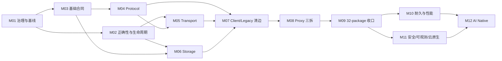

# RocketMQ Rust 架构重构迁移执行手册

> 状态：实施中（Phase 3；M10 真实性能/HUMAN Gate 待验收，M11 已完成安全 profile/bootstrap/rotation、MCP HTTPS/audit、五服务镜像、Helm/Kustomize、统一 probe/preStop/drain 与 Kind/K3d fault 执行/证据门禁，PR-M11-12 正在按 owner 子切片收口）
> 设计依据：[`docs/architecture-refactor-design.md`](../../architecture-refactor-design.md)
> 架构审计基线：`f545d638`
> crate 与源码迁移复核基线：`6d152248`
> 当前复核状态：根 workspace 已达到目标 32 个 package；75/82 工作包完成，PR-M11-12 进行中，
> PR-M12-01～06 未开始，合计剩余 7 个

剩余任务数量、M11-12 内部执行批次与 M12 六个工作包见 [`REMAINING-TASKS.md`](REMAINING-TASKS.md)：正式口径
剩余 7 个工作包；31 个最小可审查单元已完成 13 个，当前剩余 18 个。Issue #8627 / M11-12bc103 后
reviewed ArcMut baseline 降至 28 identities / 67 occurrences（production 11/18、test 3/9、
compatibility 14/40）；Broker runtime 现在是唯一 Store 生命周期强 owner，EscapeBridge 与 Admin runtime
只保留标准弱 provider，强引用仅存在于单次请求或生命周期操作期间；Admin 和 processor 不再取得完整
Store 可变租约，只能调用 append、read-mode 和 topic-delete 三个具名操作。

## 1. 使用方式

本目录把总体设计转换为 12 个可独立审查、验证和回滚的里程碑。当前交付拓扑经用户批准为
“每个 PR-Mxx-yy 工作包一个 Issue、一个 branch、一个 ready PR”；任务文档中的 PR-Mxx-yy 是独立交付、
验证、回滚和证据索引单位。

- 里程碑实施细节以本页“里程碑导航”链接的 12 份任务文档为准。
- 全局进度、每次 PR 完成记录与 Phase Gate 签署统一填写 [`CHECKLIST.md`](CHECKLIST.md)。

1. Human Architect 先确认当前里程碑的入口条件和兼容决策。
2. Architect 与 Tester 在写代码前分别冻结设计边界和验证路线。
3. Developer 获得唯一 writer lease，按文件中的 PR 顺序实施；其他 Agent 此时只读。
4. Developer 结束后冻结 Git 快照，Reviewer 与 Tester 对同一快照并行工作。
5. 任何修复都回到同一 Developer；修复产生新快照，并使受影响的旧审查与测试结论失效。
6. 只有 Exit Checklist 全部满足，Human Architect 才能批准进入下一里程碑。

### 1.1 Git 与多 Agent 交付约束

- 每个工作包从最新 `main` 创建独立 branch；只使用 branch，不使用 worktree。
- 每个工作包创建一个 GitHub Issue 和一个 ready PR；PR 不等待 CI 完成即可由管理员 squash merge。
- squash merge subject 必须为 `PR标题 (#PR号)`；合并后切回 `main`、拉取最新提交，再创建下一 Phase branch。
- 多 Agent 只并行处理文件集合互不重叠的 writer lane；root manifest、lockfile、CI、architecture baseline、
  public re-export 和最终集成始终由主协调者单写。
- Reviewer、Tester 和只读审计 Agent 可并行；其结论必须绑定同一冻结候选快照。

所有 Agent 都可以完整读取 workspace、依赖图、测试和构建产物；“Architect/Reviewer/Tester 不写源文件”是 writer lease 约束，不是权限缺失。

### 1.2 角色标签

| 标签 | 责任 |
|---|---|
| `[HUMAN]` | 批准兼容性、持久格式、安全默认值、架构例外和阶段 Gate |
| `[ARCH]` | 冻结接口、依赖方向、ADR、迁移批次和回滚边界 |
| `[DEV]` | 唯一源文件写入者；实现、局部格式化、修复和证据整理 |
| `[REV]` | 独立检查实现、兼容面、依赖闭包、错误和生命周期语义 |
| `[TEST]` | 独立执行验证矩阵、故障注入、性能对比和 standalone consumer 验证 |

每次 Agent handoff 必须包含 `status`、`summary`、`artifacts`、`next_actions`；被阻塞时还必须包含 `stop_reason`。

## 2. 目标 package 变化

M01 入口有 22 个根 workspace package；M03 加入 `rocketmq-model` 和 `rocketmq-security-api`，M04 加入
`rocketmq-protocol`，M05 加入 `rocketmq-transport`，M06 capability spike 加入 `rocketmq-store-api`，
M06-03a leaf foundation 加入 `rocketmq-store-local`，PR-M06-09 加入 `rocketmq-store-rocksdb`，PR-M08-01
加入 `rocketmq-proxy-core`，PR-M08-03 加入 `rocketmq-proxy-cluster`，PR-M08-04 加入
`rocketmq-proxy-local`，当前已精确达到目标 32 个。
以下 10 个新 crate 已全部按计划加入：

| 新 crate | 首次创建里程碑 | 最终职责 |
|---|---:|---|
| `rocketmq-model` | M03 | 无 Tokio 的稳定值对象、Client 中立结果和分配算法 |
| `rocketmq-security-api` | M03 | 协议无关 RequestContext、RequestPolicy、OutboundSigner |
| `rocketmq-protocol` | M04 | request/response code、command、header/body、wire schema |
| `rocketmq-transport` | M05 | TCP/TLS/codec/session/admission/client/server |
| `rocketmq-store-api` | M06 | 窄存储 capability、receipt、progress 和中立错误 |
| `rocketmq-store-local` | M06 | 唯一 CommitLog/WAL、CQ、Index、HA 和本地恢复 |
| `rocketmq-store-rocksdb` | M06 | 复用 Local CommitLog 的 RocksDB CQ/Index 实现 |
| `rocketmq-proxy-core` | M08 | 中立 plan/port/status/error 与 ingress |
| `rocketmq-proxy-cluster` | M08 | 完整 Client lifecycle 的远程集群 adapter |
| `rocketmq-proxy-local` | M08 | 无 Client 的嵌入式 Broker/store adapter |

`rocketmq-common`、`rocketmq-remoting`、`rocketmq-store` 和 `rocketmq-proxy` 在 R0/R1 期间保留，分别承担兼容 facade 或 composition 职责；`rocketmq-rust` 作为遗留并发与调度兼容层排空，不是新的 umbrella crate。

## 3. 里程碑导航

下表的数值是单个里程碑在其责任泳道内的**局部工程工作量/排期窗口**，用于配置人员和 writer lease；里程碑之间存在并行、等待和 Gate 重叠，因此这些数值不可相加，也不是端到端日历工期。

| 阶段 | 里程碑 | 局部工程窗口（不可相加） | 主要产出 | 依赖 |
|---|---|---:|---|---|
| Phase 1 | [M01 治理与基线](phase-1-safety-foundation/01-governance-and-baselines.md) | 1–2 周 | 依赖、ArcMut、兼容与性能基线 | 无 |
| Phase 1 | [M02 正确性与生命周期](phase-1-safety-foundation/02-correctness-and-lifecycle.md) | 3–4 周 | flush、task lease、pending RAII、绝对 deadline | M01 |
| Phase 1 | [M03 基础合同](phase-1-safety-foundation/03-foundation-contracts.md) | 3–4 周 | model/security-api、Client 中立类型、observability 解耦 | M01；与 M02 可并行 |
| Phase 2 | [M04 Protocol 提取](phase-2-core-boundaries/04-protocol-extraction.md) | 2–3 周 | protocol crate、wire golden、remoting re-export | M03 |
| Phase 2 | [M05 Transport 提取](phase-2-core-boundaries/05-transport-extraction.md) | 3–4 周 | transport crate、有界 admission、remoting facade | M02、M04 |
| Phase 2 | [M06 Storage 边界提取](phase-2-core-boundaries/06-storage-boundary-extraction.md) | 4–6 周 | store-api/local/rocksdb、store facade | M02、M03 |
| Phase 2 | [M07 Client 与 Legacy 清边](phase-2-core-boundaries/07-legacy-and-client-edge-burn-down.md) | 3–4 周 | Client allowlist、admin adapter、Dashboard 迁移 | M04–M06 |
| Phase 2 | [M08 Proxy 三向拆分](phase-2-core-boundaries/08-proxy-three-way-split.md) | 3–4 周 | proxy core/cluster/local | M05–M07 |
| Phase 2 | [M09 Facade 与 32-package 收口](phase-2-core-boundaries/09-facade-and-package-closeout.md) | 1–2 周 | 32-package Gate、R0 发布证据 | M04–M08 |
| Phase 3 | [M10 耐久性与性能](phase-3-production-readiness/10-durability-and-performance.md) | 5–8 周 | WAL outbox、Tiered cursor、Compaction generation、性能门禁 | M09 |
| Phase 3 | [M11 安全、可观测性与云原生](phase-3-production-readiness/11-security-observability-cloud.md) | 4–6 周 | secure profile、semantic registry、镜像与部署演练 | M09；部分与 M10 并行 |
| Phase 4 | [M12 AI Native 运维](phase-4-ai-native/12-ai-native-operations.md) | 8–12 周 | KG/RAG、确定性诊断、独立 Apply 安全边界 | M10、M11 |

## 4. 关键路径、阶段工期和并行泳道



- Mermaid 图表达依赖 Gate，不用于把里程碑局部窗口相加计算工期。
- 4–6 名核心工程师下，M02 与 M03 可并行；M04 与 M06 在合同冻结后可并行；M10 与 M11 可按存储和平台泳道并行。
- 同一文件或同一兼容面不能由两个 Developer 并行修改；协调者按 writer lease 解决重叠。

### 4.1 权威 Phase wall-clock

| Phase | 串行阶段日历窗口 | 日历边界 |
|---|---:|---|
| Phase 1 | 6–8 周 | 从治理基线开始，到 P0/foundation Gate 签署 |
| Phase 2 | 12–16 周 | 从首个边界 crate 开始，到 32-package Gate 签署 |
| Phase 3 | 8–12 周 | 从生产化实现开始，到 durability/security/cloud Gate 签署 |
| Phase 4 | 8–12 周 | 从 KG/RAG 实现开始，到 AI Native Gate 签署 |
| **四个 Phase 完全串行** | **34–48 周** | **四个阶段窗口的唯一可加总口径** |

接口稳定后采用跨 lane 重叠时，端到端规划窗口为 **24–32 周**。该区间不是重新相加里程碑数字，而是让以下准备和实现重叠约 10–16 周：M03 合同冻结后，Protocol/Storage lane 可在 M02 剩余收口期间启动；Phase 2 候选接口稳定后，性能基线、安全/镜像资产准备可在正式 Gate 前并行；M11 的 telemetry/security contract 冻结后，Phase 4 的离线 KG/RAG schema 与 eval corpus 可在 M10/M11 收口期间准备。正式 Phase Gate 的批准顺序仍为 1→2→3→4，未满足前置 Gate 的代码不得发布或扩大流量。

## 5. Client 直接依赖白名单

目标态完整 `rocketmq-client-rust` 的直接 manifest 依赖和源码 import 只允许出现在：

1. workspace：`rocketmq-proxy-cluster`；
2. workspace：`rocketmq-admin-core/src/client_adapter/`；
3. standalone：`rocketmq-example`。

Broker、NameServer、MCP、Dashboard、`rocketmq-proxy-core` 和 `rocketmq-proxy-local` 必须同时满足 manifest/source 无直接边。
Broker、NameServer、`proxy-core/local`、common 与 remoting 还要验证 normal dependency 的完整传递闭包不含 Client。
MCP 与 Dashboard 只能经 `rocketmq-admin-core` 的受控 adapter 间接到达 Client。M07 的精确永久 allowlist、Proxy M08
临时账本和物理拆分输入见 [`Client 边界收口与 M08 交接清单`](phase-2-core-boundaries/07-client-edge-closeout-handoff.md)。

## 6. 工作包追踪

| WP | 工作包 | 主里程碑 | 延续验证 |
|---:|---|---|---|
| WP01 | `arc-mut-freeze` | M01 | M02、M07、M11 |
| WP02 | `flush-result` | M02 | M06、M10 |
| WP03 | `task-child-lease` | M02 | M05、M11 |
| WP04 | `pending-request-guard` | M02 | M05 |
| WP05 | `shutdown-deadline` | M02 | M07、M11 |
| WP06 | `dependency-policy` | M01 | M03–M09 |
| WP07 | `observability-decouple` | M03 | M11 |
| WP08 | `model-security-leaves` | M03 | M04、M05、M11 |
| WP09 | `protocol-boundary-spike` | M04 | M05、M09 |
| WP10 | `transport-boundary-spike` | M05 | M09 |
| WP11 | `storage-capability-spike` | M06 | M10 |
| WP12 | `store-local-extract` | M06 | M10 |
| WP13 | `store-rocks-extract` | M06 | M10 |
| WP14 | `tiered-cursor` | M10 | M11 |
| WP15 | `rocketmq-rust-drain` | M07 | M11 |
| WP16 | `secure-profile-dry-run` | M03 | M11 |
| WP17 | `client-neutral-types` | M03 | M04、M07、M08 |
| WP18 | `client-edge-burn-down` | M07 | M08、M09 |
| WP19 | `proxy-three-way-split` | M08 | M09 |

每个 WP 必须在主里程碑中产生代码、测试和证据；“延续验证”只验证后续集成，不替代主交付。

## 7. 版本与兼容策略

### R0：新增边界且保持行为

- 新增当期需要的 canonical crate 和类型；旧 public path 通过精确 re-export/adapter 保持类型身份和行为。
- 不删除 public item，不改变 wire code、header、Serde 字段、存储格式或当前默认 feature 语义。
- Proxy facade 对 cluster/local 仍是非 optional，继续保持当前 `default = []` 行为。
- Admin legacy facade 保留现有 client/common 签名，兼容 feature 显式蕴含 `client-adapter`。

### R1：迁移所有仓内消费者

- workspace 与 standalone consumer 改用 canonical owner；CI 禁止新增 facade/legacy 依赖。
- facade ledger 只能下降；deprecated path 仍保留给外部消费者。
- 形成 public API 使用证据和下一 major 删除清单。

### 下一 major：删除已公告兼容面

- 删除已跨完整 R0/R1 周期、API diff 已公告且外部用量满足门槛的 deprecated 深路径。
- Proxy adapter 改为 optional，启用 `cluster-mode`、`local-mode` 和 `compat-all-modes`。
- 删除 admin-core 的 `legacy-common-compat`、common 的 protocol/observability compatibility dependency，以及已经排空的 remoting/legacy 深路径。
- `rocketmq-store` 的 backend composition 职责可长期保留，不因目录整齐而强制删除。

M09-05 发布包索引：[`R0 release notes`](phase-2-core-boundaries/09-r0-release-notes.md)、
[`R1 consumer migration plan`](phase-2-core-boundaries/09-r1-consumer-migration-plan.md)、
[`next-major removal plan`](phase-2-core-boundaries/09-next-major-removal-plan.md) 与
[`release package evidence`](phase-2-core-boundaries/09-r0-r1-next-major-release-package-evidence.md)。机器可读版本为
`scripts/architecture-release-plan.json`，由 `scripts/architecture_release_guard.py` 和 CI 同步守卫。

## 8. 全局不变量

- CommitLog 是唯一权威 WAL；CQ、Index、RocksDB、Tiered 只持久 cursor/watermark 等派生元数据；Compaction
  额外持久只含 live record 的可重建 generation，但不承担 WAL、replay source 或主写 ack 职责。
- SyncFlush 只有在 durable watermark 达标后确认；失败不得推进 watermark。
- 生产 task/thread/connection/pending request 都有 owner、count+byte budget、绝对 deadline 和完成报告。
- 基础合同 crate 不通过 feature 引入 Tokio、transport、facade、service 或 native backend。
- AI/MCP 不进入消息数据面；现有 Plan Tool 始终无副作用，未来 Apply 使用独立安全边界。
- 机械迁移、行为修复和公开 feature 语义变化分开提交。
- wire/storage/public API 是兼容面；无明确版本化、双读/双写和回滚计划时不得改变。

## 9. 统一合并门禁

每个 PR 按以下顺序取证：focused test → package check/test → 精确 feature → 受影响 workspace/standalone consumer → specialized guard → Reviewer/Test 结论。

### 9.1 当前仓库已经存在、可执行的命令

```powershell
cargo fmt --all -- --check
cargo clippy --workspace --no-deps --all-targets --all-features -- -D warnings
python scripts/architecture_dependency_guard.py --mode target
python scripts/architecture_dependency_guard.py --mode baseline
python scripts/architecture_release_guard.py
python scripts/architecture_performance_guard.py --validate-profiles
python scripts/architecture_performance_guard.py --baseline <baseline.json> --candidate <candidate.json>
python scripts/telemetry_semantic_guard.py
python scripts/arc_mut_guard.py
.\scripts\kubernetes-assets-contract.ps1
python -m unittest scripts.tests.test_m11_kubernetes_assets -v
.\scripts\runtime-audit.ps1 -SkipBaseline -EnforceBoundaryBaseline
.\scripts\check-error-hygiene.ps1
python scripts/error_architecture_guard.py
.\scripts\check-agents-routing.ps1
git diff --check
```

这些命令按变更触发范围累积执行。纯文档 PR 只要求链接/内容自检与 `git diff --check`，不需要 Cargo 验证。

### 9.2 由里程碑新增后才执行的命令

下列脚本仍是 M11 后续工作包的计划交付物，当前不能作为已存在的门禁报告成功：

```powershell
.\scripts\kind-architecture-refactor-e2e.ps1
```

M10 性能 guard 已落地；`--validate-profiles` 只验证合同，baseline/candidate 命令只有消费真实目标硬件报告时
才构成性能验收。M11 telemetry semantic guard 已随 PR-M11-01 落地并包含正向和故意违规 fixture；Helm/
Kustomize contract 已随 PR-M11-09 落地并校验确定性 render、Kubernetes 1.32 schema 与部署策略；统一 lifecycle、
HTTP probe、preStop 与单一绝对 deadline contract 已随 PR-M11-10 落地。PR-M11-11 已交付 Kind/K3d 七场景
执行器、版本化 fault/evidence policy、正负 fixture 和动态 workflow；本机未具备 Docker/集群/签名镜像/Secret，
所以 `dynamic_execution=true` Gate 仍待真实运行，fixture 不签署该 Gate。
M11-12 已开始按 owner 子切片收口；首个 owned-value leaf 将 ArcMut guard 的 production 条目从 760 降为
733、production occurrence 从 2,125 降为 2,082，并移除 Common 自身的 nightly unsafe-cell 需求。该下降不改变
75/82 总进度；Remoting/Controller/NameServer/Client/Broker/Store owner、compatibility 删除与 stable/SLO/HUMAN
Gate 仍由 [`M11-12 进度证据`](phase-3-production-readiness/11-soundness-closure-progress.md) 跟踪。
Controller config owner 随 Issue #8295 改为不可变原子快照后，累计进一步降至 711 production/2,029 occurrence；
`ArcMut<ControllerConfig>` 已清零，但 Controller 的其他 owner 仍有 31 条 production 债务，75/82 总进度不变。
Controller manager/heartbeat owner 随 Issue #8297 改为安全 `Arc`/`Weak` 与内部同步生命周期后，实际快照进一步降至
697 production/1,986 occurrence；Controller 降至 17 条/51 occurrence。M11-12 父工作包、stable/SLO/HUMAN
Gate 与其他 owner 仍未完成。Controller Raft owner 随 Issue #8299 改为 `Arc` 与内部串行生命周期后，实际快照降至
690 production/1,961 occurrence，Controller 降至 10 条/26 occurrence，Raft/OpenRaft `ArcMut` 清零。Controller
request processor owner 随 Issue #8301 将业务 handler 收窄为共享 receiver、wrapper 改为 `Arc` 后，实际快照降至
688 production/1,959 occurrence，Controller 降至 8 条/24 occurrence；总进度仍为 75/82。
NameServer runtime/processor owner 随 Issue #8303 改为安全 `Arc` 根、`Weak` child handle、`ArcSwap` 配置快照和
内部同步 batch/KV/V1 wrapper 后，实际快照降至 669 production/1,918 occurrence，NameServer 降至 28 条/58
occurrence。剩余 NameServer 债务精确为 V1 tables 16/44、remoting client 4/5 和 `ConnectionHandlerContext` 8/9；
总进度仍为 75/82，M11-12 父工作包未完成。
Remoting Channel/Context owner 随 Issue #8307 改为安全 `Arc`、cloneable connection lifecycle handle 与显式串行
writer 后，实际快照降至 514 production/1,612 occurrence；Channel/Context 定向债务清零，并同步移除
Broker/Client/Controller/NameServer/Auth/Proxy 中由旧 Context 别名传播的条目。剩余 production 债务为 Broker
192/574、Client 147/604、Store 127/324、Remoting 21/41、NameServer 20/49、Controller 4/6、Tools 3/14；
总进度仍为 75/82，后续 owner、compatibility、stable/SLO/HUMAN Gate 保持开放。
Remoting client/handler owner 随 Issue #8309 改为安全 `Arc` handler、每请求 clone-local processor adapter、显式
同步的 hook/NameServer 选择状态与标准 `Arc`/`Weak` lifecycle 后，实际快照降至 488 production/1,559
occurrence。Controller production 债务清零，NameServer 仅剩 V1 tables 16/44，Remoting 仅剩 protocol
compatibility 6/9；剩余为 Broker 190/569、Client 146/599、Store 127/324、NameServer 16/44、Remoting
6/9、Tools 3/14。总进度仍为 75/82，M11-12 总 Gate 未关闭。
NameServer V1 tables 随 Issue #8311 从 `ArcMut<HashMap>` 改为 manager 独占普通 `HashMap`，所有 mutation 由
既有 `Mutex<RouteInfoManager>` wrapper 串行并要求 `&mut self`；实际快照降至 472 production/1,515
occurrence，NameServer production 债务清零。剩余为 Broker 190/569、Client 146/599、Store 127/324、
Remoting protocol compatibility 6/9 与 Tools 3/14；总进度仍为 75/82。
Remoting protocol compatibility 随 Issue #8313 删除固定 `ArcMut` header/mapping-detail facade，并直接 re-export
Protocol canonical owned wire DTO；实际快照降至 466 production/1,505 occurrence，Remoting production 债务
清零。剩余为 Broker 190/568、Client 146/599、Store 127/324 与 Tools 3/14；总进度仍为 75/82。
Client ProduceAccumulator owner 随 Issue #8315 从 Manager/Producer 传播的 `ArcMut` 改为安全 `Arc`，运行时配置由
原子状态发布，guard task handle/schedule sender 由显式 lifecycle mutex 串行且异步关闭不跨同步锁 await；实际快照
降至 463 production/1,495 occurrence，Client 降至 143/589。剩余为 Broker 190/568、Client 143/589、Store
127/324 与 Tools 3/14；总进度仍为 75/82，M11-12 父工作包未完成。
Client latency fault detector 随 Issue #8317 将 trait、strategy、queue filter 与 scheduled task capture 全部改为安全
`Arc`；配置由原子状态发布，resolver/service detector 只经短 `RwLock` 取得 `Arc` 快照，task lifecycle 在单一 mutex
内串行并排除 shutdown 期间 restart。实际快照降至 454 production/1,481 occurrence，Client 降至 134/575；
剩余为 Broker 190/568、Client 134/575、Store 127/324 与 Tools 3/14，总进度仍为 75/82。
Client message ownership 随 Issue #8319 将 `PullResult` 改为 owned `MessageExt`，ProcessQueue、consume request、hook、
trace 与 Lite zero-copy 改用标准 `Arc<MessageExt>`；retry/namespace mutation 使用 clone-on-write，ProcessQueue 单独跟踪
消费开始时间，不再依赖共享消息别名写入。实际快照降至 440 production/1,397 occurrence，Client 降至 120/491；
剩余为 Broker 190/568、Client 120/491、Store 127/324 与 Tools 3/14，总进度仍为 75/82。
Client consume service lifecycle 随 Issue #8321 将通用分发器、concurrent/orderly 与 Push/Pop service owner/task capture
改为标准 `Arc`/`Weak`；lifecycle 与 request API 只经 `&self`，Pop orderly lock-refresh handle 在 mutex 内发布并在
await 前取出。实际快照降至 436 production/1,337 occurrence，Client 降至 116/431；剩余为 Broker 190/568、
Client 116/431、Store 127/324 与 Tools 3/14，总进度仍为 75/82。
Client send hook/trace context owner 随 Issue #8323 将异步 after-hook 改为不可变 hook 列表快照，删除
`SendMessageContext` 中仅用于反向调用的 Producer owner；trace dispatcher 只保存启动后解析出的 client id，不再
持有 host Producer/Consumer 实现。实际快照降至 432 production/1,329 occurrence，Client 降至 112/423；剩余为
Broker 190/568、Client 112/423、Store 127/324 与 Tools 3/14，总进度仍为 75/82。
Client Admin facade self owner 随 Issue #8325 改为 Client 与 admin-core facade 直接拥有实现和单一
`ClientConfig`；ClientInstance 的 Admin group 注册值收窄为 owner-free marker，不再通过无读取用途的 self
`ArcMut` 保活完整 Admin 实现。实际快照降至 424 production/1,295 occurrence，Client 降至 107/403 且 Tools
production 债务清零；剩余为 Broker 190/568、Client 107/403 与 Store 127/324，总进度仍为 75/82。
Client Producer fault strategy 随 Issue #8327 改为 Producer 直接拥有；异步发送回调克隆延迟阈值快照，只共享
concurrency-safe detector 和原子运行时开关，不再共享可变策略 owner。实际快照降至 423 production/1,292
occurrence，Client 降至 106/400；剩余为 Broker 190/568、Client 106/400 与 Store 127/324，总进度仍为 75/82。
Client API factory owner 随 Issue #8329 改为普通 `Arc<MQClientAPIImpl>`；API client 的名称服务器地址缓存以异步
`RwLock` 串行判重和发布，shutdown/address refresh capability 收窄为 `&self`，factory 与周期刷新任务不再传播
shared-mutation owner。实际快照降至 421 production/1,286 occurrence，Client 降至 104/394；剩余为
Broker 190/568、Client 104/394 与 Store 127/324，总进度仍为 75/82，M11-12 父工作包未完成。
Client API instance owner 随 Issue #8331 将 `MQClientInstance`、Admin、Producer/Consumer 调用链中的
`MQClientAPIImpl` handle 改为普通 `Arc`；44 个不修改字段的历史 `&mut self` receiver 收窄为 `&self`，query/pull
后台任务只捕获 `Arc<Self>`，heartbeat 不再调用 `mut_from_ref`。实际快照降至 420 production/1,276 occurrence，
Client 降至 103/384；剩余为 Broker 190/568、Client 103/384 与 Store 127/324，总进度仍为 75/82。
Client internal Admin owner 随 Issue #8333 改为普通 `Arc<MQAdminImpl>`，root client handle 通过 `OnceLock` 仅绑定
一次，Admin forwarding receiver 收窄为 `&self`；Producer 删除 11 个仅为访问 Admin helper 的 `mut_from_ref`，
Consumer 删除冗余可变 client clone。实际快照为 420 production/1,263 occurrence，Client 降至 103/371；剩余为
Broker 190/568、Client 103/371 与 Store 127/324，总进度仍为 75/82。
Client route registry owner 随 Issue #8335 将 route refresh/application、route query、broker lookup 与 Producer 注册入口
收窄为 `&self`；Producer 路由/heartbeat/注册路径删除 4 个 safe `mut_from_ref`，仅保留真实 lifecycle start 的一个
可变入口。实际快照为 420 production/1,259 occurrence，Client 降至 103/367；剩余为 Broker 190/568、Client
103/367 与 Store 127/324，总进度仍为 75/82，M11-12 父工作包与最终目标 Gate 均未完成。
Client OffsetStore owner 随 Issue #8337 从 Push/Lite facade、实现、rebalance 与 callback 调用链中的 `ArcMut` 改为
普通 `Arc<OffsetStore>`；Remote/Local persistence capability 收窄为 `&self`，Local background task handle 以显式
lifecycle mutex 串行并在 await 前取出。实际快照降至 418 production/1,224 occurrence，Client 降至 101/332；
剩余为 Broker 190/568、Client 101/332 与 Store 127/324，总进度仍为 75/82，M11-12 父工作包未完成。
Client accumulator batch producer owner 随 Issue #8339 改为每个 `MessageAccumulation` 直接持有 owned
`DefaultMQProducer` clone；flush 在 batch mutex 内克隆 producer、释放锁后以局部可变值发送，删除该文件全部
ArcMut 构造、类型与 import。实际快照降至 415 production/1,219 occurrence，Client 降至 98/327；剩余为
Broker 190/568、Client 98/327 与 Store 127/324，总进度仍为 75/82，M11-12 父工作包未完成。
Client remote offset read access 随 Issue #8341 删除 `RemoteBrokerOffsetStore` 的 4 个过时 `mut_from_ref`：
broker lookup、route miss refresh 与 client API 读取直接使用 immutable `MQClientInstance` access，查询 header、
重试、timeout 与错误映射不变。实际快照降至 414 production/1,215 occurrence，Client 降至 97/323；剩余为
Broker 190/568、Client 97/323 与 Store 127/324，总进度仍为 75/82，M11-12 父工作包未完成。
Client Push operational access 随 Issue #8343 将 pull/pop request dispatch、retry namespace reset、POP ack 与
change-invisible receiver 收窄为 `&self`，并为 lazy namespace 提供不写 cache 的 immutable resolution；
RebalancePush heartbeat/dispatch 与 consume service 共删除 9 个过时 `mut_from_ref`。实际快照降至
411 production/1,206 occurrence，Client 降至 94/314；剩余为 Broker 190/568、Client 94/314 与 Store 127/324，
总进度仍为 75/82，M11-12 父工作包未完成。
Client orderly lock access 随 Issue #8345 将 Rebalance 单队列 unlock、全队列 lock/unlock capability 与 Push/Lite/
inner 实现收窄为 `&self`，broker lookup、request body、oneway 与 process-queue lock state 语义不变；orderly/POP-
orderly namespace reset 使用 immutable resolution，删除 3 个 `mut_from_ref`。实际快照降至 410 production/1,203
occurrence，Client 降至 93/311；剩余为 Broker 190/568、Client 93/311 与 Store 127/324，总进度仍为 75/82，
M11-12 父工作包未完成。
Client Lite Pull config snapshots 随 Issue #8347 将实现与 rebalance 配置改为 `ArcSwap` 不可变快照；同步 setter
通过 copy-update-publish 串行 CAS 发布完整代际，异步 pull/rebalance/metadata/diagnostics 只持有不可变 `Arc` 快照，
不跨 await 持有同步锁。兼容 facade 构造与 Java 行为保持，内部配置 owner 删除 34 个 `mut_from_ref`/`ArcMut`
occurrence。实际快照为 410 production/1,169 occurrence，Client 为 93/277；剩余为 Broker 190/568、Client 93/277
与 Store 127/324，总进度仍为 75/82，M11-12 父工作包与最终目标 Gate 均未完成。
Client Lite Pull facade config snapshots 随 Issue #8349 将 facade 的 client/consumer config 改为共享 `ArcSwap`；
公开 getter 返回 immutable owned `Arc` snapshot，consumer group 返回 owned value，构造边界接收 owned config，builder
不再创建或传播 `ArcMut`。这是为退出 production/public compatibility API 中不安全可变逃逸作出的显式 API 迁移；
`DefaultLitePullConsumer` 路径、builder、Java-compatible 方法名、namespace/TLS/trace/pull/offset 行为保持。实际快照降至
408 production/1,129 occurrence，Client 降至 91/237；剩余为 Broker 190/568、Client 91/237 与 Store 127/324，
总进度仍为 75/82，下一子切片处理 Lite Pull root lifecycle，M11-12 父工作包与最终目标 Gate 均未完成。
Client Lite Pull root lifecycle 随 Issue #8351 将 facade、consumer inner、rebalance listener、metadata/pull task 的
根 owner 改为标准 `Arc`/`Weak`，以专用异步 lifecycle mutex 串行 start/shutdown 与订阅控制面；同步状态和组件槽位只在
短锁内发布或克隆快照，锁外执行 await。Rebalance offset store 改为 `ArcSwapOption`，consumer 注册与订阅表写入收窄为
`&self`，未新增 shared-mutation occurrence。实际快照降至 402 production/1,102 occurrence，Client crate 降至
85/210；剩余为 Broker 190/568、Client 85/210 与 Store 127/324，总进度仍为 75/82，M11-12 父工作包未完成。
Client PullAPIWrapper immutable access 随 Issue #8353 将 Lite/Push 的 wrapper owner 改为标准 `Arc`；unit mode、
user-broker selection 与 broker id 使用原子发布，filter hook 列表使用 `ArcSwap` 整代快照，pull/POP/filter-server
调用收窄为 `&self` 并复用 immutable MQ client API accessor。实际快照为 402 production/1,095 occurrence，Client
为 85/203；剩余为 Broker 190/568、Client 85/203 与 Store 127/324，总进度仍为 75/82，M11-12 父工作包未完成。
Client Push message listener ownership 随 Issue #8355 将 facade config、implementation 与 Java-compatible getter/setter
中的 listener handle 改为标准 `Arc<MessageListener>`；concurrent/orderly 注册、替换和清除语义保持，公开 API 不再暴露
共享可变 wrapper。实际快照为 402 production/1,086 occurrence，Client 为 85/194；剩余为 Broker 190/568、Client
85/194 与 Store 127/324，总进度仍为 75/82，M11-12 父工作包未完成。
Client Push subscription snapshots 随 Issue #8357 将 deprecated startup subscription map 改为标准
`Arc<HashMap>`；config、builder 和 Java-compatible getter/setter 使用 immutable owned snapshot，启动时只读复制到
独立 dynamic rebalance table。实际快照降至 400 production/1,078 occurrence，Client 降至 83/186；剩余为 Broker
190/568、Client 83/186 与 Store 127/324，总进度仍为 75/82，M11-12 父工作包未完成。
Client Push consume service config snapshots 随 Issue #8359 将 concurrent/orderly 与 POP concurrent/orderly 四类服务的
`ClientConfig`/`ConsumerConfig` 改为启动时创建并成对注入的 immutable `Arc` 快照；服务内只读使用同一配置代际，仍需实时
运行状态的 callback 继续通过 Push implementation owner 访问。实际快照降至 398 production/1,054 occurrence，Client owner
降至 80/161，另有 Proxy 1/1；剩余为 Broker 190/568、Client 80/161、Proxy 1/1 与 Store 127/324，总进度仍为
75/82，M11-12 父工作包未完成。
Client Push rebalance config snapshots 随 Issue #8361 将 RebalancePush 的共享可变 consumer config 改为 `ArcSwap` 完整
不可变代际；相关 facade setter 显式同步，queue-count 变化只通过 Push implementation owner 回写两个 per-queue threshold，
listener 与 offset 策略读取不再依赖整份配置的共享写别名。实际快照为 398 production/1,052 occurrence，Client owner
降至 80/159，另有 Proxy 1/1；剩余为 Broker 190/568、Client 80/159、Proxy 1/1 与 Store 127/324，总进度仍为
75/82，M11-12 父工作包未完成。
Client Push root config snapshots 随 Issue #8363 将 facade 与 implementation 共享的 `ArcMut<ConsumerConfig>` 根别名
替换为同一个 `Arc<ArcSwap<ConsumerConfig>>`；所有 setter clone-update-publish 完整配置代际，启动、回调、diagnostics、
trace 与动态 threshold 更新读取稳定 immutable `Arc` 快照，公开 consumer-group getter 返回 owned value。实际快照降至
397 production/1,045 occurrence，Client owner 降至 79/152，Client test 从 47/145 降至 47/132；剩余为 Broker
190/568、Client 79/152、Proxy 1/1 与 Store 127/324，总进度仍为 75/82，M11-12 父工作包未完成。
Client Push implementation root ownership 随 Issue #8365 将 facade、consumer registry、pull/pop callback 与 task capture
统一为标准 `Arc<DefaultMQPushConsumerImpl>`，root-owned consume/rebalance 回边统一为 `Weak`；start/shutdown 由单一
lifecycle mutex 串行，组件槽位与 rebalance metadata 只在短同步锁内发布完整快照，异步路径锁外工作。实际快照降至
376 production/995 occurrence，Client owner 降至 58/102，Client test 降至 25/102；剩余为 Broker 190/568、Client
58/102、Proxy 1/1 与 Store 127/324，总进度仍为 75/82。下一子切片为 M11-12ak Client Rebalance root ownership，
M11-12 父工作包未完成。
Client Rebalance root ownership 随 Issue #8367 将 Push/LitePull concrete rebalance root 改为标准 `Arc`，并将
`RebalanceImpl` self-reference 与 concrete setter 改为标准 `Weak`；两个释放后 weak upgrade 失败的定向测试证明
self-reference 不会保活 root。实际快照降至 368 production/982 occurrence，Client owner 降至 50/89；剩余为 Broker
190/568、Client 50/89、Proxy 1/1 与 Store 127/324，总进度仍为 75/82。下一子切片为 M11-12al Client
MQClientInstance root ownership，M11-12 父工作包未完成。
Client MQClientInstance root ownership 随 Issue #8369 将 Manager/Proxy compatibility handle 与
Admin/Producer/Consumer/Rebalance/API/OffsetStore 持有链统一改为标准 `Arc<MQClientInstance>`，Remoting/Admin
回指统一为标准 `Weak`；lifecycle transition、API slot 与 connection task handle 使用显式同步，运行路径收窄为共享
receiver。实际快照降至 326 production/909 occurrence，Client owner 降至 9/17、Client test 降至 12/83，Proxy
production 债务清零；剩余为 Broker 190/568、Client 9/17 与 Store 127/324，总进度仍为 75/82。下一子切片为
M11-12am Client Producer root ownership，M11-12 父工作包未完成。
Client internal child ownership 随 Issue #8371 将 `MQClientInstance::pull_message_service` 改为标准 `Arc`，并以
单一 Tokio Mutex 直接拥有 internal DefaultMQProducer，取代原本在完整 start/shutdown/send future 上持有的独立
transition mutex；序列化范围与锁顺序不变。实际快照降至 323 production/904 occurrence，Client owner 降至 6/12；
剩余为 Broker 190/568、Client 6/12 与 Store 127/324，总进度仍为 75/82。下一子切片为 M11-12an 完整 Producer
root/registry/standard-weak 与强引用环拆除，M11-12 父工作包未完成。
Client Producer root ownership 随 Issue #8375 将 DefaultMQProducer facade/implementation/registry 统一为标准
`Arc`/`Weak`，以单一 runtime snapshot、短锁配置发布、异步 lifecycle、task admission 和 owner-aware unregister
替代共享可变 root；发送与重试不经过全局 impl mutex。clone-shared append-only immutable config generations 保持
既有 borrowed getter API 且消除 clone 间 lost update。公开 implementation getter carrier 从 `ArcMut` 迁移为标准
`Arc`，这是移除 unsafe mutation capability 的有意 source break。实际快照降至 317 production/892 occurrence，
Client production 清零、Client test 降至 4/71；剩余为 Broker 190/568 与 Store 127/324。总进度仍为 75/82，
下一子切片 M11-12ao 进入 Broker owner，M11-12 父工作包未完成。
Broker topic metadata table ownership 随 Issue #8377 将 `TopicRouteInfoManager` 的 route、broker-address、publish 和
subscribe 四张共享表改为标准 `Arc<DashMap>`，并将 `TopicQueueMappingManager` 的表项改为不可变标准 `Arc` 整值代际；
读取先克隆完整值，guard 在同表写入或 `.await` 前释放，decode/clean 只发布完整 replacement；cleanup 以 observed
`Arc` identity 做条件发布，拒绝覆盖并发新代际，旧 mapping 代际继续有效。
实际快照降至 312 production/873 occurrence、194 test/551 occurrence，Broker 降至 185/549；剩余为 Broker
TopicConfig/offset/root/schedule/POP/processor/transaction 与 Store 127/324。总进度仍为 75/82，下一子切片
M11-12ap 处理 Broker TopicConfig value/DataVersion ownership，M11-12 父工作包未完成。
Broker topic configuration ownership 随 Issue #8379 将 TopicConfig table/snapshot/Store carrier 改为不可变标准 `Arc`
整值代际；表写入、快照和 DataVersion 在单一 metadata transition 中原子提交，派生更新在锁内重读当前代际以避免
lost update。全量、单 Topic 与增量注册共用异步发送顺序锁并在取锁后重采样当前配置/版本；持久化捕获同一提交，
slave replacement 一次替换完整表和版本。实际快照降至 300 production/783 occurrence、168 test/466 occurrence，
Broker 降至 178/475、Store 降至 122/308；总进度仍为 75/82，下一子切片 M11-12aq 处理 Broker POP buffer
merge service ownership，M11-12 父工作包未完成。
Broker POP buffer ownership 随 Issue #8381 将 `PopBufferMergeService`、checkpoint buffer 与 commit-offset queue
carrier 改为标准 `Arc`；checkpoint 可变状态继续通过原子字段发布，扫描计数使用原子值，批量 ACK scratch 由单一扫描
任务独占并跨轮次复用。扫描先克隆完整 checkpoint 代际并在 `.await` 前释放 DashMap guard，清理以 observed Arc identity
条件删除，commit-offset FIFO 不再随 checkpoint buffer 项提前整队删除。实际快照降至 298 production/764 occurrence、
167 test/464 occurrence，Broker 降至 176/456；总进度仍为 75/82，下一子切片 M11-12ar 处理 Broker POP
processor/long-poll lifecycle ownership，M11-12 父工作包未完成。
Broker POP lifecycle ownership 随 Issue #8383 将 `PopMessageProcessor`、`NotificationProcessor` 与
`PopLongPollingService` root 改为标准 `Arc`，长轮询服务只保留 processor 的标准 `Weak` 回边，扫描任务同样只捕获
service `Weak`；共享 wake-up trait 直接经 `&self` 分发请求，不引入全局 processor mutex。异步 lifecycle gate 串行
start/shutdown/restart，`AtomicU64` 发布 cleanup 时间，TaskGroup 在 spawn 前完成发布且同步 guard 不跨 `.await`。
实际快照降至 296 production/738 occurrence、166 test/463 occurrence，Broker 降至 174/430；总进度仍为 75/82，
下一子切片 M11-12as 处理 Broker POP Lite processor/long-poll lifecycle ownership，M11-12 父工作包未完成。
Broker POP Lite lifecycle ownership 随 Issue #8385 将 `PopLiteMessageProcessor` 与
`PopLiteLongPollingService` root 改为标准 `Arc`，processor 回边与扫描任务 owner 改为标准 `Weak`；共享 wake-up trait
经 `&self` 分发请求，每次成功 start 创建新 channel 并发布 sender，双层异步 lifecycle gate 串行 start/shutdown/restart，
停止状态拒绝新增挂起。实际快照降至 294 production/725 occurrence、165 test/462 occurrence，Broker 降至 172/417；
总进度仍为 75/82，下一子切片 M11-12at 处理 Broker Pull processor/request-hold lifecycle ownership，M11-12 父工作包未完成。
Broker Pull lifecycle ownership 随 Issue #8387 将 `PullMessageProcessor`、`DefaultPullMessageResultHandler` 与
`PullRequestHoldService` carrier 改为标准 `Arc`，hold service 只保留 processor 标准 `Weak` 回边并通过窄 trait 获取动态
scan/store 能力，不再强持有 BrokerRuntimeInner；scan task 只捕获 service `Weak`。异步 lifecycle gate 串行
start/shutdown/restart，停止状态拒绝新挂起并清空既有请求，deadline 重建在 table read 边界内发布，master-change 路径不再
重入同一 Tokio RwLock。实际快照降至 289 production/706 occurrence、162 test/458 occurrence，Broker production 降至
167/398；compatibility 保持 14/40。总进度仍为 75/82，下一子切片 M11-12au 处理 Broker ConsumerOffsetManager
ownership，M11-12 父工作包未完成。
Broker ConsumerOffsetManager ownership 随 Issue #8389 将 `DataVersion` 改为 `ArcSwap` 不可变代际，并以单一
transition 串行 offset 表写入、版本计数和完整发布；`fetch_add` 返回值精确决定更新阈值，零步长不再除零 panic。
主从同步改用窄 merge API，JSON/RocksDB 在完整解析后一次发布，reset/pull 表可在主表为空时恢复；manager/table
Clone 与可写 table lock escape、无用 runtime mutable accessor 已删除。实际快照降至 287 production/699 occurrence、
160 test/455 occurrence，Broker production 降至 165/391；compatibility 保持 14/40。总进度仍为 75/82，下一
子切片 M11-12av 处理 Broker `ScheduleMessageService` 内部状态 ownership，M11-12 父工作包未完成。
Broker ScheduleMessageService 内部状态 ownership 随 Issue #8391 将 delay table/max level 改为单一 `ArcSwap`
不可变配置代际，将 offset/version/cadence 收敛到一个短 transition，并以 `ArcSwap<DataVersion>` 发布完整版本快照；
配置和主从 offset snapshot 均先完整解析、再整表替换。`ProcessStatus` 改为原子状态，pending queue 与 DashMap guard
不再跨 message-store/resend `.await`，同一 delay level 的 resend 以显式 in-progress 状态串行，已经发出的结果不会因并发
容量变化丢失跟踪。实际快照为 287 production/680 occurrence、158 test/453 occurrence，Broker production 为
165/372；compatibility 保持 14/40。总进度仍为 75/82，下一子切片 M11-12aw 处理 Schedule root capability、
task generation、shutdown ordering 与 blocking persistence ownership，M11-12 父工作包未完成。
Broker Schedule root/lifecycle ownership 随 Issue #8393 将 `ScheduleMessageService` 根 owner 改为标准 `Arc`，
以 Broker outer-owned `Arc<EscapeBridge>` 和 inner `Weak` 回边拆除运行时强引用环；Schedule、POP、ACK 与事务调用链
不再通过 EscapeBridge mutable root 跨 `.await`。每次 start 创建独立 generation TaskGroup child lease，任务只捕获
service `Weak`、generation 和 cancellation token，停止后先阻止重调度、取消并 drain，再执行唯一最终持久化；启动、停止、
重启和 peer snapshot 写入由 lifecycle/persistence gate 串行。生产 load、周期/最终/peer 写入均走 BlockingExecutor；
未显式注入 context 的公开 Builder 兼容路径复用既有 audited scheduler root 并在其下创建 owned blocking child。peer
写盘失败不发布内存 snapshot；Broker shutdown 在 message-store 前完成 schedule drain，控制器降级在 Store 仍为 Master 时
先完成 schedule 停止并传播失败。实际快照降至 282 production/654 occurrence、157 test/452 occurrence，Broker
production 降至 160/346；compatibility 保持 14/40。总进度仍为 75/82，下一子切片 M11-12ax 继续处理 Broker
其他 processor/transaction owner，M11-12 父工作包未完成。
Broker transaction service ownership 随 Issue #8395 将 `DefaultTransactionalMessageService` root 及 send/reply/end
transaction processor capability 改为标准 `Arc`，op-batch worker 只持标准 `Weak` 回边；transaction service API 改为
共享引用，原 bridge 可变调用由显式 Tokio mutex 串行。transaction check service 直接注入 immutable config、标准 Arc
service 与 listener，不再通过 BrokerRuntimeInner `mut_from_ref` 取得服务；listener 的无状态 Broker2Client 改用标准 Arc。
Broker shutdown 先停止 check service/listener，再停止 service/batch worker；batch flush 先在 delete-context 锁内生成 ready
snapshot，释放锁后才取消息和写盘，失败回退路径也不再嵌套获取同一 mutex。实际快照降至 274 production/634
occurrence、156 test/451 occurrence，Broker production 降至 152/326，transaction 子树从 13/19 降至 5/8；
compatibility 保持 14/40。总进度仍为 75/82，下一子切片 M11-12ay 继续处理 Broker 其他 processor 及
transaction bridge/listener carrier，M11-12 父工作包未完成。
Broker transaction processor root ownership 随 Issue #8398 将 send/reply/end-transaction processor variant 与 Broker
startup root 改为标准 `Arc`；共享入口为每个请求复制轻量 capability 句柄，保留并发执行且不引入 processor 级全局 mutex。
注册完成后只读的 request table/default processor 改用标准 `Arc`，启动期注册通过 copy-on-write 完成。实际快照降至
273 production/624 occurrence，test 保持 156/451，Broker production 降至 151/316；compatibility 保持 14/40。
总进度仍为 75/82，下一子切片 M11-12az 继续拆分 transaction bridge/listener capability 与其他 Broker owner，
M11-12 父工作包未完成。

Broker core request processor roots 随 Issue #8400 将 peek、polling-info、recall、query-message、client-manage、
consumer-manage 与 query-assignment 的 variant/startup root 改为标准 `Arc`，query-assignment runtime slot 同步退出
`ArcMut`。共享入口按请求复制只含共享 capability 的轻量句柄；Peek 直接使用共享 receiver，保持唯一原子序列状态且不引入
全局请求锁。实际快照为 273 production/605 occurrence，test 保持 156/451，Broker production 为 151/297；
compatibility 保持 14/40。总进度仍为 75/82，下一子切片 M11-12ba 配对拆分 transaction bridge/listener 与
TopicConfigManager runtime capability carrier，并继续收口 Broker admin/其他 processor；M11-12 父工作包未完成。

Broker auth admin handler ownership 随 Issue #8402 从 11 个 auth/user admin handler 删除从未读取的完整
`BrokerRuntimeInner` carrier 与无意义 `MessageStore` 泛型；handler 现在只持有标准 `Arc<AuthAdminService>`，Admin
processor wiring 与 auth ACL/user/global-white 行为保持不变。实际快照降至 259 production/580 occurrence，test 保持
156/451，Broker production 降至 137/272；compatibility 保持 14/40。总进度仍为 75/82，下一子切片 M11-12bb
配对拆分 transaction bridge/listener 与 TopicConfigManager runtime capability carrier；M11-12 父工作包未完成。

Broker registration carrier ownership 随 Issue #8404 删除 `BrokerOuterAPI::register_broker_all` 从未使用的
`MessageStore` 泛型与完整 BrokerRuntime 参数；TopicQueueMappingInfo 注册 payload 直接以 owned `HashMap` 进入 wire
wrapper，不再建立临时 `ArcMut` map 后重新克隆。实际快照降至 257 production/576 occurrence、155 test/450
occurrence，Broker production 降至 135/268；compatibility 保持 14/40。总进度仍为 75/82，下一子切片
M11-12bc1 完成 TopicConfigManager 非泛型标准 Arc owner 边界；M11-12 父工作包未完成。

TopicConfigManager runtime ownership cycle 随 Issue #8406 拆除：manager 不再泛化于 `MessageStore`，不再持有
BrokerRuntime back-reference，也不再暴露 mutable/unchecked accessor；状态更新显式接收 state-machine generation，动态
policy 在 Broker workflow 中实时采样，异步任务直接持有 `Arc<TopicConfigManager>`，并以 RAII guard 保证 pending persist
计数在成功、失败、panic 或 abort 时都能释放。实际快照降至 255 production/571 occurrence，test 保持 155/450，
Broker production 降至 133/263；compatibility 保持 14/40。总进度仍为 75/82，下一子切片 M11-12bc2 建立独立
persistence/registration coordinator、BlockingExecutor、admission/drain-before-unregister 与共享 Rocks backend close 边界，
再继续 transaction bridge/listener 与其他 Broker/Store owner；M11-12 父工作包未完成。

Topic persistence/registration coordinator 随 Issue #8408 建立：Broker 生命周期只创建一个 leased FIFO worker，Topic
文件/RocksDB 写盘全部经 `BlockingExecutor`，single/increment/full registration 与最终稳定持久化共享同一顺序边界；
shutdown 关闭 admission、排空已接纳命令并确认 worker/阻塞任务退出后才 unregister 和 detach。Topic RocksDB 的 stale key
删除、当前行与 DataVersion 进入同一 write batch，共享配置后端由 Broker aggregate owner 在 Topic/Subscription/Offset 最终写盘后
去重关闭。ArcMut 快照保持 424 identities/1,061 occurrences（production 255/571、Broker 133/263），总进度仍为
75/82；下一子切片 M11-12bc3 继续 transaction bridge/listener 与其余 Broker/Store owner。

Transaction check runtime capability 随 Issue #8410 收口：check listener 不再持有完整 BrokerRuntime/MessageStore，改为
broker name、共享 producer channel registry、Broker2Client 与 runtime-owned leased TaskGroup；discard message 写入回归
transaction service，bridge 写路径改用独占可变访问并删除 `mut_from_ref`。Broker shutdown 先停止 check service、排空
listener task、关闭 op-batch，再关闭 Topic coordinator 与 MessageStore；所有 transaction runtime slot 通过 `take` 断开强引用环。
BrokerStatsHandler 同步缩窄为 `Arc<BrokerStatsManager>`。ArcMut 快照降至 418 identities/1,051 occurrences
（production 250/562、test 154/449、compatibility 14/40、Broker production 128/254），总进度仍为 75/82；
下一子切片 M11-12bc4 继续 transaction bridge 的 Store/offset capability 与其他 Broker owner。

Put-message preflight capability 随 Issue #8425 收口：Store-owned hook 不再克隆完整 `ArcMut<MessageStore>`，只持
shutdown、running flags 与 commit-log lock timestamp 三项原子只读状态；LiteLifecycle 的只读查询改收普通 `&MS`
借用。Store hook 注册前后强引用计数回归、preflight live-state/fail-closed 回归与 LiteLifecycle 回归通过。ArcMut
快照降至 389 identities/1,007 occurrences（production 226/523、test 149/444、compatibility 14/40、Broker
production 116/235），净删除 5 identities/7 occurrences且无 relocation。总进度仍为 75/82，下一子切片
M11-12bc11 继续 Broker aggregate/leaf 或 Store WAL/queue/timer/HA owner。

HA nested child ownership 随 Issue #8427 收口：`GeneralHAClient`、`AutoSwitchHAClient` 与
`GeneralHAConnection` 不再为从未独立共享的 child 添加 `ArcMut`；生命周期可变操作继续由外层 `&mut self`
独占，service/connection registry 与 task weak back-reference 保持原边界。ArcMut 快照降至 382 identities/993
occurrences（production 219/509、test 149/444、compatibility 14/40、Store production 103/274），净删除
7 个 production identities/14 occurrences 且无 relocation。总进度仍为 75/82，下一子切片 M11-12bc12
继续 Broker aggregate/leaf 或 Store WAL/queue/timer/HA owner。

ConsumerOrderInfo runtime capability 随 Issue #8429 收口：`ConsumerOrderInfoManager` 删除完整
`BrokerRuntimeInner` back-reference 与 `MessageStore` 泛型，改为注入存储根目录、标准 `Arc<TopicConfigManager>`
和共享 subscription-group live table；同时删除 4 个无调用方 mutable/unchecked/setter accessor。配置路径与
topic/group 自动清理回归通过。ArcMut 快照降至 379 identities/989 occurrences（production 217/506、test
148/443、compatibility 14/40、Broker production 114/232），净删除 2 个 production identities/3 occurrences
和 1 个 test identity/1 occurrence，且无 relocation。总进度仍为 75/82，下一子切片 M11-12bc13 继续 Broker
aggregate/leaf 或 Store WAL/queue/timer/HA owner。

Broker orphan V2 migration example 随 Issue #8431 清理：该文件从未加入 Broker module tree，也未被 Cargo 或测试
编译；V2 实现、完整 example 与集成测试已由 Remoting 的 canonical 路径维护。删除重复残留不改变 Broker runtime
wiring，Remoting example check 与 processor V2 tests 7/7 通过。ArcMut 快照降至 376 identities/980 occurrences
（production 215/499、test 147/441、compatibility 14/40、Broker production 112/225），净删除 2 个 production
identities/7 occurrences 和 1 个 test identity/2 occurrences，且无 relocation。总进度仍为 75/82，下一子切片
M11-12bc14 继续 Broker aggregate/leaf 或 Store WAL/queue/timer/HA owner。

TopicRouteInfo runtime capability 随 Issue #8433 收口：manager 删除完整 `BrokerRuntimeInner` back-reference 与
`MessageStore` 泛型，只注入共享 `BrokerOuterAPI`、轮询间隔和可选父 `TaskGroup`；无 `ServiceContext` 时继续使用
ambient Tokio runtime root。幂等启动/有界关闭、父任务组和共享 route table 回归 3/3 通过，无调用方 unchecked/setter
入口同步删除。ArcMut 快照降至 374 identities/977 occurrences（production 213/496、test 147/441、compatibility
14/40、Broker production 110/222），净删除 2 个 production identities/3 occurrences，且无 relocation。总进度
仍为 75/82，下一子切片 M11-12bc15 继续 Broker aggregate/leaf 或 Store WAL/queue/timer/HA owner。

MessageArrivingListener runtime cycle 随 Issue #8435 拆除：Store-owned listener 不再强持完整 Broker runtime，改持
Pull hold、POP 与 Notification processor 的标准 `Weak` handle；注册顺序移至三项 owner 初始化后，late notification
在 teardown owner 已释放时安全跳过。移除 listener 前后 Broker runtime strong count 不变的回归通过。ArcMut 快照
降至 372 identities/974 occurrences（production 211/493、test 147/441、compatibility 14/40、Broker production
108/219），净删除 2 个 production identities/3 occurrences，且无 relocation。总进度仍为 75/82，下一子切片
M11-12bc16 继续 Broker aggregate/leaf 或 Store WAL/queue/timer/HA owner。

ClientHousekeeping runtime capability 随 Issue #8438 收窄：Remoting channel listener 删除完整 `BrokerRuntimeInner`
back-reference 与 `MessageStore` 泛型，改持仅暴露 scan/close 的 Producer/Consumer narrow handle、标准 `Arc<BrokerStatsManager>` 与可选父
`TaskGroup`；周期扫描、channel event 统计、幂等启动和有界关闭语义保持不变。lifecycle/parent/runtime strong-count 回归
3/3 通过。ArcMut 快照降至 369 identities/970 occurrences（production 209/490、test 146/440、compatibility
14/40、Broker production 106/216），净删除 2 个 production identities/3 occurrences 与 1 个 test identity/1
occurrence，且无 relocation。总进度仍为 75/82，下一子切片 M11-12bc17 继续 Broker aggregate/leaf 或 Store
WAL/queue/timer/HA owner。

Read-only Broker diagnostics 随 Issue #8440 收窄：Admin dispatch 复用 broker-config handler 已登记的 runtime owner，
`GetBrokerHaStatusHandler` 与 `BrokerEpochCacheHandler` 删除各自的完整 runtime 字段、Clone 和 struct-level
`MessageStore` 泛型，改为请求期间接受普通 `&BrokerRuntimeInner` 借用；响应与缺失 Store/HA 错误语义保持不变。
HA status 与 ownership 回归 3/3 通过。ArcMut 快照降至 364 identities/963 occurrences（production 205/484、test
145/439、compatibility 14/40、Broker production 102/210），净删除 4 个 production identities/6 occurrences 与
1 个 test identity/1 occurrence，且无 relocation。总进度仍为 75/82，下一子切片 M11-12bc18 继续 Broker
aggregate/leaf 或 Store WAL/queue/timer/HA owner。

Broker HA control handlers 随 Issue #8442 收窄：`ResetMasterFlushOffsetHandler` 与 `UpdateBrokerHaHandler` 删除各自的
完整 runtime 字段、Clone 和 struct-level `MessageStore` 泛型，改为无状态 leaf；Admin dispatch 复用 broker-config
handler 已登记的 owner，并在 reset-flush-offset/exchange-HA-info 请求期间传入普通 `&BrokerRuntimeInner` 借用。
master/slave、offset 与 HA address 行为保持不变，ownership 回归 3/3 通过。ArcMut 快照降至 360 identities/957
occurrences（production 201/478、test 145/439、compatibility 14/40、Broker production 98/204），净删除 4 个
production identities/6 occurrences，且无 relocation。总进度仍为 75/82，下一子切片 M11-12bc19 继续 Broker
aggregate/leaf 或 Store WAL/queue/timer/HA owner。

Broker batch lock handler 随 Issue #8444 收窄：`BatchMqHandler` 删除完整 runtime 字段、Clone 与 struct-level
`MessageStore` 泛型，改为无状态 leaf；Admin dispatch 在 lock/unlock 请求期间复用 broker-config handler 的现有 owner。
严格锁 fan-out 只 clone `BrokerOuterAPI` 窄能力进入各副本 future，不再传播完整 runtime；quorum、2 秒 timeout、
本地锁与 unlock 行为保持不变。ownership 回归 3/3 通过。ArcMut 快照降至 358 identities/954 occurrences
（production 199/475、test 145/439、compatibility 14/40、Broker production 96/201），净删除 2 个 production
identities/3 occurrences，且无 relocation。总进度仍为 75/82，下一子切片 M11-12bc20 继续 Broker aggregate/leaf
或 Store WAL/queue/timer/HA owner。

Subscription-group Admin handler 随 Issue #8446 收窄：`SubscriptionGroupHandler` 删除完整 runtime 字段、Clone 与
struct-level `MessageStore` 泛型，改为无状态 leaf；Admin dispatch 在 manager 写请求期间从 broker-config handler
现有 owner 取得请求期独占借用，配置读取使用共享借用，并删除从未被 dispatch 调用的重复 unlock 实现。create/list/
forbidden 聚焦回归通过，delete-offset-cleanup 复现既有同名基线失败，ownership 回归 3/3 通过。ArcMut 快照降至
355 identities/950 occurrences（production 197/472、test 144/438、compatibility 14/40、Broker production
94/198），净删除 2 个 production identities/3 occurrences 与 1 个 test identity/1 occurrence，且无 relocation。
总进度仍为 75/82，下一子切片 M11-12bc21 继续 Broker aggregate/leaf 或 Store WAL/queue/timer/HA owner。

Message-related Admin handler 随 Issue #8448 收窄：`MessageRelatedHandler` 删除完整 runtime 字段与 struct-level
`MessageStore` 泛型，改为无状态 leaf；Admin dispatch 为 search/query/POP rollback 传入请求期共享 runtime 借用，
仅在 resume-half-message 重入写 Store 时传入独占借用，静态主题重写沿用同一共享借用。消息处理聚焦回归 4/4、
ownership 回归通过。ArcMut 快照降至 353 identities/947 occurrences（production 195/469、test 144/438、
compatibility 14/40、Broker production 92/195），净删除 2 个 production identities/3 occurrences，且无
relocation。总进度仍为 75/82，下一子切片 M11-12bc22 继续 Broker aggregate/leaf 或 Store WAL/queue/timer/HA owner。

Broker offset Admin handler 随 Issue #8450 收窄：`OffsetRequestHandler` 删除完整 runtime 字段、Clone 与 struct-level
`MessageStore` 泛型，改为无状态 leaf；Admin dispatch 为 offset/delay/subscription/cleanup 请求传入父层现有 owner 的
请求期共享借用，static-topic max/min/earliest 重写沿用同一借用，unsupported RocksDB 路径不再取得 runtime。
offset 聚焦回归 5/5、ownership 回归通过。ArcMut 快照降至 351 identities/944 occurrences（production 193/466、
test 144/438、compatibility 14/40、Broker production 90/192），净删除 2 个 production identities/3
occurrences，且无 relocation。总进度仍为 75/82，下一子切片 M11-12bc23 继续 Broker aggregate/leaf 或 Store
WAL/queue/timer/HA owner。

Minimum-broker Admin handler 随 Issue #8452 收窄：`NotifyMinBrokerChangeIdHandler` 删除完整 runtime 字段与
struct-level `MessageStore` 泛型，只保留 broker-id/address 状态锁；Admin dispatch 为角色切换请求传入父层现有
owner 的独占借用，special-service 与 master offline/online 路径直接传播该借用并删除 `mut_from_ref`。ownership
回归通过。ArcMut 快照降至 348 identities/939 occurrences（production 190/461、test 144/438、compatibility
14/40、Broker production 87/187），净删除 3 个 production identities/5 occurrences，且无 relocation。
总进度仍为 75/82，下一子切片 M11-12bc24 继续 Broker aggregate/leaf 或 Store WAL/queue/timer/HA owner。

Consumer Admin handler 随 Issue #8454 收窄：`ConsumerRequestHandler` 删除完整 runtime 字段、Clone 与 struct-level
`MessageStore` 泛型，改为无状态 leaf；Admin dispatch 为 consumer connection/stats/status/subscription/time-span、
request-mode、running-info 与 offset clone 请求传入父层现有 owner 的共享借用，仅 reset-offset 路径使用独占借用。
consumer 聚焦回归 9/9、ownership 回归通过。ArcMut 快照降至 346 identities/936 occurrences（production 188/458、
test 144/438、compatibility 14/40、Broker production 85/184），净删除 2 个 production identities/3 occurrences，
且无 relocation。总进度仍为 75/82，下一子切片 M11-12bc25 继续 Broker aggregate/leaf 或 Store WAL/queue/timer/HA owner。

Store flush wakeup capability 随 Issue #8456 收窄：`CommitRealTimeService` 不再持有或升级完整
`WeakArcMut<DefaultFlushManager>`，只保留 group-commit/flush-realtime 的可选 `Notify` 与 timed-flush policy；
`CommitLog::start` 删除 downgrade、late setter 和无调用 accessor。sync flush、async untimed 与 async timed 三类行为
由确定性测试固定，worker 仍由原 `CancellationToken`/`TaskGroup` 所有。ArcMut 快照降至 344 identities/932
occurrences（production 186/454、test 144/438、compatibility 14/40、Store production 101/270），净删除 2 个
production identities/4 occurrences；2 个保留 import occurrence 仅作一对一指纹更新，无新增 identity。
总进度仍为 75/82，下一子切片 M11-12bc26 继续 Broker aggregate/leaf 或 Store WAL/queue/timer/HA owner。

Store HA replication state publication 随 Issue #8459 收窄：`CommitLogRuntimeState::confirm_offset` 改为
`AtomicI64`，保留原有可变 setter facade，并新增仅供 Store 内部 HA 路径使用的共享发布入口；controller epoch start
offset 与 state-machine version 复用已有原子字段的窄发布入口。Auto-switch HA service 和 HA reader 不再通过
`mut_from_ref` 取得完整 `LocalFileMessageStore` 可变引用，confirm offset 仍允许随角色切换下降，reader 仍先按本地
min/max 物理位点 clamp，epoch transition 仍只在 Advanced 时按 state-machine version、epoch start offset 顺序发布。
ArcMut 快照降至 342 identities/926 occurrences（production 184/448、test 144/438、compatibility 14/40、
Store production 99/264），净删除 2 个 production identities/6 occurrences且无 relocation。总进度仍为 75/82，
下一子切片 M11-12bc27 继续 Broker aggregate/leaf 或 Store WAL/queue/timer/HA owner。

Broker controller role-change notification 随 Issue #8461 收窄：`NotifyBrokerRoleChangeHandler` 改为无状态、
非泛型 leaf，不再与同一 `AdminBrokerProcessor` 内的 `BrokerConfigRequestHandler` 重复持有完整
`ArcMut<BrokerRuntimeInner>`。请求仍由通知 handler 解码 header/body，并从 channel remote address 构造 controller
leader address；真正的角色切换通过既有 BrokerConfig owner 的窄委托调用，controller 未初始化时仍返回 Success，
应用失败仍映射为 `SystemError`，角色切换与 NameServer 注册顺序不变。所有权回归证明 handler 构造和未初始化请求
不会增加 runtime strong count。ArcMut 快照降至 340 identities/923 occurrences（production 182/445、test 144/438、
compatibility 14/40、Broker production 83/181），净删除 2 个 production identities/3 occurrences且无 relocation。
总进度仍为 75/82，下一子切片 M11-12bc28 继续 Broker aggregate/leaf 或 Store WAL/queue/timer/HA owner。

Store HA connection lifecycle 随 Issue #8464 收窄：`HAConnection::start` 不再接收完整
`WeakArcMut<GeneralHAConnection>` 自引用，read/write worker 改持只包含 connection id、remote address、共享状态和
可选 slave broker id 的 `HAConnectionRuntimeHandle`。Default HA service 以该 handle 完成 ack/caught-up/removal、状态通知和
connection table 清理；auto-switch callback 只接收 slave id/ack 标量，原有确认位点、同步集合更新时间、shutdown 与
TaskGroup 顺序保持不变。ArcMut 快照降至 331 identities/907 occurrences（production 174/432、test 143/435、
compatibility 14/40、Store production 91/251），production 净删除 8 identities/13 occurrences，test 净删除
1 identity/3 occurrences；1 个保留 import occurrence 经同位置指纹审核更新，无 relocation 或临时 approval。
总进度仍为 75/82，下一子切片 M11-12bc29 继续
Broker aggregate/leaf 或 Store WAL/queue/timer/HA owner。

Store WAL sync-flush enqueue 随 Issue #8467 收窄：`GroupCommitService::put_request` 改为共享 receiver；
`DefaultFlushManager` 新增 crate-private shared disk-flush 实现，公开 `FlushManager::handle_disk_flush(&mut self, ...)`
兼容签名保持不变并委托该实现。CommitLog 的共享热路径直接调用 shared 方法，不再通过 `mut_from_ref` 取得完整
flush manager 可变引用。enqueue 前后 cancellation、bounded channel backpressure、原子统计、flush completion timeout、
`PutMessageStatus` 映射与 start/shutdown 独占生命周期保持不变。ArcMut 快照降至 330 identities/906 occurrences
（production 173/431、test 143/435、compatibility 14/40、Store production 90/250），净删除 1 个 production
identity/1 occurrence，无 relocation。总进度仍为 75/82，下一子切片 M11-12bc30 优先清理 Store 最后的
production `WeakArcMut` 或继续 Broker aggregate/leaf。

Store auto-switch HA 回指随 Issue #8469 收窄：`AutoSwitchHAService` 以标准 `Arc<ReplicationStateRoot>` 发布窄状态
能力，`DefaultHAService` 直接使用该状态与自身既有 Store 能力处理 connection added/ack/caught-up/removed，删除对完整
auto-switch service 的 `WeakArcMut`、upgrade 与两处 downgrade。sync-state expansion/removal、caught-up 时间、shutdown
短路、confirm-offset 计算和发布保持不变；现有回调回归额外证明初始化后完整 auto-switch owner 的 weak count 为零。
ArcMut 快照降至 328 identities/899 occurrences（production 171/424、test 143/435、compatibility 14/40、
Store production 88/243），净删除 2 个 production identity/7 occurrence；4 个保留 occurrence 经临时 ADR-013
一对一 relocation 审核，无新增 identity，production `WeakArcMut` 已清零。总进度仍为 75/82，下一子切片
M11-12bc31 继续 Broker aggregate/leaf 或 Store WAL/queue/timer/HA owner。

Broker Topic Admin 重复 owner 随 Issue #8471 收窄：`TopicRequestHandler` 改为无状态、非泛型 leaf，topic 查询与
clean 请求从父层既有 `BrokerConfigRequestHandler` 取得请求期共享 runtime 借用，删除请求取得独占借用；create/update
继续先更新 TopicConfig/静态映射，再由 BrokerConfig owner 执行原有 coordinator persist 和 single/increment broker
registration。Topic 校验、Mixed/system 限制、删除 POP retry v2/v1/main 顺序、offset/inflight/Store 清理、stats/query
响应保持不变；零大小回归证明 handler 不再保活完整 runtime。ArcMut 快照降至 325 identities/895 occurrences
（production 169/421、test 142/434、compatibility 14/40、Broker production 81/178、Store production 88/243），
净删除 2 个 production identity/3 occurrence 与 1 个 test identity/1 occurrence，无 relocation。总进度仍为
75/82，下一子切片 M11-12bc32 继续 Broker aggregate/leaf 或 Store WAL/queue/timer/HA owner。

Store auto-switch client 构造边界随 Issue #8473 收窄：`AutoSwitchHAClient` 不再直接接收、保存构造所需的完整
`ArcMut<LocalFileMessageStore>`，而是通过 crate-private `from_delegate` 包装已完成初始化的 `DefaultHAClient`；
`AutoSwitchHAService` 仍按原顺序构造 delegate、映射 `HAClientError` 为 `HAError::Service`，再包装并安装客户端。
delegate 报告 broker ID、wrapper 原子 broker ID、master address 与运行状态语义保持不变。ArcMut 快照降至
320 identities/890 occurrences（production 165/417、test 141/433、compatibility 14/40、Broker production
81/178、Store production 84/239），净删除 4 个 production identity/4 occurrence 与 1 个 test identity/1 occurrence；
4 个保留 test occurrence 经临时 ADR-013 一对一 relocation 审核，无新增 identity。总进度仍为 75/82，下一子切片
M11-12bc33 继续 Broker aggregate/leaf 或 Store WAL/queue/timer/HA owner。

Broker Query Assignment runtime capability 随 Issue #8475 收窄：`QueryAssignmentProcessor` 改为非泛型，构造时只接收
启动期 `BrokerConfig`/`MessageStoreConfig` 快照、可刷新 `TopicRouteInfoManager` 与 live consumer-id view，不再长期持有
完整 `ArcMut<BrokerRuntimeInner>`。消息请求模式持久化、NameServer route refresh、主 consumer table 可见性与启动期默认
分配参数保持不变；动态配置回归锁定这些默认参数不属于运行期更新 allowlist。ArcMut 快照降至 317 identities/886
occurrences（production 163/414、test 140/432、compatibility 14/40、Broker production 79/175、Store production
84/239），净删除 2 个 production identity/3 occurrence 与 1 个 test identity/1 occurrence；1 个相邻保留 occurrence
经临时 ADR-013 一对一 relocation 审核，无新增 identity。总进度仍为 75/82，下一子切片 M11-12bc34 优先收窄
Store auto-switch service 的重复完整 delegate owner，或继续 Broker aggregate/leaf。

Store auto-switch 单一 delegate owner 随 Issue #8478 收窄：`AutoSwitchHAService` 构造改接收已完成 Store 绑定的
`DefaultHAService`，删除 wrapper 自身重复的完整 `ArcMut<LocalFileMessageStore>` field。初始角色、sync-state、confirm
offset、epoch publication、alive replica 查询和 client 构造均经唯一 delegate；crate-private client factory 保留原
`HAClientError` 映射与 Default/AutoSwitch 初始化顺序。强引用回归证明 wrapper 只保留 delegate 所需的一份 Store owner。
ArcMut 快照降至 315 identities/881 occurrences（production 161/409、test 140/432、compatibility 14/40、Broker
production 79/175、Store production 82/234），净删除 2 个 production identity/5 occurrence；18 个保留 occurrence
经临时 ADR-013 一对一 relocation 审核，无新增 identity。总进度仍为 75/82，下一子切片 M11-12bc35 继续 Broker
aggregate/leaf 或 Store WAL/queue/timer/HA owner。

Broker PollingInfo 与 SubscriptionGroup capability 随 Issue #8481 收窄：`PollingInfoProcessor` 改为非泛型，
只注入启动期 `BrokerConfig`、共享 `TopicConfigManager`、仅暴露 find 的 live `SubscriptionGroupConfigLookup` 与弱
`PollingCountProvider`，POP service 释放后查询安全回落为 0，不再保活完整 Broker runtime。作为前置解耦，
`SubscriptionGroupManager` 删除 `ArcMut<BrokerRuntimeInner>` 和 MessageStore 泛型，改持 store path/auto-create/
RocksDB WAL 配置快照与 Store 只读 `StateMachineVersionView`；自动创建、DataVersion、JSON/RocksDB 持久化语义保持不变。
ArcMut 快照降至 310 identities/873 occurrences（production 157/402、test 139/431、compatibility 14/40、Broker
production 75/168、Store production 82/234），净删除 4 个 production identity/7 occurrence 与 1 个 test
identity/1 occurrence，无 relocation、新增 identity 或临时 approval。总进度仍为 75/82，下一子切片 M11-12bc36
继续 Broker aggregate/leaf 或 Store WAL/queue/timer/HA owner。

Broker TopicQueueMappingClean runtime capability 随 Issue #8483 收窄：服务改为非泛型，只持 broker 名称、转发超时、
delete window 的启动期快照，共享 `TopicQueueMappingManager`、可克隆 `BrokerOuterAPI` 与可选父 TaskGroup；定时任务仍优先
挂在 Broker service TaskGroup 下，无显式 context 时保留 ambient Tokio fallback。expired item/old generation 清理、持久化、
幂等启动与有界 shutdown 语义保持不变。ArcMut 快照降至 303 identities/863 occurrences（production 155/399、
test 134/424、compatibility 14/40、Broker production 73/165、Store production 82/234），净删除 2 个 production
identity/3 occurrence 与 5 个 test identity/7 occurrence，无 relocation、新增 identity 或临时 approval。总进度仍为
75/82，下一子切片 M11-12bc37 继续 Broker aggregate/leaf 或 Store WAL/queue/timer/HA owner。

Broker Client heartbeat runtime capability 随 Issue #8485 收窄：`ClientManageProcessor` 不再持有完整
`ArcMut<BrokerRuntimeInner>`，只注入启动配置、live Topic/SubscriptionGroup/Producer/Consumer 能力与显式 retry-topic
registration。heartbeat v1/v2、unregister、property filter、重试主题参数、持久化和 NameServer registration 语义保持
不变；显式 transaction Store 兼容边界仍计入后续债务。ArcMut 快照降至 300 identities/859 occurrences
（production 153/396、test 133/423、compatibility 14/40、Broker production 71/162、Store production 82/234），
净删除 2 个 production identity/3 occurrence 与 1 个 test identity/1 occurrence，无 relocation、新增 identity 或
临时 approval。总进度仍为 75/82，下一子切片 M11-12bc38 继续 Broker aggregate/leaf 或 Store WAL/queue/timer/HA owner。

Broker consumer offset runtime capability 随 Issue #8487 收窄：`ConsumerManageProcessor` 不再持有完整
`ArcMut<BrokerRuntimeInner>`，只注入 live consumer-id/offset/topic/subscription/mapping/RPC 能力和两个启动期配置标量；
offset capability 复用 `ConsumerOffsetManager` 已有 Store owner，不增加 Store 强引用。consumer list、local/static-topic
offset update/query、Store fallback、forward timeout 与 RPC error mapping 语义保持不变。ArcMut 快照降至
298 identities/856 occurrences（production 151/393、test 133/423、compatibility 14/40、Broker production 69/159、
Store production 82/234），净删除 2 个 production identity/3 occurrence，无 relocation、新增 identity 或临时
approval。总进度仍为 75/82，下一子切片 M11-12bc39 继续 Broker aggregate/leaf 或 Store WAL/queue/timer/HA owner。

Broker query-message runtime capability 随 Issue #8489 收窄：`QueryMessageProcessor` 不再持有完整
`ArcMut<BrokerRuntimeInner>`，只注入默认查询上限与 `QueryMessageStoreCapability`；该 capability 复用既有
`Weak<EscapeBridge>` Store provider，不新增或转移 `ArcMut` owner，也不强保活 runtime。QueryMessage/ViewMessageById 的 Store-absent、索引安全、
响应 body 与物理 offset 查询语义保持不变。ArcMut 快照降至 295 identities/852 occurrences（production 149/390、
test 132/422、compatibility 14/40、Broker production 67/156、Store production 82/234），净删除 2 个 production
identity/3 occurrence 与 1 个 test identity/1 occurrence，无 relocation、新增 identity 或临时 approval。总进度仍为
75/82，下一子切片 M11-12bc40 继续 Broker aggregate/leaf 或 Store WAL/queue/timer/HA owner。

Broker recall-message runtime capability 随 Issue #8491 收窄：`RecallMessageProcessor` 不再持有完整
`ArcMut<BrokerRuntimeInner>`，只注入启动期 recall policy、共享 Topic/Stats handle 与 `Weak<EscapeBridge>` Store
capability；broker role 保持 live 读取，controller 降级为 Slave 后不会使用旧快照，provider shutdown 与 Store 缺失均
fail closed。Recall 校验顺序、tombstone properties、直接本地 Store put、put-result/统计映射保持不变。ArcMut 快照降至
292 identities/848 occurrences（production 147/387、test 131/421、compatibility 14/40、Broker production 65/153、
Store production 82/234），净删除 2 个 production identity/3 occurrence 与 1 个 test identity/1 occurrence，无
relocation、新增 identity 或临时 approval。总进度仍为 75/82，下一子切片 M11-12bc41 继续 Broker aggregate/leaf 或
Store WAL/queue/timer/HA owner。

Broker end-transaction runtime capability 随 Issue #8493 收窄：`EndTransactionProcessor` 不再持有完整
`ArcMut<BrokerRuntimeInner>`，只注入启动期 response policy、共享 BrokerStats handle 与 `Weak<EscapeBridge>` Store
capability；broker role 保持请求期 live 读取，final-message 使用直接本地 Store put，provider/Store 退出以稳定的
`ServiceNotAvailable` 响应 fail closed，不再触发生产 `unwrap`。事务校验顺序、prepare deletion、put-result/统计与指标语义
保持不变。ArcMut 快照降至 289 identities/844 occurrences（production 145/384、test 130/420、compatibility
14/40、Broker production 63/150、Store production 82/234），净删除 2 个 production identity/3 occurrence 与
1 个 test identity/1 occurrence，无 relocation、新增 identity 或临时 approval。总进度仍为 75/82，下一子切片
M11-12bc42 继续 Broker aggregate/leaf 或 Store WAL/queue/timer/HA owner。

Transaction Store compatibility owner 随 Issue #8495 删除：`TransactionMessageStore` 从直接持有 `ArcMut<MS>` 改为
`Weak<EscapeBridge>`，`TransactionalMessageBridge` 的 escape path 同步从强 Arc 改为弱 provider，transaction 后台组件
不再延长完整 runtime/Store 生命周期。half/op read、本地 put、state-machine version、topic generation、HA master-address
更新与 escape 均保留存活期语义；provider/Store 退出后分别返回无数据、`ServiceNotAvailable`、跳过创建/更新或 false，
保持 fail closed。ArcMut 快照降至 287 identities/841 occurrences（production 143/381、test 130/420、
compatibility 14/40、Broker production 61/147、Store production 82/234），净删除 2 个 production identity/3
occurrence，无 relocation、新增 identity 或临时 approval。总进度仍为 75/82，下一子切片 M11-12bc43 继续 Broker
aggregate/leaf 或 Store WAL/queue/timer/HA owner。

PeekMessage runtime capability 随 Issue #8497 收窄：`PeekMessageProcessor` 删除完整 `ArcMut<BrokerRuntimeInner<MS>>`
owner，改为启动期权限/重试策略快照、共享 Topic/Subscription/Offset/Stats 能力，以及请求期升级的弱
`EscapeBridge` Store provider 和弱 `PopBufferMergeService` provider。Store/POP/offset provider 退出后分别按既有
0、-1 或无消息语义 fail closed，延迟统计使用饱和减法避免退出竞态下溢；权限、重试主题、位点校正、消息读取和统计
语义保持不变。ArcMut 快照降至 285 identities/838 occurrences（production 141/378、test 130/420、
compatibility 14/40、Broker production 59/144、Store production 82/234），净删除 2 个 production identity/3
occurrence，无 relocation、新增 identity 或临时 approval。总进度仍为 75/82，下一子切片 M11-12bc44 继续 Broker
aggregate/leaf 或 Store WAL/queue/timer/HA owner。

Notification/POP long-polling runtime capability 随 Issue #8499 收窄：`NotificationProcessor` 与
`PopLongPollingService` 均删除完整 `ArcMut<BrokerRuntimeInner<MS>>` owner；Notification 改持启动 policy、共享
Topic/Subscription/Order 能力、弱 offset/Store/POP provider，long-polling 改持容量策略、Topic/Subscription 查询和
可选父 `TaskGroup`。扫描、清理、polling 容量、超时与 wake-up 仍由 owned TaskGroup 管理；provider 退出后按 0、-1 或
无消息语义 fail closed。ArcMut 快照降至 281 identities/832 occurrences（production 137/372、test 130/420、
compatibility 14/40、Broker production 55/138、Store production 82/234），净删除 4 个 production identity/6
occurrence；1 个相邻保留 occurrence 经 ADR-013 一对一 relocation 审核，无新增 identity 或临时 approval 提交。
总进度仍为 75/82，下一子切片 M11-12bc45 继续 Broker aggregate/leaf 或 Store WAL/queue/timer/HA owner。

ChangeInvisibleTime runtime capability 随 Issue #8501 收窄：`ChangeInvisibleTimeProcessor` 删除完整 runtime owner 与
`Arc<PopMessageProcessor>` 间接 owner，改持启动 policy、共享 Topic/Stats、弱 consumer offset/order/Store/POP provider
和独立可克隆的 queue lock。provider 存活时普通 POP/顺序 POP 的 offset 校验、revive checkpoint/ack、统计、锁和响应
语义不变；provider 退出时返回 `ServiceNotAvailable` 或按既有 fallback fail closed，不 panic、不延长 runtime/Store/POP
生命周期。ArcMut 快照降至 279 identities/829 occurrences（production 135/369、test 130/420、compatibility 14/40、
Broker production 53/135、Store production 82/234），净删除 2 个 production identity/3 occurrences；1 个保留外层
processor wrapper 经 ADR-013 一对一 relocation 审核，无新增 identity 或临时 approval 提交。总进度仍为 75/82，
下一子切片 M11-12bc46 继续 Broker aggregate/leaf 或 Store WAL/queue/timer/HA owner。

POP Lite long-polling runtime capability 随 Issue #8503 收窄：`PopLiteLongPollingService` 删除完整
`ArcMut<BrokerRuntimeInner<MS>>` owner 与 `MessageStore` 泛型，改持启动期容量 policy、可克隆的
`LiteEventDispatcher` 和显式父 `TaskGroup`；processor 只在组合根提取这些能力。polling map 容量、全局/客户端限流、
过期扫描、事件 wake-up、幂等启动和有界 shutdown 语义保持不变，service 不再延长完整 runtime/Store 生命周期。
ArcMut 快照降至 277 identities/826 occurrences（production 133/366、test 130/420、compatibility 14/40、
Broker production 51/132、Store production 82/234），净删除 2 个 production identity/3 occurrences，无
relocation、新增 identity 或临时 approval。总进度仍为 75/82，下一子切片 M11-12bc47 继续 Broker aggregate/leaf
或 Store WAL/queue/timer/HA owner。

POP Lite message processor runtime capability 随 Issue #8505 收窄：`PopLiteMessageProcessor` 删除完整
`ArcMut<BrokerRuntimeInner<MS>>` owner，改持启动 policy、共享 Topic/Subscription 查询、弱 consumer-offset/Store
provider、Lite dispatcher、独立 queue lock 和已收窄 long-polling context；组合根负责提取所有能力。Store/offset provider
退出时按无消息、offset 缺失或 no-op commit fail closed，不 panic、不延长 runtime/Store 生命周期；校验、LMQ 读取、
offset 校正、顺序消费、事件重排和 polling 语义保持不变。ArcMut 快照降至 273 identities/819 occurrences
（production 131/361、test 128/418、compatibility 14/40、Broker production 49/127、Store production 82/234），
净删除 2 个 production identity/5 occurrences 与 2 个 test identity/2 occurrences，无 relocation、新增 identity 或
临时 approval。总进度仍为 75/82，下一子切片 M11-12bc48 继续 Broker aggregate/leaf 或 Store WAL/queue/timer/HA owner。

Lite subscription control runtime capability 随 Issue #8507 收窄：`LiteSubscriptionCtlProcessor` 删除完整
`ArcMut<BrokerRuntimeInner<MS>>` owner，改持容量 policy、共享 subscription registry/event dispatcher/group view、弱
consumer-offset/Store provider 和弱 POP Lite order-info provider；provider 退出后 query/max-offset/reset/order clear
均 fail closed。partial/complete add/remove、exclusive、quota、offset reset 与 order-info 清理语义保持不变。
`LiteManager` 与 `LiteSubscriptionCtl` 的无状态外层 wrapper 同步改为标准 Arc，六个 LiteManager 路由共享单一 processor。
ArcMut 快照降至 269 identities/805 occurrences（production 129/349、test 126/416、compatibility 14/40、Broker
production 47/115、Store production 82/234），净删除 2 个 production identity/12 occurrences 与 2 个 test
identity/2 occurrences，无 relocation、新增 identity 或临时 approval。总进度仍为 75/82，下一子切片 M11-12bc49
继续 Broker aggregate/leaf 或 Store WAL/queue/timer/HA owner。

Lite manager runtime capability 随 Issue #8509 收窄：`LiteManagerProcessor` 删除完整
`ArcMut<BrokerRuntimeInner<MS>>` owner，改持 store/broker/dispatch policy 快照、显式 TopicConfig/SubscriptionGroup/
LiteSubscription/LiteEvent/LiteLifecycle 与 sharding route view，以及弱 consumer-offset/Store/POP-order provider；provider
退出后 offset snapshot/query/size、queue stats、Store offset/timestamp 与 order-info 查询均 fail closed。Lite lag calculator
与 sharding helper 同步删除完整 runtime 参数，六个 Lite manager 请求的校验、sharding、lag/offset 和 dispatch 语义保持不变。
ArcMut 快照降至 267 identities/802 occurrences（production 127/346、test 126/416、compatibility 14/40、Broker
production 45/112、Store production 82/234），净删除 2 个 production identities/3 occurrences，无 relocation、新增
identity 或临时 approval。总进度仍为 75/82，下一子切片 M11-12bc50 继续 Broker aggregate/leaf 或 Store
WAL/queue/timer/HA owner。

Slave metadata synchronization capability 随 Issue #8511 收窄：`SlaveSynchronize` 删除完整
`ArcMut<BrokerRuntimeInner<MS>>` owner、构造传播与 subscription-group `mut_from_ref`，改持 broker/timer policy、
BrokerOuterAPI 和显式弱 metadata/Store/service provider。ConsumerOffsetManager 在 MessageStore 发布后晚绑定为 Weak，
MessageRequestModeManager 在 QueryAssignment 构造后晚绑定；shutdown 在 metadata/Store detach 前释放 subscription/request-mode
强 capability，避免延长 RocksDB owner 生命周期。topic/offset/delay/subscription/request-mode/timer checkpoint/metrics 同步语义保持不变，
provider 退出时 fail closed。ArcMut 快照降至 264 identities/798 occurrences（production 124/342、test 126/416、
compatibility 14/40、Broker production 42/108、Store production 82/234），净删除 3 个 production identities/4
occurrences，无 relocation、新增 identity 或临时 approval。总进度仍为 75/82，下一子切片 M11-12bc51 继续 Broker
aggregate/leaf 或 Store WAL/queue/timer/HA owner。

Broker mut-from-ref lint boundary 随 Issue #8513 收口：删除 `rocketmq-broker` crate-wide
`#![allow(clippy::mut_from_ref)]`，Broker 与 root workspace all-target/all-feature strict Clippy 在无此豁免时直接通过，
后续任何新的 `mut_from_ref` 实现都必须由 Clippy 拒绝或使用最窄且有理由的 item-level allowance。ArcMut 快照降至
263 identities/797 occurrences（production 123/341、test 126/416、compatibility 14/40、Broker production 41/107、
Store production 82/234），净删除 1 个 production identity/1 occurrence，无 relocation、新增 identity 或临时 approval。
总进度仍为 75/82，下一子切片 M11-12bc52 继续 Broker aggregate/leaf 或 Store WAL/queue/timer/HA owner。

Broker 最后三个 processor registry wrapper 随 Issue #8517 收口：Ack/ChangeInvisible 改用标准 Arc 与共享请求入口，
Ack lifecycle 通过既有 atomic/TaskGroup 锁接受共享引用，AdminBroker 使用 `Arc<tokio::sync::Mutex<_>>` 显式串行化
真实配置 mutation；request code、fast-failure 与默认 Admin 路由不变。ArcMut 快照降至 260 identities/787 occurrences
（production 121/332、test 125/415、compatibility 14/40、Broker production 39/98、Store production 82/234），
净删除 2 个 production identities/9 occurrences 与 1 个 test identity/1 occurrence，无 relocation、新增 identity 或
临时 approval。总进度仍为 75/82，下一子切片 M11-12bc53 继续 Ack 内部 capability 或其他 Broker/Store owner。

Ack 内部 capability 随 Issue #8519 收口：`AckMessageProcessor` 不再持有完整 `BrokerRuntimeInner` 或强
`PopMessageProcessor`，改持启动期 policy、共享 Topic/Inflight 能力与弱 Offset/Order/Store/POP provider；Offset/Order/Store
provider 退出时返回稳定不可用结果，POP provider 退出时按 Store fallback 或无通知 fail closed，替代原有
Store `unwrap`。PopRevive service 在组合根构造并以标准 Arc 持有，scan/revive task receiver 改为标准 Arc，可变进度时间戳
改为原子状态。ArcMut 快照降至 257 identities/779 occurrences（production 118/324、test 125/415、compatibility
14/40、Broker production 36/90、Store production 82/234），净删除 3 个 production identities/8 occurrences，
其中 Ack owner 为 5 occurrences、PopRevive task receiver 为 3 occurrences，无 relocation、新增 identity 或临时 approval。
R02 已完成，31 项执行清单剩余 30 项；总进度仍为 75/82，下一子切片 M11-12bc54 继续 Broker/Store owner。

Broker pre-online capability 随 Issue #8521 收口：service 不再持有完整 `BrokerRuntimeInner`，改持启动期 policy、
live broker role、弱 Store/HA 与 metadata provider、registration capability 和显式 special-service capability；controller
角色切换实时发布到共享 role state，Store/provider 退出时 fail closed。service 延迟到依赖可用后构造，后台任务挂载 Broker
父 `TaskGroup`，并在 Store/metadata detach 前停止；transaction check service 改用标准 Arc 以提供弱 capability。
ArcMut 快照降至 255 identities/775 occurrences（production 116/320、test 125/415、compatibility 14/40、
Broker production 34/86、Store production 82/234），净删除 2 个 production identities/4 occurrences，其中
pre-online owner 为 3 occurrences、无调用方的 runtime start helper 为 1 occurrence；3 个保留 occurrence 完成一对一
指纹审核，无新增 identity 或临时 approval。R02、R08 已完成，31 项执行清单剩余 29 项；总进度仍为 75/82，
下一子切片 M11-12bc55 继续 Broker/Store owner。

Broker send/reply capability 随 Issue #8523 收口：两个 processor 及共享 `Inner` 不再持有完整
`BrokerRuntimeInner` 或 `ArcMut`，改为标准 `Arc`、不可变 hook 集合、热更新 policy、弱 Store provider、显式
Topic/Subscription/Rebalance/Stats 与 producer reply-channel capability。send append 保留 typed Store error，provider
退出时返回 NotStarted；reply 保持先 push client、再按配置写 Store 的顺序，Store 缺失时 fail closed。旧 send-topic
宏已由显式 Topic 创建/持久化/注册边界替代。ArcMut 快照降至 247 identities/760 occurrences（production
110/307、test 123/413、compatibility 14/40、Broker production 28/73、Store production 82/234），净删除
6 个 production identities/13 occurrences 与 2 个 test identities/2 occurrences；1 个保留 BrokerRuntime root
constructor 经临时 ADR-013 一对一 relocation 审核，无新增 identity 或提交态临时 approval。R02、R03、R08 已完成，
31 项执行清单剩余 28 项；总进度仍为 75/82，下一子切片 M11-12bc56 继续 Broker/Store owner。

Broker pull capability 随 Issue #8525 收口：`PullMessageProcessor` 与 `DefaultPullMessageResultHandler` 不再持有完整
`BrokerRuntimeInner`/`ArcMut` owner，改持原子发布的 pull policy、显式 RPC/Topic/Subscription/Filter/Consumer/
Offset/Stats/ColdData/LongPolling capability 和弱 `EscapeBridge` Store provider。组合根一次安装 long-polling service，
保持 processor 弱回边；Store/provider 退出时 fail closed，不再通过 `unwrap` 处理请求期不可用。PullMessage 与
LitePullMessage 的校验、转发、过滤、静态 Topic、冷数据、offset、统计、挂起与唤醒语义保持不变。ArcMut 快照降至
241 identities/749 occurrences（production 106/300、test 121/409、compatibility 14/40、Broker production 24/66、
Store production 82/234），净删除 4 个 production identities/7 occurrences 与 2 个 test identities/4 occurrences；
1 个保留 BrokerRuntime root constructor 经临时 ADR-013 一对一 relocation 审核，无新增 identity 或提交态临时 approval。
R02、R03、R05、R08 已完成，31 项执行清单剩余 27 项；总进度仍为 75/82，下一子切片 M11-12bc57 继续 Broker/Store owner。

Broker admin config boundary 随 Issue #8527 收口：`AdminBrokerProcessor` 与 `BrokerConfigRequestHandler` 不再
直接导入或传播 `ArcMut<BrokerRuntimeInner>`，broker config 与 commit-log read mode 更新不再调用 `mut_from_ref`。
`BrokerAdminRuntimeHandle` 将唯一兼容 owner 明确归并到 R01 组合根，继续由 Admin processor 的 Tokio mutex 串行化，
共享/独占请求借用、Topic persist/register 与 controller role-change 顺序保持不变。原 R06 5 个 production
identities/7 occurrences 和 1/1 test glob 删除，1/1 dispatcher owner 经临时 ADR-013 一对一迁移到 R01；reviewed
ArcMut 快照净降至 236 identities/742 occurrences（production 102/294、test 120/408、compatibility 14/40、
Broker production 20/60、Store production 82/234）。R02、R03、R05、R06、R08 已完成，31 项执行清单剩余
26 项；总进度仍为 75/82，下一子切片 M11-12bc58 继续 Broker/Store owner。

Broker offset/failover capability 随 Issue #8529 收口：`ConsumerOffsetManager` 不再直接持有 Store ArcMut，
通过弱 `EscapeBridge` capability 执行 min-offset、in-memory、state-version 与未订阅 Topic 清理查询；
`EscapeBridge` 不再持有完整 `BrokerRuntimeInner`，改持热更新 failover policy、共享 Topic route、BrokerOuterAPI
和晚绑定 Store capability。唯一遗留 Store 指针被压缩到 `LegacyEscapeStoreOwner` 的单字段兼容边界，并经临时
ADR-013 从原 failover owner 一对一迁移到 R01 组合根后续清理；目标文件的测试 glob 同步删除。reviewed ArcMut
快照净降至 232 identities/734 occurrences（production 99/287、test 119/407、compatibility 14/40、Broker
production 17/53、Store production 82/234）。R02、R03、R05、R06、R07、R08 已完成，31 项执行清单剩余
25 项；总进度仍为 75/82，下一子切片 M11-12bc59 继续 Broker/Store owner。

Broker POP capability 随 Issue #8531 收口：`PopMessageProcessor`、`PopBufferMergeService` 与
`PopReviveService` 不再持有完整 `BrokerRuntimeInner`、ArcMut 或调用 `mut_from_ref`，改持热更新
`PopPolicyState`、显式 Topic/Subscription/Filter/Consumer/Offset/Order/Stats/Inflight capability、弱
`EscapeBridge` Store provider 与父 `TaskGroup`。POP 请求聚合由共享可变 `GetMessageResult` 改为栈上独占值和
串行 `&mut` 借用；普通 broker/store config 更新与 controller role-change 均发布新的 policy 代际。本组 8 个
production identities/17 occurrences 与 3 个 test identities/3 occurrences 全部删除，无 relocation、新增
identity 或临时 approval。reviewed ArcMut 快照净降至 221 identities/714 occurrences（production 91/270、
test 116/404、compatibility 14/40、Broker production 9/36、Store production 82/234）。R02、R03、R04、R05、
R06、R07、R08 已完成，31 项执行清单剩余 24 项；总进度仍为 75/82，下一子切片 M11-12bc60 继续唯一
Broker aggregate root 或 Store owner。

Broker Admin/control-plane root capability 随 Issue #8533 继续收窄：删除 `BrokerAdminRuntimeHandle` 及其完整
`ArcMut<BrokerRuntimeInner>` owner，Admin dispatcher 与 leaf 改持显式 `BrokerAdminRuntime`；broker/store 配置由单一
`ArcSwap` 代际原子发布，controller、membership、role transition 与 Store HA 操作改由显式状态和 capability 组合。
Admin 上下文不再保活或解引用 runtime root，producer 共享视图可观察后续配置代际。reviewed ArcMut 快照净降至
220 identities/713 occurrences（production 90/269、test 116/404、compatibility 14/40、Broker production 8/35、
Store production 82/234），净删除 1 个 production identity/1 occurrence；16 个保留 occurrence 经临时 ADR-013
一对一指纹审核，无新增 identity 或提交态 approval。R01 仍未完成，31 项执行清单仍剩余 24 项；总进度仍为
75/82，下一子切片 M11-12bc61 继续 Broker 启动、注册、后台任务或 Local/Rocks 组合根 owner。

Broker controller bootstrap capability 随 Issue #8535 继续收窄：controller bootstrap、leader discovery、broker ID
申请/注册、heartbeat、replica metadata 与 membership synchronization 已迁入显式 `BrokerControllerRuntime`；初始
bootstrap 和周期任务只捕获 controller runtime，不再保活或解引用完整 `BrokerRuntimeInner`。Store 交互收窄为
heartbeat offset 与 alive-replica capability，未绑定 Store 时 fail closed。reviewed ArcMut 快照从 220/713 降至
220 identities/703 occurrences（production 90/259、test 116/404、compatibility 14/40、Broker production 8/25、
Store production 82/234），净删除 10 个 production occurrences，无 relocation、新增 identity 或临时 approval。
R01 仍未完成，31 项执行清单仍剩余 24 项；总进度仍为 75/82，下一子切片 M11-12bc62 继续 Broker 注册、
state getter 或 Local/Rocks 组合根 owner。

Broker registration/state observation capability 随 Issue #8537 继续收窄：NameServer 周期全量注册和 Admin
增量/单 Topic 注册统一迁入显式 `BrokerRegistrationRuntime`，只持 live config、Topic manager、outer API、窄 Store、
slave synchronization 与 shutdown capability；注册结果继续更新 HA/master 地址和 order-topic generation。
Producer/Consumer 统计 state observer 只持共享 Topic/Client manager，不再保活完整 `BrokerRuntimeInner`。reviewed
ArcMut 快照从 220/703 降至 220 identities/697 occurrences（production 90/253、test 116/404、
compatibility 14/40、Broker production 8/19、Store production 82/234），净删除 6 个 production occurrences，
无 relocation、新增 identity 或临时 approval。R01 仍未完成，31 项执行清单仍剩余 24 项；总进度仍为 75/82，
下一子切片 M11-12bc63 继续 BrokerRuntime 与 Local/Rocks/Store accessor 组合根 owner。

Broker background/observation boundary 随 Issue #8539 继续收窄：observability、scheduled maintenance 与 metadata
refresh 中 20 处 production `self.inner.clone()` 全部改为 Topic/Client/POP/Store/Timer/Slave/API 等窄能力捕获；
Store、RocksDB 与 tiered-store 指标复用既有晚绑定 capability，没有新建或迁移 Store owner。MessageStore accessor
改为 `&MS`/`&mut MS` 普通借用，并删除无调用方的 unchecked shared accessor。reviewed ArcMut 快照从 220/697
降至 220 identities/693 occurrences（production 90/249、test 116/404、compatibility 14/40、Broker production
8/15、Store production 82/234），净删除 4 个 production occurrences，无 relocation、新增 identity 或临时
approval。R01 仍未完成，31 项执行清单仍剩余 24 项；总进度仍为 75/82，下一子切片 M11-12bc64 迁移 test caller
并将 `BrokerRuntime.inner` 改为独占值。

Broker exclusive composition root 随 Issue #8541 继续收窄：`BrokerRuntime.inner` 从共享
`ArcMut<BrokerRuntimeInner>` 改为独占 `Box<BrokerRuntimeInner>`；43 处 test root clone 迁移为短借用、owned
`BrokerAdminRuntime`、共享 Producer/Consumer manager、Topic manager、Lite registry 与 ConsumerOffset handle。
root 生命周期合同由 production source contract 证明，Store 自身必要的强引用合同保持。reviewed ArcMut 快照从
220/693 降至 220 identities/690 occurrences（production 90/246、test 116/404、compatibility 14/40、Broker
production 8/12、Store production 82/234），净删除 3 个 production occurrences，无 relocation、新增 identity 或
临时 approval。R01 仍未完成，剩余 Broker occurrence 均为 Local/Rocks/Store owner carrier；31 项执行清单仍剩余
24 项，总进度仍为 75/82，下一子切片进入 R09～R16 Store owner 收口。

Store mutable CommitLog facade 随 Issue #8543 删除：全仓零真实调用方的
`MessageStore::get_commit_log_mut_from_ref` 及 Generic/Local/Rocks forwarding 全部退出，独占
`get_commit_log_mut(&mut self)` 保持；源码合同阻止共享引用可变逃逸恢复。该 facade 是 LocalFile/RocksDB
shared-wrapper 传播根，删除后 reviewed ArcMut 快照从 220/690 降至 138 identities/506 occurrences
（production 62/168、test 62/298、compatibility 14/40、Broker production 4/8、Store production 58/160），
净删除 82 identities/184 occurrences，无 relocation、新增 identity 或临时 approval。1.0.0 next-major 兼容决策
已写入 Store facade ledger；R01、R09～R16 仍未完成，31 项执行清单仍剩余 24 项，总进度仍为 75/82。

Local background root ownership 随 Issue #8545 继续收窄：Reput reader、dispatcher、one-shot 路径与缓存 inner
不再接收或保存完整 `ArcMut<LocalFileMessageStore>`，只持 CommitLog、dispatcher、不可变延迟配置快照、统计与
live message-arrival capability；listener 通过标准 `RwLock` 发布且在回调前释放读锁。scheduled self-check 只捕获
CommitLog 与 ConsumeQueueStore 窄 child handle，Reput shutdown join 后清空 inner。reviewed ArcMut 快照从
138/506 降至 138 identities/501 occurrences（production 62/164、test 62/297、compatibility 14/40、Broker
production 4/8、Store production 58/156），净删除 4 个 production occurrences 和 1 个 test occurrence；7 个保留的
CommitLog/dispatcher occurrence 经临时 ADR-013 一对一指纹审核，无新增 identity 或提交态 approval。R10 由 6/38
降至 6/34，但 Local root、CommitLog/CQ、Timer、HA 与 recovery 回指仍待后续切片，不能提前标记完成。

CommitLog cleanup shared-reference boundary 随 Issue #8547 收口：CleanCommitLogService、CleanConsumeQueueService 与
CorrectLogicOffsetService 不再持有 `ArcMut<CommitLog>`，改持只包含标准 Arc mapped-file generation 的
`CommitLogCleanupHandle`；后台任务不再从共享 CommitLog facade 产生 `&CommitLog`/`&mut CommitLog` 重叠。增量
segment create/delete 使用 ArcSwap RCU/CAS 在最新代际合并，load/recovery/shutdown 的 authoritative replacement
保持独占 lifecycle，并在 API/contract 中明确 writer-quiesced 前提。scanner 修复 field-level `#[cfg(test)]` 和比较
表达式对后续 production item 的误分类，跨 identity relocation 同时受 `remove_by` 截止期约束。reviewed 快照为
137 identities/493 occurrences（production 62/159、test 61/294、compatibility 14/40、Broker production 4/8、
Store production 58/151）；相对 bc66 净删除 1 个 identity/8 occurrences。R10、R13 与其余 Store owner 仍未完成，
31 项执行清单仍为完成 7 项、剩余 24 项。

Mapped-file flush shared-reference boundary 随 Issue #8549 收口：CommitLog 直接拥有 `MappedFileQueue`，
`DefaultFlushManager` 与四个 flush/commit worker 仅持 `MappedFileQueueFlushHandle`，不再克隆完整 queue owner。
handle 共享标准 Arc mapped-file generation 与 runtime state；runtime-state clone 仍观察同一 flush/commit 水位和串行锁。
`DefaultFlushManager::new` 收窄为 crate 内构造入口，防止完整 queue owner 从公共构造边界重新进入。reviewed 快照为
133 identities/476 occurrences（production 60/149、test 59/287、compatibility 14/40、Broker production 4/8、
Store production 56/141）；相对 bc67 净删除 4 identities/17 occurrences（production 2/10、test 2/7），无
relocation、新增 identity 或临时 approval。R13 从 5/21 降至 3/11，剩余 CommitLog/dispatcher/flush-manager owner
仍待后续收口；31 项执行清单仍为完成 7 项、剩余 24 项，总进度仍为 75/82。

CommitLog child ownership 随 Issue #8551 继续收窄：LocalFileMessageStore 独占
`CommitLogDispatcherDefault` registry，并在每次独占注册后通过 ArcSwap 发布不可变 dispatcher generation；CommitLog
与 Reput worker 只持 `CommitLogDispatchHandle`，异步 dispatch 在 await 前固定 snapshot。CommitLog 同时直接拥有
`DefaultFlushManager`，零外部调用的构造器收窄为 crate 内 composition 入口。reviewed 快照为 132 identities/466
occurrences（production 59/139、test 59/287、compatibility 14/40、Broker production 4/8、Store production
55/131）；相对 bc68 净删除 1 identity/10 occurrences。3 个保留 Reput CommitLog occurrence 经临时 ADR-013
一对一指纹审核，approval 未提交。R10 从 6/29 降至 6/23，R13 从 3/11 降至 2/7；31 项执行清单仍为
完成 7 项、剩余 24 项，总进度仍为 75/82。

CommitLog LocalStore back-reference 随 Issue #8553 完成收口：`CommitLogStoreContext` 只共享 running flags、
replica count、StoreStats、不可变 delay metadata 与通过 ArcSwapOption 发布的 HA service snapshot；CommitLog 不再保存
`ArcMut<LocalFileMessageStore>`，四条 recovery 路径不再接收完整 Store root，并用已拥有的 ConsumeQueueStore 执行
completion。LocalFileMessageStore 的 delay table 同步改为标准不可变 Arc，CommitLog tests 不再通过 glob/返回类型传播
ArcMut。reviewed 快照为 128 identities/453 occurrences（production 57/129、test 57/284、compatibility 14/40、
Broker production 4/8、Store production 53/121）；相对 bc69 净删除 4 identities/13 occurrences。唯一保留 test
constructor relocation 经临时 ADR-013 一对一审核，approval 未提交。R10 从 6/23 降至 6/20，R13 从 2/7 降至
0/0 并完成；31 项执行清单现为完成 8 项、剩余 23 项，总进度仍为 75/82。

CommitLog long-lived read capability 随 Issue #8555 完成收窄：`MappedFileQueueReadHandle` 通过 ArcSwap 观察当前
mapped-file generation 与共享 flush progress，`CommitLogReadHandle` 组合只读 WAL、配置、store context 与原子 confirm
state。Reput、后台索引重建、scheduled self-check、compaction payload 和 tiered dispatch resolver 不再持完整
`ArcMut<CommitLog>`。reviewed 快照为 128 identities/447 occurrences（production 57/123、test 57/284、
compatibility 14/40、Broker production 4/8、Store production 53/115）；相对 bc70 净删除 6 个 production
occurrences、无新增 identity。唯一保留的 Local composition-root constructor occurrence 经临时 ADR-013 一对一审核，
approval 未提交。R10 从 6/20 降至 6/14，仍未完成；31 项执行清单仍为完成 8 项、剩余 23 项，总进度仍为 75/82。

Local commit-log maintenance 随 Issue #8557 完成共享引用安全化：`MappedFileQueue` 的 create、truncate 与 reset
通过共享 runtime maintenance lock 串行化，并以 ArcSwap generation 发布文件集合；并发请求创建同一 offset 时复用已发布
文件，不产生重复 generation entry。`CommitLog` 对应 facade 改为 `&self`，LocalFileMessageStore 的 reset、truncate 与
last-file create 不再调用 `mut_from_ref`。reviewed 快照为 127 identities/444 occurrences（production 56/120、
test 57/284、compatibility 14/40、Broker production 4/8、Store production 52/112）；相对 bc71 净删除
1 个 production identity/3 occurrences，无 relocation、新增 identity 或临时 approval。R10 从 6/14 降至 5/11，
仍未完成；31 项执行清单仍为完成 8 项、剩余 23 项，总进度仍为 75/82。

Local CommitLog owner 随 Issue #8561 完成独占化：LocalFileMessageStore 直接持有其组合构造的 `CommitLog`，不再以
`ArcMut<CommitLog>` 保存完整 facade；Reput、后台索引、自检、compaction、tiered、cleanup 与 flush 仍只持已提取的窄
handle。recovery/start/shutdown 与 `MessageStore::get_commit_log_mut` 保留 Local 根独占可变借用语义。reviewed 快照为
127 identities/442 occurrences（production 56/118、test 57/284、compatibility 14/40、Broker production 4/8、
Store production 52/110）；相对 bc72 净删除 2 个 production occurrences，无 relocation、新增 identity 或临时
approval。R10 从 5/11 降至 5/9，仍未完成；31 项执行清单仍为完成 8 项、剩余 23 项，总进度仍为 75/82。

Log-filter telemetry registry gate repair 随 Issue #8563 完成：PR #8559 已发布的 6 个 log-filter 指标补入 Rust
metric catalog，精确记录 counter/gauge kind、unit、Observability owner 与空 label set；canonical registry/violation
fixtures 由当前源码 inventory 重新生成，当前合同为 125 metrics、136 signals、68 attributes。telemetry semantic guard、
8/8 Python mutation/确定性合同和 observability all-feature 测试恢复通过。该修复不修改指标名、label、exporter 或
log-filter runtime 行为，也不改变 reviewed ArcMut baseline、31 项执行清单与 75/82 正式进度；下一 owner 切片仍为
M11-12bc74。

Local store self-retention 随 Issue #8565 完成收窄：LocalFileMessageStore 不再保存完整自身 `ArcMut` 或提供恢复
helper，`set_message_store_arc` 只执行一次性子依赖 wiring；ConsumeQueue/Timer 继续接收现有兼容根句柄，Default/
AutoSwitch HA 先形成 pending child，再由 `init` 在原生命周期边界包装、初始化并发布。reviewed 快照为 127 identities/
440 occurrences（production 56/116、test 57/284、compatibility 14/40、Broker production 4/8、Store production
52/108）；相对 bc73 净删除 2 个 production occurrences，3 个保留 occurrence 经临时 ADR-013 一对一 relocation
审核，无新增 identity 或提交态 approval。R10 从 5/9 降至 5/7，仍未完成；31 项执行清单仍为完成 8 项、剩余
23 项，总进度仍为 75/82。

ConsumeQueue 完整 LocalStore compatibility carrier 随 Issue #8573 删除：ConsumeQueueStore 只保存由标准 `Arc`
组成的配置、topic table、running flags、checkpoint 与 `CommitLogReadHandle` 窄上下文；single queue 保存该上下文和
标准 `Weak` find-or-create queue lookup，不再持有 `ArcMut<LocalFileMessageStore>`。CommitLog 时间戳查询由既有
read handle 提供，LMQ 首次建队与已有 offset 路径保持原语义。reviewed 快照为 99 identities/385 occurrences
（production 30/65、test 55/280、compatibility 14/40、Broker production 4/8、Store production 26/57）；
相对 bc77 净删除 4 个 production identities/6 occurrences，无 relocation、新增 identity 或临时 approval。
R12 从 4/6 降至 0/0 并完成，31 项执行清单现为完成 9 项、剩余 22 项；正式进度仍为 75/82。

Timer delivery 的共享可变逃逸随 Issue #8575 删除：CommitLog 单条/批量追加在既有 topic-queue lock 与
put-message lock 下改为接受共享引用，LocalFileMessageStore 保留 `MessageStore` 兼容签名并委托给共享实现；
rolled/due Timer 消息不再通过完整 Store 的 `mut_from_ref` 追加。reviewed 快照为 98 identities/383 occurrences
（production 29/63、test 55/280、compatibility 14/40、Broker production 4/8、Store production 25/55）；
相对 bc78 净删除 1 个 production identity/2 occurrences，无 relocation、新增 identity 或临时 approval。
R14 从 3/7 降至 2/5，仍未完成；31 项执行清单保持完成 9 项、剩余 22 项，正式进度仍为 75/82。

LocalFile lifecycle probe 的 shared-owner 构造随 Issue #8577 收回所有者边界：`bench_support` 不再导入或直接
构造 `ArcMut<LocalFileMessageStore>`，专用 crate-private owner factory 负责兼容 shared owner 创建和一次性
self-wiring，并以 opaque return 隐藏具体指针类型。reviewed 快照为 97 identities/382 occurrences
（production 28/62、test 55/280、compatibility 14/40、Broker production 4/8、Store production 24/54）；
相对 bc79 净删除 1 个 production identity/1 occurrence。constructor identity 经临时 ADR-013 一对一 owner
relocation 审核，approval 仅位于忽略的 `target/`。R09 从 4/7 降至 2/5，R10 从 3/4 调整为 4/5；31 项
执行清单保持完成 9 项、剩余 22 项，正式进度仍为 75/82。

LocalFile lifecycle probe 的临时 shared-owner factory 随 Issue #8579 删除：probe 直接独占
`LocalFileMessageStore`，owned root wiring 仅在 MessageStore/Broker duplication mode 一致开启且 Timer 关闭时
成功，否则以 `InvalidState` fail closed；既有 init/start、四项 scheduled task 统计与 clean shutdown 语义保持。
reviewed 快照为 96 identities/381 occurrences（production 27/61、test 55/280、compatibility 14/40、
Broker production 4/8、Store production 23/53）；相对 bc80 净删除 1 个 production identity/1 occurrence，
无 relocation、新增 identity 或临时 approval。R10 从 4/5 降至 3/4；31 项执行清单保持完成 9 项、剩余
22 项，正式进度仍为 75/82。

DefaultHAClient 的完整 LocalStore carrier 随 Issue #8581 收窄为 replica-store capability：mapped-file append
handle 共享既有 generation、allocator 与 maintenance state，CommitLog replica handle 继续使用同一个
put-message lock、runtime state 与 checkpoint，HA handle 只补充 Store config 和 shutdown 边界；ReaderTask 的
raw append、physical offset 与 confirm clamp/publication 不再获得 queue/index/dispatcher 等无关能力。reviewed
快照为 89 identities/371 occurrences（production 25/56、test 50/275、compatibility 14/40、Broker production
4/8、Store production 21/48）；相对 bc81 净删除 7 identities/10 occurrences（production 2/5、test 5/5），
无 relocation、新增 identity 或临时 approval。R15 从 8/26 降至 6/21；31 项执行清单保持完成 9 项、剩余
22 项，正式进度仍为 75/82。

Default HA connection registry 随 Issue #8583 改为唯一 owner：accept path 启动连接后把 owned
`GeneralHAConnection` 移入注册表，移除/关闭先取出或 drain，再在锁外通知和 shutdown；需要跨锁等待的
`connection_state` 只克隆既有 `HAConnectionRuntimeHandle`，不克隆完整可变连接根，也不持表锁跨 `.await`。
reviewed 快照为 88 identities/366 occurrences（production 24/51、test 50/275、compatibility 14/40、Broker
production 4/8、Store production 20/43）；相对 bc82 净删除 1 个 production identity/5 occurrences，无
relocation、新增 identity 或临时 approval。R15 从 6/21 降至 5/16；31 项执行清单保持完成 9 项、剩余
22 项，正式进度仍为 75/82。

Default HA Store carrier 随 Issue #8585 收窄为 replica capability：`DefaultHAService` 不再持完整
`ArcMut<LocalFileMessageStore>`，Default/AutoSwitch service 与 connection 只通过同一个
`HAReplicaStoreHandle` 完成 segment transfer、confirm、master flush、alive replica、state-machine version 与
controller epoch 读写。CommitLog/MappedFileQueue facade 与 capability 共用原 transfer 算法，避免语义分叉。
reviewed 快照为 88 identities/364 occurrences（production 24/49、test 50/275、compatibility 14/40、Broker
production 4/8、Store production 20/41）；相对 bc83 净删除 2 个 production occurrences，22 个保留 test
occurrence 经临时 ADR-013 同 item 一对一 relocation 审核，无新增 identity 或提交态 approval。R15 从 5/16
降至 5/14；31 项执行清单保持完成 9 项、剩余 22 项，正式进度仍为 75/82。

Default HA connection service roots 随 Issue #8587 收窄为窄运行时上下文：accept socket、
`DefaultHAConnection`、reader 与 writer task 不再持完整 `ArcMut<DefaultHAService>`，而仅持连接计数、replica
store、replication progress、transfer metrics 与必要 callback。connection registry、group-transfer 与
state-notification owner 均通过标准 `Weak` 访问，连接不能反向保活 service graph。reviewed 快照为
84 identities/351 occurrences（production 21/37、test 49/274、compatibility 14/40、Broker production 4/8、
Store production 17/29）；相对 bc84 净删除 4 identities/13 occurrences（production 3/12、test 1/1），无
relocation、新增 identity 或临时 approval。R15 从 5/14 降至 2/2，剩余仅 Default HA 组合根初始化 carrier；
31 项执行清单保持完成 9 项、剩余 22 项，正式进度仍为 75/82。

Default/AutoSwitch HA delegate ownership 随 Issue #8589 继续收窄：`DefaultHAService::init` 改为独占
`&mut Self`，`AutoSwitchHAService` 直接拥有 `DefaultHAService` delegate，不再创建重复的内部
`ArcMut<DefaultHAService>`。client construction、role transition、replication callbacks、runtime info 与 shutdown
继续委托同一 owned delegate。reviewed 快照为 81 identities/347 occurrences（production 18/33、test 49/274、
compatibility 14/40、Broker production 4/8、Store production 14/25）；相对 bc85 净删除 3 个 production
identities/4 occurrences；2 个保留 import occurrence 经临时 ADR-013 同 item 指纹审核，approval 仅位于忽略的
`target/`，无新增 identity 或提交态 approval。R15 从 2/2 降至 1/1、R16 从 5/9
降至 3/6，剩余 import-only debt 与 General HA 外层组合根一起收口；31 项执行清单保持完成 9 项、剩余 22 项，
正式进度仍为 75/82。

General HA composition root 随 Issue #8591 完成收口：`GeneralHAService` 的 Default/AutoSwitch variant 改用标准
`Arc`，一次性初始化仅在唯一 owner 下通过 `Arc::get_mut` 完成；group-transfer 与 state-notification child 只持
晚绑定标准 `Weak` 回指，根释放后不会由 child 恢复或反向保活。Default/AutoSwitch/Group 的重复测试 Store 夹具
同步集中到单一 cfg(test) owner。reviewed 快照为 71 identities/312 occurrences（production 13/24、test
44/248、compatibility 14/40、Broker production 4/8、Store production 9/16）；相对 bc86 净删除 10
identities/35 occurrences（production 5/9、test 5/26）。3 个 test identity relocation 仅使用忽略的临时
ADR-013 approval，无新增 governed debt 或提交态 approval。R15、R16 均降至 0/0 并完成；31 项执行清单现为
完成 11 项、剩余 20 项，正式进度仍为 75/82。

LitePull test caller debt 随 Issue #8593 继续收口：`DefaultLitePullConsumerImpl::new` 已在构造边界克隆不可变
Client/LitePull 配置，39 项模块测试中的 68 个 `ArcMut::new(config)` 因此改为标准 `Arc::new` 并删除 test-only
import，不改变 production consumer 或公开 API。reviewed 快照从 71/312 降至 69/243：production 保持
13/24，test 从 44/248 降至 42/179，compatibility 保持 14/40；净删除 2 identities/69 occurrences，无
relocation、新 identity 或临时 approval。R17 当前上界降至 42/179，执行清单保持完成 11 项、剩余 20 项，
正式进度仍为 75/82。

Client benchmark caller debt 随 Issue #8595 清零：hot-path benchmark 不再把 `ArcMut<MessageExt>` clone 标记为
zero-copy 路径，而是显式测量标准 `Arc<MessageExt>` immutable snapshot clone。reviewed 快照从 69/243 降至
67/241：production 保持 13/24，test 从 42/179 降至 40/177，compatibility 保持 14/40；净删除最后
2 个 Client test identities/2 occurrences，无 relocation、新 identity 或临时 approval。R17 总上界降至 40/177，
执行清单保持完成 11 项、剩余 20 项，正式进度仍为 75/82。

RocksDB semantics test root 随 Issue #8597 收窄：fixture 默认直接返回独占 `RocksDBMessageStore`，不再让九项
语义测试共享可变 Store root；只有验证 `GenericMessageStore` legacy adapter 的 helper 保留一个显式 wrapper。
reviewed 快照从 67/241 降至 65/237：production 保持 13/24，test 从 40/177 降至 38/173，compatibility
保持 14/40；净删除 2 test identities/4 occurrences，保留 constructor 经忽略的临时 ADR-013 同 item relocation
审核，无新增 identity 或提交态 approval。Store test/bench caller 从 32/161 降至 30/157，R17 总上界降至
38/173；执行清单保持完成 11 项、剩余 20 项，正式进度仍为 75/82。

共享 HA test root 随 Issue #8599 改为独占 owner：专用 fixture 显式关闭 Timer wheel，并在 Store/Broker 两侧开启
duplication mode 后复用既有 owned-root wiring；Default HA、AutoSwitch HA 与 group-transfer 测试直接借用根或提取
replica capability，不再构造/返回/导入 `ArcMut<LocalFileMessageStore>`。原 wrapper strong-count 断言改为释放
LocalFile root 后验证 replica capability 仍可用。reviewed 快照从 65/237 降至 62/234：production 保持
13/24，test 从 38/173 降至 35/170，compatibility 保持 14/40；净删除 3 test identities/3 occurrences，
无 relocation、新 identity 或临时 approval。Store test/bench caller 从 30/157 降至 27/154，R17 总上界降至
35/170；执行清单保持完成 11 项、剩余 20 项，正式进度仍为 75/82。

LocalFile ConsumeQueue compatibility tests 随 Issue #8601 改为独占 Store root：三个测试只从本地 root 提取
`ConsumeQueueStoreContext` 并显式注入被测 queue store，不再用 `ArcMut` 建立未使用的 Timer/HA/self-wiring
组合。reviewed 快照从 62/234 降至 60/230：production 保持 13/24，test 从 35/170 降至 33/166，
compatibility 保持 14/40；净删除 2 test identities/4 occurrences，无 relocation、新 identity 或临时 approval。
Store test/bench caller 从 27/154 降至 25/150，R17 总上界降至 33/166；执行清单保持完成 11 项、剩余
20 项，正式进度仍为 75/82。

Single consume queue tests 随 Issue #8603 改为窄 owner：fixture 以独占 LocalFile root 构造 queue，随后只在
`TestConsumeQueue` 中保留标准 Arc `ConsumeQueueStore`，使 queue 的 Weak lookup 在测试期间有效，不再通过
ArcMut self-cycle 保活完整 Store。reviewed 快照从 60/230 降至 57/226：production 保持 13/24，test 从
33/166 降至 30/162，compatibility 保持 14/40；净删除 3 test identities/4 occurrences，无 relocation、新
identity 或临时 approval。Store test/bench caller 从 25/150 降至 22/146，R17 总上界降至 30/162；执行
清单保持完成 11 项、剩余 20 项，正式进度仍为 75/82。

CommitLog tests 随 Issue #8605 改为独占 Store root：fixture 直接返回 `LocalFileMessageStore`，删除
`ArcMut` constructor、clone、self-wiring 与 `Box<dyn DerefMut>`。owned-root wiring 现在复用已有的
`HAReplicaStoreHandle` 构造 Default/AutoSwitch HA pending service；ConsumeQueue 与 HA 都不再要求共享完整 Store，
Timer 仍因 legacy root facade 保持 fail-closed。reviewed 快照从 57/226 降至 56/225：production 保持 13/24，
test 从 30/162 降至 29/161，compatibility 保持 14/40；净删除 1 test identity/1 occurrence，无 relocation、
新 identity 或临时 approval。Store test/bench caller 从 22/146 降至 21/145，R17 总上界降至 29/161；
执行清单保持完成 11 项、剩余 20 项，正式进度仍为 75/82。

LocalFile unit tests 随 Issue #8607 继续收窄 Store root：普通 fixture 直接返回 concrete
`LocalFileMessageStore`，Timer-disabled 路径复用 owned-root wiring；仅三个验证 Timer 组合关系的测试继续通过
具名 legacy helper 显式持有 `ArcMut`，不以 opaque return 隐藏未完成债务。reviewed 快照从 56/225 降至
55/210：production 保持 13/24，test 从 29/161 降至 28/146，compatibility 保持 14/40；净删除 1 test
identity/15 occurrences，两个保留 occurrence 仅使用忽略的临时 ADR-013 同 item relocation approval，无新增
identity 或提交态 approval。Store test/bench caller 从 21/145 降至 20/130，R17 总上界降至 28/146；
执行清单保持完成 11 项、剩余 20 项，正式进度仍为 75/82。

跨 crate LocalFile test roots 随 Issue #8609 批量收窄：已有 owned-root wiring 现在是带 `# Errors` 契约的
additive public composition API，Timer enabled 继续 fail-closed；CommitLog recovery、HA semantics 与 Broker
expression-filter fixture 直接拥有 concrete root，BrokerRuntime role tests 复用 production 初始化入口而不再手工
构造 LocalFile/Generic ArcMut 链。reviewed 快照从 55/210 降至 44/196：production 保持 13/24，test 从
28/146 降至 17/132，compatibility 保持 14/40；净删除 11 test identities/14 occurrences，无 relocation、
新增 identity 或临时 approval。Store test/bench caller 从 20/130 降至 14/123，Broker test caller 从 6/8
降至 1/1，R17 总上界降至 17/132；执行清单保持完成 11 项、剩余 20 项，正式进度仍为 75/82。

Timer Store capability 随 Issue #8611 完成提取：活跃路径仅保留队列查询、CommitLog 读取和内部消息写入三项
窄能力，owned-root wiring 在 Timer enabled 时不再要求完整 Store root；Timer 单测、恢复集成与 LocalFile Timer
fixtures 均直接拥有 concrete Store。恢复回归同时修复 ConsumeQueue truncate 持同队列读锁再申请写锁的重入
死锁。reviewed 快照从 44/196 降至 35/90：production 保持 13/24、test 从 17/132 降至 8/26、
compatibility 保持 14/40；净删除 9 test identities/106 occurrences，两个保留公开兼容 occurrence 仅使用忽略的
临时 ADR-013 同 item relocation approval，无新增 identity 或提交态 approval。Store test/bench caller 从 14/123
降至 5/17，R14 活跃路径完成且公开 legacy 2/5 转由 R18；
R17 总上界降至 8/26，执行清单现为完成 12 项、剩余 19 项，正式进度仍为 75/82。

Store owned-root caller 随 Issue #8615 完成迁移：Broker、RocksDB、CommitLog benchmark 与 README 示例
不再调用 legacy `set_message_store_arc`，benchmark 直接独占 LocalFile root，并发写入只借用 CommitLog。
Broker 无调用方的完整 Store wrapper 同步删除。reviewed 快照从 35/90 降至 31/73：production 从
13/24 降至 13/23、test 从 8/26 降至 4/10、compatibility 保持 14/40；净删除 4 identities/17
occurrences，无 relocation、新 identity 或临时 approval。R10 活跃 caller 完成且 legacy 2/2 转由 R18，
R17 上界降至 4/10，执行清单现为完成 13 项、剩余 18 项，正式进度仍为 75/82。

Broker owned Store composition 随 Issue #8617 完成：新增 non-exhaustive `OwnedMessageStore`，Local/Rocks
variant 直接拥有 concrete backend，Broker 不再为 backend 单独增加内层 ArcMut；既有公开
`GenericMessageStore` variant、constructor 与 forwarding 保持不变。reviewed 快照从 31/73 降至
31/71：production 从 13/23 降至 13/21、test 保持 4/10、compatibility 保持 14/40；Broker production
从 4/7 降至 4/5，净删除 2 production occurrences、无新增 identity。两个保留外层 constructor 仅使用
忽略的临时 ADR-013 同 item relocation approval。R01 仍等待外层 Admin/EscapeBridge/fast-failure/lifecycle
能力拆分；执行清单保持完成 13 项、剩余 18 项，正式进度仍为 75/82。

Broker fast-failure Store owner 随 Issue #8621 完成收窄：page-cache busy checker 不再捕获完整
`ArcMut<OwnedMessageStore>`，只保留 `PutMessagePreflight` 原子只读能力和 busy-timeout 标量；Local/Rocks
初始化路径行为一致。初始化完成且尚未创建 Admin runtime 时，完整 Store 强 owner 从 3 个降为 2 个，仅由
`BrokerRuntimeInner` 与晚绑定 `EscapeBridge` 保留。scanner baseline 因没有移动或隐藏 ArcMut token 而保持
31/71（production 13/21、test 4/10、compatibility 14/40）；R01 下一切片继续拆分 Admin owner，执行清单
保持完成 13 项、剩余 18 项，正式进度仍为 75/82。

Broker Admin Store owner 随 Issue #8623 完成收窄：`BrokerAdminRuntime` 不再克隆
`LegacyEscapeStoreOwner`，只保存已有 `Weak<EscapeBridge>`；读操作使用不克隆底层 compatibility pointer 的请求期
lease，可变 legacy 操作只在单次 Admin 请求期间取得 write lease。Admin runtime 构造、clone 与异步注册捕获均不再
增加完整 Store root 强引用；Local/Rocks 查询、写入、read-ahead 配置与 Timer handle 行为保持不变。scanner
baseline 保持 31/71（production 13/21、test 4/10、compatibility 14/40），没有移动或隐藏 identity；R01 下一切片
继续拆分 EscapeBridge/lifecycle owner，执行清单保持完成 13 项、剩余 18 项，正式进度仍为 75/82。

Broker Store lifecycle owner 随 Issue #8625 完成唯一化：`BrokerRuntimeInner` 持有唯一长期
`Arc<LegacyEscapeStoreOwner<_>>`，`EscapeBridgeStoreCapability` 仅保存标准 `Weak` 并在单次操作时升级；Local/Rocks
构造统一进入私有 owner factory，通用 `Clone`/`DerefMut` 传播入口被删除，Broker init/load/start/shutdown 与 hook wiring
只取得短期 write lease。释放 Broker owner 后 provider fail closed，Admin clone 也不会增加外层或 legacy pointer 强计数。
嵌入式 `rocketmq-proxy-local` 对齐仓库已有 Proxy/Client 入口，使用 256 的 codegen 查询深度预算，覆盖嵌套 Broker
worker future 在完整构建中的布局计算，不改变运行时行为。reviewed baseline 从 31/71 降至 28/67
（production 13/21→11/18、test 4/10→3/9、compatibility 保持
14/40），Broker production 从 4/5 降至 2/2、Store production 保持 9/16；净删除 3 identities/4 occurrences。
保留 constructor identity 与私有字段 occurrence 仅通过忽略的临时 ADR-013 一对一 relocation 审核，无提交态 approval。
R01 仍剩私有 legacy owner 2/2，R17 降至 3/9；执行清单保持完成 13 项、剩余 18 项，正式进度仍为 75/82。

Broker Admin 完整可变 Store 逃逸随 Issue #8627 完成关闭：`BrokerAdminRuntime::message_store_mut`、
`EscapeBridge::lease_message_store_mut` 与 capability 层通用 write-lease 均已删除，production Admin/processor
只能调用 message append、commit-log read-mode 和 topic delete 三个具名操作；测试 Store 启动也回到 Broker
composition root。size-limited read 不再克隆 legacy mutable carrier，owner 释放后三个具名操作均 fail closed。
reviewed baseline 保持 28/67（production 11/18、test 3/9、compatibility 14/40、Broker production 2/2、
Store production 9/16），无 identity relocation、新债务或 baseline 变更。R01 尚未完成，下一切片继续提取
普通消息共享 append capability；执行清单保持完成 13 项、剩余 18 项，正式进度仍为 75/82。

Default HA client runtime ownership 随 Issue #8567 完成收窄：`DefaultHAClient` 以标准 `Arc<Inner>` 共享只读组合根，
`Inner` 仅保留原子、锁、Notify、flow monitor 与现有 LocalStore 兼容句柄；从未安装连接的 stream 字段和重复 buffer/
dispatch/report 状态已删除，实际 reader/writer buffer 继续由每个 connection task 独占。reviewed 快照为 126 identities/
437 occurrences（production 55/113、test 57/284、compatibility 14/40、Broker production 4/8、Store production
51/105）；相对 bc74 净删除 1 个 production identity/3 occurrences，唯一保留的 `Inner.default_message_store`
occurrence 经临时 ADR-013 一对一 relocation 审核，无新增 identity 或提交态 approval。R15 从 9/29 降至 8/26，
仍未完成；31 项执行清单仍为完成 8 项、剩余 23 项，总进度仍为 75/82。

ConsumeQueueStore root ownership 随 Issue #8569 完成收窄：cloneable Store adapter 从
`ConsumeQueueStoreRoot<ArcMut<Inner>>` 改为标准 `Arc<Inner>`；唯一晚绑定的 LocalFileMessageStore 兼容句柄由
短 `RwLock<Option<_>>` 保护，queue lookup/type check/constructor 先 clone 快照再继续，锁 guard 不跨文件访问或异步边界。
reviewed 快照为 126 identities/435 occurrences（production 55/111、test 57/284、compatibility 14/40、Broker
production 4/8、Store production 51/103）；相对 bc75 净删除 2 个 production occurrences，5 个保留 occurrence
经临时 ADR-013 一对一 relocation 审核，无新增 identity 或提交态 approval。R12 从 17/36 降至 17/34，仍未完成；
31 项执行清单仍为完成 8 项、剩余 23 项，总进度仍为 75/82。

ConsumeQueue trait-object ownership 随 Issue #8571 完成收窄：`ArcConsumeQueue` 不再是
`ArcMut<Box<dyn ConsumeQueueTrait>>` alias，改为标准 `Arc` 包装的每队列
`RwLock<Box<dyn ConsumeQueueTrait>>` handle；Store、Timer 与 Broker 调用方显式选择 read/write guard。迭代器使用期
保持 read guard，schedule delivery 改为逐条读取，任何 queue guard 都不跨 delivery await；不同队列之间不共享全局锁。
reviewed 快照为 103 identities/391 occurrences（production 34/71、test 55/280、compatibility 14/40、Broker
production 4/8、Store production 30/63）；相对 bc76 净删除 23 identities/44 occurrences（production
21/40、test 2/4），无 relocation、新增 identity 或临时 approval。R09 从 8/13 降至 4/7、R10 从 5/7 降至
3/4、R11 从 5/7 降至 3/4、R12 从 17/34 降至 4/6；四项仍未完成。31 项执行清单仍为完成 8 项、剩余
23 项，总进度仍为 75/82。

### 9.3 证据目录

- 运行期生成物：`target/architecture-refactor/Mxx/<run-id>/`，不提交 Git。
- 可重复 fixture/golden：放在所属 crate 的现有 `tests/` 或 `testdata/` 约定目录并提交。
- 每个里程碑保留一份 evidence index，记录提交、工具链、feature、命令、退出码和产物 hash。
- 性能证据必须记录硬件、内核、文件系统、Rust profile、feature、消息大小、TLS 比例和采样方法。

## 10. 阶段 Gate

| Gate | 必须满足 |
|---|---|
| Phase 1 | P0 回归全绿；ArcMut 不增长且首批切片下降；observability 闭包无 facade/legacy；基线可重复 |
| Phase 2 | workspace 精确 32 package；10 个新 crate 禁边为零；Client 收敛为 workspace 2 + standalone 1；兼容 fixture 全绿 |
| Phase 3 | production/public compatibility API 不再暴露不安全 ArcMut 逃逸；durability/performance/fault/cloud Gate 通过 |
| Phase 4 | Plan 无副作用；Apply 独立且 fail closed；AI 离线不影响核心服务和人工运维 |

每个阶段 Gate 需要 `[ARCH]`、`[REV]`、`[TEST]` 和 `[HUMAN]` 四方签署；Developer 只能提供实现与证据，不能代签。
