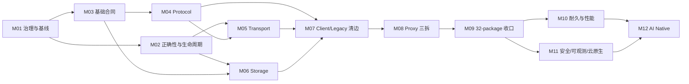

# RocketMQ Rust 架构重构迁移执行手册

> 状态：实施中（Phase 2，M09-02 已完成，下一工作包为 PR-M09-03）
> 设计依据：[`docs/architecture-refactor-design.md`](../../architecture-refactor-design.md)
> 架构审计基线：`f545d638`
> crate 与源码迁移复核基线：`6d152248`
> 当前复核状态：根 workspace 已达到目标 32 个 package；55/82 工作包完成，剩余 27 个

## 1. 使用方式

本目录把总体设计转换为 12 个可独立审查、验证和回滚的里程碑。当前交付拓扑经用户批准为
“每个 PR-Mxx-yy 工作包一个 Issue、一个 branch、一个 ready PR”；任务文档中的 PR-Mxx-yy 是独立交付、
验证、回滚和证据索引单位。

- 里程碑实施细节以本页“里程碑导航”链接的 12 份任务文档为准。
- 全局进度、每次 PR 完成记录与 Phase Gate 签署统一填写 [`CHECKLIST.md`](CHECKLIST.md)。

1. Human Architect 先确认当前里程碑的入口条件和兼容决策。
2. Architect 与 Tester 在写代码前分别冻结设计边界和验证路线。
3. Developer 获得唯一 writer lease，按文件中的 PR 顺序实施；其他 Agent 此时只读。
4. Developer 结束后冻结 Git 快照，Reviewer 与 Tester 对同一快照并行工作。
5. 任何修复都回到同一 Developer；修复产生新快照，并使受影响的旧审查与测试结论失效。
6. 只有 Exit Checklist 全部满足，Human Architect 才能批准进入下一里程碑。

### 1.1 Git 与多 Agent 交付约束

- 每个工作包从最新 `main` 创建独立 branch；只使用 branch，不使用 worktree。
- 每个工作包创建一个 GitHub Issue 和一个 ready PR；PR 不等待 CI 完成即可由管理员 squash merge。
- squash merge subject 必须为 `PR标题 (#PR号)`；合并后切回 `main`、拉取最新提交，再创建下一 Phase branch。
- 多 Agent 只并行处理文件集合互不重叠的 writer lane；root manifest、lockfile、CI、architecture baseline、
  public re-export 和最终集成始终由主协调者单写。
- Reviewer、Tester 和只读审计 Agent 可并行；其结论必须绑定同一冻结候选快照。

所有 Agent 都可以完整读取 workspace、依赖图、测试和构建产物；“Architect/Reviewer/Tester 不写源文件”是 writer lease 约束，不是权限缺失。

### 1.2 角色标签

| 标签 | 责任 |
|---|---|
| `[HUMAN]` | 批准兼容性、持久格式、安全默认值、架构例外和阶段 Gate |
| `[ARCH]` | 冻结接口、依赖方向、ADR、迁移批次和回滚边界 |
| `[DEV]` | 唯一源文件写入者；实现、局部格式化、修复和证据整理 |
| `[REV]` | 独立检查实现、兼容面、依赖闭包、错误和生命周期语义 |
| `[TEST]` | 独立执行验证矩阵、故障注入、性能对比和 standalone consumer 验证 |

每次 Agent handoff 必须包含 `status`、`summary`、`artifacts`、`next_actions`；被阻塞时还必须包含 `stop_reason`。

## 2. 目标 package 变化

M01 入口有 22 个根 workspace package；M03 加入 `rocketmq-model` 和 `rocketmq-security-api`，M04 加入
`rocketmq-protocol`，M05 加入 `rocketmq-transport`，M06 capability spike 加入 `rocketmq-store-api`，
M06-03a leaf foundation 加入 `rocketmq-store-local`，PR-M06-09 加入 `rocketmq-store-rocksdb`，PR-M08-01
加入 `rocketmq-proxy-core`，PR-M08-03 加入 `rocketmq-proxy-cluster`，PR-M08-04 加入
`rocketmq-proxy-local`，当前已精确达到目标 32 个。
以下 10 个新 crate 已全部按计划加入：

| 新 crate | 首次创建里程碑 | 最终职责 |
|---|---:|---|
| `rocketmq-model` | M03 | 无 Tokio 的稳定值对象、Client 中立结果和分配算法 |
| `rocketmq-security-api` | M03 | 协议无关 RequestContext、RequestPolicy、OutboundSigner |
| `rocketmq-protocol` | M04 | request/response code、command、header/body、wire schema |
| `rocketmq-transport` | M05 | TCP/TLS/codec/session/admission/client/server |
| `rocketmq-store-api` | M06 | 窄存储 capability、receipt、progress 和中立错误 |
| `rocketmq-store-local` | M06 | 唯一 CommitLog/WAL、CQ、Index、HA 和本地恢复 |
| `rocketmq-store-rocksdb` | M06 | 复用 Local CommitLog 的 RocksDB CQ/Index 实现 |
| `rocketmq-proxy-core` | M08 | 中立 plan/port/status/error 与 ingress |
| `rocketmq-proxy-cluster` | M08 | 完整 Client lifecycle 的远程集群 adapter |
| `rocketmq-proxy-local` | M08 | 无 Client 的嵌入式 Broker/store adapter |

`rocketmq-common`、`rocketmq-remoting`、`rocketmq-store` 和 `rocketmq-proxy` 在 R0/R1 期间保留，分别承担兼容 facade 或 composition 职责；`rocketmq-rust` 作为遗留并发与调度兼容层排空，不是新的 umbrella crate。

## 3. 里程碑导航

下表的数值是单个里程碑在其责任泳道内的**局部工程工作量/排期窗口**，用于配置人员和 writer lease；里程碑之间存在并行、等待和 Gate 重叠，因此这些数值不可相加，也不是端到端日历工期。

| 阶段 | 里程碑 | 局部工程窗口（不可相加） | 主要产出 | 依赖 |
|---|---|---:|---|---|
| Phase 1 | [M01 治理与基线](phase-1-safety-foundation/01-governance-and-baselines.md) | 1–2 周 | 依赖、ArcMut、兼容与性能基线 | 无 |
| Phase 1 | [M02 正确性与生命周期](phase-1-safety-foundation/02-correctness-and-lifecycle.md) | 3–4 周 | flush、task lease、pending RAII、绝对 deadline | M01 |
| Phase 1 | [M03 基础合同](phase-1-safety-foundation/03-foundation-contracts.md) | 3–4 周 | model/security-api、Client 中立类型、observability 解耦 | M01；与 M02 可并行 |
| Phase 2 | [M04 Protocol 提取](phase-2-core-boundaries/04-protocol-extraction.md) | 2–3 周 | protocol crate、wire golden、remoting re-export | M03 |
| Phase 2 | [M05 Transport 提取](phase-2-core-boundaries/05-transport-extraction.md) | 3–4 周 | transport crate、有界 admission、remoting facade | M02、M04 |
| Phase 2 | [M06 Storage 边界提取](phase-2-core-boundaries/06-storage-boundary-extraction.md) | 4–6 周 | store-api/local/rocksdb、store facade | M02、M03 |
| Phase 2 | [M07 Client 与 Legacy 清边](phase-2-core-boundaries/07-legacy-and-client-edge-burn-down.md) | 3–4 周 | Client allowlist、admin adapter、Dashboard 迁移 | M04–M06 |
| Phase 2 | [M08 Proxy 三向拆分](phase-2-core-boundaries/08-proxy-three-way-split.md) | 3–4 周 | proxy core/cluster/local | M05–M07 |
| Phase 2 | [M09 Facade 与 32-package 收口](phase-2-core-boundaries/09-facade-and-package-closeout.md) | 1–2 周 | 32-package Gate、R0 发布证据 | M04–M08 |
| Phase 3 | [M10 耐久性与性能](phase-3-production-readiness/10-durability-and-performance.md) | 5–8 周 | WAL outbox、Tiered cursor、Compaction generation、性能门禁 | M09 |
| Phase 3 | [M11 安全、可观测性与云原生](phase-3-production-readiness/11-security-observability-cloud.md) | 4–6 周 | secure profile、semantic registry、镜像与部署演练 | M09；部分与 M10 并行 |
| Phase 4 | [M12 AI Native 运维](phase-4-ai-native/12-ai-native-operations.md) | 8–12 周 | KG/RAG、确定性诊断、独立 Apply 安全边界 | M10、M11 |

## 4. 关键路径、阶段工期和并行泳道



- Mermaid 图表达依赖 Gate，不用于把里程碑局部窗口相加计算工期。
- 4–6 名核心工程师下，M02 与 M03 可并行；M04 与 M06 在合同冻结后可并行；M10 与 M11 可按存储和平台泳道并行。
- 同一文件或同一兼容面不能由两个 Developer 并行修改；协调者按 writer lease 解决重叠。

### 4.1 权威 Phase wall-clock

| Phase | 串行阶段日历窗口 | 日历边界 |
|---|---:|---|
| Phase 1 | 6–8 周 | 从治理基线开始，到 P0/foundation Gate 签署 |
| Phase 2 | 12–16 周 | 从首个边界 crate 开始，到 32-package Gate 签署 |
| Phase 3 | 8–12 周 | 从生产化实现开始，到 durability/security/cloud Gate 签署 |
| Phase 4 | 8–12 周 | 从 KG/RAG 实现开始，到 AI Native Gate 签署 |
| **四个 Phase 完全串行** | **34–48 周** | **四个阶段窗口的唯一可加总口径** |

接口稳定后采用跨 lane 重叠时，端到端规划窗口为 **24–32 周**。该区间不是重新相加里程碑数字，而是让以下准备和实现重叠约 10–16 周：M03 合同冻结后，Protocol/Storage lane 可在 M02 剩余收口期间启动；Phase 2 候选接口稳定后，性能基线、安全/镜像资产准备可在正式 Gate 前并行；M11 的 telemetry/security contract 冻结后，Phase 4 的离线 KG/RAG schema 与 eval corpus 可在 M10/M11 收口期间准备。正式 Phase Gate 的批准顺序仍为 1→2→3→4，未满足前置 Gate 的代码不得发布或扩大流量。

## 5. Client 直接依赖白名单

目标态完整 `rocketmq-client-rust` 的直接 manifest 依赖和源码 import 只允许出现在：

1. workspace：`rocketmq-proxy-cluster`；
2. workspace：`rocketmq-admin-core/src/client_adapter/`；
3. standalone：`rocketmq-example`。

Broker、NameServer、MCP、Dashboard、`rocketmq-proxy-core` 和 `rocketmq-proxy-local` 必须同时满足 manifest/source 无直接边。
Broker、NameServer、`proxy-core/local`、common 与 remoting 还要验证 normal dependency 的完整传递闭包不含 Client。
MCP 与 Dashboard 只能经 `rocketmq-admin-core` 的受控 adapter 间接到达 Client。M07 的精确永久 allowlist、Proxy M08
临时账本和物理拆分输入见 [`Client 边界收口与 M08 交接清单`](phase-2-core-boundaries/07-client-edge-closeout-handoff.md)。

## 6. 工作包追踪

| WP | 工作包 | 主里程碑 | 延续验证 |
|---:|---|---|---|
| WP01 | `arc-mut-freeze` | M01 | M02、M07、M11 |
| WP02 | `flush-result` | M02 | M06、M10 |
| WP03 | `task-child-lease` | M02 | M05、M11 |
| WP04 | `pending-request-guard` | M02 | M05 |
| WP05 | `shutdown-deadline` | M02 | M07、M11 |
| WP06 | `dependency-policy` | M01 | M03–M09 |
| WP07 | `observability-decouple` | M03 | M11 |
| WP08 | `model-security-leaves` | M03 | M04、M05、M11 |
| WP09 | `protocol-boundary-spike` | M04 | M05、M09 |
| WP10 | `transport-boundary-spike` | M05 | M09 |
| WP11 | `storage-capability-spike` | M06 | M10 |
| WP12 | `store-local-extract` | M06 | M10 |
| WP13 | `store-rocks-extract` | M06 | M10 |
| WP14 | `tiered-cursor` | M10 | M11 |
| WP15 | `rocketmq-rust-drain` | M07 | M11 |
| WP16 | `secure-profile-dry-run` | M03 | M11 |
| WP17 | `client-neutral-types` | M03 | M04、M07、M08 |
| WP18 | `client-edge-burn-down` | M07 | M08、M09 |
| WP19 | `proxy-three-way-split` | M08 | M09 |

每个 WP 必须在主里程碑中产生代码、测试和证据；“延续验证”只验证后续集成，不替代主交付。

## 7. 版本与兼容策略

### R0：新增边界且保持行为

- 新增当期需要的 canonical crate 和类型；旧 public path 通过精确 re-export/adapter 保持类型身份和行为。
- 不删除 public item，不改变 wire code、header、Serde 字段、存储格式或当前默认 feature 语义。
- Proxy facade 对 cluster/local 仍是非 optional，继续保持当前 `default = []` 行为。
- Admin legacy facade 保留现有 client/common 签名，兼容 feature 显式蕴含 `client-adapter`。

### R1：迁移所有仓内消费者

- workspace 与 standalone consumer 改用 canonical owner；CI 禁止新增 facade/legacy 依赖。
- facade ledger 只能下降；deprecated path 仍保留给外部消费者。
- 形成 public API 使用证据和下一 major 删除清单。

### 下一 major：删除已公告兼容面

- 删除已跨完整 R0/R1 周期、API diff 已公告且外部用量满足门槛的 deprecated 深路径。
- Proxy adapter 改为 optional，启用 `cluster-mode`、`local-mode` 和 `compat-all-modes`。
- 删除 admin-core 的 `legacy-common-compat`、common 的 protocol/observability compatibility dependency，以及已经排空的 remoting/legacy 深路径。
- `rocketmq-store` 的 backend composition 职责可长期保留，不因目录整齐而强制删除。

## 8. 全局不变量

- CommitLog 是唯一权威 WAL；CQ、Index、RocksDB、Tiered、Compaction 只持久 cursor/watermark 等派生元数据。
- SyncFlush 只有在 durable watermark 达标后确认；失败不得推进 watermark。
- 生产 task/thread/connection/pending request 都有 owner、count+byte budget、绝对 deadline 和完成报告。
- 基础合同 crate 不通过 feature 引入 Tokio、transport、facade、service 或 native backend。
- AI/MCP 不进入消息数据面；现有 Plan Tool 始终无副作用，未来 Apply 使用独立安全边界。
- 机械迁移、行为修复和公开 feature 语义变化分开提交。
- wire/storage/public API 是兼容面；无明确版本化、双读/双写和回滚计划时不得改变。

## 9. 统一合并门禁

每个 PR 按以下顺序取证：focused test → package check/test → 精确 feature → 受影响 workspace/standalone consumer → specialized guard → Reviewer/Test 结论。

### 9.1 当前仓库已经存在、可执行的命令

```powershell
cargo fmt --all -- --check
cargo clippy --workspace --no-deps --all-targets --all-features -- -D warnings
.\scripts\runtime-audit.ps1 -SkipBaseline -EnforceBoundaryBaseline
.\scripts\check-error-hygiene.ps1
python scripts/error_architecture_guard.py
.\scripts\check-agents-routing.ps1
git diff --check
```

这些命令按变更触发范围累积执行。纯文档 PR 只要求链接/内容自检与 `git diff --check`，不需要 Cargo 验证。

### 9.2 由里程碑新增后才执行的命令

下列脚本是 M01/M10/M11 的计划交付物，当前不能作为已存在的门禁报告成功：

```powershell
python scripts/architecture_dependency_guard.py
python scripts/arc_mut_guard.py
python scripts/architecture_performance_guard.py --baseline <baseline.json> --candidate <candidate.json>
python scripts/telemetry_semantic_guard.py
.\scripts\kind-architecture-refactor-e2e.ps1
```

脚本落地前，用 `cargo metadata`、`cargo tree`、`rg`、现有 benchmark 和人工证据完成同等预检；脚本落地的 PR 必须同时提供正向和故意违规的 fixture。

### 9.3 证据目录

- 运行期生成物：`target/architecture-refactor/Mxx/<run-id>/`，不提交 Git。
- 可重复 fixture/golden：放在所属 crate 的现有 `tests/` 或 `testdata/` 约定目录并提交。
- 每个里程碑保留一份 evidence index，记录提交、工具链、feature、命令、退出码和产物 hash。
- 性能证据必须记录硬件、内核、文件系统、Rust profile、feature、消息大小、TLS 比例和采样方法。

## 10. 阶段 Gate

| Gate | 必须满足 |
|---|---|
| Phase 1 | P0 回归全绿；ArcMut 不增长且首批切片下降；observability 闭包无 facade/legacy；基线可重复 |
| Phase 2 | workspace 精确 32 package；10 个新 crate 禁边为零；Client 收敛为 workspace 2 + standalone 1；兼容 fixture 全绿 |
| Phase 3 | production/public compatibility API 不再暴露不安全 ArcMut 逃逸；durability/performance/fault/cloud Gate 通过 |
| Phase 4 | Plan 无副作用；Apply 独立且 fail closed；AI 离线不影响核心服务和人工运维 |

每个阶段 Gate 需要 `[ARCH]`、`[REV]`、`[TEST]` 和 `[HUMAN]` 四方签署；Developer 只能提供实现与证据，不能代签。
