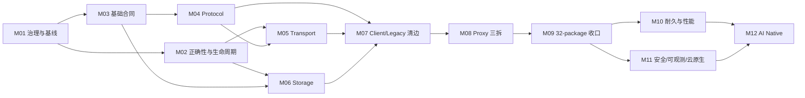

# RocketMQ Rust 架构重构迁移执行手册

> 状态：实施中（Phase 3；M10 真实性能/HUMAN Gate 待验收，M11 已完成安全 profile/bootstrap/rotation、MCP HTTPS/audit、五服务镜像、Helm/Kustomize、统一 probe/preStop/drain 与 Kind/K3d fault 执行/证据门禁，下一工作包为 PR-M11-12）
> 设计依据：[`docs/architecture-refactor-design.md`](../../architecture-refactor-design.md)
> 架构审计基线：`f545d638`
> crate 与源码迁移复核基线：`6d152248`
> 当前复核状态：根 workspace 已达到目标 32 个 package；75/82 工作包完成，PR-M11-12 进行中，
> PR-M12-01～06 未开始，合计剩余 7 个

## 1. 使用方式

本目录把总体设计转换为 12 个可独立审查、验证和回滚的里程碑。当前交付拓扑经用户批准为
“每个 PR-Mxx-yy 工作包一个 Issue、一个 branch、一个 ready PR”；任务文档中的 PR-Mxx-yy 是独立交付、
验证、回滚和证据索引单位。

- 里程碑实施细节以本页“里程碑导航”链接的 12 份任务文档为准。
- 全局进度、每次 PR 完成记录与 Phase Gate 签署统一填写 [`CHECKLIST.md`](CHECKLIST.md)。

1. Human Architect 先确认当前里程碑的入口条件和兼容决策。
2. Architect 与 Tester 在写代码前分别冻结设计边界和验证路线。
3. Developer 获得唯一 writer lease，按文件中的 PR 顺序实施；其他 Agent 此时只读。
4. Developer 结束后冻结 Git 快照，Reviewer 与 Tester 对同一快照并行工作。
5. 任何修复都回到同一 Developer；修复产生新快照，并使受影响的旧审查与测试结论失效。
6. 只有 Exit Checklist 全部满足，Human Architect 才能批准进入下一里程碑。

### 1.1 Git 与多 Agent 交付约束

- 每个工作包从最新 `main` 创建独立 branch；只使用 branch，不使用 worktree。
- 每个工作包创建一个 GitHub Issue 和一个 ready PR；PR 不等待 CI 完成即可由管理员 squash merge。
- squash merge subject 必须为 `PR标题 (#PR号)`；合并后切回 `main`、拉取最新提交，再创建下一 Phase branch。
- 多 Agent 只并行处理文件集合互不重叠的 writer lane；root manifest、lockfile、CI、architecture baseline、
  public re-export 和最终集成始终由主协调者单写。
- Reviewer、Tester 和只读审计 Agent 可并行；其结论必须绑定同一冻结候选快照。

所有 Agent 都可以完整读取 workspace、依赖图、测试和构建产物；“Architect/Reviewer/Tester 不写源文件”是 writer lease 约束，不是权限缺失。

### 1.2 角色标签

| 标签 | 责任 |
|---|---|
| `[HUMAN]` | 批准兼容性、持久格式、安全默认值、架构例外和阶段 Gate |
| `[ARCH]` | 冻结接口、依赖方向、ADR、迁移批次和回滚边界 |
| `[DEV]` | 唯一源文件写入者；实现、局部格式化、修复和证据整理 |
| `[REV]` | 独立检查实现、兼容面、依赖闭包、错误和生命周期语义 |
| `[TEST]` | 独立执行验证矩阵、故障注入、性能对比和 standalone consumer 验证 |

每次 Agent handoff 必须包含 `status`、`summary`、`artifacts`、`next_actions`；被阻塞时还必须包含 `stop_reason`。

## 2. 目标 package 变化

M01 入口有 22 个根 workspace package；M03 加入 `rocketmq-model` 和 `rocketmq-security-api`，M04 加入
`rocketmq-protocol`，M05 加入 `rocketmq-transport`，M06 capability spike 加入 `rocketmq-store-api`，
M06-03a leaf foundation 加入 `rocketmq-store-local`，PR-M06-09 加入 `rocketmq-store-rocksdb`，PR-M08-01
加入 `rocketmq-proxy-core`，PR-M08-03 加入 `rocketmq-proxy-cluster`，PR-M08-04 加入
`rocketmq-proxy-local`，当前已精确达到目标 32 个。
以下 10 个新 crate 已全部按计划加入：

| 新 crate | 首次创建里程碑 | 最终职责 |
|---|---:|---|
| `rocketmq-model` | M03 | 无 Tokio 的稳定值对象、Client 中立结果和分配算法 |
| `rocketmq-security-api` | M03 | 协议无关 RequestContext、RequestPolicy、OutboundSigner |
| `rocketmq-protocol` | M04 | request/response code、command、header/body、wire schema |
| `rocketmq-transport` | M05 | TCP/TLS/codec/session/admission/client/server |
| `rocketmq-store-api` | M06 | 窄存储 capability、receipt、progress 和中立错误 |
| `rocketmq-store-local` | M06 | 唯一 CommitLog/WAL、CQ、Index、HA 和本地恢复 |
| `rocketmq-store-rocksdb` | M06 | 复用 Local CommitLog 的 RocksDB CQ/Index 实现 |
| `rocketmq-proxy-core` | M08 | 中立 plan/port/status/error 与 ingress |
| `rocketmq-proxy-cluster` | M08 | 完整 Client lifecycle 的远程集群 adapter |
| `rocketmq-proxy-local` | M08 | 无 Client 的嵌入式 Broker/store adapter |

`rocketmq-common`、`rocketmq-remoting`、`rocketmq-store` 和 `rocketmq-proxy` 在 R0/R1 期间保留，分别承担兼容 facade 或 composition 职责；`rocketmq-rust` 作为遗留并发与调度兼容层排空，不是新的 umbrella crate。

## 3. 里程碑导航

下表的数值是单个里程碑在其责任泳道内的**局部工程工作量/排期窗口**，用于配置人员和 writer lease；里程碑之间存在并行、等待和 Gate 重叠，因此这些数值不可相加，也不是端到端日历工期。

| 阶段 | 里程碑 | 局部工程窗口（不可相加） | 主要产出 | 依赖 |
|---|---|---:|---|---|
| Phase 1 | [M01 治理与基线](phase-1-safety-foundation/01-governance-and-baselines.md) | 1–2 周 | 依赖、ArcMut、兼容与性能基线 | 无 |
| Phase 1 | [M02 正确性与生命周期](phase-1-safety-foundation/02-correctness-and-lifecycle.md) | 3–4 周 | flush、task lease、pending RAII、绝对 deadline | M01 |
| Phase 1 | [M03 基础合同](phase-1-safety-foundation/03-foundation-contracts.md) | 3–4 周 | model/security-api、Client 中立类型、observability 解耦 | M01；与 M02 可并行 |
| Phase 2 | [M04 Protocol 提取](phase-2-core-boundaries/04-protocol-extraction.md) | 2–3 周 | protocol crate、wire golden、remoting re-export | M03 |
| Phase 2 | [M05 Transport 提取](phase-2-core-boundaries/05-transport-extraction.md) | 3–4 周 | transport crate、有界 admission、remoting facade | M02、M04 |
| Phase 2 | [M06 Storage 边界提取](phase-2-core-boundaries/06-storage-boundary-extraction.md) | 4–6 周 | store-api/local/rocksdb、store facade | M02、M03 |
| Phase 2 | [M07 Client 与 Legacy 清边](phase-2-core-boundaries/07-legacy-and-client-edge-burn-down.md) | 3–4 周 | Client allowlist、admin adapter、Dashboard 迁移 | M04–M06 |
| Phase 2 | [M08 Proxy 三向拆分](phase-2-core-boundaries/08-proxy-three-way-split.md) | 3–4 周 | proxy core/cluster/local | M05–M07 |
| Phase 2 | [M09 Facade 与 32-package 收口](phase-2-core-boundaries/09-facade-and-package-closeout.md) | 1–2 周 | 32-package Gate、R0 发布证据 | M04–M08 |
| Phase 3 | [M10 耐久性与性能](phase-3-production-readiness/10-durability-and-performance.md) | 5–8 周 | WAL outbox、Tiered cursor、Compaction generation、性能门禁 | M09 |
| Phase 3 | [M11 安全、可观测性与云原生](phase-3-production-readiness/11-security-observability-cloud.md) | 4–6 周 | secure profile、semantic registry、镜像与部署演练 | M09；部分与 M10 并行 |
| Phase 4 | [M12 AI Native 运维](phase-4-ai-native/12-ai-native-operations.md) | 8–12 周 | KG/RAG、确定性诊断、独立 Apply 安全边界 | M10、M11 |

## 4. 关键路径、阶段工期和并行泳道



- Mermaid 图表达依赖 Gate，不用于把里程碑局部窗口相加计算工期。
- 4–6 名核心工程师下，M02 与 M03 可并行；M04 与 M06 在合同冻结后可并行；M10 与 M11 可按存储和平台泳道并行。
- 同一文件或同一兼容面不能由两个 Developer 并行修改；协调者按 writer lease 解决重叠。

### 4.1 权威 Phase wall-clock

| Phase | 串行阶段日历窗口 | 日历边界 |
|---|---:|---|
| Phase 1 | 6–8 周 | 从治理基线开始，到 P0/foundation Gate 签署 |
| Phase 2 | 12–16 周 | 从首个边界 crate 开始，到 32-package Gate 签署 |
| Phase 3 | 8–12 周 | 从生产化实现开始，到 durability/security/cloud Gate 签署 |
| Phase 4 | 8–12 周 | 从 KG/RAG 实现开始，到 AI Native Gate 签署 |
| **四个 Phase 完全串行** | **34–48 周** | **四个阶段窗口的唯一可加总口径** |

接口稳定后采用跨 lane 重叠时，端到端规划窗口为 **24–32 周**。该区间不是重新相加里程碑数字，而是让以下准备和实现重叠约 10–16 周：M03 合同冻结后，Protocol/Storage lane 可在 M02 剩余收口期间启动；Phase 2 候选接口稳定后，性能基线、安全/镜像资产准备可在正式 Gate 前并行；M11 的 telemetry/security contract 冻结后，Phase 4 的离线 KG/RAG schema 与 eval corpus 可在 M10/M11 收口期间准备。正式 Phase Gate 的批准顺序仍为 1→2→3→4，未满足前置 Gate 的代码不得发布或扩大流量。

## 5. Client 直接依赖白名单

目标态完整 `rocketmq-client-rust` 的直接 manifest 依赖和源码 import 只允许出现在：

1. workspace：`rocketmq-proxy-cluster`；
2. workspace：`rocketmq-admin-core/src/client_adapter/`；
3. standalone：`rocketmq-example`。

Broker、NameServer、MCP、Dashboard、`rocketmq-proxy-core` 和 `rocketmq-proxy-local` 必须同时满足 manifest/source 无直接边。
Broker、NameServer、`proxy-core/local`、common 与 remoting 还要验证 normal dependency 的完整传递闭包不含 Client。
MCP 与 Dashboard 只能经 `rocketmq-admin-core` 的受控 adapter 间接到达 Client。M07 的精确永久 allowlist、Proxy M08
临时账本和物理拆分输入见 [`Client 边界收口与 M08 交接清单`](phase-2-core-boundaries/07-client-edge-closeout-handoff.md)。

## 6. 工作包追踪

| WP | 工作包 | 主里程碑 | 延续验证 |
|---:|---|---|---|
| WP01 | `arc-mut-freeze` | M01 | M02、M07、M11 |
| WP02 | `flush-result` | M02 | M06、M10 |
| WP03 | `task-child-lease` | M02 | M05、M11 |
| WP04 | `pending-request-guard` | M02 | M05 |
| WP05 | `shutdown-deadline` | M02 | M07、M11 |
| WP06 | `dependency-policy` | M01 | M03–M09 |
| WP07 | `observability-decouple` | M03 | M11 |
| WP08 | `model-security-leaves` | M03 | M04、M05、M11 |
| WP09 | `protocol-boundary-spike` | M04 | M05、M09 |
| WP10 | `transport-boundary-spike` | M05 | M09 |
| WP11 | `storage-capability-spike` | M06 | M10 |
| WP12 | `store-local-extract` | M06 | M10 |
| WP13 | `store-rocks-extract` | M06 | M10 |
| WP14 | `tiered-cursor` | M10 | M11 |
| WP15 | `rocketmq-rust-drain` | M07 | M11 |
| WP16 | `secure-profile-dry-run` | M03 | M11 |
| WP17 | `client-neutral-types` | M03 | M04、M07、M08 |
| WP18 | `client-edge-burn-down` | M07 | M08、M09 |
| WP19 | `proxy-three-way-split` | M08 | M09 |

每个 WP 必须在主里程碑中产生代码、测试和证据；“延续验证”只验证后续集成，不替代主交付。

## 7. 版本与兼容策略

### R0：新增边界且保持行为

- 新增当期需要的 canonical crate 和类型；旧 public path 通过精确 re-export/adapter 保持类型身份和行为。
- 不删除 public item，不改变 wire code、header、Serde 字段、存储格式或当前默认 feature 语义。
- Proxy facade 对 cluster/local 仍是非 optional，继续保持当前 `default = []` 行为。
- Admin legacy facade 保留现有 client/common 签名，兼容 feature 显式蕴含 `client-adapter`。

### R1：迁移所有仓内消费者

- workspace 与 standalone consumer 改用 canonical owner；CI 禁止新增 facade/legacy 依赖。
- facade ledger 只能下降；deprecated path 仍保留给外部消费者。
- 形成 public API 使用证据和下一 major 删除清单。

### 下一 major：删除已公告兼容面

- 删除已跨完整 R0/R1 周期、API diff 已公告且外部用量满足门槛的 deprecated 深路径。
- Proxy adapter 改为 optional，启用 `cluster-mode`、`local-mode` 和 `compat-all-modes`。
- 删除 admin-core 的 `legacy-common-compat`、common 的 protocol/observability compatibility dependency，以及已经排空的 remoting/legacy 深路径。
- `rocketmq-store` 的 backend composition 职责可长期保留，不因目录整齐而强制删除。

M09-05 发布包索引：[`R0 release notes`](phase-2-core-boundaries/09-r0-release-notes.md)、
[`R1 consumer migration plan`](phase-2-core-boundaries/09-r1-consumer-migration-plan.md)、
[`next-major removal plan`](phase-2-core-boundaries/09-next-major-removal-plan.md) 与
[`release package evidence`](phase-2-core-boundaries/09-r0-r1-next-major-release-package-evidence.md)。机器可读版本为
`scripts/architecture-release-plan.json`，由 `scripts/architecture_release_guard.py` 和 CI 同步守卫。

## 8. 全局不变量

- CommitLog 是唯一权威 WAL；CQ、Index、RocksDB、Tiered 只持久 cursor/watermark 等派生元数据；Compaction
  额外持久只含 live record 的可重建 generation，但不承担 WAL、replay source 或主写 ack 职责。
- SyncFlush 只有在 durable watermark 达标后确认；失败不得推进 watermark。
- 生产 task/thread/connection/pending request 都有 owner、count+byte budget、绝对 deadline 和完成报告。
- 基础合同 crate 不通过 feature 引入 Tokio、transport、facade、service 或 native backend。
- AI/MCP 不进入消息数据面；现有 Plan Tool 始终无副作用，未来 Apply 使用独立安全边界。
- 机械迁移、行为修复和公开 feature 语义变化分开提交。
- wire/storage/public API 是兼容面；无明确版本化、双读/双写和回滚计划时不得改变。

## 9. 统一合并门禁

每个 PR 按以下顺序取证：focused test → package check/test → 精确 feature → 受影响 workspace/standalone consumer → specialized guard → Reviewer/Test 结论。

### 9.1 当前仓库已经存在、可执行的命令

```powershell
cargo fmt --all -- --check
cargo clippy --workspace --no-deps --all-targets --all-features -- -D warnings
python scripts/architecture_dependency_guard.py --mode target
python scripts/architecture_dependency_guard.py --mode baseline
python scripts/architecture_release_guard.py
python scripts/architecture_performance_guard.py --validate-profiles
python scripts/architecture_performance_guard.py --baseline <baseline.json> --candidate <candidate.json>
python scripts/telemetry_semantic_guard.py
python scripts/arc_mut_guard.py
.\scripts\kubernetes-assets-contract.ps1
python -m unittest scripts.tests.test_m11_kubernetes_assets -v
.\scripts\runtime-audit.ps1 -SkipBaseline -EnforceBoundaryBaseline
.\scripts\check-error-hygiene.ps1
python scripts/error_architecture_guard.py
.\scripts\check-agents-routing.ps1
git diff --check
```

这些命令按变更触发范围累积执行。纯文档 PR 只要求链接/内容自检与 `git diff --check`，不需要 Cargo 验证。

### 9.2 由里程碑新增后才执行的命令

下列脚本仍是 M11 后续工作包的计划交付物，当前不能作为已存在的门禁报告成功：

```powershell
.\scripts\kind-architecture-refactor-e2e.ps1
```

M10 性能 guard 已落地；`--validate-profiles` 只验证合同，baseline/candidate 命令只有消费真实目标硬件报告时
才构成性能验收。M11 telemetry semantic guard 已随 PR-M11-01 落地并包含正向和故意违规 fixture；Helm/
Kustomize contract 已随 PR-M11-09 落地并校验确定性 render、Kubernetes 1.32 schema 与部署策略；统一 lifecycle、
HTTP probe、preStop 与单一绝对 deadline contract 已随 PR-M11-10 落地。PR-M11-11 已交付 Kind/K3d 七场景
执行器、版本化 fault/evidence policy、正负 fixture 和动态 workflow；本机未具备 Docker/集群/签名镜像/Secret，
所以 `dynamic_execution=true` Gate 仍待真实运行，fixture 不签署该 Gate。
M11-12 已开始按 owner 子切片收口；首个 owned-value leaf 将 ArcMut guard 的 production 条目从 760 降为
733、production occurrence 从 2,125 降为 2,082，并移除 Common 自身的 nightly unsafe-cell 需求。该下降不改变
75/82 总进度；Remoting/Controller/NameServer/Client/Broker/Store owner、compatibility 删除与 stable/SLO/HUMAN
Gate 仍由 [`M11-12 进度证据`](phase-3-production-readiness/11-soundness-closure-progress.md) 跟踪。
Controller config owner 随 Issue #8295 改为不可变原子快照后，累计进一步降至 711 production/2,029 occurrence；
`ArcMut<ControllerConfig>` 已清零，但 Controller 的其他 owner 仍有 31 条 production 债务，75/82 总进度不变。
Controller manager/heartbeat owner 随 Issue #8297 改为安全 `Arc`/`Weak` 与内部同步生命周期后，实际快照进一步降至
697 production/1,986 occurrence；Controller 降至 17 条/51 occurrence。M11-12 父工作包、stable/SLO/HUMAN
Gate 与其他 owner 仍未完成。Controller Raft owner 随 Issue #8299 改为 `Arc` 与内部串行生命周期后，实际快照降至
690 production/1,961 occurrence，Controller 降至 10 条/26 occurrence，Raft/OpenRaft `ArcMut` 清零。Controller
request processor owner 随 Issue #8301 将业务 handler 收窄为共享 receiver、wrapper 改为 `Arc` 后，实际快照降至
688 production/1,959 occurrence，Controller 降至 8 条/24 occurrence；总进度仍为 75/82。
NameServer runtime/processor owner 随 Issue #8303 改为安全 `Arc` 根、`Weak` child handle、`ArcSwap` 配置快照和
内部同步 batch/KV/V1 wrapper 后，实际快照降至 669 production/1,918 occurrence，NameServer 降至 28 条/58
occurrence。剩余 NameServer 债务精确为 V1 tables 16/44、remoting client 4/5 和 `ConnectionHandlerContext` 8/9；
总进度仍为 75/82，M11-12 父工作包未完成。
Remoting Channel/Context owner 随 Issue #8307 改为安全 `Arc`、cloneable connection lifecycle handle 与显式串行
writer 后，实际快照降至 514 production/1,612 occurrence；Channel/Context 定向债务清零，并同步移除
Broker/Client/Controller/NameServer/Auth/Proxy 中由旧 Context 别名传播的条目。剩余 production 债务为 Broker
192/574、Client 147/604、Store 127/324、Remoting 21/41、NameServer 20/49、Controller 4/6、Tools 3/14；
总进度仍为 75/82，后续 owner、compatibility、stable/SLO/HUMAN Gate 保持开放。
Remoting client/handler owner 随 Issue #8309 改为安全 `Arc` handler、每请求 clone-local processor adapter、显式
同步的 hook/NameServer 选择状态与标准 `Arc`/`Weak` lifecycle 后，实际快照降至 488 production/1,559
occurrence。Controller production 债务清零，NameServer 仅剩 V1 tables 16/44，Remoting 仅剩 protocol
compatibility 6/9；剩余为 Broker 190/569、Client 146/599、Store 127/324、NameServer 16/44、Remoting
6/9、Tools 3/14。总进度仍为 75/82，M11-12 总 Gate 未关闭。
NameServer V1 tables 随 Issue #8311 从 `ArcMut<HashMap>` 改为 manager 独占普通 `HashMap`，所有 mutation 由
既有 `Mutex<RouteInfoManager>` wrapper 串行并要求 `&mut self`；实际快照降至 472 production/1,515
occurrence，NameServer production 债务清零。剩余为 Broker 190/569、Client 146/599、Store 127/324、
Remoting protocol compatibility 6/9 与 Tools 3/14；总进度仍为 75/82。
Remoting protocol compatibility 随 Issue #8313 删除固定 `ArcMut` header/mapping-detail facade，并直接 re-export
Protocol canonical owned wire DTO；实际快照降至 466 production/1,505 occurrence，Remoting production 债务
清零。剩余为 Broker 190/568、Client 146/599、Store 127/324 与 Tools 3/14；总进度仍为 75/82。
Client ProduceAccumulator owner 随 Issue #8315 从 Manager/Producer 传播的 `ArcMut` 改为安全 `Arc`，运行时配置由
原子状态发布，guard task handle/schedule sender 由显式 lifecycle mutex 串行且异步关闭不跨同步锁 await；实际快照
降至 463 production/1,495 occurrence，Client 降至 143/589。剩余为 Broker 190/568、Client 143/589、Store
127/324 与 Tools 3/14；总进度仍为 75/82，M11-12 父工作包未完成。
Client latency fault detector 随 Issue #8317 将 trait、strategy、queue filter 与 scheduled task capture 全部改为安全
`Arc`；配置由原子状态发布，resolver/service detector 只经短 `RwLock` 取得 `Arc` 快照，task lifecycle 在单一 mutex
内串行并排除 shutdown 期间 restart。实际快照降至 454 production/1,481 occurrence，Client 降至 134/575；
剩余为 Broker 190/568、Client 134/575、Store 127/324 与 Tools 3/14，总进度仍为 75/82。
Client message ownership 随 Issue #8319 将 `PullResult` 改为 owned `MessageExt`，ProcessQueue、consume request、hook、
trace 与 Lite zero-copy 改用标准 `Arc<MessageExt>`；retry/namespace mutation 使用 clone-on-write，ProcessQueue 单独跟踪
消费开始时间，不再依赖共享消息别名写入。实际快照降至 440 production/1,397 occurrence，Client 降至 120/491；
剩余为 Broker 190/568、Client 120/491、Store 127/324 与 Tools 3/14，总进度仍为 75/82。
Client consume service lifecycle 随 Issue #8321 将通用分发器、concurrent/orderly 与 Push/Pop service owner/task capture
改为标准 `Arc`/`Weak`；lifecycle 与 request API 只经 `&self`，Pop orderly lock-refresh handle 在 mutex 内发布并在
await 前取出。实际快照降至 436 production/1,337 occurrence，Client 降至 116/431；剩余为 Broker 190/568、
Client 116/431、Store 127/324 与 Tools 3/14，总进度仍为 75/82。
Client send hook/trace context owner 随 Issue #8323 将异步 after-hook 改为不可变 hook 列表快照，删除
`SendMessageContext` 中仅用于反向调用的 Producer owner；trace dispatcher 只保存启动后解析出的 client id，不再
持有 host Producer/Consumer 实现。实际快照降至 432 production/1,329 occurrence，Client 降至 112/423；剩余为
Broker 190/568、Client 112/423、Store 127/324 与 Tools 3/14，总进度仍为 75/82。
Client Admin facade self owner 随 Issue #8325 改为 Client 与 admin-core facade 直接拥有实现和单一
`ClientConfig`；ClientInstance 的 Admin group 注册值收窄为 owner-free marker，不再通过无读取用途的 self
`ArcMut` 保活完整 Admin 实现。实际快照降至 424 production/1,295 occurrence，Client 降至 107/403 且 Tools
production 债务清零；剩余为 Broker 190/568、Client 107/403 与 Store 127/324，总进度仍为 75/82。
Client Producer fault strategy 随 Issue #8327 改为 Producer 直接拥有；异步发送回调克隆延迟阈值快照，只共享
concurrency-safe detector 和原子运行时开关，不再共享可变策略 owner。实际快照降至 423 production/1,292
occurrence，Client 降至 106/400；剩余为 Broker 190/568、Client 106/400 与 Store 127/324，总进度仍为 75/82。
Client API factory owner 随 Issue #8329 改为普通 `Arc<MQClientAPIImpl>`；API client 的名称服务器地址缓存以异步
`RwLock` 串行判重和发布，shutdown/address refresh capability 收窄为 `&self`，factory 与周期刷新任务不再传播
shared-mutation owner。实际快照降至 421 production/1,286 occurrence，Client 降至 104/394；剩余为
Broker 190/568、Client 104/394 与 Store 127/324，总进度仍为 75/82，M11-12 父工作包未完成。
Client API instance owner 随 Issue #8331 将 `MQClientInstance`、Admin、Producer/Consumer 调用链中的
`MQClientAPIImpl` handle 改为普通 `Arc`；44 个不修改字段的历史 `&mut self` receiver 收窄为 `&self`，query/pull
后台任务只捕获 `Arc<Self>`，heartbeat 不再调用 `mut_from_ref`。实际快照降至 420 production/1,276 occurrence，
Client 降至 103/384；剩余为 Broker 190/568、Client 103/384 与 Store 127/324，总进度仍为 75/82。
Client internal Admin owner 随 Issue #8333 改为普通 `Arc<MQAdminImpl>`，root client handle 通过 `OnceLock` 仅绑定
一次，Admin forwarding receiver 收窄为 `&self`；Producer 删除 11 个仅为访问 Admin helper 的 `mut_from_ref`，
Consumer 删除冗余可变 client clone。实际快照为 420 production/1,263 occurrence，Client 降至 103/371；剩余为
Broker 190/568、Client 103/371 与 Store 127/324，总进度仍为 75/82。
Client route registry owner 随 Issue #8335 将 route refresh/application、route query、broker lookup 与 Producer 注册入口
收窄为 `&self`；Producer 路由/heartbeat/注册路径删除 4 个 safe `mut_from_ref`，仅保留真实 lifecycle start 的一个
可变入口。实际快照为 420 production/1,259 occurrence，Client 降至 103/367；剩余为 Broker 190/568、Client
103/367 与 Store 127/324，总进度仍为 75/82，M11-12 父工作包与最终目标 Gate 均未完成。
Client OffsetStore owner 随 Issue #8337 从 Push/Lite facade、实现、rebalance 与 callback 调用链中的 `ArcMut` 改为
普通 `Arc<OffsetStore>`；Remote/Local persistence capability 收窄为 `&self`，Local background task handle 以显式
lifecycle mutex 串行并在 await 前取出。实际快照降至 418 production/1,224 occurrence，Client 降至 101/332；
剩余为 Broker 190/568、Client 101/332 与 Store 127/324，总进度仍为 75/82，M11-12 父工作包未完成。
Client accumulator batch producer owner 随 Issue #8339 改为每个 `MessageAccumulation` 直接持有 owned
`DefaultMQProducer` clone；flush 在 batch mutex 内克隆 producer、释放锁后以局部可变值发送，删除该文件全部
ArcMut 构造、类型与 import。实际快照降至 415 production/1,219 occurrence，Client 降至 98/327；剩余为
Broker 190/568、Client 98/327 与 Store 127/324，总进度仍为 75/82，M11-12 父工作包未完成。
Client remote offset read access 随 Issue #8341 删除 `RemoteBrokerOffsetStore` 的 4 个过时 `mut_from_ref`：
broker lookup、route miss refresh 与 client API 读取直接使用 immutable `MQClientInstance` access，查询 header、
重试、timeout 与错误映射不变。实际快照降至 414 production/1,215 occurrence，Client 降至 97/323；剩余为
Broker 190/568、Client 97/323 与 Store 127/324，总进度仍为 75/82，M11-12 父工作包未完成。
Client Push operational access 随 Issue #8343 将 pull/pop request dispatch、retry namespace reset、POP ack 与
change-invisible receiver 收窄为 `&self`，并为 lazy namespace 提供不写 cache 的 immutable resolution；
RebalancePush heartbeat/dispatch 与 consume service 共删除 9 个过时 `mut_from_ref`。实际快照降至
411 production/1,206 occurrence，Client 降至 94/314；剩余为 Broker 190/568、Client 94/314 与 Store 127/324，
总进度仍为 75/82，M11-12 父工作包未完成。
Client orderly lock access 随 Issue #8345 将 Rebalance 单队列 unlock、全队列 lock/unlock capability 与 Push/Lite/
inner 实现收窄为 `&self`，broker lookup、request body、oneway 与 process-queue lock state 语义不变；orderly/POP-
orderly namespace reset 使用 immutable resolution，删除 3 个 `mut_from_ref`。实际快照降至 410 production/1,203
occurrence，Client 降至 93/311；剩余为 Broker 190/568、Client 93/311 与 Store 127/324，总进度仍为 75/82，
M11-12 父工作包未完成。
Client Lite Pull config snapshots 随 Issue #8347 将实现与 rebalance 配置改为 `ArcSwap` 不可变快照；同步 setter
通过 copy-update-publish 串行 CAS 发布完整代际，异步 pull/rebalance/metadata/diagnostics 只持有不可变 `Arc` 快照，
不跨 await 持有同步锁。兼容 facade 构造与 Java 行为保持，内部配置 owner 删除 34 个 `mut_from_ref`/`ArcMut`
occurrence。实际快照为 410 production/1,169 occurrence，Client 为 93/277；剩余为 Broker 190/568、Client 93/277
与 Store 127/324，总进度仍为 75/82，M11-12 父工作包与最终目标 Gate 均未完成。
Client Lite Pull facade config snapshots 随 Issue #8349 将 facade 的 client/consumer config 改为共享 `ArcSwap`；
公开 getter 返回 immutable owned `Arc` snapshot，consumer group 返回 owned value，构造边界接收 owned config，builder
不再创建或传播 `ArcMut`。这是为退出 production/public compatibility API 中不安全可变逃逸作出的显式 API 迁移；
`DefaultLitePullConsumer` 路径、builder、Java-compatible 方法名、namespace/TLS/trace/pull/offset 行为保持。实际快照降至
408 production/1,129 occurrence，Client 降至 91/237；剩余为 Broker 190/568、Client 91/237 与 Store 127/324，
总进度仍为 75/82，下一子切片处理 Lite Pull root lifecycle，M11-12 父工作包与最终目标 Gate 均未完成。
Client Lite Pull root lifecycle 随 Issue #8351 将 facade、consumer inner、rebalance listener、metadata/pull task 的
根 owner 改为标准 `Arc`/`Weak`，以专用异步 lifecycle mutex 串行 start/shutdown 与订阅控制面；同步状态和组件槽位只在
短锁内发布或克隆快照，锁外执行 await。Rebalance offset store 改为 `ArcSwapOption`，consumer 注册与订阅表写入收窄为
`&self`，未新增 shared-mutation occurrence。实际快照降至 402 production/1,102 occurrence，Client crate 降至
85/210；剩余为 Broker 190/568、Client 85/210 与 Store 127/324，总进度仍为 75/82，M11-12 父工作包未完成。
Client PullAPIWrapper immutable access 随 Issue #8353 将 Lite/Push 的 wrapper owner 改为标准 `Arc`；unit mode、
user-broker selection 与 broker id 使用原子发布，filter hook 列表使用 `ArcSwap` 整代快照，pull/POP/filter-server
调用收窄为 `&self` 并复用 immutable MQ client API accessor。实际快照为 402 production/1,095 occurrence，Client
为 85/203；剩余为 Broker 190/568、Client 85/203 与 Store 127/324，总进度仍为 75/82，M11-12 父工作包未完成。
Client Push message listener ownership 随 Issue #8355 将 facade config、implementation 与 Java-compatible getter/setter
中的 listener handle 改为标准 `Arc<MessageListener>`；concurrent/orderly 注册、替换和清除语义保持，公开 API 不再暴露
共享可变 wrapper。实际快照为 402 production/1,086 occurrence，Client 为 85/194；剩余为 Broker 190/568、Client
85/194 与 Store 127/324，总进度仍为 75/82，M11-12 父工作包未完成。
Client Push subscription snapshots 随 Issue #8357 将 deprecated startup subscription map 改为标准
`Arc<HashMap>`；config、builder 和 Java-compatible getter/setter 使用 immutable owned snapshot，启动时只读复制到
独立 dynamic rebalance table。实际快照降至 400 production/1,078 occurrence，Client 降至 83/186；剩余为 Broker
190/568、Client 83/186 与 Store 127/324，总进度仍为 75/82，M11-12 父工作包未完成。
Client Push consume service config snapshots 随 Issue #8359 将 concurrent/orderly 与 POP concurrent/orderly 四类服务的
`ClientConfig`/`ConsumerConfig` 改为启动时创建并成对注入的 immutable `Arc` 快照；服务内只读使用同一配置代际，仍需实时
运行状态的 callback 继续通过 Push implementation owner 访问。实际快照降至 398 production/1,054 occurrence，Client owner
降至 80/161，另有 Proxy 1/1；剩余为 Broker 190/568、Client 80/161、Proxy 1/1 与 Store 127/324，总进度仍为
75/82，M11-12 父工作包未完成。
Client Push rebalance config snapshots 随 Issue #8361 将 RebalancePush 的共享可变 consumer config 改为 `ArcSwap` 完整
不可变代际；相关 facade setter 显式同步，queue-count 变化只通过 Push implementation owner 回写两个 per-queue threshold，
listener 与 offset 策略读取不再依赖整份配置的共享写别名。实际快照为 398 production/1,052 occurrence，Client owner
降至 80/159，另有 Proxy 1/1；剩余为 Broker 190/568、Client 80/159、Proxy 1/1 与 Store 127/324，总进度仍为
75/82，M11-12 父工作包未完成。
Client Push root config snapshots 随 Issue #8363 将 facade 与 implementation 共享的 `ArcMut<ConsumerConfig>` 根别名
替换为同一个 `Arc<ArcSwap<ConsumerConfig>>`；所有 setter clone-update-publish 完整配置代际，启动、回调、diagnostics、
trace 与动态 threshold 更新读取稳定 immutable `Arc` 快照，公开 consumer-group getter 返回 owned value。实际快照降至
397 production/1,045 occurrence，Client owner 降至 79/152，Client test 从 47/145 降至 47/132；剩余为 Broker
190/568、Client 79/152、Proxy 1/1 与 Store 127/324，总进度仍为 75/82，M11-12 父工作包未完成。
Client Push implementation root ownership 随 Issue #8365 将 facade、consumer registry、pull/pop callback 与 task capture
统一为标准 `Arc<DefaultMQPushConsumerImpl>`，root-owned consume/rebalance 回边统一为 `Weak`；start/shutdown 由单一
lifecycle mutex 串行，组件槽位与 rebalance metadata 只在短同步锁内发布完整快照，异步路径锁外工作。实际快照降至
376 production/995 occurrence，Client owner 降至 58/102，Client test 降至 25/102；剩余为 Broker 190/568、Client
58/102、Proxy 1/1 与 Store 127/324，总进度仍为 75/82。下一子切片为 M11-12ak Client Rebalance root ownership，
M11-12 父工作包未完成。
Client Rebalance root ownership 随 Issue #8367 将 Push/LitePull concrete rebalance root 改为标准 `Arc`，并将
`RebalanceImpl` self-reference 与 concrete setter 改为标准 `Weak`；两个释放后 weak upgrade 失败的定向测试证明
self-reference 不会保活 root。实际快照降至 368 production/982 occurrence，Client owner 降至 50/89；剩余为 Broker
190/568、Client 50/89、Proxy 1/1 与 Store 127/324，总进度仍为 75/82。下一子切片为 M11-12al Client
MQClientInstance root ownership，M11-12 父工作包未完成。
Client MQClientInstance root ownership 随 Issue #8369 将 Manager/Proxy compatibility handle 与
Admin/Producer/Consumer/Rebalance/API/OffsetStore 持有链统一改为标准 `Arc<MQClientInstance>`，Remoting/Admin
回指统一为标准 `Weak`；lifecycle transition、API slot 与 connection task handle 使用显式同步，运行路径收窄为共享
receiver。实际快照降至 326 production/909 occurrence，Client owner 降至 9/17、Client test 降至 12/83，Proxy
production 债务清零；剩余为 Broker 190/568、Client 9/17 与 Store 127/324，总进度仍为 75/82。下一子切片为
M11-12am Client Producer root ownership，M11-12 父工作包未完成。
Client internal child ownership 随 Issue #8371 将 `MQClientInstance::pull_message_service` 改为标准 `Arc`，并以
单一 Tokio Mutex 直接拥有 internal DefaultMQProducer，取代原本在完整 start/shutdown/send future 上持有的独立
transition mutex；序列化范围与锁顺序不变。实际快照降至 323 production/904 occurrence，Client owner 降至 6/12；
剩余为 Broker 190/568、Client 6/12 与 Store 127/324，总进度仍为 75/82。下一子切片为 M11-12an 完整 Producer
root/registry/standard-weak 与强引用环拆除，M11-12 父工作包未完成。
Client Producer root ownership 随 Issue #8375 将 DefaultMQProducer facade/implementation/registry 统一为标准
`Arc`/`Weak`，以单一 runtime snapshot、短锁配置发布、异步 lifecycle、task admission 和 owner-aware unregister
替代共享可变 root；发送与重试不经过全局 impl mutex。clone-shared append-only immutable config generations 保持
既有 borrowed getter API 且消除 clone 间 lost update。公开 implementation getter carrier 从 `ArcMut` 迁移为标准
`Arc`，这是移除 unsafe mutation capability 的有意 source break。实际快照降至 317 production/892 occurrence，
Client production 清零、Client test 降至 4/71；剩余为 Broker 190/568 与 Store 127/324。总进度仍为 75/82，
下一子切片 M11-12ao 进入 Broker owner，M11-12 父工作包未完成。
Broker topic metadata table ownership 随 Issue #8377 将 `TopicRouteInfoManager` 的 route、broker-address、publish 和
subscribe 四张共享表改为标准 `Arc<DashMap>`，并将 `TopicQueueMappingManager` 的表项改为不可变标准 `Arc` 整值代际；
读取先克隆完整值，guard 在同表写入或 `.await` 前释放，decode/clean 只发布完整 replacement；cleanup 以 observed
`Arc` identity 做条件发布，拒绝覆盖并发新代际，旧 mapping 代际继续有效。
实际快照降至 312 production/873 occurrence、194 test/551 occurrence，Broker 降至 185/549；剩余为 Broker
TopicConfig/offset/root/schedule/POP/processor/transaction 与 Store 127/324。总进度仍为 75/82，下一子切片
M11-12ap 处理 Broker TopicConfig value/DataVersion ownership，M11-12 父工作包未完成。
Broker topic configuration ownership 随 Issue #8379 将 TopicConfig table/snapshot/Store carrier 改为不可变标准 `Arc`
整值代际；表写入、快照和 DataVersion 在单一 metadata transition 中原子提交，派生更新在锁内重读当前代际以避免
lost update。全量、单 Topic 与增量注册共用异步发送顺序锁并在取锁后重采样当前配置/版本；持久化捕获同一提交，
slave replacement 一次替换完整表和版本。实际快照降至 300 production/783 occurrence、168 test/466 occurrence，
Broker 降至 178/475、Store 降至 122/308；总进度仍为 75/82，下一子切片 M11-12aq 处理 Broker POP buffer
merge service ownership，M11-12 父工作包未完成。
Broker POP buffer ownership 随 Issue #8381 将 `PopBufferMergeService`、checkpoint buffer 与 commit-offset queue
carrier 改为标准 `Arc`；checkpoint 可变状态继续通过原子字段发布，扫描计数使用原子值，批量 ACK scratch 由单一扫描
任务独占并跨轮次复用。扫描先克隆完整 checkpoint 代际并在 `.await` 前释放 DashMap guard，清理以 observed Arc identity
条件删除，commit-offset FIFO 不再随 checkpoint buffer 项提前整队删除。实际快照降至 298 production/764 occurrence、
167 test/464 occurrence，Broker 降至 176/456；总进度仍为 75/82，下一子切片 M11-12ar 处理 Broker POP
processor/long-poll lifecycle ownership，M11-12 父工作包未完成。
Broker POP lifecycle ownership 随 Issue #8383 将 `PopMessageProcessor`、`NotificationProcessor` 与
`PopLongPollingService` root 改为标准 `Arc`，长轮询服务只保留 processor 的标准 `Weak` 回边，扫描任务同样只捕获
service `Weak`；共享 wake-up trait 直接经 `&self` 分发请求，不引入全局 processor mutex。异步 lifecycle gate 串行
start/shutdown/restart，`AtomicU64` 发布 cleanup 时间，TaskGroup 在 spawn 前完成发布且同步 guard 不跨 `.await`。
实际快照降至 296 production/738 occurrence、166 test/463 occurrence，Broker 降至 174/430；总进度仍为 75/82，
下一子切片 M11-12as 处理 Broker POP Lite processor/long-poll lifecycle ownership，M11-12 父工作包未完成。
Broker POP Lite lifecycle ownership 随 Issue #8385 将 `PopLiteMessageProcessor` 与
`PopLiteLongPollingService` root 改为标准 `Arc`，processor 回边与扫描任务 owner 改为标准 `Weak`；共享 wake-up trait
经 `&self` 分发请求，每次成功 start 创建新 channel 并发布 sender，双层异步 lifecycle gate 串行 start/shutdown/restart，
停止状态拒绝新增挂起。实际快照降至 294 production/725 occurrence、165 test/462 occurrence，Broker 降至 172/417；
总进度仍为 75/82，下一子切片 M11-12at 处理 Broker Pull processor/request-hold lifecycle ownership，M11-12 父工作包未完成。
Broker Pull lifecycle ownership 随 Issue #8387 将 `PullMessageProcessor`、`DefaultPullMessageResultHandler` 与
`PullRequestHoldService` carrier 改为标准 `Arc`，hold service 只保留 processor 标准 `Weak` 回边并通过窄 trait 获取动态
scan/store 能力，不再强持有 BrokerRuntimeInner；scan task 只捕获 service `Weak`。异步 lifecycle gate 串行
start/shutdown/restart，停止状态拒绝新挂起并清空既有请求，deadline 重建在 table read 边界内发布，master-change 路径不再
重入同一 Tokio RwLock。实际快照降至 289 production/706 occurrence、162 test/458 occurrence，Broker production 降至
167/398；compatibility 保持 14/40。总进度仍为 75/82，下一子切片 M11-12au 处理 Broker ConsumerOffsetManager
ownership，M11-12 父工作包未完成。
Broker ConsumerOffsetManager ownership 随 Issue #8389 将 `DataVersion` 改为 `ArcSwap` 不可变代际，并以单一
transition 串行 offset 表写入、版本计数和完整发布；`fetch_add` 返回值精确决定更新阈值，零步长不再除零 panic。
主从同步改用窄 merge API，JSON/RocksDB 在完整解析后一次发布，reset/pull 表可在主表为空时恢复；manager/table
Clone 与可写 table lock escape、无用 runtime mutable accessor 已删除。实际快照降至 287 production/699 occurrence、
160 test/455 occurrence，Broker production 降至 165/391；compatibility 保持 14/40。总进度仍为 75/82，下一
子切片 M11-12av 处理 Broker `ScheduleMessageService` 内部状态 ownership，M11-12 父工作包未完成。
Broker ScheduleMessageService 内部状态 ownership 随 Issue #8391 将 delay table/max level 改为单一 `ArcSwap`
不可变配置代际，将 offset/version/cadence 收敛到一个短 transition，并以 `ArcSwap<DataVersion>` 发布完整版本快照；
配置和主从 offset snapshot 均先完整解析、再整表替换。`ProcessStatus` 改为原子状态，pending queue 与 DashMap guard
不再跨 message-store/resend `.await`，同一 delay level 的 resend 以显式 in-progress 状态串行，已经发出的结果不会因并发
容量变化丢失跟踪。实际快照为 287 production/680 occurrence、158 test/453 occurrence，Broker production 为
165/372；compatibility 保持 14/40。总进度仍为 75/82，下一子切片 M11-12aw 处理 Schedule root capability、
task generation、shutdown ordering 与 blocking persistence ownership，M11-12 父工作包未完成。
Broker Schedule root/lifecycle ownership 随 Issue #8393 将 `ScheduleMessageService` 根 owner 改为标准 `Arc`，
以 Broker outer-owned `Arc<EscapeBridge>` 和 inner `Weak` 回边拆除运行时强引用环；Schedule、POP、ACK 与事务调用链
不再通过 EscapeBridge mutable root 跨 `.await`。每次 start 创建独立 generation TaskGroup child lease，任务只捕获
service `Weak`、generation 和 cancellation token，停止后先阻止重调度、取消并 drain，再执行唯一最终持久化；启动、停止、
重启和 peer snapshot 写入由 lifecycle/persistence gate 串行。生产 load、周期/最终/peer 写入均走 BlockingExecutor；
未显式注入 context 的公开 Builder 兼容路径复用既有 audited scheduler root 并在其下创建 owned blocking child。peer
写盘失败不发布内存 snapshot；Broker shutdown 在 message-store 前完成 schedule drain，控制器降级在 Store 仍为 Master 时
先完成 schedule 停止并传播失败。实际快照降至 282 production/654 occurrence、157 test/452 occurrence，Broker
production 降至 160/346；compatibility 保持 14/40。总进度仍为 75/82，下一子切片 M11-12ax 继续处理 Broker
其他 processor/transaction owner，M11-12 父工作包未完成。
Broker transaction service ownership 随 Issue #8395 将 `DefaultTransactionalMessageService` root 及 send/reply/end
transaction processor capability 改为标准 `Arc`，op-batch worker 只持标准 `Weak` 回边；transaction service API 改为
共享引用，原 bridge 可变调用由显式 Tokio mutex 串行。transaction check service 直接注入 immutable config、标准 Arc
service 与 listener，不再通过 BrokerRuntimeInner `mut_from_ref` 取得服务；listener 的无状态 Broker2Client 改用标准 Arc。
Broker shutdown 先停止 check service/listener，再停止 service/batch worker；batch flush 先在 delete-context 锁内生成 ready
snapshot，释放锁后才取消息和写盘，失败回退路径也不再嵌套获取同一 mutex。实际快照降至 274 production/634
occurrence、156 test/451 occurrence，Broker production 降至 152/326，transaction 子树从 13/19 降至 5/8；
compatibility 保持 14/40。总进度仍为 75/82，下一子切片 M11-12ay 继续处理 Broker 其他 processor 及
transaction bridge/listener carrier，M11-12 父工作包未完成。
Broker transaction processor root ownership 随 Issue #8398 将 send/reply/end-transaction processor variant 与 Broker
startup root 改为标准 `Arc`；共享入口为每个请求复制轻量 capability 句柄，保留并发执行且不引入 processor 级全局 mutex。
注册完成后只读的 request table/default processor 改用标准 `Arc`，启动期注册通过 copy-on-write 完成。实际快照降至
273 production/624 occurrence，test 保持 156/451，Broker production 降至 151/316；compatibility 保持 14/40。
总进度仍为 75/82，下一子切片 M11-12az 继续拆分 transaction bridge/listener capability 与其他 Broker owner，
M11-12 父工作包未完成。

Broker core request processor roots 随 Issue #8400 将 peek、polling-info、recall、query-message、client-manage、
consumer-manage 与 query-assignment 的 variant/startup root 改为标准 `Arc`，query-assignment runtime slot 同步退出
`ArcMut`。共享入口按请求复制只含共享 capability 的轻量句柄；Peek 直接使用共享 receiver，保持唯一原子序列状态且不引入
全局请求锁。实际快照为 273 production/605 occurrence，test 保持 156/451，Broker production 为 151/297；
compatibility 保持 14/40。总进度仍为 75/82，下一子切片 M11-12ba 配对拆分 transaction bridge/listener 与
TopicConfigManager runtime capability carrier，并继续收口 Broker admin/其他 processor；M11-12 父工作包未完成。

Broker auth admin handler ownership 随 Issue #8402 从 11 个 auth/user admin handler 删除从未读取的完整
`BrokerRuntimeInner` carrier 与无意义 `MessageStore` 泛型；handler 现在只持有标准 `Arc<AuthAdminService>`，Admin
processor wiring 与 auth ACL/user/global-white 行为保持不变。实际快照降至 259 production/580 occurrence，test 保持
156/451，Broker production 降至 137/272；compatibility 保持 14/40。总进度仍为 75/82，下一子切片 M11-12bb
配对拆分 transaction bridge/listener 与 TopicConfigManager runtime capability carrier；M11-12 父工作包未完成。

### 9.3 证据目录

- 运行期生成物：`target/architecture-refactor/Mxx/<run-id>/`，不提交 Git。
- 可重复 fixture/golden：放在所属 crate 的现有 `tests/` 或 `testdata/` 约定目录并提交。
- 每个里程碑保留一份 evidence index，记录提交、工具链、feature、命令、退出码和产物 hash。
- 性能证据必须记录硬件、内核、文件系统、Rust profile、feature、消息大小、TLS 比例和采样方法。

## 10. 阶段 Gate

| Gate | 必须满足 |
|---|---|
| Phase 1 | P0 回归全绿；ArcMut 不增长且首批切片下降；observability 闭包无 facade/legacy；基线可重复 |
| Phase 2 | workspace 精确 32 package；10 个新 crate 禁边为零；Client 收敛为 workspace 2 + standalone 1；兼容 fixture 全绿 |
| Phase 3 | production/public compatibility API 不再暴露不安全 ArcMut 逃逸；durability/performance/fault/cloud Gate 通过 |
| Phase 4 | Plan 无副作用；Apply 独立且 fail closed；AI 离线不影响核心服务和人工运维 |

每个阶段 Gate 需要 `[ARCH]`、`[REV]`、`[TEST]` 和 `[HUMAN]` 四方签署；Developer 只能提供实现与证据，不能代签。
