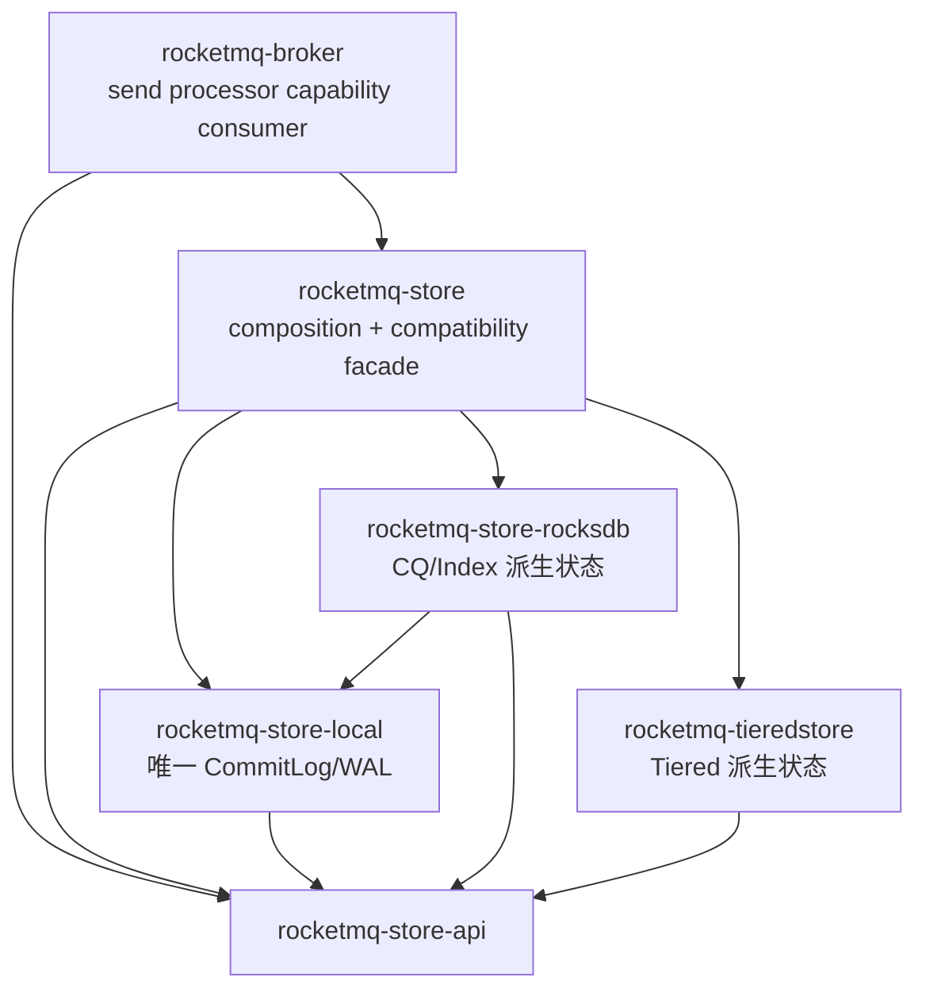

# PR-M06-12 Storage 依赖图与消费方收口

## 元数据

| 字段 | 值 |
|---|---|
| 所属里程碑 | M06 Store API、Local 与 RocksDB 边界提取 |
| 状态 | 已完成；M06 Gate 已关闭 |
| 候选快照 | PR-M06-03～M06-12 的同一 main 继承链 |
| 下一工作包 | PR-M07-01 Legacy Runtime 排空 |

## 目标完成定义

- root workspace 同时登记 `rocketmq-store-api`、`rocketmq-store-local`、`rocketmq-store-rocksdb`、`rocketmq-tieredstore` 与 Store facade，新增三个 storage package 后为 29/32。
- storage 子图中不存在 backend→facade 或 backend→高层 service 反向边；Store facade 不得依赖 Client、Broker、NameServer、Controller 或 Proxy。
- Broker send processor 直接消费 `MessageAppender + StoreHealth`，legacy adapter 仍由 Store facade 提供。
- canonical owner、legacy path、十项 feature matrix、实际 facade consumer 与 standalone inventory 在同一候选快照验证。
- 唯一 CommitLog/WAL、20B CQ/Index、Rocks column family、Tiered 派生状态和 R0 public path 兼容签署不变。

## 最终 Storage 子图

## 精确 Consumer Inventory

| Target | root workspace 直接 consumer |
|---|---|
| `rocketmq-store-api` | Broker、Store facade、Local、Rocks、Tiered |
| `rocketmq-store` | Broker、Proxy、store-inspect |
| `rocketmq-store-local` | Store facade、Rocks |
| `rocketmq-store-rocksdb` | Store facade |
| `rocketmq-tieredstore` | Store facade |

四个 standalone Cargo 项目（example、Dashboard GPUI、Tauri backend、Web backend）均无 storage package 直接依赖，
因此本工作包不存在需要迁移的 standalone storage consumer；该“零边”由 source contract 固定，不以目录名称推断。

## 实施结果

- root `[workspace.dependencies]` 新增 `rocketmq-tieredstore`，Store 改用 `workspace = true, optional = true`，保留 Tiered 默认 provider feature。
- architecture dependency policy 新增 `store-facade-no-high-level-services`，禁止 Store facade 直接依赖 Client/Broker/NameServer/Controller/Proxy；没有扩大 baseline。
- 新增 `test_m06_storage_closeout_contract.py` 5 项，精确冻结 package count、workspace registration、storage subgraph、policy、consumer inventory、standalone 零边和 Broker capability consumer。
- 当前 root workspace 为 29/32；尚未创建的 package 仅为 `rocketmq-proxy-core`、`rocketmq-proxy-cluster`、`rocketmq-proxy-local`，由 M08 负责。

## 验证证据

- Store API no-default check 与 18 项 unit/integration contract 通过；Local no-default check 与 185 项 all-feature lib 通过。
- Rocks no-default check 与 4 项 owner test 通过；Tiered all-feature lib 55/55；Store legacy adapter 9/9。
- Store no-default/default/local/fast/safe/fast+safe/io_uring/rocks/tiered/observability 十项 matrix 逐项通过。
- Broker、Proxy、store-inspect 三个实际 Store facade consumer 的 all-feature check 通过；四个 standalone 的零直接边由 contract 证明。
- 完整 M06 contract 200/200 通过（606.671s）。Architecture dependency baseline、35 项单测、6 个 violation fixtures、ArcMut guard、runtime enforcing audit 与 AGENTS routing 通过。
- Error architecture guard 仅复现 main 既有 11 项（Broker source stringification 1、MCP anyhow 8、缺失治理文档 2）；本工作包无新增 finding，不将该门禁记为通过。

## 回滚与失败路由

1. root Tiered workspace dependency 可恢复为 Store 的等价直接 path dependency，不改变 feature、provider 或运行行为。
2. policy 规则若误报，只能修正实际依赖或精确规则；不得扩大 architecture baseline 绕过失败。
3. canonical/legacy compile、feature matrix 或 consumer check 任一失败，返回对应 PR-M06-03～M06-11 修复并重新冻结整个候选快照。
4. 回滚不得恢复第二 CommitLog、backend→Store 反向边、native Rocks 默认依赖，或关闭 R0 legacy path。

## M06 Gate 签署与交接

- 唯一 WAL、持久格式、Store API 中立性、Local/Rocks/Tiered owner、Store facade 与兼容删除窗口已签署。
- 向 M07 交付 Broker capability consumer、Store facade 可见性规则与 consumer inventory。
- 向 M09 交付 Store facade/legacy path ledger 和下一 major 删除条件。
- 向 M10 交付唯一 WAL、Local/Rocks parity、Tiered decorator、完整 feature matrix 与故障 corpus。
