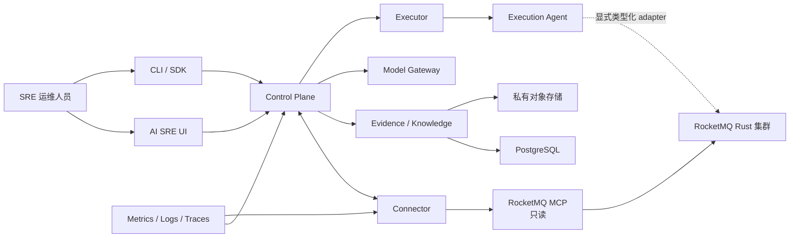

# RocketMQ Rust AI SRE

[English](README.md) | [简体中文](README.zh-CN.md)

RocketMQ Rust AI SRE 是面向 RocketMQ Rust 的、基于证据的运维智能与受控
自动化平台。项目在独立的 SRE 工作区中整合确定性诊断、大语言模型、可观测
数据、运维知识和显式安全控制。

项目作为独立的 Rust 2024 workspace 维护在 RocketMQ Rust 仓库中，拥有自己的
依赖图、lockfile、服务、面向桌面的 Web UI、API 契约、SDK、部署资源和验证
工具。项目通过 MCP Streamable HTTP 与 `rocketmq-mcp` 集成，不导入 MCP
server DTO，也不复用普通 RocketMQ Dashboard 的 session 和 mutation 接口。

## 项目能力

| 领域 | 能力 |
| --- | --- |
| 集群接入 | 租户范围内的集群接入、能力协商、拓扑与资产清单、受限合成探针，以及通过 MCP 只读采集 RocketMQ Evidence |
| Evidence | 版本化 Evidence 契约、Canonical JSON 与内容哈希、freshness 和部分结果语义、PostgreSQL 元数据，以及用于大载荷的私有对象存储 |
| 诊断 | 确定性 Diagnostic Pack、假设与反证跟踪、巡检、健康与 SLO 分析、告警关联，以及 Incident 时间线 |
| AI 辅助 | 通过固定只读 Tool registry 实现带 Evidence 引用的对话式指标查询，以及 Provider 无关的 Model IR、基于能力的路由、流式响应、fallback、预算、脱敏、RAG 和异构主模型/Critic 调用链 |
| 预测 | 容量与积压预测、异常与变点提示、What-if 仿真、升级就绪度和容灾就绪度 |
| 受控自动化 | 类型化 Action Plan、策略评估、禁止自审批的人工审批、不可变授权、受监督执行、验证、回滚、lease、fencing 和恢复 |
| 企业运维 | Fleet 与区域视图、发布护航、DR Center、合规与治理索引、企业集成、通知投递、复盘和 FinOps 视图 |
| 使用接口 | 全宽桌面 AI SRE UI、版本化 HTTP API、生成的 OpenAPI 契约、只读 Rust/TypeScript 客户端和运维 CLI |

系统遵循 Evidence-first 运维流程：

```text
观测 → 关联 → 诊断 → 建议 → 治理 → 执行 → 验证 → 学习
```

规则和类型化契约始终是安全决策的权威依据。模型可以解释 Evidence 和提出计划，
但不能绕过能力、策略、审批、凭据、lease、fencing 或验证边界。

## 架构



普通 RocketMQ 运维 UI 与 AI SRE UI 是两个相互独立的产品。Dashboard 保持
直接资源管理界面的职责；AI SRE 负责跨信号诊断、Incident 工作流、建议、治理、
受监督执行、Fleet 运维和审计历史。两者可以通过有作用域的只读上下文和 deep
link 协作，无需共享 session 或原始 mutation API。

## 安全模型

- MCP 和 Connector 只读，不暴露 RocketMQ apply、delete、reset、clean 或任意
  Admin 操作。
- Evidence、日志、诊断、错误和模型请求均经过限制与脱敏。凭据、token、ACL/TLS
  材料、私钥、消息正文和完整配置值不会进入这些数据。
- Provider 凭据通过 Secret 引用解析。内置 Provider profile 仅包含协议默认值，
  不包含 API key。
- 目标变更使用独立的 Executor 与 Execution Agent 链路。Executor 不持有目标
  凭据，也不能访问目标网络。
- Mutation adapter 类型明确、逐项启用、受策略约束，并由审批、幂等性、lease、
  fencing、验证和回滚语义保护。
- 不支持的 schema major、能力漂移、身份不匹配、不安全的 Provider 行为和不完整
  的执行授权均 fail closed。
- PostgreSQL 是持久化的事实来源；内存 repository 仅用于测试。

详细边界决策参见[项目边界](docs/decisions/0001-project-boundaries.md)和
[MCP 只读边界](docs/decisions/0002-read-only-mcp-boundary.md)。

## 模型 Provider

Model Gateway 使用规范 Model IR 与协议 adapter，产品逻辑不绑定单一厂商 SDK。

| Provider 或运行时 | 协议族 |
| --- | --- |
| OpenAI 与兼容网关 | OpenAI-compatible |
| Azure OpenAI | Azure OpenAI-compatible |
| Anthropic | Anthropic Messages |
| Google Gemini | Gemini 原生协议 |
| AWS Bedrock | 带 SigV4 的 Bedrock Converse |
| DeepSeek | OpenAI-compatible 与 Anthropic-compatible profile |
| 智谱 GLM | GLM/OpenAI-compatible |
| Kimi / Moonshot | OpenAI-compatible，并提供需要显式启用的 MFJS profile |
| vLLM、Ollama、llama.cpp 与 SGLang | 本地 OpenAI-compatible 运行时 |
| 企业模型网关 | 可配置的 OpenAI-compatible profile |

每个 profile 都声明其实际支持的 chat、tool、结构化输出、reasoning、streaming、
embedding、reranking、数据分类、区域、成本和上下文能力。路由会拒绝无法满足
请求契约的 Provider，不会静默降级。

参见[模型兼容性](docs/compatibility.md)和
[扩展指南](docs/phase05-extension-guide.md)。

无凭据本地运行时资格验证使用一次性、仅绑定 loopback 的 Ollama 容器和固定的
`qwen2.5:0.5b` 模型，通过生产 Model Gateway adapter 只发起一次有界的
OpenAI-compatible chat 请求。报告仅记录 digest、大小、token 计数、安全断言和清理状态，
不会记录 endpoint、prompt、response、凭据或本机路径。容器、专用模型卷、进程环境以及
本次运行新引入的运行时镜像会在报告被接受前清除。拉取固定运行时与模型时会访问其公共
制品仓库，但不会调用任何外部模型 Provider 推理端点。

```powershell
.\scripts\local-model-qualification.ps1 -Mode Check
.\scripts\local-model-qualification.ps1
```

DeepSeek Responses 接入支持有界语义 SSE、协作式取消、稳定的 Provider 错误映射、
结构化输出和只读 Tool selection。对话式运维链路会根据固定 registry 校验模型选择
的 Tool，通过 Connector 执行查询，持久化 Canonical Evidence 和不可变的回答 revision；
当没有可用 Provider 时，系统仍会返回带引用的 rules-only 回答。凭据门控的两请求
资格验证已使用 disposable Docker PostgreSQL，验证真实 `deepseek-v4-flash` Tool
selection 和 Evidence 绑定回答。该能力不会向模型授予 RocketMQ 凭据，也不代表无人
值守 mutation 已通过认证。API key 必须通过仓库外的显式文件提供，并会在写入任何
本机报告前从资格验证进程中清除。

Provider fallback 采用有限次数和错误分类。Timeout、rate limit、service unavailable
和 transport failure 可以进入下一个已认证 profile；authentication、policy、capability、
data residency、结构化输出和 citation 错误会停止路由并降级到 rules-only。凭据门控的资格
验证允许已选 Provider 最多进行一次有界的同 Provider 结构化输出修复，该修复不会授权新的
fallback 跳转。验证使用 loopback primary 故障端点和真实 DeepSeek Responses secondary，核对持久化的
Provider 身份与 fallback provenance，并证明所有 Provider 不可用时仍不可执行。智谱 GLM 与
Kimi/Moonshot 已具备协议和 profile 支持，但在没有各自凭据时不会声明为 live-certified。

```powershell
.\scripts\provider-failover-qualification.ps1 -Mode Check
.\scripts\provider-failover-qualification.ps1 -SecretFile <仓库外凭据文件>
```

脱敏报告仅写入 `D:` 或 `F:` 的专用 Evidence 根目录，不保存 prompt、response、消息正文、
endpoint URL 或凭据。Loopback primary 使用独立的进程级随机 fixture 凭据，绝不会收到
DeepSeek API key；两类环境变量都会在清理时删除。

## Workspace crate

| Crate | 职责 |
| --- | --- |
| `rocketmq-sre-contracts` | 版本化 domain、wire、持久化、Evidence、Incident、计划、执行和扩展契约；不依赖网络、异步运行时、数据库或 RocketMQ 实现 |
| `rocketmq-sre-core` | Incident 协调、确定性 domain service 和 descriptor registry |
| `rocketmq-sre-model-gateway` | 规范 Model IR、Provider profile、协议 adapter、路由、streaming、预算、fallback 和 Critic 支持 |
| `rocketmq-sre-control-plane` | 产品 API 与服务 composition root、持久化、集群接入、诊断、治理和运维工作流 |
| `rocketmq-sre-connector` | 经过身份认证的 MCP client、能力握手、schema 校验、Evidence 转换和数据源健康状态 |
| `rocketmq-sre-executor` | 不持有目标凭据的受监督执行日志、策略/审批强制执行、分派、验证、回滚和恢复 |
| `rocketmq-sre-execution-agent` | 隔离的类型化目标 adapter、凭据分离、lease、fencing、幂等性和效果协调 |
| `rocketmq-sre-probe` | 仅用于专用合成 Topic 与 Group 的受限 producer/consumer 探针 |
| `rocketmq-sre-eval` | Schema 导出、覆盖率校验、确定性评估和验收工具 |
| `rocketmq-sre-client` | 仅支持状态、集群、Incident、巡检、计划和 OpenAPI 固定查询的只读 Rust client |
| `rocketmq-sre-cli` | 只读运维命令，以及仅在本地进行的类型化 Plan 与 Runbook 草稿校验 |

项目还包含以下目录：

- `ui/`：使用 React 18、TypeScript、Vite、Tailwind CSS、Radix UI 和
  shadcn/ui 风格组件构建的桌面工作区。
- `migrations/`：仅向前演进的 PostgreSQL migration。
- `openapi/` 与 `sdk/`：生成的 API 契约和客户端 SDK。
- `config/`：能力、可观测性、策略和覆盖率目录。
- `deploy/`：Docker Compose 和 Kind 开发/验收环境。
- `docs/`：架构决策、协议契约、扩展指南和运维记录。

## 快速开始

### 前置条件

- Rust 1.95 或更高版本
- Docker Desktop，或带 Docker Compose 的 Docker Engine
- 用于 UI 开发的 Node.js 和 npm
- 用于运行本地脚本的 PowerShell 7 或 Windows PowerShell

PostgreSQL 运行在 Docker 中，无需在宿主机安装 PostgreSQL。

从仓库根目录执行：

```powershell
.\rocketmq-ai\rocketmq-sre\scripts\dev.ps1 -Action Up
```

主要本地访问地址如下：

| 服务 | URL |
| --- | --- |
| AI SRE UI | `http://localhost:3004` |
| Control Plane API | `http://localhost:8090` |
| MCP Streamable HTTP | `https://localhost:8089` |
| Prometheus | `http://localhost:9090` |
| Loki | `http://localhost:3100` |
| Tempo | `http://localhost:3200` |

停止环境并保留 PostgreSQL 与 Evidence volume：

```powershell
.\rocketmq-ai\rocketmq-sre\scripts\dev.ps1 -Action Down
```

本地身份、TLS fixture、端口、smoke test、volume 重置方式和故障排查参见
[本地环境指南](deploy/dev/README.md)。

## 开发

在 `rocketmq-ai/rocketmq-sre/` 中运行 Rust 命令：

```powershell
python scripts/check_source_layout.py
python scripts/check_execution_dependency_boundary.py
cargo fmt -p rocketmq-sre-contracts -p rocketmq-sre-core -p rocketmq-sre-model-gateway -p rocketmq-sre-control-plane -p rocketmq-sre-connector -p rocketmq-sre-executor -p rocketmq-sre-execution-agent -p rocketmq-sre-probe -p rocketmq-sre-eval -p rocketmq-sre-client -p rocketmq-sre-cli -- --check
cargo check --locked --workspace
cargo test --locked --workspace --all-features
cargo clippy --locked --workspace --all-targets --all-features -- -D warnings
cargo doc --locked --workspace --no-deps
```

在仓库根目录运行 UI 命令：

```powershell
npm --prefix rocketmq-ai/rocketmq-sre/ui ci
npm --prefix rocketmq-ai/rocketmq-sre/ui run lint
npm --prefix rocketmq-ai/rocketmq-sre/ui run test -- --run
npm --prefix rocketmq-ai/rocketmq-sre/ui run build
```

Rust workspace 使用 Rust 2024 模块布局：`foo.rs` 负责声明放在 `foo/`
目录下的子模块。项目拒绝旧式 `foo/mod.rs` 入口。

### 诊断包资格验证

版本化资格清单覆盖全部内置 Diagnostic Pack，并为每个包提供相互隔离的正常、故障和
Evidence 缺失场景。实测工具会启动一次性 PostgreSQL 17 容器，通过运行中的 Control
Plane 验证持久化结果、Evidence 引用、Schema 拒绝以及租户和集群边界。整个过程保持
rules-only：模型网络调用、目标变更和执行记录必须全部为零。

在 `rocketmq-ai/rocketmq-sre/` 中运行下列命令；构建产物位于 `F:`，脱敏报告写入仓库外的 `D:`：

```powershell
.\scripts\diagnostic-pack-live-qualification.ps1
```

PostgreSQL 使用有界的 Docker `tmpfs`，运行结束后自动删除。可独立校验已提交的契约：

```powershell
python scripts/check_diagnostic_pack_qualification.py
```

### 对话安全资格验证

Conversation 安全套件组合了 8 个 Prompt Injection 固定场景、确定性回放引用质量数据集和真实 Chromium 桌面测试。它证明不可信指令不能扩大固定只读查询面，`preview_reset` 后临时模型文本会被丢弃，并且超过配置置信度阈值的每个结论都保留授权 Evidence 引用。Mutation、Executor 和 Execution Agent 调用必须始终为 0。

从 `rocketmq-ai/rocketmq-sre/` 运行静态契约检查或完整资格验证。完整运行要求候选 revision 已提交且工作区干净，脱敏报告只写入仓库外本机 `D:` 或 `F:`：

```powershell
.\scripts\conversation-security-qualification.ps1 -ValidateOnly
.\scripts\conversation-security-qualification.ps1
```

该套件使用隔离模型 fixture，不代表真实 Provider 或目标生产环境认证。

### 有界 R1 动作资格验证

R1 资格契约覆盖四个已注册的低风险动作，同时不开放通用 Admin、Shell 或 Kubernetes
Patch 能力。每个动作都绑定自己的描述符、负责人、独立启用开关和类型化预检，并统一经过
租约、Fence、执行日志、验证、审计和隔离边界。

实测工具使用一次性 Kind 部署以及真实运行的 Control Plane、Executor、Execution Agent、
PostgreSQL、Broker、Proxy 和 OpenTelemetry Collector。真实目标变更严格限制为一个日志级别
TTL 覆盖、一个 Proxy 副本、一个 Proxy Pod 或一个 Collector Pod。确定性的失败与恢复用例在
隔离的 PostgreSQL Schema 中配合类型化 Agent 测试替身执行，因此报告会明确区分真实目标执行
与可控恢复模拟。只有在 Proxy 副本数恢复、日志覆盖到期、工作负载恢复 Ready，且资格验证自有
资源被清理后，运行才可判定为通过。

按 Kind 环境文档完成启动后，在 `rocketmq-ai/rocketmq-sre/` 中运行：

```powershell
.\scripts\r1-action-live-qualification.ps1
```

脱敏报告写入 `D:\rocketmq-sre-evidence`，且不构成生产认证。整个过程的模型供应商网络调用保持
为零。可使用以下命令独立校验已提交的清单：

```powershell
python scripts/check_r1_action_qualification.py
```

### 受控 R2 动作资格验证

R2 资格契约覆盖五个已批准的中等风险动作：Broker、Topic 和订阅组的白名单配置补丁，
单副本且使用镜像摘要固定的 Proxy 金丝雀，以及先重叠后切换的凭据轮换。每个计划都必须经过
离线异构 Critic、独立人工审批、绑定哈希的授权、Generation 或版本 Fence、类型化 Agent
预检、持久化执行日志、稳定窗口验证和自动补偿。无人值守执行保持关闭。

资格验证入口从干净且已提交的源码版本创建全新的一次性 Kind 集群，注册不可变的本地金丝雀
镜像，并让五个动作全部经过 Control Plane、Executor 和 Execution Agent。确定性恢复用例在
隔离的 PostgreSQL Schema 中执行。通过前，工具会删除金丝雀、凭据夹具、Bootstrap Job、
Kind 集群和生成的运行时文件。脚本化 Critic 使用不同的模型系列，但不会发起模型供应商网络调用。

在 `rocketmq-ai/rocketmq-sre/` 中运行；构建产物保留在 `D:` 和 `F:`，脱敏报告写入仓库外的 `D:`：

```powershell
.\scripts\r2-action-live-qualification.ps1
```

该报告用于证明实现资格，不构成生产认证。可独立校验已提交的清单：

```powershell
python scripts/check_r2_action_qualification.py
```

### 有界自治资格验证

自治资格契约覆盖同一组四个已批准 R1 动作，但不会启用无人值守的目标执行。验证工具会把干净且
已提交的源码版本部署到全新的一次性 Kind 集群，PostgreSQL 在集群内以容器运行。对于每个动作，
工具会持久化 20 个 Shadow 结果，执行七天观察窗口约束，持久化 5 个经人工批准的 Supervised
成功样本，验证离线异构 Critic 绑定，并覆盖 fail-closed 安全控制、ExpectedDeny 处理、失败暂停、
负责人恢复、真实 Supervised 执行和清理。

真实目标执行的上限固定为 `Supervised`。资格验证可以计算 Autonomous 晋级条件是否满足，但不会
执行该实时状态转换，也不会下发无人值守的目标变更。脚本化的主模型与 Critic 身份仅用于契约夹具；
模型凭据和模型网络调用均被禁止。DeepSeek 真实诊断通过本地提供的 secret 单独完成资格验证，
继续保持建议性、只读，并且不参与 Autonomous 晋级决策。

在 `rocketmq-ai/rocketmq-sre/` 中运行；工具会自行创建并销毁集群，构建产物保留在 `D:` 和 `F:`，脱敏报告
写入仓库外：

```powershell
.\scripts\autonomy-action-live-qualification.ps1
```

该报告用于证明实现资格，不构成生产认证。无需集群即可校验已提交的契约：

```powershell
python scripts/check_autonomy_action_qualification.py
```

## 用户界面

UI 按照 shadcn/ui 规范和可访问的 Radix UI primitive 设计为全屏桌面运维
工作区。支持的设计目标为 1280×720、1440×900 和 1920×1080。当前范围不包含
专用移动端交互设计。

## 文档

- [本地环境](deploy/dev/README.md)
- [Kind 环境](deploy/kind/README.md)
- [兼容性](docs/compatibility.md)
- [项目边界](docs/decisions/0001-project-boundaries.md)
- [MCP 只读边界](docs/decisions/0002-read-only-mcp-boundary.md)
- [Control Plane–Connector mTLS](docs/control-plane-connector-mtls.md)
- [Connector 传输](docs/connector-control-plane-transport-adr.md)
- [Diagnostic Pack 目录](docs/phase02-diagnostic-packs.md)
- [执行契约](docs/phase03-execution-contracts.md)
- [计划、策略、审批和审计](docs/phase03-plan-policy-approval.md)
- [运维指南](docs/phase05-operations-guide.md)
- [扩展指南](docs/phase05-extension-guide.md)

## 许可证

本项目使用 Apache License 2.0。
