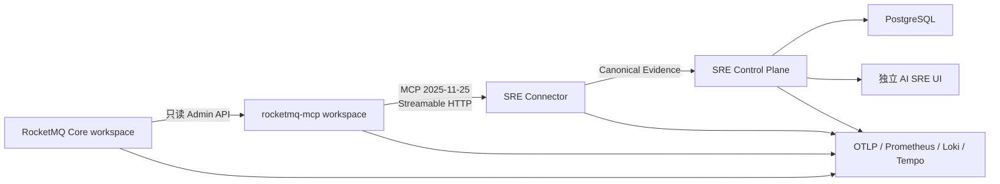

# ADR 0001：AI SRE 项目边界

- 状态：Accepted
- 日期：2026-07-26
- 适用阶段：Phase 00

## 决策

RocketMQ Core、RocketMQ MCP 与 RocketMQ AI SRE 保持在同一个 Git
monorepo 中，但分别使用独立的 Cargo workspace、`Cargo.lock`、CI 与发布镜像。

允许的编译依赖：

- Contracts 不依赖网络、异步运行时、数据库、模型 SDK 或 RocketMQ 实现。
- Core 只依赖 Contracts。
- Connector 可依赖通用 MCP client 和共享 Runtime，但不得依赖 MCP server crate
  或其 Rust DTO。
- Probe 仅可依赖 Producer/Consumer 能力，且必须
  `default-features = false`；不得启用 Admin feature。
- Executor 与 Execution Agent 在 Phase 00 只有禁用库骨架，不包含二进制、
  mutation driver 或目标集群凭据。
- Control Plane、Model Gateway、Connector 和 Executor 不得依赖 Broker、Store、
  Admin mutation 实现。

运行时边界：

- Connector 通过 TLS 服务端认证与 OAuth2 client credentials 调用 MCP。
- MCP 使用只读身份；tenant、scope、audience 与 cluster allowlist 必须精确匹配。
- Control Plane 使用 PostgreSQL 保存接入状态、能力快照和审计事件。
- Phase 00 唯一允许的 RocketMQ 写入是专用、预创建的合成 Topic 上的有界探针消息。

## 为什么不拆 Git 仓库

Admin feature、遥测语义注册表和 Runtime diagnostics 仍由 Core 提供。保留 monorepo
可以让跨项目兼容变更在一个合入单元内完成，并避免临时发布内部依赖。Cargo workspace
独立已经提供了权限闭包、lockfile、CI 和镜像边界，因此此阶段拆 Git 仓库只会增加版本
协调成本。

## 为什么 AI SRE UI 与普通 Dashboard 分离

普通 Dashboard 面向人工管理，存在资源修改和日常管理语义；AI SRE UI 面向证据、
兼容性、覆盖度和诊断过程。独立 UI 有以下收益：

- 身份、Session 与 API surface 不会继承普通 Dashboard 的 mutation 权限。
- 界面可以始终明确展示 `read_only` 和 `mutation_supported=false`。
- AI 证据链、缺失信号和模型供应商状态可以独立演进，不扰动普通运维流程。
- 安全审计可以直接证明 AI SRE 前端没有调用管理变更 API。
- 两个产品仍可通过只读 deep link 互相跳转，无需复用源码或认证会话。

## 后果

- 根、MCP、SRE 必须分别执行 metadata/check/test。
- 共享 crate 或协议变更必须触发 MCP/SRE consumer CI。
- MCP/SRE path dependency 仍要求在 monorepo 相对路径中构建。
- 后续若拆 Git 仓库，需要先建立共享契约版本发布与兼容认证流程。
