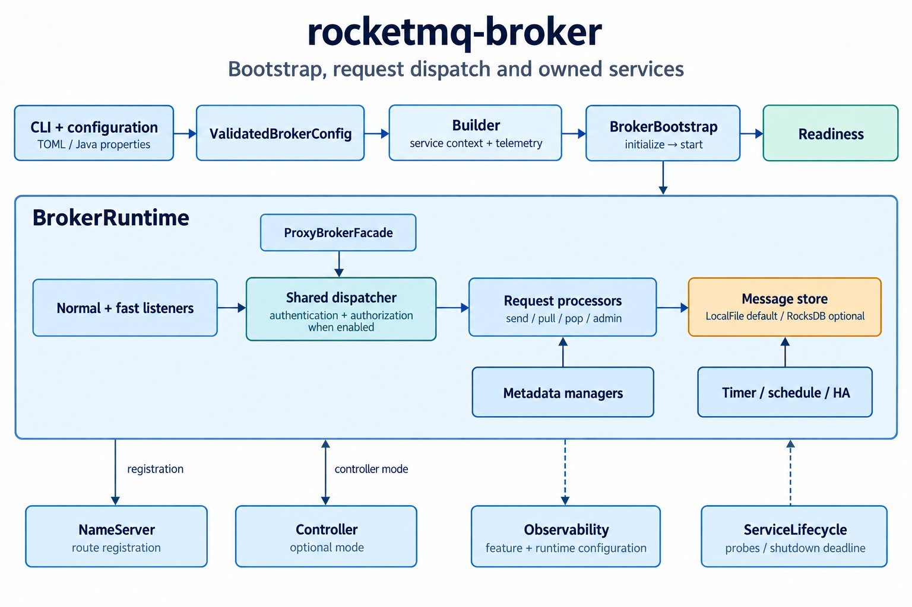

# rocketmq-broker

[English](README.md) | [简体中文](README-zh_cn.md)

[RocketMQ-Rust](../README.md) 的 Broker 运行时、远程请求处理、存储集成与服务编排模块。
该 crate 提供 `rocketmq-broker-rust` 二进制程序，以及通过明确的运行时所有权和经过校验的配置构建 Broker 的库入口。

## 能力边界

| 领域 | 当前实现 |
|------|----------|
| 启动 | 加载 TOML 和 Java properties，执行类型化配置校验、分阶段启动、就绪检查、启动回滚和协调关闭。 |
| 请求处理 | 发送、拉取、peek、pop、确认、不可见时间修改、通知、回复、撤回、查询、客户端与消费者管理、lite 订阅、事务和管理请求。 |
| 存储 | 默认使用本地文件存储；可选 RocksDB 后端和分层存储集成；支持定时/延迟消息与 HA 服务。 |
| 元数据 | 主题配置、队列映射、订阅、消费偏移量、顺序消费、过滤器和路由信息。 |
| 安全 | 通过 `rocketmq-auth` 提供可选的认证与授权、ACL 导入和监听、认证管理，以及独立授权的维护请求。 |
| 运行维护 | 长轮询、延后处理的请求、快速失败、客户端清理、注册、Controller 模式集成和关闭报告。 |
| 可观测性 | 可选的指标、追踪和日志导出器；进程健康探针及可配置的日志。 |

具体能力取决于所选存储后端、Cargo feature、运行时配置和 Broker 角色。该列表不表示已与 Java Broker 的全部功能对齐。

## 架构



二进制程序将配置解析为 `ValidatedBrokerConfig`，并将运行时和遥测句柄交给 `Builder`。
`BrokerBootstrap` 按 `Configured`、`Initialized`、`Running` 顺序推进状态；启动失败时回滚已完成的启动工作。
二进制程序通过 `boot_with_lifecycle` 发布就绪状态，并在进程共享的截止时间内关闭服务。

普通和快速远程监听器与内嵌的 `ProxyBrokerFacade` 使用同一分发器。分发器执行已配置的安全检查，
将请求路由到使用存储和元数据服务的处理器。NameServer 注册和可选的 Controller 协调独立于客户端请求分发。

| 公共 API | 契约 |
|----------|------|
| `Builder::new` | 接收 `ChildServiceContext` 和 `TelemetryRuntimeGuard`；通过 `with_validated_config` 提供 `ValidatedBrokerConfig`。`build` 返回 `BrokerBootstrap<Configured>`。 |
| `BrokerBootstrap::initialize` / `start` | 消费前一阶段的状态，返回下一阶段的状态或 `BrokerStartupError`。 |
| `BrokerBootstrap<Running>` | 提供 `readiness()` 和消费自身的异步 `shutdown()`。 |
| `BrokerBootstrap::boot_with_lifecycle` | 在 `ServiceLifecycle` 管理下运行，将生命周期和启动错误返回调用方。 |
| `ProxyBrokerFacade` | 为内嵌代理提供 Broker 请求处理入口。 |
| `config` | 公开原始配置加载、Java properties 转换、类型化分区和校验后配置的 API。 |

便捷方法 `boot()` 会记录启动错误并返回 `()`；需要处理错误的调用方应使用分阶段方法或 `boot_with_lifecycle`。
`BrokerRuntime` 和大多数实现模块仅在 crate 内部可见。

## 源码导览

| 源码 | 职责 |
|------|------|
| [`src/bin/broker_bootstrap_server.rs`](src/bin/broker_bootstrap_server.rs) | CLI/配置解析、安全引导检查、遥测初始化和进程生命周期。 |
| [`src/config`](src/config) | 规范配置结构、字段归属、配置转换和语义校验。 |
| [`src/broker_bootstrap.rs`](src/broker_bootstrap.rs)、[`src/lifecycle.rs`](src/lifecycle.rs) | Builder、类型化启动状态、错误和就绪依据。 |
| [`src/broker_runtime/composition.rs`](src/broker_runtime/composition.rs) | 构建运行时组件。 |
| [`src/broker_runtime/data_plane.rs`](src/broker_runtime/data_plane.rs)、[`metadata.rs`](src/broker_runtime/metadata.rs) | 存储后端选择和元数据管理器。 |
| [`src/broker_runtime/control_plane.rs`](src/broker_runtime/control_plane.rs)、[`control_plane/auth.rs`](src/broker_runtime/control_plane/auth.rs) | 控制服务、认证运行时和认证管理。 |
| [`src/broker_runtime/request_pipeline.rs`](src/broker_runtime/request_pipeline.rs)、[`request_pipeline/startup.rs`](src/broker_runtime/request_pipeline/startup.rs) | 处理器组装和普通/快速监听器启动。 |
| [`src/processor/dispatcher.rs`](src/processor/dispatcher.rs) | 统一分发、安全检查、快速失败决策和处理器选择。 |
| [`src/broker_runtime/lifecycle.rs`](src/broker_runtime/lifecycle.rs)、[`shutdown_report.rs`](src/broker_runtime/shutdown_report.rs) | 服务启动、回滚、关闭和完成情况报告。 |
| [`src/broker_runtime/deferred.rs`](src/broker_runtime/deferred.rs)、[`deferred_producer.rs`](src/broker_runtime/deferred_producer.rs) | 延后处理请求的准入控制和受生命周期管理的工作任务。 |
| [`src/topic`](src/topic)、[`subscription`](src/subscription)、[`offset`](src/offset)、[`pop`](src/pop)、[`transaction`](src/transaction) | 主题、订阅、消费和事务服务。 |

## 构建与本地启动

在工作区根目录使用仓库固定的 Rust `1.95.0` 工具链执行命令：

```bash
cargo build -p rocketmq-broker --bin rocketmq-broker-rust --release
```

先启动可访问的 [NameServer](../rocketmq-namesrv/README-zh_cn.md)。在普通独立启动模式下，
如果无法向任何已配置的 NameServer 成功注册，Broker 启动会失败。未提供地址时，二进制程序回退到 `127.0.0.1:9876`。

创建 `conf/broker.toml`，使用以下单机本地主节点配置。示例中的所有监听器均绑定回环地址：

```toml
[broker]
namesrvAddr = "127.0.0.1:9876"
brokerIp1 = "127.0.0.1"
listenPort = 10911
storePathRootDir = "./store"

[broker.brokerServerConfig]
bindAddress = "127.0.0.1"

[broker.brokerIdentity]
brokerName = "broker-a"
brokerClusterName = "DefaultCluster"
brokerId = 0

[store]
storeType = "LocalFile"
brokerRole = "ASYNC_MASTER"
storePathRootDir = "./store"
haListenAddress = "127.0.0.1"
haListenPort = 10912
```

显式将 `ROCKETMQ_HOME` 设为已有的安装或配置目录，使配置文件查找位置明确。本例直接使用工作区目录。
下面的开发安全配置会检查已配置的监听器是否使用回环地址；本例仍关闭认证和授权。

Windows PowerShell：

```powershell
$env:ROCKETMQ_HOME = "$PWD"
$env:ROCKETMQ_SECURITY_PROFILE = "development-insecure-loopback"
cargo run -p rocketmq-broker --bin rocketmq-broker-rust -- -c ./conf/broker.toml -n "127.0.0.1:9876"
```

Linux/macOS：

```bash
export ROCKETMQ_HOME="$PWD"
export ROCKETMQ_SECURITY_PROFILE=development-insecure-loopback
cargo run -p rocketmq-broker --bin rocketmq-broker-rust -- -c ./conf/broker.toml -n "127.0.0.1:9876"
```

普通远程端口为 `10911`；快速端口由 `listenPort - 2` 派生，即 `10909`。
HA 端口单独配置，本例为 `10912`。每个 Broker 实例应使用不同的端口和存储目录。
面向远程客户端部署时，需要配置合适的对外公布地址、监听地址和安全材料。

## 命令行

通过 Cargo 运行时，将以下参数放在 `--` 后；也可以直接传给编译后的二进制程序：

| 参数 | 用途 |
|------|------|
| `-c, --configFile <FILE>` | 指定配置文件。`.toml` 使用 TOML；`.conf` 和 `.properties` 使用 Java properties。 |
| `--config-format <toml\|properties>` | 显式指定配置解析器。建议使用与格式匹配的文件扩展名。 |
| `--conversion-report <FILE>` | 指定加载 Java properties 时生成的 JSON 转换报告路径。 |
| `-p, --printConfigItem` | 校验并打印 Broker/存储配置，在启动遥测、存储和服务监听器之前退出。 |
| `-m, --printImportantConfig` | 打印选定的关键配置项，与 `-p` 互斥。 |
| `-n, --namesrvAddr <ADDR>` | 覆盖 NameServer 地址列表；多个地址以分号分隔，并用引号包裹。 |
| `--log-filter <DIRECTIVE>` | 覆盖启动时的日志过滤规则。 |
| `-h, --help` | 打印命令行帮助。 |
| `-V, --version` | 打印包版本。单独使用 `--version --verbose` 时，还会打印构建产物和 feature 元数据。 |

```bash
cargo run -p rocketmq-broker --bin rocketmq-broker-rust -- --help
cargo run -p rocketmq-broker --bin rocketmq-broker-rust -- --version --verbose
cargo run -p rocketmq-broker --bin rocketmq-broker-rust -- -c ./conf/broker.toml -p
```

`-p` 和 `-m` 仍会校验配置及解析后的主目录值。输出为诊断用途的属性列表，
不能直接作为规范 TOML 文件复用。这两种模式不会验证 NameServer 连通性、存储打开过程或完整的安全/遥测启动流程。
打印模式下加载 Java properties 仍会写入转换报告。

| 退出码 | 含义 |
|--------|------|
| `0` | 正常完成，包括帮助、版本和配置打印。 |
| `2` | Clap 参数解析错误，例如未知选项或互斥的打印选项。 |
| `70` | 服务入口返回的错误，包括参数值校验、配置加载/校验、显式为空的 `ROCKETMQ_HOME` 及启动/关闭失败。 |

## 配置契约

配置文件选择顺序为：显式 `-c`、存在时的 `$ROCKETMQ_HOME/conf/broker.toml`、默认值。
自动查找配置文件要求设置 `ROCKETMQ_HOME`。未设置时，主目录校验会回退到当前目录，但这一回退不会触发配置文件自动查找。
显式为空的 `ROCKETMQ_HOME` 会被拒绝。
NameServer 地址选择顺序为：`-n`、`NAMESRV_ADDR`、`broker.namesrvAddr`、`127.0.0.1:9876`。
当前实现中，显式为空的 `NAMESRV_ADDR` 会选择回环地址并覆盖文件值；需要使用文件中的地址时，应移除该环境变量。

规范 TOML 使用 `[broker]`、`[store]`、`[logging]` 和 `[observability]` 分区。
未知字段会被拒绝，旧的 Broker/存储扁平布局不再受支持。构建运行时之前，配置校验会归一化派生字段，
并检查端口、地址、角色约束、资源预算和安全前提条件。

| 规范字段 | 含义或约束 |
|----------|------------|
| `broker.brokerIp1` / `broker.listenPort` | 对外公布的远程地址，以及普通监听器端口的权威配置。 |
| `broker.brokerServerConfig.bindAddress` | 本地监听地址，与对外公布地址分别配置。 |
| `broker.brokerIdentity` | 集群、名称和 ID。在非 Controller 模式下，主节点 ID 必须为 `0`，从节点 ID 必须非零。 |
| `broker.storePathRootDir` | Broker 元数据根目录；启动时的文件日志写入其 `logs` 子目录。 |
| `store.storePathRootDir` / `store.storePathCommitLog` | 消息存储根目录及可选的 commitlog 路径覆盖。commitlog 默认位于存储根目录下。Broker 根目录和存储根目录是独立配置。 |
| `store.storeType` | 默认为 `LocalFile`；选择 `RocksDB` 需要编译时启用 `rocksdb_store`。 |
| `store.brokerRole` | `ASYNC_MASTER`、`SYNC_MASTER` 或 `SLAVE`，受角色与身份校验约束。 |
| `store.haListenAddress` / `store.haListenPort` | HA 监听配置；HA 端口不能与两个远程端口冲突。 |
| `broker.enableControllerMode` / `broker.controllerAddr` | Controller 模式要求有效的 Controller 地址及兼容的心跳配置。 |

不要设置 `broker.brokerServerConfig.listenPort`、`store.enableControllerMode` 或 `store.duplicationEnable`。
它们分别由 `broker.listenPort`、`broker.enableControllerMode` 和 `broker.duplicationEnable` 派生；
即使值一致，在派生字段所属分区重复配置也会被拒绝。

DLedger 模式被明确标记为不支持；启用该模式或提供 DLedger 身份/路径设置都会被拒绝。
启用 `store.coldDataFlowControlEnable` 也会在运行时启动阶段被拒绝，
原因是旧的冷数据队列尚不满足所需的生命周期所有权与关闭契约。

### Java Properties 迁移

转换器将受支持的 Java 配置键映射到规范的 Broker/存储字段，并拒绝未知键、重复赋值、冲突别名、无效值及 DLedger 配置。
Java 的 `storeType=default` 和 `storeType=defaultRocksDB` 会映射为 Rust 后端名称；这两个 Java 值不能直接作为规范 TOML 的值。

```bash
cargo run -p rocketmq-broker --bin rocketmq-broker-rust -- -c ./conf/broker.conf --config-format properties --conversion-report ./conf/broker.conversion.json -p
```

转换报告记录映射关系、警告和脱敏后的值状态。默认路径通过将源文件扩展名替换为 `.conversion.json` 得到，
写入报告失败会阻止启动。转换将配置加载到内存，不会输出新的 TOML 文件，也不会复制引用的 ACL、证书或其他文件。

### 认证与安全引导检查

准备好所引用的认证元数据和 ACL 文件后，将以下字段合并到已有的 `[broker]` 表中：

```toml
[broker]
authConfigPath = "./store/auth"
aclFile = "./conf/plain_acl.yml"
aclFileWatchEnabled = true
authenticationEnabled = true
authorizationEnabled = true
signatureAlgorithm = "HmacSHA1"
```

两个安全开关均默认为 `false`。授权依赖认证；启用任一开关都要求非空的 `authConfigPath`。
Broker 构建认证运行时，并将其共享给分发器和认证管理服务；Broker 出站 RPC 凭据需要单独配置。
ACL 格式、凭据处理、白名单行为、重载和提供程序限制见 [rocketmq-auth](../rocketmq-auth/README-zh_cn.md)。

二进制程序还支持 `ROCKETMQ_SECURITY_PROFILE=secure-enforced`，要求开启两个安全开关，并设置安全引导环境变量：
`ROCKETMQ_SECURITY_TRUST_ANCHOR`、`ROCKETMQ_SECURITY_TLS_CERT`、`ROCKETMQ_SECURITY_TLS_KEY`、
`ROCKETMQ_SECURITY_SECRET_PROVIDER=mounted-files`、`ROCKETMQ_SECURITY_ADMIN_IDENTITY` 和 `ROCKETMQ_SECURITY_REQUEST_POLICY`。
该流程在监听器绑定之前检查启动材料。传输层 TLS 仍需在 `broker.brokerServerConfig.tlsConfig` 下单独配置，
安全引导环境变量不会自动启用 TLS。未设置安全配置模式及其他引导材料时，这一额外的引导检查处于关闭状态。

特权维护请求使用独立授权路径。注册这些路由需要维护配置、已初始化的认证运行时，以及经过校验的维护策略引用；
仅开启认证和授权开关不会启用这些路由。

### 日志与可观测性

启动日志过滤规则的优先级依次为：`--log-filter`、`RUST_LOG`、`logging.filter`、旧的根级 `logFilter`、默认过滤规则。
运行时过滤规则重载由 `logging.reload.enabled` 单独控制。

使用 Prometheus 时，以 `--features prometheus` 编译，并添加以下分区：

```toml
[observability.metrics]
exporter = "prometheus"

[observability.prometheus]
host = "127.0.0.1"
port = 5557
path = "/metrics"
```

导出器默认关闭。编译 feature 提供导出器能力，运行时配置决定是否选用。
旧的扁平遥测字段会被拒绝。受支持的环境变量仅在存在时覆盖对应的 `[observability]` 配置，例如
`ROCKETMQ_METRICS_EXPORTER`、`ROCKETMQ_METRICS_BIND_ADDR` 和 `ROCKETMQ_METRICS_PATH`。
完整的信号与导出器配置见 [rocketmq-observability](../rocketmq-observability/README-zh_cn.md)。

## 就绪状态与关闭

将 `ROCKETMQ_HEALTH_BIND_ADDR` 设为 `127.0.0.1:5558` 等地址，可启用共享生命周期 HTTP 监听器。
`/readyz` 报告就绪状态，`/livez` 报告存活状态，返回 HTTP `200` 或 `503`。
未设置该变量时不会启动探针监听器。该监听器还暴露可触发关闭的 `/drainz` 路由，需要限制其访问范围。

Broker 就绪检查涵盖普通和快速监听器、存储就绪状态、处理器安装情况、安全状态及注册就绪状态。
存储就绪字段不保证当前角色或 Controller 租约允许生产者写入。

信号处理和生命周期关闭共享截止时间，由 `ROCKETMQ_SHUTDOWN_TIMEOUT_SECONDS` 配置，
默认 `45` 秒，允许范围为 `1..=300`。启动回滚和关闭报告跟踪所管理服务的完成情况；
关闭结果不健康时，二进制程序返回非零退出码。

## Feature Flags

| Feature | 编译时能力 |
|---------|------------|
| `local_file_store` | 默认 feature，启用本地文件存储路径。 |
| `rocksdb_store` / `rocksdb-store` | 可选的 RocksDB 后端及元数据集成；连字符名称是兼容别名。 |
| `extended_timeline` | 将扩展定时器时间轴支持传递给 `rocketmq-store`。 |
| `tieredstore` | 启用分层存储集成，并包含 `local_file_store`。 |
| `observability` | 组合 `otel-metrics` 和 `otel-traces`。 |
| `otel-metrics` / `otel-traces` / `otel-logs` | 对应信号的插桩或导出支持。 |
| `otlp-metrics` / `otlp-traces` / `otlp-logs` | 对应信号的 OTLP 导出器支持。 |
| `prometheus` / `metrics-prometheus` | Prometheus 导出器支持；`metrics-prometheus` 是别名。 |
| `production-observability` | 组合 Prometheus 指标、OTLP 追踪和 OTLP 日志。 |
| `production` | 组合本地文件存储与 `production-observability`；仍需配置运行时导出器和安全设置。 |
| `test-support` | 测试支持 feature。 |

选择 `RocksDB` 而未编译相应后端时会失败，不会回退到本地文件存储。
仅编译 `tieredstore` 不会激活分层存储；配置为启用的存储级别时，要求 `store.storeType = "LocalFile"`。
存储配置见 [rocketmq-store](../rocketmq-store/README-zh_cn.md)。

## 验证与基准测试

根据受影响的行为选择检查。配置和启动契约测试包括：

```bash
cargo fmt -p rocketmq-broker -- --check
cargo test -p rocketmq-broker --test config_contract --test java_config_conversion
cargo test -p rocketmq-broker --test broker_readiness --test broker_process_startup
```

修改特定存储路径时，启用相应 feature 执行测试。Broker 基准测试目标包括：

```bash
cargo bench -p rocketmq-broker --bench consumer_manager_benchmark
cargo bench -p rocketmq-broker --bench consumer_filter_benchmark
cargo bench -p rocketmq-broker --bench subscription_group_manager_benchmark
cargo bench -p rocketmq-broker --bench schedule_message_service_performance
cargo bench -p rocketmq-broker --bench broker_runtime_lifecycle_bench
```

比较测量结果时，保持工具链、feature、后端和负载一致。全部已声明的基准测试目标见 [`Cargo.toml`](Cargo.toml)。

## 许可证

RocketMQ-Rust 使用 Apache License 2.0。参见 [LICENSE-APACHE](../LICENSE-APACHE)。
