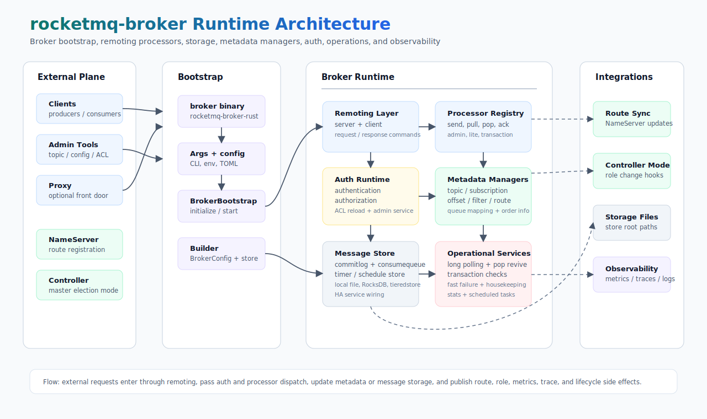

# rocketmq-broker

[English](README.md) | [简体中文](README-zh_cn.md)

Broker runtime, remoting request processors, message-store integration, and service orchestration for
[RocketMQ-Rust](../README.md).

`rocketmq-broker` is the server-side broker crate in the RocketMQ-Rust workspace. It provides the
`rocketmq-broker-rust` binary, wires the broker runtime, registers remoting processors, initializes message storage,
integrates authentication and authorization, and coordinates broker services such as offsets, subscriptions, topic
metadata, long polling, pop consumption, transaction checks, metrics, and shutdown.

## Capabilities

| Area | What it provides |
|------|------------------|
| Broker bootstrap | `rocketmq-broker-rust` binary with RocketMQ-style CLI flags, config loading, startup logging, and graceful shutdown. |
| Remoting processors | Send, pull, pop, ack, invisible-time change, notification, polling info, reply, recall, query, client management, consumer management, lite, transaction, and admin request routing. |
| Message storage | Local file store by default, optional RocksDB store support, timer/schedule message integration, HA service wiring, and tieredstore validation. |
| Metadata managers | Topic config, queue mapping, subscription group, consumer offset, consumer order, consumer filter, and route metadata managers. |
| Auth integration | Broker-level `rocketmq-auth` runtime, ACL file loading/reload, auth admin request handling, and auth metrics exposure. |
| Operations | Fast-failure queues, client housekeeping, long polling, broker stats, scheduled services, controller-mode hooks, and graceful service shutdown. |
| Observability | Optional OpenTelemetry metrics/traces/logs, Prometheus metrics exporter, broker metric labels, and auth metric gauges. |

## Architecture



The broker starts from `rocketmq-broker-rust`, resolves CLI/configuration inputs, and delegates lifecycle management to
`BrokerBootstrap`. `BrokerRuntime` then wires the remoting surface, request processors, auth runtime, metadata managers,
message store, operational services, and observability integrations into the running broker process.

The public library surface exports:

| API | Purpose |
|-----|---------|
| `Builder` | Builds a broker runtime from `BrokerConfig` and `MessageStoreConfig`. |
| `BrokerBootstrap` | Owns the lifecycle used by the binary: initialize, start, wait for signal, and shutdown. |
| `ProxyBrokerFacade` | Broker facade used by proxy-side integrations. |

## Crate Layout

| Module | Purpose |
|--------|---------|
| [`src/bin/broker_bootstrap_server.rs`](src/bin/broker_bootstrap_server.rs) | Binary entry point, CLI parsing, config loading, validation, and startup flow. |
| [`src/broker_bootstrap.rs`](src/broker_bootstrap.rs) | Lifecycle wrapper around `BrokerRuntime`. |
| [`src/broker_runtime.rs`](src/broker_runtime.rs) | Main service graph: storage, managers, processors, auth, observability, scheduled tasks, and shutdown. |
| [`src/processor.rs`](src/processor.rs) | Request processor registry, auth pre-check, fast-failure dispatch, and processor variants. |
| [`src/auth.rs`](src/auth.rs) | Broker auth admin service and ACL/user conversion helpers. |
| [`src/topic`](src/topic) | Topic config, route info, and topic queue mapping management. |
| [`src/subscription`](src/subscription) | Subscription group management and lite subscription registry. |
| [`src/offset`](src/offset) | Consumer offset, broadcast offset, and consumer order info management. |
| [`src/pop`](src/pop) | Pop consumption support and checkpoint/revive services. |
| [`src/transaction`](src/transaction) | Transactional message service, bridge, check service, and transaction metrics flushing. |
| [`src/metrics`](src/metrics) | Broker metrics constants, labels, and OpenTelemetry-backed metric manager. |

## Requirements

- Rust `1.85.0` or newer.
- `ROCKETMQ_HOME` must be set before starting the broker. If `$ROCKETMQ_HOME/conf/broker.toml` exists, it is used as
  the default config file.
- A reachable NameServer is recommended for normal broker registration. If no address is provided, the broker defaults
  to `127.0.0.1:9876`.

## Build

Build the broker binary from the workspace root:

```bash
cargo build -p rocketmq-broker --bin rocketmq-broker-rust --release
```

Use feature flags for storage and observability variants:

```bash
cargo build -p rocketmq-broker --bin rocketmq-broker-rust --release --features rocksdb_store
cargo build -p rocketmq-broker --bin rocketmq-broker-rust --release --features tieredstore
cargo build -p rocketmq-broker --bin rocketmq-broker-rust --release --features prometheus
```

## Quick Start

Start with a local NameServer and default broker configuration:

```bash
# Windows PowerShell
$env:ROCKETMQ_HOME = "D:\rocketmq"
$env:NAMESRV_ADDR = "127.0.0.1:9876"
cargo run -p rocketmq-broker --bin rocketmq-broker-rust
```

```bash
# Linux/macOS
export ROCKETMQ_HOME=/opt/rocketmq
export NAMESRV_ADDR=127.0.0.1:9876
cargo run -p rocketmq-broker --bin rocketmq-broker-rust
```

Start with an explicit config file:

```bash
cargo run -p rocketmq-broker --bin rocketmq-broker-rust -- -c ./conf/broker.toml
```

Start with one or more NameServer addresses:

```bash
cargo run -p rocketmq-broker --bin rocketmq-broker-rust -- -n 192.168.1.100:9876
cargo run -p rocketmq-broker --bin rocketmq-broker-rust -- -n "192.168.1.100:9876;192.168.1.101:9876"
```

Inspect available CLI options:

```bash
cargo run -p rocketmq-broker --bin rocketmq-broker-rust -- --help
```

## Command Line

| Flag | Purpose |
|------|---------|
| `-c, --configFile <FILE>` | Load broker and message-store config from a TOML file. |
| `-p, --printConfigItem` | Print all broker and message-store configuration items, then exit. |
| `-m, --printImportantConfig` | Print the most important runtime configuration items, then exit. |
| `-n, --namesrvAddr <ADDR>` | Override the NameServer address list. Use semicolon-separated addresses for multiple servers. |
| `-h, --help` | Print CLI help. |
| `-V, --version` | Print the binary version. |

Exit codes used by the binary:

| Code | Meaning |
|------|---------|
| `0` | Normal exit, including config-printing modes. |
| `-1` | Invalid command-line arguments. |
| `-2` | `ROCKETMQ_HOME` is not set. |
| `-3` | Configuration parsing failed. |
| `-4` | Broker configuration validation failed. |

## Configuration

Configuration is resolved in two layers:

1. Config file source: explicit `-c <FILE>`, then `$ROCKETMQ_HOME/conf/broker.toml` if it exists, then defaults.
2. NameServer override: `-n` takes precedence over `NAMESRV_ADDR`, then the config file value, then `127.0.0.1:9876`.

Minimal `broker.toml`:

```toml
namesrvAddr = "127.0.0.1:9876"
brokerIp1 = "127.0.0.1"
listenPort = 10911
storePathRootDir = "./store"
storePathCommitLog = "./store/commitlog"
enableControllerMode = false
storeType = "LocalFile"

[brokerServerConfig]
listenPort = 10911
bindAddress = "0.0.0.0"

[brokerIdentity]
brokerName = "broker-a"
brokerClusterName = "DefaultCluster"
brokerId = 0
```

Common operational fields:

| Field | Purpose |
|-------|---------|
| `namesrvAddr` | NameServer address list, using `;` as the separator. |
| `brokerIp1` / `listenPort` | Broker listen identity advertised to clients and NameServer. |
| `storePathRootDir` / `storePathCommitLog` | Message-store root and commitlog locations. |
| `storeType` | Message-store backend. `LocalFile` is the default; `RocksDB` requires the `rocksdb_store` feature. |
| `authConfigPath` / `aclFile` | Broker auth metadata path and Java-style ACL file location. |
| `authenticationEnabled` / `authorizationEnabled` | Enable broker authentication and authorization checks through `rocketmq-auth`. |
| `metricsExporterType` | Metrics exporter: `disable`, `otlp_grpc`, `prom`, or `log`. |
| `traceExporterType` / `logExporterType` | Trace/log exporters: `disable`, `otlp_grpc`, or `log`. |

Authentication example:

```toml
authConfigPath = "./store/auth"
aclFile = "./conf/plain_acl.yml"
aclFileWatchEnabled = true
authenticationEnabled = true
authorizationEnabled = true
signatureAlgorithm = "HmacSHA1"
```

Prometheus metrics example:

```toml
metricsExporterType = "prom"
metricsPromExporterHost = "127.0.0.1"
metricsPromExporterPort = 5557
metricsPromExporterPath = "/metrics"
```

Tiered storage currently requires `storeType = "LocalFile"` when the `tieredstore` feature is enabled.

## Feature Flags

| Feature | Purpose |
|---------|---------|
| `local_file_store` | Default feature; enables the local file message store path. |
| `rocksdb_store` | Enables RocksDB-backed message store and broker metadata config managers. |
| `rocksdb-store` | Compatibility alias for `rocksdb_store`. |
| `tieredstore` | Enables tieredstore integration on top of local file storage. |
| `observability` | Enables the metrics and traces observability stack. |
| `otel-metrics` | Enables OpenTelemetry metrics instrumentation. |
| `otel-traces` | Enables OpenTelemetry tracing instrumentation. |
| `otel-logs` | Enables OpenTelemetry log export support. |
| `otlp-metrics` / `otlp-traces` / `otlp-logs` | Enables OTLP exporters for the selected signal. |
| `prometheus` | Enables the Prometheus metrics endpoint. |

## Request Processing Surface

The broker runtime registers processors for the primary remoting request families:

| Processor family | Request examples |
|------------------|------------------|
| Send | `SendMessage`, `SendMessageV2`, `SendBatchMessage`, `ConsumerSendMsgBack` |
| Pull | `PullMessage`, `LitePullMessage` |
| Pop and ack | `PopMessage`, `PopLiteMessage`, `AckMessage`, `BatchAckMessage`, `ChangeMessageInvisibleTime` |
| Long polling | `Notification`, `PollingInfo` |
| Reply and recall | `SendReplyMessage`, `SendReplyMessageV2`, `RecallMessage` |
| Query | `QueryMessage`, `ViewMessageById` |
| Client and consumer management | `HeartBeat`, `UnregisterClient`, `CheckClientConfig`, offset and consumer-list requests |
| Lite mode | Broker, topic, client, group, dispatch, and lite subscription control requests |
| Transaction | `EndTransaction` |
| Admin default processor | Topic, subscription, broker config, runtime info, stats, auth user, auth ACL, and other admin requests |

Authentication and authorization checks run before request dispatch when auth is enabled.

## Validation

Useful broker-focused checks:

```bash
cargo run -p rocketmq-broker --bin rocketmq-broker-rust -- --help
cargo test -p rocketmq-broker --lib
cargo test -p rocketmq-broker --features tieredstore --lib
cargo test -p rocketmq-broker --features rocksdb_store --lib
```

Workspace-level validation from the repository root:

```bash
cargo fmt --all
cargo clippy --workspace --no-deps --all-targets --all-features -- -D warnings
```

## Benchmarks

Broker benchmarks are available for manager and service hot paths:

```bash
cargo bench -p rocketmq-broker --bench consumer_manager_benchmark
cargo bench -p rocketmq-broker --bench consumer_filter_benchmark
cargo bench -p rocketmq-broker --bench subscription_group_manager_benchmark
cargo bench -p rocketmq-broker --bench schedule_message_service_performance
cargo bench -p rocketmq-broker --bench syncunsafecell_mut
```

Use the same toolchain, feature set, and storage backend when comparing benchmark baselines.

## License

RocketMQ-Rust is licensed under the Apache License 2.0. See [../LICENSE-APACHE](../LICENSE-APACHE).
