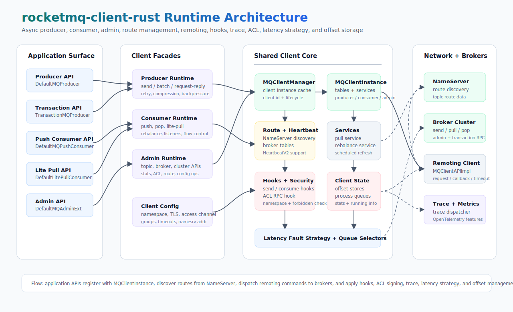

# rocketmq-client-rust

[English](README.md) | [简体中文](README-zh_cn.md)

[RocketMQ-Rust](../README-zh_cn.md) 的异步 producer、consumer、admin、路由、ACL 和 trace 支持 crate。

`rocketmq-client-rust` 是 RocketMQ-Rust 应用和服务使用的客户端 crate。它提供现代异步 producer 和 consumer API，
在可行处保持 Java 兼容的命名和行为，并支持 request-reply、事务 producer、push 与 lite-pull 消费模型、admin facade、
ACL hook、路由管理、延迟容错、消息轨迹以及面向热路径的 benchmark。

## 能力边界

| 领域 | 提供能力 |
|------|----------|
| Producer | `DefaultMQProducer`，支持同步发送、callback 发送、oneway 发送、队列选择、批量发送、自动批量、request-reply、recall、重试、压缩和异步 backpressure 控制。 |
| 事务消息 | `TransactionMQProducer`，支持 `TransactionListener`、本地事务执行、broker checkback 和事务发送结果。 |
| Push Consumer | `DefaultMQPushConsumer`，支持并发/顺序 listener、订阅过滤、rebalance strategy、集群/广播模型、offset store 和 consume hook。 |
| Lite Pull Consumer | `DefaultLitePullConsumer`，支持显式 `poll`、zero-copy polling、手动分配、pause/resume、seek、commit、broker offset 查询、自动提交和队列变更 listener。 |
| Admin API | `DefaultMQAdminExt` 及相关 trait，用于 topic、broker、cluster、route、stats、consumer、producer 和 auth 相关管理操作。 |
| 路由与容错 | NameServer 路由发现、client instance 管理、heartbeat、broker latency detection、队列 selector 和分配策略。 |
| 安全与租户 | ACL RPC hook、session credentials、TLS 开关、namespace 支持、access-channel 配置和 Java 风格 client config 字段。 |
| 可观测性 | 可选 trace dispatcher、OpenTelemetry trace feature、OpenTelemetry metrics feature 和 OTLP trace exporter 集成。 |

## 架构



应用侧通过 producer、consumer、lite-pull、transaction 和 admin facade 使用客户端能力。这些 facade 共享
`MQClientInstance`，由它围绕 broker remoting 路径统一管理 client 注册、路由刷新、heartbeat、pull/rebalance 服务、
`MQClientAPIImpl`、hook、ACL 签名、trace dispatch、latency fault strategy 和 offset store。

该 crate 为常见概念保留 Java 风格命名，同时通过 Rust async API 和 `rocketmq_error::RocketMQResult` 暴露类型化错误。

## Crate 结构

| 模块 | 职责 |
|------|------|
| [`src/producer.rs`](src/producer.rs) | Producer facade、事务 producer、selector、callback、send result 和 batching 内部实现。 |
| [`src/consumer.rs`](src/consumer.rs) | Push consumer、lite pull consumer、listener、rebalance strategy、offset、pop/pull result 和 callback。 |
| [`src/admin.rs`](src/admin.rs) | Admin extension facade 和异步 admin trait。 |
| [`src/base`](src/base) | 共享 client 配置、validator、query result model 和 admin trait。 |
| [`src/factory`](src/factory) | `MQClientInstance` 生命周期、路由刷新、heartbeat、producer/consumer 注册和 broker 连接。 |
| [`src/implementation`](src/implementation) | 面向 remoting command 的底层 client API 实现。 |
| [`src/common`](src/common) | ACL 工具、session credentials、NameServer access config 和 admin result 辅助能力。 |
| [`src/hook`](src/hook) | Send、consume、end-transaction、namespace 和 forbidden-check hook context。 |
| [`src/latency`](src/latency) | Broker latency fault strategy 和 service detector 抽象。 |
| [`src/trace`](src/trace) | 异步 trace dispatcher、trace hook、trace model 和 trace 编码。 |
| [`src/legacy.rs`](src/legacy.rs) | 已废弃 Java 时代 API 的兼容 shim，并给出明确替代建议。 |

## 环境要求

- Rust `1.85.0` 或更新版本。
- 真实 producer、consumer 和 admin 流量需要可访问的 RocketMQ NameServer。
- 除非通过 admin API 创建 topic，否则 broker 侧需要提前准备目标 topic。

## 安装

在当前 workspace 内使用：

```toml
[dependencies]
rocketmq-client-rust = { path = "../rocketmq-client" }
```

外部项目使用：

```toml
[dependencies]
rocketmq-client-rust = "1.0.0"
```

可选可观测性 feature：

```toml
[dependencies]
rocketmq-client-rust = { version = "1.0.0", features = ["observability", "otlp-traces"] }
```

## 快速开始

### Producer

```rust
use rocketmq_client_rust::producer::default_mq_producer::DefaultMQProducer;
use rocketmq_common::common::message::message_single::Message;
use rocketmq_error::RocketMQResult;
use rocketmq_rust::rocketmq;

#[rocketmq::main]
async fn main() -> RocketMQResult<()> {
    rocketmq_common::log::init_logger()?;

    let mut producer = DefaultMQProducer::builder()
        .producer_group("example_producer_group")
        .name_server_addr("127.0.0.1:9876")
        .build();

    producer.start().await?;

    let message = Message::builder()
        .topic("TopicTest")
        .tags("TagA")
        .body_slice(b"Hello RocketMQ")
        .build_unchecked();

    let result = producer.send_with_timeout(message, 2000).await?;
    println!("send result: {:?}", result);

    producer.shutdown().await;
    Ok(())
}
```

### Push Consumer

```rust
use rocketmq_client_rust::consumer::default_mq_push_consumer::DefaultMQPushConsumer;
use rocketmq_client_rust::consumer::listener::consume_concurrently_context::ConsumeConcurrentlyContext;
use rocketmq_client_rust::consumer::listener::consume_concurrently_status::ConsumeConcurrentlyStatus;
use rocketmq_client_rust::consumer::listener::message_listener_concurrently::MessageListenerConcurrently;
use rocketmq_client_rust::consumer::mq_push_consumer::MQPushConsumer;
use rocketmq_common::common::message::message_ext::MessageExt;
use rocketmq_error::RocketMQResult;
use rocketmq_rust::rocketmq;

#[rocketmq::main]
async fn main() -> RocketMQResult<()> {
    rocketmq_common::log::init_logger()?;

    let mut consumer = DefaultMQPushConsumer::builder()
        .consumer_group("example_consumer_group")
        .name_server_addr("127.0.0.1:9876")
        .build();

    consumer.subscribe("TopicTest", "*").await?;
    consumer.register_message_listener_concurrently(PrintListener);
    consumer.start().await?;

    let _ = tokio::signal::ctrl_c().await;
    consumer.shutdown().await;
    Ok(())
}

struct PrintListener;

impl MessageListenerConcurrently for PrintListener {
    fn consume_message(
        &self,
        messages: &[&MessageExt],
        _context: &ConsumeConcurrentlyContext,
    ) -> RocketMQResult<ConsumeConcurrentlyStatus> {
        for message in messages {
            println!("received: {:?}", message);
        }
        Ok(ConsumeConcurrentlyStatus::ConsumeSuccess)
    }
}
```

## 常用用法

### 批量 Producer

```rust
use rocketmq_client_rust::producer::default_mq_producer::DefaultMQProducer;
use rocketmq_common::common::message::message_single::Message;

let mut producer = DefaultMQProducer::builder()
    .producer_group("batch_producer_group")
    .name_server_addr("127.0.0.1:9876")
    .build();

producer.start().await?;

let messages = vec![
    Message::builder().topic("TopicTest").tags("TagA").body_slice(b"batch-0").build_unchecked(),
    Message::builder().topic("TopicTest").tags("TagA").body_slice(b"batch-1").build_unchecked(),
];

let result = producer.send_batch(messages).await?;
println!("batch result: {:?}", result);
```

### 事务 Producer

```rust
use std::any::Any;
use rocketmq_client_rust::producer::local_transaction_state::LocalTransactionState;
use rocketmq_client_rust::producer::transaction_listener::TransactionListener;
use rocketmq_client_rust::producer::transaction_mq_producer::TransactionMQProducer;
use rocketmq_common::common::message::message_ext::MessageExt;
use rocketmq_common::common::message::message_single::Message;
use rocketmq_common::common::message::MessageTrait;

struct TxListener;

impl TransactionListener for TxListener {
    fn execute_local_transaction(
        &self,
        _msg: &dyn MessageTrait,
        _arg: Option<&(dyn Any + Send + Sync)>,
    ) -> LocalTransactionState {
        LocalTransactionState::CommitMessage
    }

    fn check_local_transaction(&self, _msg: &MessageExt) -> LocalTransactionState {
        LocalTransactionState::CommitMessage
    }
}

let mut producer = TransactionMQProducer::builder()
    .producer_group("transaction_producer_group")
    .name_server_addr("127.0.0.1:9876")
    .transaction_listener(TxListener)
    .build();

producer.start().await?;

let message = Message::builder()
    .topic("TransactionTopic")
    .tags("TagA")
    .body_slice(b"transaction message")
    .build_unchecked();

let result = producer.send_message_in_transaction::<(), _>(message, None).await?;
println!("transaction result: {}", result);
```

### Lite Pull Consumer

```rust
use rocketmq_client_rust::consumer::default_lite_pull_consumer::DefaultLitePullConsumer;
use rocketmq_client_rust::consumer::lite_pull_consumer::LitePullConsumer;

let consumer = DefaultLitePullConsumer::builder()
    .consumer_group("lite_pull_group")
    .name_server_addr("127.0.0.1:9876")
    .pull_batch_size(32)
    .auto_commit(true)
    .build()?;

consumer.start().await?;
consumer.subscribe("TopicTest").await?;

let messages = consumer.poll_zero_copy().await;
for message in &messages {
    println!("message body: {:?}", message.get_body());
}

consumer.shutdown().await;
```

消息只在 poll 作用域内处理时，优先使用 `poll_zero_copy()` 或 `poll_with_timeout_zero_copy()`。需要把 owned
`MessageExt` 保存到作用域之外时，使用 `poll()` 或 `poll_with_timeout()`。

### ACL Hook

```rust
use rocketmq_client_rust::AclClientRPCHook;
use rocketmq_client_rust::SessionCredentials;
use rocketmq_client_rust::producer::default_mq_producer::DefaultMQProducer;
use std::sync::Arc;

let credentials = SessionCredentials::with_token("access-key", "secret-key", "security-token");
let rpc_hook = Arc::new(AclClientRPCHook::new(credentials));

let producer = DefaultMQProducer::builder()
    .producer_group("acl_producer_group")
    .name_server_addr("127.0.0.1:9876")
    .rpc_hook(rpc_hook)
    .build();
```

## 示例

在 workspace 根目录运行示例：

```bash
cargo run -p rocketmq-client-rust --example producer
cargo run -p rocketmq-client-rust --example consumer
cargo run -p rocketmq-client-rust --example simple-producer
cargo run -p rocketmq-client-rust --example simple-batch-producer
cargo run -p rocketmq-client-rust --example callback-batch-producer
cargo run -p rocketmq-client-rust --example request-producer
cargo run -p rocketmq-client-rust --example request-callback-producer
cargo run -p rocketmq-client-rust --example transaction-producer
cargo run -p rocketmq-client-rust --example broadcast-consumer
cargo run -p rocketmq-client-rust --example pop-consumer
```

顺序消息示例：

```bash
cargo run -p rocketmq-client-rust --example ordermessage-producer
cargo run -p rocketmq-client-rust --example ordermessage-consumer
cargo run -p rocketmq-client-rust --example hash-selector-producer
cargo run -p rocketmq-client-rust --example random-selector-producer
```

声明过的示例文件位于 [`examples`](examples)。

## Feature Flags

| Feature | 用途 |
|---------|------|
| `observability` | 通过 `rocketmq-observability/otel-traces` 启用客户端 trace 集成。 |
| `observability-metrics` | 通过 `rocketmq-observability/otel-metrics` 启用客户端 metrics 集成。 |
| `otlp-traces` | 组合 `observability` 和 `rocketmq-observability/otlp-traces`，启用 OTLP trace exporter。 |

## 校验

Client 相关常用校验：

```bash
cargo test -p rocketmq-client-rust --lib
cargo test -p rocketmq-client-rust --test public_api_exports_test
cargo test -p rocketmq-client-rust --examples --no-run
```

工作区级校验在仓库根目录运行：

```bash
cargo fmt --all
cargo clippy --workspace --no-deps --all-targets --all-features -- -D warnings
```

## Benchmarks

Client 热路径 benchmark：

```bash
cargo bench -p rocketmq-client-rust --bench client_hot_path_benchmark
cargo bench -p rocketmq-client-rust --bench produce_accumulator_benchmark
cargo bench -p rocketmq-client-rust --bench concurrent_optimization_benchmark
cargo bench -p rocketmq-client-rust --bench oneway_benchmark
cargo bench -p rocketmq-client-rust --bench select_queue_benchmark
cargo bench -p rocketmq-client-rust --bench message_util_bench
cargo bench -p rocketmq-client-rust --bench thread_local_index_bench
```

对比 benchmark baseline 时，应保持相同 toolchain、feature set、broker topology 和 NameServer route setup。

## 许可证

RocketMQ-Rust 使用 Apache License 2.0。详见 [../LICENSE-APACHE](../LICENSE-APACHE)。
