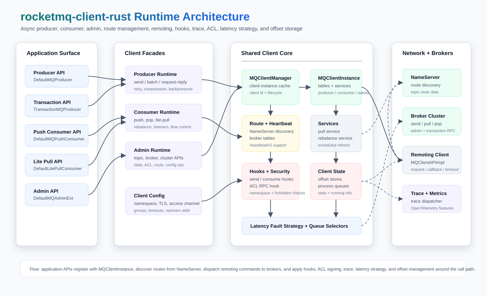

# rocketmq-client-rust

> Runtime ownership: `client_runtime` in the examples is an application-owned `Arc<ClientRuntime>` created from a `RuntimeOwner` child scope and shut down at the process boundary.

[English](README.md) | [简体中文](README-zh_cn.md)

Async producer, consumer, admin, routing, ACL, and trace support for [RocketMQ-Rust](../README.md).

`rocketmq-client-rust` is the client crate used by RocketMQ-Rust applications and services. It provides modern async
producer and consumer APIs, Java-compatible naming and behavior where practical, request-reply and transaction producer
support, push and lite-pull consumption models, admin facades, ACL hooks, route management, latency fault tolerance,
message tracing, and focused hot-path benchmarks.

## Capabilities

| Area | What it provides |
|------|------------------|
| Producers | `DefaultMQProducer` with sync send, callback send, oneway send, queue selection, batch send, auto batching, request-reply, recall, retry, compression, and async backpressure controls. |
| Transaction messages | `TransactionMQProducer` with `TransactionListener`, local transaction execution, broker checkback handling, and transaction send results. |
| Push consumers | `DefaultMQPushConsumer` with concurrent and orderly listeners, subscription filters, rebalance strategies, clustering/broadcasting models, offset stores, and consume hooks. |
| Lite pull consumers | `DefaultLitePullConsumer` with explicit `poll`, zero-copy polling, manual assignment, pause/resume, seek, commit, broker offset queries, auto-commit, and queue-change listeners. |
| Admin APIs | `DefaultMQAdminExt` and related traits for topic, broker, cluster, route, stats, consumer, producer, and auth-oriented admin operations. |
| Routing and fault tolerance | NameServer route discovery, client instance management, heartbeat, broker latency detection, queue selectors, and allocation strategies. |
| Security and tenancy | ACL RPC hook, session credentials, TLS toggle, namespace support, access-channel configuration, and Java-style client config fields. |
| Observability | Optional trace dispatcher support, OpenTelemetry trace feature, OpenTelemetry metrics feature, and OTLP trace exporter integration. |

## Architecture



Applications use producer, consumer, lite-pull, transaction, and admin facades. Those facades share `MQClientInstance`,
which owns client registration, route refresh, heartbeats, pull/rebalance services, `MQClientAPIImpl`, hooks, ACL
signing, trace dispatch, latency fault strategy, and offset stores around the broker remoting path.

The crate keeps Java-facing names for common concepts while exposing Rust async APIs and typed errors through
`rocketmq_error::RocketMQResult`.

## Crate Layout

| Module | Purpose |
|--------|---------|
| [`src/producer.rs`](src/producer.rs) | Producer facades, transaction producer, selectors, callbacks, send results, and batching internals. |
| [`src/consumer.rs`](src/consumer.rs) | Push consumer, lite pull consumer, listeners, rebalance strategies, offsets, pop/pull results, and callbacks. |
| [`src/admin.rs`](src/admin.rs) | Admin extension facades and async admin traits. |
| [`src/base`](src/base) | Shared client configuration, validators, query result models, and admin traits. |
| [`src/factory`](src/factory) | `MQClientInstance` lifecycle, route refresh, heartbeat, producer/consumer registration, and broker connectivity. |
| [`src/implementation`](src/implementation) | Low-level client API implementation for remoting commands. |
| [`src/common`](src/common) | ACL utilities, session credentials, NameServer access config, and admin result helpers. |
| [`src/hook`](src/hook) | Send, consume, end-transaction, namespace, and forbidden-check hook contexts. |
| [`src/latency`](src/latency) | Broker latency fault strategy and service detector abstractions. |
| [`src/trace`](src/trace) | Async trace dispatcher, trace hooks, trace models, and trace encoding. |
| [`src/legacy.rs`](src/legacy.rs) | Compatibility shims for deprecated Java-era APIs with explicit replacement guidance. |

## Requirements

- Stable Rust `1.95.0`, using the pinned repository toolchain.
- A reachable RocketMQ NameServer for real producer, consumer, and admin traffic.
- A broker with the target topics configured, unless your scenario creates topics through admin APIs.

## Installation

Inside this workspace:

```toml
[dependencies]
rocketmq-client-rust = { path = "../rocketmq-client" }
```

For external consumers:

```toml
[dependencies]
rocketmq-client-rust = "1.0.0"
```

Optional observability features:

```toml
[dependencies]
rocketmq-client-rust = { version = "1.0.0", features = ["observability", "otlp-traces"] }
```

## Quick Start

### Producer

```rust
use rocketmq_client_rust::producer::default_mq_producer::DefaultMQProducer;
use rocketmq_common::common::message::message_single::Message;
use rocketmq_error::RocketMQResult;
use rocketmq_rust::rocketmq;

#[rocketmq::main]
async fn main() -> RocketMQResult<()> {
    rocketmq_common::log::init_logger()?;

    let mut producer = DefaultMQProducer::builder(client_runtime.clone())
        .producer_group("example_producer_group")
        .name_server_addr("127.0.0.1:9876")
        .build();

    producer.start().await?;

    let message = Message::builder()
        .topic("TopicTest")
        .tags("TagA")
        .body_slice(b"Hello RocketMQ")
        .build_unchecked();

    let result = producer.send_with_timeout(message, 2000).await?;
    println!("send result: {:?}", result);

    producer.shutdown().await;
    Ok(())
}
```

### Push Consumer

```rust
use rocketmq_client_rust::consumer::default_mq_push_consumer::DefaultMQPushConsumer;
use rocketmq_client_rust::consumer::listener::consume_concurrently_context::ConsumeConcurrentlyContext;
use rocketmq_client_rust::consumer::listener::consume_concurrently_status::ConsumeConcurrentlyStatus;
use rocketmq_client_rust::consumer::listener::message_listener_concurrently::MessageListenerConcurrently;
use rocketmq_client_rust::consumer::mq_push_consumer::MQPushConsumer;
use rocketmq_common::common::message::message_ext::MessageExt;
use rocketmq_error::RocketMQResult;
use rocketmq_rust::rocketmq;

#[rocketmq::main]
async fn main() -> RocketMQResult<()> {
    rocketmq_common::log::init_logger()?;

    let mut consumer = DefaultMQPushConsumer::builder(client_runtime.clone())
        .consumer_group("example_consumer_group")
        .name_server_addr("127.0.0.1:9876")
        .build();

    consumer.subscribe("TopicTest", "*").await?;
    consumer.register_message_listener_concurrently(PrintListener);
    consumer.start().await?;

    let _ = tokio::signal::ctrl_c().await;
    consumer.shutdown().await;
    Ok(())
}

struct PrintListener;

impl MessageListenerConcurrently for PrintListener {
    fn consume_message(
        &self,
        messages: &[&MessageExt],
        _context: &ConsumeConcurrentlyContext,
    ) -> RocketMQResult<ConsumeConcurrentlyStatus> {
        for message in messages {
            println!("received: {:?}", message);
        }
        Ok(ConsumeConcurrentlyStatus::ConsumeSuccess)
    }
}
```

## Common Usage

### Batch Producer

```rust
use rocketmq_client_rust::producer::default_mq_producer::DefaultMQProducer;
use rocketmq_common::common::message::message_single::Message;

let mut producer = DefaultMQProducer::builder(client_runtime.clone())
    .producer_group("batch_producer_group")
    .name_server_addr("127.0.0.1:9876")
    .build();

producer.start().await?;

let messages = vec![
    Message::builder().topic("TopicTest").tags("TagA").body_slice(b"batch-0").build_unchecked(),
    Message::builder().topic("TopicTest").tags("TagA").body_slice(b"batch-1").build_unchecked(),
];

let result = producer.send_batch(messages).await?;
println!("batch result: {:?}", result);
```

### Transaction Producer

```rust
use std::any::Any;
use rocketmq_client_rust::producer::local_transaction_state::LocalTransactionState;
use rocketmq_client_rust::producer::transaction_listener::TransactionListener;
use rocketmq_client_rust::producer::transaction_mq_producer::TransactionMQProducer;
use rocketmq_common::common::message::message_ext::MessageExt;
use rocketmq_common::common::message::message_single::Message;
use rocketmq_common::common::message::MessageTrait;

struct TxListener;

impl TransactionListener for TxListener {
    fn execute_local_transaction(
        &self,
        _msg: &dyn MessageTrait,
        _arg: Option<&(dyn Any + Send + Sync)>,
    ) -> LocalTransactionState {
        LocalTransactionState::CommitMessage
    }

    fn check_local_transaction(&self, _msg: &MessageExt) -> LocalTransactionState {
        LocalTransactionState::CommitMessage
    }
}

let mut producer = TransactionMQProducer::builder(client_runtime.clone())
    .producer_group("transaction_producer_group")
    .name_server_addr("127.0.0.1:9876")
    .transaction_listener(TxListener)
    .build();

producer.start().await?;

let message = Message::builder()
    .topic("TransactionTopic")
    .tags("TagA")
    .body_slice(b"transaction message")
    .build_unchecked();

let result = producer.send_message_in_transaction::<(), _>(message, None).await?;
println!("transaction result: {}", result);
```

### Lite Pull Consumer

```rust
use rocketmq_client_rust::consumer::default_lite_pull_consumer::DefaultLitePullConsumer;
use rocketmq_client_rust::consumer::lite_pull_consumer::LitePullConsumer;

let consumer = DefaultLitePullConsumer::builder(client_runtime.clone())
    .consumer_group("lite_pull_group")
    .name_server_addr("127.0.0.1:9876")
    .pull_batch_size(32)
    .auto_commit(true)
    .build()?;

consumer.start().await?;
consumer.subscribe("TopicTest").await?;

let messages = consumer.poll_zero_copy().await;
for message in &messages {
    println!("message body: {:?}", message.get_body());
}

consumer.shutdown().await;
```

Use `poll_zero_copy()` or `poll_with_timeout_zero_copy()` when messages are processed within the poll scope. Use
`poll()` or `poll_with_timeout()` when owned `MessageExt` values must be stored beyond that scope.

### ACL Hook

```rust
use rocketmq_client_rust::AclClientRPCHook;
use rocketmq_client_rust::SessionCredentials;
use rocketmq_client_rust::producer::default_mq_producer::DefaultMQProducer;
use std::sync::Arc;

let credentials = SessionCredentials::with_token("access-key", "secret-key", "security-token");
let rpc_hook = Arc::new(AclClientRPCHook::new(credentials));

let producer = DefaultMQProducer::builder(client_runtime.clone())
    .producer_group("acl_producer_group")
    .name_server_addr("127.0.0.1:9876")
    .rpc_hook(rpc_hook)
    .build();
```

## Examples

Run examples from the workspace root:

```bash
cargo run -p rocketmq-client-rust --example producer
cargo run -p rocketmq-client-rust --example consumer
cargo run -p rocketmq-client-rust --example simple-producer
cargo run -p rocketmq-client-rust --example simple-batch-producer
cargo run -p rocketmq-client-rust --example callback-batch-producer
cargo run -p rocketmq-client-rust --example request-producer
cargo run -p rocketmq-client-rust --example request-callback-producer
cargo run -p rocketmq-client-rust --example transaction-producer
cargo run -p rocketmq-client-rust --example broadcast-consumer
cargo run -p rocketmq-client-rust --example pop-consumer
```

Order-message examples:

```bash
cargo run -p rocketmq-client-rust --example ordermessage-producer
cargo run -p rocketmq-client-rust --example ordermessage-consumer
cargo run -p rocketmq-client-rust --example hash-selector-producer
cargo run -p rocketmq-client-rust --example random-selector-producer
```

The declared examples are backed by files under [`examples`](examples).

## Feature Flags

| Feature | Purpose |
|---------|---------|
| `observability` | Enables client trace integration through `rocketmq-observability/otel-traces`. |
| `observability-metrics` | Enables client metrics integration through `rocketmq-observability/otel-metrics`. |
| `otlp-traces` | Enables OTLP trace export by combining `observability` with `rocketmq-observability/otlp-traces`. |

## Validation

Client-focused validation:

```bash
cargo test -p rocketmq-client-rust --lib
cargo test -p rocketmq-client-rust --test public_api_exports_test
cargo test -p rocketmq-client-rust --examples --no-run
```

Workspace-level validation from the repository root:

```bash
cargo fmt --all
cargo clippy --workspace --no-deps --all-targets --all-features -- -D warnings
```

## Benchmarks

Client hot-path benchmarks:

```bash
cargo bench -p rocketmq-client-rust --bench client_hot_path_benchmark
cargo bench -p rocketmq-client-rust --bench produce_accumulator_benchmark
cargo bench -p rocketmq-client-rust --bench concurrent_optimization_benchmark
cargo bench -p rocketmq-client-rust --bench oneway_benchmark
cargo bench -p rocketmq-client-rust --bench select_queue_benchmark
cargo bench -p rocketmq-client-rust --bench message_util_bench
cargo bench -p rocketmq-client-rust --bench thread_local_index_bench
```

Keep benchmark comparisons on the same toolchain, feature set, broker topology, and NameServer route setup.

## License

RocketMQ-Rust is licensed under the Apache License 2.0. See [../LICENSE-APACHE](../LICENSE-APACHE).
