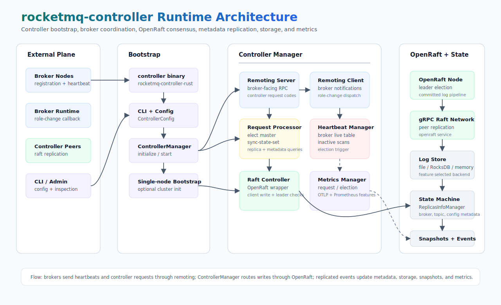

# rocketmq-controller

[English](README.md) | [简体中文](README-zh_cn.md)

High-availability controller, broker metadata coordinator, and OpenRaft-based election service for
[RocketMQ-Rust](../README.md).

`rocketmq-controller` provides the controller runtime used by RocketMQ-Rust clusters. It owns controller bootstrap,
OpenRaft consensus, broker heartbeat tracking, master election, replica metadata, controller request processing,
persistent controller state, and optional metrics integration.

The crate exposes both a library API and the `rocketmq-controller-rust` binary.

## Capabilities

| Area | What it provides |
|------|------------------|
| Controller bootstrap | `rocketmq-controller-rust` binary, CLI parsing, configuration loading, startup logging, remoting version setup, single-node bootstrap, and graceful shutdown. |
| Raft coordination | OpenRaft integration, gRPC raft transport, log store, state machine, cluster initialization, leader checks, and replicated controller events. |
| Broker coordination | Broker registration, heartbeats, inactive broker scanning, master election, sync-state-set management, broker ID allocation, broker cleanup, and role-change notifications. |
| Metadata management | Broker replica metadata, topic/config metadata, controller metadata queries, sync-state snapshots, and Java-compatible controller response models. |
| Request processing | Broker-facing remoting request processor for controller request codes such as elect-master, alter-sync-state-set, get-replica-info, broker heartbeat, and register broker. |
| Storage | Memory backend for tests, file backend enabled by default, and optional RocksDB backend through the `storage-rocksdb` feature. |
| Observability | Controller metrics manager, request/election/DLedger-style counters and latencies, plus optional OpenTelemetry, OTLP, and Prometheus exporters. |

## Architecture



The controller starts from `rocketmq-controller-rust`, loads `ControllerConfig`, and builds `ControllerManager`.
`ControllerManager` owns broker-facing remoting, request processing, heartbeat tracking, role-change notifications,
OpenRaft-backed state replication, storage, snapshots, and optional metrics exporters.

The binary requires a non-empty `rocketmqHome` value after configuration loading. For normal runs, set
`ROCKETMQ_HOME` or provide `rocketmqHome` in the controller config file.

## Crate Layout

| Path | Purpose |
|------|---------|
| [`src/bin/controller_bootstrap.rs`](src/bin/controller_bootstrap.rs) | Binary entry point, logger setup, CLI/config loading, manager lifecycle, single-node bootstrap, and shutdown signal handling. |
| [`src/cli.rs`](src/cli.rs) | Clap-based CLI model and config-file loading through `rocketmq-common`'s config parser. |
| [`src/config.rs`](src/config.rs) | Re-exports the shared `ControllerConfig`, `RaftPeer`, and `StorageBackendType` from `rocketmq-common`. |
| [`src/controller`](src/controller) | Controller trait implementations, `ControllerManager`, OpenRaft controller wrapper, heartbeat manager, and housekeeping service. |
| [`src/openraft`](src/openraft) | OpenRaft node manager, gRPC network, log store, state machine, storage bridge, and generated raft service glue. |
| [`src/processor`](src/processor) | Controller request processor and domain processors for broker, topic, and metadata operations. |
| [`src/manager`](src/manager) | Replica information manager, broker replica metadata, and sync-state models. |
| [`src/metadata`](src/metadata) | Broker, topic, config, and replica metadata stores. |
| [`src/heartbeat`](src/heartbeat) | Broker identity, live-info tracking, and default heartbeat manager. |
| [`src/event`](src/event) | Replicated controller event models and event serialization. |
| [`src/storage`](src/storage) | Storage backend abstraction, default file backend, optional RocksDB backend, and in-memory backend for tests. |
| [`src/metrics`](src/metrics) | Controller metric constants, request/election status enums, and metrics manager. |
| [`proto`](proto) | gRPC protobuf definitions for controller and OpenRaft RPCs. |
| [`examples`](examples) | Runnable examples for single-node raft, three-node raft, manager usage, metrics, and CLI parsing. |
| [`tests`](tests) | Integration and contract tests for raft, snapshots, multi-node setup, request processor behavior, and metrics. |

## Requirements

- Rust `1.85.0` or newer is the workspace minimum.
- Build this crate with the repository toolchain from [`../rust-toolchain.toml`](../rust-toolchain.toml). The crate
  currently enables a nightly Rust feature.
- `ROCKETMQ_HOME` or `rocketmqHome` must be set before starting the controller binary.
- Use `storageBackend = "File"` with the default feature set. Use `storageBackend = "RocksDB"` only when building with
  `storage-rocksdb`.

## Build

Build the controller binary from the workspace root:

```bash
cargo build -p rocketmq-controller --bin rocketmq-controller-rust --release
```

Build with optional storage or metrics features:

```bash
cargo build -p rocketmq-controller --bin rocketmq-controller-rust --release --features storage-rocksdb
cargo build -p rocketmq-controller --bin rocketmq-controller-rust --release --features metrics
cargo build -p rocketmq-controller --bin rocketmq-controller-rust --release --features metrics-otlp
cargo build -p rocketmq-controller --bin rocketmq-controller-rust --release --features metrics-prometheus
```

## Configuration

The CLI loads TOML, JSON, YAML, and other formats supported by the `config` crate. Current file loading deserializes
directly into `ControllerConfig`, so a config file should provide the full set of required fields instead of relying on
partial overrides.

Use camelCase field names:

```toml
rocketmqHome = "/opt/rocketmq"
configStorePath = "/opt/rocketmq/controller/controller.properties"
controllerType = "Raft"
scanNotActiveBrokerInterval = 5000
controllerThreadPoolNums = 16
controllerRequestThreadPoolQueueCapacity = 50000
mappedFileSize = 1073741824
controllerStorePath = ""
electMasterMaxRetryCount = 3
enableElectUncleanMaster = false
isProcessReadEvent = false
notifyBrokerRoleChanged = true
scanInactiveMasterInterval = 5000
raftScanWaitTimeoutMs = 1000
metricsExporterType = "disable"
metricsGrpcExporterTarget = ""
metricsGrpcExporterHeader = ""
metricGrpcExporterTimeOutInMills = 3000
metricGrpcExporterIntervalInMills = 60000
metricLoggingExporterIntervalInMills = 10000
metricsPromExporterPort = 5557
metricsPromExporterHost = ""
metricsLabel = ""
metricsInDelta = false
configBlackList = "configBlackList;configStorePath"

nodeId = 1
listenAddr = "127.0.0.1:60109"
controllerPeers = []
electionTimeoutMs = 1000
heartbeatIntervalMs = 300
storagePath = "/opt/rocketmq/controller/node-1"
storageBackend = "File"
enableElectUncleanMasterLocal = false

[[raftPeers]]
id = 1
addr = "127.0.0.1:60110"
```

For a multi-node controller cluster, each node should use its own `nodeId`, `listenAddr`, and `storagePath`, while all
nodes share the same `raftPeers` list. `listenAddr` is the broker-facing remoting endpoint; each `raftPeers.addr` is the
advertised OpenRaft gRPC endpoint and therefore must use a separate port.

When the advertised Raft address is not bindable on the Pod or host, set
`ROCKETMQ_CONTROLLER_RAFT_BIND_ADDR=<local-ip>:<raft-port>` (for example, `0.0.0.0:60110`). The advertised address remains
the matching `raftPeers.addr`; the override changes only the local listener. Invalid socket-address values fail startup.

A single-member configuration retains automatic bootstrap. Multi-member bootstrap is disabled unless
`ROCKETMQ_CONTROLLER_AUTO_INITIALIZE_CLUSTER=true` (or `1`) is set. With that explicit opt-in, only the lowest configured
node ID initializes the full membership, and existing committed state is never reinitialized. Operators must still
verify that a leader and quorum formed; configuration and replica count alone are not quorum evidence.

## Quick Start

Start a single-node controller with a config file:

```bash
# Linux/macOS
export ROCKETMQ_HOME=/opt/rocketmq
cargo run -p rocketmq-controller --bin rocketmq-controller-rust -- -c ./controller-node1.toml
```

```powershell
# Windows PowerShell
$env:ROCKETMQ_HOME = "C:\rocketmq"
cargo run -p rocketmq-controller --bin rocketmq-controller-rust -- -c .\controller-node1.toml
```

Inspect CLI options:

```bash
cargo run -p rocketmq-controller --bin rocketmq-controller-rust -- --help
```

Run the single-node OpenRaft example:

```bash
cargo run -p rocketmq-controller --example single_node
```

Run a three-node OpenRaft example in separate terminals:

```bash
cargo run -p rocketmq-controller --example three_node_cluster -- --node-id 1 --init
cargo run -p rocketmq-controller --example three_node_cluster -- --node-id 2
cargo run -p rocketmq-controller --example three_node_cluster -- --node-id 3
```

## Library Usage

Create and manage a controller directly from Rust:

```rust
use rocketmq_controller::config::{ControllerConfig, RaftPeer};
use rocketmq_controller::manager::ControllerManager;
use rocketmq_error::Result;
use rocketmq_rust::ArcMut;

#[tokio::main]
async fn main() -> Result<()> {
    let listen_addr = "127.0.0.1:9878".parse().unwrap();
    let config = ControllerConfig::new_node(1, listen_addr)
        .with_raft_peers(vec![RaftPeer {
            id: 1,
            addr: listen_addr,
        }])
        .with_storage_path("/tmp/rocketmq-controller/node-1");

    let manager = ArcMut::new(ControllerManager::new(config).await?);
    if !manager.clone().initialize().await? {
        return Err(rocketmq_controller::error::ControllerError::InitializationFailed.into());
    }

    manager.clone().start().await?;
    manager.shutdown().await?;
    Ok(())
}
```

## Feature Flags

| Feature | Default | Purpose |
|---------|---------|---------|
| `storage-file` | Yes | Enables the file-based controller storage backend. |
| `storage-rocksdb` | No | Enables the RocksDB storage backend for `storageBackend = "RocksDB"`. |
| `metrics` | No | Enables controller metrics integration through `rocketmq-observability`. |
| `metrics-otlp` | No | Enables OTLP metrics export support. |
| `metrics-prometheus` | No | Enables Prometheus metrics export support. |
| `debug` | No | Reserved debug feature flag for controller builds. |

## Examples

```bash
cargo run -p rocketmq-controller --example single_node
cargo run -p rocketmq-controller --example three_node_cluster -- --node-id 1 --init
cargo run -p rocketmq-controller --example controller_manager_basic
cargo run -p rocketmq-controller --example controller_manager_cluster
cargo run -p rocketmq-controller --example controller_metrics_example
cargo run -p rocketmq-controller --example cli_usage -- -c ./controller-node1.toml -p
```

## Validation

Focused checks for this crate:

```bash
cargo test -p rocketmq-controller --lib
cargo test -p rocketmq-controller --tests --no-run
cargo test -p rocketmq-controller --examples --no-run
```

Workspace-level Rust validation is required from the repository root when Rust code changes:

```bash
cargo fmt --all
cargo clippy --workspace --no-deps --all-targets --all-features -- -D warnings
```

## Benchmarks

```bash
cargo bench -p rocketmq-controller --bench controller_bench
```

## License

Licensed under the [Apache License, Version 2.0](../LICENSE-APACHE).
