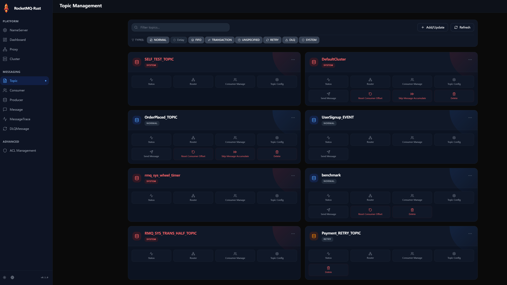

  # RocketMQ-Rust Dashboard (Tauri)

A RocketMQ-Rust Dashboard GUI implemented with [Tauri](https://tauri.app/).

## Features

- Native desktop application with web-based UI
- Cross-platform support (Linux, macOS, Windows)
- Backend written in Rust
- Frontend built with modern web technologies:
  - **React** - UI Library
  - **Vite** - Build Tool
  - **Tailwind CSS** & **Radix UI** - Styling and UI Components
  - **Recharts** - Data Visualization
- Small bundle size and low resource usage
- Secure with minimal attack surface

## UI Preview & Feature Status



> **Note**: The features shown in the sidebar menu are currently under development.

## Feature Development Roadmap

| Category | Feature | Status |
|----------|---------|--------|
| **Platform** | NameServer | 🚧 In Development |
| | Dashboard | 🚧 In Development |
| | Proxy | 🚧 In Development |
| | Cluster | 🚧 In Development |
| **Messaging** | Topic | 🚧 In Development |
| | Consumer | 🚧 In Development |
| | Producer | 🚧 In Development |
| | Message | 🚧 In Development |
| | MessageTrace | 🚧 In Development |
| | DLQMessage | 🚧 In Development |
| **Advanced** | ACL Management | 🚧 In Development |

## Installation

### Prerequisites

- Rust toolchain (1.77.2 or later)
- Node.js and npm
- Platform-specific dependencies:
  - **Windows**: WebView2
  - **macOS**: No additional dependencies
  - **Linux**: webkit2gtk, libssl, and other dependencies (see [Tauri prerequisites](https://tauri.app/v1/guides/getting-started/prerequisites))

### Build from source

#### Using NPM

```bash
# Clone the repository
git clone https://github.com/mxsm/rocketmq-rust.git
cd rocketmq-rust/rocketmq-dashboard/rocketmq-dashboard-tauri

# Install frontend dependencies
npm install

# Build the application
npm run tauri build
```

#### Using Cargo

If you prefer using Cargo, you can install the Tauri CLI:

```bash
cargo install tauri-cli
```

Then build the project:

```bash
# Install frontend dependencies (still required)
npm install

# Build the application
cargo tauri build
```

The binary will be available in `src-tauri/target/release/`.

## Quick Start

### Development Mode

#### Using NPM

```bash
# Install dependencies
npm install

# Start the development server
npm run tauri dev
```

#### Using Cargo

```bash
# Install dependencies
npm install

# Start the development server
cargo tauri dev
```

### Build for Production

```bash
# Using NPM
npm run tauri build

# OR Using Cargo
cargo tauri build
```

### With Logging

Development mode includes debug logging by default. Check the console for logs.

## Project Structure

```
rocketmq-dashboard-tauri/
├── src/                     # Frontend source code
├── src-tauri/              # Rust backend
│   ├── src/
│   │   ├── main.rs        # Application entry point
│   │   └── lib.rs         # Library exports
│   ├── Cargo.toml         # Rust dependencies
│   ├── tauri.conf.json    # Tauri configuration
│   └── icons/             # Application icons
├── package.json            # Node.js dependencies
└── README.md
```

## Scripts

- `npm run dev` - Start frontend development server
- `npm run build` - Build frontend for production
- `npm run tauri dev` - Start Tauri development mode
- `npm run tauri build` - Build application for production

## License

Licensed under either of:

- Apache License, Version 2.0 ([LICENSE-APACHE](../../LICENSE-APACHE) or http://www.apache.org/licenses/LICENSE-2.0)
- MIT license ([LICENSE-MIT](../../LICENSE-MIT) or http://opensource.org/licenses/MIT)

at your option.

## Contributing

Contributions are welcome! Please feel free to submit a Pull Request.