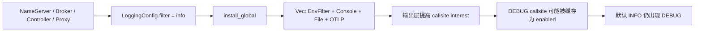
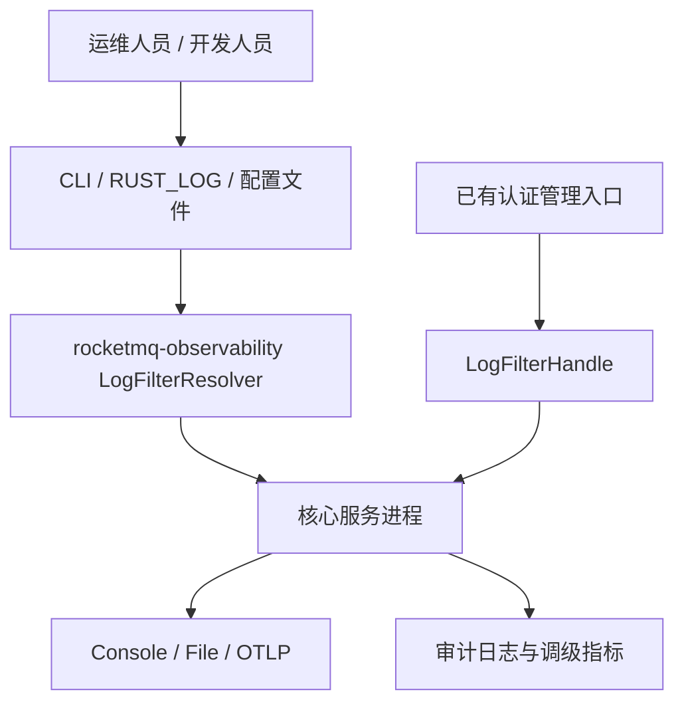
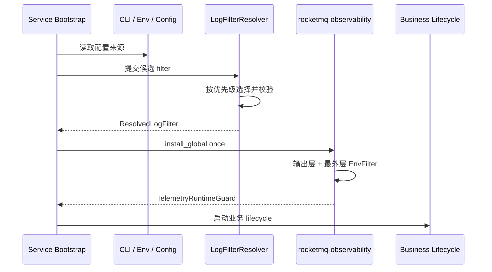

# RocketMQ Rust 全局日志等级治理生产级方案

| 属性 | 值 |
|---|---|
| 状态 | Proposed |
| 日期 | 2026-07-22 |
| 范围 | NameServer、Broker、Controller、Proxy、`rocketmq-observability`；MCP 与 Dashboard 分阶段纳入 |
| 当前治理成熟度估算 | 62/100（D，不应按当前状态发布） |
| 目标架构评分 | 96/100（S，全部验收门槛通过后成立） |
| 主决策 | 由 `rocketmq-observability` 唯一拥有日志过滤策略、解析优先级、subscriber 安装与动态重载能力 |

> 评分对象是本文定义的目标架构，不是当前未完成实现。Broker、Controller、Proxy 的默认 DEBUG 现象来自用户实际观察，但尚未逐服务采集运行证据；在四个服务的运行验收全部通过前，实施状态不得标记为 95+。

## 1. 执行摘要

### 1.1 目标

解决 NameServer、Broker、Controller、Proxy 在未显式启用 DEBUG 时仍向控制台输出 DEBUG 日志的问题，并建立一个可验证、可回滚、可运维的全局日志等级治理机制。

成功标准：

- 四个核心服务未配置日志覆盖时统一使用 `info`，连续启动验证窗口内 DEBUG 日志为 0。
- `RUST_LOG`、命令行和配置文件具有一致、明确的优先级和错误语义。
- 所有输出层都受同一个全局过滤器约束，不能因 Console、File 或 OTLP layer 组合绕过过滤。
- 运行时调整不重新安装 subscriber，失败时保留最后一个有效过滤器。
- 生产环境 DEBUG/TRACE 调整必须授权、审计、限时并自动恢复。
- 日志策略变更对消息处理吞吐和 P99 延迟的影响可量化、可门禁。

### 1.2 推荐方案

采用“统一启动解析 + 外层全局过滤 + 可重载控制句柄”的方案：

1. `rocketmq-observability` 定义唯一默认过滤器 `info`。
2. `LogFilterResolver` 统一解析运行时覆盖、CLI、`RUST_LOG`、配置文件和默认值。
3. `EnvFilter` 位于 Console、File、OTLP layers 的外层，作为整个 subscriber 的全局过滤门。
4. `TelemetryRuntimeGuard` 持有 `LogFilterHandle`；动态调整只 reload 过滤器，不重复安装 subscriber。
5. 服务入口只提供服务身份、日志路径和显式覆盖，不复制日志策略。
6. 删除 NameServer、Broker `build.rs` 中所有日志环境变量设置。

### 1.3 关键决策

- 外部配置统一使用“filter”语义，而不是只能表达单一等级的“level”语义。
- 兼容标准 `RUST_LOG`，支持 `info,rocketmq_broker=debug` 这类 target directive。
- 核心服务使用 `SubscriberInstallPolicy::Required`，subscriber 安装冲突必须启动失败。
- P0 不新增远程管理接口；P1 仅向已有、已认证的管理入口暴露 `LogFilterHandle`。
- 库 crate 只产生 tracing event，不得替宿主应用安装全局 subscriber。

## 2. 证据、假设与边界

### 2.1 已验证事实

1. 用户已经在 NameServer、Broker、Controller、Proxy 控制台观察到默认 DEBUG 输出。
2. `rocketmq-observability/src/config.rs:246-255` 中 `LoggingConfig::default().filter` 为 `info`，说明源码默认值与运行现象矛盾。
3. 四个核心服务都通过 `rocketmq_observability::logging::install_global` 安装统一 subscriber：
   - `rocketmq-namesrv/src/bin/namesrv_bootstrap_server.rs:129-132`
   - `rocketmq-broker/src/bin/broker_bootstrap_server.rs:116-119`
   - `rocketmq-controller/src/bin/controller_bootstrap.rs:136-139`
   - `rocketmq-proxy/src/bin/rocketmq-proxy-rust.rs:105-110`
4. 当前工作树的共享修复把 `EnvFilter` 从 `Vec<BoxedRegistryLayer>` 中移出，并组合为 `registry().with(layers).with(filter)`，位置为 `rocketmq-observability/src/logging.rs:149-200`。
5. 当前工作树已有回归测试覆盖“INFO span 内的 DEBUG event 必须被过滤”，位置为 `rocketmq-observability/src/logging.rs:473`。
6. Broker、Controller、Proxy 都直接使用 `LoggingConfig::default()`，没有各自实现不同的过滤算法：
   - `rocketmq-broker/src/broker_runtime.rs:489-496`
   - `rocketmq-controller/src/bin/controller_bootstrap.rs:242-258`
   - `rocketmq-proxy/src/bin/rocketmq-proxy-rust.rs:146-159`
7. `rocketmq-broker/build.rs:17` 仍设置编译期 `RUST_LOG=INFO`，但新的 Broker bootstrap 没有从运行时环境解析该值。
8. NameServer 当前未提交修改把服务默认值放在 `build.rs`，且编译期值为 `INFO`，测试字符串期望为 `info`，已经出现重复真源漂移。
9. `ReloadConfig` 已存在于 `rocketmq-observability/src/config.rs:90-92`，但日志安装路径没有使用它。
10. `rocketmq-observability/tests/architecture_guards.rs:69-78` 已限制 subscriber 安装位置，可扩展为本方案的治理门禁。

### 2.2 假设

- 核心服务默认等级均应为 INFO；没有服务需要默认 DEBUG。
- P0 阶段 Console、File、OTLP 使用同一个全局 filter，不引入每个 sink 独立等级。
- 生产环境允许临时启用 target-scoped DEBUG，但不允许无限期全局 DEBUG/TRACE。
- 已有服务管理入口可以在 P1 阶段承载授权检查和审计；若某服务没有合适入口，则只支持重启后生效的启动配置。
- 日志审计记录沿用项目现有审计保留策略；不存在统一策略时，最低保留 180 天。

### 2.3 未知项及处理方式

| 未知项 | 风险 | 处理方式 | 是否阻塞设计评分 |
|---|---|---|---|
| Broker、Controller、Proxy 的独立控制台采样尚未在本轮执行 | 可能存在服务特有第二根因 | 列为 P0 运行验收，任何一个服务失败则禁止发布 | 否，已有明确验证计划；阻塞实施完成 |
| 当前四个服务的日志吞吐和 CPU 基线未固化 | 无法直接量化过滤器开销 | 发布前执行 15 分钟基线/候选对照测试 | 否，阻塞性能门禁 |
| 各服务现有管理接口的统一授权能力不完全相同 | 运行时调级可能越权 | P1 只接入已有认证入口；无入口的服务不开放远程调级 | 否，不影响 P0 |

### 2.4 非目标

- 不重构业务日志内容或批量修改所有 `debug!` 调用点。
- 不新建集群级日志控制中心、数据库或消息总线。
- 不改变 OTLP metrics/traces 的业务语义和采样策略。
- 不允许库 crate 自动安装 subscriber。
- 不以本方案替代敏感日志审计；DEBUG/TRACE 上线前仍必须通过 error/log hygiene 检查。

## 3. 需求与约束

### 3.1 功能需求

| ID | 需求 |
|---|---|
| FR-01 | NameServer、Broker、Controller、Proxy 默认过滤器统一为 `info` |
| FR-02 | 支持 target directive，例如 `info,rocketmq_broker=debug` |
| FR-03 | 支持 CLI、`RUST_LOG`、配置文件和默认值的确定性解析 |
| FR-04 | 显式非法 filter 必须返回 typed error，不得静默降级 |
| FR-05 | 启动日志输出生效 filter 及来源，但不输出敏感配置 |
| FR-06 | P1 支持原子 reload，失败保留 last-known-good filter |
| FR-07 | DEBUG/TRACE 临时调级支持 TTL、自动恢复、授权和审计 |
| FR-08 | Console、File、OTLP 均受全局 filter 约束 |

### 3.2 非功能需求

| 维度 | 目标 |
|---|---|
| 正确性 | 默认 INFO 下四个服务 DEBUG 输出为 0；显式 DEBUG 下目标模块可观察到 DEBUG |
| 性能 | 与基线相比吞吐下降不超过 1%，P99 延迟增加不超过 2%，常态 CPU 增幅不超过 1 个百分点 |
| 可用性 | reload 失败不得影响业务服务；保留最后有效 filter；重启恢复 RTO 不超过 5 分钟 |
| 安全 | 生产 DEBUG/TRACE 必须 target-scoped、授权、审计并有 TTL |
| 可维护性 | 默认值和优先级只有一个实现；新增生产二进制不能自行安装 subscriber |
| 兼容性 | 保留 `RUST_LOG`；既有 `LoggingConfig.filter` 继续有效；MCP 旧字段分阶段兼容 |

### 3.3 技术约束

- 使用现有 `tracing`、`tracing-subscriber` 和 `rocketmq-observability`，不引入新的日志框架。
- 全局 subscriber 每个进程只能安装一次。
- 动态恢复任务必须由 `ServiceContext`、TaskGroup 或现有生命周期所有者管理，禁止 detached task。
- 不通过修改 lint、feature 或 CI 配置规避验证。

## 4. 当前问题分析

### 4.1 根因模型



四个核心服务共享同一安装路径，因此同类 DEBUG 泄漏应优先在 `rocketmq-observability` 修复。为每个服务增加 `build.rs` 默认值只能改变输入，无法修复 subscriber layer 的过滤语义。

### 4.2 当前治理缺陷

- 默认值重复：`LoggingConfig::default()`、Broker `build.rs`、NameServer `build.rs`。
- 覆盖不一致：NameServer 读取 `RUST_LOG`，Broker/Controller/Proxy 新入口不读取。
- 配置命名不一致：`filter`、`log_level`、固定 `with_max_level` 并存。
- reload 配置空转：配置结构存在，但没有运行时行为。
- 启动时序不一致：部分服务在 subscriber 安装前发出 tracing event，这些日志可能丢失。
- 运行验收缺失：没有一条跨四服务的自动化门禁证明默认 INFO 下 DEBUG 为 0。

## 5. 候选方案

### 5.1 方案 A：服务级 `build.rs` 或入口硬编码

每个服务分别设置编译期默认值，并在各入口读取环境变量。

- 优点：局部修改少。
- 缺点：无法修复共享 layer 组合问题；编译期和运行时语义混淆；默认值和测试容易漂移；四套实现持续分叉。
- 结论：拒绝。

### 5.2 方案 B：共享启动期解析器

由 `rocketmq-observability` 统一默认值、优先级和校验；服务启动时解析一次并安装 subscriber。

- 优点：低风险解决默认等级和覆盖不一致；兼容 `RUST_LOG`；易测试。
- 缺点：调整日志等级需要重启；无法兑现已有 `ReloadConfig`。
- 结论：作为 P0 最小生产闭环。

### 5.3 方案 C：共享解析器 + 外层 filter + 动态 reload

在方案 B 基础上，由 `TelemetryRuntimeGuard` 暴露受控的 `LogFilterHandle`，支持授权、审计、TTL 和自动恢复。

- 优点：根因修复、统一治理、运行时诊断、可回滚、可扩展。
- 缺点：需要生命周期任务、审计和管理入口接入，复杂度高于纯启动配置。
- 结论：推荐目标架构；按 P0/P1/P2 渐进交付。

### 5.4 方案比较

| 维度 | 方案 A：服务自管 | 方案 B：统一启动解析 | 方案 C：统一解析与 reload |
|---|---|---|---|
| 根因覆盖 | 低 | 高 | 高 |
| 跨服务一致性 | 低 | 高 | 高 |
| 运行时调整 | 无 | 无 | 有 |
| 安全治理 | 低 | 中 | 高 |
| 回滚能力 | 中 | 高 | 高 |
| 实施复杂度 | 低 | 中 | 中高 |
| 长期维护成本 | 高 | 低 | 低 |
| 推荐 | 否 | P0 | 最终目标 |

## 6. 目标架构

### 6.1 系统边界



`rocketmq-observability` 拥有策略和机制；各服务进程拥有服务身份、日志目录和管理入口适配；运维系统只通过标准配置来源或已有认证入口调整 filter。

### 6.2 组件职责

| 组件 | 职责 | 不负责 |
|---|---|---|
| `DEFAULT_LOG_FILTER` | 唯一默认值 `info` | 服务特有覆盖 |
| `LogFilterResolver` | 优先级、trim、解析、来源记录、typed error | 安装 subscriber |
| `ResolvedLogFilter` | 保存有效 filter 和 `LogFilterSource` | 读取业务配置 |
| `install_global` | 组装并安装唯一 subscriber | 决定服务配置优先级 |
| `LogFilterHandle` | 原子 reload、last-known-good、指标与错误 | 认证和操作者身份 |
| `TelemetryRuntimeGuard` | 持有 logging/telemetry guards 和 reload handle | 创建 detached 恢复任务 |
| 服务 bootstrap | 提供 CLI/config 覆盖、服务身份、目录、授权适配 | 复制默认策略或直接安装 subscriber |

### 6.3 配置解析优先级

从高到低：

1. 已授权的运行时临时覆盖。
2. CLI `--log-filter`。
3. 环境变量 `RUST_LOG`。
4. 配置文件 `logging.filter`；Java properties 兼容别名 `logFilter`。
5. `DEFAULT_LOG_FILTER=info`。

规则：

- 显式空字符串或非法 directive 视为配置错误。
- 启动期错误发生在业务 lifecycle 启动前。
- 运行时非法更新被拒绝并保留旧 filter。
- filter 来源使用低基数枚举记录：`runtime`、`cli`、`env`、`config`、`default`。
- 启动日志记录生效值和来源，但不打印完整环境或配置对象。

### 6.4 Subscriber layer 拓扑


实现约束是语义约束而非代码风格：`EnvFilter` 必须作为所有输出层之外的全局门。禁止把它重新放入与 fmt/OTLP layer 同级的动态 `Vec<Layer>`。

### 6.5 建议 API 形态

以下为边界示意，不要求逐字采用命名：

```rust
pub const DEFAULT_LOG_FILTER: &str = "info";

pub struct LogFilterInputs<'a> {
    pub cli: Option<&'a str>,
    pub environment: Option<&'a str>,
    pub config: Option<&'a str>,
}

pub struct ResolvedLogFilter {
    pub filter: String,
    pub source: LogFilterSource,
}

pub trait LogFilterControl {
    fn current(&self) -> ResolvedLogFilter;
    fn reload(&self, request: LogFilterReloadRequest) -> Result<ResolvedLogFilter, ObservabilityError>;
}
```

`LoggingConfig::default()` 保持纯函数，不读取进程环境；环境读取只发生在显式 resolver 调用中，避免 serde 默认值和单元测试依赖进程状态。

## 7. 核心工作流

### 7.1 启动流程



所有常规 tracing event 必须发生在 subscriber 成功安装之后。配置读取阶段仅返回结构化错误；成功后的配置来源摘要在 subscriber 安装后输出。

### 7.2 运行时临时调级

1. 已认证管理入口接收 target-scoped filter、原因和 TTL。
2. 服务完成权限检查，例如 `observability.log-filter.update`。
3. resolver 校验 filter；审计系统预写变更意图。
4. `LogFilterHandle` 原子替换 filter，并记录成功指标。
5. 由 `ServiceContext` 拥有的任务在 TTL 到期后恢复上一个稳定 filter。
6. 恢复失败触发告警；服务继续运行并保留当前有效 filter。

生产默认 TTL 为 30 分钟，最大 2 小时。全局 `debug` 或 `trace` 只允许 break-glass 权限；普通调级必须包含至少一个 target directive。

## 8. 控制状态、审计与一致性

日志等级治理不拥有业务数据，但拥有以下控制状态：

| 状态 | 所有者 | 一致性 | 恢复方式 |
|---|---|---|---|
| 启动 filter | CLI/环境/配置管理系统 | 启动时强一致解析 | 重启重新解析 |
| 当前运行时 filter | 进程内 `LogFilterHandle` | 原子替换、last-known-good | TTL 恢复或重启 |
| 调级审计记录 | 现有审计系统/日志平台 | 变更前后均记录，至少一次 | 按 request ID 去重 |
| 调级指标 | metrics backend | 最终一致 | 不参与控制决策 |

审计字段至少包括：

- `request_id`
- `service_name`、`instance_id`
- `old_filter`、`new_filter`
- `source`、`reason`
- `operator_subject`、`authorization_result`
- `requested_at`、`expires_at`、`restored_at`
- `result`、`error_code`

审计写入失败时拒绝远程 DEBUG/TRACE 提升；启动期本地配置不依赖远程审计可用性，但必须输出本地生效来源。

## 9. 部署与运行架构

### 9.1 核心服务迁移

| 服务 | P0 行为 | P1 行为 |
|---|---|---|
| NameServer | 删除 build-time log 默认值；接入 resolver；默认 INFO | 接入已有管理/配置更新边界或保持启动期调整 |
| Controller | 接入统一 resolver；默认 INFO | 利用现有配置 handle 适配 reload，保持权限边界 |
| Proxy | 接入统一 resolver；默认 INFO | 仅在已有认证管理入口可用时开放 reload |
| Broker | 删除无效 `build.rs` 设置；接入 resolver；默认 INFO | 最后灰度动态 reload，优先验证高吞吐影响 |

### 9.2 次级范围

- MCP：P2 兼容 `server.log_level`，迁移直接 subscriber 安装；是否将 `rocketmq-observability` 设为非可选依赖需单独评估 feature 影响。
- Dashboard Web/GPUI：作为独立 Cargo 工程按各自 `AGENTS.md` 验证；先统一 `RUST_LOG` 语义，不阻塞核心服务发布。
- Examples：允许显式安装示例 subscriber，但必须使用统一默认值和文档语义。

### 9.3 环境策略

| 环境 | 默认策略 | 调级策略 | 证据要求 |
|---|---|---|---|
| 开发 | 默认 INFO，允许开发者通过 `RUST_LOG` 覆盖 | 可使用全局 DEBUG/TRACE，不要求远程审计 | 启动日志显示来源 |
| CI/测试 | 测试显式传入 filter，禁止依赖宿主机环境 | 仅测试进程内 override | 测试结果和退出码 |
| 预发布 | 与生产默认值一致 | target-scoped DEBUG，最长 2 小时 | 审计、TTL、性能样本 |
| 生产 | 默认 INFO | 已授权、target-scoped、默认 30 分钟；全局 DEBUG/TRACE 仅 break-glass | 审计、告警、自动恢复 |

## 10. 可靠性与故障处理

| 故障 | 行为 | 告警/证据 |
|---|---|---|
| 启动 filter 非法 | 在 lifecycle 启动前失败，返回 typed config error | 启动失败日志、退出码非 0 |
| subscriber 已被安装 | 核心服务 `Required` 策略失败启动 | subscriber install failure |
| 运行时 filter 非法 | 拒绝更新，保留 last-known-good | reload failure counter + audit |
| 审计不可写 | 拒绝远程 DEBUG/TRACE 提升 | security alert |
| TTL 恢复任务无法调度 | 拒绝需要 TTL 的调级 | control task scheduling alert |
| TTL 恢复失败 | 保留当前有效 filter，触发高优先级告警 | expired override gauge |
| File sink 初始化失败 | 配置启用 File 时启动失败，避免静默丢日志 | typed logging init error |
| 非阻塞日志队列丢弃 | 服务继续运行，累计 dropped lines 并告警 | `dropped_log_lines` |

过滤器状态无需独立备份。RPO 为 0（权威启动配置仍在 CLI/环境/配置文件），最坏情况下通过重启在 5 分钟内恢复，目标 RTO 为 5 分钟。

## 11. 性能与容量

### 11.1 容量假设

- INFO 是常态过滤等级；DEBUG/TRACE 属于短时诊断模式。
- Broker 是最高日志事件速率和最严格性能门禁对象。
- 全局过滤器在 event format、序列化和 sink I/O 之前拒绝低等级 event。
- 生产调级优先 target-scoped，避免全局 DEBUG 导致磁盘、stderr 或 OTLP 洪峰。

### 11.2 性能门禁

候选版本与基线版本在相同配置、相同消息负载、相同输出 sink 下对照：

- 常态 INFO：吞吐下降不超过 1%。
- 常态 INFO：P99 延迟增加不超过 2%。
- 常态 INFO：CPU 增加不超过 1 个百分点。
- 默认 INFO：被过滤的 DEBUG 不得进入 formatter、文件 writer 或 OTLP exporter。
- reload：从请求通过校验到新 filter 生效不超过 100ms。
- target-scoped DEBUG：日志队列无持续丢弃；若出现丢弃，自动告警并允许提前恢复 INFO。

性能测试至少持续 15 分钟并覆盖 Broker 热路径、Controller 管理请求、NameServer 路由请求和 Proxy 转发请求。

## 12. 安全与合规

- 权限：远程调级要求独立权限 `observability.log-filter.update`；全局 DEBUG/TRACE 要求 break-glass 权限。
- 最小权限：普通操作者只能设置 target-scoped DEBUG，不能设置全局 TRACE。
- 审计：所有远程变更必须有操作者、原因、TTL、旧值、新值和结果。
- 输入安全：filter 长度设置合理上限，解析失败不得 panic；禁止将未经校验的 filter 拼接到 shell 命令。
- 敏感数据：启用 DEBUG 前执行敏感日志检查；禁止凭证、ACL/TLS 材料、token、完整消息体和完整配置对象进入日志。
- 依赖安全：继续使用工作区锁定的 `tracing-subscriber`，不为本方案引入新的远程控制或配置依赖。
- 拒绝策略：审计、授权或 TTL 调度任一不可用时，不允许远程提升到 DEBUG/TRACE。

## 13. 可观测性与运维

### 13.1 指标

建议新增低基数指标：

- `rocketmq_observability_log_filter_reload_total{service,result,source}`
- `rocketmq_observability_log_filter_override_active{service}`
- `rocketmq_observability_log_filter_override_expired_total{service,result}`
- `rocketmq_observability_dropped_log_lines_total{service,sink}`

禁止把完整 filter、target 名或操作者作为 metrics label；这些信息只进入审计日志。

### 13.2 启动结构化日志

每个核心服务安装完成后输出一条：

```text
telemetry bootstrap initialized service=rocketmq-broker effective_filter=info filter_source=default subscriber_installed=true reload_enabled=false
```

### 13.3 Dashboard 与告警

Dashboard 至少展示：

- 各服务 reload 成功率和失败率。
- 当前存在的临时 DEBUG/TRACE override 数量。
- 到期未恢复 override。
- dropped log lines 趋势。
- INFO 常态下异常 DEBUG 样本计数。

告警：

- P1：到期 override 5 分钟内未恢复。
- P1：未经授权或审计失败的调级尝试。
- P2：reload 失败率 5 分钟窗口超过 1%。
- P2：日志 dropped lines 连续 5 分钟增长。

### 13.4 Runbook 与事件入口

必须提供以下 runbook：

1. 默认 INFO 仍出现 DEBUG。
2. `RUST_LOG` 未生效或优先级不符合预期。
3. 临时 DEBUG 到期未恢复。
4. DEBUG 导致 CPU、磁盘或 OTLP 压力。
5. subscriber 安装冲突。

统一事件入口先检查启动结构化日志中的 `effective_filter`、`filter_source` 和 `subscriber_installed`，再检查 reload audit 和 dropped lines。

## 14. 分阶段实施路线

### 14.1 成本与团队约束

- 不新增外部数据库、消息系统或日志控制服务，基础设施成本保持不变。
- `rocketmq-observability` 维护者负责共享策略、layer 拓扑和 feature matrix。
- NameServer、Controller、Proxy、Broker 维护者分别负责入口适配和运行验收；Broker 因负载最高最后灰度。
- Runtime 维护者负责 TTL 任务生命周期，Security/服务维护者负责授权和审计适配。
- P0、P1、P2 可以独立发布和回滚；未完成 P1 时保留启动期调级，不阻塞 P0 正确性修复。
- 交付成本主要来自跨四服务验证和运维证据，不通过压缩测试范围换取进度。

### 14.2 P0：共享正确性与统一启动策略

| 任务 | 结果 | 评分影响 |
|---|---|---:|
| 将 `EnvFilter` 固定为所有输出层外的全局 layer | 消除跨服务 DEBUG 泄漏根因 | +8 |
| 在 `rocketmq-observability` 增加 resolver、来源枚举和唯一默认值 | 消除默认值与优先级分叉 | +4 |
| 删除 NameServer、Broker 日志相关 `build.rs` 设置 | 消除编译期隐式配置 | +2 |
| 迁移四个核心服务并记录生效 filter/source | 行为一致且可诊断 | +3 |
| 增加跨服务默认 INFO、环境覆盖和非法配置测试 | 建立回归门禁 | +3 |

P0 完成后预期治理成熟度约 82/100。未完成 P0 不允许发布本次日志修复。

### 14.3 P1：动态调级、安全与运维闭环

| 任务 | 结果 | 评分影响 |
|---|---|---:|
| 实现 `ReloadConfig`、`LogFilterHandle`、last-known-good | 无需重启的原子调级 | +3 |
| 接入授权、审计、TTL 和生命周期恢复任务 | 生产安全调试 | +3 |
| 增加指标、Dashboard、告警和 runbook | 运维闭环 | +2 |
| 执行 reload 故障注入和恢复演练 | 可靠性证据 | +1 |

P1 完成后预期治理成熟度约 91/100，达到生产可用但尚未达到 95+。

### 14.4 P2：全范围一致性和 95+ 证据闭环

| 任务 | 结果 | 评分影响 |
|---|---|---:|
| 迁移 MCP，并为独立 Dashboard 建立一致性适配 | 扩大治理边界 | +1 |
| 扩展架构守卫，禁止直接 subscriber 安装和 `build.rs` 日志默认值 | 防止架构回退 | +1 |
| 完成四服务 canary、性能对照、故障注入和回滚演练 | 形成发布证据 | +2 |
| 同步运维、部署和故障排查文档 | 降低长期维护成本 | +1 |

P2 质量门槛全部通过后，目标架构评分为 96/100。

## 15. 发布、迁移与回滚

### 15.1 发布顺序

1. 固化四服务当前默认日志样本和性能基线。
2. 合入共享 filter 语义修复及 `rocketmq-observability` 回归测试。
3. 迁移 NameServer canary。
4. 迁移 Controller canary。
5. 迁移 Proxy canary。
6. 最后迁移 Broker canary，并执行最高负载性能验证。
7. 四服务全量发布后再启用 P1 reload，初始默认 `reload.enabled=false`。

### 15.2 向后兼容

- `LoggingConfig.filter` 保持有效。
- `RUST_LOG` 作为标准运行时环境变量继续支持。
- NameServer/Broker 移除编译期默认值不会改变无覆盖时的 INFO 行为。
- 新 CLI `--log-filter` 为增量能力。
- MCP 的 `server.log_level` 在迁移期作为配置别名保留，并输出一次弃用提示。

### 15.3 回滚触发条件

满足任一条件立即停止扩容并回滚：

- 未设置覆盖时出现任何 DEBUG 控制台输出。
- 服务启动失败率相对基线增加。
- 吞吐下降超过 1% 或 P99 延迟增加超过 2%。
- subscriber 安装冲突或重复安装。
- reload 失败后没有保留 last-known-good filter。
- DEBUG/TRACE override 无法按 TTL 自动恢复。
- 审计记录缺失或权限检查可绕过。

### 15.4 回滚程序

1. 禁用运行时 reload，并设置 `RUST_LOG=info`。
2. 将流量切回上一稳定实例或上一发布版本。
3. 保留问题实例的启动日志、filter source、reload audit 和性能指标。
4. 验证上一版本业务健康和 INFO 常态日志恢复。
5. 不回滚已经验证的全局 filter layer 语义修复，除非证据证明它引入故障；服务接入和动态 reload 可以独立回滚。

本方案无数据库 schema 或业务数据迁移，回滚不需要数据补偿。

## 16. 验证计划

| 区域 | 验证方法 | 责任人 | 退出标准 |
|---|---|---|---|
| Resolver | 表驱动测试覆盖所有优先级、空值、非法 directive | Observability 维护者 | 全部通过，错误类型稳定 |
| Layer 语义 | INFO span 内发出 DEBUG/INFO event | Observability 维护者 | 只记录 INFO |
| NameServer | 无覆盖启动并采集至少 60 秒控制台 | NameServer 维护者 | DEBUG=0，INFO>0 |
| Broker | 无覆盖启动并执行消息收发负载 | Broker 维护者 | DEBUG=0，业务健康 |
| Controller | 无覆盖启动并执行管理请求 | Controller 维护者 | DEBUG=0，业务健康 |
| Proxy | 无覆盖启动并执行代理请求 | Proxy 维护者 | DEBUG=0，业务健康 |
| 环境覆盖 | `RUST_LOG=info,rocketmq_<service>=debug` | 各服务维护者 | 只出现目标模块 DEBUG |
| 非法配置 | 提供非法 filter | 各服务维护者 | lifecycle 前失败，退出码非 0 |
| Reload | 并发请求期间切换 INFO/target DEBUG/INFO | Observability/服务维护者 | 100ms 内生效，无 subscriber 重装 |
| TTL | 启用 1 分钟临时 DEBUG | Runtime/服务维护者 | 到期自动恢复并写审计 |
| 故障注入 | 审计失败、任务调度失败、reload 失败 | Runtime/Security 维护者 | 按故障矩阵执行，无业务崩溃 |
| 性能 | 基线/候选 15 分钟对照 | Broker/性能验证负责人 | 满足第 11.2 节门禁 |
| 架构守卫 | 扫描 subscriber 安装和 build-time 日志变量 | Observability 维护者 | 无未授权位置 |
| 回滚演练 | canary 触发人工回滚 | 发布负责人/各服务维护者 | 5 分钟内恢复 INFO 稳态 |

Rust 最终验证至少包括：

```text
cargo fmt --all -- --check
cargo clippy --workspace --no-deps --all-targets --all-features -- -D warnings
cargo test -p rocketmq-observability
cargo test -p rocketmq-namesrv
cargo test -p rocketmq-controller
cargo test -p rocketmq-proxy
cargo test -p rocketmq-broker
```

修改 `rocketmq-observability` 时还必须执行仓库规定的 observability feature matrix。命令只有退出码为 0 才计为通过；环境性阻塞必须记录为发布缺口，不能写成通过。

## 17. 验收标准

### 架构

- [ ] 日志默认值和解析优先级只有一个实现。
- [ ] 四个核心服务不直接安装 subscriber。
- [ ] `EnvFilter` 位于输出 layers 外层。
- [ ] NameServer、Broker `build.rs` 不再设置日志环境变量。

### 正确性与可靠性

- [ ] 四服务默认 INFO 的运行样本均为 DEBUG=0、INFO>0。
- [ ] `RUST_LOG` 和 target directive 在四服务行为一致。
- [ ] 非法 filter 不会 panic 或静默回退。
- [ ] reload 失败保留 last-known-good。
- [ ] TTL 到期自动恢复通过故障注入验证。

### 性能

- [ ] 吞吐、P99、CPU 满足第 11.2 节门禁。
- [ ] 默认 INFO 下 DEBUG 不进入 formatter 或 sink。
- [ ] Broker canary 无持续 dropped log lines。

### 安全与运维

- [ ] DEBUG/TRACE 调级具有权限、原因、TTL 和完整审计。
- [ ] 审计或 TTL 调度失败时拒绝调级。
- [ ] Dashboard、告警和五类 runbook 可用。
- [ ] 回滚演练在 5 分钟内完成。

### 交付

- [ ] 所有适用格式、Clippy、测试和 feature matrix 通过。
- [ ] 架构守卫阻止新增直接 subscriber 安装和 build-time 日志默认值。
- [ ] 部署及故障排查文档与真实配置优先级一致。

## 18. 风险登记册

| 风险 | 概率 | 影响 | 缓解 | 所有者 |
|---|---|---|---|---|
| 共享 filter 修复影响 OTLP layer | 中 | 高 | feature matrix + trace/log exporter 集成测试 | Observability 维护者 |
| Broker DEBUG 导致日志洪峰 | 中 | 高 | target-scoped、TTL、队列丢弃告警、Broker 最后灰度 | Broker 维护者 |
| 服务配置优先级理解不一致 | 中 | 中 | resolver 单测、启动日志记录来源、统一文档 | Core runtime 维护者 |
| 远程调级越权 | 低 | 高 | 独立权限、break-glass、审计失败即拒绝 | Security/服务维护者 |
| TTL 恢复任务失效 | 低 | 高 | 生命周期所有权、到期未恢复 P1 告警、回滚 runbook | Runtime 维护者 |
| 独立 Dashboard 无法同步迁移 | 中 | 低 | P2 单独验证，不阻塞核心服务 | Dashboard 维护者 |

## 19. 100 分评分

### 19.1 目标架构评分：96/100

| 维度 | 权重 | 得分 | 扣分原因/证据 | 补强措施 |
|---|---:|---:|---|---|
| 业务目标匹配 | 10 | 10 | 直接解决默认 DEBUG 噪声和生产诊断需求 | 按四服务运行证据验收 |
| 需求完整性与边界 | 8 | 8 | 核心服务、次级范围、非目标和兼容边界明确 | 保持变更范围不扩散到业务日志重构 |
| 架构与技术适配 | 10 | 10 | 复用现有 tracing/observability，不新增平台 | 通过 ADR 固化 |
| 模块化与职责边界 | 10 | 10 | 策略、安装、控制、服务适配职责单一 | 架构守卫防止回退 |
| 数据与一致性 | 10 | 9 | 运行时 filter 为进程内状态，不跨实例强一致 | 以配置源重建、审计 request ID 去重 |
| 性能与扩展性 | 10 | 9 | 有明确门禁，但实测基线需在实施阶段生成 | 完成 15 分钟四服务对照测试 |
| 可用性与恢复 | 10 | 9 | last-known-good、RTO、故障矩阵和回滚完整 | 完成 TTL 与回滚故障演练 |
| 安全与合规 | 8 | 8 | 权限、break-glass、审计、TTL、敏感数据约束完整 | 发布前通过日志 hygiene 检查 |
| 可观测性与运维 | 8 | 8 | 指标、告警、Dashboard、runbook、事件入口完整 | 以验收清单确认可用性 |
| 可维护性与演进 | 8 | 8 | 单一真源、兼容迁移、测试和 ADR 完整 | P2 覆盖 MCP/Dashboard |
| 成本、复杂度与交付 | 8 | 7 | 动态 reload 和四服务迁移增加一定交付成本 | P0/P1/P2 分阶段降低风险 |
| **总分** | **100** | **96** | **S / Production-grade** | **所有验收门槛通过后成立** |

### 19.2 评分约束

- 当前实现成熟度估算为 62/100，不能引用 96 分作为当前完成度。
- P0 未完成时评分上限为 82。
- P1 未完成时评分上限为 91。
- 四服务运行证据、性能门禁、故障注入、回滚演练任一缺失时，评分上限为 94。
- 只有第 17 节全部通过，目标架构才可按 96/100 对外标记。

## 20. ADR-LOG-001：统一日志过滤策略归属 `rocketmq-observability`

### 状态

Proposed

### 背景

四个核心服务共享 `rocketmq-observability::install_global`，源码默认 filter 为 INFO，但运行时仍出现 DEBUG。服务级 `build.rs` 和入口覆盖不能修复共享 layer 组合语义，且已经产生默认值漂移。

### 决策

- `rocketmq-observability` 是默认 filter、解析优先级、全局 layer 拓扑和 reload 机制的唯一所有者。
- 服务 bootstrap 只提供输入和适配。
- `EnvFilter` 必须位于所有输出 layers 外层。
- 删除生产服务 `build.rs` 中日志环境变量设置。
- P1 通过 `TelemetryRuntimeGuard` 暴露受控 reload handle，不新增独立控制平面。

### 备选方案

- 各服务自行设置 `RUST_LOG`：因重复真源和无法修复共享根因而拒绝。
- 只实现启动期 resolver：作为 P0 接受，但不是最终目标。
- 新建独立日志控制服务：当前规模不需要，运维和安全成本过高，拒绝。

### 后果

正面影响：四服务行为一致、根因集中修复、可测试、可回滚、可审计、可动态诊断。

负面影响：`rocketmq-observability` 成为更关键的启动依赖；需要完成 feature matrix、性能门禁和跨服务 canary。

### 影响范围

`rocketmq-observability`、NameServer、Broker、Controller、Proxy、相关架构守卫、部署配置和故障排查文档；P2 扩展到 MCP 与独立 Dashboard。
