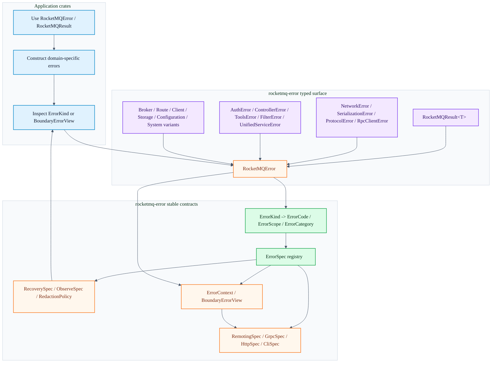

# rocketmq-error

[English](README.md) | [简体中文](README-zh_cn.md)

[](https://crates.io/crates/rocketmq-error)
[](https://docs.rs/rocketmq-error)
[](../LICENSE-APACHE)

`rocketmq-error` 是 RocketMQ Rust workspace 的共享错误内核。它提供统一的类型化错误接口、稳定的机器可读错误标识，以及支持脱敏的边界视图，供各 crate 通过 remoting、gRPC、HTTP、CLI、日志或 metrics 暴露错误。

## 本 crate 职责

- `RocketMQError`：RocketMQ Rust 各 crate 使用的主错误枚举。
- `RocketMQResult<T>`：标准 result 类型别名。
- 领域专用的嵌套错误，例如 `NetworkError`、`SerializationError`、`ProtocolError`、`RpcClientError`、`AuthError`、`ControllerError`、`ToolsError`、`FilterError` 和 `UnifiedServiceError`。
- 稳定分类体系：`ErrorKind`、`ErrorCode`、`ErrorScope` 和 `ErrorCategory`。
- 静态元数据注册表：`ErrorSpec` 和 `ALL_ERROR_SPECS`。
- 面向 remoting、gRPC、HTTP 和 CLI 适配器的边界映射。
- 恢复与可观测性策略：`RetryClass`、`RecoverySpec`、`ErrorSeverity` 和 `ObserveSpec`。
- 支持脱敏的结构化上下文：`ErrorContext`、`Sensitive<T>` 和 `BoundaryErrorView`。

该 crate 有意避免依赖 `rocketmq-remoting` 等传输 crate 或生成的 protobuf 绑定。面向边界的 primitive 类型会镜像所需的 wire/status 值，同时让错误 crate 保持在较低的依赖层级。

## 快速开始

```toml
[dependencies]
rocketmq-error = "1.0.0"
```

```rust
use rocketmq_error::RocketMQError;
use rocketmq_error::RocketMQResult;

fn validate_broker_addr(addr: &str) -> RocketMQResult<()> {
    if addr.is_empty() {
        return Err(RocketMQError::network_connection_failed(
            "<empty>",
            "address must not be empty",
        ));
    }

    Ok(())
}
```

`std::io::Error`、`std::str::Utf8Error`，以及 `NetworkError`、`SerializationError`、`ProtocolError`、`RpcClientError`、`AuthError`、`ControllerError`、`ToolsError`、`FilterError` 和 `UnifiedServiceError` 等被包裹的嵌套错误，都可以通过 `From` 转换为 `RocketMQError`，因此常规代码路径可以使用 `?` 运算符。

## 架构

当前架构分为三层：

配色含义：蓝色表示调用方流程，紫色表示类型化错误，绿色表示稳定契约，橙色表示边界交接点。



### 类型化接口

`RocketMQError` 是顶层枚举。部分变体通过 `#[from]` 包裹嵌套的领域错误；当错误属于共享的 broker、route、client、storage、configuration、system 或 version 契约时，其他变体会直接携带字段。

重要的包裹型错误族：

| 变体 | 嵌套类型 | 典型产生方 |
| --- | --- | --- |
| `RocketMQError::Network` | `NetworkError` | remoting client、RPC client |
| `RocketMQError::Serialization` | `SerializationError` | codec、元数据 serializer |
| `RocketMQError::Protocol` | `ProtocolError` | command/header/body 校验 |
| `RocketMQError::Rpc` | `RpcClientError` | 请求分发和响应处理 |
| `RocketMQError::Authentication` | `AuthError` | 认证和授权 |
| `RocketMQError::Controller` | `ControllerError` | controller 和 Raft 工作流 |
| `RocketMQError::Tools` | `ToolsError` | admin tools 和 CLI 操作 |
| `RocketMQError::Filter` | `FilterError` | Bloom Filter 和 bit-array 工具 |

重要的直接变体族：

- Broker 和消息错误：主题/队列查找、broker 操作失败、消息大小和校验失败、事务拒绝、权限。
- Route 错误：路由数据缺失、路由数据不一致、路由注册冲突、路由版本冲突、cluster 缺失。
- Client 生命周期错误：未启动、已启动、正在关闭、状态无效、producer/consumer 不可用。
- Storage 错误：读、写、数据损坏、空间不足、锁失败。
- Configuration 和 auth reload 错误。
- System 错误：I/O、非法参数、超时、内部错误、服务生命周期、初始化、版本 ordinal、必需消息属性。

### 稳定分类体系

Display 文本是诊断接口，可能包含本地细节。需要稳定行为的代码应使用分类体系：

```rust
use rocketmq_error::ErrorKind;
use rocketmq_error::RocketMQError;

let error = RocketMQError::route_not_found("TopicA");

assert_eq!(error.kind(), ErrorKind::RouteNotFound);
assert_eq!(error.kind().code().as_str(), "ROUTE_NOT_FOUND");
assert_eq!(error.kind().category().as_str(), "route");
```

`ErrorKind::ALL` 列出所有公开的逻辑错误 kind。每个 kind 都映射到：

- `ErrorCode`：稳定的机器可读 code，例如 `ROUTE_NOT_FOUND`。
- `ErrorScope`：架构归属方，例如 `Route`、`Broker` 或 `Storage`。
- `ErrorCategory`：用于外部适配器、metrics 和 dashboard 的低基数标签。

### ErrorSpec 注册表

`ALL_ERROR_SPECS` 是附加到每个 `ErrorKind` 的元数据中心注册表。测试会断言每个 kind 都恰好有一个 spec，code 唯一，并且 protocol、recovery、observability 和 redaction 元数据完整。

```rust
use rocketmq_error::ErrorKind;

let spec = ErrorKind::RouteNotFound.spec();

assert_eq!(spec.code.as_str(), "ROUTE_NOT_FOUND");
assert_eq!(spec.public_message, "Route information was not found");
assert_eq!(spec.observe.metric_label, "ROUTE_NOT_FOUND");
```

添加新的 `ErrorKind` 时，需要通过现有构造函数更新所有相关映射：

- `ErrorKind::code`、`ErrorKind::scope` 和 `ErrorKind::category`
- `ALL_ERROR_SPECS`
- `RemotingSpec::for_kind`
- `GrpcSpec::for_kind`
- `HttpSpec::for_kind`
- `CliSpec::for_kind`
- `RecoverySpec::for_kind`
- `RedactionPolicy::for_kind`
- 如果新的 kind 由某个 `RocketMQError` 变体支撑，还需更新 `RocketMQError::kind` 和 `RocketMQError::context`

## 边界视图

将错误适配为 wire protocol、HTTP response、CLI output、UI model、log record 或 metric event 时，应使用 `RocketMQError::boundary_view()`。它会将稳定 spec 与支持脱敏的上下文组合起来。

```rust
use rocketmq_error::RocketMQError;

let error = RocketMQError::storage_read_failed(
    "/var/lib/rocketmq/commitlog/00000000000000000000",
    "permission denied",
);

let view = error.boundary_view();

assert_eq!(view.code().as_str(), "STORAGE_READ_FAILED");
assert_eq!(view.message(), "Storage read failed");
assert_eq!(view.context().to_string(), "path=<redacted>, reason=<redacted>");
```

边界映射有意保持传输无关：

| Spec | 用途 |
| --- | --- |
| `RemotingSpec` | RocketMQ remoting response code |
| `GrpcSpec` | gRPC payload code 和 transport status |
| `HttpSpec` | HTTP status code |
| `CliSpec` | 进程 exit code |
| `RecoverySpec` | retry 或 recovery class |
| `ObserveSpec` | severity 和 metric label |

对于 CLI 工具，`CliErrorView::from_error(&error).render_stderr()` 会使用同一个注册表渲染一行支持脱敏的输出。

## 脱敏模型

`Display` 和 `Debug` 是诊断接口。它们适用于可信进程边界内部，但外部适配器应优先使用 `public_message()`、`context()` 或 `boundary_view()`。

敏感值应通过 `Sensitive<T>` 传递，或使用 `ErrorContext::with_sensitive` 添加。敏感字段会渲染为 `<redacted>`。

```rust
use rocketmq_error::ErrorContext;
use rocketmq_error::Sensitive;

let context = ErrorContext::new()
    .with_field("topic", "TopicA")
    .with_sensitive("token", Sensitive::new("plain-token"));

assert_eq!(context.to_string(), "topic=TopicA, token=<redacted>");
```

## 恢复与可观测性

重试和可观测性行为来自 `ErrorKind`，而不是格式化消息：

```rust
use rocketmq_error::ErrorKind;
use rocketmq_error::ErrorSeverity;
use rocketmq_error::RetryClass;

assert_eq!(
    ErrorKind::RouteNotFound.spec().recovery.retry,
    RetryClass::RefreshRoute,
);
assert_eq!(
    ErrorKind::ControllerNotLeader.spec().recovery.retry,
    RetryClass::RefreshLeader,
);
assert_eq!(
    ErrorKind::RequestHeaderError.spec().observe.severity,
    ErrorSeverity::Info,
);
```

当前 retry class 包括：

- `Never`
- `Immediate`
- `AfterBackoff`
- `RefreshRoute`
- `SwitchBroker`
- `RefreshLeader`

当前 severity 包括：

- `Debug`
- `Info`
- `Warn`
- `Error`
- `Critical`

## Feature Flags

默认 feature 集为空。

| Feature | 启用内容 |
| --- | --- |
| `with_serde` | 将 `serde_json` 转换为 `SerializationError` 和 `RocketMQError` |
| `with_config` | 将 `config::ConfigError` 转换为 `RocketMQError` |

```toml
[dependencies]
rocketmq-error = { version = "1.0.0", features = ["with_serde", "with_config"] }
```

## 使用模式

常见场景优先使用类型化构造函数：

```rust
use rocketmq_error::RocketMQError;

let network = RocketMQError::network_connection_failed("127.0.0.1:9876", "connection refused");
let route = RocketMQError::route_not_found("TopicA");
let broker = RocketMQError::broker_operation_failed("SEND_MESSAGE", 1, "topic not exist")
    .with_broker_addr("127.0.0.1:10911");
let storage = RocketMQError::storage_write_failed("/var/lib/rocketmq/commitlog", "disk full");
let auth = RocketMQError::auth_config_invalid("auth.authorization", "provider not ready");
let controller = RocketMQError::controller_not_leader(Some(2));
```

当本地控制流需要精确细节时，匹配类型化枚举：

```rust
use rocketmq_error::NetworkError;
use rocketmq_error::RocketMQError;

fn is_connection_problem(error: &RocketMQError) -> bool {
    matches!(
        error,
        RocketMQError::Network(NetworkError::ConnectionFailed { .. })
            | RocketMQError::Network(NetworkError::ConnectionTimeout { .. })
    )
}
```

公开契约应使用 `ErrorKind` 或 `BoundaryErrorView`：

```rust
use rocketmq_error::ErrorKind;
use rocketmq_error::RocketMQError;

fn should_refresh_route(error: &RocketMQError) -> bool {
    matches!(error.kind(), ErrorKind::RouteNotFound | ErrorKind::RouteInconsistent)
}
```

## 公共 API 说明

- 类型化 `RocketMQError` 接口是公共错误 API。
- 预类型化的兼容别名和 legacy enum 名称有意不再暴露。
- 稳定的外部集成不应解析 `Display` 输出。请使用 `ErrorKind`、`ErrorCode`、`ErrorSpec` 或 `BoundaryErrorView`。
- 该 crate 通过暴露 primitive remoting/gRPC/HTTP/CLI spec 类型，而不是依赖传输实现，保持传输映射本地化且依赖轻量。

## 测试

从 workspace 根目录运行 crate 测试：

```bash
cargo test -p rocketmq-error
cargo test -p rocketmq-error --all-features
```

有用的聚焦测试套件：

```bash
cargo test -p rocketmq-error --test error_kind_contract
cargo test -p rocketmq-error --test error_spec_registry
cargo test -p rocketmq-error --test error_protocol_specs
cargo test -p rocketmq-error --test error_policy_specs
cargo test -p rocketmq-error --test error_context_redaction
```

如果该 crate 中有 Rust 代码变更，还需要运行仓库要求的 workspace 验证：

```bash
cargo fmt --all
cargo clippy --workspace --no-deps --all-targets --all-features -- -D warnings
```

## 文档

- [API documentation](https://docs.rs/rocketmq-error)
- 示例：[`examples/controller_error_integration.rs`](examples/controller_error_integration.rs)

## 许可证

基于 [Apache License, Version 2.0](../LICENSE-APACHE) 授权。

## 贡献

欢迎贡献。提交变更前，请阅读 workspace 的 [Contributing Guide](../CONTRIBUTING.md)。
