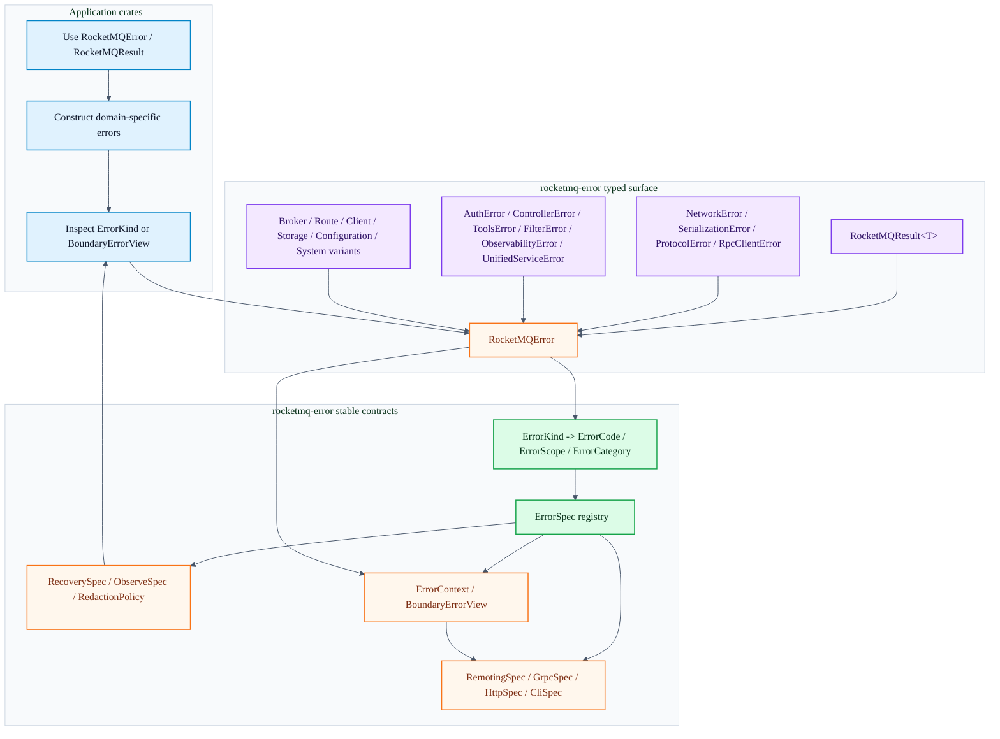

# rocketmq-error

[English](README.md) | [简体中文](README-zh_cn.md)

[](https://crates.io/crates/rocketmq-error)
[](https://docs.rs/rocketmq-error)
[](../LICENSE-APACHE)

`rocketmq-error` is the shared error kernel for the RocketMQ Rust workspace. It
provides one typed error surface, stable machine-readable error identity, and
redaction-aware boundary views for crates that need to expose errors through
remoting, gRPC, HTTP, CLI, logs, or metrics.

## What This Crate Owns

- `RocketMQError`: the primary error enum used by RocketMQ Rust crates.
- `RocketMQResult<T>`: the standard result alias.
- Domain-specific nested errors such as `NetworkError`, `SerializationError`,
  `ProtocolError`, `RpcClientError`, `AuthError`, `ControllerError`,
  `ToolsError`, `FilterError`, and `UnifiedServiceError`.
- `ObservabilityError`: telemetry, logging, exporter initialization,
  subscriber installation, and provider shutdown errors.
- Stable taxonomy: `ErrorKind`, `ErrorCode`, `ErrorScope`, and
  `ErrorCategory`.
- Static metadata registry: `ErrorSpec` and `ALL_ERROR_SPECS`.
- Boundary mappings for remoting, gRPC, HTTP, and CLI adapters.
- Recovery and observability policy: `RetryClass`, `RecoverySpec`,
  `ErrorSeverity`, and `ObserveSpec`.
- Redaction-aware structured context: `ErrorContext`, `Sensitive<T>`, and
  `BoundaryErrorView`.

The crate intentionally avoids depending on transport crates such as
`rocketmq-remoting` or generated protobuf bindings. Boundary-facing primitive
types mirror the required wire/status values while keeping the error crate low
in the dependency graph.

## Quick Start

```toml
[dependencies]
rocketmq-error = "1.0.0"
```

```rust
use rocketmq_error::RocketMQError;
use rocketmq_error::RocketMQResult;

fn validate_broker_addr(addr: &str) -> RocketMQResult<()> {
    if addr.is_empty() {
        return Err(RocketMQError::network_connection_failed(
            "<empty>",
            "address must not be empty",
        ));
    }

    Ok(())
}
```

`std::io::Error`, `std::str::Utf8Error`, and wrapped nested errors such as
`NetworkError`, `SerializationError`, `ProtocolError`, `RpcClientError`,
`AuthError`, `ControllerError`, `ToolsError`, `FilterError`,
`ObservabilityError`, and `UnifiedServiceError` convert into `RocketMQError`
through `From`, so the `?` operator can be used in normal code paths.

## Architecture

The current architecture has three layers:

Color coding highlights caller flow in blue, typed errors in purple, stable
contracts in green, and boundary handoff points in orange.



### Typed Surface

`RocketMQError` is the top-level enum. Some variants wrap nested domain errors
with `#[from]`, while other variants carry fields directly when the error is
part of the shared broker, route, client, storage, configuration, system, or
version contract.

Important wrapped families:

| Variant | Nested type | Typical producer |
| --- | --- | --- |
| `RocketMQError::Network` | `NetworkError` | remoting clients, RPC clients |
| `RocketMQError::Serialization` | `SerializationError` | codecs, metadata serializers |
| `RocketMQError::Protocol` | `ProtocolError` | command/header/body validation |
| `RocketMQError::Rpc` | `RpcClientError` | request dispatch and response handling |
| `RocketMQError::Authentication` | `AuthError` | authentication and authorization |
| `RocketMQError::Controller` | `ControllerError` | controller and Raft workflows |
| `RocketMQError::Tools` | `ToolsError` | admin tools and CLI operations |
| `RocketMQError::Filter` | `FilterError` | bloom filter and bit-array utilities |
| `RocketMQError::Observability` | `ObservabilityError` | telemetry bootstrap, exporters, subscriber install, provider shutdown |

Important direct families:

- Broker and message errors: topic/queue lookup, broker operation failures,
  message size and validation failures, transaction rejection, permissions.
- Route errors: missing route data, inconsistent route data, route registration
  conflict, route version conflict, missing cluster.
- Client lifecycle errors: not started, already started, shutting down, invalid
  state, producer/consumer unavailable.
- Storage errors: read, write, corruption, out of space, lock failure.
- Configuration and auth reload errors.
- System errors: I/O, illegal argument, timeout, internal, service lifecycle,
  initialization, version ordinal, required message property.

### Stable Taxonomy

Display text is diagnostic and can contain local detail. Code that needs stable
behavior should use the taxonomy:

```rust
use rocketmq_error::ErrorKind;
use rocketmq_error::RocketMQError;

let error = RocketMQError::route_not_found("TopicA");

assert_eq!(error.kind(), ErrorKind::RouteNotFound);
assert_eq!(error.kind().code().as_str(), "ROUTE_NOT_FOUND");
assert_eq!(error.kind().category().as_str(), "route");
```

`ErrorKind::ALL` lists every public logical kind. Each kind maps to:

- `ErrorCode`: stable machine-readable code, for example
  `ROUTE_NOT_FOUND`.
- `ErrorScope`: architectural owner such as `Route`, `Broker`, or `Storage`.
- `ErrorCategory`: low-cardinality label for external adapters, metrics, and
  dashboards.

### ErrorSpec Registry

`ALL_ERROR_SPECS` is the central registry for metadata attached to every
`ErrorKind`. Tests assert that every kind has exactly one spec, that codes are
unique, and that the protocol, recovery, observability, and redaction metadata
is complete.

```rust
use rocketmq_error::ErrorKind;

let spec = ErrorKind::RouteNotFound.spec();

assert_eq!(spec.code.as_str(), "ROUTE_NOT_FOUND");
assert_eq!(spec.public_message, "Route information was not found");
assert_eq!(spec.observe.metric_label, "ROUTE_NOT_FOUND");
```

When adding a new `ErrorKind`, update all related mappings through the existing
constructors:

- `ErrorKind::code`, `ErrorKind::scope`, and `ErrorKind::category`
- `ALL_ERROR_SPECS`
- `RemotingSpec::for_kind`
- `GrpcSpec::for_kind`
- `HttpSpec::for_kind`
- `CliSpec::for_kind`
- `RecoverySpec::for_kind`
- `RedactionPolicy::for_kind`
- `RocketMQError::kind` and `RocketMQError::context`, if the new kind is backed
  by a `RocketMQError` variant

## Boundary Views

Use `RocketMQError::boundary_view()` when adapting an error to a wire protocol,
HTTP response, CLI output, UI model, log record, or metric event. It combines
the stable spec with redaction-aware context.

```rust
use rocketmq_error::RocketMQError;

let error = RocketMQError::storage_read_failed(
    "/var/lib/rocketmq/commitlog/00000000000000000000",
    "permission denied",
);

let view = error.boundary_view();

assert_eq!(view.code().as_str(), "STORAGE_READ_FAILED");
assert_eq!(view.message(), "Storage read failed");
assert_eq!(view.context().to_string(), "path=<redacted>, reason=<redacted>");
```

Boundary mappings are deliberately transport-neutral:

| Spec | Purpose |
| --- | --- |
| `RemotingSpec` | RocketMQ remoting response code |
| `GrpcSpec` | gRPC payload code and transport status |
| `HttpSpec` | HTTP status code |
| `CliSpec` | process exit code |
| `RecoverySpec` | retry or recovery class |
| `ObserveSpec` | severity and metric label |

For CLI tools, `CliErrorView::from_error(&error).render_stderr()` renders a
single redaction-aware line using the same registry.

## Redaction Model

`Display` and `Debug` are diagnostic surfaces. They are useful inside trusted
process boundaries, but external adapters should prefer `public_message()`,
`context()`, or `boundary_view()`.

Sensitive values should be passed through `Sensitive<T>` or added with
`ErrorContext::with_sensitive`. Sensitive fields render as `<redacted>`.

```rust
use rocketmq_error::ErrorContext;
use rocketmq_error::Sensitive;

let context = ErrorContext::new()
    .with_field("topic", "TopicA")
    .with_sensitive("token", Sensitive::new("plain-token"));

assert_eq!(context.to_string(), "topic=TopicA, token=<redacted>");
```

## Recovery and Observability

Retry and observability behavior is derived from `ErrorKind`, not from formatted
messages:

```rust
use rocketmq_error::ErrorKind;
use rocketmq_error::ErrorSeverity;
use rocketmq_error::RetryClass;

assert_eq!(
    ErrorKind::RouteNotFound.spec().recovery.retry,
    RetryClass::RefreshRoute,
);
assert_eq!(
    ErrorKind::ControllerNotLeader.spec().recovery.retry,
    RetryClass::RefreshLeader,
);
assert_eq!(
    ErrorKind::RequestHeaderError.spec().observe.severity,
    ErrorSeverity::Info,
);
```

Current retry classes are:

- `Never`
- `Immediate`
- `AfterBackoff`
- `RefreshRoute`
- `SwitchBroker`
- `RefreshLeader`

Current severities are:

- `Debug`
- `Info`
- `Warn`
- `Error`
- `Critical`

## Feature Flags

The default feature set is empty.

| Feature | Enables |
| --- | --- |
| `with_serde` | `serde_json` conversion into `SerializationError` and `RocketMQError` |
| `with_config` | `config::ConfigError` conversion into `RocketMQError` |

```toml
[dependencies]
rocketmq-error = { version = "1.0.0", features = ["with_serde", "with_config"] }
```

## Usage Patterns

Prefer typed constructors for common cases:

```rust
use rocketmq_error::RocketMQError;

let network = RocketMQError::network_connection_failed("127.0.0.1:9876", "connection refused");
let route = RocketMQError::route_not_found("TopicA");
let broker = RocketMQError::broker_operation_failed("SEND_MESSAGE", 1, "topic not exist")
    .with_broker_addr("127.0.0.1:10911");
let storage = RocketMQError::storage_write_failed("/var/lib/rocketmq/commitlog", "disk full");
let auth = RocketMQError::auth_config_invalid("auth.authorization", "provider not ready");
let controller = RocketMQError::controller_not_leader(Some(2));
```

Match on the typed enum when local control flow needs exact detail:

```rust
use rocketmq_error::NetworkError;
use rocketmq_error::RocketMQError;

fn is_connection_problem(error: &RocketMQError) -> bool {
    matches!(
        error,
        RocketMQError::Network(NetworkError::ConnectionFailed { .. })
            | RocketMQError::Network(NetworkError::ConnectionTimeout { .. })
    )
}
```

Use `ErrorKind` or `BoundaryErrorView` for public contracts:

```rust
use rocketmq_error::ErrorKind;
use rocketmq_error::RocketMQError;

fn should_refresh_route(error: &RocketMQError) -> bool {
    matches!(error.kind(), ErrorKind::RouteNotFound | ErrorKind::RouteInconsistent)
}
```

## Public API Notes

- The typed `RocketMQError` surface is the public error API.
- Pre-typed compatibility aliases and legacy enum names are intentionally not
  exposed.
- Stable external integrations should not parse `Display` output. Use
  `ErrorKind`, `ErrorCode`, `ErrorSpec`, or `BoundaryErrorView`.
- The crate keeps transport mappings local and dependency-light by exposing
  primitive remoting/gRPC/HTTP/CLI spec types instead of depending on the
  transport implementations.

## Tests

Run the crate tests from the workspace root:

```bash
cargo test -p rocketmq-error
cargo test -p rocketmq-error --all-features
```

Useful focused suites:

```bash
cargo test -p rocketmq-error --test error_kind_contract
cargo test -p rocketmq-error --test error_spec_registry
cargo test -p rocketmq-error --test error_protocol_specs
cargo test -p rocketmq-error --test error_policy_specs
cargo test -p rocketmq-error --test error_context_redaction
```

For Rust code changes in this crate, also run the workspace validation required
by the repository:

```bash
cargo fmt --all
cargo clippy --workspace --no-deps --all-targets --all-features -- -D warnings
```

## Documentation

- [API documentation](https://docs.rs/rocketmq-error)
- Example: [`examples/controller_error_integration.rs`](examples/controller_error_integration.rs)

## License

Licensed under [Apache License, Version 2.0](../LICENSE-APACHE).

## Contributing

Contributions are welcome. Please read the workspace
[Contributing Guide](../CONTRIBUTING.md) before submitting changes.
