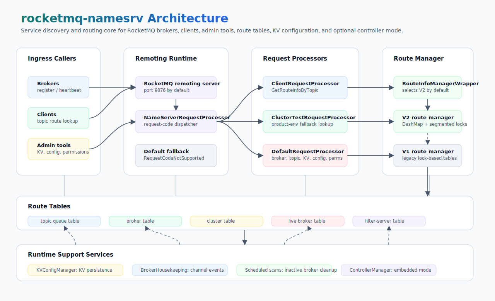

# rocketmq-namesrv

[English](README.md) | [简体中文](README-zh_cn.md)

RocketMQ NameServer implementation for [RocketMQ-Rust](../README.md).

`rocketmq-namesrv` provides lightweight service discovery and routing for
RocketMQ brokers, clients, and admin tools. It tracks broker liveness, topic
route metadata, broker membership, write permissions, KV configuration,
runtime configuration, and optional embedded controller integration. The
default route manager is the production-ready V2 implementation built around
concurrent tables and segmented locks.

This crate can run as the `rocketmq-namesrv-rust` binary or be embedded through
the `bootstrap::Builder` API for tests and service composition.

## Capabilities

| Area | What it provides |
| ---- | ---------------- |
| Service discovery | Broker registration, unregistration, heartbeat tracking, inactive broker scanning, and channel destroy cleanup. |
| Topic routing | Topic route lookup, standard/legacy JSON route encoding, zone-aware route filtering, filter-server metadata, and order-topic configuration lookup. |
| Route storage | `RouteInfoManagerWrapper` selects V2 DashMap-based tables by default, with the legacy V1 manager still available through configuration. |
| Broker and topic admin | Cluster info, broker member groups, topic registration/deletion, topic lists by cluster, unit-topic lists, and write-permission updates. |
| KV configuration | Put/get/delete/list KV config namespaces with on-disk persistence through `KVConfigManager`. |
| Runtime configuration | `GetNamesrvConfig` and `UpdateNamesrvConfig` support Java-properties payloads with a fixed blacklist for sensitive paths and home settings. |
| Cluster test mode | Optional product-environment route fallback via `DefaultMQAdminExtImpl` when local route data is missing. |
| Embedded controller | Optional `enableControllerInNamesrv` mode initializes and runs `rocketmq-controller` with conflict checks against the NameServer listen address. |
| Observability | Optional `observability` feature records route request counts/latency, broker registrations, and active broker gauges. |

## Architecture



`KVConfigManager` persists namespace config, `BrokerHousekeepingService` reacts
to channel events, scheduled tasks scan inactive brokers, and optional
`ControllerManager` runs when embedded-controller mode is enabled.

## Protocol Surface

| Category | Request codes |
| -------- | ------------- |
| Client route lookup | `GetRouteinfoByTopic` `105` |
| Broker lifecycle | `RegisterBroker` `103`, `UnregisterBroker` `104`, `BrokerHeartbeat` `904`, `GetBrokerMemberGroup` `901`, `QueryDataVersion` `322` |
| Cluster and broker admin | `GetBrokerClusterInfo` `106`, `WipeWritePermOfBroker` `205`, `AddWritePermOfBroker` `327` |
| Topic metadata | `GetAllTopicListFromNameserver` `206`, `DeleteTopicInNamesrv` `216`, `RegisterTopicInNamesrv` `217`, `GetTopicsByCluster` `224` |
| System and unit topics | `GetSystemTopicListFromNs` `304`, `GetUnitTopicList` `311`, `GetHasUnitSubTopicList` `312`, `GetHasUnitSubUnunitTopicList` `313` |
| KV config | `PutKvConfig` `100`, `GetKvConfig` `101`, `DeleteKvConfig` `102`, `GetKvlistByNamespace` `219` |
| Runtime config | `UpdateNamesrvConfig` `318`, `GetNamesrvConfig` `319` |

Unsupported request codes return `RequestCodeNotSupported` from the default processor.

## Requirements

- Rust `1.85.0` or newer.
- The repository toolchain from [`../rust-toolchain.toml`](../rust-toolchain.toml).
- `ROCKETMQ_HOME` or `--rocketmqHome` must be set for a normal binary startup.
- Port `9876` is the default NameServer listen port.
- A broker is not required to start the NameServer, but broker registration is
  required before client route queries can return topic metadata.

## Installation

Inside this workspace:

```toml
[dependencies]
rocketmq-namesrv = { path = "../rocketmq-namesrv" }
```

For external consumers:

```toml
[dependencies]
rocketmq-namesrv = "1.0.0"
```

Enable NameServer metrics integration:

```toml
[dependencies]
rocketmq-namesrv = { version = "1.0.0", features = ["observability"] }
```

## Quick Start

Show the CLI options:

```bash
cargo run -p rocketmq-namesrv --bin rocketmq-namesrv-rust -- --help
```

Start with command-line overrides:

```bash
cargo run -p rocketmq-namesrv --bin rocketmq-namesrv-rust -- \
  --rocketmqHome /opt/rocketmq \
  --listenPort 9876 \
  --bindAddress 0.0.0.0
```

Start from the example configuration file:

```bash
cargo run -p rocketmq-namesrv --bin rocketmq-namesrv-rust -- \
  -c rocketmq-namesrv/resource/namesrv-example.toml
```

Print the merged configuration and exit:

```bash
cargo run -p rocketmq-namesrv --bin rocketmq-namesrv-rust -- \
  -c rocketmq-namesrv/resource/namesrv-example.toml \
  -p
```

Configuration precedence is:

1. Built-in defaults.
2. Configuration file passed with `-c` / `--configFile`.
3. Command-line overrides such as `--listenPort`, `--bindAddress`,
   `--rocketmqHome`, and `--kvConfigPath`.

## Configuration

The example file
[`resource/namesrv-example.toml`](resource/namesrv-example.toml) documents the
supported keys. The configuration model accepts Java-style camelCase keys and
Rust-style field names where serde aliases are defined.

| Key | Default | Purpose |
| --- | ------- | ------- |
| `rocketmqHome` | `ROCKETMQ_HOME` / `ROCKETMQ_HOME_PROPERTY` | RocketMQ home directory used by the runtime. |
| `kvConfigPath` | `~/rocketmq-namesrv/kvConfig.json` | Persisted KV config file. |
| `configStorePath` | `~/rocketmq-namesrv/rocketmq-namesrv.properties` | Runtime config persistence path. |
| `listenPort` | `9876` | Remoting server port, configured through `ServerConfig` or CLI. |
| `bindAddress` | `0.0.0.0` | Remoting server bind address, configured through `ServerConfig` or CLI. |
| `scanNotActiveBrokerInterval` | `5000` | Broker inactivity scan interval in milliseconds. |
| `useRouteInfoManagerV2` | `true` | Enables the DashMap-based route manager. |
| `enableControllerInNamesrv` | `false` | Runs an embedded controller alongside the NameServer. |
| `clusterTest` | `false` | Enables product-environment route fallback. |
| `orderMessageEnable` | `false` | Adds `ORDER_TOPIC_CONFIG` data to route responses. |
| `configBlackList` | `configBlackList;configStorePath;kvConfigPath` | Additional runtime config keys that cannot be updated remotely. |

`UpdateNamesrvConfig` also rejects a fixed protected set that includes `rocketmqHome`, `kvConfigPath`,
`configStorePath`, and `configBlackList`.

## Embedded Usage

Use `bootstrap::Builder` when embedding the NameServer in tests or higher-level
services:

```rust
use rocketmq_common::common::namesrv::namesrv_config::NamesrvConfig;
use rocketmq_common::common::server::config::ServerConfig;
use rocketmq_namesrv::bootstrap::Builder;

async fn run_namesrv() -> rocketmq_error::RocketMQResult<()> {
    let namesrv_config = NamesrvConfig {
        rocketmq_home: "/opt/rocketmq".to_string(),
        use_route_info_manager_v2: true,
        ..NamesrvConfig::default()
    };

    let server_config = ServerConfig {
        listen_port: 9876,
        bind_address: "0.0.0.0".to_string(),
        ..ServerConfig::default()
    };

    Builder::new()
        .set_name_server_config(namesrv_config)
        .set_server_config(server_config)
        .build()
        .boot()
        .await
}
```

For deterministic tests, use `boot_with_shutdown(...)` to provide an explicit
shutdown future.

## Crate Layout

| Path | Purpose |
| ---- | ------- |
| [`src/bin/namesrv_bootstrap_server.rs`](src/bin/namesrv_bootstrap_server.rs) | CLI entry point, config merge, embedded-controller config loading, and startup validation. |
| [`src/bootstrap.rs`](src/bootstrap.rs) | Runtime lifecycle, server startup, processor registration, scheduled broker scans, remoting client, and graceful shutdown. |
| [`src/processor.rs`](src/processor.rs) | Request processor dispatcher and route request metrics hook. |
| [`src/processor/default_request_processor.rs`](src/processor/default_request_processor.rs) | Broker, topic, KV, permission, and runtime config request handling. |
| [`src/processor/client_request_processor.rs`](src/processor/client_request_processor.rs) | Client topic-route lookup path. |
| [`src/processor/cluster_test_request_processor.rs`](src/processor/cluster_test_request_processor.rs) | Cluster-test route lookup with product environment fallback. |
| [`src/route`](src/route) | Route managers, segmented locks, route table implementations, unregister service, and zone route hook. |
| [`src/route/tables`](src/route/tables) | Concurrent tables for topic queues, brokers, clusters, live brokers, filter servers, and topic queue mapping. |
| [`src/kvconfig`](src/kvconfig) | KV config manager and persistence. |
| [`src/observability_metrics.rs`](src/observability_metrics.rs) | Optional metrics recording behind the `observability` feature. |
| [`tests`](tests) | Network-level and route-table integration coverage. |
| [`benches`](benches) | Route manager, concurrency, lock, and topic-table hot-path benchmarks. |

## Feature Flags

| Feature | Purpose |
| ------- | ------- |
| `observability` | Enables NameServer metrics through `rocketmq-observability/otel-metrics`. |

## Validation

Start with the smallest command that matches the changed area:

| Change area | Focused validation |
| ------------ | ------------------ |
| Route table implementations under `src/route/tables` | `cargo test -p rocketmq-namesrv route::tables` |
| Default request processor behavior | `cargo test -p rocketmq-namesrv default_request_processor` |
| NameServer configuration parsing | `cargo test -p rocketmq-namesrv namesrv_config_parse` |
| Route manager integration | `cargo test -p rocketmq-namesrv --test route_info_manager_integration` |
| Topic-table index equivalence | `cargo test -p rocketmq-namesrv --test topic_table_index_equivalence` |
| Benchmark code | `cargo test -p rocketmq-namesrv --benches --no-run` |

For changes spanning multiple library areas, run the crate's full library test suite:

```bash
cargo test -p rocketmq-namesrv --lib
```

Workspace-level Rust validation is run from the repository root when Rust code changes:

```bash
cargo fmt --all
cargo clippy --workspace --no-deps --all-targets --all-features -- -D warnings
```

## Benchmarks

Run focused benchmarks from the workspace root:

```bash
cargo bench -p rocketmq-namesrv --bench route_manager_benchmark
cargo bench -p rocketmq-namesrv --bench route_concurrency_bench
cargo bench -p rocketmq-namesrv --bench async_segmented_lock_bench
cargo bench -p rocketmq-namesrv --bench topic_table_hot_path_bench
```

Keep benchmark comparisons on the same toolchain, hardware, route table size,
broker count, and topic distribution.

## License

RocketMQ-Rust is licensed under the Apache License 2.0. See [../LICENSE-APACHE](../LICENSE-APACHE).
