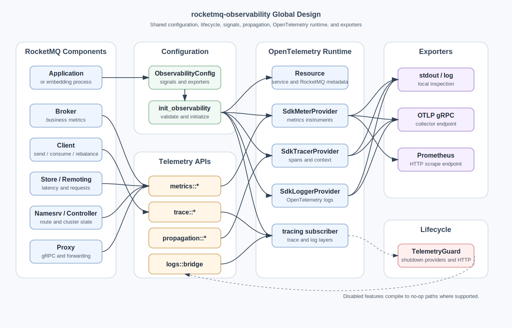

# rocketmq-observability

[English](README.md)

`rocketmq-observability` 是 rocketmq-rust 工作区的共享可观测性基础库。它统一管理配置模型、OpenTelemetry provider 生命周期、资源元数据、指标名称、链路传播、日志桥接和 exporter 组装。

该 crate 默认不启用任何可观测性 feature。Broker、Client、Store、Remoting、NameServer、Controller、Proxy 等业务组件保留自己的埋点位置，然后通过本 crate 将 metrics、traces 和 logs 发布到统一的 OpenTelemetry 管道。

## 提供能力

- 使用 `ObservabilityConfig` 统一描述 metrics、traces、logs、OTLP、Prometheus、资源属性、采样率和 trace 传播配置。
- 使用 `init_observability` 和 `TelemetryGuard` 管理进程级 telemetry 初始化与关闭。
- 为 broker、client、store、remoting、nameserver、controller 和 proxy 提供按角色拆分的 metrics API。
- 提供消息属性记录、span 名称和 RocketMQ 消息属性中的 producer 到 consumer trace context 传播能力。
- 支持本地日志输出、OTLP gRPC 和 Prometheus scrape 三类导出路径。
- 在未开启可选 telemetry feature 时提供 no-op 路径。

Broker 侧配置、OpenTelemetry Collector、Prometheus、Tracing、Logs 和 Grafana Dashboard 的使用说明见 `../rocketmq-website/docs/configuration/observability.md`。

## 架构图



整体流程是：应用或 RocketMQ 组件构造 `ObservabilityConfig`，调用 `init_observability`，并持有返回的 `TelemetryGuard`。组件运行时通过角色化 API 记录 metrics 和 traces。配置好的 OpenTelemetry provider 会将数据导出到本地日志、OTLP collector 或 Prometheus 端点。

## 快速开始

只启用当前需要的 signal 和 exporter。

```toml
[dependencies]
rocketmq-observability = {
  path = "../rocketmq-observability",
  features = ["otlp-metrics", "otlp-traces"]
}
```

在进程启动阶段初始化一次：

```rust
use rocketmq_observability::config::{MetricsExporter, ObservabilityConfig, TraceExporter};

fn main() -> Result<(), rocketmq_observability::ObservabilityError> {
    let mut config = ObservabilityConfig {
        enabled: true,
        service_name: "rocketmq-broker".to_string(),
        service_namespace: "rocketmq".to_string(),
        cluster: "DefaultCluster".to_string(),
        node_type: "broker".to_string(),
        node_id: "broker-a".to_string(),
        ..ObservabilityConfig::default()
    };

    config.metrics.enabled = true;
    config.metrics.exporter = MetricsExporter::OtlpGrpc;
    config.metrics.export_interval_millis = 5_000;

    config.traces.enabled = true;
    config.traces.exporter = TraceExporter::OtlpGrpc;
    config.traces.sample_ratio = 1.0;

    config.otlp.endpoint = "http://127.0.0.1:4317".to_string();

    let telemetry_guard = rocketmq_observability::init_observability(&config)?;

    // 启动 RocketMQ 组件并记录 telemetry。

    telemetry_guard.shutdown()
}
```

如果只是本地查看，不想启动 collector，可以在启用 `otel-metrics` 和 `otel-traces` 后使用 `MetricsExporter::Log` 和 `TraceExporter::Log`。

## 运行时流程

1. 嵌入方应用构造 `ObservabilityConfig`。
2. `init_observability` 校验配置，并应用 trace 消息字段记录开关。
3. 按需创建 signal provider：`SdkMeterProvider`、`SdkTracerProvider`、`SdkLoggerProvider`。
4. 安装全局 OpenTelemetry meter 和 tracer provider。
5. 在启用 trace propagation 时安装 trace context propagator。
6. 尽可能安装用于 traces 和 logs 的 `tracing_subscriber` layer。
7. 组件通过 `metrics::*`、`trace::*`、`propagation::*` 和普通 `tracing` event 记录数据。
8. `TelemetryGuard::shutdown` 负责 flush 并关闭 providers 和 Prometheus HTTP endpoint。

本 crate 应在一个进程中初始化一次。OpenTelemetry 全局 provider 和 `tracing_subscriber` 都是进程级状态，因此 producer、consumer、broker 和 proxy 等组件应只负责记录 telemetry，不应各自重复初始化 runtime。

## Feature 矩阵

默认 feature 集为空。

| Feature | 用途 |
| --- | --- |
| `observability` | 便捷 feature，同时启用 `otel-metrics` 和 `otel-traces`。 |
| `otel-metrics` | 启用 OpenTelemetry metrics API、SDK 类型、provider 和真实指标 instruments。 |
| `otel-traces` | 启用 OpenTelemetry tracing、tracing-opentelemetry、span helpers 和消息上下文传播。 |
| `otel-logs` | 启用 OpenTelemetry logs 以及 `tracing` 到 OpenTelemetry logs 的桥接。 |
| `otlp-metrics` | 通过 OTLP gRPC 导出 metrics，隐含 `otel-metrics` 和 `otlp-grpc`。 |
| `otlp-traces` | 通过 OTLP gRPC 导出 traces，隐含 `otel-traces` 和 `otlp-grpc`。 |
| `otlp-logs` | 通过 OTLP gRPC 导出 logs，隐含 `otel-logs` 和 `otlp-grpc`。 |
| `prometheus` | 通过 Prometheus reader 和 HTTP scrape endpoint 导出 metrics，隐含 `otel-metrics`。 |
| `stdout` | 兼容性 feature。运行时日志输出由 `MetricsExporter::Log`、`TraceExporter::Log` 或 `LogsExporter::Log` 选择。 |

如果运行时配置请求了未启用 feature 的 exporter，`init_observability` 会返回 `ObservabilityError::FeatureDisabled`。
`ObservabilityError` 由 `rocketmq-error` 托管，并由 `rocketmq-observability` 重新导出以保持兼容。

## 模块职责

| 模块 | 职责 |
| --- | --- |
| `config` | 可序列化配置模型，覆盖全局开关、资源、metrics、traces、logs、OTLP 和 Prometheus。 |
| `init` | 配置校验、provider 构造、全局 runtime 安装和关闭生命周期。 |
| `resource` | 构建 OpenTelemetry resource 元数据，例如 service name、namespace、version、environment、cluster、node type 和 node id。 |
| `semantic` | 共享 metric 名称、label 名称、trace header 和 trace attribute 名称。 |
| `metrics` | 按 RocketMQ 角色拆分的 metric wrapper 和全局 recorders。 |
| `metrics::labels` | topic、consumer group 等 label 的基数保护。 |
| `trace` | span 名称、tracing layer 构造和消息属性记录。 |
| `propagation` | 通过 RocketMQ 消息属性注入和提取 W3C `traceparent`、`tracestate` 和 `baggage`。 |
| `logs` | 将 `tracing` events 桥接到 OpenTelemetry logs。 |
| `exporter` | 本地日志输出、OTLP gRPC 和 Prometheus exporter 实现。 |
| `attributes` | RocketMQ 组件共享的轻量基础 metric attributes。 |
| `noop` | telemetry 关闭路径使用的 no-op counter 和 histogram helpers。 |

## Metrics 归属

Metrics 按 RocketMQ 角色拆分：

| 模块 | 指标 |
| --- | --- |
| `metrics::broker` | 消息进出、吞吐进出、消息大小、发送延迟、被丢弃的指标 label。 |
| `metrics::client` | 客户端发送次数/延迟、消费次数/延迟、rebalance 事件。 |
| `metrics::store` | append 延迟、flush 延迟、dispatch 延迟、磁盘使用量。 |
| `metrics::remoting` | 请求数、请求延迟、网络字节数。 |
| `metrics::namesrv` | 路由请求次数/延迟、broker 注册数、活跃 broker 数。 |
| `metrics::controller` | 选举次数/延迟、leader 变更、活跃 broker 数。 |
| `metrics::proxy` | gRPC 请求次数/延迟、转发延迟、活跃连接数。 |

大多数角色模块提供两种使用方式：

- `init_global(meter)` 加 `record_*` 函数，适合简单的全局记录器。
- `*Metrics::new(meter)` 结构体，适合组件自己持有 instruments。

当 `otel-metrics` 未启用时，支持 no-op 的 API 会编译为无操作路径。

## Tracing 和传播

Tracing 基于 `tracing` span 和 OpenTelemetry tracing layer。通用 span 名称位于 `trace::span_names`，角色模块提供各自的领域常量。

消息传播遵循 W3C trace context 模型：

1. Producer 通过 `propagation::inject_current_context_into_message` 将当前 context 注入 RocketMQ 消息属性。
2. Broker 和 Consumer 通过 `propagation::set_current_span_parent_from_message` 或 `set_span_parent_from_message` 提取 parent context。
3. message id、keys、body size 等可选字段是否记录由 `TracesConfig` 控制。

当嵌入组件启用 trace propagation 后，producer、broker、store 和 consumer 的 spans 可以进入同一条 trace。

## Exporter 路径

| 运行时 exporter | 需要的 feature | 目标 |
| --- | --- | --- |
| `MetricsExporter::Log` | `otel-metrics` | 定期把 metrics snapshot 输出到本地日志。 |
| `MetricsExporter::OtlpGrpc` | `otlp-metrics` | OTLP gRPC collector endpoint。 |
| `MetricsExporter::Prometheus` | `prometheus` | 由 `PrometheusConfig` 配置的 HTTP scrape endpoint。 |
| `TraceExporter::Log` | `otel-traces` | 将 spans 输出到本地日志。 |
| `TraceExporter::OtlpGrpc` | `otlp-traces` | OTLP gRPC collector endpoint。 |
| `LogsExporter::Log` | `otel-logs` | 将 OpenTelemetry logs 输出到本地日志。 |
| `LogsExporter::OtlpGrpc` | `otlp-logs` | OTLP gRPC collector endpoint。 |

## Client 集成注意事项

`rocketmq-client-rust` 对 client 埋点使用独立 feature：

- `observability` 启用 trace 埋点。
- `observability-metrics` 启用 client metrics 埋点。
- `otlp-traces` 转发 trace OTLP 导出能力。

如果要通过 OTLP 导出 client metrics，应用还需要直接依赖 `rocketmq-observability` 并启用 `otlp-metrics`，因为 client crate 当前没有转发 `otlp-metrics` feature。

```toml
[dependencies]
rocketmq-client-rust = {
  path = "../rocketmq-client",
  features = ["observability-metrics", "otlp-traces"]
}

rocketmq-observability = {
  path = "../rocketmq-observability",
  features = ["otlp-metrics", "otlp-traces"]
}
```

## 开发校验

纯文档变更不需要 Cargo 校验。如果修改本 crate 的 Rust 代码，需要从仓库根目录运行仓库要求的校验命令：

```bash
cargo fmt --all
cargo clippy --workspace --no-deps --all-targets --all-features -- -D warnings
```
