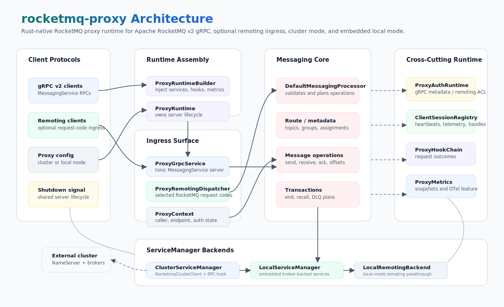

# rocketmq-proxy

[](https://crates.io/crates/rocketmq-proxy)
[](../LICENSE-APACHE)

`rocketmq-proxy` is the RocketMQ proxy runtime for the
[rocketmq-rust](https://github.com/mxsm/rocketmq-rust) workspace. It exposes
the Apache RocketMQ v2 gRPC `MessagingService`, provides an optional remoting
compatibility ingress, and routes proxy operations to either an existing
RocketMQ cluster or an embedded local broker runtime.

This crate is intended for users who need a Rust-native RocketMQ proxy process
and for contributors working on the proxy, auth, client, broker, and remoting
integration surface.

[中文文档](README-zh_cn.md)

## Capabilities

- gRPC proxy runtime for the Apache RocketMQ v2 `MessagingService` protocol.
- Cluster mode that talks to NameServer and broker nodes through
  `rocketmq-client-rust` and `rocketmq-remoting`.
- Local mode that starts an embedded broker-backed service manager for
  development, integration tests, and single-process deployments.
- Optional remoting ingress for common RocketMQ client request codes.
- Authentication and authorization integration through `rocketmq-auth`,
  including gRPC metadata authentication, remoting ACL signatures, ACL file
  reload, and cluster metadata lookup.
- Session management for heartbeats, client settings, receipt handles, lite
  subscriptions, telemetry links, prepared transactions, and client
  termination.
- Request hooks and in-memory metrics snapshots, with optional OpenTelemetry
  metric emission behind the `observability` feature.

## Architecture



The runtime is assembled by `ProxyRuntimeBuilder`:

- `ProxyRuntime` owns the process lifecycle and starts the gRPC server.
- `ProxyGrpcService` implements the generated v2 `MessagingService` server.
- `ProxyRemotingDispatcher` adapts selected remoting request codes to the same
  processor model when remoting ingress is enabled.
- `DefaultMessagingProcessor` validates requests and delegates route, metadata,
  assignment, message, consumer, and transaction work to a `ServiceManager`.
- `ClusterServiceManager` forwards work to the configured RocketMQ cluster.
- `LocalServiceManager` runs against an embedded broker facade.

## Protocol Surface

### gRPC

The generated gRPC service is built from [`proto/service.proto`](proto/service.proto)
and currently implements:

| RPC | Purpose |
| --- | --- |
| `QueryRoute` | Resolve topic route data. |
| `Heartbeat` | Register and refresh client session state. |
| `SendMessage` | Send single or batched messages. |
| `QueryAssignment` | Resolve consumer queue assignment. |
| `ReceiveMessage` | Stream pop-style receive responses. |
| `AckMessage` | Acknowledge received messages and clear tracked handles. |
| `ForwardMessageToDeadLetterQueue` | Move messages to DLQ. |
| `PullMessage` | Stream pull responses for queue-based consumption. |
| `UpdateOffset`, `GetOffset`, `QueryOffset` | Manage consumer progress. |
| `EndTransaction` | Commit or roll back prepared transaction state. |
| `Telemetry` | Exchange client settings and server-side commands. |
| `NotifyClientTermination` | Clear session-owned proxy state. |
| `ChangeInvisibleDuration` | Renew or update receipt handles. |
| `RecallMessage` | Recall delayed messages when supported by the backend. |
| `SyncLiteSubscription` | Track lite subscription membership. |

### Remoting Ingress

Remoting ingress is disabled by default. When enabled, the proxy listens on the
configured remoting address and handles the common client-facing request codes:

- route and assignment: `GetRouteinfoByTopic`, `QueryAssignment`
- producer: `SendMessage`, `SendMessageV2`, `SendBatchMessage`
- client lifecycle: `HeartBeat`, `UnregisterClient`, `CheckClientConfig`
- consumer membership and notifications: `GetConsumerListByGroup`,
  `NotifyConsumerIdsChanged`, `NotifyUnsubscribeLite`
- consumer operations: `PullMessage`, `LitePullMessage`, `UpdateConsumerOffset`,
  `QueryConsumerOffset`, `GetMaxOffset`, `GetMinOffset`,
  `SearchOffsetByTimestamp`
- lite metadata: `GetBrokerLiteInfo`, `GetParentTopicInfo`,
  `GetLiteTopicInfo`, `GetLiteGroupInfo`
- local-mode passthrough: `LockBatchMq`, `UnlockBatchMq`

Auth administration request codes are intentionally rejected by the proxy
remoting ingress and should be sent to broker administration endpoints.

## Requirements

- Rust `1.85.0` or newer, matching the workspace toolchain.
- A reachable RocketMQ NameServer for cluster mode.
- Writable local storage for local mode and file-based auth metadata.
- Optional: an OpenTelemetry metrics pipeline when the `observability` feature
  is enabled.

## Installation

From the workspace root:

```bash
cargo build -p rocketmq-proxy
```

The binary target is `rocketmq-proxy-rust`:

```bash
cargo run -p rocketmq-proxy --bin rocketmq-proxy-rust -- --help
```

## Quick Start

### Cluster Mode

Start a proxy that exposes gRPC on `0.0.0.0:8081` and uses an existing
NameServer:

```bash
cargo run -p rocketmq-proxy --bin rocketmq-proxy-rust -- \
  --mode cluster \
  --namesrvAddr 127.0.0.1:9876 \
  --grpcListenAddr 0.0.0.0:8081
```

Print the effective startup configuration without binding sockets:

```bash
cargo run -p rocketmq-proxy --bin rocketmq-proxy-rust -- \
  --namesrvAddr 127.0.0.1:9876 \
  --printConfig
```

### Local Mode

Start the proxy with an embedded broker-backed service manager:

```bash
cargo run -p rocketmq-proxy --bin rocketmq-proxy-rust -- \
  --mode local \
  --grpcListenAddr 127.0.0.1:8081
```

Local mode is useful for development and integration scenarios where a
single-process proxy plus broker runtime is preferred.

### Enable Remoting Ingress

```bash
cargo run -p rocketmq-proxy --bin rocketmq-proxy-rust -- \
  --mode cluster \
  --namesrvAddr 127.0.0.1:9876 \
  --grpcListenAddr 0.0.0.0:8081 \
  --enableRemoting \
  --remotingListenAddr 0.0.0.0:8080
```

## Configuration

The proxy can load a TOML, YAML, JSON, or other format supported by the
[`config`](https://docs.rs/config/) crate:

```bash
cargo run -p rocketmq-proxy --bin rocketmq-proxy-rust -- -c proxy.toml
```

CLI options override the loaded file for the fields they control:

```text
rocketmq-proxy-rust [-c <proxy.toml>] [--mode cluster|local]
  [--grpcListenAddr <host:port>]
  [--enableRemoting] [--remotingListenAddr <host:port>]
  [--namesrvAddr <host:port>] [--printConfig]
```

Example TOML:

```toml
mode = "cluster"
enableAclRpcHookForClusterMode = true

[grpc]
listenAddr = "0.0.0.0:8081"
maxDecodingMessageSize = 8388608
maxEncodingMessageSize = 8388608
concurrencyLimitPerConnection = 256
useEndpointPortFromRequest = false

[remoting]
enabled = true
listenAddr = "0.0.0.0:8080"

[cluster]
namesrvAddr = "127.0.0.1:9876"
brokerClusterName = "DefaultCluster"
instanceName = "rocketmq-proxy-cluster"
mqClientApiTimeoutMs = 3000
queryAssignmentStrategyName = "AVG"
producerGroupPrefix = "PROXY_SEND"
sendMessageTimeoutMs = 3000
routeCacheTtlMs = 5000
metadataCacheTtlMs = 5000

[local]
brokerClusterName = "DefaultCluster"
brokerName = "rocketmq-proxy-local"
brokerIp = "127.0.0.1"
brokerListenPort = 10911
storeRootDir = "store/proxy/local-broker"

[runtime]
routePermits = 512
producerPermits = 1024
consumerPermits = 1024
clientManagerPermits = 512

[session]
clientTtlMs = 60000
receiptHandleTtlMs = 300000
autoRenewEnabled = true
minLongPollingTimeoutMs = 5000
maxLongPollingTimeoutMs = 20000

[auth]
authenticationEnabled = false
authorizationEnabled = false
authConfigPath = "store/proxy/auth"
aclFile = ""
aclFileWatchEnabled = false
```

### Important Settings

| Setting | Default | Description |
| --- | --- | --- |
| `mode` | `cluster` | `cluster` forwards to a RocketMQ cluster; `local` uses the embedded broker-backed service manager. |
| `grpc.listenAddr` | `0.0.0.0:8081` | gRPC bind address for the v2 `MessagingService`. |
| `remoting.enabled` | `false` | Enables the remoting compatibility ingress. |
| `remoting.listenAddr` | `0.0.0.0:8080` | Remoting bind address when enabled. |
| `cluster.namesrvAddr` | unset | NameServer address used by cluster mode. |
| `cluster.routeCacheTtlMs` | `5000` | Route cache TTL used by cluster clients. |
| `cluster.metadataCacheTtlMs` | `5000` | Metadata cache TTL used by cluster clients and auth metadata refresh. |
| `enableAclRpcHookForClusterMode` | `false` | Adds the proxy inner credentials as an ACL RPC hook for cluster calls. |
| `runtime.*Permits` | varies | Per-area concurrency guards for route, producer, consumer, and client-manager RPCs. |
| `session.clientTtlMs` | `60000` | Client session TTL. |
| `session.receiptHandleTtlMs` | `300000` | Receipt handle tracking TTL. |
| `auth.authenticationEnabled` | `false` | Enables request authentication. |
| `auth.authorizationEnabled` | `false` | Enables ACL authorization. |

## Authentication

`ProxyAuthRuntime` maps proxy auth settings to `rocketmq-auth` and is shared by
gRPC and remoting ingress:

- gRPC requests use metadata such as `authorization`, `x-mq-date-time`,
  `channel-id`, and `x-mq-client-id`.
- Remoting requests use RocketMQ ACL fields such as `AccessKey` and `Signature`.
- ACL file settings support local metadata and optional watcher-based reload.
- In cluster mode, auth metadata can be refreshed through broker metadata APIs.

Sensitive embedded credentials are redacted from `ProxyAuthConfig` debug output.

## Using as a Library

The runtime can be embedded and customized in tests, tools, or higher-level
servers:

```rust
use rocketmq_proxy::{ProxyConfig, ProxyRuntime};

#[tokio::main]
async fn main() -> rocketmq_proxy::ProxyResult<()> {
    let config = ProxyConfig::default();

    ProxyRuntime::builder(config)
        .build()
        .serve()
        .await
}
```

Use `ProxyRuntime::builder` to inject a custom `ServiceManager`,
`ClientSessionRegistry`, `ProxyAuthRuntime`, request hooks, metrics, or remoting
backend.

## Crate Layout

```text
rocketmq-proxy/
  proto/                 Apache RocketMQ v2 protobuf definitions
  src/bin/               rocketmq-proxy-rust binary entry point
  src/bootstrap.rs       ProxyRuntime and ProxyRuntimeBuilder
  src/config.rs          Runtime, cluster, local, session, remoting, auth config
  src/grpc/              gRPC server, service implementation, adapter, middleware
  src/remoting.rs        Optional remoting ingress and request-code dispatcher
  src/cluster.rs         Cluster-mode client bridge
  src/local.rs           Embedded broker-backed local mode
  src/service.rs         Service traits and default/cluster/local managers
  src/session.rs         Client sessions, telemetry, receipt handles, lite subscriptions
  src/auth.rs            Proxy authentication and authorization integration
  src/observability.rs   Hooks, in-memory metrics, optional OTel metric records
  tests/                 gRPC and remoting ingress integration tests
```

## Feature Flags

| Feature | Description |
| --- | --- |
| `observability` | Enables integration with `rocketmq-observability` OpenTelemetry metrics. |
| `tieredstore` | Propagates tiered-store support to broker and store dependencies. |

The default feature set is intentionally empty.

## Validation

Useful checks for this crate:

```bash
cargo test -p rocketmq-proxy --lib
cargo test -p rocketmq-proxy --test grpc_ingress --test remoting_ingress
cargo clippy -p rocketmq-proxy --all-targets --all-features -- -D warnings
```

For repository-wide Rust changes, run the workspace validation from the root:

```bash
cargo fmt --all
cargo clippy --workspace --no-deps --all-targets --all-features -- -D warnings
```

## License

Licensed under the [Apache License, Version 2.0](../LICENSE-APACHE).
