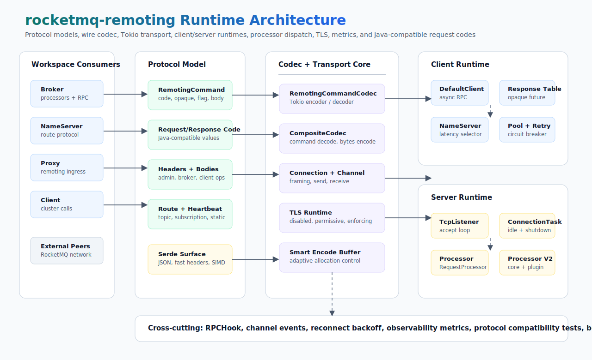

# rocketmq-remoting

[](https://crates.io/crates/rocketmq-remoting)
[](../LICENSE-APACHE)

`rocketmq-remoting` is the wire protocol, codec, client transport, and server
runtime foundation used by the
[rocketmq-rust](https://github.com/mxsm/rocketmq-rust) workspace. It models
RocketMQ remoting commands, Java-compatible request and response codes,
headers, bodies, route metadata, heartbeat payloads, RPC hooks, Tokio
connections, connection pools, TLS transport, and request processor dispatch.

This crate is the shared remoting layer behind `rocketmq-client-rust`,
`rocketmq-broker`, `rocketmq-namesrv`, `rocketmq-proxy`, and controller-facing
protocol integrations.

[中文文档](README-zh_cn.md)

## Architecture



The crate is organized around five layers:

- **Protocol model**: `RemotingCommand`, `RequestCode`, response codes,
  command headers, command bodies, route data, heartbeat data, topic metadata,
  subscription metadata, broker metadata, controller metadata, and auth-related
  protocol structures.
- **Codec and transport**: Tokio `Encoder`/`Decoder` implementations,
  framed command IO, `Connection`, `Channel`, TLS accept/connect helpers, and
  adaptive encode buffers.
- **Client runtime**: `RocketmqDefaultClient`, NameServer address selection,
  connection reuse, request multiplexing by `opaque`, reconnect backoff,
  circuit breakers, and optional connection-pool metrics.
- **Server runtime**: TCP accept loop, per-connection tasks, idle detection,
  graceful shutdown wiring, channel events, and `RequestProcessor` dispatch.
- **Extension points**: RPC hooks, `RequestProcessorV2` core/plugin dispatch,
  observability counters, SIMD JSON support, and public re-export/prelude
  surfaces.

## Capabilities

- RocketMQ remoting frame encoding and decoding through
  `RemotingCommandCodec`.
- Java-compatible request and response code definitions, including broker,
  NameServer, controller, lite subscription, POP, auth, and cold-data request
  ranges.
- Rich protocol models for common RocketMQ headers and bodies.
- Async remoting client with NameServer list management, request/response
  correlation, one-way calls, background scans, RPC hooks, and graceful
  shutdown.
- Optional enhanced `ConnectionPool` with metrics, idle cleanup, utilization
  statistics, and health tracking.
- Tokio remoting server with connection lifecycle management and request
  processors.
- TLS support enabled by default, with runtime support for disabled,
  permissive, and enforcing server modes.
- GAT-based `RequestProcessorV2` for zero-allocation core dispatch plus dynamic
  plugin processors for extension paths.
- Optional SIMD JSON parsing support through the `simd` feature.
- Optional OpenTelemetry metric emission through the `observability` feature.

## Protocol Compatibility

The protocol compatibility suite keeps the Rust model aligned with Apache
RocketMQ's Java remoting protocol:

- 169 Java request codes are asserted as protocol-defined.
- 63 Java response codes are round-tripped.
- Legacy Rust ACL request-code aliases are preserved.
- Unknown request codes remain `RequestCode::Unknown`.
- Request and response command codec round trips preserve wire fields,
  `opaque`, flags, remarks, headers, and bodies.

See [`tests/protocol_compatibility_tests.rs`](tests/protocol_compatibility_tests.rs)
for the executable compatibility baseline.

## Requirements

- The repository Rust toolchain. The workspace currently uses the `nightly`
  channel because this crate uses `impl_trait_in_assoc_type` for
  `RequestProcessorV2`.
- Tokio runtime for async client and server usage.
- Optional TLS certificate material when enabling strict TLS server modes.

## Installation

From the workspace root:

```bash
cargo build -p rocketmq-remoting
```

As a workspace dependency:

```toml
[dependencies]
rocketmq-remoting = { path = "../rocketmq-remoting" }
```

With optional features:

```toml
[dependencies]
rocketmq-remoting = { path = "../rocketmq-remoting", features = ["simd", "observability"] }
```

## Quick Start

### Encode and Decode a Command

```rust
use bytes::{Bytes, BytesMut};
use rocketmq_remoting::codec::remoting_command_codec::RemotingCommandCodec;
use rocketmq_remoting::protocol::header::client_request_header::GetRouteInfoRequestHeader;
use rocketmq_remoting::protocol::remoting_command::RemotingCommand;
use rocketmq_remoting::RequestCode;
use tokio_util::codec::{Decoder, Encoder};

fn main() -> rocketmq_error::RocketMQResult<()> {
    let command = RemotingCommand::create_request_command(
        RequestCode::GetRouteinfoByTopic,
        GetRouteInfoRequestHeader::new("TopicA", Some(true)),
    )
    .set_body(Bytes::from_static(b"payload"));

    let mut codec = RemotingCommandCodec::new();
    let mut buffer = BytesMut::new();

    codec.encode(command, &mut buffer)?;
    let decoded = codec.decode(&mut buffer)?.expect("complete frame");

    assert_eq!(decoded.request_code(), RequestCode::GetRouteinfoByTopic);
    assert_eq!(decoded.body().map(|body| body.as_ref()), Some(&b"payload"[..]));

    Ok(())
}
```

### Use the Prelude

```rust
use rocketmq_remoting::prelude::*;

let header = PullMessageRequestHeader::default();
let command = RemotingCommand::create_request_command(RequestCode::PullMessage, header);

assert_eq!(command.request_code(), RequestCode::PullMessage);
```

### Create a Client Runtime

```rust
use std::sync::Arc;

use cheetah_string::CheetahString;
use rocketmq_remoting::clients::rocketmq_tokio_client::RocketmqDefaultClient;
use rocketmq_remoting::request_processor::default_request_processor::DefaultRemotingRequestProcessor;
use rocketmq_remoting::runtime::config::client_config::TokioClientConfig;
use rocketmq_remoting::clients::RemotingClient;

# async fn example() {
let client = RocketmqDefaultClient::new(
    Arc::new(TokioClientConfig::default()),
    DefaultRemotingRequestProcessor,
);

client
    .update_name_server_address_list(vec![CheetahString::from("127.0.0.1:9876")])
    .await;
# }
```

### Run the Connection Pool Example

```bash
cargo run -p rocketmq-remoting --example connection_pool_usage
```

## Core API Surface

| Area | Important Types |
| --- | --- |
| Protocol command | `RemotingCommand`, `RemotingCommandType`, `SerializeType`, `LanguageCode` |
| Codes | `RequestCode`, `ResponseCode`, `RemotingSysResponseCode` |
| Codec | `RemotingCommandCodec`, `CompositeCodec`, `EncodeBuffer` |
| Client | `RemotingClient`, `RocketmqDefaultClient`, `TokioClientConfig`, `ConnectionPool` |
| Server | `rocketmq_tokio_server::run`, `RocketMQServer`, `ConnectionHandler` |
| Runtime hooks | `RemotingService`, `RPCHook`, `InvokeCallback` |
| Processing | `RequestProcessor`, `RequestProcessorV2`, `ProcessorDispatcher`, `PluginProcessorRegistry` |
| Protocol models | headers, bodies, route data, static topic mapping, heartbeat, subscriptions, broker metadata |
| TLS | `TlsConfig`, `TlsMode`, `TlsServerRuntime`, TLS connect and accept helpers |

## Feature Flags

| Feature | Default | Description |
| --- | --- | --- |
| `tls` | yes | Enables TLS transport dependencies and runtime TLS helpers. |
| `simd` | no | Enables `simd-json` for accelerated JSON parsing paths. |
| `observability` | no | Emits remoting metrics through `rocketmq-observability`. |

The crate default feature set is `["tls"]`.

## Crate Layout

```text
rocketmq-remoting/
  src/lib.rs                         public modules and top-level re-exports
  src/protocol/                      command model, headers, bodies, route, heartbeat, admin data
  src/code/                          request, broker request, and response code definitions
  src/codec/                         Tokio codec implementations
  src/connection.rs                  framed remoting connection
  src/net/                           channel abstraction
  src/clients/                       async clients, connection pool, reconnect, NameServer selector
  src/remoting_server/               Tokio remoting server runtime
  src/runtime/                       config, request processors, hooks, connection context
  src/rpc/                           RPC request/response helpers and RPC client implementation
  src/tls.rs                         TLS connect/accept runtime
  src/smart_encode_buffer.rs         adaptive encode buffer
  examples/                          runnable examples and quick performance probes
  benches/                           codec, network, client, and SIMD benchmarks
  tests/                             re-export, processor v2, and protocol compatibility tests
```

## Validation

Useful focused checks:

```bash
cargo test -p rocketmq-remoting --lib
cargo test -p rocketmq-remoting --test protocol_compatibility_tests --test processor_v2_tests
cargo test -p rocketmq-remoting --test test_reexports --test test_enhanced_reexports --test test_top_level_reexports
cargo clippy -p rocketmq-remoting --all-targets --all-features -- -D warnings
```

For repository-wide Rust changes, run the workspace validation from the root:

```bash
cargo fmt --all
cargo clippy --workspace --no-deps --all-targets --all-features -- -D warnings
```

Benchmarks are available for codec and transport-sensitive paths:

```bash
cargo bench -p rocketmq-remoting
```

## License

Licensed under the [Apache License, Version 2.0](../LICENSE-APACHE).
