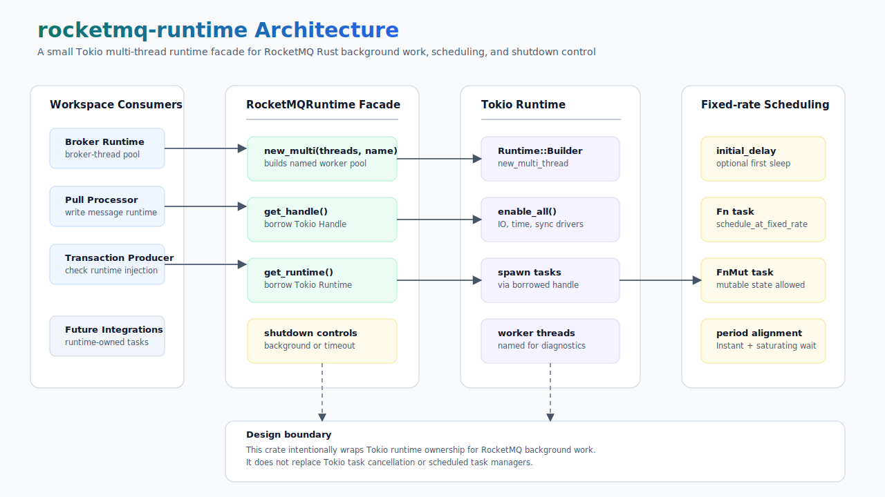

# rocketmq-runtime

[](https://crates.io/crates/rocketmq-runtime)
[](../LICENSE-APACHE)

`rocketmq-runtime` 是
[rocketmq-rust](https://github.com/mxsm/rocketmq-rust) 工作区内部使用的轻量级运行时适配 crate。
当某个组件需要独立持有 Tokio 多线程运行时时，它提供统一的运行时创建、线程命名、句柄访问、固定频率后台任务调度以及关闭控制能力。

这个 crate 的定位很克制：它不会替代 Tokio，不实现完整任务管理器，也不负责组件生命周期策略。
它只为 broker、client 以及后续工作区组件提供一致的运行时所有权原语，让线程命名、Tokio 句柄访问和关闭语义保持统一。

[English](README.md)

## 架构



`rocketmq-runtime` 位于 RocketMQ 组件和 Tokio 之间：

- 工作区组件通过 `RocketMQRuntime` 请求一个具名运行时。
- `RocketMQRuntime::new_multi` 创建启用 IO、timer 等 Tokio driver 的多线程运行时。
- 组件在需要直接访问 Tokio 时，通过 `get_handle()` 或 `get_runtime()` 获取借用。
- 固定频率调度方法会把同步闭包作为重复任务提交到当前持有的运行时。
- 关闭 API 会消费包装对象，并委托 Tokio 执行后台关闭或带超时关闭。

## 能力

- 使用显式 worker 线程数创建具名 Tokio 多线程运行时。
- 借用底层 `tokio::runtime::Handle` 以提交异步任务。
- 借用底层 `tokio::runtime::Runtime` 以支持更底层的集成场景。
- 使用可选初始延迟运行固定频率后台任务。
- 同时支持不可变 `Fn` 和可变 `FnMut` 调度闭包。
- 支持后台关闭和带超时关闭两种运行时释放方式。
- 保持极小依赖面：当前只依赖 Tokio。

## 快速开始

```toml
[dependencies]
rocketmq-runtime = { path = "../rocketmq-runtime" }
```

创建运行时、提交异步任务、调度周期性维护任务，并在所有者结束时关闭运行时：

```rust
use std::time::Duration;

use rocketmq_runtime::RocketMQRuntime;

let runtime = RocketMQRuntime::new_multi(4, "rocketmq-worker");

runtime.get_handle().spawn(async {
    // 执行组件自己的异步任务。
});

runtime.schedule_at_fixed_rate(
    || {
        // 执行轻量级周期任务。
    },
    Some(Duration::from_secs(1)),
    Duration::from_secs(5),
);

runtime.shutdown_timeout(Duration::from_secs(3));
```

如果周期任务需要持有可变状态，可以使用 `schedule_at_fixed_rate_mut`：

```rust
use std::time::Duration;

use rocketmq_runtime::RocketMQRuntime;

let runtime = RocketMQRuntime::new_multi(2, "rocketmq-scheduler");
let mut runs = 0_u64;

runtime.schedule_at_fixed_rate_mut(
    move || {
        runs += 1;
    },
    None,
    Duration::from_secs(10),
);
```

## 运行时模型

| API | 作用 |
| --- | --- |
| `RocketMQRuntime::new_multi(threads, name)` | 使用指定 worker 线程数和线程名创建 Tokio 多线程运行时。 |
| `get_handle()` | 返回借用的 Tokio `Handle`，用于提交异步任务。 |
| `get_runtime()` | 返回借用的 Tokio `Runtime`，用于更底层的集成场景。 |
| `schedule_at_fixed_rate(task, initial_delay, period)` | 在运行时上重复执行不可变同步闭包。 |
| `schedule_at_fixed_rate_mut(task, initial_delay, period)` | 在运行时上重复执行可变同步闭包。 |
| `shutdown()` | 消费包装对象，并执行 Tokio 后台关闭。 |
| `shutdown_timeout(timeout)` | 消费包装对象，并在指定超时时间内等待关闭完成。 |

调度器会基于上一次开始执行的时间计算下一次执行时间。
如果任务耗时超过配置的周期，下一次延迟会饱和为零，并在当前任务结束后立即继续执行。

## 工作区使用方式

当前工作区中的使用场景包括：

- `rocketmq-broker` 持有 broker 级别后台运行时，并在 `BrokerRuntime::drop` 中关闭。
- `rocketmq-broker` 的 pull-message processor 会为写消息路径创建独立运行时。
- `rocketmq-client` 为事务生产者检查任务暴露运行时注入能力。
- `rocketmq-controller`、`rocketmq-observability` 和 `rocketmq-tieredstore`
  将该 crate 作为工作区共享运行时能力的一部分。

## 设计边界

- 当前只实现了 Tokio 多线程运行时变体。
- `new_multi` 会直接 unwrap Tokio 运行时创建结果。调用方应传入有效线程数，并只在运行时创建失败属于致命错误的上下文中使用。
- 调度闭包是同步闭包。应保持轻量；如果需要执行异步工作，应捕获 clone 后的 Tokio `Handle`，再在闭包内调用 `spawn`。
- 调度循环会持续运行，直到运行时关闭。需要显式取消能力的组件应自行持有 task handle，或在本 crate 之上使用更高层任务管理器。
- 本 crate 不负责组件级 metrics、tracing 或错误处理策略。

## Crate 结构

```text
rocketmq-runtime/
  Cargo.toml        crate 元数据和 Tokio 依赖
  src/lib.rs        RocketMQRuntime 包装、句柄访问、关闭控制和调度逻辑
```

## 验证

修改该 crate 后可运行：

```bash
cargo test -p rocketmq-runtime --lib
cargo clippy -p rocketmq-runtime --all-targets --all-features -- -D warnings
```

如果运行时行为变更会影响其他 RocketMQ 组件，应继续运行更大范围的工作区检查。

## 许可证

本项目使用 Apache License 2.0 许可证。详情请参见
[`LICENSE-APACHE`](../LICENSE-APACHE)。
