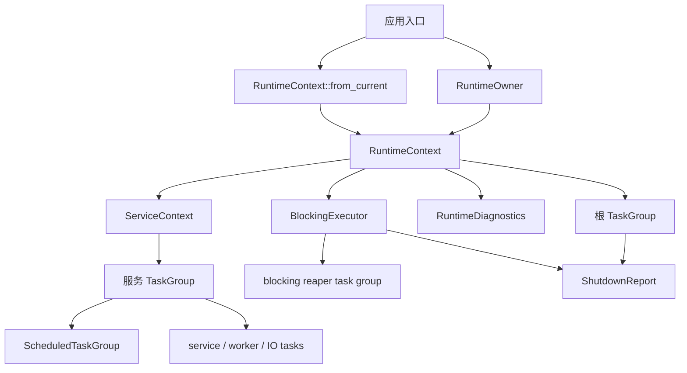

# rocketmq-runtime

[](https://crates.io/crates/rocketmq-runtime)
[](../LICENSE-APACHE)

`rocketmq-runtime` 是 [rocketmq-rust](https://github.com/mxsm/rocketmq-rust)
工作区共享的 Tokio 运行时基座。它不替代 Tokio，而是统一 RocketMQ 组件如何拥有或借用
Tokio runtime、如何追踪长期任务、如何调度周期任务、如何隔离短时阻塞工作，以及如何用
`ShutdownReport` 验证关闭结果。

[English](README.md)

## 目标线程模型

RocketMQ Rust 只使用 Tokio 作为异步 runtime。runtime 所有权和任务生命周期必须显式：

- 应用入口使用 `RuntimeOwner`，或在已有 Tokio runtime 中绑定 `RuntimeContext`。
- broker、namesrv、proxy、controller 和 admin 工具入口从 owner 派生组件级 `ServiceContext`。
- 长期服务任务通过 `TaskGroup` 注册和关闭。
- 周期任务通过 `ScheduledTaskGroup` 管理。
- 文件 IO、RocksDB、DNS、压缩等短时阻塞工作通过 `BlockingExecutor` 执行。
- 不适合 Tokio blocking pool 的长期循环保留为 dedicated OS thread，但必须有 owner、线程名、stop signal 和 bounded join。
- 关闭路径必须返回或记录 `ShutdownReport`。



## 核心类型

| 类型 | 作用 |
| --- | --- |
| `RuntimeConfig` | 配置 Tokio worker 线程数、blocking 线程上限、线程名、可选 worker stack、keep-alive、关闭超时、IO/time driver 和 blocking policy。 |
| `RuntimeOwner` | 持有专用 Tokio 多线程 runtime，并暴露 `RuntimeContext`；关闭时区分任务关闭和 runtime 释放。 |
| `RuntimeContext` | 绑定当前 runtime handle、根 `TaskGroup`、`BlockingExecutor` 和 diagnostics；可来自 owned runtime 或当前 Tokio runtime。 |
| `ServiceContext` | 组件级运行时视图，包含 runtime handle、服务 `TaskGroup`、blocking executor 和 diagnostics。 |
| `TaskGroup` | 结构化任务作用域，支持任务元数据、取消、关闭、abort、child group 和健康报告。 |
| `ScheduledTaskGroup` | 在 `TaskGroup` 下运行 fixed-delay / fixed-rate 周期任务，并记录调度指标。 |
| `BlockingExecutor` | 有界 `spawn_blocking` 网关，提供排队超时、任务超时和仍在运行任务的 reaper 跟踪。 |
| `ShutdownReport` | 可序列化的关闭证据，记录任务完成、取消、abort、泄漏、panic、timeout、detached task 和 blocking task。 |
| `RocketMQRuntime` | 旧兼容 wrapper。新代码应使用 `RuntimeOwner`、`RuntimeContext` 或 `ServiceContext`。 |

## 使用方式

组件拥有独立 runtime 时使用 `RuntimeOwner`：

```rust
use rocketmq_runtime::{RuntimeConfig, RuntimeOwner};

fn main() -> rocketmq_runtime::RuntimeResult<()> {
    let owner = RuntimeOwner::new(RuntimeConfig::broker_default())?;
    let broker = owner.context().service_context("broker");

    broker.spawn_service("heartbeat", async move {
        // tracked service loop
    })?;

    let report = owner.shutdown_runtime_blocking()?;
    assert!(report.is_healthy(), "{}", report.to_json());
    Ok(())
}
```

组件运行在已有 Tokio runtime 内时使用 `RuntimeContext::from_current`。这种 context
可以关闭 RocketMQ 自己登记的任务，但不会拥有或关闭宿主 Tokio runtime。

## 工作区接入状态

当前统一模型已经覆盖：

- `rocketmq-broker`：bootstrap、broker runtime、housekeeping、scheduled services、processor、auth、store/remoting integration 和 shutdown report。
- `rocketmq-namesrv`：bootstrap、route services、batch unregister、segmented lock、remoting server/client 和 shutdown report。
- `rocketmq-client`：producer、consumer、admin、trace、rebalance、pull、offset、delayed action、fallback runtime 和 blocking helpers。
- `rocketmq-remoting`：client/server、connection pool、reconnect、writer task、request processing、TLS/network lifecycle。
- `rocketmq-store` 与 `rocketmq-tieredstore`：store runtime scope、RocksDB、timer、HA、consume queue、index、compaction、dispatcher、cleanup、recovery 和 blocking IO。
- `rocketmq-proxy`：`RuntimeOwner::new(RuntimeConfig::proxy_default())`、gRPC/remoting ingress、session/auth shutdown。
- `rocketmq-controller`：`RuntimeOwner::new(RuntimeConfig::controller_default())`、RPC/remoting server、heartbeat、metadata/openraft scan、leadership watch。
- `rocketmq-common`、`rocketmq-observability`、`rocketmq` 和 `rocketmq-tools/*`：helper、observability lifecycle、foundation service task/scheduler、admin CLI/TUI/store-inspect 均已分类为统一模型接入或显式兼容边界。

Standalone dashboard 应用保留宿主 runtime 边界：Tauri/Web backend、GPUI 和 frontend 只有在 runtime owner、admin session、diagnostics API、TypeScript type 或 UI contract 改动时，才从各自 standalone root 做额外验证。

## 兼容边界

以下边界被保留并已文档化：

- deprecated `RocketMQRuntime`：兼容旧同步 API 和历史调用点。
- client shared fallback runtime：支持无 ambient runtime 的 client 调用方。
- store static blocking executor：迁移期间支持未注入 `StoreRuntimeScope` 的调用点。
- foundation service task helper：旧 `ServiceThread` 抽象内部已接入 `TaskGroup` 和 shutdown report。
- dedicated OS threads：用于不适合 Tokio blocking pool 的长期循环，必须提供 stop signal 和 bounded join。

新增代码不得扩大未分类 legacy runtime、raw `tokio::spawn` 或隐藏 runtime owner 的使用范围。

## 关闭语义

正常关闭顺序：

1. 关闭 task group，拒绝新任务。
2. 广播 cancellation。
3. 关闭 child groups。
4. 在超时内等待 tracked tasks。
5. abort 剩余 tracked tasks。
6. 合并 `BlockingExecutor` snapshot。
7. 返回 `ShutdownReport`。

`ShutdownReport::is_healthy()` 是主要正确性门槛。存在 leaked task、panic、timeout、仍在运行的 blocking task、仍在运行的 detached task 或不健康 child report 时，report 为 unhealthy。

## 验证

修改 runtime 行为后至少运行：

```bash
cargo test -p rocketmq-runtime --test runtime_model
cargo test -p rocketmq-runtime --all-targets --all-features
cargo clippy -p rocketmq-runtime --all-targets --all-features -- -D warnings
```

影响 workspace runtime 行为时继续运行：

```bash
cargo fmt --all
cargo clippy --workspace --no-deps --all-targets --all-features -- -D warnings
```

模块级迁移需要补跑对应 crate 的 `--all-targets --all-features` 测试，并在审计文档中记录无法运行的本地环境限制。

## Crate 结构

```text
rocketmq-runtime/
  src/config.rs           runtime 与 blocking policy 配置
  src/owner.rs            owned Tokio runtime 生命周期
  src/context.rs          borrowed runtime context 与 service context factory
  src/service_context.rs  组件级 runtime 视图
  src/handle.rs           Tokio handle wrapper
  src/task_group.rs       结构化任务跟踪与关闭
  src/scheduled.rs        周期任务 group 与调度指标
  src/blocking.rs         有界 blocking executor 与 reaper 跟踪
  src/diagnostics.rs      runtime diagnostics facade
  src/shutdown_report.rs  可序列化关闭证据
  src/legacy.rs           legacy RocketMQRuntime 兼容 wrapper
```

## 许可证

本项目使用 Apache License 2.0 许可证。详情请参见 [`LICENSE-APACHE`](../LICENSE-APACHE)。
