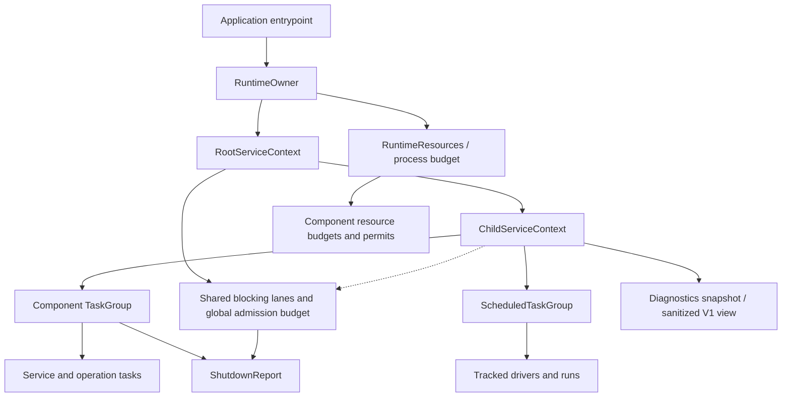

# rocketmq-runtime

[](https://crates.io/crates/rocketmq-runtime)
[](../LICENSE-APACHE)

`rocketmq-runtime` 是 [rocketmq-rust](https://github.com/mxsm/rocketmq-rust)
工作区共享的运行时基座。它基于 Tokio 提供运行时所有权、受跟踪的服务与操作任务、
周期调度、有界阻塞执行、资源预算、元数据持久化和关闭诊断。

[English](README.md)

## 运行时模型

生产应用入口拥有 `RuntimeOwner`。库接收 `ChildServiceContext` 或更窄的能力对象，
例如 `TaskSpawner`，不自行查找或构建独立运行时。任务所有权树负责跟踪任务直到关闭；
资源预算树负责核算显式申请的资源，两者是不同的树。


```mermaid
flowchart TD
    Entry["Application entrypoint"] --> Owner["RuntimeOwner"]
    Owner --> Root["RootServiceContext"]
    Root --> Service["ChildServiceContext"]
    Service --> Group["Component TaskGroup"]
    Group --> Tasks["Service and operation tasks"]
    Service --> Scheduled["ScheduledTaskGroup"]
    Scheduled --> Jobs["Tracked drivers and runs"]
    Root --> Blocking["Shared blocking lanes and global admission budget"]
    Service -.-> Blocking
    Owner --> Resources["RuntimeResources / process budget"]
    Resources --> Budgets["Component resource budgets and permits"]
    Group --> Report["ShutdownReport"]
    Blocking --> Report
    Service --> Diagnostics["Diagnostics snapshot / sanitized V1 view"]
```

图中展示生产环境的组装路径。`RuntimeContext` 是借用现有 Tokio 运行时的迁移与测试工具。
兼容执行器和专用线程辅助工具保留各自明确的所有权边界。

## 核心架构

| 类型 | 职责 |
| --- | --- |
| `RuntimeConfig` | 配置工作线程数、阻塞线程上限、线程名与栈大小、keep-alive、关闭超时、IO/time 驱动和各阻塞通道的策略。 |
| `RuntimeOwner` / `RuntimeOwnerPlan` | 校验配置，构建并拥有 Tokio 多线程运行时，提供根上下文并协调关闭。 |
| `RootServiceContext` | 不可克隆且没有公开构造函数的根上下文；派生组件上下文，提供共享资源与诊断。 |
| `ChildServiceContext` / `TaskSpawner` | 组件拥有任务所需的能力。任务提交器提供任务提交和取消信号访问能力，不暴露原始运行时。 |
| `TaskGroup` / `OperationContext` | 跟踪组件任务，提供操作级取消、截止时间和有界等待；操作不会创建新的任务组。 |
| `ScheduledTaskGroup` | 按明确的重叠执行策略运行周期任务并记录调度指标。 |
| `BlockingExecutor` | 通过有界通道接收短时阻塞工作，并保留其容量，直到闭包实际退出。 |
| `RuntimeResources` / `ResourceBudget` | 共享进程预算，派生组件级数量、保留字节数和可选速率限制。 |
| `ResourcePermit` / `BudgetedQueue` | 通过 RAII 在排队或执行中的工作之间携带资源配额，并应用明确的过载策略。 |
| `MetadataIoActor` | 拥有有界元数据快照，合并排队中的代次，并报告持久化完成结果。 |
| `ServiceLifecycle` / `ShutdownDeadline` | 协调就绪、存活、关闭请求和共享的绝对关闭截止时间。 |
| `ShutdownReport` | 提供任务完成、取消、中止、失败、panic、超时和剩余工作的可序列化证据。 |
| `RuntimeDiagnosticsSnapshot` / `RuntimeDiagnosticsViewV1` | 提供运行时内部详情，以及有界、脱敏的运维视图。 |

`RuntimeHandle` 是内部实现类型，不是公开接入入口。
常用所有权类型也可通过 `rocketmq_runtime::prelude` 导入。

## 运行时所有权与快速开始

默认配置使用 `RuntimeOwner::new()?`。命名或自定义配置使用
`RuntimeOwner::plan(config)?.build()?`。规划阶段仅校验配置，不探测系统资源或启动 Tokio；
构建阶段执行内存限制探测和运行时创建。

以下有限执行示例注册一个服务后，立即验证其协作式关闭流程：

```rust
use rocketmq_runtime::{RuntimeConfig, RuntimeOwner};

fn main() -> Result<(), Box<dyn std::error::Error>> {
    let owner = RuntimeOwner::plan(RuntimeConfig::broker_default())?.build()?;
    let broker = owner.root_context().component("broker");
    let cancellation = broker.task_group().cancellation_token();

    broker.spawn_service("heartbeat", async move {
        cancellation.cancelled().await;
        // Finish any ordered asynchronous cleanup here.
    })?;

    let report = owner.shutdown_runtime_blocking()?;
    assert!(report.is_healthy(), "{}", report.to_json());
    Ok(())
}
```

实际应用入口通过 `owner.block_on(...)` 执行启动和服务 Future，随后在异步上下文之外
消费 owner 并关闭运行时。与 `ServiceLifecycle` 和共享关闭截止时间的集成方式可参考
[Broker 入口](../rocketmq-broker/src/bin/broker_bootstrap_server.rs)。

错误通道进行了明确区分：

- `RuntimeContractViolation` 表示调用方配置无效或不变量被违反，包括 `plan()` 返回的错误。
- `RuntimeResult<T>` 使用 `RuntimeError` 表示运行故障，例如运行时构建、I/O、容量或超时错误。
- `ScheduledTaskRegistrationOutcome::AlreadyPresent`、`BudgetRejection` 和元数据目标冲突
  等正常结果有各自的类型。

`RuntimeContractViolation` 不会自动转换为 `RuntimeError`。
示例使用能够接收两者的应用层错误类型；应用也可以定义明确的启动错误枚举。

`RuntimeConfig::for_parallelism` 根据传入的 CPU 并行度派生工作线程数和阻塞通道限制。
默认使用 `std::thread::available_parallelism()`，探测失败时回退到四个工作线程。
`with_max_blocking_threads` 校验覆盖值，并限制各通道的并发上限。

仅在已运行于 Tokio 内的迁移或测试环境中使用 `RuntimeContext::try_from_current`。
它关闭已登记的 RocketMQ 工作，但不拥有或关闭宿主运行时。其资源预算是宽松的测试预算，
不会执行生产环境的内存探测流程。

## 任务作用域与取消

通过 `component(...)` 创建长期组件作用域。如需在关闭或中毒状态下获得创建错误，使用
`ChildServiceContext::try_component(...)`；当父级不再接收子组时，`component(...)`
返回已关闭的作用域。动态名称通过 `ScopeId::try_new` 校验；字符串字面量支持静态名称转换。

克隆上下文或任务组会共享同一所有者和取消令牌。创建子组则获得独立的取消范围：父级取消
向下传播，子级取消不影响父级或兄弟组件。丢弃上下文句柄不是优雅关闭协议；活动任务可能
继续持有其任务组。

| 提交 API | 取消行为 |
| --- | --- |
| `spawn` / `spawn_service` | 跟踪 Future；服务需要自行观察取消信号并按顺序完成清理。 |
| `spawn_cancellable_service` | 所有者取消时丢弃服务 Future；适用于可以安全地立即取消 Future 的场景。 |
| `spawn_operation` | 任务归属固定组件所有者，同时观察所有者取消以及操作自身的取消和截止时间。 |
| `spawn_draining_operation` | 已接收工作可在所有者取消后继续执行，但仍受操作取消、截止时间和任务组关闭约束。 |
| `spawn_with_handle` | 返回指定任务的 join handle，同时保留任务组跟踪。 |

有界请求或可重启工作使用 `OperationContext`，无需为每次操作创建组件组。
`close_admission()` 停止接收新的操作任务；`wait()` 等待已登记任务完成；
`cancel_and_wait()` 还会请求取消。等待时必须传入操作最初绑定的组件所有者，
未完成工作会在等待截止时间到达后被中止。

`TaskGroup::cancel()` 只广播取消信号。
使用 `shutdown(...)` 或 `shutdown_until(...)` 关闭任务接收并等待关闭报告。

### TaskGroup 不变量

| 状态 | 含义 |
| --- | --- |
| `Open` | 可以登记新任务和子组。 |
| `Closing` | 已开始关闭，拒绝新的登记。 |
| `Closed` | 跟踪器已关闭，取消信号已广播。 |
| `ShutdownCompleted` | 关闭报告已缓存供重复调用使用，但报告不一定健康。 |
| `Poisoned` | 任务组开放期间发生受跟踪任务 panic，后续登记被拒绝。 |

任务元数据先于 Tokio 提交完成登记。提交锁将登记与关闭状态转换串行化。
[子组注册表](src/task_group/registry.rs) 按 `TaskGroupId` 保存弱引用；
最后一个任务组引用释放后，子组会注销。名称只是标签，多个组可以同名而不共享身份。

## 周期任务

通过 `context.scheduled_tasks("maintenance")` 派生调度器，
并选择与重叠执行需求相符的登记方法：

| 模式 | 行为 |
| --- | --- |
| `FixedDelay` | 执行回调，完成后等待 `period`。 |
| `FixedRateNoOverlap` | 每个驱动周期尝试执行；上一次仍在运行时跳过。 |
| `FixedRateAllowOverlap` | 每个驱动周期启动一次执行，不等待前次完成；没有独立的并发执行数量限制。 |

当前固定频率驱动在提交尝试之间等待相对时长 `period`。预期触发时刻用于测量漂移，
不会驱动按绝对时间追赶的循环。调用方不能依赖严格的时钟对齐或漏触发补偿。

- `initial_delay` 默认为零，允许首次立即执行。
- `max_run_time` 通过超时后丢弃 Future 限制单次回调；外部副作用仍需适当的取消协议。
- 可控固定延迟回调通过返回 `ScheduledTaskControl::Stop` 停止驱动。
- 同名登记返回 `AlreadyPresent`，不会替换已有驱动或指标。
  `clear_completed()` 仅在调度器任务组没有活动任务时清空登记。
- 驱动和执行任务归属于调度器的任务组。普通执行可在关闭期间完成；
  支持操作上下文的登记还会观察操作自身的取消和截止时间。

快照记录活动执行数、完成次数、跳过次数、重叠次数、失败次数、漂移和耗时。
通过 `shutdown(timeout)` 或所属任务组关闭调度器。
当前调度器不会读取 `ScheduledTaskConfig::shutdown_timeout`；实际预算由关闭调用提供。

## 阻塞工作

使用 `ChildServiceContext` 提供的执行器：

| 访问方法 | 通道 | 典型工作 |
| --- | --- | --- |
| `storage_io()` | `StorageIo` | 短时存储和文件系统操作。 |
| `metadata_io()` | `MetadataIo` | 元数据持久化。 |
| `cpu_crypto()` | `CpuCrypto` | 有界 CPU 或密码学计算。 |

同一运行时所有者的受管通道共享全局准入预算，上限为
`RuntimeConfig::max_blocking_threads`。每个通道还有独立的并发上限和队列限制。
空闲容量可以借用；当某通道有等待者时，其预留容量会受到保护，不再借给新的借用者。
克隆执行器或派生上下文共享已有容量，不会创建另一个线程池。

`max_queue_depth` 在准入队列已满时拒绝提交。`queue_timeout` 限制等待执行容量的时间；
`task_timeout` 限制准入后调用方的等待时间。`spawn_until` 和 `spawn_io_until`
还通过同一个绝对截止时间约束两个阶段。这些方法需要活动的 Tokio 上下文，
应从所属运行时的任务中调用。

超时或取消不会停止已经运行的阻塞闭包。闭包保留准入配额，直到实际退出；
闭包内部的完成守卫在退出时移除任务记录，没有独立的回收任务。
取消排队中的提交会移除排队记录；放弃等待已经运行的提交后，任务以
`TimedOutStillRunning` 状态保留至完成。参见[执行器实现](src/blocking/executor.rs)。

`BlockingKind::LongRunning` 会被拒绝。长期阻塞循环需要专用操作系统线程或领域服务作为
所有者，并提供停止和等待退出协议。`BlockingExecutor::new(policy, owner_group)`
保留为隔离的兼容构造入口：它创建独立预算，传入的任务组不会将其纳入受管根通道。

## 资源预算与队列

`RuntimeOwner` 拥有 `RuntimeResources`，子上下文共享其进程预算。
通过 `context.process_budget().child(...)` 派生更窄的限制。
需要共享进程上限时，不要让每个组件各自创建独立的 `ResourceBudgetTree`。

所有者从 `ROCKETMQ_PROCESS_MEMORY_LIMIT_BYTES`、Linux cgroup 限制或宿主物理内存
探测内存限制；也可以通过 `RuntimeOwnerPlan::with_memory_limit` 提供显式
`ProcessMemoryLimit`。这些限制只核算通过预算 API 接收的资源，不会自动限制所有进程
内存分配或常驻内存使用量。

`ResourceBudget` 沿祖先链检查数量、保留字节数和可选速率限制。
`ResourcePermit` 保留数量与字节配额，直到被丢弃。
`BudgetClass::Control` 可以使用配置的控制类预留容量，数据类工作不能占用该预留容量。
同一树中的配额重绑定在组件间转移所有权时保留公共祖先的核算。

`BudgetedQueue` 支持 `Reject`、`WaitUntilDeadline`、`CoalesceLatest`、
`DropStale` 和 `CloseSlowConsumer`。应根据工作能否等待、替换或丢弃选择策略。
`push_until` 仅在 `WaitUntilDeadline` 策略下等待容量，并在拒绝结果中保留原始条目。

出队 API 决定配额核算的生命周期：

- `try_pop()` / `recv()` 返回条目，并在出队时释放配额。
- `try_pop_budgeted()` / `recv_budgeted()` 返回 `BudgetedItem`，在处理期间保留配额。
  `into_parts()` 显式转移配额；`into_item()` 释放配额。

祖先限制、控制类预留、过载处理和配额转移示例见
[资源预算测试](tests/resource_budget_tree.rs)。

## 元数据持久化

通过 `MetadataIoConfig::default().into_plan()?.start(&context)?` 启动 actor。
它拥有受跟踪的协调任务，并使用上下文共享的 `MetadataIo` 阻塞通道。
通过 `max_pending_operations` 和 `max_pending_bytes` 配置 actor 的准入限制；
通过 `RuntimeConfig::blocking_lane_policies.metadata_io` 配置受管通道。
actor 的兼容 `blocking_*` 配置不会替换共享通道策略。

`submit` 和 `submit_next` 接收不可变快照，但不等待持久化完成。
调用方需要匹配 `MetadataIoAdmissionOutcome`：`Accepted` 提供回执；当同一资源已有
写向其他目标的待处理工作时，`TargetConflict` 返回请求。通过回执的 `wait_until`
等待持久化，或使用 `submit_durable` / `submit_next_durable`，
并匹配持久化代次或目标冲突结果。

同一逻辑资源排队中的代次可以合并，较新的持久化代次能够满足较早的等待者。
本地写入依次执行临时文件写入、文件同步、原子替换和受支持平台上的父目录同步，
随后推进持久化代次。等待超时不表示底层文件系统操作已经停止。

先调用 `stop_admission()` 拒绝新快照，再通过 `shutdown_until(MetadataDeadline)`
等待已接收工作完成。除运行时任务关闭报告外，还应检查返回的 `MetadataIoShutdownReport`
中是否存在未完成代次。参见[元数据 I/O 测试](tests/metadata_io_actor.rs)。

## 服务生命周期与关闭

`ServiceLifecycle` 提供 `Starting`、`Ready`、`Draining`、`Stopped` 和 `Failed` 状态。
在组件上下文下启动它，完成服务启动后标记就绪，并单独发布依赖就绪状态。
维护操作可以暂停就绪状态而不将进程标记为死亡。存活检查依据生命周期状态和进度更新时间，
不以业务端口是否开放作为判断依据。

使用 `ServiceLifecycle::from_env` 时，`ROCKETMQ_HEALTH_BIND_ADDR` 启用可选探针服务，
提供 `/readyz`、`/livez` 和 `/drainz`。
`ROCKETMQ_SHUTDOWN_TIMEOUT_SECONDS` 与 `ROCKETMQ_LIVENESS_STALE_SECONDS`
分别配置关闭和进度窗口。未配置探针绑定地址时，关闭协调仍然有效。
服务生命周期的默认关闭超时为 45 秒；`RuntimeConfig` 独立默认为 30 秒。

首次关闭请求固定一个 `ShutdownDeadline`，重复的 pre-stop 或信号请求不会延长它。
将同一截止时间传递给组件关闭流程及 `owner.shutdown_runtime_blocking_until(deadline)`。

任务组关闭时先停止登记并广播取消，再并发执行子组关闭和本组任务等待。
截止时间到达后中止尚未完成的受跟踪任务。报告在任务组级别缓存，
运行时所有者另外合并其阻塞通道快照。

| API | 范围与保证 |
| --- | --- |
| `owner.shutdown_tasks().await` / `shutdown_tasks_until(deadline).await` | 关闭并等待受跟踪任务，保留 Tokio 运行时。 |
| `owner.shutdown_runtime_blocking()` / `shutdown_runtime_blocking_until(deadline)` | 消费所有者，先关闭受跟踪任务，再在剩余预算内释放 Tokio；必须在 Tokio 上下文之外调用，无需预先单独关闭任务。 |
| `TaskGroup::shutdown_now()` | 立即取消和中止，不等待异步完成。 |
| `owner.shutdown_background()` | 返回立即关闭任务的证据，并请求 Tokio 在后台关闭。 |
| `RuntimeOwner::drop` | 未显式关闭时的紧急清理，不是优雅关闭协议。 |

`ShutdownReport::is_healthy()` 要求 `leaked`、`failed`、`panicked`、`timed_out`、
`blocking_still_running` 和 `detached_still_running` 均为零，且所有子报告健康。
仅有 `aborted` 计数不会使报告不健康。立即关闭报告不能证明全部 Future 已完成清理。
阻塞快照只反映采样时刻的状态，不会终止超过截止时间仍在运行的闭包。

## 诊断

`diagnostics_snapshot()` 提供内部详情，例如运行时和任务组身份、阻塞任务名称。
面向已认证运维 API 时，优先使用 `diagnostics_view_v1(RuntimeComponent::...)`：
其版本化视图聚合有界的任务类型和通道摘要，不包含原始 ID、名称、参数或配置对象。
认证仍由调用方负责。

`RuntimeDiagnosticsViewOptions` 控制摘要数量上限和长期运行阈值；
摘要被省略时设置 `truncated`。这些诊断无需 Tokio unstable 特性或 console subscriber，
也不能替代应用健康检查或性能测量。

## 兼容边界与工作区接入

`RocketMQRuntime` 已弃用，但在 1.x 中仍可使用。构造方式应迁移到
`RuntimeOwner::plan(config)?.build()?`，向组件注入 `ChildServiceContext`，
明确选择调度重叠策略，并检查关闭报告。未来移除属于 2.0 兼容性边界，仍须满足
[API 迁移指南](../rocketmq-doc/en/release/1.0/api-migration.md)中的发布与所有者批准要求。

`RuntimeContext` 用于迁移和测试。其他保留的辅助类型包括 `TokioExecutorService`、
`ScheduledExecutorService`、`FuturesExecutorService`、`TaskScheduler` 和 `ActorRuntime`；
它们承担不同的适配或专用线程职责，并非全部已弃用。
新服务应使用前文介绍的所有权和能力 API。

[Broker](../rocketmq-broker/src/bin/broker_bootstrap_server.rs)、
[NameServer](../rocketmq-namesrv/src/bin/namesrv_bootstrap_server.rs)、
[Proxy](../rocketmq-proxy/src/bin/rocketmq-proxy-rust.rs) 和
[Controller](../rocketmq-controller/src/bin/controller_bootstrap.rs) 入口构建运行时所有者，
并使用服务生命周期截止时间。其他使用方包括 `rocketmq-client`、`rocketmq-transport`、
`rocketmq-store`、`rocketmq-auth`、`rocketmq-observability` 和管理工具。
ClientRuntime 必须注入应用拥有的子作用域，不会创建回退运行时；存储兼容辅助 API 保留显式适配边界；上述列表不表示所有调用点都使用
完全相同的所有权路径。独立应用遵循各自的宿主运行时与验证指南。

## 特性与验证

crate 的 edition 和最低 Rust 版本继承自[工作区清单](../Cargo.toml)。
默认 crate 特性为空；`async_fs` 启用 `common::file_utils` 中的 Tokio 文件系统辅助 API。
核心所有权、阻塞、预算和元数据 API 不需要该特性。

任务生命周期变更可以从包级检查开始：

```bash
cargo fmt -p rocketmq-runtime -- --check
cargo test -p rocketmq-runtime --test runtime_model
```

根据实际变更行为选择额外检查，无需每次编辑都执行所有测试集：

| 范围 | 测试目标或命令 |
| --- | --- |
| 内部单元测试、错误通道、诊断、服务生命周期 | `cargo test -p rocketmq-runtime --lib` |
| 资源限制与队列行为 | `cargo test -p rocketmq-runtime --test resource_budget_tree` |
| 共享进程预算所有权 | `cargo test -p rocketmq-runtime --test runtime_resource_ownership` |
| 元数据持久化与故障处理 | `cargo test -p rocketmq-runtime --test metadata_io_actor` |
| 公开作用域限制 | `cargo test -p rocketmq-runtime --test service_context_scope_compile_fail` |
| 关闭或预算的并发交错 | 使用 `cargo test -p rocketmq-runtime --test <target>` 运行 `task_group_shutdown_loom` 或 `resource_budget_loom` |
| 迁移或大型 Future 提交 | 使用相同测试命令运行 `runtime_migration_fixture` 或 `task_submission_stack` |
| 可选文件系统辅助 API | `cargo test -p rocketmq-runtime --features async_fs common::file_utils` |

需要时，针对受影响目标和特性运行
`cargo clippy -p rocketmq-runtime --no-deps -- -D warnings`。
共享行为变更需要验证直接受影响的使用方，独立项目遵循各自的本地指南。
启用特性的检查不能替代未启用特性时的覆盖。

编辑 README 时，检查本地链接，并编译、运行 Rust 代码块。
`cargo test --doc` 验证 crate Rustdoc，不会自动包含独立 README 的代码块；
这些示例需要使用 `rustdoc --test`，并传入已构建 crate 的 `--extern` 和依赖搜索路径。
两种语言版本应保持一致。

全工作区检查、运行时审计、Loom 模型和 Criterion 基准测试用于需要相应证据的变更，
或对应的 CI、集成任务。基准测试提供特定运行条件下的测量结果，不构成固定性能保证。
参见[仓库验证指南](../AGENTS.md)。

## Crate 结构

```text
rocketmq-runtime/
  src/public_api.rs        deliberate ownership and diagnostics exports
  src/prelude.rs           common ownership imports
  src/config.rs            runtime and blocking-lane configuration
  src/owner.rs             validated construction and owned runtime lifecycle
  src/context.rs           borrowed runtime migration/test harness
  src/service_context.rs   sealed root and child capabilities
  src/task_spawner.rs      narrow task-submission capability
  src/task_group.rs        task tracking, cancellation, and shutdown
  src/task_group/          child registry and deadline coordination
  src/operation.rs         operation-local cancellation and bounded waits
  src/scheduled.rs         periodic drivers, runs, and metrics
  src/blocking.rs          blocking API exports
  src/blocking/            lane admission, execution, and snapshots
  src/resources.rs         shared process resource capabilities
  src/resource_budget/     resource trees, permits, queues, and memory discovery
  src/metadata_io.rs       generation-aware metadata persistence
  src/service_lifecycle.rs readiness, liveness, and shutdown requests
  src/shutdown_deadline.rs shared absolute shutdown deadline
  src/shutdown_report.rs   serializable shutdown evidence
  src/diagnostics.rs       raw snapshots and sanitized V1 views
  src/legacy.rs            deprecated RocketMQRuntime wrapper
  src/executor_service.rs  retained executor adapters
  src/schedule/            retained scheduler APIs
  src/common/              common filesystem, time, and thread helpers
```

## 许可证

本项目使用 Apache License 2.0 许可证。详情请参见 [`LICENSE-APACHE`](../LICENSE-APACHE)。
