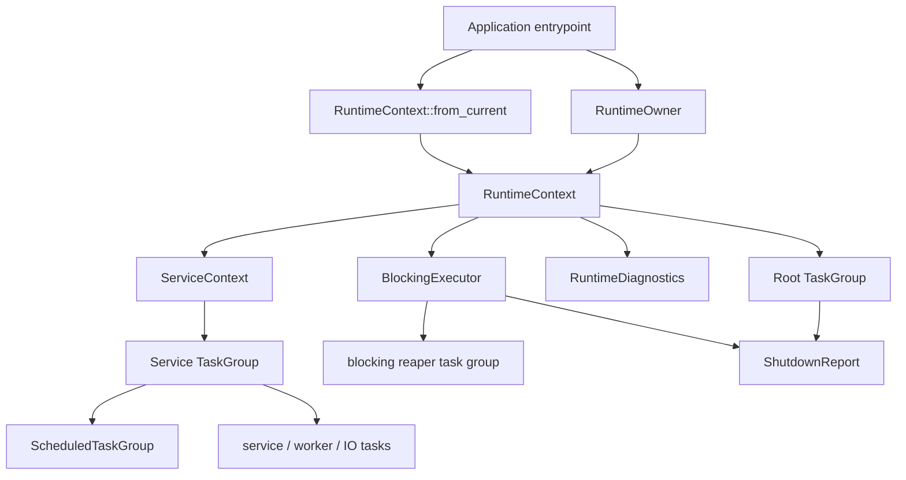

# rocketmq-runtime

[](https://crates.io/crates/rocketmq-runtime)
[](../LICENSE-APACHE)

`rocketmq-runtime` is the shared Tokio runtime substrate for the
[rocketmq-rust](https://github.com/mxsm/rocketmq-rust) workspace. It defines
the project runtime ownership model, structured task lifecycle model,
scheduled task model, bounded blocking execution model, and shutdown reporting
surface used by RocketMQ components.

The crate does not replace Tokio. It standardizes how RocketMQ components own
or borrow Tokio runtimes, how long-running tasks are tracked, how periodic work
is scheduled, how blocking work is isolated from async worker threads, and how
shutdown can be verified.

[中文文档](README-zh_cn.md)

## Target Thread Model

RocketMQ Rust uses Tokio as the only async runtime. Runtime ownership and task
lifecycle are explicit:

- application entrypoints create a `RuntimeOwner` or bind a `RuntimeContext`
  to the current Tokio runtime;
- every service receives a `ServiceContext`;
- every long-running task is spawned through a `TaskGroup`;
- every periodic task is registered through a `ScheduledTaskGroup`;
- blocking work goes through `BlockingExecutor` unless it is a dedicated
  long-running OS thread by design;
- shutdown always produces a `ShutdownReport`.



## Core Architecture

| Type | Responsibility |
| --- | --- |
| `RuntimeConfig` | Configures Tokio worker threads, blocking-thread limit, thread name, keep-alive, shutdown timeout, IO/time drivers, and blocking policy. |
| `RuntimeOwner` | Owns a dedicated Tokio multi-thread runtime and exposes `RuntimeContext`. It separates async task shutdown from blocking runtime shutdown. |
| `RuntimeContext` | Binds runtime handle, root `TaskGroup`, `BlockingExecutor`, and diagnostics. It can be created from an owned runtime or the current Tokio runtime. |
| `RuntimeHandle` | Lightweight wrapper around `tokio::runtime::Handle`; it is handle access, not lifecycle ownership. |
| `ServiceContext` | Per-service view containing runtime handle, service task group, blocking executor, and diagnostics. |
| `TaskGroup` | Structured task scope with task metadata, cancellation, shutdown, abort, child groups, and health reporting. |
| `ScheduledTaskGroup` | Runs fixed-delay and fixed-rate jobs under a task group and records schedule metrics. |
| `BlockingExecutor` | Bounded `spawn_blocking` gateway with queue timeout, task timeout, and still-running reaper tracking. |
| `ShutdownReport` | Serializable shutdown evidence for task completion, cancellation, aborts, leaks, panics, timeouts, detached tasks, and blocking tasks. |
| `RocketMQRuntime` | Legacy compatibility wrapper. New code should prefer `RuntimeOwner` or `RuntimeContext`. |

## Runtime Ownership

Use `RuntimeOwner` when a component owns a dedicated Tokio runtime:

```rust
use rocketmq_runtime::{RuntimeConfig, RuntimeOwner};

fn main() -> rocketmq_runtime::RuntimeResult<()> {
    let owner = RuntimeOwner::new(RuntimeConfig::broker_default())?;
    let broker = owner.context().service_context("broker");

    broker.spawn_service("heartbeat", async move {
        // tracked service loop
    })?;

    let report = owner.shutdown_runtime_blocking()?;
    assert!(report.is_healthy(), "{}", report.to_json());
    Ok(())
}
```

Use `RuntimeContext::from_current` in applications that already run inside
`#[tokio::main]` or a test runtime. A context created from the current runtime
can shut down tracked RocketMQ tasks, but it does not own or close the Tokio
runtime itself.

### Legacy Compatibility Boundary

`RocketMQRuntime` is retained only for legacy synchronous APIs that still need
to pass around an owned Tokio runtime. New code should use `RuntimeOwner` for
owned runtime lifecycle and `RuntimeContext` / `ServiceContext` for borrowed
runtime integration. Runtime audit classifies remaining `RocketMQRuntime`
references as either runtime primitives or explicit compatibility adapters so
new unclassified legacy runtime use cannot grow unnoticed.

`RuntimeOwner` intentionally separates two phases:

1. `shutdown_tasks().await`: cancel, close, wait, abort, and report tracked
   RocketMQ tasks.
2. `shutdown_runtime_blocking(self)`: release the owned Tokio runtime outside
   an async runtime context.

This avoids calling Tokio runtime shutdown APIs from inside async shutdown
paths and keeps ownership boundaries explicit.

## TaskGroup Model

`TaskGroup` is the core structured-concurrency primitive for long-running
RocketMQ work. It uses `CancellationToken`, `TaskTracker`, `AbortHandle`, task
metadata, and child task groups.

Lifecycle states:

| State | Meaning |
| --- | --- |
| `Open` | New tasks and child groups can be registered. |
| `Closing` | Shutdown has started; new task registration is rejected. |
| `Closed` | The group has been closed and cancellation has been broadcast. |
| `ShutdownCompleted` | Shutdown reporting completed and the report can be reused idempotently. |
| `Poisoned` | A tracked task panicked while the group was open. |

Important invariants:

- task metadata is inserted before spawning the future, so shutdown cannot miss
  a task that is already visible to Tokio;
- `spawn_gate` serializes spawn/child creation with shutdown transitions;
- children are stored as a `Vec<TaskGroup>` guarded by `Mutex`, avoiding
  recursive `DashMap<TaskGroupId, TaskGroup>` type expansion;
- child group identity is `TaskGroupId`; names are labels, so repeated names
  such as `remoting.connection` are allowed;
- `spawn_with_handle` is available for integrations that must await a specific
  task, while the task still remains tracked by the group;
- `DetachedTaskPolicy::AbortOnShutdown` lets compatibility tasks remain
  detached during normal operation but still be aborted during shutdown.

## Scheduled Tasks

`ScheduledTaskGroup` is used for periodic work that must be visible to the
runtime lifecycle. It supports:

- `FixedDelay`: wait `period` after each run completes;
- `FixedRateNoOverlap`: tick on a fixed cadence and skip runs while the
  previous run is still active;
- `FixedRateAllowOverlap`: tick on a fixed cadence and allow overlapping runs.

Each schedule records active runs, completed runs, skips, overlaps, failures,
drift, elapsed time, and max elapsed time. Scheduled drivers and scheduled runs
are spawned through the underlying `TaskGroup`, so shutdown drains or aborts
them like any other tracked task.

## Blocking Work

`BlockingExecutor` is the common gateway for short blocking IO and bounded CPU
work. It protects Tokio worker threads by controlling how `spawn_blocking` is
used:

- `max_concurrency` limits concurrent blocking operations;
- `queue_timeout` rejects work that cannot acquire a permit in time;
- `task_timeout` reports timeout to the caller without pretending the blocking
  closure has stopped;
- timed-out blocking tasks remain tracked as `TimedOutStillRunning`;
- a detached reaper awaits the real `JoinHandle` completion and removes the
  task from the snapshot.

Long-running blocking loops should not use the Tokio blocking pool. They should
be implemented as dedicated OS threads or domain-specific services with their
own shutdown protocol.

## Shutdown Semantics

Normal shutdown follows this order:

1. close the task group and reject new spawns;
2. broadcast cancellation;
3. shut down child groups;
4. wait for tracked tasks within the timeout;
5. abort remaining tracked tasks;
6. merge `BlockingExecutor` snapshot data;
7. return `ShutdownReport`.

`shutdown_now` is the synchronous compatibility path used by `Drop` or sync
teardown code. It closes the group, cancels tasks, aborts tracked work, and
returns a report without awaiting async task completion.

`ShutdownReport::is_healthy()` is the main correctness gate. A report is
unhealthy when it contains leaked tasks, panics, timeouts, still-running
blocking tasks, still-running detached tasks, or unhealthy child reports.

## Component Migration Rules

New RocketMQ code should follow these rules:

- do not create ad hoc Tokio runtimes inside business crates;
- do not call raw `tokio::spawn` for long-running service work;
- derive a `ServiceContext` and spawn through its `TaskGroup`;
- wrap periodic loops in `ScheduledTaskGroup`;
- route file IO, RocksDB calls, DNS resolution, and other short blocking work
  through `BlockingExecutor`;
- keep long-running blocking loops outside Tokio blocking pools;
- return or log `ShutdownReport` during component shutdown;
- do not rely on `Drop` for graceful shutdown; `Drop` may only cancel or abort
  work as an emergency cleanup path;
- keep diagnostics and benchmark tooling as validation artifacts rather than
  production-critical runtime dependencies.

## Diagnostics And Benchmarks

Runtime diagnostics are intentionally kept behind the runtime abstraction. The
default production path should not require Tokio unstable features, console
subscribers, or runtime metrics exporters.

Benchmark and audit artifacts should be used as evidence for changes, not as
hard-coded performance claims. The expected validation loop is:

1. scan spawn, runtime, blocking, and shutdown sites;
2. classify findings as production, compatibility, test, benchmark, or
   tool-only;
3. collect baseline task lifecycle and shutdown behavior;
4. migrate to runtime primitives;
5. rerun targeted tests, runtime audit scripts, and Criterion benchmarks.

Useful local checks:

```bash
cargo test -p rocketmq-runtime --test task_group_concurrency_model
cargo test -p rocketmq-runtime --all-targets --all-features
cargo clippy -p rocketmq-runtime --all-targets --all-features -- -D warnings
```

Run the full workspace validation when changes affect public runtime behavior:

```bash
cargo fmt --all
cargo clippy --workspace --no-deps --all-targets --all-features -- -D warnings
```

## Crate Layout

```text
rocketmq-runtime/
  src/config.rs           runtime and blocking policy configuration
  src/owner.rs            owned Tokio runtime lifecycle
  src/context.rs          borrowed runtime context and service context factory
  src/service_context.rs  per-service runtime view
  src/handle.rs           Tokio handle wrapper
  src/task_group.rs       structured task tracking and shutdown
  src/scheduled.rs        scheduled task groups and schedule metrics
  src/blocking.rs         bounded blocking executor and reaper tracking
  src/diagnostics.rs      runtime diagnostics facade
  src/shutdown_report.rs  serializable shutdown evidence
  src/legacy.rs           legacy RocketMQRuntime compatibility wrapper
```

## License

Licensed under the Apache License, Version 2.0. See
[`LICENSE-APACHE`](../LICENSE-APACHE) for details.
