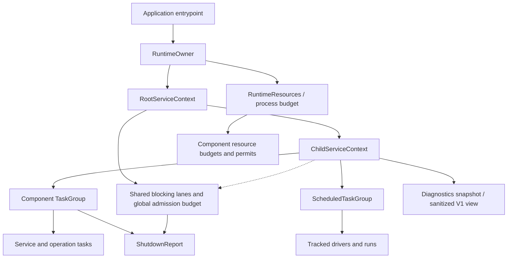

# rocketmq-runtime

[](https://crates.io/crates/rocketmq-runtime)
[](../LICENSE-APACHE)

`rocketmq-runtime` is the shared runtime substrate for the
[rocketmq-rust](https://github.com/mxsm/rocketmq-rust) workspace. It builds on
Tokio to provide runtime ownership, tracked service and operation tasks,
periodic scheduling, bounded blocking execution, resource budgets, metadata
persistence, and shutdown diagnostics.

[中文文档](README-zh_cn.md)

## Runtime Model

Production entrypoints own a `RuntimeOwner`. Libraries receive a
`ChildServiceContext` or a narrower capability such as `TaskSpawner`; they do
not discover or construct an independent runtime. The task ownership tree
tracks work through shutdown. The resource-budget tree accounts for explicitly
reserved resources; it is separate from the task tree.


```mermaid
flowchart TD
    Entry["Application entrypoint"] --> Owner["RuntimeOwner"]
    Owner --> Root["RootServiceContext"]
    Root --> Service["ChildServiceContext"]
    Service --> Group["Component TaskGroup"]
    Group --> Tasks["Service and operation tasks"]
    Service --> Scheduled["ScheduledTaskGroup"]
    Scheduled --> Jobs["Tracked drivers and runs"]
    Root --> Blocking["Shared blocking lanes and global admission budget"]
    Service -.-> Blocking
    Owner --> Resources["RuntimeResources / process budget"]
    Resources --> Budgets["Component resource budgets and permits"]
    Group --> Report["ShutdownReport"]
    Blocking --> Report
    Service --> Diagnostics["Diagnostics snapshot / sanitized V1 view"]
```

This is the production composition path. `RuntimeContext` is a migration and
test harness for an existing Tokio runtime. Compatibility executors and
dedicated thread helpers retain their own explicit ownership boundaries.

## Core Architecture

| Type | Responsibility |
| --- | --- |
| `RuntimeConfig` | Worker threads, blocking-thread limit, thread name and stack size, keep-alive, shutdown timeout, IO/time drivers, and per-lane blocking policies. |
| `RuntimeOwner` / `RuntimeOwnerPlan` | Validate configuration, build and own a Tokio multi-thread runtime, expose the root context, and coordinate shutdown. |
| `RootServiceContext` | Non-cloneable root with no public constructor; derives component contexts and exposes shared resources and diagnostics. |
| `ChildServiceContext` / `TaskSpawner` | Component capabilities for owned work. A spawner exposes task submission and cancellation access without raw runtime access. |
| `TaskGroup` / `OperationContext` | Track component tasks and provide operation-local cancellation, deadlines, and bounded waits. An operation does not create a new task group. |
| `ScheduledTaskGroup` | Run periodic jobs with explicit overlap behavior and schedule metrics. |
| `BlockingExecutor` | Admit short blocking work through a bounded lane and retain its capacity until the closure actually exits. |
| `RuntimeResources` / `ResourceBudget` | Share the process budget and derive component limits for count, retained bytes, and optional rate control. |
| `ResourcePermit` / `BudgetedQueue` | Carry RAII reservations through queued or in-flight work and apply explicit overload policies. |
| `MetadataIoActor` | Own bounded metadata snapshots, coalesce queued generations, and report durable completion. |
| `ServiceLifecycle` / `ShutdownDeadline` | Coordinate readiness, liveness, shutdown requests, and a shared absolute shutdown deadline. |
| `ShutdownReport` | Serializable evidence of completion, cancellation, aborts, failures, panics, timeouts, and remaining work. |
| `RuntimeDiagnosticsSnapshot` / `RuntimeDiagnosticsViewV1` | Internal runtime details and a bounded, sanitized operational view. |

`RuntimeHandle` is an internal implementation type, not a public integration
entrypoint. Common ownership types are also available from
`rocketmq_runtime::prelude`.

## Runtime Ownership And Quick Start

Use `RuntimeOwner::new()?` for the default profile. For a named or customized
profile, call `RuntimeOwner::plan(config)?.build()?`. Planning validates
configuration without discovering system resources or starting Tokio;
building performs memory-limit discovery and runtime construction.

This finite example registers a service and immediately exercises its
cooperative shutdown path:

```rust
use rocketmq_runtime::{RuntimeConfig, RuntimeOwner};

fn main() -> Result<(), Box<dyn std::error::Error>> {
    let owner = RuntimeOwner::plan(RuntimeConfig::broker_default())?.build()?;
    let broker = owner.root_context().component("broker");
    let cancellation = broker.task_group().cancellation_token();

    broker.spawn_service("heartbeat", async move {
        cancellation.cancelled().await;
        // Finish any ordered asynchronous cleanup here.
    })?;

    let report = owner.shutdown_runtime_blocking()?;
    assert!(report.is_healthy(), "{}", report.to_json());
    Ok(())
}
```

A real entrypoint runs its startup and service future through
`owner.block_on(...)`, then consumes the owner outside the async context to
shut down the runtime. See the [broker entrypoint](../rocketmq-broker/src/bin/broker_bootstrap_server.rs)
for integration with `ServiceLifecycle` and a shared shutdown deadline.

The error channels are intentional:

- `RuntimeContractViolation` identifies invalid caller configuration or an
  invariant violation, including failures from `plan()`.
- `RuntimeResult<T>` contains `RuntimeError` for operational failures such as
  runtime construction, I/O, capacity, or timeout failures.
- Normal outcomes such as `ScheduledTaskRegistrationOutcome::AlreadyPresent`,
  `BudgetRejection`, and metadata target conflicts have their own types.

There is no automatic conversion from `RuntimeContractViolation` to
`RuntimeError`. The example's application-level error type accepts both;
applications can instead define an explicit startup error enum.

`RuntimeConfig::for_parallelism` derives worker and blocking-lane limits from
the supplied CPU parallelism. The default uses
`std::thread::available_parallelism()`, with a fallback of four workers.
`with_max_blocking_threads` validates an override and caps lane concurrency.

Use `RuntimeContext::try_from_current` only in migration or test harnesses
already running inside Tokio. It shuts down registered RocketMQ work without
owning or closing the host runtime. Its resource budget is a permissive test
budget, not the production memory-discovery path.

## Task Scopes And Cancellation

Create long-lived component scopes through `component(...)`. Use
`ChildServiceContext::try_component(...)` to receive a creation error during
shutdown or poisoning; `component(...)` returns a closed scope if the parent
no longer accepts children. Validate dynamic names with `ScopeId::try_new`;
string literals have a static-name conversion.

Cloning a context or task group shares the same owner and cancellation token.
Creating a child gives it independent cancellation: parent cancellation
propagates downward, while child cancellation does not cancel its parent or
siblings. Dropping a context handle is not a graceful shutdown protocol;
active tasks can keep their group alive.

| Submission API | Cancellation behavior |
| --- | --- |
| `spawn` / `spawn_service` | Tracks the future. The service must observe its cancellation signal and perform ordered cleanup itself. |
| `spawn_cancellable_service` | Drops the service future when the owner is cancelled. Use when immediate future cancellation is safe. |
| `spawn_operation` | Keeps work under a fixed component owner and observes both owner cancellation and the operation's cancellation/deadline. |
| `spawn_draining_operation` | Accepted work can continue after owner cancellation; operation cancellation/deadline and task-group shutdown still bound it. |
| `spawn_with_handle` | Returns a join handle for a specific task while retaining group tracking. |

For bounded requests or restartable work, use `OperationContext` instead of
creating a component group for every operation. `close_admission()` stops new
operation tasks; `wait()` drains registered tasks; `cancel_and_wait()` also
requests cancellation. The waits require the operation's original component
owner and abort unfinished work at their deadline.

`TaskGroup::cancel()` only broadcasts cancellation. Use `shutdown(...)` or
`shutdown_until(...)` to close task admission and wait for shutdown evidence.

### TaskGroup Invariants

| State | Meaning |
| --- | --- |
| `Open` | New tasks and child groups can be registered. |
| `Closing` | Shutdown has started; new registration is rejected. |
| `Closed` | The tracker is closed and cancellation has been broadcast. |
| `ShutdownCompleted` | The shutdown report is cached for repeated calls; it need not be healthy. |
| `Poisoned` | A tracked task panicked while the group was open; new registration is rejected. |

Task metadata is registered before submission to Tokio. A spawn gate
serializes registration with shutdown transitions. The
[child registry](src/task_group/registry.rs) uses weak references keyed by
`TaskGroupId`; dropping the last group reference unregisters the child.
Names are labels, so multiple groups can share a name without sharing identity.

## Scheduled Tasks

Derive a scheduler with `context.scheduled_tasks("maintenance")` and select
the registration method matching the desired overlap behavior:

| Mode | Behavior |
| --- | --- |
| `FixedDelay` | Run the callback, then wait `period` after completion. |
| `FixedRateNoOverlap` | Attempt a run each driver cycle; skip when the previous run is still active. |
| `FixedRateAllowOverlap` | Start a run each driver cycle without waiting for previous runs. There is no separate concurrent-run limit. |

The fixed-rate drivers currently sleep for `period` between submission
attempts. Their expected tick measures drift; it does not schedule an
absolute-time catch-up loop. Do not rely on strict wall-clock alignment or
missed-tick compensation.

- `initial_delay` defaults to zero, allowing the first run immediately.
- `max_run_time` bounds an individual callback by dropping its future on
  timeout. External side effects still need an appropriate cancellation contract.
- Controlled fixed-delay callbacks return `ScheduledTaskControl::Stop` to end
  their driver.
- Duplicate names return `AlreadyPresent` without replacing the driver or
  metrics. `clear_completed()` clears registrations only when the scheduler's
  group has no active tasks.
- Drivers and runs belong to the scheduler's task group. Ordinary runs may
  finish during shutdown; operation-aware registrations also observe their
  operation's cancellation and deadline.

Snapshots record active runs, run completions, skips, overlaps, failures,
drift, and elapsed time. Close the scheduler through `shutdown(timeout)` or
its owning group. `ScheduledTaskConfig::shutdown_timeout` is not currently
read by the scheduler; the actual shutdown call supplies the budget.

## Blocking Work

Use the executors supplied by a `ChildServiceContext`:

| Accessor | Lane | Typical work |
| --- | --- | --- |
| `storage_io()` | `StorageIo` | Short storage and filesystem operations. |
| `metadata_io()` | `MetadataIo` | Metadata persistence. |
| `cpu_crypto()` | `CpuCrypto` | Bounded CPU or cryptographic work. |

Managed lanes share one global admission budget per runtime owner, bounded by
`RuntimeConfig::max_blocking_threads`. Each lane has its own concurrency
ceiling and queue bound. Idle capacity can be borrowed; a waiting lane's
reservation is protected from new borrowers. Cloning an executor or deriving
a context shares this capacity rather than creating another pool.

`max_queue_depth` rejects submissions when the admission queue is full.
`queue_timeout` bounds waiting for execution capacity; `task_timeout` bounds
the caller's wait after admission. `spawn_until` and `spawn_io_until` also cap
both phases with one absolute deadline. These methods require an active
Tokio context; call them from the owning runtime's work.

Timeout or cancellation does not stop an already-running blocking closure.
The closure retains its admission permit until it exits. A completion guard
inside the closure removes its task record on exit; there is no separate
reaper task. Cancelling a queued submission removes its queued record, while
an abandoned running submission is recorded as `TimedOutStillRunning` until
completion. See the [executor implementation](src/blocking/executor.rs).

`BlockingKind::LongRunning` is rejected. Long-running blocking loops need a
dedicated OS-thread or domain-service owner with a stop and join protocol.
`BlockingExecutor::new(policy, owner_group)` remains an isolated compatibility
constructor: it creates an independent budget, and the group argument does
not enroll it in the managed root lanes.

## Resource Budgets And Queues

`RuntimeOwner` owns `RuntimeResources`; child contexts share its process
budget. Derive narrower limits with `context.process_budget().child(...)`.
Do not create an independent `ResourceBudgetTree` in each component when a
shared process limit is required.

The owner detects a memory limit from `ROCKETMQ_PROCESS_MEMORY_LIMIT_BYTES`,
Linux cgroup limits, or host physical memory. Supply an explicit
`ProcessMemoryLimit` through `RuntimeOwnerPlan::with_memory_limit` when needed.
These limits account for resources admitted through the budget APIs; they do
not automatically limit every process allocation or resident-memory usage.

`ResourceBudget` checks count, retained bytes, and optional rate limits along
the ancestor chain. A `ResourcePermit` retains count and byte reservations
until dropped. `BudgetClass::Control` can use configured control reserves;
data work cannot consume that reserved capacity. Same-tree permit rebinding
keeps common-ancestor accounting while moving ownership between components.

`BudgetedQueue` supports `Reject`, `WaitUntilDeadline`, `CoalesceLatest`,
`DropStale`, and `CloseSlowConsumer`. Select a policy matching whether work
can wait, be replaced, or be discarded. `push_until` waits for capacity only
with `WaitUntilDeadline` and preserves the rejected item in its outcome.

The dequeue API determines the accounting lifetime:

- `try_pop()` / `recv()` return the item and release its permit at dequeue.
- `try_pop_budgeted()` / `recv_budgeted()` return a `BudgetedItem` retaining
  the permit during processing. `into_parts()` transfers the permit explicitly;
  `into_item()` releases it.

See [resource-budget tests](tests/resource_budget_tree.rs) for ancestor
limits, control reserves, overload handling, and permit transfer examples.

## Metadata Persistence

Start the actor with `MetadataIoConfig::default().into_plan()?.start(&context)?`.
It owns a tracked coordinator and uses the context's shared `MetadataIo`
blocking lane. Configure actor admission with `max_pending_operations` and
`max_pending_bytes`; configure the managed lane through
`RuntimeConfig::blocking_lane_policies.metadata_io`. The actor's compatibility
`blocking_*` settings do not replace that shared lane policy.

`submit` and `submit_next` accept immutable snapshots without waiting for
durability. Match `MetadataIoAdmissionOutcome`: `Accepted` provides a receipt;
`TargetConflict` returns the request when a resource already has pending work
for a different target. Wait for persistence through the receipt's
`wait_until`, or use `submit_durable` / `submit_next_durable` and match the
durable-generation or target-conflict outcome.

Queued generations for the same logical resource can coalesce; a newer durable
generation can satisfy an earlier waiter. A local write uses a temporary file,
file synchronization, atomic replacement, and parent-directory synchronization
on supported platforms before advancing durable generation. A wait timeout
does not prove that the underlying filesystem operation has stopped.

Call `stop_admission()` to reject new snapshots, then
`shutdown_until(MetadataDeadline)` to drain accepted work. Inspect the returned
`MetadataIoShutdownReport` for unfinished generations as well as the runtime's
task shutdown report. See [metadata I/O tests](tests/metadata_io_actor.rs).

## Service Lifecycle And Shutdown

`ServiceLifecycle` exposes `Starting`, `Ready`, `Draining`, `Stopped`, and
`Failed` states. Start it under a component context, mark readiness after
startup, and publish dependency readiness separately. Maintenance can suspend
readiness without marking the process dead. Liveness checks lifecycle state
and progress freshness, not whether a business port is open.

With `ServiceLifecycle::from_env`, `ROCKETMQ_HEALTH_BIND_ADDR` enables the
optional probe server with `/readyz`, `/livez`, and `/drainz`.
`ROCKETMQ_SHUTDOWN_TIMEOUT_SECONDS` and `ROCKETMQ_LIVENESS_STALE_SECONDS`
configure its shutdown and progress windows. Without a probe bind address,
shutdown coordination still works. The lifecycle shutdown timeout defaults
to 45 seconds; `RuntimeConfig` independently defaults to 30 seconds.

The first shutdown request freezes a `ShutdownDeadline`; repeated pre-stop or
signal requests cannot extend it. Pass that deadline through component
shutdown and `owner.shutdown_runtime_blocking_until(deadline)`.

Task-group shutdown closes registration and broadcasts cancellation, then
starts child shutdowns concurrently with waiting for the group's own tasks.
Unfinished tracked tasks are aborted when the deadline expires. Reports are
cached at group level; the owner additionally merges its blocking-lane snapshots.

| API | Scope and guarantee |
| --- | --- |
| `owner.shutdown_tasks().await` / `shutdown_tasks_until(deadline).await` | Close and wait for tracked tasks, retaining the Tokio runtime. |
| `owner.shutdown_runtime_blocking()` / `shutdown_runtime_blocking_until(deadline)` | Consume the owner, shut down tracked tasks, then release Tokio within the remaining budget. Call outside a Tokio context; a separate task-shutdown call is not required. |
| `TaskGroup::shutdown_now()` | Cancel and abort immediately without awaiting asynchronous completion. |
| `owner.shutdown_background()` | Return immediate task-shutdown evidence and ask Tokio to shut down in the background. |
| `RuntimeOwner::drop` | Emergency cleanup if explicit shutdown was omitted; not a graceful-shutdown protocol. |

`ShutdownReport::is_healthy()` requires zero `leaked`, `failed`, `panicked`,
`timed_out`, `blocking_still_running`, and `detached_still_running` counts,
and healthy child reports. An `aborted` count alone does not make the report
unhealthy. An immediate-shutdown report is not proof that all futures completed
their cleanup. Blocking snapshots are point-in-time evidence and do not
terminate closures that outlive a deadline.

## Diagnostics

`diagnostics_snapshot()` exposes internal details such as runtime/group
identity and blocking task names. For authenticated operational APIs, prefer
`diagnostics_view_v1(RuntimeComponent::...)`: its versioned view aggregates
bounded task-kind and lane summaries without raw IDs, names, arguments, or
configuration objects. Authentication remains the caller's responsibility.

`RuntimeDiagnosticsViewOptions` controls summary bounds and the long-running
threshold; omitted summaries set `truncated`. These diagnostics do not require
Tokio unstable features or a console subscriber, and do not replace application
health checks or performance measurements.

## Compatibility And Workspace Integration

`RocketMQRuntime` remains deprecated but available in 1.x. Migrate construction
to `RuntimeOwner::plan(config)?.build()?`, inject `ChildServiceContext`, select
an explicit scheduling overlap policy, and inspect shutdown reports. Future
removal belongs to a 2.0 compatibility boundary and remains subject to the
release and owner-approval requirements in the
[API migration guide](../rocketmq-doc/en/release/1.0/api-migration.md).

`RuntimeContext` is a migration/test harness. Other retained helpers include
`TokioExecutorService`, `ScheduledExecutorService`, `FuturesExecutorService`,
`TaskScheduler`, and `ActorRuntime`; they have separate adapter or dedicated
thread responsibilities and are not all deprecated. New services should use
the ownership and capability APIs described above.

The [broker](../rocketmq-broker/src/bin/broker_bootstrap_server.rs),
[NameServer](../rocketmq-namesrv/src/bin/namesrv_bootstrap_server.rs),
[proxy](../rocketmq-proxy/src/bin/rocketmq-proxy-rust.rs), and
[controller](../rocketmq-controller/src/bin/controller_bootstrap.rs) entrypoints
build runtime owners and use service lifecycle deadlines. Other consumers
include `rocketmq-client`, `rocketmq-transport`, `rocketmq-store`,
`rocketmq-auth`, `rocketmq-observability`, and admin tools. Client fallback
runtimes and store compatibility helpers retain explicit adapter boundaries;
this list does not imply that every call site uses an identical ownership path.
Standalone applications follow their local host-runtime and validation guides.

## Features And Validation

The crate inherits its edition and minimum Rust version from the
[workspace manifest](../Cargo.toml). Default crate features are empty;
`async_fs` enables the Tokio filesystem helpers in `common::file_utils`.
The core ownership, blocking, budget, and metadata APIs do not require it.

For task-lifecycle changes, start with package-scoped checks:

```bash
cargo fmt -p rocketmq-runtime -- --check
cargo test -p rocketmq-runtime --test runtime_model
```

Select additional checks for the behavior being changed, rather than running
every suite for every edit:

| Area | Test target or command |
| --- | --- |
| Internal units, error channels, diagnostics, service lifecycle | `cargo test -p rocketmq-runtime --lib` |
| Resource limits and queue behavior | `cargo test -p rocketmq-runtime --test resource_budget_tree` |
| Shared process-budget ownership | `cargo test -p rocketmq-runtime --test runtime_resource_ownership` |
| Metadata persistence and fault handling | `cargo test -p rocketmq-runtime --test metadata_io_actor` |
| Public scope restrictions | `cargo test -p rocketmq-runtime --test service_context_scope_compile_fail` |
| Shutdown or budget interleavings | `task_group_shutdown_loom` or `resource_budget_loom` via `cargo test -p rocketmq-runtime --test <target>` |
| Migration or large-future submission | `runtime_migration_fixture` or `task_submission_stack` via the same test command |
| Optional filesystem helpers | `cargo test -p rocketmq-runtime --features async_fs common::file_utils` |

When useful, run `cargo clippy -p rocketmq-runtime --no-deps -- -D warnings`
with the affected targets/features. Validate directly affected consumers when
shared behavior changes; follow standalone projects' local guides where
applicable. Feature-enabled checks do not replace feature-absence coverage.

For README edits, check local links and compile/run the fenced Rust examples.
`cargo test --doc` covers crate Rustdoc, not standalone README code blocks;
test those explicitly with `rustdoc --test` and the built crate's `--extern`
and dependency search path. Keep both language versions aligned.

Full-workspace checks, runtime audits, Loom models, and Criterion benchmarks
belong to changes that need that evidence or the relevant CI/integration task.
Benchmarks provide measurements for a specific run, not hard-coded performance
guarantees. See [repository validation guidance](../AGENTS.md).

## Crate Layout

```text
rocketmq-runtime/
  src/public_api.rs        deliberate ownership and diagnostics exports
  src/prelude.rs           common ownership imports
  src/config.rs            runtime and blocking-lane configuration
  src/owner.rs             validated construction and owned runtime lifecycle
  src/context.rs           borrowed runtime migration/test harness
  src/service_context.rs   sealed root and child capabilities
  src/task_spawner.rs      narrow task-submission capability
  src/task_group.rs        task tracking, cancellation, and shutdown
  src/task_group/          child registry and deadline coordination
  src/operation.rs         operation-local cancellation and bounded waits
  src/scheduled.rs         periodic drivers, runs, and metrics
  src/blocking.rs          blocking API exports
  src/blocking/            lane admission, execution, and snapshots
  src/resources.rs         shared process resource capabilities
  src/resource_budget/     resource trees, permits, queues, and memory discovery
  src/metadata_io.rs       generation-aware metadata persistence
  src/service_lifecycle.rs readiness, liveness, and shutdown requests
  src/shutdown_deadline.rs shared absolute shutdown deadline
  src/shutdown_report.rs   serializable shutdown evidence
  src/diagnostics.rs       raw snapshots and sanitized V1 views
  src/legacy.rs            deprecated RocketMQRuntime wrapper
  src/executor_service.rs  retained executor adapters
  src/schedule/            retained scheduler APIs
  src/common/              common filesystem, time, and thread helpers
```

## License

Licensed under the Apache License, Version 2.0. See
[`LICENSE-APACHE`](../LICENSE-APACHE) for details.
