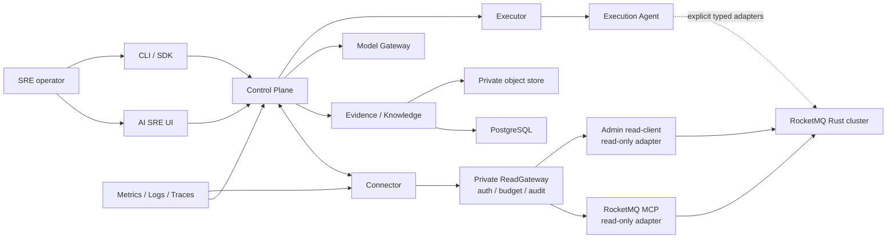

# RocketMQ Rust AI SRE

[English](README.md) | [简体中文](README.zh-CN.md)

RocketMQ Rust AI SRE is an evidence-driven operations intelligence and
controlled automation platform for RocketMQ Rust. It combines deterministic
diagnostics, large language models, observability data, operational knowledge,
and explicit safety controls in a dedicated SRE workspace.

The project is maintained as a standalone Rust 2024 workspace inside the
RocketMQ Rust repository. It has its own dependency graph, lockfile, services,
desktop-oriented web UI, API contracts, SDKs, deployment assets, and validation
tools. It integrates with `rocketmq-mcp` over MCP Streamable HTTP and does not
import MCP server DTOs or reuse the ordinary RocketMQ Dashboard session and
mutation surfaces.

## What the project provides

| Area | Capabilities |
| --- | --- |
| Cluster access | Tenant-scoped onboarding, capability negotiation, topology and asset inventory, bounded synthetic probes, and read-only RocketMQ evidence collection through MCP |
| Evidence | Versioned Evidence contracts, canonical JSON and content hashes, freshness and partial-result semantics, PostgreSQL metadata, and private object storage for large payloads |
| Diagnostics | Deterministic Diagnostic Packs, hypothesis and counter-evidence tracking, inspections, health and SLO analysis, alert correlation, and Incident timelines |
| AI assistance | Provider-neutral model IR, capability-aware routing, streaming, fallback, budgets, redaction, RAG support, and heterogeneous primary/Critic model lineage |
| Prediction | Capacity and backlog forecasts, anomaly and change-point hints, What-if simulation, upgrade readiness, and disaster-recovery readiness |
| Controlled automation | Typed Action Plans, policy evaluation, non-self human approval, immutable grants, supervised execution, verification, rollback, leases, fencing, and recovery |
| Enterprise operations | Fleet and regional views, release escort, DR Center, compliance and governance indexes, integrations, notification delivery, postmortems, and FinOps views |
| Interfaces | Full-width desktop AI SRE UI, versioned HTTP APIs, generated OpenAPI contracts, read-only Rust and TypeScript clients, and an operator CLI |

The system follows an evidence-first workflow:

```text
observe → correlate → diagnose → recommend → govern → execute → verify → learn
```

Rules and typed contracts remain authoritative for safety decisions. A model
can explain evidence and propose a plan, but it cannot bypass capability,
policy, approval, credential, lease, fencing, or verification boundaries.

## Architecture



The ordinary RocketMQ operations UI and the AI SRE UI are separate products.
The Dashboard remains the direct resource-management interface. AI SRE owns
cross-signal diagnosis, Incident workflows, recommendations, governance,
supervised execution, Fleet operations, and audit history. The two can
cooperate through scoped read-only context and deep links without sharing
sessions or raw mutation APIs.

## Safety model

- MCP and Connector are read-only. They never expose RocketMQ apply, delete,
  reset, clean, or arbitrary Admin operations.
- Every RocketMQ read crosses one private Connector
  [ReadGateway](docs/read-gateway-contract.md). MCP and Admin adapters share
  tenant/cluster authorization, rate and concurrency admission, deadline,
  cancellation, output bounding, redaction, and typed audit policy.
- Evidence, logs, diagnostics, errors, and model requests are bounded and
  sanitized. Credentials, tokens, ACL/TLS material, private keys, message
  bodies, and full configuration values are excluded.
- Provider credentials are resolved from secret references. Built-in provider
  profiles contain protocol defaults, not API keys.
- Target changes use a separate Executor and Execution Agent path. The
  Executor has no target credentials or target network access.
- Mutation adapters are typed, individually enabled, policy constrained, and
  protected by approval, idempotency, leases, fencing, verification, and
  rollback semantics.
- Unsupported schema majors, capability drift, identity mismatch, unsafe
  provider behavior, and incomplete execution authority fail closed.
- PostgreSQL is the durable system of record. In-memory repositories are
  reserved for tests.

For detailed boundary decisions, see
[Project boundaries](docs/decisions/0001-project-boundaries.md) and
[Read-only MCP boundary](docs/decisions/0002-read-only-mcp-boundary.md).

## Model providers

The Model Gateway uses a canonical model IR and protocol adapters instead of
binding product logic to a single vendor SDK.

| Provider or runtime | Protocol family |
| --- | --- |
| OpenAI and compatible gateways | OpenAI-compatible |
| Azure OpenAI | Azure OpenAI-compatible |
| Anthropic | Anthropic Messages |
| Google Gemini | Gemini native |
| AWS Bedrock | Bedrock Converse with SigV4 |
| DeepSeek | OpenAI-compatible and Anthropic-compatible profiles |
| Zhipu GLM | GLM/OpenAI-compatible |
| Kimi / Moonshot | OpenAI-compatible, with an explicit opt-in MFJS profile |
| vLLM, Ollama, llama.cpp, and SGLang | Local OpenAI-compatible runtimes |
| Enterprise model gateways | Configurable OpenAI-compatible profile |

Each profile declares its effective chat, tool, structured-output, reasoning,
streaming, embedding, reranking, data-classification, region, cost, and context
capabilities. Routing rejects a provider that cannot satisfy the request
instead of silently degrading the contract.

See [Model compatibility](docs/compatibility.md) and
[Extension guide](docs/phase05-extension-guide.md).

## Workspace crates

| Crate | Responsibility |
| --- | --- |
| `rocketmq-sre-contracts` | Versioned domain, wire, persistence, Evidence, Incident, plan, execution, and extension contracts; independent of networking, async runtimes, databases, and RocketMQ implementations |
| `rocketmq-sre-core` | Incident coordination, deterministic domain services, and descriptor registry |
| `rocketmq-sre-model-gateway` | Canonical model IR, provider profiles, protocol adapters, routing, streaming, budgets, fallback, and Critic support |
| `rocketmq-sre-control-plane` | Product API and service composition root, persistence, onboarding, diagnostics, governance, and operator workflows |
| `rocketmq-sre-connector` | Authenticated MCP client, capability handshake, schema validation, evidence conversion, and data-source health |
| `rocketmq-sre-executor` | Supervised execution journal, policy/approval enforcement, dispatch, verification, rollback, and recovery without target credentials |
| `rocketmq-sre-execution-agent` | Isolated typed target adapters, credential separation, leases, fencing, idempotency, and effect reconciliation |
| `rocketmq-sre-probe` | Bounded producer/consumer probe for dedicated synthetic topics and groups |
| `rocketmq-sre-eval` | Schema export, coverage validation, deterministic evaluations, and acceptance utilities |
| `rocketmq-sre-client` | Fixed read-only Rust client for status, cluster, Incident, inspection, plan, and OpenAPI queries |
| `rocketmq-sre-cli` | Read-only operator commands and local-only typed Plan and Runbook draft validation |

Additional project areas include:

- `ui/`: React 18, TypeScript, Vite, Tailwind CSS, Radix UI, and shadcn/ui-style
  components for the desktop workspace.
- `migrations/`: forward-only PostgreSQL migrations.
- `openapi/` and `sdk/`: generated API contracts and client SDKs.
- `config/`: capability, observability, policy, and coverage catalogs.
- `deploy/`: Docker Compose and Kind development/acceptance environments.
- `docs/`: architecture decisions, protocol contracts, extension guides, and
  operational records.

## Quick start

### Prerequisites

- Rust 1.95 or newer
- Docker Desktop or Docker Engine with Docker Compose
- Node.js and npm for UI development
- PowerShell 7 or Windows PowerShell for the provided local scripts

PostgreSQL runs in Docker; no host PostgreSQL installation is required.

From the repository root:

```powershell
.\rocketmq-sre\scripts\dev.ps1 -Action Up
```

The principal local endpoints are:

| Service | URL |
| --- | --- |
| AI SRE UI | `http://localhost:3004` |
| Control Plane API | `http://localhost:8090` |
| MCP Streamable HTTP | `https://localhost:8089` |
| Prometheus | `http://localhost:9090` |
| Loki | `http://localhost:3100` |
| Tempo | `http://localhost:3200` |

Stop the stack while preserving PostgreSQL and Evidence volumes:

```powershell
.\rocketmq-sre\scripts\dev.ps1 -Action Down
```

For local identities, TLS fixtures, ports, smoke tests, volume reset behavior,
and troubleshooting, see the [local environment guide](deploy/dev/README.md).

## Development

Run Rust commands from `rocketmq-sre/`:

```powershell
python scripts/check_source_layout.py
python scripts/check_execution_dependency_boundary.py
python scripts/check_read_gateway_boundary.py
cargo fmt -p rocketmq-sre-contracts -p rocketmq-sre-core -p rocketmq-sre-model-gateway -p rocketmq-sre-control-plane -p rocketmq-sre-connector -p rocketmq-sre-executor -p rocketmq-sre-execution-agent -p rocketmq-sre-probe -p rocketmq-sre-eval -p rocketmq-sre-client -p rocketmq-sre-cli -- --check
cargo check --locked --workspace
cargo test --locked --workspace --all-features
cargo clippy --locked --workspace --all-targets --all-features -- -D warnings
cargo doc --locked --workspace --no-deps
```

Run UI commands from the repository root:

```powershell
npm --prefix rocketmq-sre/ui ci
npm --prefix rocketmq-sre/ui run lint
npm --prefix rocketmq-sre/ui run test -- --run
npm --prefix rocketmq-sre/ui run build
```

The Rust workspace uses the Rust 2024 module layout: `foo.rs` owns child modules
under `foo/`. Legacy `foo/mod.rs` entry points are rejected.

### Diagnostic qualification

The versioned qualification manifest covers every built-in Diagnostic Pack with
isolated normal, fault, and missing-Evidence scenarios. The live harness starts
a disposable PostgreSQL 17 container, exercises the running Control Plane, and
verifies persisted results, Evidence citations, schema rejection, and tenant and
cluster boundaries. It remains rules-only: model network calls, target mutation,
and execution records must all remain zero.

Run the qualification from `rocketmq-sre/`; build output stays on `F:` and the
redacted report is written outside the repository on `D:`:

```powershell
.\scripts\diagnostic-pack-live-qualification.ps1
```

PostgreSQL uses a bounded Docker `tmpfs` and is removed after the run. The
committed contract is checked independently with:

```powershell
python scripts/check_diagnostic_pack_qualification.py
```

### Bounded R1 action qualification

The R1 qualification contract covers the four registered low-risk actions
without granting generic Admin, shell, or Kubernetes patch access. Each action
is bound to its descriptor, owner, independent enable switch, typed precheck,
and the shared lease, fence, journal, verification, audit, and quarantine
boundaries.

The live harness uses a disposable Kind deployment and the running Control
Plane, Executor, Execution Agent, PostgreSQL, Broker, Proxy, and OpenTelemetry
Collector. Real target changes are limited to one logger TTL override, one
Proxy replica, one Proxy pod, or one Collector pod. Deterministic failure and
recovery cases use an isolated PostgreSQL schema and a typed Agent test double,
so the report distinguishes real target execution from controlled recovery
simulation. Proxy capacity is restored, the logger override expires, workloads
must return Ready, and qualification-owned resources are removed before a run
can pass.

Run from `rocketmq-sre/` after bringing up the documented Kind environment:

```powershell
.\scripts\r1-action-live-qualification.ps1
```

The redacted report is written under `D:\rocketmq-sre-evidence` and is never a
production certificate. Model-provider network calls remain zero. Validate the
committed catalog independently with:

```powershell
python scripts/check_r1_action_qualification.py
```

### Controlled R2 action qualification

The R2 qualification contract covers the five approved moderate-risk actions:
allowlisted Broker, Topic, and Subscription Group configuration patches; a
single digest-pinned Proxy image canary; and overlap-first credential rotation.
Every plan must pass an offline heterogeneous Critic, independent human
approval, hash-bound authorization, generation or version fencing, typed Agent
precheck, durable execution journaling, stable-window verification, and
automatic compensation. Unattended execution remains disabled.

The qualification entry point creates a new disposable Kind cluster from a
clean committed revision, registers an immutable local canary image, runs all
five actions through the Control Plane, Executor, and Execution Agent, and
validates deterministic recovery cases in isolated PostgreSQL schemas. It then
removes the canary, credential fixtures, bootstrap job, cluster, and generated
runtime artifacts before writing a passing report. The scripted Critic uses a
different model family but performs no provider network call.

Run from `rocketmq-sre/`; build output stays on `D:` and `F:`, and the redacted
report is written outside the repository on `D:`:

```powershell
.\scripts\r2-action-live-qualification.ps1
```

The report is implementation qualification rather than production
certification. Validate the committed catalog independently with:

```powershell
python scripts/check_r2_action_qualification.py
```

### Bounded-autonomy qualification

The autonomy qualification contract covers the same four approved R1 actions
without enabling unattended target execution. A clean committed revision is
deployed to a new disposable Kind cluster with PostgreSQL running inside the
cluster. For each action, the harness persists 20 Shadow outcomes, enforces a
seven-day observation window, persists five human-approved Supervised
successes, verifies an offline heterogeneous Critic binding, and exercises
fail-closed safety controls, ExpectedDeny handling, failure pause, owner
recovery, real Supervised execution, and cleanup.

Live target execution is capped at `Supervised`. Qualification may calculate
that Autonomous promotion prerequisites are satisfied, but it never performs
that live transition and never dispatches an unattended target mutation. The
scripted primary and Critic identities are contract fixtures only; provider
credentials and model network calls are forbidden. DeepSeek-backed diagnosis
is intentionally integrated last, after the remaining non-model readiness
work, when an API key is supplied.

Run from `rocketmq-sre/`; the harness creates and destroys its own cluster,
keeps build output on `D:` and `F:`, and writes the redacted report outside the
repository:

```powershell
.\scripts\autonomy-action-live-qualification.ps1
```

The report is implementation qualification, not production certification. The
committed contract can be checked without a cluster:

```powershell
python scripts/check_autonomy_action_qualification.py
```

## User interface

The UI is designed as a full-screen desktop operations workspace using
shadcn/ui conventions and accessible Radix UI primitives. The supported design
targets are 1280×720, 1440×900, and 1920×1080. Dedicated mobile interaction
design is intentionally outside the current scope.

## Documentation

- [Local environment](deploy/dev/README.md)
- [Kind environment](deploy/kind/README.md)
- [Compatibility](docs/compatibility.md)
- [Project boundaries](docs/decisions/0001-project-boundaries.md)
- [Read-only MCP boundary](docs/decisions/0002-read-only-mcp-boundary.md)
- [Control Plane–Connector mTLS](docs/control-plane-connector-mtls.md)
- [Connector transport](docs/connector-control-plane-transport-adr.md)
- [Connector ReadGateway](docs/read-gateway-contract.md)
- [Diagnostic Pack catalog](docs/phase02-diagnostic-packs.md)
- [Execution contracts](docs/phase03-execution-contracts.md)
- [Plan, policy, approval, and audit](docs/phase03-plan-policy-approval.md)
- [Operations guide](docs/phase05-operations-guide.md)
- [Extension guide](docs/phase05-extension-guide.md)

## License

Licensed under the Apache License, Version 2.0.
