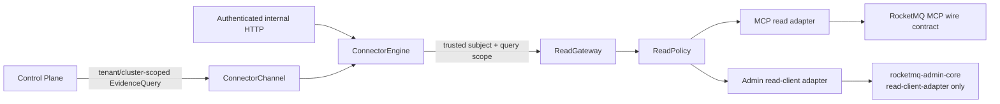

# Connector ReadGateway Contract

## Status

Accepted as the private RocketMQ read boundary of `rocketmq-sre-connector`.
The contract is intentionally crate-private: the Control Plane exchanges only
versioned `EvidenceQuery` and response contracts over ConnectorChannel.

## Trust boundary



The Control Plane does not link an MCP client, Admin client, Connector
implementation, or target credential. HTTP bearer validation and
ConnectorChannel session validation complete before a `ReadContext` is
constructed.

## Request and admission contract

Every logical RocketMQ read obtains one `ReadSession`. Composite inventory,
topology, runtime, and Required Signals reads reuse that session for all MCP
and Admin sub-reads. The session proves that these checks completed:

- configured tenant and internal cluster identifiers match;
- the external cluster is both mapped and allowlisted;
- the authenticated subject is present and bounded;
- the time range and absolute deadline are within configured maxima;
- cancellation has not occurred;
- the shared requests-per-minute and concurrency budgets admit the request.

MCP and Admin adapters cannot construct a session or change a budget. A
deadline or cancellation observed before completion returns a typed error and
prevents cache publication.

## Fixed adapter surface

The MCP adapter accepts only the `EvidenceOperation` enum and the two protected
system resource URIs. MCP initialization verifies protocol and business schema
versions, the task-forbidden read-only tool surface, resources, cluster, and
surface digest.

The Admin adapter accepts only the fixed resources implemented by
`AdminQuerySource`, plus typed producer and consumer connection reads. Its
dependency enables only `rocketmq-admin-core/read-client-adapter`; mutation,
`admin-full`, and dangerous tool features are not reachable.

`ReadAdminSession` requires mutable single-owner access. The adapter therefore
uses a Tokio mutex to serialize bounded read futures. It never holds a
synchronous lock across `.await`, and shutdown removes the session and runtime
from state before awaiting lifecycle completion.

## Output policy

Adapter output passes through `sanitize_and_bound` before it leaves the
gateway. The policy:

- rejects message bodies and payloads;
- removes credentials, tokens, ACL/TLS material, private keys, configuration
  secrets, and client addresses;
- pseudonymizes message and trace identifiers;
- limits rows, strings, warning count, and encoded bytes;
- preserves explicit partial coverage without inventing missing data.

Sanitization is idempotent for the connector's canonical
`sha256:<64 lowercase hex>` pseudonyms, so composite reads do not hash an
already protected identifier a second time.

## Error and audit contract

Stable failure codes include `tenant_mismatch`, `cluster_not_allowed`,
`unauthorized_scope`, `rate_limited`, `deadline_exceeded`, `query_cancelled`,
`output_too_large`, `capability_mismatch`, and `source_unavailable`.

Each adapter attempt records only:

- adapter kind;
- fixed resource class;
- typed outcome (`Allowed`, `Denied`, `RateLimited`, `TimedOut`, `Cancelled`,
  or `SourceFailed`);
- latency bucket;
- correlation identifier.

Audit events and errors never contain a bearer token, Admin credential,
message body, request/config dump, TLS certificate, ACL material, tenant
subject, or raw adapter response.

## Credential ownership

| Credential | Owner | Visibility |
| --- | --- | --- |
| Control Plane channel identity | Connector channel transport | Used before `ReadContext`; never passed to adapters |
| MCP bearer/OAuth material | Connector MCP transport | Private to token provider and transport |
| Admin access/secret/security token | Connector Admin adapter | Converted to read-client credentials; never logged |
| Target mutation credentials | Execution Agent | Not linked into Connector or ReadGateway |

## Validation

Run from `rocketmq-sre/`:

```powershell
python scripts/check_read_gateway_boundary.py
cargo test --locked -p rocketmq-sre-connector --test read_gateway_contract
cargo test --locked -p rocketmq-sre-connector --lib read_gateway::tests
cargo test --locked -p rocketmq-sre-control-plane connector_channel
```

The boundary script fails when Control Plane gains an MCP/Admin/Connector
dependency, the Admin mutation feature graph becomes reachable, SourceManager
owns an adapter directly, or any connector module outside the gateway and
adapter implementations uses those sources.

## Explicitly deferred

Organization IdP/OIDC integration, real commercial model providers, production
object storage, Docker image validation, six-hour soak, and full disaster
recovery exercises remain later validation or integration work. None broadens
this read-only contract.
