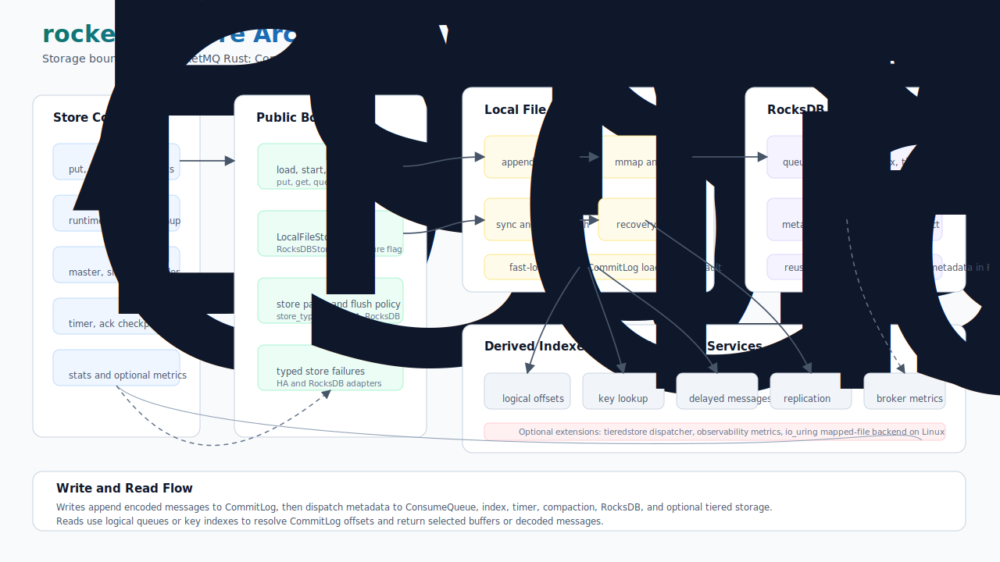

# rocketmq-store

[](https://crates.io/crates/rocketmq-store)
[](../LICENSE-APACHE)

`rocketmq-store` 是
[rocketmq-rust](https://github.com/mxsm/rocketmq-rust) 工作区的存储层。它提供面向 broker
的 `MessageStore` 边界、本地文件 CommitLog 和 ConsumeQueue 存储、RocksDB 元数据存储、
索引构建、定时消息支持、POP checkpoint 模型、HA 复制服务、存储统计，以及可选的分级存储和可观测性集成。

这个 crate 面向 RocketMQ broker 内部使用，也适合需要参与 Rust 实现中持久化、恢复、分发、复制或存储性能工作的贡献者。

[English](README.md)

## 架构



store 围绕几个稳定边界组织：

- **`MessageStore` trait**：面向 broker 的生命周期、消息写入、读取、offset 查询、key 查询、CommitLog 访问、HA 元数据、清理和运行时信息 API。
- **`GenericMessageStore`**：按 feature gate 委托到 `LocalFileMessageStore` 或 `RocksDBMessageStore` 的枚举包装。
- **本地文件存储**：默认实现，围绕 CommitLog、mapped file、ConsumeQueue、索引文件、checkpoint、flush 服务和恢复流程构建。
- **RocksDB 存储**：可选实现边界，继续复用本地文件 CommitLog 路径，同时通过 RocksDB 服务保存 consume queue、index、timer 和 transaction 元数据。
- **分发流水线**：CommitLog append 产生 dispatch request，并构建 ConsumeQueue、key index、compaction metadata、RocksDB metadata 以及可选 tiered-store dispatch。
- **后台服务**：文件预分配、flush、恢复、清理、HA 复制、定时消息处理、统计以及可选 observability metrics。

## 能力

- 将单条或批量 broker 消息追加到 CommitLog。
- 按 topic、queue、逻辑 offset、大小限制或物理 CommitLog offset 读取消息。
- 通过索引服务按 key 查询消息。
- 维护队列 offset、逻辑 ConsumeQueue 文件、批量 ConsumeQueue 和 ConsumeQueue 扩展元数据。
- 重启后恢复 CommitLog 和 ConsumeQueue 状态；默认 `fast-load` feature 支持优化的并行 CommitLog 加载。
- 通过 `FlushDiskType` 支持同步和异步刷盘策略。
- 支持 sync master、async master、slave 以及 controller-mode 角色切换场景下的 HA 复制语义。
- 通过 `StoreStatsService` 和 `BrokerStatsManager` 维护 broker 与 store 统计数据。
- 提供定时消息相关数据结构和 timer RocksDB dispatch 支持。
- 提供 POP ack 和 checkpoint 模型。
- 可选使用 RocksDB 保存 consume queue、index、timer 和 transaction 元数据。
- 可选将消息数据分发到 `rocketmq-tieredstore`。
- 可选通过 `rocketmq-observability` 暴露 OpenTelemetry 兼容指标。

## 快速开始

在工作区根目录构建默认本地文件存储实现：

```bash
cargo build -p rocketmq-store
```

作为工作区依赖使用：

```toml
[dependencies]
rocketmq-store = { path = "../rocketmq-store" }
```

创建并启动本地文件 message store：

```rust
use std::sync::Arc;

use cheetah_string::CheetahString;
use dashmap::DashMap;
use rocketmq_common::common::broker::broker_config::BrokerConfig;
use rocketmq_common::common::config::TopicConfig;
use rocketmq_rust::ArcMut;
use rocketmq_store::base::message_store::MessageStore;
use rocketmq_store::config::message_store_config::MessageStoreConfig;
use rocketmq_store::message_store::local_file_message_store::LocalFileMessageStore;

async fn start_store() -> Result<(), rocketmq_store::store_error::StoreError> {
    let topic_table: Arc<DashMap<CheetahString, ArcMut<TopicConfig>>> = Arc::new(DashMap::new());
    let mut store = ArcMut::new(LocalFileMessageStore::new(
        Arc::new(MessageStoreConfig::default()),
        Arc::new(BrokerConfig::default()),
        topic_table,
        None,
        false,
    ));

    let store_ref = store.clone();
    store.set_message_store_arc(store_ref);

    store.init().await?;
    if store.load().await {
        store.start().await?;
    }

    store.shutdown().await;
    Ok(())
}
```

构建或测试 RocksDB 元数据存储路径时启用 `rocksdb_store`：

```bash
cargo build -p rocketmq-store --features rocksdb_store
```

## Feature Flags

| Feature | 默认 | 说明 |
| --- | --- | --- |
| `local_file_store` | 是 | 启用默认本地文件 message store。 |
| `fast-load` | 是 | 启用优化后的并行 CommitLog 加载。 |
| `safe-load` | 否 | 保留安全的顺序加载路径，用于回退场景。 |
| `rocksdb_store` | 否 | 启用 RocksDB 模块和 `RocksDBMessageStore`。 |
| `rocksdb-store` | 否 | `rocksdb_store` 的兼容别名。 |
| `data_store` | 否 | 启用 `local_file_store` 的兼容 feature。 |
| `io_uring` | 否 | 启用 Linux-only `tokio-uring` mapped-file 后端实验。 |
| `tieredstore` | 否 | 启用与 `rocketmq-tieredstore` 的集成。 |
| `observability` | 否 | 通过 `rocketmq-observability` 启用 OpenTelemetry 指标输出。 |
| `observability-traces` | 否 | 启用 observability crate 集成，但不启用 metrics feature set。 |

默认 feature set 为 `["local_file_store", "fast-load"]`。

## 核心 API

| 领域 | 重要类型 |
| --- | --- |
| Store 边界 | `MessageStore`, `GenericMessageStore`, `LocalFileMessageStore`, `RocksDBMessageStore` |
| 配置 | `MessageStoreConfig`, `FlushDiskType`, `StoreType`, store path helpers |
| 写入路径 | `CommitLog`, `DefaultAppendMessageCallback`, `PutMessageResult`, `AppendMessageResult` |
| 读取路径 | `GetMessageResult`, `SelectMappedBufferResult`, `QueryMessageResult` |
| 分发 | `CommitLogDispatcher`, `DispatchRequest`, ConsumeQueue 和 index dispatchers |
| 队列 | `ConsumeQueueStore`, `ConsumeQueue`, `BatchConsumeQueue`, `ConsumeQueueExt` |
| Mapped files | `MappedFile`, `DefaultMappedFile`, `MappedFileQueue`, `TransientStorePool` |
| 索引 | `IndexService`, `IndexFile`, `IndexHeader`, `QueryOffsetResult` |
| RocksDB | `RocksDbStore`, `RocksDbConfig`, RocksDB consume queue、index、timer 和 transaction services |
| HA | `GeneralHAService`, `DefaultHAService`, `AutoSwitchHAService`, HA clients and connections |
| Timer 和 POP | `TimerMessageStore`, timer log/wheel/checkpoint types, `AckMsg`, `BatchAckMsg`, `PopCheckPoint` |
| Stats 和 hooks | `StoreStatsService`, `BrokerStatsManager`, put-message 和 send-message-back hooks |

## 存储模型

### 本地文件存储

默认 store 将消息体持久化到 CommitLog mapped files，并为 broker 读取构建逻辑索引：

1. `put_message` 或 `put_messages` 编码 broker 消息并追加到 CommitLog。
2. CommitLog 产生 `DispatchRequest`。
3. Dispatcher 更新 ConsumeQueue、index、compaction metadata、timer state，以及可选 tiered 或 RocksDB metadata。
4. `get_message` 使用 topic/queue 逻辑 offset 定位 CommitLog 物理 offset，并返回选中的消息 buffer。
5. 恢复流程通过 checkpoint、CommitLog 扫描和 ConsumeQueue 重建恢复 store 状态。

### RocksDB 存储

当启用 `rocksdb_store` feature 且 `MessageStoreConfig.store_type` 为 `StoreType::RocksDB` 时，可以使用
`RocksDBMessageStore`。它当前保留本地文件 CommitLog 路径，并将元数据所有权移动到 RocksDB-backed services：

- consume queue entries 和 queue offsets
- key index records
- 可选 timer records
- 可选 transaction records
- RocksDB flush、compaction、checkpoint 和 backup scheduling 等维护操作

这种设计在不改变共享 `MessageStore` API 的前提下，为 broker 提供了明确的 RocksDB 边界。

## 可靠性与恢复

- CommitLog 加载支持默认 `fast-load` 路径和顺序回退路径。
- 恢复测试覆盖 CommitLog 加载、文件截断、恢复位置和 dirty data 处理。
- HA 测试覆盖 sync master slave timeout、`wait_store_msg_ok` 行为和 controller-mode 角色切换。
- RocksDB foundation 和 store semantics 测试覆盖 Java-compatible defaults、column family layout、range scan、index records、timer records、transaction records 和 generic store delegation。
- Timer recovery integration tests 覆盖延迟消息重启恢复行为。

## Crate 结构

```text
rocketmq-store/
  src/base/                 MessageStore trait、结果类型、dispatch、stats、checkpoint
  src/config/               MessageStoreConfig、flush policy、store path helpers
  src/log_file/             CommitLog、mapped files、flush manager、recovery、fast load
  src/message_store/        LocalFileMessageStore 和可选 RocksDBMessageStore
  src/queue/                ConsumeQueue implementations 和 queue stores
  src/index/                key index file 和 service
  src/ha/                   replication clients、connections 和 services
  src/rocksdb/              可选 RocksDB store、codec、CF、maintenance、indexes
  src/timer/                timer message store、timer log、wheel、checkpoint、metrics
  src/pop/                  POP ack 和 checkpoint models
  src/stats/                broker 和 store statistics
  src/tieredstore.rs        可选 tiered-store dispatcher adapter
  tests/                    recovery、HA、RocksDB、timer 和 performance tests
  benches/                  CommitLog、mapped buffer、delivery、zero-copy、RocksDB benches
```

## 开发

修改该 crate 时常用检查：

```bash
cargo test -p rocketmq-store --lib
cargo test -p rocketmq-store --test commitlog_recovery_tests
cargo test -p rocketmq-store --features rocksdb_store --test rocksdb_foundation_tests
cargo clippy -p rocketmq-store --all-targets --all-features -- -D warnings
```

针对存储性能工作的 benchmark：

```bash
cargo bench -p rocketmq-store --bench commit_log_performance
cargo bench -p rocketmq-store --bench commitlog_recovery_bench -- commitlog_recovery/phase5_platform_acceptance
cargo bench -p rocketmq-store --bench mapped_buffer_bench
cargo bench -p rocketmq-store --features rocksdb_store --bench rocksdb_store
```

Phase 5 platform optimization acceptance writes
`target/recovery-baseline/phase5/commitlog-recovery-phase5-platform-acceptance.json`.
The artifact records platform-specific I/O hint and lazy mmap conclusions, keeps
unmeasured or low-benefit paths disabled by default, and lists the recovery
correctness commands required before enabling platform-specific optimizations.

当 store API、恢复行为、feature-gated 存储路径或 broker-facing 语义发生变化时，应运行更大范围的工作区验证。

## 设计边界

- 该 crate 是 broker 存储组件，不是独立 broker 进程。
- 本地文件 store 是当前工作区默认生产路径。
- RocksDB 支持通过 feature gate 启用，当前建模为元数据存储，同时继续复用本地文件 CommitLog 路径。
- Timer、tiered storage、RocksDB 和 observability 路径均通过 feature gate 控制，让默认 store 保持聚焦。
- 很多 API 是 broker 内部接口，优先服务 RocketMQ 语义，而不是通用嵌入式数据库接口。

## 许可证

本项目使用 Apache License 2.0 许可证。详情请参见
[`LICENSE-APACHE`](../LICENSE-APACHE)。
