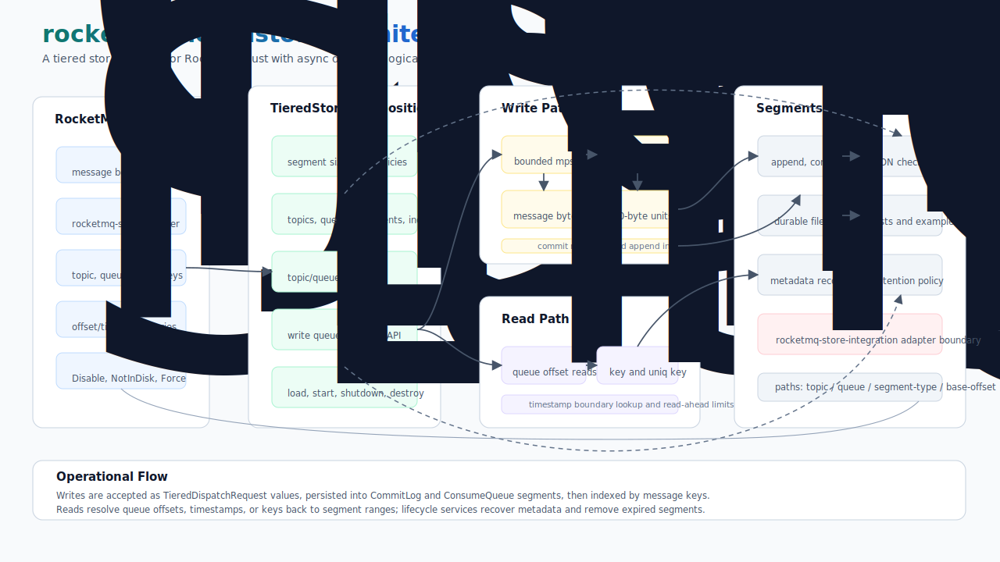

# rocketmq-tieredstore

[](https://crates.io/crates/rocketmq-tieredstore)
[](../LICENSE-APACHE)

`rocketmq-tieredstore` 是
[rocketmq-rust](https://github.com/mxsm/rocketmq-rust) 工作区的分级存储层。它提供面向 broker 的
dispatch 与 fetch 模型，用于把较旧消息或符合策略的消息移动到二级存储，同时保持 RocketMQ 的 queue offset、timestamp 和 key query 语义。

该 crate 包含 `TieredStore` 组合根、异步 dispatch 流水线、逻辑消息 fetcher、flat-file segment 模型、JSON metadata store、POSIX 和 memory provider、恢复与清理服务，以及 `rocketmq-store` 使用的集成边界。

[English](README.md)

## 架构



tiered store 主要由六个部分组成：

- **`TieredStore`**：组合根，负责装配配置、metadata、flat files、dispatcher、fetcher、recovery、cleanup 和 shutdown token。
- **Dispatcher path**：接收 `TieredDispatchRequest`，校验消息体大小，将消息字节追加到 CommitLog segment，写入 ConsumeQueue unit，提交 metadata，并构建 key/unique-key index。
- **Fetcher path**：按 topic、queue 和逻辑 queue offset 读取消息；按 store timestamp 解析 offset；按 key 或 unique key 查询消息。
- **Flat-file model**：管理 topic/queue 维度的 flat files，底层由 CommitLog、ConsumeQueue 和 Index file segments 组成。
- **Metadata model**：通过 `JsonMetadataStore` 持久化 topics、queues、file segments 和 index entries。
- **Provider model**：通过 `TieredStoreProvider` 实现保存 segment 字节。内置 provider 包括 POSIX 文件和内存存储。

## 能力

- 将消息体和队列元数据分发到 tiered CommitLog 与 ConsumeQueue segments。
- 通过固定 20 字节的 ConsumeQueue unit 保持 RocketMQ 逻辑 queue offset。
- 按 queue offset、store timestamp boundary、key 或 unique key 查询 tiered messages。
- 持久化并恢复 topic、queue、file segment 和 index entry metadata。
- 重启后恢复 flat files，并根据 provider 的真实 segment size 修正半提交 segment metadata。
- 按保留策略清理过期 segment 和 index metadata。
- 通过 `TieredStorageLevel` 选择分级存储策略。
- 使用 POSIX 文件存储本地持久化 tiered data。
- 使用 memory provider 支持测试、示例和自定义嵌入。
- 通过 tiered CommitLog dispatcher adapter 与 `rocketmq-store` 集成。

## 快速开始

在工作区根目录构建该 crate：

```bash
cargo build -p rocketmq-tieredstore
```

作为工作区依赖使用：

```toml
[dependencies]
rocketmq-tieredstore = { path = "../rocketmq-tieredstore" }
```

使用 memory provider 创建 store、分发一条消息、通过 shutdown drain dispatcher，然后按 queue offset 读取消息：

```rust
use bytes::Bytes;
use rocketmq_error::RocketMQError;
use rocketmq_tieredstore::{
    TieredDispatchRequest, TieredDispatcher, TieredLifecycle, TieredMessageFetcher,
    TieredStorageLevel, TieredStore, TieredStoreConfig,
};

async fn example() -> Result<(), RocketMQError> {
    let store = TieredStore::new(TieredStoreConfig {
        storage_level: TieredStorageLevel::Force,
        backend_provider: "memory".to_owned(),
        max_pending_tasks: 16,
        ..TieredStoreConfig::default()
    })?;

    store.load().await?;
    store.start().await?;

    let body = Bytes::from_static(b"hello-tieredstore");
    store
        .dispatcher()
        .dispatch(TieredDispatchRequest {
            topic: "ExampleTopic".to_owned(),
            queue_id: 0,
            queue_offset: 0,
            commit_log_offset: 0,
            message_size: body.len() as i32,
            tags_code: 0,
            store_timestamp: 1_700_000_000,
            keys: Some("example-key".to_owned()),
            uniq_key: Some("example-uniq".to_owned()),
            offset_id: None,
            sys_flag: 0,
            body: Some(body),
        })
        .await?;

    store.shutdown().await?;

    let fetched = store
        .fetcher()
        .get_message("ExampleTopic".to_owned(), 0, 0, 1)
        .await?;

    assert_eq!(fetched.messages.len(), 1);
    Ok(())
}
```

运行内置示例：

```bash
cargo run -p rocketmq-tieredstore --example basic_memory_tieredstore
```

使用默认 POSIX provider 保存本地持久化 tiered data：

```rust
use rocketmq_tieredstore::{TieredStorageLevel, TieredStore, TieredStoreConfig};

let store = TieredStore::new(TieredStoreConfig {
    storage_level: TieredStorageLevel::Force,
    backend_provider: "posix".to_owned(),
    store_path_root_dir: "./store/tieredstore".into(),
    ..TieredStoreConfig::default()
})?;
# Ok::<_, rocketmq_error::RocketMQError>(())
```

## Feature Flags

| Feature | 默认 | 说明 |
| --- | --- | --- |
| `posix-provider` | 是 | 启用 POSIX file provider。 |
| `memory-provider` | 是 | 启用测试和示例使用的 in-memory provider。 |
| `serde` | 是 | 启用 JSON metadata 序列化与反序列化。 |
| `rocketmq-store-integration` | 否 | 启用 `rocketmq-store` 使用的集成边界。 |

默认 feature set 为 `["posix-provider", "memory-provider", "serde"]`。

## Storage Levels

| Level | 含义 |
| --- | --- |
| `Disable` | 禁用 tiered storage dispatch。 |
| `NotInDisk` | 对不再期望存在于本地磁盘层的数据启用 tiered storage。 |
| `NotInMem` | 对不再期望存在于本地内存层的数据启用 tiered storage。 |
| `Force` | 对符合条件的 request 强制执行 tiered storage dispatch。 |

`TieredStorageLevel::check` 按策略强度比较等级，`TieredStorageLevel::enabled` 决定 dispatch 是否接收有效请求。

## 核心 API

| 领域 | 重要类型 |
| --- | --- |
| 组合根 | `TieredStore`, `TieredStoreConfig`, `TieredStorageLevel`, `TieredLifecycle` |
| Dispatch | `TieredDispatcher`, `DefaultTieredDispatcher`, `TieredDispatchRequest` |
| Fetch | `TieredMessageFetcher`, `DefaultTieredMessageFetcher`, `TieredGetMessageResult`, `TieredQueryResult` |
| Flat files | `TieredFlatFileStore`, `TieredFlatFile`, `TieredFileSegment`, `FileSegmentType`, `FileSegmentStatus` |
| Segments | `CommitLogSegment`, `ConsumeQueueSegment`, `IndexFileSegment`, `ConsumeQueueUnit`, `TieredIndexEntry` |
| Metadata | `TieredMetadataStore`, `JsonMetadataStore`, `TopicMetadata`, `TopicQueueMetadata`, `FileSegmentMetadata` |
| Providers | `TieredStoreProvider`, `ProviderKind`, `PosixProvider`, `MemoryProvider` |
| Services | `CommitLogRecoverService`, `TieredRecoverResult`, cleanup service set |

## 数据模型

### 写入路径

1. `rocketmq-store` 或嵌入方把 CommitLog dispatch 数据转换为 `TieredDispatchRequest`。
2. `DefaultTieredDispatcher` 通过有界 Tokio channel 接收 request。
3. dispatcher 校验 topic、queue id、queue offset、message size 和 body length。
4. `TieredFlatFile` 将消息字节追加到 CommitLog segment，并写入指向 tiered CommitLog offset 的 ConsumeQueue unit。
5. 启用索引时，`TieredFlatFileStore` 写入 key 和 unique-key entries。
6. `JsonMetadataStore` 持久化 queue 和 segment metadata。

### 读取路径

`DefaultTieredMessageFetcher` 通过 flat-file store 解析读取：

- `get_message` 先读取 ConsumeQueue units，再读取 CommitLog ranges。
- `get_message_timestamp` 从消息字节中提取 store timestamp。
- `get_offset_by_time` 和 `get_offset_by_time_with_boundary` 按 timestamp 解析 lower 或 upper queue-offset boundary。
- `query_message` 使用 tiered index entries 按普通 key 或 unique key 获取消息。

### Segment 布局

Segment 路径遵循 topic/queue/segment-type/base-offset 模型：

```text
<topic>/<queue-id>/commitlog/<base-offset>
<topic>/<queue-id>/consumequeue/<base-offset>
```

Metadata 持久化在：

```text
<store_path_root_dir>/config/tieredStoreMetadata.json
```

## 与 `rocketmq-store` 集成

`rocketmq-store` 负责 broker 本地 CommitLog dispatch。它的可选 tieredstore adapter 会把 store
`DispatchRequest` 转换为 `TieredDispatchRequest`，并转发给 `DefaultTieredDispatcher`。
这种方式让 tiered storage crate 保持独立，同时保留清晰的 broker 集成点。

## 可靠性与恢复

- `TieredLifecycle::load` 会运行 `CommitLogRecoverService`，加载 JSON metadata，重建 flat files，并恢复 index entries。
- 当 metadata size 与 provider 真实 segment size 不一致时，恢复流程会修正 segment metadata。
- `TieredLifecycle::start` 启动 dispatcher，并在启用删除时启动 cleanup service。
- `TieredLifecycle::shutdown` 取消后台任务，drain 已排队的 dispatch requests，并关闭 flat-file state。
- POSIX persistence tests 覆盖重启恢复、queue-offset fetch、timestamp lookup、key query 和 unique-key query。

## Crate 结构

```text
rocketmq-tieredstore/
  src/config.rs                 storage policy、provider selection、retention、read-ahead settings
  src/store.rs                  TieredStore 组合根和 lifecycle wiring
  src/dispatcher/               dispatch request model 和 async dispatcher
  src/fetcher/                  queue-offset、timestamp 和 key query fetcher
  src/file/                     flat files、CommitLog、ConsumeQueue、Index segments
  src/metadata/                 JSON metadata store 和 metadata records
  src/provider/                 POSIX 和 memory segment providers
  src/service/                  recovery 和 cleanup background services
  examples/                     可运行的 in-memory tiered store 示例
  tests/                        POSIX persistence 和 recovery tests
  benches/                      tieredstore benchmark target
```

## 开发

修改该 crate 时常用检查：

```bash
cargo test -p rocketmq-tieredstore --lib
cargo test -p rocketmq-tieredstore --test posix_persistence_tests
cargo clippy -p rocketmq-tieredstore --all-targets --all-features -- -D warnings
```

当处理 segment IO、dispatch throughput 或 fetch performance 时可运行 benchmark：

```bash
cargo bench -p rocketmq-tieredstore --bench tieredstore_bench
```

当修改 provider trait、dispatch 语义或 `rocketmq-store` 集成行为时，应运行更大范围的工作区验证。

## 设计边界

- 该 crate 实现 tiered storage layer，不是 broker 进程。
- 内置 provider 是 POSIX 文件和 in-memory storage。远端对象存储 provider 可以通过 `TieredStoreProvider` 扩展。
- metadata 当前在启用 `serde` feature 时使用 `JsonMetadataStore`。
- dispatch 是异步的，并受 `max_pending_tasks` 限制；shutdown 返回前会 drain 已排队请求。
- `TieredDispatchRequest` 需要携带消息体，并且 body length 必须与 `message_size` 匹配。
- `rocketmq-store` 集成被设计为 adapter boundary，以便 tiered store 保持可独立测试。

## 许可证

本项目使用 Apache License 2.0 许可证。详情请参见
[`LICENSE-APACHE`](../LICENSE-APACHE)。
