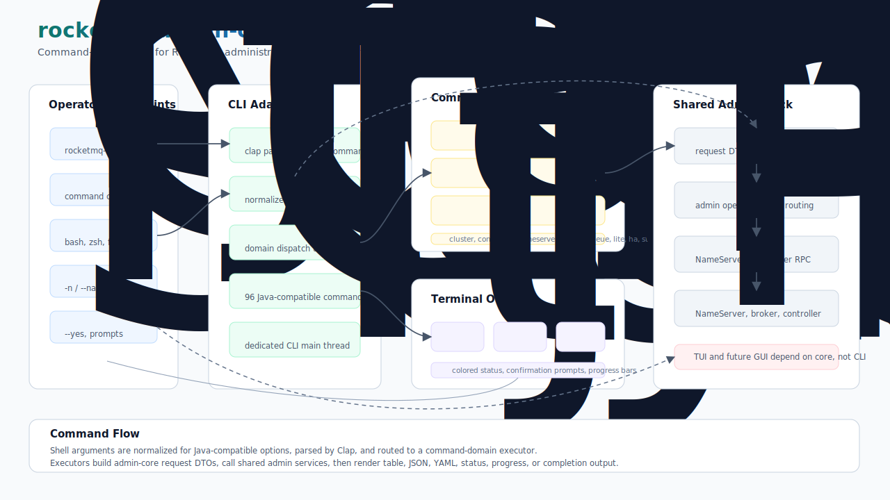

# rocketmq-admin-cli

[](https://crates.io/crates/rocketmq-admin-cli)
[](../../../LICENSE-APACHE)

`rocketmq-admin-cli` 是
[rocketmq-rust](https://github.com/mxsm/rocketmq-rust) 工作区的命令行管理适配器。它提供 Java-compatible
RocketMQ admin 命令面、shell completion 生成、确认提示、进度显示、终端渲染以及 table/JSON/YAML 输出，
同时把可复用的 admin 行为委托给 [`rocketmq-admin-core`](../rocketmq-admin-core)。

该 crate 面向需要使用 CLI 进行 RocketMQ 集群巡检和维护的运维人员，也面向需要迁移或扩展 RocketMQ admin 命令、但不希望把终端 UI 逻辑耦合到共享 admin service 的贡献者。

[English](README.md)

## 架构



CLI 层刻意保持轻量：

- **入口**：`main.rs` 启动独立的 Tokio runtime 线程，并设置 admin request 使用的 remoting version。
- **根解析器**：`RocketMQCli` 负责 `clap` 解析、shell completion 生成，以及 `-bn` 到 `--brokerName` 等 Java-compatible 参数归一化。
- **命令域**：`commands.rs` 暴露 admin domains 和共享的 `CommandExecute` trait。当前测试断言 96 个 Java-registered commands 可以在预期 Rust domain 下访问。
- **命令适配器**：各 subcommand 将 CLI 参数转换为 `rocketmq-admin-core` request DTO，调用 core service，并渲染结构化结果。
- **Core services**：`rocketmq-admin-core` 持有 CLI 和 TUI 复用的 admin request model、service、routing 和 RPC-facing 行为。
- **终端 UX**：formatter、彩色状态输出、确认提示、进度条和 completion script 保留在该 crate 中。

未来的 TUI 或 GUI adapter 应依赖 `rocketmq-admin-core`，而不是依赖 `rocketmq-admin-cli`。

## 能力

- 为 cluster、broker、topic、consumer、message、auth、HA、export 和 controller 操作提供 Java-compatible admin command names。
- 提供 root help、domain help 和分类 `show` 命令表。
- 为 `bash`、`zsh` 和 `fish` 生成 shell completion。
- 在需要访问集群的命令上通过 `-n` / `--namesrvAddr` 输入 NameServer 地址。
- 支持部分 Java admin flag 和 command alias 兼容处理。
- 提供 table、JSON 和 YAML formatter 基础设施。
- 为危险操作提供 confirmation helpers，并在 common args 上支持 `--yes`。
- 为长时间操作提供 progress bar 和 spinner helpers。
- 集成 `rocketmq-admin-core`、`rocketmq-remoting`、`rocketmq-common` 和共享 admin RPC stack。

## 快速开始

无需 RocketMQ 集群即可运行本地 help：

```bash
cargo run -p rocketmq-admin-cli -- --help
cargo run -p rocketmq-admin-cli -- topic --help
cargo run -p rocketmq-admin-cli -- show
```

生成 shell completion：

```bash
cargo run -p rocketmq-admin-cli -- --generate-completion bash
cargo run -p rocketmq-admin-cli -- --generate-completion zsh
cargo run -p rocketmq-admin-cli -- --generate-completion fish
```

构建 release binary：

```bash
cargo build --release -p rocketmq-admin-cli
```

生成的 binary 位于：

```text
target/release/rocketmq-admin-cli
```

在 Windows 上，Cargo 会添加 `.exe` 后缀。

## 集群示例

下面的命令需要可访问的 RocketMQ NameServer 以及对应的集群权限。

```bash
# Topic commands
rocketmq-admin-cli topic topicList -n 127.0.0.1:9876
rocketmq-admin-cli topic topicRoute -t MyTopic -n 127.0.0.1:9876
rocketmq-admin-cli topic updateTopic -t MyTopic -c DefaultCluster -r 8 -w 8 -n 127.0.0.1:9876
rocketmq-admin-cli topic deleteTopic -t MyTopic -c DefaultCluster -n 127.0.0.1:9876

# NameServer commands
rocketmq-admin-cli nameserver getNamesrvConfig -n 127.0.0.1:9876
rocketmq-admin-cli nameserver updateKvConfig -s namespace -k key -v value -n 127.0.0.1:9876
rocketmq-admin-cli nameserver deleteKvConfig -s namespace -k key -n 127.0.0.1:9876

# Broker commands
rocketmq-admin-cli broker getBrokerConfig -c DefaultCluster -n 127.0.0.1:9876
rocketmq-admin-cli broker updateBrokerConfig -c DefaultCluster -k flushDiskType -v ASYNC_FLUSH -n 127.0.0.1:9876

# Container and export commands
rocketmq-admin-cli container addBroker -c 127.0.0.1:10911 -b ./conf/broker.conf
rocketmq-admin-cli export exportMetrics -c DefaultCluster -f /tmp/rocketmq/export -n 127.0.0.1:9876
rocketmq-admin-cli export rocksDBConfigToJson -p /tmp/rocketmq/config -t topics -j true
```

多数面向集群的命令支持 `-n` 或 `--namesrvAddr`。当命令路径支持标准 RocketMQ 环境变量时，也可以设置：

```bash
set ROCKETMQ_NAMESRV_ADDR=127.0.0.1:9876
rocketmq-admin-cli topic topicList
```

在 Unix shell 中：

```bash
export ROCKETMQ_NAMESRV_ADDR=127.0.0.1:9876
rocketmq-admin-cli topic topicList
```

## 命令域

| Domain | 作用 |
| --- | --- |
| `auth` | User 和 ACL 的 create、update、delete、list、get、copy 操作。 |
| `broker` | Broker config、status、cleanup、cold-data flow control、timer、epoch 和 CommitLog 操作。 |
| `cluster` | Cluster listing 和 cluster-wide send latency diagnostics。 |
| `connection` | Consumer 和 producer connection inspection。 |
| `consumer` | Subscription group、consumer progress、running info、consume mode 和 monitoring 操作。 |
| `container` | Broker container add 和 remove 操作。 |
| `controller` | Controller config、metadata、master election 和 broker metadata cleanup。 |
| `export` | Config、metadata、metrics、POP record 和 RocksDB metadata export。 |
| `ha` | HA runtime status 和 sync-state-set inspection。 |
| `lite` | Lite topic、group、client、broker、parent-topic 和 dispatch 操作。 |
| `message` | Message query、decode、print、consume、trace、send 和 compaction-log diagnostics。 |
| `nameserver` | NameServer config、KV config 和 broker write-permission 操作。 |
| `offset` | Clone、reset、skip 和 inspect consumer offsets。 |
| `producer` | Producer connection 和 status inspection。 |
| `queue` | ConsumeQueue query 和 RocksDB ConsumeQueue write-progress checks。 |
| `stats` | Topic 和 consumer TPS statistics。 |
| `topic` | Topic create、update、delete、query、permission、static-topic、route 和 allocation 操作。 |

使用 `rocketmq-admin-cli show` 可以打印完整分类命令表。

## 输出与交互

该 crate 持有终端专属行为：

- `formatters/` 包含 table、JSON 和 YAML formatting infrastructure。
- `ui/output.rs` 包含彩色 status、header、summary 和 empty-result helpers。
- `ui/prompt.rs` 包含 interactive flow 的 confirmation 和 input helpers。
- `ui/progress.rs` 包含 spinner 和 progress-bar helpers。
- `--generate-completion` 将 shell completion script 写到 stdout。

共享 request、result 和 service 行为应放在 `rocketmq-admin-core`，方便其他 adapter 复用。

## 添加或迁移命令

新增 CLI 命令或迁移 Java command 时使用以下流程：

1. 在 `rocketmq-admin-core/src/core/<domain>.rs` 添加或复用 request/result DTO。
2. 在 `rocketmq-admin-core` 添加或复用 service method。
3. 在 `rocketmq-admin-cli/src/commands/<domain>/` 添加 CLI argument parsing。
4. 将 CLI args 转换为 core request DTO。
5. 调用 core service，并渲染 structured result。
6. 为 core request/service behavior 添加测试。
7. 为 CLI help output、parsing、alias 或 command smoke behavior 添加测试。

如果 admin RPC orchestration 可以被 TUI 或未来 adapter 复用，不要把它直接放进 CLI command file。

## Crate 结构

```text
rocketmq-admin-cli/
  src/main.rs             runtime setup 和 CLI entry point
  src/rocketmq_cli.rs     root parser、completion generation、Java-compatible args
  src/commands.rs         command domain enum、CommandExecute、show table
  src/commands/           domain subcommands 和 CLI-to-core adapters
  src/formatters/         table、JSON 和 YAML output formatters
  src/ui/                 output、prompt、progress 和 style helpers
  src/validators.rs       CLI validation helpers
  tests/cli_help.rs       help、completion、alias 和 parser smoke tests
  tests/java_parity_inventory.rs  Java command inventory reachability tests
```

## 验证

文档或 CLI 修改后可运行：

```bash
cargo test -p rocketmq-admin-cli
cargo run -p rocketmq-admin-cli -- --help
cargo run -p rocketmq-admin-cli -- show
```

如果修改了 workspace 内 Rust 行为，还应运行根工作区要求的检查：

```bash
cargo fmt --all
cargo clippy --workspace --no-deps --all-targets --all-features -- -D warnings
```

## 设计边界

- 该 crate 是 command-line adapter。可复用 admin 行为属于 `rocketmq-admin-core`。
- Command modules 应将 CLI options 转换为 core request DTO，并渲染 core results；不应复制 admin business logic。
- Prompt、progress、color、output format 和 shell completion 这类终端专属能力属于该 crate。
- TUI 和未来 GUI adapter 应依赖 `rocketmq-admin-core`，而不是 CLI crate。
- 集群示例需要运行中的 RocketMQ cluster；help、completion 和 parser tests 可本地运行。

## 相关 Crates

- [`rocketmq-admin-core`](../rocketmq-admin-core)：可复用 admin request、service 和 operation layer。
- [`rocketmq-admin-tui`](../rocketmq-admin-tui)：基于 core services 构建的 terminal UI adapter。
- [`rocketmq-remoting`](../../../rocketmq-remoting)：admin operations 使用的 RocketMQ remoting protocol 和 transport foundation。

## 许可证

本项目使用 Apache License 2.0 许可证。详情请参见
[`LICENSE-APACHE`](../../../LICENSE-APACHE)。
