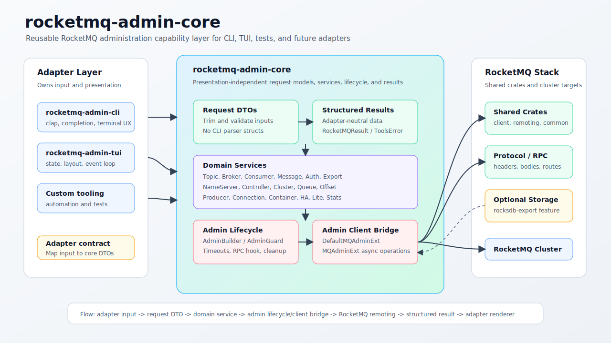

# rocketmq-admin-core

[](../../../LICENSE-APACHE)

`rocketmq-admin-core` 是 RocketMQ Rust 管理工具体系中的展示无关能力层。它负责可复用的请求模型、参数校验、服务编排、Admin Client 生命周期辅助能力，以及供
`rocketmq-admin-cli`、`rocketmq-admin-tui`、测试和未来管理适配器复用的结构化结果。

这个 crate 不是命令行解析器、终端渲染器，也不是 TUI 状态层。适配器负责把用户输入转换成 core DTO，调用 core service，并用自己的展示方式渲染返回结果。

[English](README.md)

## 架构



稳定的集成路径如下：

```text
adapter input -> core request DTO -> core service -> admin client/remoting -> structured result -> adapter renderer
```

这种边界让 RocketMQ 管理行为可以被多个界面复用，同时保留 CLI、TUI 或其他适配器各自的展示职责。

## 核心能力

- 为 RocketMQ 管理域提供展示无关的 request/result DTO。
- 覆盖 topic、broker、consumer、message、auth、export、NameServer、controller、cluster、queue、offset、HA、lite、producer、connection、container、static topic、stats 等管理服务。
- 提供 `AdminBuilder`、`AdminGuard`、`create_admin` 和 `create_admin_with_guard`，用于 Admin Client 启动、超时配置、RPC Hook 注入和资源清理。
- 基于 RocketMQ client/remoting API 集成 `DefaultMQAdminExt`。
- 提供 broker、cluster、topic、NameServer 目标解析和校验辅助逻辑。
- 通过 `RocketMQResult`、`RocketMQError` 和 `ToolsError` 暴露统一错误面。
- 通过 `rocksdb-export` feature 提供可选的本地 RocksDB 元数据导出能力。

## 快速开始

在同一个 workspace 的其他成员中引用：

```toml
[dependencies]
rocketmq-admin-core = { path = "rocketmq-tools/rocketmq-admin/rocketmq-admin-core" }
```

通过完整的 core request 生命周期查询 topic 所属集群：

```rust
use rocketmq_admin_core::core::RocketMQResult;
use rocketmq_admin_core::core::topic::{TopicClusterQueryRequest, TopicService};

async fn list_topic_clusters() -> RocketMQResult<()> {
    let request = TopicClusterQueryRequest::try_new("TestTopic")?
        .with_optional_namesrv_addr(Some("127.0.0.1:9876".to_string()));

    let result = TopicService::query_topic_clusters(request).await?;
    println!("clusters: {:?}", result.clusters);

    Ok(())
}
```

当多个操作需要共享同一个连接生命周期时，可以直接管理 Admin Client：

```rust
use rocketmq_admin_core::core::RocketMQResult;
use rocketmq_admin_core::core::admin::AdminBuilder;
use rocketmq_admin_core::core::topic::TopicService;

async fn query_with_shared_admin() -> RocketMQResult<()> {
    let mut admin = AdminBuilder::new()
        .namesrv_addr("127.0.0.1:9876")
        .instance_name("admin-core-example")
        .timeout_millis(5000)
        .build_with_guard()
        .await?;

    let clusters = TopicService::get_topic_cluster_list(&mut admin, "TestTopic").await?;
    println!("clusters: {:?}", clusters.clusters);

    Ok(())
}
```

运行当前包测试：

```bash
cargo test -p rocketmq-admin-core
```

## 核心域

| 模块 | 作用 |
|---|---|
| `core::admin` | Admin Client builder、RAII guard、RPC Hook 支持和生命周期辅助能力。 |
| `core::topic` | Topic 路由、状态、列表、创建/更新、删除、顺序配置、静态 Topic 支撑点和权限操作。 |
| `core::broker` | Broker 配置、运行时状态、消费统计、epoch、冷数据流控、CommitLog read-ahead 和 Broker 维护操作。 |
| `core::consumer` | 订阅组、消费模式、消费进度、监控和消费者配置操作。 |
| `core::message` | 消息查询、轨迹、发送、直接消费、解码和 compaction log 相关操作。 |
| `core::auth` | User 和 ACL 的创建、更新、删除、列表、查询和复制操作。 |
| `core::export_data` | 元数据、指标、POP 记录、配置导出，以及可选的本地 RocksDB 元数据导出。 |
| `core::namesrv` | NameServer 配置、KV 配置和 Broker 写权限操作。 |
| `core::controller` | Controller 元数据、配置、主节点选举和 Broker 元数据清理。 |
| `core::cluster`, `core::queue`, `core::offset`, `core::producer`, `core::connection`, `core::container`, `core::ha`, `core::lite`, `core::stats` | CLI 和 TUI 适配器复用的其他 RocketMQ 管理域。 |

## Feature Flags

| Feature | 默认开启 | 作用 |
|---|---:|---|
| `rocksdb-export` | 否 | 启用 `core::export_data` 中的本地 RocksDB 元数据导出能力。默认构建不会把 RocksDB 引入只需要 RPC 管理能力的消费者。 |

只有在工具需要检查本地 RocksDB 元数据时才启用该 feature：

```toml
rocketmq-admin-core = {
    path = "rocketmq-tools/rocketmq-admin/rocketmq-admin-core",
    features = ["rocksdb-export"],
}
```

## 边界约定

`rocketmq-admin-core` 通过排除展示层依赖来保持管理行为可复用：

- 不依赖 `clap` 或 `clap_complete`；命令解析属于 `rocketmq-admin-cli`。
- 不依赖 `colored`、`tabled`、`indicatif` 或 `dialoguer`；终端渲染和交互提示属于适配器 crate。
- 不依赖 `ratatui`；TUI 状态和布局属于 `rocketmq-admin-tui`。
- 不依赖 `rocketmq-admin-cli`。

`tests/no_cli_ui_boundary.rs` 会保护这条边界，并验证本地 RocksDB 支持保持 feature-gated。

## Crate 布局

```text
rocketmq-admin-core/
├── src/
│   ├── lib.rs                         # 公开 crate surface
│   ├── admin/                         # DefaultMQAdminExt 和 admin 工具
│   └── core/                          # 展示无关的管理域
│       ├── admin.rs                   # AdminBuilder 和 AdminGuard
│       ├── broker/                    # Broker service 和 DTO
│       ├── namesrv/                   # NameServer service 和 DTO
│       ├── topic/                     # Topic service 和 DTO
│       └── *.rs                       # 其他领域服务
├── examples/
│   └── admin_builder_pattern.rs       # AdminBuilder 和 RAII 用法示例
└── tests/                             # Core model 和边界测试
```

## 新增管理操作

1. 添加 request DTO，并在 DTO 内完成 trim 和输入校验。
2. 添加 result DTO，返回适配器无关的数据，不返回表格行或终端字符串。
3. 在对应的 `*Service` 类型中实现操作。
4. 显式处理 admin 生命周期：共享生命周期时接收已有 admin client；请求式 helper 则负责创建并关闭 admin client。
5. 在 `rocketmq-admin-core` 中添加聚焦的 model/service 测试。
6. 在适配器 crate 中把 CLI/TUI 参数映射到新的 core DTO。

## 验证

如果只修改文档，通常执行本地 Markdown/SVG 检查即可。如果修改本 crate 的 Rust 代码，运行：

```bash
cargo test -p rocketmq-admin-core
cargo test -p rocketmq-admin-core --features rocksdb-export
```

如果修改了 root workspace 内的 Rust 代码，还需要在 workspace 根目录运行仓库要求的检查：

```bash
cargo fmt --all
cargo clippy --workspace --no-deps --all-targets --all-features -- -D warnings
```

## 相关 Crates

- [`rocketmq-admin-cli`](../rocketmq-admin-cli) - core 管理服务的命令行适配器。
- [`rocketmq-admin-tui`](../rocketmq-admin-tui) - core 管理服务的终端 UI 适配器。
- [`rocketmq-remoting`](../../../rocketmq-remoting) - RocketMQ remoting 协议和 RPC 类型。
- [`rocketmq-client`](../../../rocketmq-client) - Admin Client 实现使用的 RocketMQ client API。
- [`rocketmq-common`](../../../rocketmq-common) - RocketMQ 共享数据结构和工具。
- [`rocketmq-error`](../../../rocketmq-error) - 共享错误和 result 类型。

## License

基于 [Apache License, Version 2.0](../../../LICENSE-APACHE) 发布。
