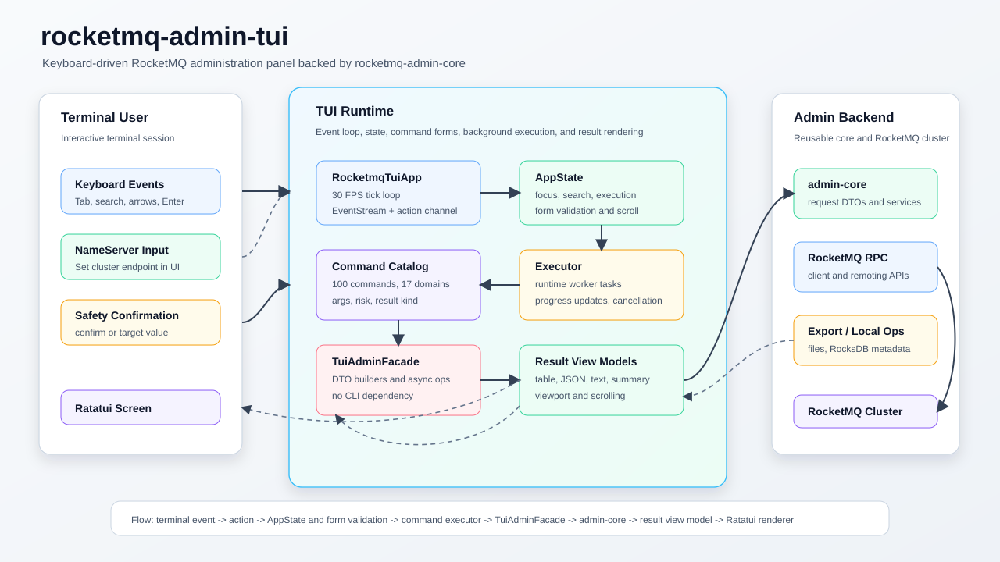
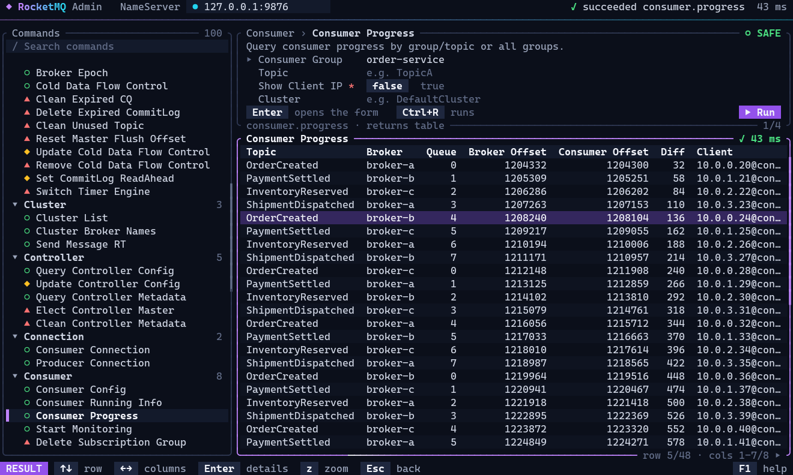

# rocketmq-admin-tui

[](../../../LICENSE-APACHE)

`rocketmq-admin-tui` 是 RocketMQ Rust 的交互式终端管理面板。它使用 Ratatui 和 crossterm 构建终端体验，所有 RocketMQ 管理能力都通过
`TuiAdminFacade` 委托给 `rocketmq-admin-core`。

该 crate 面向希望通过可搜索、键盘驱动界面管理 RocketMQ 的运维和开发用户，同时避免重复实现 CLI 解析或 RocketMQ RPC 逻辑。当前命令目录包含 17 个
RocketMQ 管理域，共 100 个 facade-backed 管理命令。

[English](README.md)

## 架构



稳定的运行时流程如下：

```text
terminal event -> app action -> state/form validation -> TuiAdminFacade -> admin-core DTO/service -> result view model -> Ratatui renderer
```

TUI 负责交互、状态、布局和渲染。核心管理请求、校验、RPC 编排和结构化结果由 `rocketmq-admin-core` 负责。

## 预览



## 核心能力

- 可搜索的命令树，按 RocketMQ 管理域分组，每条命令带风险标记，分组可折叠。
- 五个焦点区域：NameServer、Search、Commands、Parameters、Result。底部按键栏始终列出当前焦点区域的按键，`F1` 打开完整的按键说明。
- 键盘与鼠标并用：每个操作都有按键；点击可聚焦面板、选择命令、切换选项或按下 Run，滚轮滚动指针所在的区域。`F2` 把鼠标交还给终端，用于选择文本。
- 类型化参数模型，支持 string、optional string、number、boolean、enum、key/value map 和毫秒时间戳。文本框支持光标处编辑，选项用方向键或 `Space` 切换，凭据类参数以掩码显示，每条命令会记住自己的表单。
- 命令执行前执行表单级校验，焦点会落到第一个不合法的字段上。
- 基于风险等级的执行模型：
  - safe 命令直接执行；
  - mutating 命令需要输入 `confirm`；
  - dangerous 命令在可用时需要输入目标值。
- 主线程只负责绘制界面和读取输入。每条命令作为进程所持有运行时（`RuntimeOwner`）的一个任务，运行在栈大小按管理调用链配置的工作线程上，并在应用的客户端作用域下使用独立的客户端运行时。取消命令会停止操作，随后该任务关闭这条命令的连接和后台任务，再上报结果；退出时也会等待清理完成。取消不会撤销 Broker 或 NameServer 已接受的请求。
- 长时间工作流支持进度更新，例如 monitoring 和 message pull。
- 支持以 table、key/value、JSON、text、operation summary 渲染结构化结果。表格带行光标、按列横向滚动、数字列右对齐，任意一行都可以打开详情查看全部列；文档可折行或平移，JSON 与调试输出带语法着色。`z` 放大结果面板。
- 用动效表达状态：焦点、命令和结果的变化带过渡动画，运行中的命令有流动的高亮，执行结果以对应颜色闪现。装饰性动效在空闲时自动淡出，空闲的界面完全不重绘，`F3` 可关闭动效。
- 适配终端：24 位真彩色并可回退到 256 色，宽度不足 96 列时一次只显示一个面板，小于 48x12 时给出可读的提示。
- 边界测试确保 `rocketmq-admin-tui -> rocketmq-admin-core`，并拒绝依赖 CLI adapter。

## 快速开始

在仓库根目录的交互式终端中运行：

```bash
cargo run -p rocketmq-admin-tui
```

TUI 启动时不强制要求 NameServer 地址。执行需要访问集群的命令前，可在 NameServer 焦点区域设置地址。

常用按键（单字母按键只在文本框之外生效，在文本框内它们会被当作输入）：

| 按键 | 行为 |
|---|---|
| `Tab` / `Shift+Tab` | 在 NameServer、Search、Commands、Parameters、Result 之间移动焦点。 |
| `/` 或 `Ctrl+F` | 搜索命令。`Ctrl+F` 在文本框内输入时同样可用。 |
| `n` / `p` / `r` | 跳到 NameServer 输入框、参数表单或结果。 |
| 方向键或 `j` / `k` | 移动命令、字段或结果行。`PgUp`、`PgDn`、`Home`、`End` 移动得更远。 |
| `Left` / `Right` | 折叠命令组、切换选项或横向滚动结果列。 |
| `Space` | 切换 boolean 或 enum 参数。 |
| `Enter` | 打开命令、在表单中执行、确认，或完整查看一行结果。 |
| `Ctrl+R` 或 `F5` | 在任意位置执行当前命令。 |
| `Esc` | 取消运行中的命令，否则返回上一层。在命令列表中再按一次退出。 |
| `Ctrl+C` | 取消运行中的命令；没有命令在运行时退出。 |
| `Ctrl+L` | 清空当前结果。 |
| `z` / `w` | 放大结果面板；切换长行的折行。 |
| `F1` 或 `?` | 打开或关闭帮助。 |
| `F2` / `F3` | 开关鼠标捕获或动效。 |
| `q` 或 `Ctrl+Q` | 退出。 |

## 命令覆盖

命令目录定义在 `src/commands/catalog.rs`，并由测试保护。当前覆盖如下：

| 领域 | 命令数 | 示例 |
|---|---:|---|
| Auth | 12 | user 和 ACL 的 get/list/create/update/delete/copy。 |
| Broker | 15 | config、runtime stats、consume stats、epoch、cleanup、cold data flow control、commitlog read-ahead、timer engine。 |
| Cluster | 3 | cluster list、broker names、send-message RT 诊断。 |
| Connection | 2 | consumer 和 producer connection 检查。 |
| Consumer | 8 | config、running info、progress、monitoring、subscription group、consume mode。 |
| Controller | 5 | config、metadata、elect master、clean metadata。 |
| Export | 6 | configs、metrics、metadata、RocksDB metadata、RocksDB RPC export、POP records。 |
| HA | 2 | HA status 和 sync-state-set query。 |
| Lite | 6 | broker、parent topic、lite topic、group、client、dispatch。 |
| Message | 12 | decode、query、trace、direct consume、dump compaction log、print、consume。 |
| NameServer | 6 | config、KV config、write permission。 |
| Offset | 5 | clone、consumer status、skip accumulated、reset by time。 |
| Producer | 4 | producer info、send message、send status、send RT。 |
| Queue | 2 | consume queue 和 RocksDB CQ write progress。 |
| Static Topic | 2 | update 和 remap static topic。 |
| Stats | 1 | stats-all query。 |
| Topic | 9 | list、cluster、route、status、update、permission、delete、order config、allocate MQ。 |

## 运行模型

`RocketmqTuiApp` 在主线程上持有事件循环。它每秒 tick 30 次，读取 crossterm 事件，应用内部 action，并绘制当前 `AppState`。只有到期的帧才会被绘制：过渡动画期间每个 tick 都绘制；只有环境动效或运行中的命令时隔一个 tick 绘制一次；空闲的界面完全不绘制，因此不会向终端写入任何内容。

命令执行与 UI 处理解耦：

1. 选中的 `CommandSpec` 定义参数、结果视图类型和风险等级。
2. `CommandFormState` 校验用户输入的表单值。
3. `execute_command_with_progress` 根据 command ID 分发，并返回一个 `Send` future。
4. 该 future 作为应用客户端作用域的 `TaskGroup` 任务运行在运行时的工作线程上，主线程从不轮询它。
5. `TuiAdminFacade` 将表单值转换为 `rocketmq-admin-core` request DTO。
6. core service 执行管理操作。
7. `CommandResultViewModel` 将结构化结果转换成适合 TUI 渲染的 table、JSON、text、key/value 或 summary。
8. 已取消任务的迟到结果会通过 execution ID 被忽略。

运行时线程以 16 MiB 的栈创建。命令所等待的 admin、client、transport 调用链在未优化的 Windows 构建中大约需要 1.3 MiB 的栈，超过该平台主线程 1 MiB 的栈。让命令不在主线程上运行，它们的栈预算才是运行时的配置项，而不是平台的默认值。

## 边界约定

`rocketmq-admin-tui` 必须保持为终端 UI adapter：

- 依赖 `rocketmq-admin-core`，不依赖 `rocketmq-admin-cli`。
- 不使用 `clap`、`clap_complete`、`tabled`、`colored`、`dialoguer` 或 `indicatif`。
- 不调用 CLI command module，也不解析 CLI command struct。
- 共享 admin request/result/service 行为属于 `rocketmq-admin-core`。
- TUI 专属能力放在本 crate：layout、focus、command catalog、form、result view model、keyboard action、progress display 和 terminal rendering。

这些规则由 `tests/no_cli_dependency.rs` 保护。

## Crate 布局

```text
rocketmq-admin-tui/
├── src/
│   ├── main.rs                 # 运行时所有权和 app 启动
│   ├── rocketmq_tui_app.rs     # 事件循环、action 处理、命令任务、帧节奏
│   ├── rocketmq_tui_app/       # 键盘、鼠标和粘贴处理
│   ├── state.rs                # App state、form state、校验、focus model、动效时钟
│   ├── motion.rs               # 基于 tick 的动画基础设施
│   ├── result_view.rs          # 预处理后的结果：表格、文档、视口、折行
│   ├── terminal.rs             # 终端模式和同步帧输出
│   ├── text.rs                 # 显示宽度、截断和折行
│   ├── text_input.rs           # 文本输入的行编辑
│   ├── ui.rs                   # 帧布局、点击区域映射和渲染入口
│   ├── ui/                     # 面板绘制、主题、动效和组件
│   ├── action.rs               # 内部 action message
│   ├── event.rs                # 键盘辅助函数
│   ├── admin_facade.rs         # TUI 到 admin-core 的 facade
│   ├── admin_facade/           # Core request builders 和 async operations
│   ├── commands.rs             # Command metadata surface
│   ├── commands/               # Catalog 和 executor dispatch
│   └── view_model/             # 终端渲染用结果转换
└── tests/
    └── no_cli_dependency.rs    # Adapter 边界保护
```

## 新增 TUI 命令

1. 在 `rocketmq-admin-core` 中添加或复用 admin request/result/service。
2. 在 `TuiAdminFacade` 中添加 request-builder 和 async operation 方法。
3. 在合适的 catalog domain 中添加 `CommandSpec`。
4. 在 `execute_command_with_progress` 中接入 command ID。
5. 将结果转换为 `CommandResultViewModel`。
6. 为 catalog 覆盖、参数校验、facade 映射和结果渲染添加聚焦测试。

## 验证

如果只修改文档，通常执行本地 Markdown/SVG 检查即可。如果修改本 crate 的 Rust 代码，运行：

```bash
cargo test -p rocketmq-admin-tui
```

修改 Rust 代码时，从仓库根目录按需选择本包检查：

```bash
cargo fmt -p rocketmq-admin-tui -- --check
cargo clippy -p rocketmq-admin-tui --no-deps -- -D warnings
```

## 相关 Crates

- [`rocketmq-admin-core`](../rocketmq-admin-core) - 可复用 admin request、service 和 result 层。
- [`rocketmq-admin-cli`](../rocketmq-admin-cli) - 复用同一个 core 层的命令行适配器。
- [`rocketmq-transport`](../../../rocketmq-transport) - RocketMQ remoting 协议和 RPC 类型。
- [`rocketmq-client`](../../../rocketmq-client) - admin service 使用的 RocketMQ client API。

## License

基于 [Apache License, Version 2.0](../../../LICENSE-APACHE) 发布。
