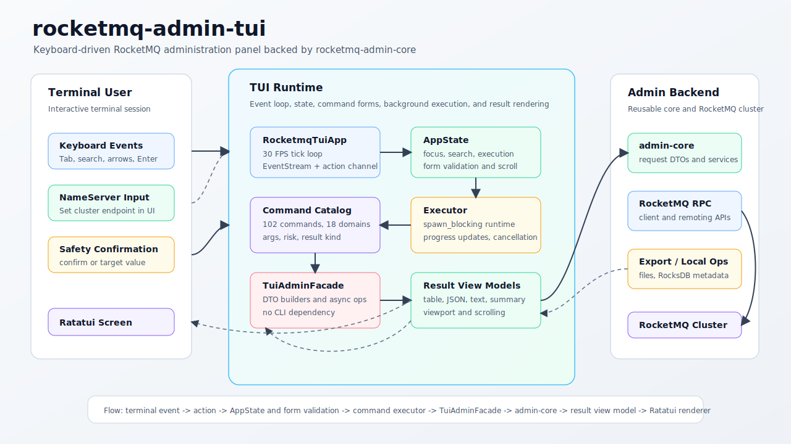

# rocketmq-admin-tui

[](../../../LICENSE-APACHE)

`rocketmq-admin-tui` is the interactive terminal administration panel for
RocketMQ Rust. It uses Ratatui and crossterm for the terminal experience, while
all RocketMQ administration behavior is delegated to `rocketmq-admin-core`
through `TuiAdminFacade`.

The crate is designed for operators who want a searchable, keyboard-driven
management surface without reimplementing CLI parsing or RocketMQ RPC logic.
It currently exposes 102 facade-backed admin commands across 18 RocketMQ
management domains.

[中文文档](README-zh_cn.md)

## Architecture



The stable runtime flow is:

```text
terminal event -> app action -> state/form validation -> TuiAdminFacade -> admin-core DTO/service -> result view model -> Ratatui renderer
```

The TUI owns interaction, state, layout, and rendering. Core administration
requests, validation, RPC orchestration, and structured results stay in
`rocketmq-admin-core`.

## Preview


## Capabilities

- Searchable command tree with grouped RocketMQ admin domains.
- Five focus areas: NameServer, Search, Commands, Parameters, and Result.
- Keyboard-first workflow with contextual key hints and an in-app help overlay.
- Typed argument model for strings, optional strings, numbers, booleans, enums,
  key/value maps, and millisecond timestamps.
- Form-level validation before a command can run.
- Risk-aware execution model:
  - safe commands run directly;
  - mutating commands require typing `confirm`;
  - dangerous commands require typing the target value when available.
- Background command execution through a separate Tokio runtime so terminal
  rendering and input handling remain responsive.
- Progress updates for long-running workflows such as monitoring and message
  pull operations.
- Structured result rendering as tables, key/value rows, JSON, text, or
  operation summaries with vertical and horizontal scrolling.
- Boundary tests that enforce `rocketmq-admin-tui -> rocketmq-admin-core` and
  reject dependencies on the CLI adapter.

## Quick Start

Run from the repository root in an interactive terminal:

```bash
cargo run -p rocketmq-admin-tui
```

The TUI starts without requiring a NameServer address. Set one from the
NameServer focus area before executing cluster-backed commands.

Common keys:

| Key | Action |
|---|---|
| `Tab` / `Shift+Tab` | Move focus through NameServer, Search, Commands, Parameters, and Result. |
| `n` | Focus the NameServer input when not editing parameters. |
| `/` or `s` | Focus command search when not editing parameters. |
| `j` / `k` or arrows | Move through commands, parameters, or result rows. |
| `Left` / `Right` | Collapse command groups, cycle enum parameters, or scroll result columns. |
| `Space` | Toggle a boolean parameter. |
| `Enter` | Submit input, select a command, execute, or confirm. |
| `Ctrl+R` | Re-run the selected command. |
| `Ctrl+L` | Clear the current result. |
| `?` | Toggle help. |
| `Esc` | Close help, cancel the local wait for a running task, or quit. |
| `q` | Quit or close help. |

## Command Coverage

The command catalog is generated in `src/commands/catalog.rs` and protected by
tests. Current coverage:

| Domain | Commands | Examples |
|---|---:|---|
| Auth | 12 | user and ACL get/list/create/update/delete/copy. |
| Broker | 15 | config, runtime stats, consume stats, epoch, cleanup, cold data flow control, commitlog read-ahead, timer engine. |
| Cluster | 3 | cluster list, broker names, send-message RT diagnostics. |
| Connection | 2 | consumer and producer connection inspection. |
| Consumer | 8 | config, running info, progress, monitoring, subscription group, consume mode. |
| Container | 2 | add and remove broker in broker container. |
| Controller | 5 | config, metadata, elect master, clean metadata. |
| Export | 6 | configs, metrics, metadata, RocksDB metadata, RocksDB RPC export, POP records. |
| HA | 2 | HA status and sync-state-set query. |
| Lite | 6 | broker, parent topic, lite topic, group, client, dispatch. |
| Message | 12 | decode, query, trace, direct consume, dump compaction log, print, consume. |
| NameServer | 6 | config, KV config, write permission. |
| Offset | 5 | clone, consumer status, skip accumulated, reset by time. |
| Producer | 4 | producer info, send message, send status, send RT. |
| Queue | 2 | consume queue and RocksDB CQ write progress. |
| Static Topic | 2 | update and remap static topic. |
| Stats | 1 | stats-all query. |
| Topic | 9 | list, cluster, route, status, update, permission, delete, order config, allocate MQ. |

## Runtime Model

`RocketmqTuiApp` owns the event loop. It ticks at 30 FPS, reads crossterm
events, applies internal actions, and renders the current `AppState`.

Command execution is separated from UI handling:

1. The selected `CommandSpec` defines arguments, result view kind, and risk
   level.
2. `CommandFormState` validates the typed form values.
3. `execute_command_with_progress` dispatches by command ID.
4. `TuiAdminFacade` converts form values into `rocketmq-admin-core` request DTOs.
5. Core services execute the admin operation.
6. `CommandResultViewModel` converts structured results into TUI-friendly
   tables, JSON, text, key/value rows, or summaries.
7. Late results from cancelled local tasks are ignored by execution ID.

## Boundary Contract

`rocketmq-admin-tui` must remain a terminal UI adapter:

- It depends on `rocketmq-admin-core`, not `rocketmq-admin-cli`.
- It does not use `clap`, `clap_complete`, `tabled`, `colored`, `dialoguer`, or
  `indicatif`.
- It does not call CLI command modules or parse CLI command structs.
- Shared admin request/result/service behavior belongs in `rocketmq-admin-core`.
- TUI-only concerns belong here: layout, focus, command catalog, forms, result
  view models, keyboard actions, progress display, and terminal rendering.

These rules are enforced by `tests/no_cli_dependency.rs`.

## Crate Layout

```text
rocketmq-admin-tui/
├── src/
│   ├── main.rs                 # Terminal initialization and app startup
│   ├── rocketmq_tui_app.rs     # Event loop, action handling, background tasks
│   ├── state.rs                # App state, form state, validation, focus model
│   ├── ui.rs                   # Ratatui layout and rendering
│   ├── action.rs               # Internal action messages
│   ├── event.rs                # Keyboard helpers
│   ├── admin_facade.rs         # TUI-to-admin-core facade
│   ├── admin_facade/           # Core request builders and async operations
│   ├── commands.rs             # Command metadata surface
│   ├── commands/               # Catalog and executor dispatch
│   └── view_model/             # Result conversion for terminal rendering
└── tests/
    └── no_cli_dependency.rs    # Adapter boundary guardrails
```

## Adding a TUI Command

1. Add or reuse the admin request/result/service in `rocketmq-admin-core`.
2. Add request-builder and async operation methods to `TuiAdminFacade`.
3. Add a `CommandSpec` in the appropriate catalog domain.
4. Wire the command ID in `execute_command_with_progress`.
5. Convert the result into a `CommandResultViewModel`.
6. Add focused tests for catalog coverage, argument validation, facade mapping,
   and result rendering.

## Validation

For documentation-only changes, local Markdown/SVG checks are usually enough.
For Rust changes in this crate, run:

```bash
cargo test -p rocketmq-admin-tui
```

For root workspace Rust changes, also run the repository-required checks from
the workspace root:

```bash
cargo fmt --all
cargo clippy --workspace --no-deps --all-targets --all-features -- -D warnings
```

## Related Crates

- [`rocketmq-admin-core`](../rocketmq-admin-core) - reusable admin request, service, and result layer.
- [`rocketmq-admin-cli`](../rocketmq-admin-cli) - command-line adapter that shares the same core layer.
- [`rocketmq-remoting`](../../../rocketmq-remoting) - RocketMQ remoting protocol and RPC types.
- [`rocketmq-client`](../../../rocketmq-client) - RocketMQ client APIs used by admin services.

## License

Licensed under the [Apache License, Version 2.0](../../../LICENSE-APACHE).
