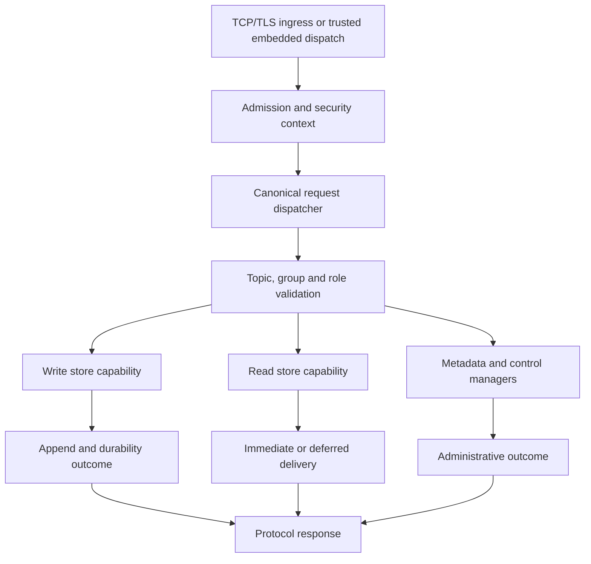

The Broker owns message service: it validates requests, manages Topic/group and consumer metadata, invokes storage capabilities, coordinates delivery and retries, and participates in registration and replication. It is the boundary where a valid protocol request becomes an authorized operation against a particular store and Broker role.

## Startup is a composition process

The standalone binary uses validated configuration to assemble a `BrokerRuntime`. Configuration is split into `[broker]`, `[store]`, `[logging]`, and `[observability]`; the parser rejects unknown fields and unsupported combinations rather than silently accepting an approximate Java properties file.

The main stages are configuration validation, metadata/store initialization and recovery, processor and service wiring, network startup, scheduled registration/coordination, and readiness evaluation. A startup journal records started components so partial initialization has a cleanup path.

The store is opened through its composition layer. Broker processors receive the capabilities they need, while store lifecycle remains owned by the assembled store. Topic configuration, subscription groups, consumer offsets, consumer connections, and producer connections have separate managers; they are not interchangeable entries in a single metadata database.

The metadata root in Broker configuration and the primary data root in store configuration are distinct settings. A deployment that moves one directory without the other can retain message bytes while losing the metadata needed to interpret or resume service.

## Request path

The canonical dispatcher routes request codes to the send, pull, client-management, consumer-management, POP, acknowledgement, and other supported processors. Security checks use trusted ingress facts before protected work is dispatched. Embedded Proxy dispatch also traverses this pipeline; being in the same process does not imply unrestricted storage access.

For a send, the processor checks message/Topic constraints and Broker availability, converts the request into the store-facing representation, and projects the append result into a send response. Acceptance, local persistence, and replica confirmation are different outcomes. A timeout after acceptance cannot be interpreted as “the message does not exist.”

For a read, the processor combines group/subscription information, queue position, filtering, and store state. A long-poll request may have no immediate response and remain owned by a deferred-response service. POP has receipt/invisibility state in addition to the message itself; see [POP consumption](../consumer/pop.md).

## Control work and background services

Broker registration publishes routes to NameServer. Controller-mode coordination obtains role and write-lease information; HA services transfer message data. Timer delivery, transaction checks, retry handling, metadata persistence, housekeeping, and deferred requests are separate service responsibilities under lifecycle owners.

These operations compete for CPU, I/O, and retained memory. Runtime task ownership, request admission, store I/O capabilities, and bounded queues address different parts of that competition. A concurrency permit does not by itself bound all message bytes, and a ready listener does not prove storage is writable.

In Controller mode, a Broker starts fenced. Readiness considers whether recovered storage is eligible for promotion and processors/security are assembled; writable authority is acquired separately from the Controller. Monitoring must therefore distinguish process readiness from permission to accept a write as master.

## Shutdown and partial failure

Shutdown closes admission to new deferred producer work, stops tracked producers and remoting/processor work, resolves deferred-resource ownership, then closes the remaining service components and store under an absolute deadline. Authentication, metadata, replication, and storage each contribute their own result. The exact component order is implemented by the lifecycle code, not by the order in which application handles happen to be dropped.

Inspect the structured Broker shutdown report, including unfinished resources and store shutdown outcomes. A runtime task report alone cannot certify that metadata flushed, file leases were released, or replication state was closed cleanly. An exhausted deadline is an incomplete shutdown result even if the process subsequently exits.

Startup failures also need cleanup for components that already started. Operationally, preserve the original error and cleanup result; replacing either with “Broker failed” hides whether recovery, a bind conflict, authentication, or a shutdown deadline caused the problem.

## Design limits

Current configuration validation rejects DLedger mode. Local-file and RocksDB-derived storage are selected through supported features and validated configuration; they are not arbitrary plugins that can be exchanged over an existing data directory. Cold-data flow control using the legacy unowned queue path is also rejected by configuration.

This chapter describes component wiring and lifecycle contracts. It does not establish throughput, recovery time, or availability for a particular deployment. Those depend on the selected storage/HA policy and measured operating conditions.

## Source map and next reading

- [Broker configuration and startup guide](https://github.com/mxsm/rocketmq-rust/blob/main/rocketmq-broker/README.md).
- [Runtime composition](https://github.com/mxsm/rocketmq-rust/blob/main/rocketmq-broker/src/broker_runtime.rs), [lifecycle](https://github.com/mxsm/rocketmq-rust/blob/main/rocketmq-broker/src/broker_runtime/lifecycle.rs), [request dispatcher](https://github.com/mxsm/rocketmq-rust/blob/main/rocketmq-broker/src/processor/dispatcher.rs).
- [Storage backends](storage-backends.md), [HA and Controller](ha-controller.md), [security boundaries](security.md), and [runtime ownership](runtime.md).
