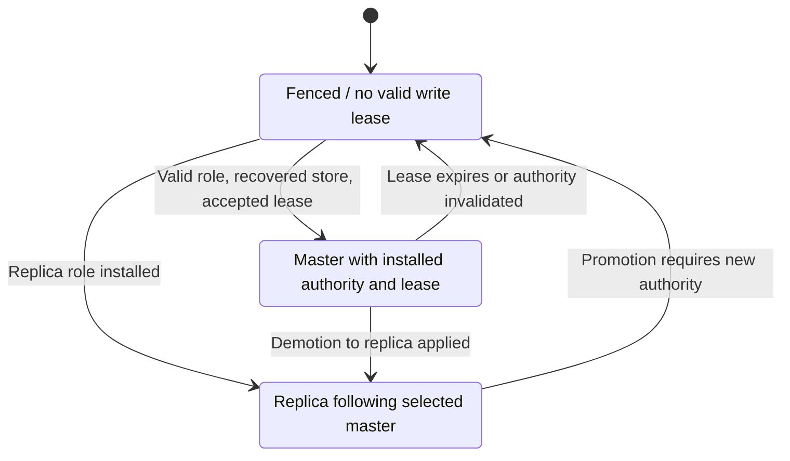
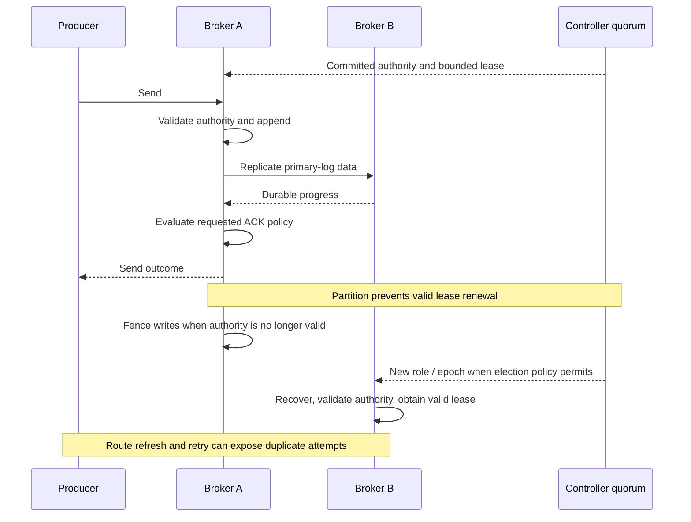

High availability combines two different mechanisms: Brokers replicate message data, while Controller consensus coordinates metadata, master selection, and sync-state membership. Controller Raft replication does not carry the Broker's CommitLog.

## Control plane and data plane

`ControllerManager` assembles OpenRaft, persistent controller state, Broker heartbeat tracking, request processing, and role-change notifications. Broker-facing coordination uses remoting; controller-to-controller Raft uses a separate gRPC endpoint. NameServer remains the route-discovery service.

The Broker's replicas manager applies Controller role and membership information, and its control-plane integration installs validated write leases into storage. HA services connect primary and replica stores and exchange data/progress. The local storage and HA contract determine when an append can be acknowledged.

Controller defaults to RocksDB persistence, with an opt-in file backend and an in-memory test backend. A multi-node peer list describes endpoints; it does not prove committed Raft membership or a functioning quorum. Multi-member automatic initialization requires explicit opt-in and is performed by the lowest configured node ID; existing committed state is not reinitialized.

## Authority before acknowledgement

| Value | Invariant and role |
| --- | --- |
| `MasterEpoch` | Positive Controller-issued epoch; older authority must not authorize current writes |
| `WriteAuthority` | Exact Broker ID and master epoch pair |
| `SyncStateSetEpoch` | Positive version of sync-state membership, separate from master epoch |
| `SyncStateSet` | Nonempty, deduplicated Broker IDs; the current leader must be included for an acknowledgement observation |
| `WriteLeaseToken` | Exact authority plus nonzero lease generation |
| `ReplicaAck` | A replica's exclusive durable offset, not just its received-byte count |

Write-lease tokens deliberately contain no wall-clock expiry. The Broker validates the grant against expected authority, subtracts the safety margin and request elapsed time, and installs the remaining duration as a process-local monotonic deadline. A stale/mismatched grant or exhausted duration cannot open writes.

Controller-mode Brokers start fenced. Role selection alone does not make them writable: the store must have valid authority and lease state. The control-plane path fences writes when required lease installation fails. Stopping writes under lost authority is part of the design, not a reason to silently downgrade durability.

This is a conceptual write-permission diagram. Actual startup readiness also checks recovered-store promotion eligibility and processor/security assembly; process readiness and writable-master state remain distinct.

## What an ACK policy proves

The backend-neutral `decide_replication` function evaluates an observation without I/O, retries, mutation, or implicit downgrade. It first rejects stale/mismatched authority, then requires the local durable watermark to cover the requested exclusive offset.

| Policy | Required evidence | Resulting durability |
| --- | --- | --- |
| `LocalDurable` | Local durable watermark covers the append | `Local` |
| `ReplicaCount(n)` | At least `n` unique current in-sync members, including the local leader; `n >= 2` | `Replicated` |
| `AllInSyncSet` | Local durability plus every remote member in the current set | `Replicated` when there is a remote member; `Local` for a singleton set |

Repeated ACKs from one replica count once. ACKs from members outside the current set do not satisfy the policy. Insufficient progress produces `Wait`; invalid authority produces `Reject`. `ReplicationAcknowledgement` is constructed by a successful decision and carries the proven offset/durability.

For example, with members A/B/C and `ReplicaCount(2)`, A's durable watermark and B's qualifying durable ACK can satisfy the policy. With `AllInSyncSet`, C must also cover the offset. A connected but lagging replica is not a qualifying ACK.

## Append, partition, and recovery sequence

The sequence illustrates the ordering obligations, not a measured failover test. A response lost after append leaves the producer uncertain; it does not roll the record back. Local/replica flush timeouts after acceptance must be interpreted using the append outcome.

A rejoining old master cannot resume writes using its old epoch. Role application, log reconciliation, durable progress, and sync-state membership must be established before it can serve in its new role. Controller unavailability can prevent safe promotion or lease renewal even if some Broker TCP connections remain healthy.

Unclean election settings change eligibility and recovery risk. Do not derive zero data loss, a fixed RPO/RTO, or tolerance of an arbitrary partition from “three Controllers” or “sync master” alone. The selected ACK policy, actual in-sync set, failure pattern, and recovered data determine the result.

## Compatibility and source map

Broker-facing Controller response models aim at their documented RocketMQ contracts. Internal OpenRaft gRPC and persisted state are not Java JRaft/DLedger compatibility interfaces. Do not form one consensus group by mixing these implementations or transplant their internal state directories.

- [Controller composition and configuration](https://github.com/mxsm/rocketmq-rust/blob/main/rocketmq-controller/README.md).
- [HA value contracts and decision](https://github.com/mxsm/rocketmq-rust/blob/main/rocketmq-store-api/src/ha_contract.rs).
- [Role application](https://github.com/mxsm/rocketmq-rust/blob/main/rocketmq-broker/src/controller/replicas_manager.rs), [lease validation](https://github.com/mxsm/rocketmq-rust/blob/main/rocketmq-broker/src/controller/write_lease.rs), [control-plane integration](https://github.com/mxsm/rocketmq-rust/blob/main/rocketmq-broker/src/broker/broker_control_plane/bootstrap.rs).
- [Auto-switch HA](https://github.com/mxsm/rocketmq-rust/blob/main/rocketmq-store/src/ha/auto_switch/auto_switch_ha_service.rs), [storage](storage.md).
