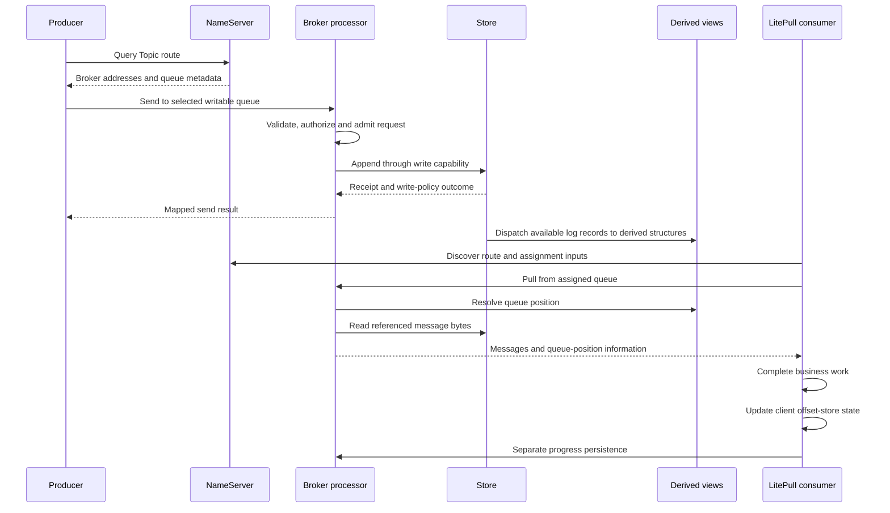

This page traces an ordinary message from route discovery to application processing and consumption progress. It uses the direct Rust client/Broker path and LocalFile storage as the reference composition. Transactions, delayed delivery, POP and Proxy add branches with their own contracts.

## From route to progress

The chart groups responsibilities rather than imposing a universal timeline between send response and every dispatch operation. Background dispatch and durability work may overlap. A send result and query visibility must be interpreted using their respective boundaries.

## 1. Discover a writable destination

Broker registration supplies the NameServer with identity, addresses and Topic metadata. The producer obtains a route, selects a writable queue and contacts that Broker directly. Cached routes reduce discovery work but can become stale when membership, addresses or permissions change.

A successful NameServer response only establishes that route data was returned. The selected Broker can still be unreachable, unavailable or unable to accept writes. Check both hops during [first diagnosis](../operations/first-diagnosis.md).

## 2. Encode, admit and validate

Protocol owns command identity, typed headers and encoding. Transport owns the connection, frame limits, request admission and deadline. Broker processors interpret the request in the context of Broker role, security, Topic settings and store availability.

This separation lets the same wire contract cross a bounded transport without giving the transport ownership of message persistence. A local writer completion does not prove the remote processor ran. A rejected admission need not have the same side-effect meaning as a timeout after a write was accepted.

## 3. Append and return a result

The send processor uses the Broker's write-store capability. The composed Store appends the encoded record to the primary log and returns a receipt describing status, appended range and durability information. The processor maps the store outcome into the protocol response consumed by the producer.

Some timeout or replica-unavailable statuses still describe an accepted append. The producer may also lose the response after the append succeeded. Therefore, application retries must tolerate duplicates rather than assuming an error means the log contains no record.

Local durability and configured replica acknowledgement are distinct conditions. A derived index catching up cannot strengthen the earlier primary-log receipt. See [storage design](storage.md) for the exact watermark model.

## 4. Build the read views

Dispatch interprets primary-log records and updates structures used by different operations. ConsumeQueue maps logical queue positions to physical message locations; key indexes serve message lookup; timer and other optional components maintain their own derived state.

Different derived views can have different progress. A message can be accepted while a particular query path has not yet caught up. This is not automatically a second copy of the authoritative message or a guarantee that the message has reached durable storage.

Recovery validates available primary-log state, reconstructs or advances compatible derived state, and resumes services in the appropriate lifecycle order. It does not manufacture a stronger guarantee than the configured acknowledgement and failure model provided.

## 5. Pull and retain message data

The LitePull client manages subscribed queue assignment and background pulls. The Broker validates the pull request, resolves the logical queue position and reads the referenced data through a read capability.

For transfer, a storage lease can retain the underlying file region until the writer finishes. Transport chooses the applicable portable or optional file-transfer path. A zero-copy API means particular copies were avoided; it does not promise that all packets use kernel zero-copy or that a remote application processed the data.

Polling exposes messages to application code. Application batching, concurrency and downstream dependencies determine when business work completes. They must remain bounded independently of the client's network buffers.

## 6. Advance progress deliberately

After successful processing, the application advances progress according to its consumer model. Current LitePull `commit_all` updates client offset-store state separately from remote persistence; the API can log individual queue errors internally. Its return does not prove durable progress for all queues.

If business work commits but group progress does not survive, replay may repeat the event. If progress advances before work completes, that work can be skipped after restart. The application must coordinate its own completion order and idempotency.

Push listener outcomes and POP receipt ACKs follow different paths. They must be described according to those models rather than inserted into the LitePull offset sequence.

## Observe the boundary that failed

| Symptom | First boundary to inspect |
| --- | --- |
| No Topic route | Broker registration and Topic metadata |
| Route exists, connection fails | Advertised address and Transport endpoint |
| Send result reports flush/replica timeout | Store acknowledgement policy and progress |
| Send succeeds, read/query lags | Relevant derived view and consumer eligibility |
| Polling returns data, business result is absent | Application processing and dependency transaction |
| Business work repeats after restart | Retry identity and persisted consumer progress |

Correlate bounded request/error metadata and queue positions. Do not use message bodies or credentials as routine diagnostic labels. The [delivery and retry guide](../guides/delivery-and-retry.md) explains how these failure windows affect business design.

Sources: [send processor](https://github.com/mxsm/rocketmq-rust/blob/main/rocketmq-broker/src/processor/send_message_processor.rs), [pull processor](https://github.com/mxsm/rocketmq-rust/blob/main/rocketmq-broker/src/processor/pull_message_processor.rs), [Store composition](https://github.com/mxsm/rocketmq-rust/blob/main/rocketmq-store/README.md), [LitePull implementation](https://github.com/mxsm/rocketmq-rust/blob/main/rocketmq-client/src/consumer/consumer_impl/default_lite_pull_consumer_impl.rs).
