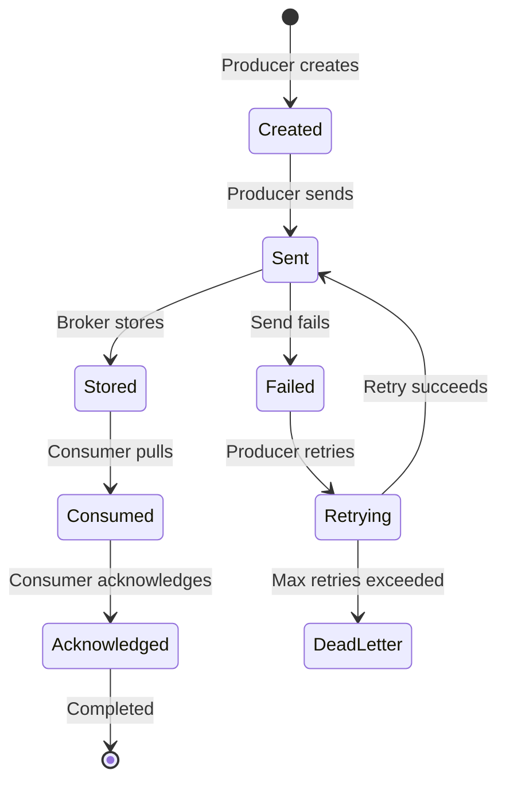

# Message Model

Understanding RocketMQ's message model is crucial for designing effective messaging applications.

## Message Structure

### Basic Message

A message in RocketMQ consists of:

```rust
pub struct Message {
    // Topic name
    topic: String,

    // Message body (byte array)
    body: Vec<u8>,

    // Optional tags for filtering
    tags: Option<String>,

    // Optional keys for indexing
    keys: Option<String>,

    // Optional properties
    properties: HashMap<String, String>,
}
```

### Message Example

```rust
use rocketmq::model::Message;

// Create a basic message
let mut message = Message::new(
    "OrderEvents".to_string(),
    b"{\"order_id\": \"12345\", \"amount\": 99.99}".to_vec(),
);

// Add tag for filtering
message.set_tags("order_created");

// Add key for indexing
message.set_keys("order_12345");

// Add custom properties
message.put_property("region", "us-west");
message.put_property("priority", "high");
```

## Topics and Queues

### Topic

A topic is a logical channel for categorizing messages:

- **Hierarchical naming**: e.g., `orders`, `payments`, `logs`
- **Multi-tenant**: Different applications use different topics
- **Logical isolation**: Messages in different topics are completely separate

### Queue

Topics are divided into multiple queues for parallel processing:

```
Topic: OrderEvents (4 queues)

┌─────────────────────────────────────┐
│ Queue 0 │ Queue 1 │ Queue 2 │ Queue 3 │
├─────────────────────────────────────┤
│ Msg 0   │ Msg 1   │ Msg 2   │ Msg 3   │
│ Msg 4   │ Msg 5   │ Msg 6   │ Msg 7   │
│ Msg 8   │ Msg 9   │ Msg 10  │ Msg 11  │
└─────────────────────────────────────┘
```

**Purpose of Multiple Queues:**
- Parallel processing by multiple consumers
- Load distribution
- Improved throughput

## Message Types

### Normal Messages

Regular messages with no special delivery guarantees:

```rust
let message = Message::new("NormalTopic".to_string(), body);
producer.send(message).await?;
```

### Ordered Messages

Messages that must be consumed in order within a queue:

```rust
// Use message queue selector to route related messages to the same queue
let selector = |queue_list: &[MessageQueue], message: &Message, arg: &str| {
    let hash = compute_hash(arg); // e.g., order_id
    let index = (hash % queue_list.len() as u64) as usize;
    &queue_list[index]
};

producer.send_with_selector(message, selector, "order_123").await?;
```

### Transactional Messages

Messages that are sent atomically with a database transaction:

```rust
let transaction_producer = TransactionProducer::new(option)?;

transaction_producer.send_transactional_message(message, |local_state| {
    // Execute local transaction
    let result = execute_database_transaction();

    // Return transaction status
    match result {
        Ok(_) => TransactionStatus::CommitMessage,
        Err(_) => TransactionStatus::RollbackMessage,
    }
}).await?;
```

### Delayed Messages

Messages that are delivered after a specified delay:

```rust
let mut message = Message::new("DelayedTopic".to_string(), body);
message.set_delay_time_level(3); // Delay level 3 (e.g., 10 seconds)
producer.send(message).await?;
```

## Message Filtering

### Tag-based Filtering

Filter messages by tags at the broker side:

```rust
// Producer sets tags
message.set_tags("order_paid");

// Consumer subscribes to specific tags
consumer.subscribe("OrderEvents", "order_paid || order_shipped").await?;
```

### SQL92 Filtering

Advanced filtering using SQL92 syntax:

```rust
// Producer sets properties
message.put_property("region", "us-west");
message.put_property("amount", "100");

// Consumer uses SQL expression
consumer.subscribe("OrderEvents", "region = 'us-west' AND amount > 50").await?;
```

## Message Properties

### System Properties

RocketMQ automatically adds system properties to each message:

- `MSG_ID`: Unique message ID
- `TOPIC`: Topic name
- `QUEUE_ID`: Queue ID
- `QUEUE_OFFSET`: Message position in queue
- `STORE_SIZE`: Message storage size
- `BORN_TIMESTAMP`: Message creation timestamp
- `STORE_TIMESTAMP`: Message storage timestamp

### User Properties

You can add custom properties:

```rust
message.put_property("source", "mobile_app");
message.put_property("version", "2.1.0");
message.put_property("user_id", "user_12345");
```

## Message Lifecycle



### Send Flow

```
1. Create Message
2. Set topic, body, tags, keys, properties
3. Select queue (load balancing or custom)
4. Send to broker
5. Broker stores in CommitLog
6. Broker updates ConsumeQueue
7. Return result to producer
```

### Consume Flow

```
1. Consumer pulls messages from queue
2. Deserialize message
3. Process message (user logic)
4. Acknowledge message
5. Update consumer offset
6. Continue to next batch
```

## Message Persistence

RocketMQ provides highly reliable message persistence:

```
┌─────────────────────────────────────┐
│         CommitLog                    │
│  (Sequential storage of all msgs)   │
├─────────────────────────────────────┤
│ [Msg 1][Msg 2][Msg 3][Msg 4]...    │
└─────────────────────────────────────┘
              ↓
┌─────────────────────────────────────┐
│      ConsumeQueue per Queue          │
│  (Index structure for fast access)  │
├─────────────────────────────────────┤
│ Queue 0: [Offset 0][Offset 8]...   │
│ Queue 1: [Offset 16][Offset 24]... │
└─────────────────────────────────────┘
```

## Best Practices

1. **Use meaningful topic names**: Follow a clear naming convention
2. **Set appropriate tags**: Use tags for message categorization
3. **Add message keys**: Enable message tracing and querying
4. **Keep message size reasonable**: Typically < 256KB
5. **Use properties for metadata**: Don't encode metadata in message body
6. **Consider ordering requirements**: Choose appropriate message type
7. **Handle idempotency**: Design consumers to handle duplicate messages

## Next Steps

- [Storage](../architecture/storage) - Learn about message persistence
- [Producer](../category/producer) - Advanced producer features
- [Consumer](../category/consumer) - Advanced consumer features
