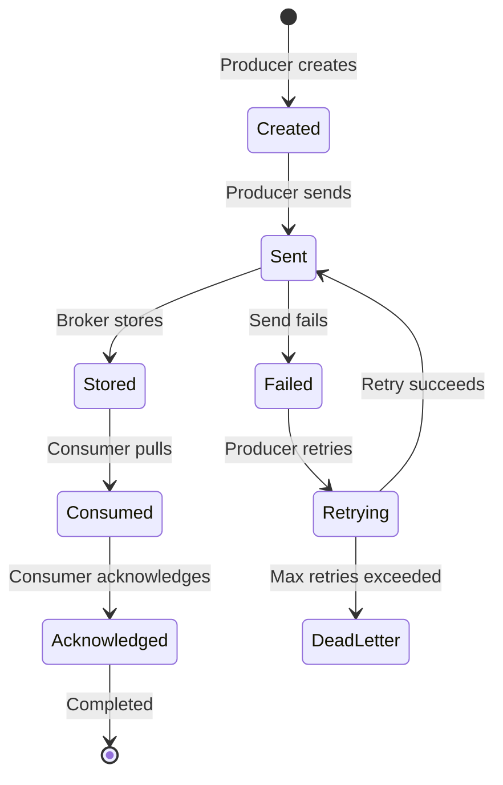

# Message Model

Understanding RocketMQ's message model is crucial for designing effective messaging applications.

## Message Structure

### Basic Message

A message in RocketMQ consists of:

```rust
pub struct Message {
    // Topic name
    topic: String,

    // Message body (byte array)
    body: Vec<u8>,

    // Optional tags for filtering
    tags: Option<String>,

    // Optional keys for indexing
    keys: Option<String>,

    // Optional properties
    properties: HashMap<String, String>,
}
```

### Message Example

```rust
use rocketmq_common::common::message::message_single::Message;

let message = Message::builder()
    .topic("OrderEvents")
    .body_slice(b"{\"order_id\": \"12345\", \"amount\": 99.99}")
    .tags("order_created")
    .key("order_12345")
    .raw_property("region", "us-west")?
    .raw_property("priority", "high")?
    .build()?;
```

## Topics and Queues

### Topic

A topic is a logical channel for categorizing messages:

- **Hierarchical naming**: e.g., `orders`, `payments`, `logs`
- **Multi-tenant**: Different applications use different topics
- **Logical isolation**: Messages in different topics are completely separate

### Queue

Topics are divided into multiple queues for parallel processing:

```text
Topic: OrderEvents (4 queues)

┌───────────────────────────────────────┐
│ Queue 0 │ Queue 1 │ Queue 2 │ Queue 3 │
├───────────────────────────────────────┤
│ Msg 0   │ Msg 1   │ Msg 2   │ Msg 3   │
│ Msg 4   │ Msg 5   │ Msg 6   │ Msg 7   │
│ Msg 8   │ Msg 9   │ Msg 10  │ Msg 11  │
└───────────────────────────────────────┘
```

**Purpose of Multiple Queues:**

- Parallel processing by multiple consumers
- Load distribution
- Improved throughput

## Message Types

### Normal Messages

Regular messages with no special delivery guarantees:

```rust
let message = Message::builder()
    .topic("NormalTopic")
    .body(body)
    .build()?;
producer.send(message).await?;
```

### Ordered Messages

Messages that must be consumed in order within a queue:

```rust
let message = Message::builder()
    .topic("OrderEvents")
    .body("ordered payload")
    .build()?;

let order_id = "order_123".to_string();
producer
    .send_with_selector(
        message,
        |queues: &[MessageQueue], _msg: &Message, id: &String| {
            let hash = compute_hash(id);
            let index = (hash % queues.len() as u64) as usize;
            queues.get(index).cloned()
        },
        order_id,
    )
    .await?;
```

### Transactional Messages

Messages that are sent atomically with a database transaction:

```rust
use rocketmq_client_rust::producer::mq_producer::MQProducer;
use rocketmq_client_rust::producer::transaction_mq_producer::TransactionMQProducer;

let mut transaction_producer = TransactionMQProducer::builder()
    .producer_group("tx_group")
    .name_server_addr("localhost:9876")
    .topics(vec!["OrderEvents"])
    .transaction_listener(OrderTransactionListener::default())
    .build();

let tx_result = transaction_producer
    .send_message_in_transaction(message, Some("order_123".to_string()))
    .await?;

println!("tx_result = {}", tx_result);
```

### Delayed Messages

Messages that are delivered after a specified delay:

```rust
let message = Message::builder()
    .topic("DelayedTopic")
    .body(body)
    .delay_level(3) // Delay level 3 (e.g., 10 seconds)
    .build()?;
producer.send(message).await?;
```

## Message Filtering

### Tag-based Filtering

Filter messages by tags at the broker side:

```rust
let message = Message::builder()
    .topic("OrderEvents")
    .body("payload")
    .tags("order_paid")
    .build()?;

// Consumer subscribes to specific tags
consumer.subscribe("OrderEvents", "order_paid || order_shipped").await?;
```

### SQL92 Filtering

Advanced filtering using SQL92 syntax:

```rust
let message = Message::builder()
    .topic("OrderEvents")
    .body("payload")
    .raw_property("region", "us-west")?
    .raw_property("amount", "100")?
    .build()?;

// Consumer uses SQL expression
consumer.subscribe("OrderEvents", "region = 'us-west' AND amount > 50").await?;
```

## Message Properties

### System Properties

RocketMQ automatically adds system properties to each message:

- `MSG_ID`: Unique message ID
- `TOPIC`: Topic name
- `QUEUE_ID`: Queue ID
- `QUEUE_OFFSET`: Message position in queue
- `STORE_SIZE`: Message storage size
- `BORN_TIMESTAMP`: Message creation timestamp
- `STORE_TIMESTAMP`: Message storage timestamp

### User Properties

You can add custom properties:

```rust
let message = Message::builder()
    .topic("OrderEvents")
    .body("payload")
    .raw_property("source", "mobile_app")?
    .raw_property("version", "2.1.0")?
    .raw_property("user_id", "user_12345")?
    .build()?;
```

## Message Lifecycle


```mermaid
stateDiagram-v2
    [*] --> Created: Producer creates
    Created --> Sent: Producer sends
    Sent --> Stored: Broker stores
    Stored --> Consumed: Consumer pulls
    Consumed --> Acknowledged: Consumer acknowledges
    Acknowledged --> [*]: Completed

    Sent --> Failed: Send fails
    Failed --> Retrying: Producer retries
    Retrying --> Sent: Retry succeeds
    Retrying --> DeadLetter: Max retries exceeded
```

### Send Flow

```text
1. Create Message
2. Set topic, body, tags, keys, properties
3. Select queue (load balancing or custom)
4. Send to broker
5. Broker stores in CommitLog
6. Broker updates ConsumeQueue
7. Return result to producer
```

### Consume Flow

```text
1. Consumer pulls messages from queue
2. Deserialize message
3. Process message (user logic)
4. Acknowledge message
5. Update consumer offset
6. Continue to next batch
```

## Message Persistence

RocketMQ provides highly reliable message persistence:

```text
┌─────────────────────────────────────┐
│         CommitLog                   │
│  (Sequential storage of all msgs)   │
├─────────────────────────────────────┤
│ [Msg 1][Msg 2][Msg 3][Msg 4]...     │
└─────────────────────────────────────┘
              ↓
┌─────────────────────────────────────┐
│      ConsumeQueue per Queue         │
│  (Index structure for fast access)  │
├─────────────────────────────────────┤
│ Queue 0: [Offset 0][Offset 8]...    │
│ Queue 1: [Offset 16][Offset 24]...  │
└─────────────────────────────────────┘
```

## Best Practices

1. **Use meaningful topic names**: Follow a clear naming convention
2. **Set appropriate tags**: Use tags for message categorization
3. **Add message keys**: Enable message tracing and querying
4. **Keep message size reasonable**: Typically < 256KB
5. **Use properties for metadata**: Don't encode metadata in message body
6. **Consider ordering requirements**: Choose appropriate message type
7. **Handle idempotency**: Design consumers to handle duplicate messages

## Next Steps

- [Storage](../architecture/storage) - Learn about message persistence
- [Producer](../category/producer) - Advanced producer features
- [Consumer](../category/consumer) - Advanced consumer features
