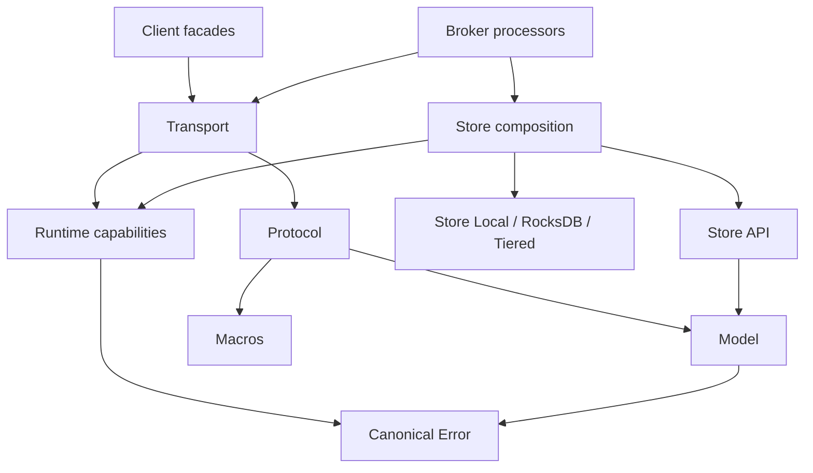

Use this map to find the owner of a behavior before editing it. Cargo packages, operating-system processes and products are different units: one Broker process composes several libraries, while a Dashboard product may contain separate Rust and Node projects.

## Workspace membership and release scope

The current root `Cargo.toml` lists **28 workspace members**. `scripts/core-release-scope.json` lists **27 core packages**. The difference is `rocketmq-dashboard-common`, which belongs to the root workspace but is outside that core-release package list.

Workspace membership selects Cargo's build graph. Core-release classification describes packaging intent such as registry publication, binary-only or internal use. Neither count proves that all packages have already been published at the source version.

Folder and package names can differ. The `rocketmq-client` directory contains package `rocketmq-client-rust`; use the package name in `cargo -p` commands. The `rocketmq-dashboard` directory is not itself a Cargo workspace.

## Root members by responsibility

| Paths relative to the repository | Responsibility | Boundary to preserve |
| --- | --- | --- |
| `rocketmq-model`, `rocketmq-error` | Domain values and canonical operational errors | Message identities, serialization and error identity |
| `rocketmq-security-api` | Shared security contracts | Security types without silently selecting a policy implementation |
| `rocketmq-protocol`, `rocketmq-macros` | Wire commands/codecs and generated typed-header support | Request codes, headers and serialization |
| `rocketmq-transport` | Client/server connections, dispatch, admission and file transfer | Bounded network work and completion meaning |
| `rocketmq-runtime` | Runtime ownership, task scopes, blocking and resource budgets | Cancellation, admission and shutdown evidence |
| `rocketmq-observability` | Logs, metrics, tracing and exporter ownership | Bounded diagnostics and redaction |
| `rocketmq-auth`, `rocketmq-filter` | Authentication/authorization implementations and filtering | Runtime permissions and supported expressions |
| `rocketmq-client` | Producer, consumer and optional Admin facades | Application-owned ClientRuntime and API compatibility |
| `rocketmq-namesrv` | Broker registration and route lookup | Discovery state and advertised addresses |
| `rocketmq-broker` | Message processors and service composition | Broker/store lifecycle and request outcomes |
| `rocketmq-store-api` | Backend-neutral storage contracts | Receipts, durability, progress and HA decisions |
| `rocketmq-store` | Broker-facing StoreFactory/StorePorts composition | Exclusive lifecycle ownership and narrow capabilities |
| `rocketmq-store-local`, `rocketmq-store-rocksdb`, `rocketmq-tieredstore` | Local storage primitives, optional RocksDB metadata and tiered integration | Primary-log authority versus derived/secondary progress |
| `rocketmq-controller` | Controller metadata, OpenRaft and Broker-role coordination | Write authority, epochs and replica membership |
| `rocketmq-proxy`, `rocketmq-proxy-core`, `rocketmq-proxy-cluster`, `rocketmq-proxy-local` | Proxy ingress, common contracts and remote/embedded adapters | Mode-specific backend and runtime ownership |
| `rocketmq-tools/rocketmq-admin/rocketmq-admin-core` | Reusable typed administration services | Read/mutation adapter selection |
| `rocketmq-tools/rocketmq-admin/rocketmq-admin-cli`, `rocketmq-admin-tui` under the same parent | Command-line and terminal administration | Tool invocation and operator-facing errors |
| `rocketmq-tools/rocketmq-store-inspect` | Explicit storage inspection operations | Offline access and data-format scope |
| `rocketmq-dashboard/rocketmq-dashboard-common` | Shared Dashboard domain models and logic | Shared library, not the UI or backend executable |

These rows group related members; they are not a claim that all grouped crates share the same features or release classification.

## How the libraries fit together



This is a selected dependency view, not an exhaustive Cargo graph. Security and observability are cross-cutting dependencies. The important distinction is that wire types do not own sockets, and storage contracts do not select a runtime or concrete database.

For exact active dependencies, run from the root:

```bash
cargo metadata --no-deps --format-version 1
cargo tree -p rocketmq-client-rust -e features
```

The feature tree describes that invocation's graph. Optional dependencies, defaults and feature unification can make another consumer's graph differ. For example, the root transport dependency disables defaults, while a direct package build can enable package defaults.

## Standalone projects

| Project root | Structure | Start here |
| --- | --- | --- |
| `rocketmq-example` | Standalone Cargo examples | Its manifest and example targets |
| `rocketmq-website` | Docusaurus Node project | `package.json` and website authoring guide |
| `rocketmq-website/examples/first-message` | Small standalone Cargo tutorial | Its manifest with checkout-relative dependencies |
| `rocketmq-dashboard/rocketmq-dashboard-gpui` | Native Rust desktop app | Local manifest and platform prerequisites |
| `rocketmq-dashboard/rocketmq-dashboard-tauri` | Node frontend plus `src-tauri` Rust backend | Tauri commands from the frontend project root |
| `rocketmq-dashboard/rocketmq-dashboard-web` | Separate `frontend` Node and `backend` Cargo projects | Web Dashboard setup guide |
| `rocketmq-ai/rocketmq-mcp` | Standalone read-only MCP package | Its transport features and configuration |
| `rocketmq-ai/rocketmq-mcp-control` | Standalone controlled-mutation package | Separate policy and build enablement |
| `rocketmq-ai/rocketmq-sre` | Standalone Rust 2024 workspace, plus UI and SDK projects | SRE workspace and deployment guides |
| `fuzz` and macro test fixtures | Specialized standalone harnesses | Their local instructions and targets |

Do not run a root `cargo check` and interpret it as a check of every standalone product. Similarly, a frontend `npm run build` does not prove that a Tauri installer or Web backend was built.

## Locate a change

- A wrong request code or encoded header belongs near Protocol and its contract tests.
- A connection timeout, admission or writer-lifetime issue belongs near Transport and its consumers.
- A leaked task or shutdown deadline issue belongs at the actual runtime owner, often involving Runtime and the integrating service.
- A stored message with delayed query visibility belongs in the Store append/dispatch/read path, not automatically in the NameServer.
- A UI operation may cross frontend, product backend, Admin Core and the core service; inspect those concrete consumers.

Public exports are deliberate. Prefer crate-root, `api` or `prelude` entry points documented by the owner instead of importing a private implementation module because its file exists.

Continue with [message lifecycle](message-lifecycle.md) for the request path and [developer guide](../contributing/development-guide.md) for working directories and focused checks.

Sources: [workspace members](https://github.com/mxsm/rocketmq-rust/blob/main/Cargo.toml), [core release scope](https://github.com/mxsm/rocketmq-rust/blob/main/scripts/core-release-scope.json), [Protocol](https://github.com/mxsm/rocketmq-rust/blob/main/rocketmq-protocol/README.md), [Transport](https://github.com/mxsm/rocketmq-rust/blob/main/rocketmq-transport/README.md), [Store API](https://github.com/mxsm/rocketmq-rust/blob/main/rocketmq-store-api/README.md).
