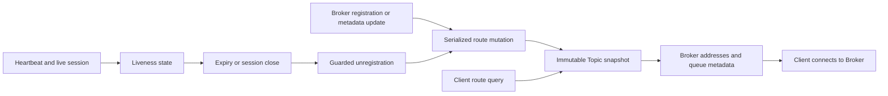

NameServer answers where a Topic can be read or written. Brokers register their identity and Topic metadata; clients query routes and then communicate with Brokers. Message bodies and consumer business acknowledgements do not pass through NameServer.

## State and publication

`RouteInfoManager` maintains source tables for Topic queues, Broker addresses, cluster membership, live Brokers, filter servers, and queue mapping metadata. A route-visible mutation acquires one coordinator, updates the related tables, and publishes immutable snapshots for affected Topics. A route lookup loads one complete Topic snapshot instead of joining concurrently changing tables.

This is a deliberate concurrency tradeoff: coherent, inexpensive Topic reads in exchange for serialized mutations and rebuilding affected views. It does not make snapshots across different Topics one global transaction. Management queries acquire the mutation coordinator while assembling their source-table views.

`KVConfigManager` separately manages namespace/key configuration and persistence. Persisting KV configuration does not turn live Broker routes into a durable cluster registry; live route state is repopulated from Broker registration after a NameServer restart.

## Registration, queries, and expiry

Registration associates Broker cluster/name/ID/address with its current Topic and live-session information. Metadata versions help decide which information needs updating. A heartbeat refreshes liveness; it is not an acknowledgement that any message was stored.

The housekeeping path detects inactive Brokers, and transport session destruction can request earlier removal. Unregistration carries session/generation information so a delayed cleanup for an old connection can be distinguished from a newer registration. The batch unregistration service removes affected addresses and queue metadata, then republishes routes.

The resulting visibility delay includes registration/heartbeat intervals, expiry detection, queued cleanup, network latency, and client route refresh. An expiry setting alone is not a failover time guarantee. A client may retain a route for an unreachable Broker until a refresh or an operation failure causes recovery.

Route responses include queue permissions and Broker endpoints. A Topic route existing does not prove that the advertised endpoint is reachable from the client, the Broker is writable, or the caller is authorized. Check advertised IPs and ports when NameServer queries succeed but sends fail.

## Multiple NameServers

Brokers use their configured NameServer endpoint set to register with available nodes; the registration path falls back to the configured list when the available list is empty. These calls can produce different outcomes on different NameServers.

Clients also maintain a NameServer endpoint set and obtain route information through the transport client. The ordinary NameServer service does not use Raft to replicate its route tables between peers. Consequently, two NameServers can temporarily answer with different routes. Deploy multiple nodes for discovery availability, configure Brokers and clients consistently, and inspect each node when registration is asymmetric.

No NameServer quorum is needed for an ordinary route lookup. Conversely, successful lookup is not Controller quorum evidence. [Controller coordination](ha-controller.md) is a separate service even when it is embedded in a NameServer process.

## Startup and lifecycle

The binary is `rocketmq-namesrv-rust`. Its bootstrap resolves configuration and home/KV paths, assembles runtime-owned processors, admission, route housekeeping, persistence, and the transport listener. Starting an empty NameServer successfully is expected to produce no application Topic routes until Brokers register.

The default build excludes the embedded Controller dependency graph. Embedded mode needs both the `embedded-controller` Cargo feature and `enableControllerInNamesrv = true`; enabling the setting without the feature is rejected. Controller remoting and Raft endpoints still need distinct, valid addresses.

Shutdown stops ingress and owned housekeeping/unregistration work and closes service-owned persistence/runtime resources. A process exit or dropped route handle should not be treated as proof that queued administrative persistence completed.

## Failure interpretation

| Observation | Interpretation and next evidence |
| --- | --- |
| Topic absent on every node | Check Topic provisioning and successful Broker registrations |
| Topic absent on one node | Compare Broker endpoint lists, connectivity, and registration failures |
| Route present but Broker unreachable | Check the advertised Broker address from the client network |
| Route remains after a Broker failure | Examine liveness expiry and client cache refresh separately |
| Controller unavailable | Diagnose Controller leadership independently of NameServer route availability |

See [first diagnosis](../operations/first-diagnosis.md) for a concrete route-to-message investigation.

## Source map

- [Route manager](https://github.com/mxsm/rocketmq-rust/blob/main/rocketmq-namesrv/src/route/route_info_manager.rs) and [snapshot publication](https://github.com/mxsm/rocketmq-rust/blob/main/rocketmq-namesrv/src/route/topic_route_snapshot.rs).
- [Bootstrap](https://github.com/mxsm/rocketmq-rust/blob/main/rocketmq-namesrv/src/bootstrap.rs), [KV configuration](https://github.com/mxsm/rocketmq-rust/tree/main/rocketmq-namesrv/src/kvconfig).
- [Broker registration calls](https://github.com/mxsm/rocketmq-rust/blob/main/rocketmq-broker/src/out_api/broker_outer_api.rs).
