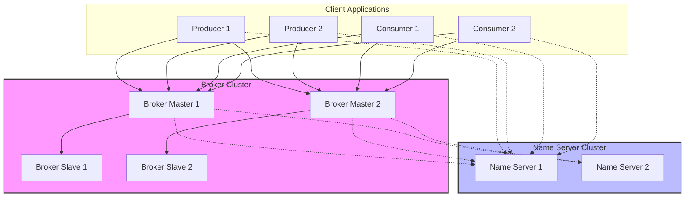
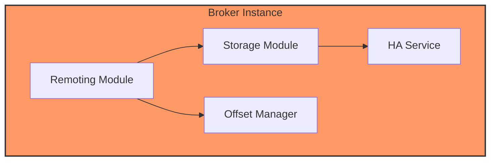
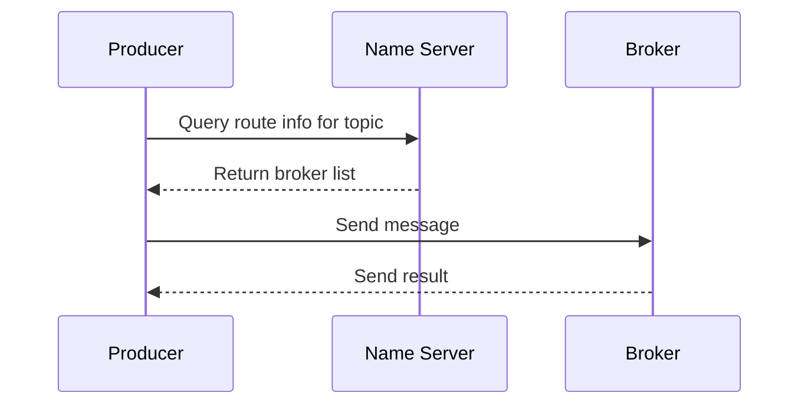
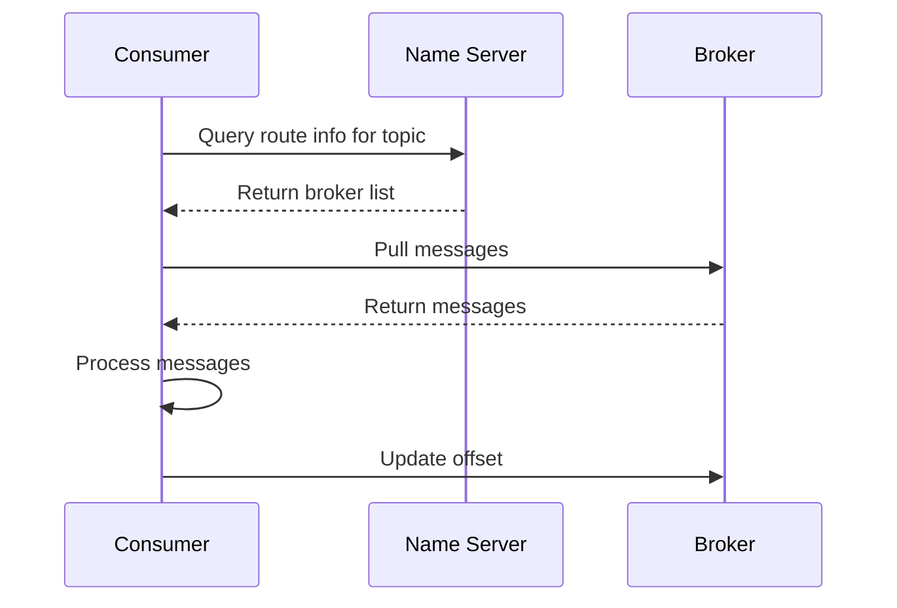
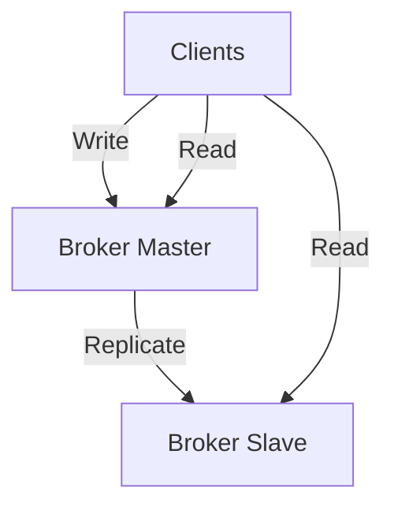

# Architecture Overview

RocketMQ-Rust inherits the proven architecture of Apache RocketMQ while leveraging Rust's performance and safety features.

## System Architecture



## Components

### 1. Name Server

The Name Server is a lightweight registry service that provides:

**Functions:**
- Broker registration and discovery
- Route information management
- Heartbeat detection

**Characteristics:**
- Stateless design
- Cluster deployment for high availability
- No data synchronization needed between nodes

**Key Operations:**
```rust
// Client queries name server for broker addresses
let broker_addrs = name_server.lookup_broker("TopicTest").await?;
```

### 2. Broker

Brokers are the core message handling component:

**Responsibilities:**
- Message reception and storage
- Message querying and delivery
- Consumer offset management
- HA (High Availability) replication

**Broker Components:**



**Message Storage:**
- CommitLog: Sequential storage for all messages
- ConsumeQueue: Index structure for fast consumption
- IndexFile: Hash index for message key queries

### 3. Producer

Producers send messages to brokers:

**Features:**
- Asynchronous sending
- Automatic retry on failure
- Load balancing across brokers
- Transactional message support

**Sending Flow:**



### 4. Consumer

Consumers receive and process messages:

**Types:**
- **Push Consumer**: Event-driven, broker pushes messages
- **Pull Consumer**: Polling-based, consumer pulls messages

**Consumption Models:**
- **Clustering**: Load balancing across consumers
- **Broadcasting**: Each consumer receives all messages

**Consumption Flow:**



## Message Flow

### Message Sending

```
1. Producer queries Name Server for topic route info
2. Name Server returns broker list with queue information
3. Producer selects a queue (load balancing)
4. Producer sends message to broker
5. Broker stores message in CommitLog
6. Broker updates ConsumeQueue index
7. Broker returns send result to producer
```

### Message Consumption

```
1. Consumer queries Name Server for topic route info
2. Name Server returns broker list with queue information
3. Consumer rebalances and assigns queues
4. Consumer pulls messages from assigned queues
5. Consumer processes messages
6. Consumer commits offset updates
7. Consumer pulls next batch of messages
```

## High Availability

### Broker HA

Brokers support master-slave replication:

- **Master**: Handles read/write operations
- **Slave**: Replicates master data, handles read operations
- **Synchronization**: Synchronous or async replication



### Name Server HA

Name Servers form a cluster:
- Each broker registers with all name servers
- Clients can query any name server
- No single point of failure

## Rust-Specific Design

### Memory Safety

RocketMQ-Rust leverages Rust's ownership model:
- No manual memory management
- No null pointer dereferences
- No data races at compile time

### Async Architecture

Built on Tokio runtime:
- Non-blocking I/O operations
- Efficient resource utilization
- High concurrency with minimal overhead

### Zero-Cost Abstractions

- Generics for type-safe APIs
- Compile-time optimizations
- No runtime penalty for abstractions

## Next Steps

- [Message Model](../architecture/message-model) - Deep dive into message storage
- [Storage](../architecture/storage) - Learn about persistence mechanisms
- [Configuration](../category/configuration) - Configure your deployment
