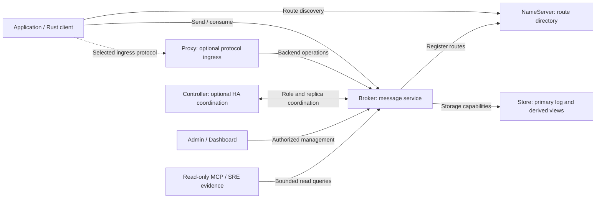
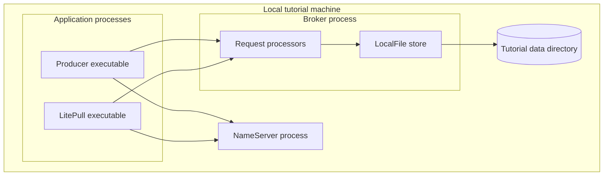

RocketMQ-Rust separates message discovery, message ownership, application processing and operations products. Its basic deployment is one or more NameServers, Brokers and client applications. Proxy, Controller, dashboards and AI services add distinct responsibilities; they are not mandatory hops in every message path.

This page explains the logical boundaries. [Module map](module-map.md) relates them to crates, and [deployment overview](../deployment/overview.md) relates them to processes.

## The logical system

```mermaid
flowchart LR
    App["Application / Rust client"]
    N["NameServer: route directory"]
    B["Broker: message service"]
    S["Store: primary log and derived views"]
    P["Proxy: optional protocol ingress"]
    H["Controller: optional HA coordination"]
    O["Admin / Dashboard"]
    R["Read-only MCP / SRE evidence"]
    App -->|"Route discovery"| N
    App -->|"Send / consume"| B
    App -.->|"Selected ingress protocol"| P
    P -->|"Backend operations"| B
    B -->|"Register routes"| N
    B -->|"Storage capabilities"| S
    H <-->|"Role and replica coordination"| B
    O -->|"Authorized management"| B
    R -->|"Bounded read queries"| B
```

Solid arrows show responsibilities in the depicted composition, not a requirement that every optional component be deployed. The Proxy may instead embed a local Broker; read-only products also use discovery and their own adapters. The diagram deliberately separates an operations query from the ordinary message data path.

## Discovery and data ownership

NameServers receive Broker registrations, track liveness and return Topic route snapshots. They do not store application message bodies or relay producer traffic. A route supplies Broker addresses and queue metadata; it does not prove that the Broker is writable or reachable from a particular client.

Brokers own Topic/Consumer Group metadata, request processing, message placement, reads, consumer coordination and storage lifecycle. The Store implementation lives inside that responsibility boundary. Model, Protocol and Store API crates are libraries, not additional network services.

Clients own the application-facing sending or consumption model, maintain routes and connections, and run their work under an injected client runtime. Application processing and business storage stay outside the Broker's transaction boundary.

## Protocol and runtime boundaries

| Boundary | Responsibility | Does not own |
| --- | --- | --- |
| Model | Domain message, queue and result values | Sockets or service startup |
| Protocol | Commands, wire codes, typed headers and encoding | Network connection lifetimes |
| Transport | TCP/TLS, framing limits, connection/request admission, dispatch and response completion | Business storage or application success |
| Runtime | Task ownership, cancellation, blocking lanes, resource reservations and shutdown reports | Automatic correctness of arbitrary business work |
| Store API | Typed capabilities, append receipts, progress and replication decisions | A concrete engine or executor |

“Remoting” describes the RocketMQ command transport and the client/server APIs built around it. In the current root workspace, `rocketmq-protocol` owns wire contracts and `rocketmq-transport` owns networking. Do not treat a historical Remoting module path as a separate current workspace service.

Transport completion, Broker acceptance, durability, consumer delivery and business completion are separate observations. [Message lifecycle](message-lifecycle.md) follows those transitions; [storage](storage.md) explains the persistence boundary.

## Optional ingress and HA

Proxy exposes the v2 gRPC MessagingService and optional remoting ingress. Cluster mode adapts operations to remote services. Local mode owns an embedded Broker-backed composition. They share processor contracts but have different deployment, failure and shutdown boundaries.

Controller manages Broker metadata, master election and replica coordination using the Rust Controller's OpenRaft implementation. It does not carry every message body. Controller availability, Broker write authority, replica progress and send acknowledgement policy must be considered together when selecting an HA topology.

Compatible Broker-facing responses do not imply that a Rust Controller can join a Java JRaft/DLedger consensus group. Use the implementation's own peer and storage contracts. See the [capability matrix](../overview/capability-matrix.md) before combining modes.

## Management and AI products

The Admin CLI, Admin Core and dashboards expose management through their selected API surfaces and runtime permissions. A compile-time mutation feature only makes code available; it does not grant a principal permission to change a cluster.

The read-only MCP server supplies bounded diagnostic access. MCP Control is a separate mutation product with explicit enablement and typed operations. SRE separates evidence collection, model-assisted diagnosis, planning, coordination and registered execution drivers. A recommendation is not execution authority.

These products may depend on the core libraries or communicate with services, but retain independent configuration, identities and lifecycle. [Ecosystem overview](../ecosystem/overview.md) describes the setup sequence and boundaries.

## One machine is enough to learn the path

```mermaid
flowchart TB
    subgraph Host["Local tutorial machine"]
      subgraph Clients["Application processes"]
        Producer["Producer executable"]
        Consumer["LitePull executable"]
      end
      NS["NameServer process"]
      subgraph BrokerProcess["Broker process"]
        Processor["Request processors"]
        Store["LocalFile store"]
        Processor --> Store
      end
      Files[("Tutorial data directory")]
      Producer --> NS
      Consumer --> NS
      Producer --> Processor
      Consumer --> Processor
      Store --> Files
    end
```

Each application and service owns its runtime. The Store shares the Broker's process and receives runtime capabilities from its composition root. This topology teaches registration and message flow without implying redundancy.

Start with [local source setup](../getting-started/local-source.md) and [quick start](../getting-started/quick-start.md). For implementation work, continue to the [module map](module-map.md), [runtime design](runtime.md) and [developer guide](../contributing/development-guide.md).

Sources: [workspace manifest](https://github.com/mxsm/rocketmq-rust/blob/main/Cargo.toml), [Broker](https://github.com/mxsm/rocketmq-rust/blob/main/rocketmq-broker/README.md), [Proxy](https://github.com/mxsm/rocketmq-rust/blob/main/rocketmq-proxy/README.md), [Controller](https://github.com/mxsm/rocketmq-rust/blob/main/rocketmq-controller/README.md).
