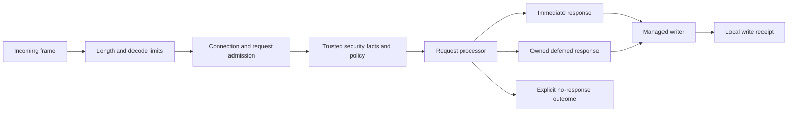

`rocketmq-protocol` defines what a RocketMQ remoting command means on the wire. `rocketmq-transport` owns moving frames through bounded connections and dispatching them under a runtime owner. Separating these responsibilities allows codecs and typed headers to be used without opening a socket.

## Remoting framing

A remoting frame contains a total-length field, a combined serialization-type/header-length field, the encoded header, and an optional body. The combined field uses the high 8 bits for serialization type and the low 24 bits for header length. This encoding limit is not an instruction to accept a body of arbitrary size: transport limits constrain actual frames.

The header carries request/response code, language/version, opaque correlation identifier, flags, remark, and extension fields. Typed custom headers convert application fields into the protocol representation. Correlation identifies a request/response exchange; it is not a business deduplication key.

JSON and RocketMQ binary header serialization are separate formats. `RemotingCommandFactory` uses immutable defaults so an application can construct commands with explicit version/serialization settings. The compatibility application-default path is initialized by the application owner; changing a process setting after constructing a factory should not be treated as changing that factory's contract.

Protocol contract violations include invalid encodings or header contracts. Operational connection failures retain the shared error identity. Preserve wire field names, numeric codes, flags, and persisted/message codec layouts independently of Rust refactoring.

## Network request lifecycle

This diagram shows responsibility boundaries, not an assertion that every check has one universal scheduling order. `TransportClientBuilder` / `RemotingClientBuilder` construct managed clients, and `TransportServer` owns server work. Configuration supplies frame limits, socket/TLS behavior, admission limits, and processors through the curated `api` or `prelude` surface.

`RequestDeadline` bounds request waiting and work admitted through its path. Backpressure limits active work; retained-byte limits cover memory held by queued or deferred responses where configured. These limits solve different problems from connection count and per-second rate limits.

`HandlerOutcome` distinguishes immediate, deferred, and explicit no-response handling. Deferred work must retain the response and resource ownership it needs until completion, cancellation, or expiry. Treating every missing immediate response as a processor failure would break long polling and one-way semantics.

## Interpreting outcomes

| Outcome | Meaning |
| --- | --- |
| Valid response | A peer returned a correlated protocol response; inspect its application code |
| Admission rejection | The boundary could not accept more work under its limits |
| Deadline expiry | Waiting/work exceeded the budget; remote completion may remain uncertain |
| Decode/protocol failure | Frame or header does not satisfy the supported contract |
| Connection loss | The channel became unavailable; prior local write progress matters to retry safety |
| Local writer completion | The local transport finished writing; it is not remote persistence or consumption |

Retries belong to an operation owner that knows idempotency and progress. The transport cannot safely turn every disconnect into a replay of a mutating request.

## File regions, TLS, and copies

`FileRegion` keeps an immutable storage lease until writer completion so cleanup cannot retire a file while a response still references it. The portable path reads through a reusable 64 KiB buffer on a runtime-owned blocking I/O lane.

The optional `linux-sendfile` path applies only to eligible plaintext transfers after capability checks. Unsupported preflight conditions fall back before frame bytes are written. TLS requires the portable path so bytes pass through the TLS record layer. Shared `Bytes` and vectored writes reduce userspace copies but do not establish kernel zero-copy, NIC offload, or remote acknowledgement for every request.

The transport package defaults include `tls` and `socks`, while the root workspace dependency disables defaults. Inspect the consuming package's feature graph. The Rust client has no feature named `tls`; it needs transport TLS compiled and configured.

## Remoting and gRPC

NameServer/Broker remoting commands and Proxy v2 gRPC methods are distinct protocols. Proxy adapters translate generated protobuf requests into service contracts and map results back to payload/transport statuses. Enabling generated bindings does not start a listener, and exposing Proxy gRPC does not automatically expose every Broker administrative request.

Controller Raft gRPC is another separate endpoint for control-plane consensus. It is not the Proxy messaging service and not a replacement for Broker HA data transfer.

## Source map

- [Protocol contracts](https://github.com/mxsm/rocketmq-rust/blob/main/rocketmq-protocol/README.md), [frame fields](https://github.com/mxsm/rocketmq-rust/blob/main/rocketmq-protocol/src/protocol/remoting_command.rs).
- [Transport public surface](https://github.com/mxsm/rocketmq-rust/blob/main/rocketmq-transport/src/public_api.rs), [transport design](https://github.com/mxsm/rocketmq-rust/blob/main/rocketmq-transport/README.md).
- [Proxy protocol](https://github.com/mxsm/rocketmq-rust/blob/main/rocketmq-proxy-core/proto/service.proto), [Proxy architecture](proxy.md), [error projection](errors-observability.md).
