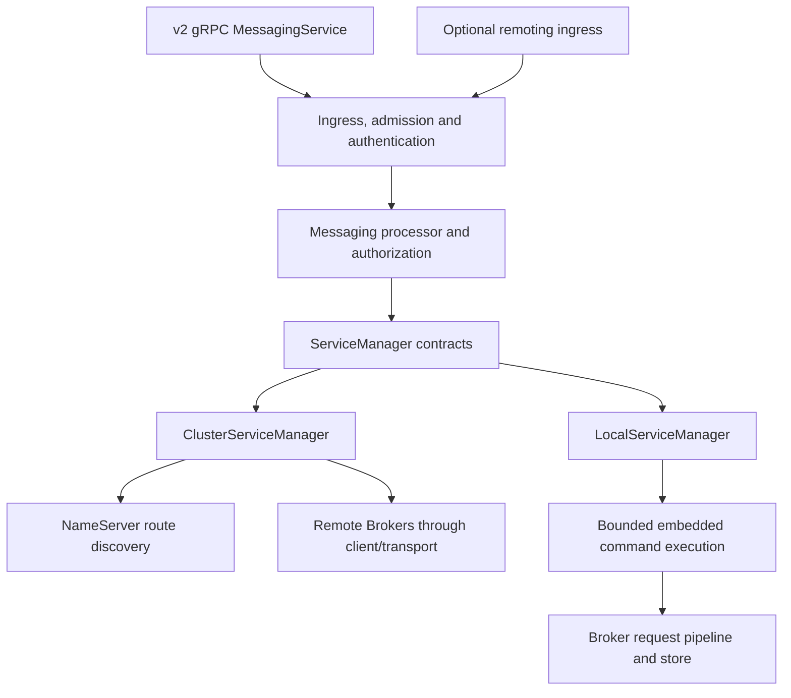

Proxy exposes the RocketMQ v2 gRPC `MessagingService` and an optional client-facing remoting ingress. It translates these requests into backend-neutral services, then either calls an existing cluster or an embedded Broker. Proxy is not a second independent message store in cluster mode.

## Composition and two modes

`rocketmq-proxy-core` owns contracts, generated protocol models, ingress/session state, receipts, and drain coordination. It uses Tokio/runtime capabilities and is not a runtime-free model crate. `rocketmq-proxy-cluster` owns the remote client bridge; `rocketmq-proxy-local` owns the embedded Broker adapter. `rocketmq-proxy` assembles listeners, authentication, processors, and lifecycle.

Cluster mode uses NameServer discovery and cached route/metadata information, then makes bounded client/transport calls. Outbound signing is an explicit security capability. An authenticated inbound request does not automatically authenticate the Proxy's separate Broker connection.

Local mode uses an embedded Broker facade through a bounded command queue. Queue count, retained bytes, age, I/O concurrency, control reserve, and long-poll tracking have separate limits. Embedded dispatch still traverses the Broker request pipeline. Its component constructor is not the complete standalone `BrokerBootstrap` path; configure its own Broker identity and a unique store root.

## Protocol surface

The gRPC service includes route/assignment queries, heartbeats, send, receive, pull, ACK, invisible-duration changes, offset operations, transactions, recall, telemetry, client termination, and lite subscriptions. Streaming Receive/Pull responses have their own lifetime and retained-result budgets.

Remoting is disabled by default. When enabled, it adapts selected client request codes to the processor/backend model. It is not a universal Broker administration tunnel: auth administration codes are rejected at this ingress and belong at the Broker administration endpoint. Local-mode lock/unlock passthrough is a separate supported path.

gRPC defaults to port 8081 and optional remoting to 8080; these are Proxy ingress ports, distinct from embedded or remote Broker endpoints. Generated protobuf bindings require `protoc` at build time, even though the core crate alone does not start a server.

## Sessions and receipts

`ClientSessionRegistry` tracks client liveness/settings, telemetry links, prepared transactions, lite subscriptions, and receipt ownership. A heartbeat refreshes session state; it does not commit a business transaction or ACK every delivery.

Receipt renewal uses monotonic deadlines and generation-aware scheduling. Replacing/removing a receipt invalidates stale scheduled entries. Renewal results distinguish successful progress, transient retries, invalid receipts, and expiry before renewal. Automatic renewal is configurable, but cannot guarantee delivery invisibility during process loss or a sustained backend outage.

Session TTL and receipt tracking TTL are distinct from the Broker's actual invisible deadline. A receipt retained in memory can still be expired at the Broker. ACK and invisible-duration operations must use the correct current delivery context; see [POP](../consumer/pop.md).

## Admission and draining

Route, producer, consumer, and client-manager work have separate inflight permits and optional rate limits. Receive/Pull streams additionally retain result permits and bytes. A slow reader can keep a response alive after backend work finishes, so limiting backend calls alone is insufficient.

The supervised drain model distinguishes `Accepting`, `Draining`, and `Drained`. Its snapshot includes admission/routing/readiness and pending counts for connections, sessions, receipts, prepared transactions, telemetry links/commands, remoting channels, and in-flight RPCs. A zero RPC count alone does not establish drained state.

A drain operation has an identity and rejects conflicting operations. Finishing a drain is different from closing runtime services. The application must still stop listeners, session maintenance, backend work, authentication, telemetry, and the runtime through their owners. A deadline expiry must be reported rather than described as completed draining.

## Failure behavior and build selection

| Failure | Boundary to inspect |
| --- | --- |
| No route or stale metadata | Cluster discovery/cache and Broker metadata calls |
| Ingress authenticated, downstream denied | Proxy outbound credentials and Broker policy |
| Receive stream stalls | Client reader, response permits/bytes, backend deadline |
| Receipt expires | Session ownership, renewal scheduling, backend availability |
| Local queue rejects work | Embedded queue count/bytes/age and control reserve |
| Configured mode unavailable | Compiled mode features |

Default Proxy features include both `cluster-mode` and `local-mode`. A cluster-only build uses `--no-default-features --features cluster-mode` and excludes the embedded Broker backend. Selecting an uncompiled mode is a configuration error. Optional TLS and observability features still require listener/exporter configuration.

## Source map

- [Proxy entry point](https://github.com/mxsm/rocketmq-rust/blob/main/rocketmq-proxy/README.md), [core contracts](https://github.com/mxsm/rocketmq-rust/blob/main/rocketmq-proxy-core/README.md).
- [Cluster adapter](https://github.com/mxsm/rocketmq-rust/blob/main/rocketmq-proxy-cluster/README.md), [local adapter](https://github.com/mxsm/rocketmq-rust/blob/main/rocketmq-proxy-local/README.md).
- [Receipt scheduler](https://github.com/mxsm/rocketmq-rust/blob/main/rocketmq-proxy-core/src/receipt_renewal.rs), [drain model](https://github.com/mxsm/rocketmq-rust/blob/main/rocketmq-proxy-core/src/drain.rs).
- [Security](security.md), [protocol and transport](protocol-transport.md).
