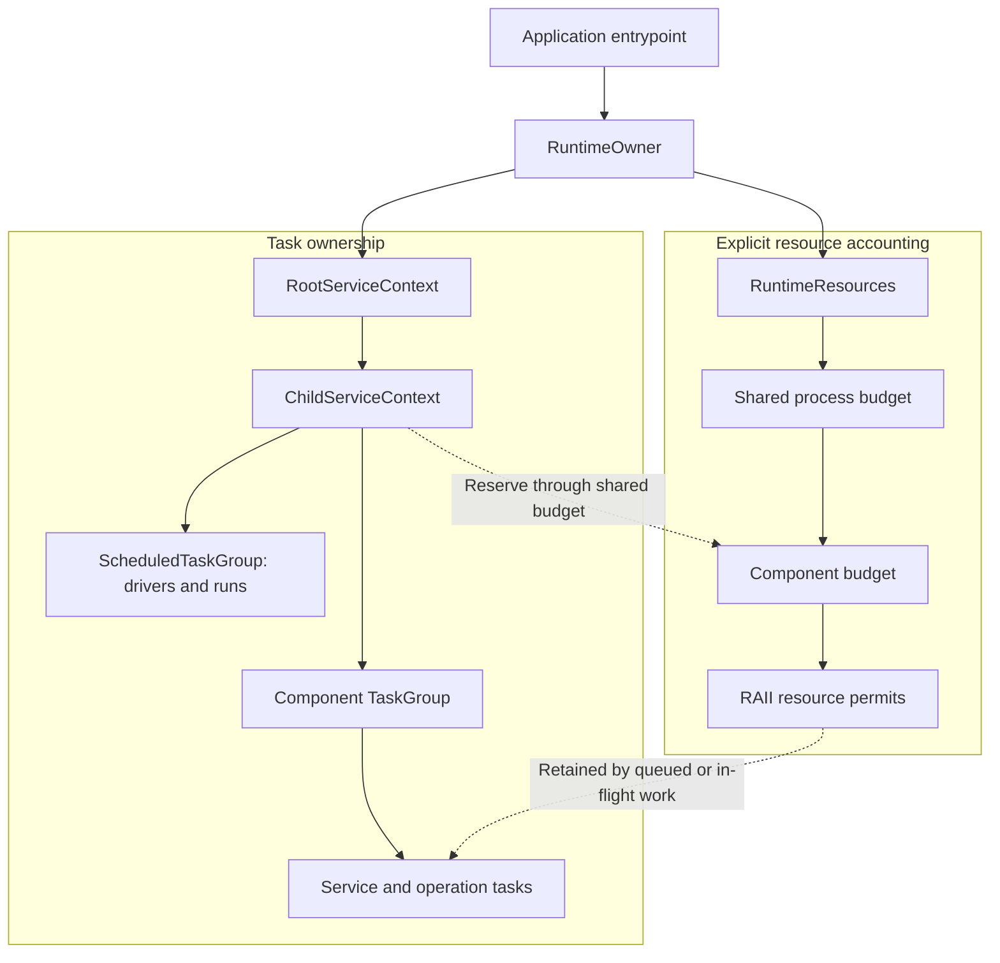
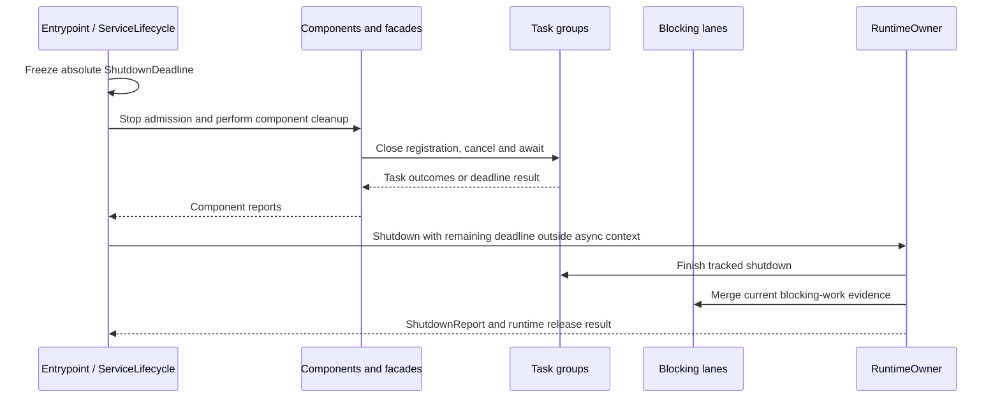

`rocketmq-runtime` gives services an explicit owner for asynchronous work and a bounded path for blocking work. It builds on Tokio, but its integration boundary is a service capability rather than arbitrary access to a global runtime.

The design answers three independent questions: who must stop a task, which capacity pays for its resources, and what evidence remains when shutdown runs out of time?

## The application owns the runtime

A production entrypoint constructs a `RuntimeOwner`. `RuntimeOwner::plan(config)` validates configuration; `build` performs resource discovery and runtime construction. The owner exposes a non-cloneable `RootServiceContext`, from which the application derives `ChildServiceContext` values.

Libraries receive a child context or a narrower `TaskSpawner`. They do not discover an ambient runtime and create a fallback when one is absent. The [first-message application](https://github.com/mxsm/rocketmq-rust/blob/main/rocketmq-website/examples/first-message/src/main.rs) demonstrates this by injecting a child context into `ClientRuntime::try_new`.

The two trees are related by explicit reservations, not by counting every task as all of its process memory. Creating a task scope does not automatically account for arbitrary allocations. A component can have many operation contexts under one stable task owner.

## Task scopes and operation scopes

Cloning a context or task group shares the same owner and cancellation token. Creating a child establishes independent cancellation within the parent lifetime: parent cancellation propagates downward; cancelling the child does not cancel siblings or the parent.

Use component scopes for long-lived services and `OperationContext` for bounded requests or restartable work. An operation supplies its own cancellation/deadline without creating a new task group. That keeps request cardinality out of the ownership tree.

| Submission style | Lifetime behavior |
| --- | --- |
| `spawn` / `spawn_service` | Tracks the future; the service observes cancellation and performs its ordered cleanup |
| `spawn_cancellable_service` | Drops the future when the owner is cancelled; use only when dropping at that point is safe |
| `spawn_operation` | Observes owner cancellation and the operation's cancellation/deadline |
| `spawn_draining_operation` | Accepted work can continue after owner cancellation, still bounded by operation and group shutdown |
| `spawn_with_handle` | Provides a task-specific join handle while retaining group ownership |

Dropping a context handle is not graceful shutdown: active work can keep its group alive. `cancel` requests cancellation; it does not wait for completion. Use the corresponding shutdown or operation wait to obtain completion evidence.

Task-group admission moves through open, closing and closed states. Shutdown stops new registrations, cancels work and caches its report. A creation request racing with shutdown must respect admission results; a new child is not a way to escape the parent's deadline.

## Blocking work retains capacity until it exits

Child contexts expose managed `storage_io`, `metadata_io` and `cpu_crypto` executors. Lanes have individual concurrency/queue policies and share the owner's global blocking admission budget. Cloning a lane does not create another pool.

Queue timeout bounds admission waiting. Task timeout bounds the caller's wait after admission. Absolute-deadline methods cap both phases with the same deadline. An already-running blocking closure cannot be stopped merely by dropping its future or timing out its caller.

The closure retains its permit until it actually exits. Diagnostics can therefore report `TimedOutStillRunning` after the caller has returned. Releasing the permit early would admit more real work than the configured limit permits.

`BlockingKind::LongRunning` is rejected by this short-work boundary. A long-lived blocking loop needs an explicitly owned thread or domain service with stop and join behavior. The isolated compatibility constructor does not automatically enroll its independent budget in the managed root lanes.

## Resource reservations and overload

The production owner discovers a process memory limit from an explicit environment setting, Linux cgroups or host memory, or accepts a supplied `ProcessMemoryLimit`. The budget APIs account for admitted count, retained bytes and optional rate limits along the ancestor chain. They are not an operating-system limit on every allocation or resident-memory byte.

`ResourcePermit` carries count/byte reservations through RAII ownership. Control-class work may use reserved control capacity; data work cannot consume that reserve. Derive narrower component budgets from the shared process budget so siblings still compete under the intended global limit.

Queue policy is part of the data contract:

| Policy | Appropriate meaning |
| --- | --- |
| `Reject` | Return overload instead of accepting more work |
| `WaitUntilDeadline` | Wait only within the caller's bounded admission window |
| `CoalesceLatest` | A newer item can replace older queued state |
| `DropStale` | Stale work can be discarded under the selected rule |
| `CloseSlowConsumer` | A slow downstream consumer should be closed |

Do not choose coalescing for events that must all be processed. Also choose the dequeue API deliberately: `recv`/`try_pop` release the permit on dequeue, while `recv_budgeted`/`try_pop_budgeted` retain it in a `BudgetedItem` during processing. Accounting lifetime should match actual data retention.

## Scheduled jobs and metadata I/O

`ScheduledTaskGroup` owns both drivers and runs. Fixed delay waits after a run finishes; fixed-rate no-overlap skips a run while the prior one is active; allow-overlap can admit concurrent runs without a separate per-job concurrency ceiling. Current fixed-rate drivers sleep between submission attempts and measure drift; they are not an absolute-clock catch-up scheduler.

For metadata snapshots, `MetadataIoActor` owns a bounded coordinator and uses the shared metadata blocking lane. Submission acceptance and durable completion are separate outcomes. Queued generations can coalesce, and a later durable generation can satisfy an earlier waiter for the same logical resource. A timeout does not prove that a filesystem write stopped.

These mechanisms reduce repeated infrastructure while preserving explicit differences between “queued,” “running” and “durable.”

## Coordinate shutdown with one deadline

`ServiceLifecycle` distinguishes Starting, Ready, Draining, Stopped and Failed. Dependency readiness is separate from process liveness. The first shutdown request freezes the deadline; repeated signals must not extend the available time.

Close client facades and mutable service composition roots before their shared runtime. `shutdown_runtime_blocking_until` consumes the owner and must be invoked outside a Tokio asynchronous context. It includes tracked task shutdown, so callers do not need an extra task-shutdown pass merely to satisfy a checklist.

At the deadline, unfinished tracked tasks may be aborted. Blocking closures may still be running. Immediate/background shutdown and `Drop` are different cleanup paths and do not establish that every future completed its ordered cleanup.

## Interpret the report precisely

`ShutdownReport::is_healthy` checks failures, panics, timeouts, leaks, still-running blocking/detached work and child reports. An `aborted` count alone does not make that predicate false. Consequently, a healthy predicate is useful evidence within its contract, not proof that every task finished naturally or every external effect committed.

Inspect component-specific reports too: a Store can report flush/lease/retirement state that a generic task report cannot infer. For operational APIs, use the bounded sanitized `RuntimeDiagnosticsViewV1` instead of exposing raw task names, arguments or configuration. The API's caller still owns authentication.

Configuration contract violations and operational `RuntimeError` values are distinct error channels. Preserve that distinction when adapting startup errors rather than converting every failure to a panic.

## Compatibility and next steps

`RuntimeContext` supports migration or tests inside an existing Tokio runtime; it does not own or shut down that host runtime and uses a permissive test budget. Retained executor/thread adapters have their own boundaries. They should not be described as identical to production `RuntimeOwner` composition.

Read [storage design](storage.md) for another example of ownership extending beyond a caller's wait, and [developer guide](../contributing/development-guide.md) for focused runtime tests.

Sources: [runtime guide](https://github.com/mxsm/rocketmq-rust/blob/main/rocketmq-runtime/README.md), [public exports](https://github.com/mxsm/rocketmq-rust/blob/main/rocketmq-runtime/src/public_api.rs), [task groups](https://github.com/mxsm/rocketmq-rust/blob/main/rocketmq-runtime/src/task_group.rs), [blocking executor](https://github.com/mxsm/rocketmq-rust/blob/main/rocketmq-runtime/src/blocking/executor.rs), [shutdown report](https://github.com/mxsm/rocketmq-rust/blob/main/rocketmq-runtime/src/shutdown_report.rs).
